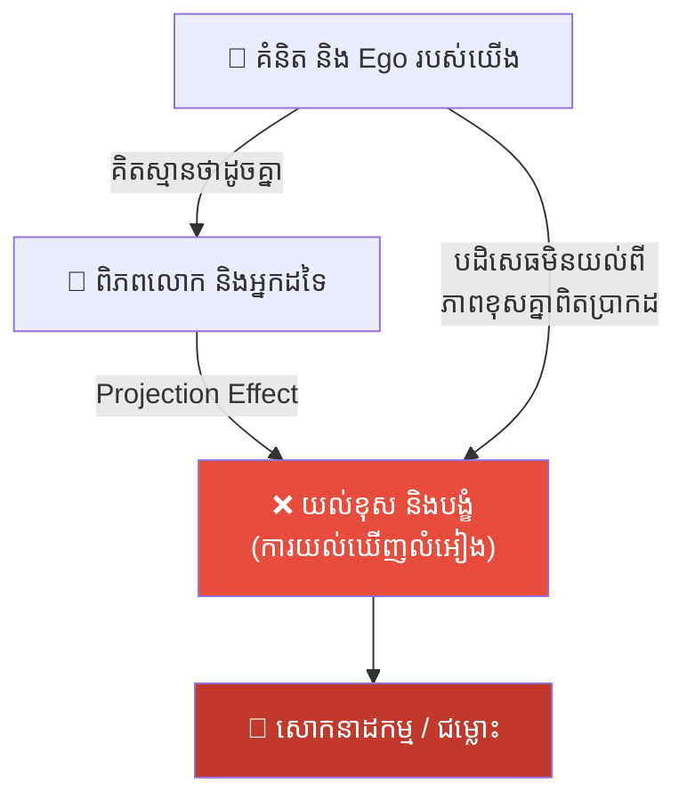
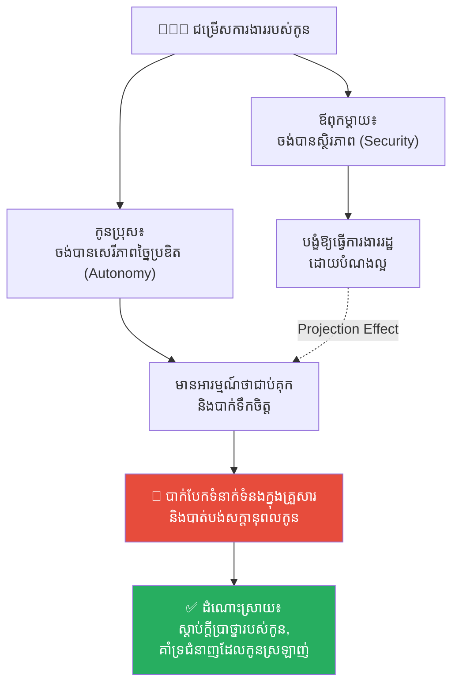
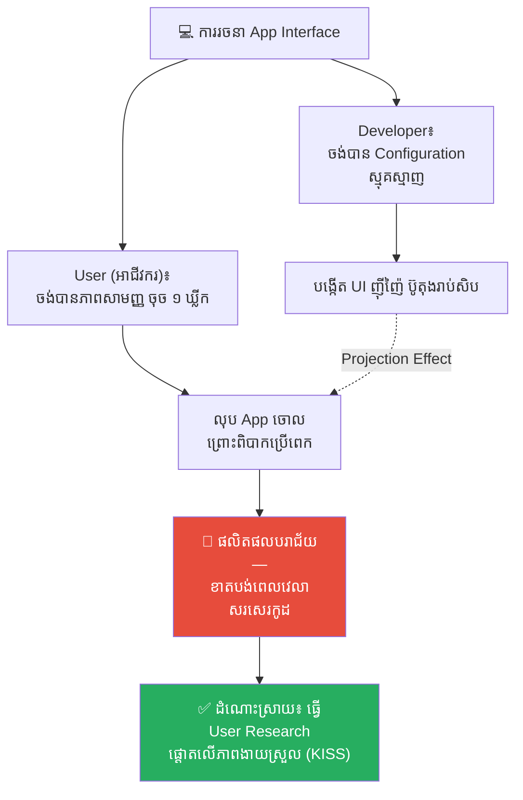
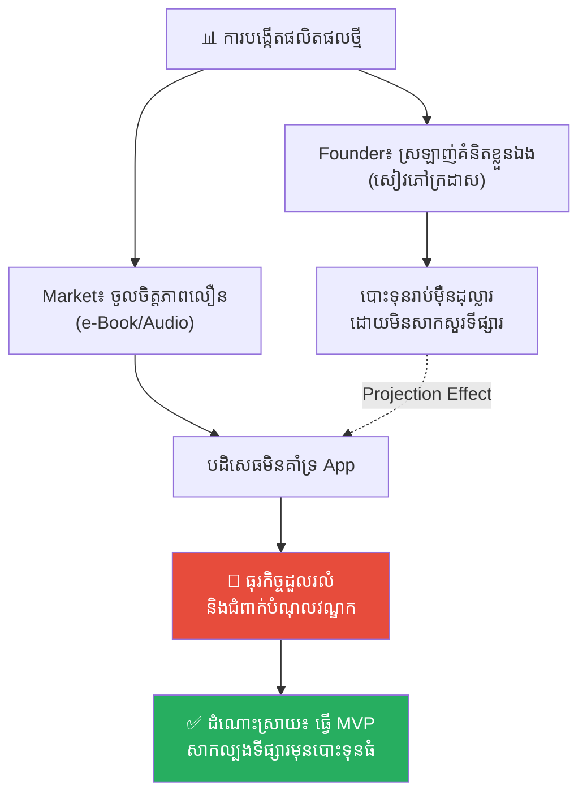
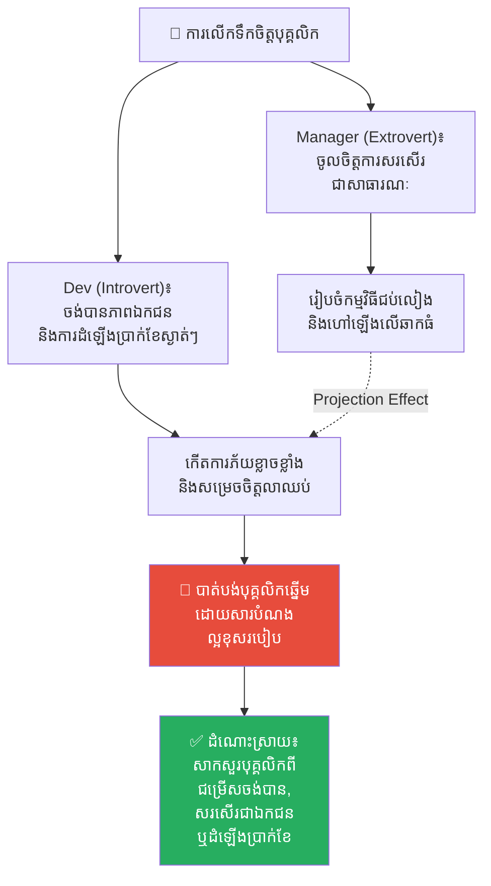
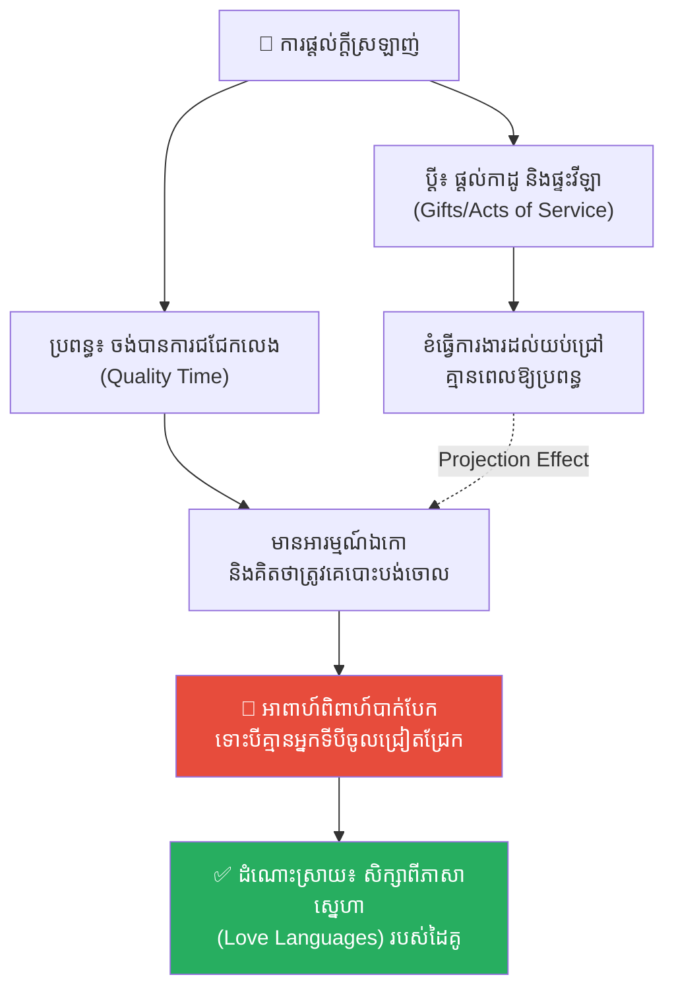
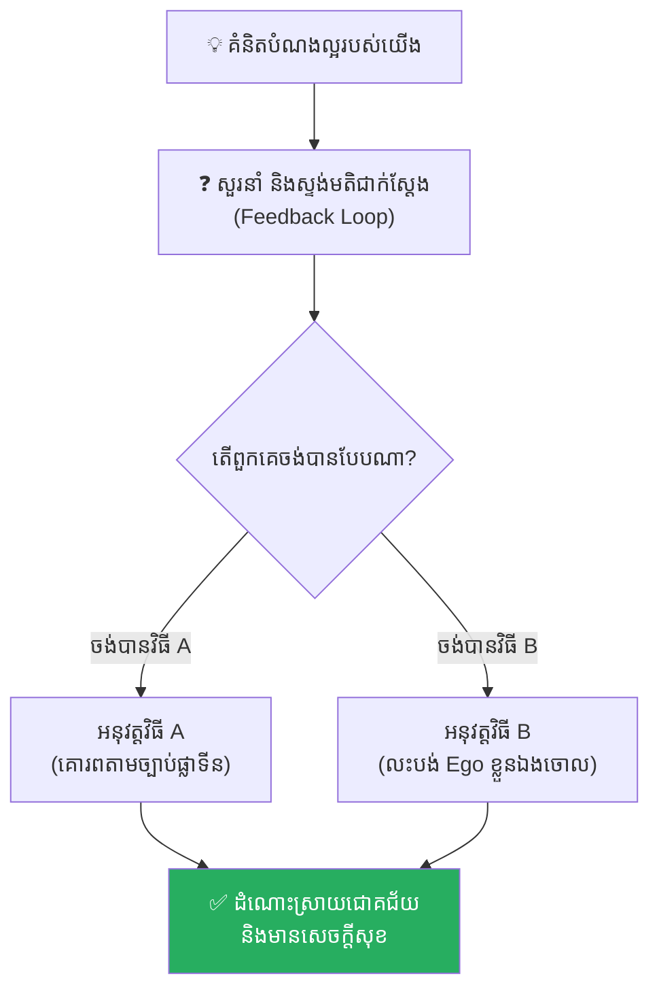

# Projection Effect (ការយកគំនិតខ្លួនឯងទៅដាក់លើអ្នកដទៃ)៖ គ្រោះថ្នាក់នៃការគិតស្មានថាពិភពលោកទាំងមូលចង់បានដូចខ្លួនឯង

**Author:** ichamrong  
**Date:** 2026-05-17  
**Tags:** #projection-effect #psychology #mental-models #life-lessons #chinese-history #critical-thinking  
**Category:** Concepts  
**Read Time:** ~15 min  

---

## 📌 មាតិកា (Table of Contents)
- [អន្ទាក់ផ្លូវចិត្ត (The Trap)](#អន្ទាក់ផ្លូវចិត្ត-the-trap)
- [១. រឿងព្រេងប្រវត្តិសាស្ត្រចិន៖ ជិន វិនកុង និង ជៀ ជឺធួយ (The Legend of Jie Zitui)](#1)
  - [សោកនាដកម្មនៅលើភ្នំ មៀនសាន (The Tragedy on Mount Mianshan)](#1-1)
- [២. បញ្ហា៖ ការឆ្លុះបញ្ចាំងនៃ Ego របស់អ្នក (The Issue: The Reflection of Your Ego)](#2)
- [៣. ឧទាហរណ៍ជាក់ស្តែងក្នុងពិភពពិត (Real World Examples)](#3)
  - [ឧទាហរណ៍ទី ១ — កម្រិតស្រាល (គ្រួសារ)៖ ការរំពឹងទុករបស់ឪពុកម្តាយ (The Parental Projection)](#3-1)
  - [ឧទាហរណ៍ទី ២ — កម្រិតមធ្យម (បច្ចេកទេស)៖ Developer និង Feature ដ៏ស្មុគស្មាញ (The Dev vs. User UI Standoff)](#3-2)
  - [ឧទាហរណ៍ទី ៣ — កម្រិតមធ្យម (ធុរកិច្ច)៖ ការបង្កើតផលិតផលតាមចិត្តខ្លួនឯង (The Founder's Validation Illusion)](#3-3)
  - [ឧទាហរណ៍ទី ៤ — កម្រិតមធ្យម (សង្គម/គ្រប់គ្រង)៖ ការលើកទឹកចិត្តបុគ្គលិករបស់ Manager (The Manager's Motivation Trap)](#3-4)
  - [ឧទាហរណ៍ទី ៥ — កម្រិតធ្ងន់ (ទំនាក់ទំនង)៖ ការផ្តល់ក្តីស្រឡាញ់តាមរបៀបខ្លួនឯង (Love Languages Disconnect)](#3-5)
- [៤. ដំណោះស្រាយទូទៅ៖ ច្បាប់ផ្លាទីន (The General Solution: The Platinum Rule)](#4)
- [សេចក្តីសន្និដ្ឋាន (Conclusion)](#conclusion)
- [ឯកសារយោង (References)](#references)
- [Related Posts](#related-posts)

---

## អន្ទាក់ផ្លូវចិត្ត (The Trap)

តើអ្នកធ្លាប់មានបំណងល្អចង់ជួយនរណាម្នាក់ ប៉ុន្តែលទ្ធផលចុងក្រោយបែរជាការដាក់គំនាប បង្កើតភាពឈឺចាប់ ឬរុញច្រានពួកគេឱ្យទៅរកសេចក្តីស្លាប់ និងសោកនាដកម្មទៅវិញទេ?

មនុស្សភាគច្រើនតែងតែជឿជាក់លើច្បាប់មាសមួយគឺ៖ **«ចូរប្រព្រឹត្តទៅលើអ្នកដទៃ ដូចអ្វីដែលអ្នកចង់ឱ្យអ្នកដទៃប្រព្រឹត្តមកលើអ្នក» (The Golden Rule)**។ ប៉ុន្តែនៅក្នុងការពិត ច្បាប់ដ៏មានតម្លៃនេះមានចន្លោះប្រហោងដ៏ធំមួយ គឺវាគិតស្មានថា **«អ្វីដែលល្អសម្រាប់យើង គឺល្អឥតខ្ចោះសម្រាប់អ្នកដទៃដូចគ្នា»**។

នៅពេលយើងខ្វះការយល់ដឹងពីចំណុចនេះ យើងនឹងធ្លាក់ចូលទៅក្នុងកម្មវិធីមេរោគផ្លូវចិត្តដ៏គ្រោះថ្នាក់មួយហៅថា **Projection Effect (ឥទ្ធិពលនៃការយកគំនិតខ្លួនឯងទៅដាក់លើអ្នកដទៃ)**។

ដើម្បីយល់ដឹងឱ្យបានគ្រប់ជ្រុងជ្រោយ នេះជាផែនទីបង្ហាញផ្លូវសម្រាប់អត្ថបទនេះ៖
1. **រឿងព្រេងប្រវត្តិសាស្ត្រ (The Historic Legend)** — រឿងរ៉ាវដ៏ជូរចត់ និងអណ្តាតភ្លើងលើភ្នំមៀនសាន ដែលដុតបំផ្លាញជីវិតអ្នកមានគុណព្រោះតែបំណងល្អរបស់ព្រះរាជា។
2. **បញ្ហា (The Issue)** — តើអ្វីទៅជា Projection Effect/Bias នៅក្នុងចិត្តវិទ្យា?
3. **ឧទាហរណ៍ជាក់ស្តែងក្នុងពិភពពិត (Real World Examples)** — ពិនិត្យមើលឥទ្ធិពលនេះក្នុងកម្រិតគ្រួសារ ការងារបច្ចេកទេស ធុរកិច្ច ការគ្រប់គ្រង និងទំនាក់ទំនងស្នេហា។
4. **ដំណោះស្រាយទូទៅ (The General Solution)** — ការផ្លាស់ប្តូរទៅកាន់ **«ច្បាប់ផ្លាទីន» (The Platinum Rule)** ដើម្បីគោរពជម្រើសពិតរបស់អ្នកដទៃ។

---

## ១. រឿងព្រេងប្រវត្តិសាស្ត្រចិន៖ ជិន វិនកុង និង ជៀ ជឺធួយ (The Legend of Jie Zitui)

នាសម័យនិទាឃរដូវ និងសរទរដូវ (Spring and Autumn Period) នៃប្រវត្តិសាស្ត្រចិន មានរឿងរ៉ាវដ៏ល្បីល្បាញមួយទាក់ទងនឹងព្រះរាជបុត្រមួយអង្គព្រះនាម **ឆុងអឺ (Chong'er)** ដែលបានភៀសខ្លួនកណ្តាលសង្គ្រាម ហើយបានវង្វេងនៅក្នុងព្រៃជ្រៅដាច់ស្រយាល។ ព្រះអង្គទ្រង់ស្រេកឃ្លានយ៉ាងខ្លាំងរហូតដល់សន្លប់បាត់ស្មារតី និងហៀបនឹងក្ស័យព្រះជន្មទៅហើយ។

ស្ថិតក្នុងស្ថានភាពទាល់ច្រកនោះ មេទ័ព និងជាអ្នកបម្រើដ៏ស្មោះត្រង់ម្នាក់នាម **ជៀ ជឺធួយ (Jie Zitui)** បានសុខចិត្តយកកាំបិតមកកាត់សាច់ផ្លូវរបស់ខ្លួនឯងមួយដុំ រួចយកមកស្ងោរធ្វើជាស៊ុបក្តៅៗបញ្ចុកព្រះរាជបុត្រ ឆុងអឺ ដើម្បីសង្គ្រោះព្រះជន្មរបស់ព្រះអង្គឱ្យរួចផុតពីមរណភាព។ សកម្មភាពលះបង់សាច់ស្រស់ឈាមស្រស់នេះ គឺជាសក្ខីភាពនៃភាពស្មោះត្រង់ដ៏មហាសាលដែលគ្មានអ្វីប្រៀបផ្ទឹមបាន។

ដប់ប្រាំបួនឆ្នាំបានកន្លងផុតទៅ ព្រះរាជបុត្រ ឆុងអឺ បានយាងត្រឡប់ពីការនិរទេសខ្លួន (Exile) មកគ្រងរាជ្យ និងបានឡើងជាព្រះមហាក្សត្រដ៏មានអំណាចមួយអង្គព្រះនាម **ជិន វិនកុង (Duke Wen of Jin)**។ ព្រះអង្គបានប្រកាសផ្តល់រង្វាន់ មាសប្រាក់ និងបុណ្យស័ក្តិយ៉ាងគគ្រឹកគគ្រេងដល់មនុស្សគ្រប់រូបដែលធ្លាប់បានជួយសង្គ្រោះព្រះអង្គ ប៉ុន្តែទ្រង់បែរជាភ្លេចរំលឹកគុណ **ជៀ ជឺធួយ** ដែលធ្លាប់បានលះបង់កាត់សាច់ខ្លួនឯងដើម្បីប្តូរយកព្រះជន្មព្រះអង្គទៅវិញ។

ទោះជាយ៉ាងនេះក្តី **ជៀ ជឺធួយ** មិនបានត្អូញត្អែរ ឬទាមទារសុំលាភសក្ការៈ (Reward) ណាមួយឡើយ។ គាត់គ្រាន់តែរៀបចំលីសំពាយ និងដឹកដៃម្តាយចាស់ជរារបស់ខ្លួន ចាកចេញទៅរស់នៅយ៉ាងស្ងប់ស្ងាត់នៅលើភ្នំ **មៀនសាន (Mount Mianshan)** ឆ្ងាយដាច់ស្រយាលតែពីរនាក់ម្តាយនិងកូនប៉ុណ្ណោះ។ សម្រាប់គាត់ ការដែលបានឃើញស្តេចរជ្ជទាយាទឡើងគ្រងរាជ្យដឹកនាំប្រជារាស្ត្រដោយសុខសន្តិភាព គឺគ្រប់គ្រាន់ហួសពីការចង់បានទៅហើយ។

---

### សោកនាដកម្មនៅលើភ្នំ មៀនសាន (The Tragedy on Mount Mianshan)

រហូតដល់ថ្ងៃមួយ ព្រះរាជា ជិន វិនកុង ស្រាប់តែនឹកឃើញដល់រឿងរ៉ាវអតីតកាល ហើយក៏កើតមានក្តីវិប្បដិសារីយ៉ាងខ្លាំង។ ព្រះអង្គបានប្រញាប់ប្រញាល់នាំសេនាអាមាត្យឡើងទៅលើភ្នំ មៀនសាន ដើម្បីហៅ **ជៀ ជឺធួយ** ឱ្យចុះមកទទួលបុណ្យស័ក្តិជាសេនាប្រមុខ និងទ្រព្យសម្បត្តិមហាសាល។ ប៉ុន្តែ **ជៀ ជឺធួយ** បានបដិសេធយ៉ាងដាច់អហង្ការ។ គាត់មិនព្រមចុះពីភ្នំឡើយ ព្រោះសេចក្តីប្រាថ្នាតែមួយគត់របស់គាត់ គឺចង់ចំណាយពេលវេលាដ៏សេសសល់ដើម្បីមើលថែម្តាយចាស់ជរាដោយក្តីស្ងប់ស្ងាត់ (Tranquility) និងរស់នៅជាមួយធម្មជាតិ។

ការបដិសេធនេះបានធ្វើឱ្យព្រះរាជា ជិន វិនកុង ខ្ញាល់ និងយល់ច្រឡំយ៉ាងខ្លាំង។ ដោយការគិតស្មានថា មនុស្សគ្រប់រូបនៅលើផែនដី តែងតែខ្លាចសេចក្តីស្លាប់ និងមានការលោភលន់ចង់បានបុណ្យស័ក្តិមាសប្រាក់ដូចព្រះអង្គដែរនោះ ព្រះអង្គក៏បានចេញព្រះបញ្ជាដ៏ឃោរឃៅមួយគឺ **«ដុតភ្នំ មៀនសាន ទាំងមូល»** ពីបីទិស ដោយទុកច្រកមួយសម្រាប់ឱ្យជៀ ជឺធួយរត់ចេញ។ ព្រះអង្គបានត្រិះរិះដោយក្តីជឿជាក់ថា៖ *«នៅចំពោះមុខអណ្តាតភ្លើង និងសេចក្តីស្លាប់ ជៀ ជឺធួយ ប្រាកដជារត់ចេញមកអង្វរយើងជាមិនខាន!»*

ប៉ុន្តែគ្រប់យ៉ាងបានប្រែប្រួលខុសស្រឡះពីការរំពឹងទុក។ អណ្តាតភ្លើងបានឆាបឆេះយ៉ាងសន្ធោសន្ធៅអស់រយៈពេលបីថ្ងៃបីយប់ តែស្រមោលរបស់ **ជៀ ជឺធួយ** នៅតែមិនលេចចេញមកឡើយ។ លុះពេលភ្លើងរលត់ ព្រះរាជាបានរត់ឡើងទៅលើភ្នំទាំងត្រដាបត្រដួស តែអ្វីដែលទ្រង់បានទតឃើញ គឺត្រឹមតែសាកសពដ៏គួរឱ្យសង្វេគរបស់ **ជៀ ជឺធួយ** និងម្តាយចាស់ ដែលកំពុងអោបដើមឈើលីវធំមួយជាប់ ហើយត្រូវបានភ្លើងដុតខ្លោចក្លាយជាផេះផង់ទៅហើយ។

ព្រះរាជា ជិន វិនកុង បានលុតជង្គង់ចុះនៅចំពោះមុខគំនរផេះផង់នោះ ទឹកព្រះនេត្រហូរស្រក់សស្រាក់ យំសោកបោកខ្លួនដោយក្តីសោកស្តាយ និងវិប្បដិសារីដ៏ជ្រាលជ្រៅបំផុតដែលមិនអាចកែប្រែបាន។ ព្រះអង្គចង់ផ្តល់«សេចក្តីសុខ» តែលទ្ធផលគឺព្រះអង្គបាន«ដុតសម្លាប់»អ្នកមានគុណដ៏ល្អបំផុតរបស់ខ្លួនទៅវិញ (រឿងរ៉ាវនេះហើយគឺជាប្រភពដើមនៃ **ពិធីបុណ្យហានស៉ី ឬ បុណ្យបង្ហុយផ្សែងត្រជាក់ (Hanshi Festival)** នៅក្នុងប្រវត្តិសាស្ត្រចិន)។

---

## ២. បញ្ហា៖ ការឆ្លុះបញ្ចាំងនៃ Ego របស់អ្នក (The Issue: The Reflection of Your Ego)

នៅក្នុងចិត្តវិទ្យា (Psychology) បាតុភូតនេះត្រូវបានគេហៅថា **Projection Effect (ឥទ្ធិពលនៃការយកគំនិតខ្លួនឯងទៅដាក់លើអ្នកដទៃ)** ឬ **Projection Bias**។ 

វាគឺជាទំនោរចិត្តដែលខួរក្បាលរបស់មនុស្ស តែងតែគិតស្មានថា៖
* អ្វីដែលយើង **ចូលចិត្ត** អ្នកដទៃក៏ប្រាកដជា **ចូលចិត្ត** ដូចគ្នា។
* អ្វីដែលយើង **ចង់បាន** អ្នកដទៃក៏ប្រាកដជា **ចង់បាន** ដូចគ្នា។
* ស្តង់ដារ និងជំនឿរបស់យើង គឺជាស្តង់ដារ និងជំនឿរបស់មនុស្សទូទៅនៅលើពិភពលោក។

និយាយឱ្យសាមញ្ញ យើងមិនបានមើលឃើញអ្នកដទៃទៅតាម «ការពិតជាក់ស្តែង» របស់ពួកគេឡើយ។ ផ្ទុយទៅវិញ យើងចាត់ទុកអ្នកដទៃដូចជា **«កញ្ចក់ឆ្លុះ»** ដើម្បីមើលគំនិត និង Ego របស់ខ្លួនឯងប៉ុណ្ណោះ។

* **ព្រះរាជា ជិន វិនកុង៖** ស្រឡាញ់អំណាច កិត្តិយស និងកេរ្តិ៍ឈ្មោះ។ ទ្រង់ទាញសេចក្តីសន្និដ្ឋានថា ជៀ ជឺធួយ ក៏ត្រូវការអំណាច និងកេរ្តិ៍ឈ្មោះដែរ។
* **ជៀ ជឺធួយ៖** ស្រឡាញ់សេចក្តីស្ងប់ និងភាពសាមញ្ញ។ គាត់ចង់បានតែសេរីភាពផ្លូវចិត្តប៉ុណ្ណោះ។

---

## ៣. ឧទាហរណ៍ជាក់ស្តែងក្នុងពិភពពិត

ដើម្បីយល់ដឹងឱ្យកាន់តែស៊ីជម្រៅ ផ្លូវការសិក្សានឹងនាំអ្នកទៅពិនិត្យមើល **ឧទាហរណ៍ចំនួន ៥ កម្រិតខុសៗគ្នា** ក្នុងជីវិតរស់នៅប្រចាំថ្ងៃ៖

---

### ឧទាហរណ៍ទី ១ — កម្រិតស្រាល (គ្រួសារ)៖ ការរំពឹងទុករបស់ឪពុកម្តាយ (The Parental Projection)

**ស្ថានភាព៖** ឪពុកម្តាយដែលស្រឡាញ់ការងាររាជការ ឬការងារធនាគារដែលស្ថិតស្ថេរ បង្ខំកូនប្រុសឱ្យដើរតាមគន្លងនេះ។

* **ភាគី A (ឪពុកម្តាយ)៖** យល់ថា «ការងាររដ្ឋ និងធនាគារ» គឺជាកំពូលនៃសេចក្តីសុខ និងស្ថិរភាពជីវិត ព្រោះពួកគេធ្លាប់រស់កាត់ឆ្លងសម័យកាលសង្គ្រាម និងភាពក្រីក្រ។ ពួកគេប្រឹងប្រែងរៀបចំខ្សែស្រឡាយ និងទិញតំណែងឱ្យកូនដោយគិតថា៖ *«យើងប្រឹងប្រែងក៏ដើម្បីតែអនាគតកូនប៉ុណ្ណោះ»*។
* **ភាគី B (កូនប្រុស)៖** មានដុងសិល្បៈច្នៃប្រឌិត និងចង់ក្លាយជាអ្នករចនាគេហទំព័រ (UI/UX Designer) ឬអ្នកបង្កើត Startup។ គាត់មានអារម្មណ៍ថាការរៀននិងធ្វើការងាររដ្ឋបាលដដែលៗ គឺជាការជាប់ឃុំឃាំង និងធ្វើឱ្យគាត់កើតជំងឺបាក់ទឹកចិត្ត (Depression)។

**ការពិតដ៏ជូរចត់៖**
ឪពុកម្តាយកំពុងតែយកក្តីស្រមៃ និងផ្នត់គំនិតចាស់ពីសម័យមុន (Security) មកគ្របដណ្តប់លើកូនប្រុសជំនាន់ថ្មីដែលត្រូវការភាពច្នៃប្រឌិត (Autonomy)។ លទ្ធផល៖ កូនប្រុសក្លាយជាមនុស្សដែលបំពេញការងារទាំងគ្មានព្រលឹង គ្មានក្តីសុខក្នុងជីវិត និងចាប់ផ្តើមស្អប់ខ្ពើមគ្រួសារខ្លួនឯង។

**ដំណោះស្រាយ៖**
ឪពុកម្តាយត្រូវយល់ថា កូនជាបុគ្គលឯករាជ្យ មិនមែនជាកម្មសិទ្ធិ ឬជាឱកាសទីពីរដើម្បីសម្រេចក្តីស្រមៃដែលឪពុកម្តាយធ្លាប់ខកខានកាលពីក្មេងនោះឡើយ។ ចូរធ្វើជា «គ្រាប់ពូជដែលផ្តល់ជីជាតិ» មិនមែនធ្វើជា «កន្ត្រៃដែលកាត់តម្រឹមមែកធាង» តាមចិត្តខ្លួនឯងនោះទេ។

---

### ឧទាហរណ៍ទី ២ — កម្រិតមធ្យម (បច្ចេកទេស)៖ Developer និង Feature ដ៏ស្មុគស្មាញ (The Dev vs. User UI Standoff)

**ស្ថានភាព៖** Developer ម្នាក់បង្កើត Interface របស់ App សម្រាប់គ្រប់គ្រងគណនេយ្យអាជីវកម្មខ្នាតតូច។

* **ភាគី A (Developer)៖** ចូលចិត្តបច្ចេកវិទ្យា ចូលចិត្តកែសម្រួល Configuration ដ៏ស្មុគស្មាញ និងប្រើប្រាស់ Shortcut Keys។ គាត់បានបង្កើត UI មួយដែលមានប៊ូតុងរាប់សិប និងត្រូវការលក្ខខណ្ឌបញ្ជាក់រញ៉េរញ៉ៃ ដោយគិតថា៖ *«វាឡូយ និងមានអំណាចខ្លាំងណាស់ យូសឺប្រាកដជាចូលចិត្តកែតម្រូវតាមចិត្តរៀងៗខ្លួនមិនខាន!»*
* **ភាគី B (User/អាជីវករលក់ចាប់ហួយ)៖** ជាមនុស្សធម្មតា មិនសូវចេះបច្ចេកវិទ្យា និងមានពេលរវល់លក់ដូរខ្លាំង។ អ្វីដែលពួកគេចង់បានគឺប៊ូតុងសាមញ្ញមួយ៖ *«ចុចមួយឃ្លីក គណនាចំណូលប្រចាំថ្ងៃ រួចរាល់»*។ ពេលឃើញ App ស្មុគស្មាញ ពួកគេលែងចង់ប្រើប្រាស់ និងលុប App ចោលភ្លាមៗ។

**ការពិតដ៏ជូរចត់៖**
Developer យកចំណូលចិត្តបច្ចេកទេសរបស់ខ្លួនឯង (Tech-savvy preferences) ទៅដាក់លើអ្នកប្រើប្រាស់ទូទៅ (Non-tech users)។ ផលិតផលដែលអះអាងថាមាន Feature ខ្លាំងក្លា ចុងក្រោយត្រូវបរាជ័យ និងគ្មានអ្នកប្រើប្រាស់សូម្បីតែម្នាក់។

**ដំណោះស្រាយ៖**
អនុវត្តគោលការណ៍ **KISS (Keep It Simple, Stupid)**។ មុននឹងសរសេរកូដ ត្រូវចុះទៅមើលការរស់នៅ និងការប្រើប្រាស់ជាក់ស្តែងរបស់ Target Users។ កុំសន្មតថាពួកគេឆ្លាតបច្ចេកវិទ្យាដូចអ្នក។

---

### ឧទាហរណ៍ទី ៣ — កម្រិតមធ្យម (ធុរកិច្ច)៖ ការបង្កើតផលិតផលតាមចិត្តខ្លួនឯង (The Founder's Validation Illusion)

**ស្ថានភាព៖** Founder ម្នាក់ចង់បង្កើត App ជួលសៀវភៅអានតម្លៃថ្លៃ។

* **ភាគី A (Founder)៖** ខ្លួនឯងជាអ្នកចូលចិត្តអានសៀវភៅក្រដាសក្រាស់ៗ និងចូលចិត្តជួលសៀវភៅសរសេរដោយដៃ។ គាត់សន្មតថា៖ *«មនុស្សឆ្លាតៗគ្រប់គ្នាក៏ចូលចិត្តអានសៀវភៅបែបនេះដែរ ហើយពួកគេនឹងសុខចិត្តបង់ប្រាក់ជួលប្រចាំខែមិនខាន»*។ គាត់ខ្ចីលុយធនាគាររាប់ម៉ឺនដុល្លារមកជួលឃ្លាំងស្តុកសៀវភៅ និងសង់ App ដ៏ប្រណីត។
* **ភាគី B (ទីផ្សារ និងអតិថិជន)៖** យុវជនបច្ចុប្បន្នចូលចិត្តអាន e-Book ឬស្តាប់ Audio Book ខ្លីៗនៅលើទូរស័ព្ទដៃពេលធ្វើដំណើរ ជាងការកាន់សៀវភៅក្រាស់ៗដ៏ធ្ងន់។ ពួកគេបដិសេធមិនប្រើ App នោះឡើយ។

**ការពិតដ៏ជូរចត់៖**
Founder យល់ច្រឡំថាចំណូលចិត្តផ្ទាល់ខ្លួន (Niche hobby) គឺជាតម្រូវការទីផ្សារដ៏ធំធេង (Mass market demand)។ App ត្រូវបិទទ្វារក្នុងរយៈពេល ៦ ខែ ដោយបន្សល់ទុកនូវបំណុលវណ្ឌក។

**ដំណោះស្រាយ៖**
បង្កើត **MVP (Minimum Viable Product)** ដើម្បីតេស្តសម្មតិកម្មជាមុន។ កុំសួរខ្លួនឯងថា *«តើគំនិតនេះឡូយទេ?»* តែត្រូវសួរទីផ្សារពិតប្រាកដថា *«តើអ្នកសុខចិត្តដកលុយពីហោប៉ៅមកទិញវាទេ?»*។

---

### ឧទាហរណ៍ទី ៤ — កម្រិតមធ្យម (សង្គម/គ្រប់គ្រង)៖ ការលើកទឹកចិត្តបុគ្គលិករបស់ Manager (The Manager's Motivation Trap)

**ស្ថានភាព៖** Manager ម្នាក់ចង់លើកទឹកចិត្តបុគ្គលិកឆ្នើមម្នាក់ដែលជាអ្នកសរសេរកូដដ៏ស្ងៀមស្ងាត់ (Introvert Developer)។

* **ភាគី A (Manager)៖** ជាមនុស្សពូកែនិយាយ (Extrovert) និងចូលចិត្តការកោតសរសើរជាសាធារណៈ (Public praise)។ គាត់ក៏រៀបចំកម្មវិធីជប់លៀងទូទាំងក្រុមហ៊ុន ហៅបុគ្គលិកម្នាក់នោះឡើងលើឆាក ពាក់មេដាយ និងឱ្យឡើងនិយាយចំណាប់អារម្មណ៍នៅចំពោះមុខមនុស្សរាប់រយនាក់ ដោយគិតថា៖ *«នេះគឺជាកិត្តិយស និងជាការលើកទឹកចិត្តដ៏អស្ចារ្យបំផុត ដែលពួកគេនឹងគ្មានថ្ងៃភ្លេច!»*
* **ភាគី B (Developer)៖** ជាមនុស្សស្ងប់ស្ងាត់ ខ្លាចការឡើងនិយាយជាសាធារណៈ និងចូលចិត្តភាពឯកជន។ ការឡើងលើឆាកធ្វើឱ្យគាត់មានអារម្មណ៍ភ័យខ្លាចខ្លាំង (Social anxiety) បែកញើសជោក និងមានអារម្មណ៍ថាដូចជាត្រូវគេដាក់ទោសជាសាធារណៈ។ គាត់មានអារម្មណ៍ថាកន្លែងការងារនេះមិនគោរពស្វែងយល់ពីបុគ្គលិកខ្លួនឯងឡើយ។

**ការពិតដ៏ជូរចត់៖**
Manager យកវិធីសាស្ត្រដែលជម្រុញចិត្តខ្លួនឯង (Ego booster) ទៅបង្ខំឱ្យបុគ្គលិកដែលត្រូវការភាពស្ងប់ស្ងាត់ទទួលយក។ លទ្ធផល៖ Developer ម្នាក់នោះសម្រេចចិត្តដាក់ពាក្យលាឈប់ពីការងារនៅខែបន្ទាប់ ព្រោះខ្លាចត្រូវគេហៅឡើងឆាកម្តងទៀត។

**ដំណោះស្រាយ៖**
ចងចាំថា ការលើកទឹកចិត្តមានទម្រង់ខុសៗគ្នាសម្រាប់មនុស្សម្នាក់ៗ។ ចំពោះ Introvert ជួនកាលការផ្ញើសារអរគុណជាលក្ខណៈបុគ្គល (Private email) និងការដំឡើងប្រាក់ខែស្ងាត់ៗ មានតម្លៃជាងការហៅឡើងឆាករាប់ពាន់ដង។

---

### ឧទាហរណ៍ទី ៥ — កម្រិតធ្ងន់ (ទំនាក់ទំនង)៖ ការផ្តល់ក្តីស្រឡាញ់តាមរបៀបខ្លួនឯង (Love Languages Disconnect)

**ស្ថានភាព៖** ប្តីប្រពន្ធពីរនាក់មានបញ្ហារកាំរកូសក្នុងជីវិតអាពាហ៍ពិពាហ៍ ទោះបីជាគ្មានម្នាក់ណាមានអ្នកក្រៅក៏ដោយ។

* **ភាគី A (ប្តី)៖** ជឿជាក់ថាស្នេហាពិត គឺការរកលុយឱ្យបានច្រើន ទិញកាដូថ្លៃៗ (Gifts) និងទិញផ្ទះវីឡាប្រណីតឱ្យប្រពន្ធ។ គាត់ខំធ្វើការងារដល់យប់ជ្រៅ គ្មានពេលសម្រាក ដោយត្រិះរិះថា៖ *«ខ្ញុំខំប្រឹងរហូតដល់គ្មានពេលដេកបែបនេះ ព្រោះខ្ញុំស្រឡាញ់នាងខ្លាំងណាស់!»*
* **ភាគី B (ប្រពន្ធ)៖** មិនខ្វល់ពីរឿងសម្ភារៈនិយមឡើយ។ អ្វីដែលនាងត្រូវការខ្លាំងបំផុតគឺ **«ពេលវេលាមានតម្លៃរួមគ្នា» (Quality Time)** និង **«ពាក្យសម្តីលើកទឹកចិត្ត» (Words of Affirmation)**។ នាងមានអារម្មណ៍ថាឯកោ ដូចជាត្រូវបានគេបោះបង់ចោលនៅក្នុងផ្ទះវីឡាដ៏ធំស្ងាត់ជ្រងំ។ នាងសន្និដ្ឋានថា៖ *«គាត់ស្រឡាញ់ការងារ និងលុយ ជាងស្រឡាញ់ខ្ញុំ»*។

**ការពិតដ៏ជូរចត់៖**
ប្តីកំពុងនិយាយភាសាស្នេហាដែលខ្លួនគាត់ចង់បាន (Gifts/Acts of Service) ប៉ុន្តែប្រពន្ធស្តាប់ភាសានោះមិនយល់ឡើយ ព្រោះនាងចង់បានភាសា Quality Time។ ពួកគេទាំងពីរប្រៀបដូចជាមនុស្សពីរនាក់ដែលកំពុងនិយាយភាសាខុសគ្នា (ខ្មែរ និង បារាំង) ជជែកគ្នាពីក្តីស្រឡាញ់។ ចុងក្រោយ ទំនាក់ទំនងត្រូវដើរដល់ផ្លូវបំបែក និងលែងលះគ្នា ដោយបន្សល់ទុកនូវពាក្យថា៖ *«ខ្ញុំខំប្រឹងដើម្បីគេរាប់ឆ្នាំ តែគេមិនដែលដឹងគុណសោះ!»*

**ដំណោះស្រាយ៖**
សិក្សាពី **«ភាសាស្នេហាទាំង ៥» (5 Love Languages)** របស់ដៃគូរបស់អ្នក។ ឈប់ផ្តល់ក្តីស្រឡាញ់តាមរបៀបដែល *អ្នកចង់បាន* តែត្រូវរៀនផ្តល់ក្តីស្រឡាញ់តាមរបៀបដែល *ដៃគូរបស់អ្នកត្រូវការ* ពិតប្រាកដ។

---

## ៤. ដំណោះស្រាយទូទៅ៖ ច្បាប់ផ្លាទីន (The General Solution: The Platinum Rule)

ដើម្បីបំបែកខ្លួនចេញពីអន្ទាក់ Projection Effect និងការយល់ច្រឡំដែលនាំទៅរកសោកនាដកម្ម អ្នកត្រូវផ្លាស់ប្តូរផ្នត់គំនិត និងអនុវត្តវិធីសាស្ត្រខាងក្រោម៖

### ១. អនុវត្តច្បាប់ផ្លាទីន (The Platinum Rule)

❌ **ច្បាប់មាស (The Golden Rule)៖** *«ចូរប្រព្រឹត្តទៅលើអ្នកដទៃ ដូចអ្វីដែលអ្នកចង់ឱ្យគេប្រព្រឹត្តមកលើអ្នក»*។ (លែងដំណើរការល្អទៀតហើយ ព្រោះមនុស្សគ្រប់គ្នាមិនដូចគ្នាទេ)។

✅ **ច្បាប់ផ្លាទីន (The Platinum Rule)៖** ***«ចូរប្រព្រឹត្តទៅលើអ្នកដទៃ ទៅតាមរបៀបដែល «ពួកគេ» ចង់ឱ្យអ្នកប្រព្រឹត្តទៅលើពួកគេ» (Treat others how they want to be treated)***។

ដើម្បីធ្វើរឿងនេះបាន អ្នកត្រូវដក Ego របស់ខ្លួនឯងចេញ រួចចាប់ផ្តើមស្វែងយល់ និងសាកសួរពួកគេដោយបើកចិត្តទូលាយ។

### ២. ឈប់សន្មត ចូរចាប់ផ្តើមសាកសួរ (Ask, Don't Assume)

នៅពេលអ្នកចង់ផ្តល់ «បំណងល្អ» ឬ «កាដូ» ដល់នរណាម្នាក់ (មិនថាក្នុងការងារ ឬជីវិតផ្ទាល់ខ្លួន) ឈប់សួរខ្លួនឯងថា *«តើខ្ញុំគិតថាអ្វីល្អសម្រាប់គេ?»* តែត្រូវសួរពួកគេផ្ទាល់ថា៖
* *«តើអ្វីជាជម្រើស ឬវិធីសាស្ត្រដែលអ្នកចង់បានពិតប្រាកដ?»*
* *«តើខ្ញុំអាចជួយជ្រោមជ្រែងអ្នកតាមរបៀបណា ដែលធ្វើឱ្យអ្នកមានអារម្មណ៍ស្រណុកចិត្តបំផុត?»*

### ៣. អនុវត្តយន្តការ Feedback Loop ជានិច្ច

នៅក្នុងការងាររចនាផលិតផល ឬគ្រប់គ្រងក្រុមការងារ ត្រូវបង្កើតប្រព័ន្ធស្ទង់មតិ (Surveys, 1-on-1 meetings, A/B Testing) ដើម្បីទទួលបានព័ត៌មានជាក់ស្តែងពីអ្នកប្រើប្រាស់ ឬបុគ្គលិក។ កុំសម្រេចចិត្តដោយផ្អែកលើការស្រមើស្រមៃ ឬចំណូលចិត្តផ្ទាល់ខ្លួនរបស់អ្នក។

---

## សេចក្តីសន្និដ្ឋាន (Conclusion)

> **«ការផ្តល់សេចក្តីស្រឡាញ់ និងបំណងល្អដ៏ខ្ពង់ខ្ពស់បំផុត មិនមែនជាការបង្ខំឱ្យអ្នកដទៃទទួលយកមាសប្រាក់ ឬស្តង់ដារជីវិតដែលយើងយល់ថាត្រឹមត្រូវនោះឡើយ។ ប៉ុន្តែវាគឺជាការគោរព ស្តាប់ដោយយកចិត្តទុកដាក់ និងអនុញ្ញាតឱ្យពួកគេរស់នៅតាមរបៀបដែលនាំមកនូវសេចក្តីស្ងប់ដល់ព្រលឹងរបស់ពួកគេផ្ទាល់។»**

ព្រះរាជា ជិន វិនកុង ចង់ឱ្យ ជៀ ជឺធួយ ទទួលបានភាពរុងរឿងជារៀងរហូត។ តែដោយសារការយកគំនិតខ្លួនឯងជាធំ ព្រះអង្គបានត្រឹមតែបន្សល់ទុកនូវគំនរផេះផង់ សាកសពរបស់សេនាប្រមុខដ៏ស្មោះត្រង់ និងការសោកស្តាយពេញមួយជីវិតដែលមិនអាចកែប្រែបាននៅលើភ្នំមៀនសាន។

ចូរកុំដុតភ្នំរបស់អ្នកដទៃ គ្រាន់តែដើម្បីបង្ខំឱ្យពួកគេទទួលយក «បំណងល្អ» របស់អ្នកឡើយ។

---

## 🐇 ធ្លាក់ចូលក្នុងរន្ធទន្សាយយុទ្ធសាស្ត្រ (Enter the Strategic Rabbit Hole)
ដើម្បីស្វែងយល់កាន់តែស៊ីជម្រៅអំពីរបៀបដែលលំអៀង និងផ្នត់គំនិតផ្ទាល់ខ្លួនជះឥទ្ធិពលលើការយល់ឃើញរបស់យើងចំពោះអ្នកដទៃ សូមចាប់ផ្តើមដំណើររុករករបស់អ្នកដោយចុចលើតំណភ្ជាប់ខាងក្រោម៖

* 🚀 **[ចាប់ផ្តើមដំណើររុករក (Start the Journey) ➔ Confirmation Bias](../articles/01-confirmation-bias.md)**

---

## ឯកសារយោង (References)

* **Sima Qian (司馬遷)** — *Records of the Grand Historian (Shiji / 史記)*។ ប្រភពឯកសារប្រវត្តិសាស្ត្រផ្លូវការដែលកត់ត្រាលម្អិតពីរឿងរ៉ាវរបស់ស្តេច ជិន វិនកុង និងការលះបង់របស់ ជៀ ជឺធួយ។
* **Nickerson, R. S.** — *How We Know What Isn't So: The Follies of Human Reason in Everyday Life* (1991)។ ការវិភាគលម្អិតអំពី Projection Bias និងការយល់ឃើញលំអៀងរបស់មនុស្ស។
* **The Five Love Languages** — *Gary Chapman* (1992)។ ទ្រឹស្តីនៃការយល់ដឹងពីភាសាស្នេហាខុសៗគ្នារវាងមនុស្ស និងដៃគូជីវិត។

---

## Related Posts

* **[Confirmation Bias (ការលំអៀងបញ្ជាក់អំណះអំណាង)៖ អន្ទាក់ចិត្តដែលបង្ខំយើងឱ្យស្តាប់តែអ្វីដែលយើងចង់ឮ](../articles/01-confirmation-bias.md)** — Understanding how we only listen to what we want to believe.
* **[The Lost Axe and the Filter of Mind (ពូថៅដែលបាត់ និងអ័ព្ទនៃការសង្ស័យ)](./13-the-lost-axe-and-the-filter-of-mind.md)** — How suspicion filters out reality to fit our internal bias.
* **[The 5 Whys Technique៖ ឈប់ដោះស្រាយលើរោគសញ្ញា ចាប់ផ្តើមស្វែងរកឫសគល់នៃបញ្ហា](../articles/02-five-whys-technique.md)** — How to get to the root of people's actual problems instead of projecting assumptions.

---

*Last updated: 2026-05-17*

## Related

- [💡 Concepts README](../README.md)
- [📚 Main Repository README](../../../README.md)
- [Developer Habits](../../developer-habits/README.md)
- [Mental Health & Well-being](../../mental-health/README.md)
- [Management & SDLC](../../management/README.md)

