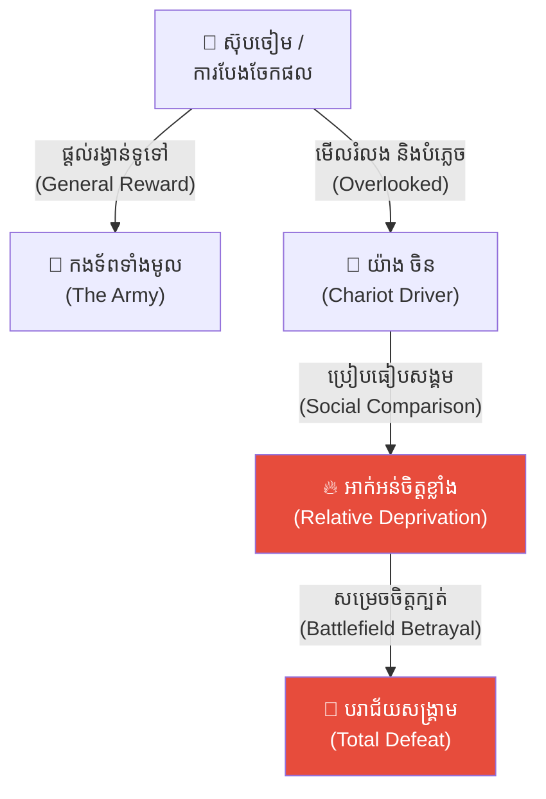
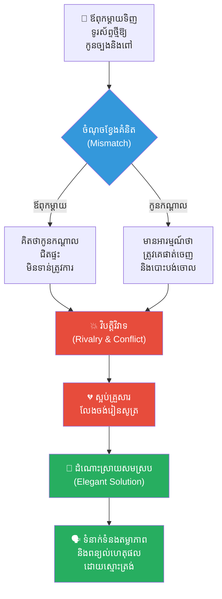
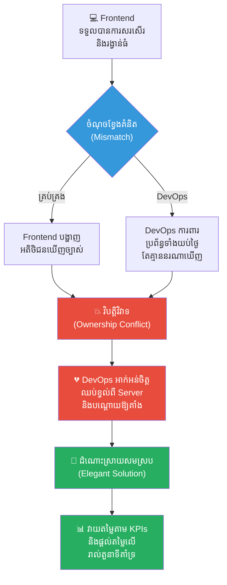
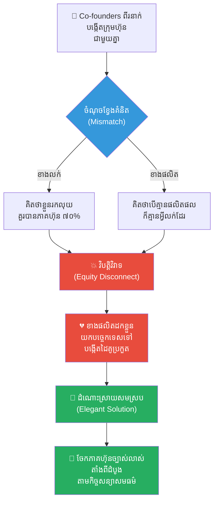
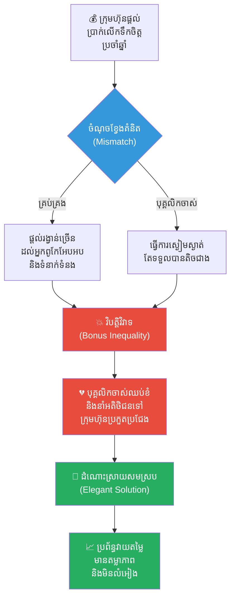
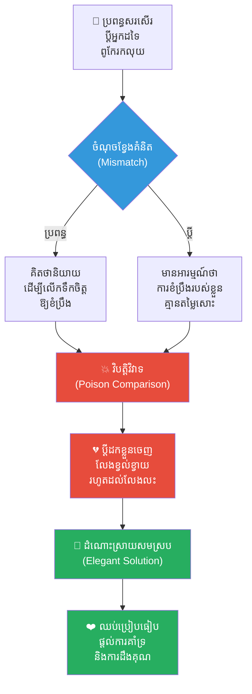
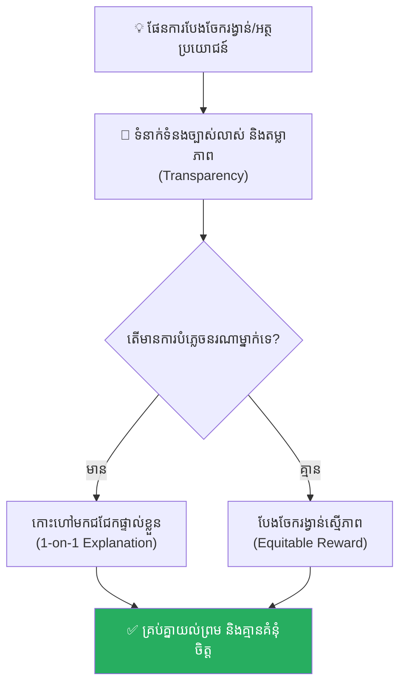

# Relative Deprivation Effect (ឥទ្ធិពលនៃការដកហូតដោយការប្រៀបធៀប)៖ គ្រោះថ្នាក់នៃដង្ហើមច្រណែន និងការបំផ្លាញខ្លួនឯងព្រោះតែស៊ុបសាច់ចៀមមួយចាន

**Author:** ichamrong  
**Date:** 2026-05-17  
**Tags:** #relative-deprivation-effect #psychology #mental-models #life-lessons #leadership #chinese-history #critical-thinking  
**Category:** Concepts  
**Read Time:** ~15 min  

---

## 📌 មាតិកា (Table of Contents)
- [អន្ទាក់ផ្លូវចិត្ត (The Trap)](#អន្ទាក់ផ្លូវចិត្ត-the-trap)
- [១. រឿងព្រេងប្រវត្តិសាស្ត្រចិន៖ មេទ័ព ហួរ យន់ និង យ៉ាង ចិន (The Mutton Soup Betrayal)](#1)
  - [ការក្បត់ក្នុងសមរភូមិ តាជី (The Betrayal at the Battle of Daji)](#1-1)
- [២. បញ្ហា៖ ការប្រៀបធៀបសង្គម និងការយល់ឃើញលំអៀង (The Issue: Social Comparison and Perceived Injustice)](#2)
- [៣. ឧទាហរណ៍ជាក់ស្តែងក្នុងពិភពពិត (Real World Examples)](#3)
  - [ឧទាហរណ៍ទី ១ — កម្រិតស្រាល (គ្រួសារ)៖ ការបែងចែកទ្រព្យសម្បត្តិ ឬអំណោយរបស់ឪពុកម្តាយ (Sibling Rivalry & Parental Bias)](#3-1)
  - [ឧទាហរណ៍ទី ២ — កម្រិតមធ្យម (បច្ចេកទេស)៖ ការបែងចែកក្រេឌីត/សិទ្ធិ ឬការប្រៀបធៀប API/Frameworks (The Dev Ownership Conflict)](#3-2)
  - [ឧទាហរណ៍ទី ៣ — កម្រិតមធ្យម (ធុរកិច្ច)៖ កិច្ចសន្យាភាគហ៊ុន ឬរង្វាន់ដៃគូសហការ (The Co-founder Equity Disconnect)](#3-3)
  - [ឧទាហរណ៍ទី ៤ — កម្រិតមធ្យម (សង្គម/គ្រប់គ្រង)៖ ការដំឡើងឋានៈ ឬការផ្តល់រង្វាន់ប្រចាំឆ្នាំ (Annual Bonus Inequality)](#3-4)
  - [ឧទាហរណ៍ទី ៥ — កម្រិតធ្ងន់ (ទំនាក់ទំនង)៖ ការប្រៀបធៀបដៃគូជីវិតជាមួយអ្នកដទៃ (The Comparison Poison in Marriage)](#3-5)
- [៤. ដំណោះស្រាយទូទៅ៖ តម្លាភាព និងការផ្តល់តម្លៃជាសកល (The General Solution: Transparency and Universal Recognition)](#4)
- [សេចក្តីសន្និដ្ឋាន (Conclusion)](#conclusion)
- [ឯកសារយោង (References)](#references)
- [Related Posts](#related-posts)

---

## អន្ទាក់ផ្លូវចិត្ត (The Trap)

តើអ្នកធ្លាប់មានអារម្មណ៍ក្តៅក្រហាយ ឬកើតទុក្ខមិនសុខចិត្ត នៅពេលឃើញអ្នកដទៃទទួលបានរង្វាន់ ឬអត្ថប្រយោជន៍ដ៏តូចតាចមួយដែលអ្នកត្រូវបានគេបំភ្លេចចោលដែរឬទេ? 

មនុស្សភាគច្រើនតែងតែគិតថា សេចក្តីសុខ ឬក្តីទុក្ខរបស់ខ្លួន គឺអាស្រ័យទៅលើ **«អ្វីដែលខ្លួនមានពិតប្រាកដ»**។ ប៉ុន្តែនៅក្នុងការពិត ចិត្តវិទ្យារបស់មនុស្សយើងដំណើរការតាមរបៀបមួយផ្សេងទៀត គឺវាអាស្រ័យទៅលើ **«ការប្រៀបធៀបខ្លួនឯងទៅនឹងអ្នកដទៃ» (Social Comparison)**។ ទោះបីជាយើងកំពុងរស់នៅក្នុងស្ថានភាពល្អប្រសើរយ៉ាងណាក៏ដោយ ឱ្យតែយើងសង្កេតឃើញថាអ្នកជុំវិញខ្លួនទទួលបានរបស់ដែលល្អជាង ឬមានចំណែកច្រើនជាង យើងនឹងចាប់ផ្តើមមានអារម្មណ៍ថាខ្លួនរងភាពអយុត្តិធម៌ និងត្រូវបាន «ដកហូត» ផលប្រយោជន៍ភ្លាមៗ។

បាតុភូតនេះហៅថា **Relative Deprivation Effect (ឥទ្ធិពលនៃការដកហូតដោយការប្រៀបធៀប)**។ វាជាមេរោគផ្លូវចិត្តដ៏សាហាវដែលអាចបំផ្លាញក្រុមការងារ ទំនាក់ទំនង និងស្ថាប័នទាំងមូលត្រឹមតែមួយប៉ប្រិចភ្នែក ព្រោះតែការមើលរំលងអារម្មណ៍របស់មនុស្សតូចតាចម្នាក់។

ដើម្បីយល់ដឹងឱ្យបានគ្រប់ជ្រុងជ្រោយ នេះជាផែនទីបង្ហាញផ្លូវសម្រាប់អត្ថបទនេះ៖
1. **រឿងព្រេងប្រវត្តិសាស្ត្រ (The Historic Legend)** — រឿងរ៉ាវស៊ុបសាច់ចៀមដ៏ក្តៅហុយ និងការបររទេះសឹកចូលទៅក្នុងកណ្តាលចំណោមសត្រូវ។
2. **បញ្ហា (The Issue)** — តើ Relative Deprivation Effect ដំណើរការយ៉ាងដូចម្តេចក្នុងចិត្តវិទ្យា?
3. **ឧទាហរណ៍ជាក់ស្តែងក្នុងពិភពពិត (Real World Examples)** — ពិនិត្យមើលឥទ្ធិពលនេះក្នុងកម្រិតគ្រួសារ ការងារបច្ចេកទេស ធុរកិច្ច ការគ្រប់គ្រង និងទំនាក់ទំនងស្នេហា។
4. **ដំណោះស្រាយទូទៅ (The General Solution)** — ការកសាងតម្លាភាព និងយន្តការចែករំលែកផលប្រយោជន៍ប្រកបដោយសមធម៌។

---

## ១. រឿងព្រេងប្រវត្តិសាស្ត្រចិន៖ មេទ័ព ហួរ យន់ និង យ៉ាង ចិន (The Mutton Soup Betrayal)

យោងតាមកម្រងឯកសារប្រវត្តិសាស្ត្រចិនបុរាណ **«ជូ ឈួន» (Zuo Zhuan)** នៅឆ្នាំ ៦០៧ មុនគ្រិស្តសករាជ មានព្រឹត្តិការណ៍ដ៏គួរឱ្យភ្ញាក់ផ្អើលមួយបានកើតឡើងនៅក្នុងអំឡុងពេលសង្គ្រាមរវាង នគរ សុង (Song State) និង នគរ ចឹង (Zheng State)។

អគ្គមេបញ្ជាការ (Supreme Commander) នៃនគរ សុង មាននាមថា **ហួរ យន់ (Hua Yuan)**។ នៅរាត្រីមុនការប្រកួតប្រជែងនៅសមរភូមិប្រយុទ្ធដ៏ធំ (Major Battlefield) មេទ័ព ហួរ យន់ បានបញ្ជាឱ្យគេកាប់ចៀមជាច្រើនក្បាល ដើម្បីស្ងោរធ្វើជាស៊ុបសាច់ចៀមដ៏ក្តៅហុយៗ យកទៅបែងចែកជូនដល់កងទ័ពទាំងអស់នៅក្នុងបន្ទាយយោធា (Military Camp)។ គោលបំណងនៃការធ្វើបែបនេះ គឺដើម្បីលើកទឹកចិត្ត (Motivation) និងបង្កើនស្មារតីប្រយុទ្ធ (Combat Morale) របស់ពួកទាហាន។

នៅក្នុងជំរុំ (Encampment) សំឡេងអបអរសាទរ និងការសើចក្អាកក្អាយបានលាន់ឮកងរំពង។ ទាហានគ្រប់ជាន់ថ្នាក់សុទ្ធតែទទួលបានស៊ុបសាច់ចៀមដ៏មានឱជារស ម្នាក់មួយចានធំ។ ប៉ុន្តែ មានតែបុគ្គលម្នាក់គត់ដែលត្រូវបានគេបំភ្លេចចោល និងមើលរំលង (Overlooked) ទាំងស្រុង នោះគឺ **យ៉ាង ចិន (Yang Zhen)** ដែលជាអ្នកបររទេះសេះសឹក (Chariot Driver) ផ្ទាល់ខ្លួនរបស់មេទ័ព ហួរ យន់។

**យ៉ាង ចិន** បានលាក់ទុកនូវក្តីខកចិត្ត (Disappointment) ភាពអាក់អន់ស្រពន់ចិត្ត និងគំនុំ (Resentment) យ៉ាងជ្រាលជ្រៅនៅក្នុងចិត្ត។ គាត់មិនបានត្អូញត្អែរ (Complain) ឬស្រែកទាមទារចំណែកស៊ុបរបស់គាត់ឡើយ គាត់គ្រាន់តែដើរទៅចងខ្សែសេះយ៉ាងស្ងៀមស្ងាត់នៅឯជ្រុងងងឹតមួយនៃបន្ទាយយោធា (Military Base)។

---

### ការក្បត់ក្នុងសមរភូមិ តាជី (The Betrayal at the Battle of Daji)

ព្រឹកព្រលឹមឈានចូលមកដល់ សមរភូមិ តាជី (Battle of Daji) ក៏បានចាប់ផ្តើមឡើង ដោយកងទ័ពទាំងសងខាងបានបើកការវាយប្រហារ (Attack) គ្នយ៉ាងសាហាវ។ យ៉ាង ចិន បានចាប់កាន់ខ្សែបង្ហៀរ និងបញ្ជាទិសដៅរទេះសេះចម្បាំង (War Chariot) របស់មេទ័ព ហួរ យន់ ឱ្យលោតឆ្ពោះទៅមុខយ៉ាងលឿនស្លេវនៅឯសមរភូមិមុខ (Frontline)។

ប៉ុន្តែ នៅវិនាទីដែលកងទ័ពទាំងពីរជិតនឹងបុកទង្គិចគ្នា (Clash) យ៉ាង ចិន ស្រាប់តែកន្ត្រាក់ខ្សែបញ្ជាសេះយ៉ាងខ្លាំង រួចបង្វិលក្បាលរទេះសឹករបស់មេទ័ព ហួរ យន់ ត្រឡប់ក្រោយ ហើយបោលសម្រុកត្រង់ចូលទៅក្នុងកណ្តាលចំណោមទ័ពរបស់សត្រូវ (Enemy Forces) នៃនគរ ចឹង តែម្តង។

មេទ័ព ហួរ យន់ ភ្ញាក់ផ្អើល (Shocked) យ៉ាងខ្លាំង រួចស្រែកសួរទាំងស្លន់ស្លោថា៖ *«យ៉ាង ចិន! ឯងកំពុងតែបររទេះទៅណា?»*

យ៉ាង ចិន ងាកមកមើលមេទ័ព រួចតបវិញដោយសម្លេងដ៏ត្រជាក់ស្រទំ (Coldly) ថា៖
> **«ស៊ុបសាច់ចៀមកាលពីយប់មិញ គឺជាការសម្រេចចិត្ត (Decision) របស់លោកម្ចាស់។ ប៉ុន្តែ ការបររទេះសេះនៅថ្ងៃនេះ គឺជាការសម្រេចចិត្តរបស់ខ្ញុំវិញម្តង!»**

ដោយសារតែមិនបានត្រៀមខ្លួនជាមុន (Unprepared) មេទ័ពដ៏អង់អាច ហួរ យន់ ក៏ត្រូវកងទ័ពសត្រូវឡោមព័ទ្ធ (Surrounded) និងចាប់ខ្លួន (Captured) បានភ្លាមៗយ៉ាងងាយស្រួលបំផុត។ កងទ័ពនគរ សុង ទាំងមូលក៏បានបាត់បង់ស្មារតី និងទទួលបរាជ័យ (Defeat) ទាំងស្រុងក្នុងរយៈពេលដ៏ខ្លីបំផុត។

---

## ២. បញ្ហា៖ ការប្រៀបធៀបសង្គម និងការយល់ឃើញលំអៀង (The Issue: Social Comparison and Perceived Injustice)

នៅក្នុងវិស័យចិត្តវិទ្យា (Psychology) បាតុភូតនេះត្រូវបានគេហៅថា **Relative Deprivation Effect (ឥទ្ធិពលនៃការដកហូតដោយការប្រៀបធៀប)**។ 

វាកើតឡើងនៅពេលមនុស្សម្នាក់មិនបានវាស់ស្ទង់សុភមង្គលរបស់ខ្លួនតាម «តម្លៃដាច់ខាត» (Absolute Value) ឡើយ តែវាស់ស្ទង់តាម «តម្លៃធៀប» (Relative Value)។ អារម្មណ៍ឈឺចាប់ និងគំនុំកើតឡើងពី៖
* **ការរំពឹងទុកសមធម៌៖** នៅពេលយើងជាផ្នែកមួយនៃក្រុម យើងរំពឹងការទទួលបានការគោរព និងចំណែកផលស្មើៗគ្នា។
* **ការប្រៀបធៀបសង្គម៖** ការយល់ឃើញថា «គេបាន ហេតុអ្វីខ្ញុំអត់?» បង្កើតជាអារម្មណ៍ដូចត្រូវគេប្លន់សិទ្ធិ ឬកេងប្រវ័ញ្ច។
* **ការផ្ទុះឡើងនៃអាកប្បកិរិយាបំផ្លិចបំផ្លាញ៖** មនុស្សអាចសុខចិត្តបំផ្លាញប្រព័ន្ធ ឬស្ថាប័នទាំងមូល (ទោះបីជាខ្លួនឯងរលាយខ្លួនជាមួយក៏ដោយ) ឱ្យតែបានលុបលាងភាពអយុត្តិធម៌នោះចោល។

---

## ៣. ឧទាហរណ៍ជាក់ស្តែងក្នុងពិភពពិត

ដើម្បីយល់ដឹងឱ្យកាន់តែស៊ីជម្រៅ ផ្លូវការសិក្សានឹងនាំអ្នកទៅពិនិត្យមើល **ឧទាហរណ៍ចំនួន ៥ កម្រិតខុសៗគ្នា** ក្នុងជីវិតរស់នៅប្រចាំថ្ងៃ៖

---

### ឧទាហរណ៍ទី ១ — កម្រិតស្រាល (គ្រួសារ)៖ ការបែងចែកទ្រព្យសម្បត្តិ ឬអំណោយរបស់ឪពុកម្តាយ (Sibling Rivalry & Parental Bias)

**ស្ថានភាព៖** ឪពុកម្តាយទិញទូរស័ព្ទដៃស៊េរីទំនើបឱ្យកូនច្បង និងកូនស្រីពៅ តែភ្លេចទិញឱ្យកូនប្រុសកណ្តាល។

* **ភាគី A (ឪពុកម្តាយ)៖** គិតថា «កូនកណ្តាលរៀននៅសាលាជិតផ្ទះ មិនទាន់ត្រូវការទូរស័ព្ទថ្មីទេ» ហើយមានបំណងទិញឱ្យនៅឆ្នាំក្រោយ។ ពួកគេមិនបានពន្យល់ ឬប្រាប់កូនកណ្តាលមុនឡើយ។
* **ភាគី B (កូនប្រុសកណ្តាល)៖** មានអារម្មណ៍ថាខ្លួនឯងជា «កូនចិញ្ចឹម» ឬត្រូវបានគេបោះបង់ចោល。 ការប្រៀបធៀបខ្លួនឯងទៅនឹងបងនិងប្អូនបង្កើត ធ្វើឱ្យគាត់កើតក្តីច្រណែន ស្អប់ខ្ពើមគ្រួសារ និងលែងចង់ខំប្រឹងរៀនសូត្រទៀតហើយ។

**ការពិតដ៏ជូរចត់៖**
ទោះបីជាជីវភាពរស់នៅមានភាពធូរធារក៏ដោយ តែការបែងចែកមិនស្មើភាព និងគ្មានការទំនាក់ទំនងច្បាស់លាស់ បានបង្កើតជាស្នាមរបួសផ្លូវចិត្តដល់កូនកណ្តាលរហូតដល់ធំដឹងក្តី។

---

### ឧទាហរណ៍ទី ២ — កម្រិតមធ្យម (បច្ចេកទេស)៖ ការបែងចែកក្រេឌីត/សិទ្ធិ ឬការប្រៀបធៀប API/Frameworks (The Dev Ownership Conflict)

**ស្ថានភាព៖** ក្រុមការងារ Tech Startup មួយបានផ្តល់រង្វាន់ និងការសរសើរជាសាធារណៈដល់ Frontend Developers ដែលរចនា Interface ស្អាត តែមើលរំលង DevOps Engineer ដែលខំប្រឹងរៀបចំ Server ឱ្យដំណើរការគ្មានការរអាក់រអួល។

* **ភាគី A (Management)៖** គិតថា Frontend គឺជាអ្វីដែលអតិថិជន និងវិនិយោគិនមើលឃើញផ្ទាល់ភ្នែក ដូច្នេះគួរតែសរសើរពួកគេដើម្បីកេរ្តិ៍ឈ្មោះក្រុមហ៊ុន។
* **ភាគី B (DevOps Engineer)៖** មានអារម្មណ៍ថាការខិតខំប្រឹងប្រែងការពារប្រព័ន្ធទាំងយប់ទាំងថ្ងៃរបស់ខ្លួន គ្មានតម្លៃអ្វីទាល់តែសោះ។ គាត់ធ្លាក់ចូលក្នុងស្ថានភាព Relative Deprivation។

**ការពិតដ៏ជូរចត់៖**
DevOps Engineer ឈប់យកចិត្តទុកដាក់លើ Monitor និង Server Stability។ នៅពេលប្រព័ន្ធជួបប្រទះការវាយប្រហារ (DDoS Attack) គាត់មិនប្រញាប់ប្រញាល់ដោះស្រាយឡើយ ដែលបណ្តាលឱ្យ App គាំងដំណើរការរាប់ម៉ោង និងខាតបង់ថវិការាប់ម៉ឺនដុល្លារ។

---

### ឧទាហរណ៍ទី ៣ — កម្រិតមធ្យម (ធុរកិច្ច)៖ កិច្ចសន្យាភាគហ៊ុន ឬរង្វាន់ដៃគូសហការ (The Co-founder Equity Disconnect)

**ស្ថានភាព៖** Co-founder ពីរនាក់បង្កើតក្រុមហ៊ុនជាមួយគ្នា។ ម្នាក់ផ្តោតលើការលក់ (Sales) និងម្នាក់ទៀតផ្តោតលើការផលិត (Operation)។ ពេលទទួលបានជោគជ័យ Co-founder ខាងផ្នែកលក់ទទូចចង់បានភាគហ៊ុន ៧០% ព្រោះយល់ថាខ្លួនជាអ្នកនាំលុយចូលក្រុមហ៊ុន។

* **ភាគី A (Co-founder ផ្នែកលក់)៖** គិតថា «បើគ្មានខ្ញុំលក់ទេ ក្រុមហ៊ុនគ្មានលុយចាយឡើយ ដូច្នេះខ្ញុំត្រូវតែបានចំណែកច្រើនជាង»។
* **ភាគី B (Co-founder ផ្នែក Operation)៖** គិតថា «បើគ្មានខ្ញុំរៀបចំប្រព័ន្ធផលិតកម្មដ៏រឹងមាំទេ លោកឯងយកអ្វីទៅលក់ឱ្យអតិថិជន?» គាត់មានអារម្មណ៍ថាត្រូវគេដកហូតតម្លៃសេវាកម្ម និងកេងប្រវ័ញ្ចកម្លាំងពលកម្ម។

**ការពិតដ៏ជូរចត់៖**
Co-founder ផ្នែក Operation សម្រេចចិត្តដកខ្លួនចេញ និងយកព័ត៌មានបច្ចេកទេសសំខាន់ៗទៅបង្កើតក្រុមហ៊ុនផ្ទាល់ខ្លួន ដែលជាដៃគូប្រកួតប្រជែងផ្ទាល់ បណ្តាលឱ្យក្រុមហ៊ុនចាស់ដួលរលំ។

---

### ឧទាហរណ៍ទី ៤ — កម្រិតមធ្យម (សង្គម/គ្រប់គ្រង)៖ ការដំឡើងឋានៈ ឬការផ្តល់រង្វាន់ប្រចាំឆ្នាំ (Annual Bonus Inequality)

**ស្ថានភាព៖** ក្រុមហ៊ុនមួយបែងចែកប្រាក់លើកទឹកចិត្ត (Annual Bonus) ដល់បុគ្គលិកគ្រប់រូប ប៉ុន្តែផ្តល់ឱ្យបុគ្គលិកថ្មីម្នាក់ដែលពូកែនិយាយអែបអបច្រើនជាងបុគ្គលិកចាស់ដែលធ្វើការងារស្ងៀមស្ងាត់។

* **ភាគី A (Manager)៖** គិតថាបុគ្គលិកថ្មីពូកែទំនាក់ទំនង និងជួយសម្រាលការងារចំពោះមុខច្រើនជាង។
* **ភាគី B (បុគ្គលិកចាស់)៖** មានអារម្មណ៍ថាការស្មោះត្រង់ និងការខិតខំប្រឹងប្រែងជាច្រើនឆ្នាំរបស់ខ្លួនត្រូវបានគេជាន់ឈ្លី។ គាត់ធ្លាក់ចូលទៅក្នុងវិបត្តិ Relative Deprivation ភ្លាមៗ។

**ការពិតដ៏ជូរចត់៖**
បុគ្គលិកចាស់សម្រេចចិត្តឈប់បញ្ចេញសមត្ថភាព (Quiet Quitting) និងចាប់ផ្តើមបំផ្លាញព័ត៌មានផ្ទៃក្នុង ឬនាំអតិថិជនសំខាន់ៗទៅក្រុមហ៊ុនប្រកួតប្រជែង។

---

### ឧទាហរណ៍ទី ៥ — កម្រិតធ្ងន់ (ទំនាក់ទំនង)៖ ការប្រៀបធៀបដៃគូជីវិតជាមួយអ្នកដទៃ (The Comparison Poison in Marriage)

**ស្ថានភាព៖** ប្រពន្ធតែងតែនិយាយសរសើរប្តីរបស់អ្នកដទៃថាពូកែរកលុយ ទិញឡានទំនើប និងនាំដើរលេងក្រៅប្រទេស នៅចំពោះមុខប្តីរបស់ខ្លួន។

* **ភាគី A (ប្រពន្ធ)៖** គិតថានិយាយបែបនេះគឺជា «ការលើកទឹកចិត្ត» ឬរុញច្រានប្តីឱ្យខំប្រឹងរកលុយបន្ថែម។
* **ភាគី B (ប្តី)៖** មានអារម្មណ៍ថាភាពស្មោះត្រង់ ការមើលថែទាំគ្រួសារ និងការខំប្រឹងប្រែងរកលុយតាមសមត្ថភាពរបស់ខ្លួន គ្មានតម្លៃអ្វីសោះនៅក្នុងភ្នែកប្រពន្ធ។ គាត់កើតមានគំនុំ និងមានអារម្មណ៍ថាខ្វះខាតដោយសារការប្រៀបធៀបនេះ។

**ការពិតដ៏ជូរចត់៖**
ប្តីចាប់ផ្តើមដកខ្លួនចេញពីទំនាក់ទំនង ឈប់ផ្តល់ការស្រឡាញ់ និងការយកចិត្តទុកដាក់ រហូតដល់ដើរដល់ផ្លូវបំបែក និងលែងលះគ្នាដោយគ្មានការសោកស្តាយ។

---

## ៤. ដំណោះស្រាយទូទៅ៖ តម្លាភាព និងការផ្តល់តម្លៃជាសកល (The General Solution: Transparency and Universal Recognition)

ដើម្បីការពារស្ថាប័ន ឬទំនាក់ទំនងរបស់អ្នកពីការបំផ្លិចបំផ្លាញនៃ Relative Deprivation Effect អ្នកត្រូវអនុវត្តវិធីសាស្ត្រគន្លឹះទាំងនេះ៖

### ១. បង្កើតតម្លាភាពក្នុងការបែងចែកផល (Transparent Evaluation Metrics)
កុំបែងចែករង្វាន់ ឬអត្ថប្រយោជន៍ដោយផ្អែកលើការយល់ឃើញផ្ទាល់ខ្លួនរបស់មេដឹកនាំ (Subjective bias)។ ត្រូវមានលក្ខខណ្ឌវិនិច្ឆ័យច្បាស់លាស់ (Objective KPIs) ដែលមនុស្សគ្រប់គ្នាបានយល់ព្រម និងដឹងឮជាមុន។

### ២. ទំនាក់ទំនង និងពន្យល់ពីហេតុផល (Clear Overcommunication)
ប្រសិនបើមានស្ថានភាពចៀសមិនរួចដែលតម្រូវឱ្យផ្តល់រង្វាន់ខុសៗគ្នា ឬមើលរំលងបុគ្គលណាម្នាក់ ត្រូវកោះហៅពួកគេមកជជែក និងពន្យល់ពីហេតុផលជាលក្ខណៈបុគ្គល (1-on-1 discussion) ជាមុន ដើម្បីបង្ការការយល់ច្រឡំ។

### ៣. ផ្តល់តម្លៃដល់តួនាទីគាំទ្រ (Value the Supporting Roles)
ចងចាំថា «អ្នកបររទេះសេះ» ក៏សំខាន់ដូច «មេទ័ព» ដែរ។ ក្នុងការងារ ឬគ្រួសារ ចូរផ្តល់ការដឹងគុណ និងសរសើរដល់មនុស្សគ្រប់រូបដែលនៅពីក្រោយភាពជោគជ័យ ទោះបីជាតួនាទីរបស់ពួកគេតូចតាចយ៉ាងណាក៏ដោយ។

---

## សេចក្តីសន្និដ្ឋាន (Conclusion)

> **«សមរភូមិចាញ់ឈ្នះ ជួនកាលមិនមែនសម្រេចលើកម្លាំងអាវុធ ឬមាសប្រាក់ឡើយ តែវាសម្រេចលើក្តីសុខសាន្ត និងស្មារតីរបស់មនុស្សតូចតាចបំផុតនៅក្នុងបន្ទាយរបស់អ្នក។ ការផ្តល់តម្លៃ និងការគោរពដល់មនុស្សគ្រប់រូប គឺជាខែលការពារដ៏រឹងមាំបំផុតសម្រាប់អ្នកដឹកនាំគ្រប់រូប។»**

មេទ័ព ហួរ យន់ សុខចិត្តផ្តល់ស៊ុបសាច់ចៀមដល់ទាហានរាប់ម៉ឺននាក់ តែបែរជាបំភ្លេចអ្នកបររទេះសេះផ្ទាល់ខ្លួនរបស់គាត់។ ចុងក្រោយ ស៊ុបមួយចាននោះបានដុតបំផ្លាញកងទ័ពទាំងមូល និងសេរីភាពផ្ទាល់ខ្លួនរបស់គាត់នៅក្នុងកណ្តាប់ដៃសត្រូវ។

កុំទុកឱ្យស៊ុបសាច់ចៀមមួយចាន ក្លាយជាដើមចមនៃការបំផ្លិចបំផ្លាញក្តីសុខ និងអនាគតរបស់អ្នកឡើយ។

---

## ឯកសារយោង (References)

* **Zuo Qiuming (左丘明)** — *Zuo Zhuan (左傳)*. ប្រភពឯកសារប្រវត្តិសាស្ត្រចិនដ៏ល្បីល្បាញ ដែលកត់ត្រាលម្អិតពីរឿងរ៉ាវក្នុងសម័យនិទាឃរដូវ និងសរទរដូវ។
* **Runciman, W. G.** — *Relative Deprivation and Social Justice* (1966). ការសិក្សាទ្រឹស្តីចិត្តវិទ្យាសង្គមអំពីអារម្មណ៍អយុត្តិធម៌ក្នុងការប្រៀបធៀបឋានៈ។
* **Festinger, L.** — *A Theory of Social Comparison Processes* (1954). ទ្រឹស្តីនៃការប្រៀបធៀបសង្គមរបស់ខួរក្បាលមនុស្ស។

---

## Related Posts

* **[Projection Effect (ឥទ្ធិពលនៃការយកគំនិតខ្លួនឯងទៅដាក់លើអ្នកដទៃ)៖ គ្រោះថ្នាក់នៃការគិតស្មានថាពិភពលោកទាំងមូលចង់បានដូចខ្លួនឯង](./01-projection-effect.md)** — Tragic story of Mount Mianshan.
* **[The Angel vs. The Demon Dilemma (ចំណោទបញ្ហារវាងទេវតា និងបិសាច)៖ ជម្រើសរវាងប្រយោជន៍រួម និងសេចក្តីស្នេហាគ្មានលក្ខខណ្ឌ](./03-angel-and-demon-dilemma.md)** — Decision-making based on moral paradigms.
* **[The Law of Value (ច្បាប់នៃតម្លៃ)៖ ហេតុអ្វីបានជាការខិតខំប្រឹងប្រែងតែម្ខាង មិនអាចកំណត់តម្លៃពិតប្រាកដរបស់អ្នកបាន?](./05-the-law-of-value.md)** — Understanding objective valuation versus personal exertion.
