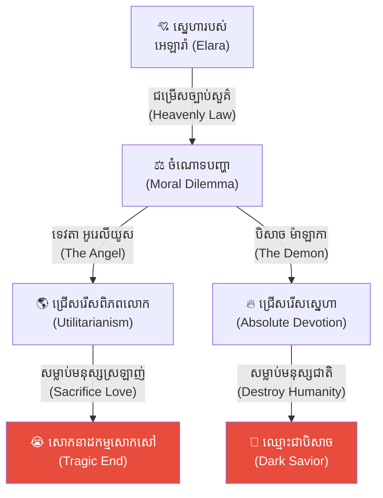
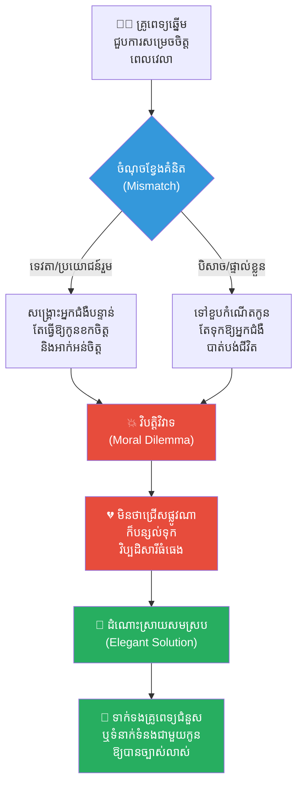
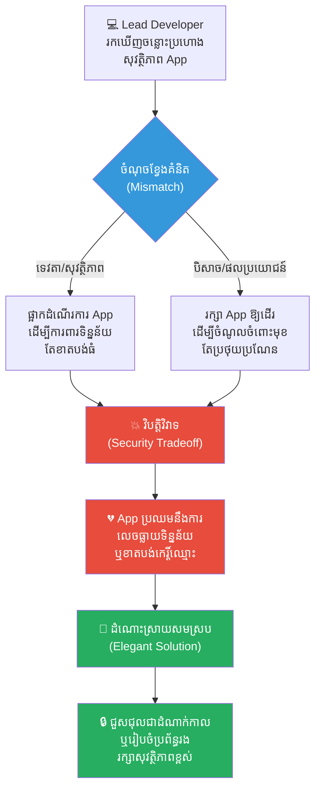
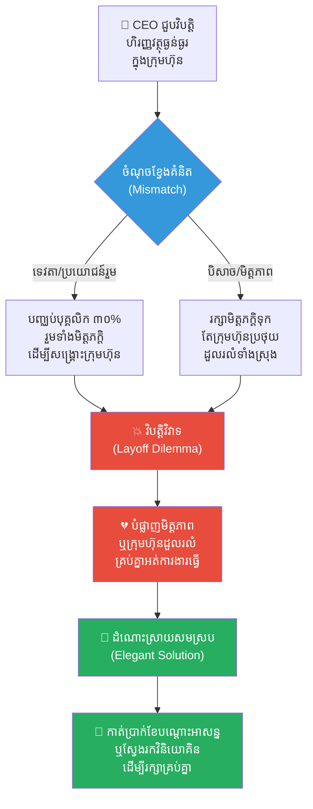
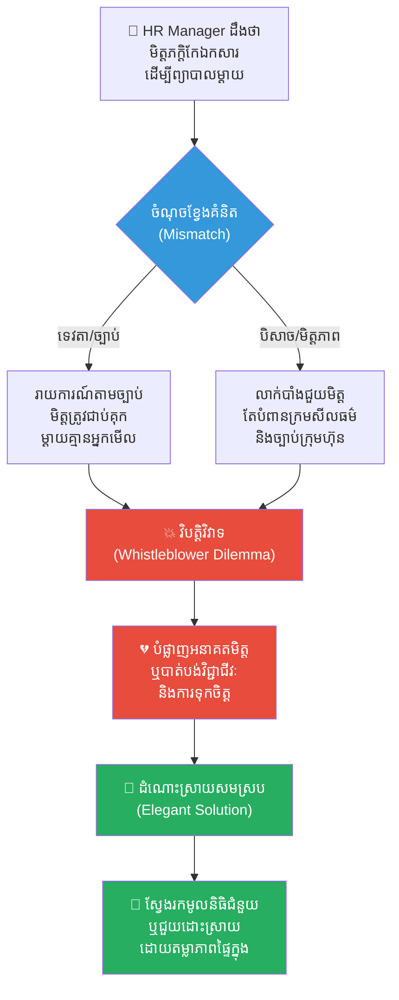
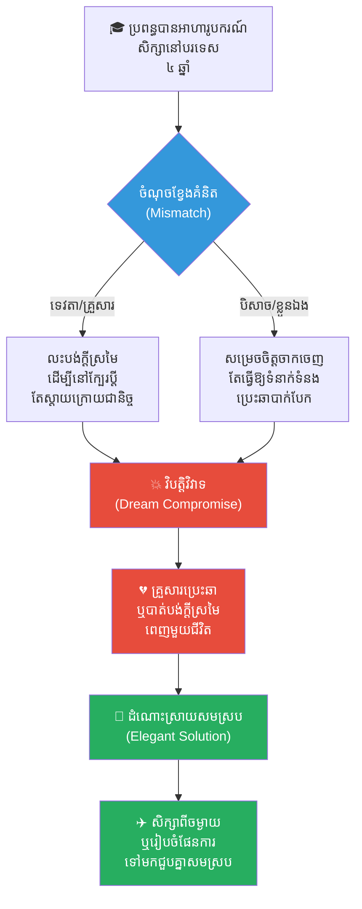
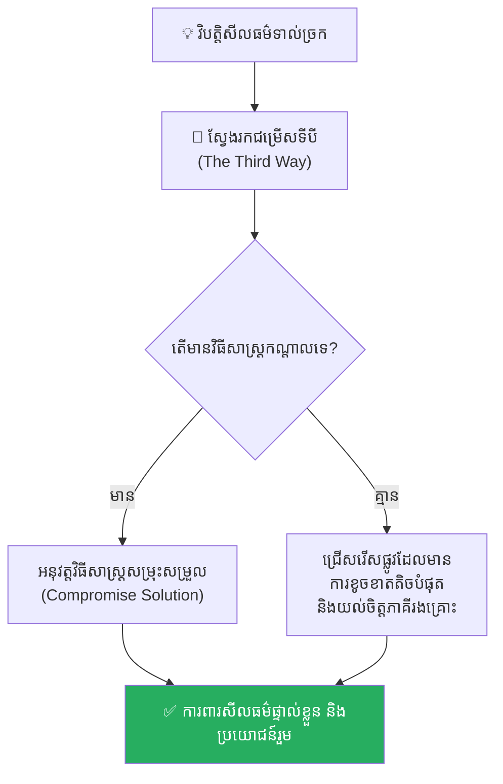

# The Angel vs. The Demon Dilemma (ចំណោទបញ្ហារវាងទេវតា និងបិសាច)៖ ជម្រើសដ៏ពិបាករវាងប្រយោជន៍រួម និងសេចក្តីស្នេហាដាច់ខាតគ្មានលក្ខខណ្ឌ

**Author:** ichamrong  
**Date:** 2026-05-17  
**Tags:** #moral-dilemma #psychology #utilitarianism #life-lessons #philosophy #gothic-legend #critical-thinking  
**Category:** Concepts  
**Read Time:** ~15 min  

---

## 📌 មាតិកា (Table of Contents)
- [អន្ទាក់ផ្លូវចិត្ត (The Trap)](#អន្ទាក់ផ្លូវចិត្ត-the-trap)
- [១. រឿងព្រេងអឺរ៉ុបបុរាណ៖ ការជ្រើសរើសរបស់ អេឡារ៉ា (Elara's Choice)](#1)
  - [ច្បាប់ឋានលើ និង ការលះបង់របស់ អូរេលីយូស (Aurelius's Heavenly Sacrifice)](#1-1)
  - [ការសង្គ្រោះដ៏ឃោរឃៅរបស់ ម៉ាឡាកា (Malakar's Dark Salvation)](#1-2)
- [២. បញ្ហា៖ ទេវតា និង បិសាច ខុសគ្នាត្រង់ណា? (The Issue: Utilitarianism vs. Absolute Devotion)](#2)
- [៣. ឧទាហរណ៍ជាក់ស្តែងក្នុងពិភពពិត (Real World Examples)](#3)
  - [ឧទាហរណ៍ទី ១ — កម្រិតស្រាល (គ្រួសារ)៖ ការសម្រេចចិត្តបែងចែកពេលវេលា (The Family vs. Career Struggle)](#3-1)
  - [ឧទាហរណ៍ទី ២ — កម្រិតមធ្យម (បច្ចេកទេស)៖ ការសម្រេចចិត្តលុបមុខងារ ឬរក្សាសុវត្ថិភាពទិន្នន័យ (The Security vs. Usability Tradeoff)](#3-2)
  - [ឧទាហរណ៍ទី ៣ — កម្រិតមធ្យម (ធុរកិច្ច)៖ ការបញ្ឈប់បុគ្គលិកដើម្បីសង្គ្រោះក្រុមហ៊ុន (The Layoff Dilemma)](#3-3)
  - [ឧទាហរណ៍ទី ៤ — កម្រិតមធ្យម (សង្គម/គ្រប់គ្រង)៖ ការដាក់ទណ្ឌកម្មលើមិត្តភក្តិរួមការងារ (The Whistleblower's Choice)](#3-4)
  - [ឧទាហរណ៍ទី ៥ — កម្រិតធ្ងន់ (ទំនាក់ទំនង)៖ ការលះបង់ក្តីស្រមៃដើម្បីដៃគូជីវិត (The Compromise of Dreams)](#3-5)
- [៤. ដំណោះស្រាយទូទៅ៖ ការស្វែងរកសមតុល្យតាមរយៈ Deontology (The General Solution: Finding Balance)](#4)
- [សេចក្តីសន្និដ្ឋាន (Conclusion)](#conclusion)
- [ឯកសារយោង (References)](#references)
- [Related Posts](#related-posts)

---

## អន្ទាក់ផ្លូវចិត្ត (The Trap)

តើអ្នកធ្លាប់ធ្លាក់ចូលទៅក្នុងស្ថានភាពទាល់ច្រក ដែលការជ្រើសរើសយកផ្លូវមួយ នឹងនាំមកនូវមហន្តរាយដល់មនុស្សម្នាក់ដែលអ្នកស្រឡាញ់បំផុត ហើយការជ្រើសរើសយកផ្លូវមួយទៀត នឹងនាំមកនូវការបំផ្លាញដល់មនុស្សគ្រប់គ្នានៅជុំវិញខ្លួនដែរឬទេ?

នេះគឺជា **The Angel vs. The Demon Dilemma (ចំណោទបញ្ហារវាងទេវតា និងបិសាច)**។ វាមិនមែនគ្រាន់តែជារឿងព្រេងនិទានប៉ុណ្ណោះទេ ប៉ុន្តែវាគឺជាការឆ្លុះបញ្ចាំងយ៉ាងស៊ីជម្រៅពីវិបត្តិសីលធម៌ និងការសម្រេចចិត្តក្នុងជីវិតជាក់ស្តែង។ ជារឿយៗ យើងត្រូវបានបង្ខំឱ្យដើរតួជា «ទេវតា» ដែលត្រូវលះបង់រឿងផ្ទាល់ខ្លួនដើម្បីប្រយោជន៍រួម ឬដើរតួជា «បិសាច» ដែលត្រូវងាកខ្នងដាក់ពិភពលោក ដើម្បីការពារអ្វីដែលមានតម្លៃបំផុតសម្រាប់ខ្លួនឯង។

ដើម្បីយល់ដឹងឱ្យបានគ្រប់ជ្រុងជ្រោយ នេះជាផែនទីបង្ហាញផ្លូវសម្រាប់អត្ថបទនេះ៖
1. **រឿងព្រេងអឺរ៉ុបបុរាណ (The Gothic Legend)** — រឿងរ៉ាវស្នេហត្រីកោណរវាងទេវតា Aurelius បិសាច Malakar និងនារីមនុស្សលោក Elara។
2. **បញ្ហា (The Issue)** — ការវិភាគទស្សនវិជ្ជារវាង ទ្រឹស្តីប្រយោជន៍ភាគច្រើន (Utilitarianism) និង ការលះបង់ដាច់ខាត (Absolute Devotion)។
3. **ឧទាហរណ៍ជាក់ស្តែងក្នុងពិភពពិត (Real World Examples)** — ពិនិត្យមើលអន្ទាក់សីលធម៌នេះក្នុងកម្រិតគ្រួសារ ការងារបច្ចេកទេស ធុរកិច្ច ការគ្រប់គ្រង និងទំនាក់ទំនងស្នេហា។
4. **ដំណោះស្រាយទូទៅ (The General Solution)** — ការស្វែងរកតុល្យភាពរវាងក្រមសីលធម៌ និងការទទួលខុសត្រូវផ្ទាល់ខ្លួន។

---

## ១. រឿងព្រេងអឺរ៉ុបបុរាណ៖ ការជ្រើសរើសរបស់ អេឡារ៉ា (Elara's Choice)

យោងតាមរឿងព្រេងអឺរ៉ុបបុរាណមួយ (European Folklore) មានសេចក្តីដំណាលថា ទេវតាពន្លឺមួយអង្គព្រះនាម **អូរេលីយូស (Aurelius)** និងស្តេចបិសាចអន្ធការមួយរូបនាម **ម៉ាឡាកា (Malakar)** បានលង់ប្រតិព័ទ្ធនារីជាមនុស្សលោកម្នាក់នាម **អេឡារ៉ា (Elara)** ក្នុងពេលវេលាតែមួយ។

ជាលទ្ធផល អេឡារ៉ា បានសម្រេចចិត្តជ្រើសរើសយកទេវតា អូរេលីយូស ដោយសារតែនាងមានជំនឿយ៉ាងមុតមាំទៅលើភាពសប្បុរស និងពន្លឺដ៏បរិសុទ្ធ ដែលតែងតែផ្តោតការយកចិត្តទុកដាក់លើសេចក្តីសុខសាន្តរបស់មនុស្សលោក (Humanity) ជានិច្ច។ នៅពេលទទួលបានដំណឹងនៃការសម្រេចចិត្តនេះ បិសាច ម៉ាឡាកា ពុំបានបញ្ចេញកំហឹង ឬត្អូញត្អែរអ្វីឡើយ។ គេគ្រាន់តែញញឹមយ៉ាងត្រជាក់ល្ហឹម រួចងាកខ្នងដើរចូលទៅក្នុងភាពងងឹតវិញយ៉ាងស្ងៀមស្ងាត់។

---

### ច្បាប់ឋានលើ និង ការលះបង់របស់ អូរេលីយូស (Aurelius's Heavenly Sacrifice)

ទោះជាយ៉ាងណាក្តី រឿងរ៉ាវមិនទាន់បញ្ចប់ត្រឹមនេះឡើយ។ ដំណឹងនៃសេចក្តីស្នេហានេះបានលេចឮរហូតដល់ឋានសួគ៌។ ដោយសារតែការបំពានច្បាប់សួគ៌ា (Heavenly Law) តាមរយៈការលួចមានទំនាក់ទំនងស្នេហាជាមួយមនុស្សលោក ឋានលើបានទម្លាក់បណ្តាសាដ៏សាហាវមួយ៖ *«មនុស្សលោកទាំងអស់នៅលើផែនដី នឹងត្រូវរលាយវិនាសហិនហោចដោយអណ្តាតភ្លើងសួគ៌។ មធ្យោបាយតែមួយគត់ដើម្បីសង្គ្រោះពិភពលោក (World Salvation) គឺត្រូវតែបូជាជីវិត អេឡារ៉ា ដើម្បីលាងជម្រះបាបកម្មសួគ៌ានេះ។»*

ពេលដឹងពីគ្រោះមហន្តរាយដ៏គួរឱ្យរន្ធត់នេះ មនុស្សលោកទាំងឡាយបាននាំគ្នាភ័យស្លន់ស្លោ និងមកក្រាបអង្វរករសុំឱ្យទេវតា អូរេលីយូស សម្លាប់ អេឡារ៉ា ដើម្បីសង្គ្រោះជីវិតរបស់ពួកគេរាប់លាននាក់។ 

អូរេលីយូស ទទួលរងនូវការឈឺចាប់ប្រេះទ្រូងស្ទើរធ្លាយ ប៉ុន្តែដោយឈរលើគោលការណ៍មេត្តាធម៌ជាសកល (Universal Compassion) និងយុត្តិធម៌របស់ទេវតា ដោយប្រកាន់យកទ្រឹស្តីប្រយោជន៍ភាគច្រើន (Utilitarianism) ទ្រង់ក៏សម្រេចចិត្តលះបង់មនុស្សដែលខ្លួនស្រឡាញ់បំផុត ដើម្បីសង្គ្រោះមនុស្សជាតិទាំងមូល។ ចំណែកឯ អេឡារ៉ា ក៏បានស្ម័គ្រចិត្តលះបង់ជីវិត (Self-Sacrifice) របស់ខ្លួនឯងផងដែរ ព្រោះនាងមិនចង់ឃើញអ្នកណាម្នាក់ត្រូវបាត់បង់ជីវិតដោយសារតែនាងឡើយ។

---

### ការសង្គ្រោះដ៏ឃោរឃៅរបស់ ម៉ាឡាកា (Malakar's Dark Salvation)

លុះដល់ថ្ងៃកំណត់ ខណៈពេលដែលទេវតា អូរេលីយូស កំពុងលើកដាវដ៏មុតស្រួចរៀបនឹងប្រហារជីវិត អេឡារ៉ា ស្រាប់តែមានសម្លេងស្រែកទ្រហោយំយ៉ាងកងរំពង និងការស្រែកសុំជំនួយបានលាន់ឮចេញពីឋានមនុស្សលោកខាងក្រោម។

នៅពេលដែល អូរេលីយូស និង អេឡារ៉ា ចុះទៅដល់ ពួកគេមានការស្រឡាំងកាំងយ៉ាងខ្លាំង ដោយហេតុថាមនុស្សលោកទាំងអស់នៅលើផែនដី ត្រូវបានបិសាច ម៉ាឡាកា កាប់សម្លាប់គ្មានសល់ម្នាក់ឡើយ ដែលធ្វើឱ្យឈាមហូរក្រហមច្រាលពេញផ្ទៃធរណី។

ពេល ម៉ាឡាកា ឃើញអ្នកទាំងពីរចុះមកដល់ គេគ្រាន់តែសើចចំអក រួចពោលពាក្យយ៉ាងព្រងើយកន្តើយថា៖
> **«ឥឡូវនេះ គ្មានមនុស្សលោកណា ដែលតម្រូវឱ្យឯងត្រូវសម្លាប់នាងដើម្បីសង្គ្រោះទៀតឡើយ។ ប្រសិនបើគ្មានពិភពលោកនេះទេ នាងក៏មិនចាំបាច់ត្រូវបាត់បង់ជីវិតដែរ!»**

តាមការពិតទៅ បិសាច ម៉ាឡាកា សុខចិត្តកាប់សម្លាប់មនុស្សលោកទាំងអស់ចោល និងព្រមទទួលយកឈ្មោះជាមនុស្សកំណាចបំផុត ក៏ដើម្បីតែការពារអាយុជីវិតរបស់ អេឡារ៉ា ដែលជានារីតែម្នាក់គត់ដែលគេស្រឡាញ់យ៉ាងជ្រាលជ្រៅបំផុត។

---

## ២. បញ្ហា៖ ទេវតា និង បិសាច ខុសគ្នាត្រង់ណា? (The Issue: Utilitarianism vs. Absolute Devotion)

នៅក្នុងក្របខ័ណ្ឌទស្សនវិជ្ជា (Philosophy) នេះគឺជាការប្រកួតប្រជែងយ៉ាងស៊ីជម្រៅរវាងប្រព័ន្ធគំនិតពីរ៖

1. **ទ្រឹស្តីប្រយោជន៍ភាគច្រើន (Utilitarianism - ទេវតា):**
   * **គោលការណ៍៖** សុភមង្គលធំបំផុតសម្រាប់មនុស្សច្រើនបំផុត (The greatest happiness for the greatest number)។
   * **ទង្វើ៖** សុខចិត្តលះបង់មនុស្សជាទីស្រឡាញ់ម្នាក់ ដើម្បីការពារមនុស្សរាប់លាននាក់។
   * **តម្លៃវិនិច្ឆ័យ៖** ផលវិបាកចុងក្រោយជាអ្នកកំណត់ភាពត្រឹមត្រូវនៃទង្វើ (Consequentialism)។

2. **ការលះបង់ដាច់ខាត (Absolute Devotion / Anti-Heroism - បិសាច):**
   * **គោលការណ៍៖** ភាពស្មោះត្រង់គ្មានលក្ខខណ្ឌចំពោះបុគ្គល ឬតម្លៃជាក់លាក់មួយ (Absolute loyalty)។
   * **ទង្វើ៖** សុខចិត្តបំផ្លាញលោកទាំងមូល ដើម្បីសង្គ្រោះមនុស្សជាទីស្រឡាញ់ម្នាក់។
   * **តម្លៃវិនិច្ឆ័យ៖** គ្មានរបស់អ្វីធំជាងក្តីស្រឡាញ់ និងការប្តេជ្ញាចិត្តផ្ទាល់ខ្លួនឡើយ។

---

## ៣. ឧទាហរណ៍ជាក់ស្តែងក្នុងពិភពពិត

ដើម្បីយល់ដឹងឱ្យកាន់តែស៊ីជម្រៅ ផ្លូវការសិក្សានឹងនាំអ្នកទៅពិនិត្យមើល **ឧទាហរណ៍ចំនួន ៥ កម្រិតខុសៗគ្នា** ក្នុងជីវិតរស់នៅប្រចាំថ្ងៃ៖

---

### ឧទាហរណ៍ទី ១ — កម្រិតស្រាល (គ្រួសារ)៖ ការសម្រេចចិត្តបែងចែកពេលវេលា (The Family vs. Career Struggle)

**ស្ថានភាព៖** ឪពុកម្នាក់ដែលជាគ្រូពេទ្យវះកាត់ឆ្នើម ត្រូវជ្រើសរើសរវាងការទៅចូលរួមពិធីខួបកំណើតកូនប្រុសតែមួយ ឬទៅវះកាត់សង្គ្រោះជីវិតអ្នកជំងឺបន្ទាន់ម្នាក់។

* **ជម្រើសបែបទេវតា៖** គាត់ជ្រើសរើសទៅមន្ទីរពេទ្យសង្គ្រោះជីវិតអ្នកជំងឺ (ប្រយោជន៍រួម)។ កូនប្រុសរបស់គាត់ត្រូវខកចិត្ត និងមានអារម្មណ៍ថាខ្លួនមិនសំខាន់សម្រាប់ឪពុក។
* **ជម្រើសបែបបិសាច៖** គាត់បដិសេធការហៅទូរស័ព្ទពីមន្ទីរពេទ្យ ដើម្បីនៅអបអរខួបកំណើតកូន (ភាពស្មោះត្រង់ផ្ទាល់ខ្លួន)។ ជាលទ្ធផល អ្នកជំងឺម្នាក់នោះត្រូវបាត់បង់ជីវិត។

**ការពិតដ៏ជូរចត់៖**
មិនថាជ្រើសរើសផ្លូវណាក៏ដោយ ក៏គាត់ត្រូវបន្សល់ទុកនូវវិប្បដិសារី និងការឈឺចាប់ដល់ភាគីម្ខាងទៀតជានិច្ច។

---

### ឧទាហរណ៍ទី ២ — កម្រិតមធ្យម (បច្ចេកទេស)៖ ការសម្រេចចិត្តលុបមុខងារ ឬរក្សាសុវត្ថិភាពទិន្នន័យ (The Security vs. Usability Tradeoff)

**ស្ថានភាព៖** Lead Developer រកឃើញចន្លោះប្រហោងសុវត្ថិភាព (Security Vulnerability) ដ៏ធំមួយនៅក្នុងប្រព័ន្ធ App។ ប្រសិនបើផ្អាកដំណើរការ App ដើម្បីជួសជុល ក្រុមហ៊ុននឹងខាតបង់ចំណូលដ៏មហាសាល និងធ្វើឱ្យអ្នកប្រើប្រាស់រាប់លាននាក់ជួបការលំបាក។

* **ជម្រើសបែបទេវតា៖** បិទ App ភ្លាមៗដើម្បីការពារទិន្នន័យទូទៅ ទោះបីជាត្រូវរងការរិះគន់ និងខាតបង់លុយកាក់ក្រុមហ៊ុនក៏ដោយ។
* **ជម្រើសបែបបិសាច៖** រក្សា App ឱ្យដំណើរការធម្មតាដើម្បីយកចិត្តម្ចាស់ភាគហ៊ុន និងអ្នកប្រើប្រាស់ ដោយសង្ឃឹមថានឹងគ្មាន Hacker រកឃើញចន្លោះប្រហោងនោះ (លេងល្បែងជាមួយសុវត្ថិភាពទូទៅ)。

**ការពិតដ៏ជូរចត់៖**
ការសម្រេចចិត្តប្រថុយប្រថានដើម្បីប្រយោជន៍ចំពោះមុខ ជារឿយៗនាំទៅរកមហន្តរាយទិន្នន័យធ្លាយនៅពេលក្រោយ។

---

### ឧទាហរណ៍ទី ៣ — កម្រិតមធ្យម (ធុរកិច្ច)៖ ការបញ្ឈប់បុគ្គលិកដើម្បីសង្គ្រោះក្រុមហ៊ុន (The Layoff Dilemma)

**ស្ថានភាព៖** CEO របស់ក្រុមហ៊ុនមួយជួបវិបត្តិហិរញ្ញវត្ថុធ្ងន់ធ្ងរ។ គាត់ត្រូវសម្រេចចិត្តបញ្ឈប់បុគ្គលិក ៣០% (ដែលរួមមានមិត្តភក្តិជិតស្និទ្ធរបស់គាត់តាំងពីចាប់ផ្តើមដំបូង) ដើម្បីកាត់បន្ថយចំណាយ និងសង្គ្រោះក្រុមហ៊ុនឱ្យរស់រាន។

* **ជម្រើសបែបទេវតា៖** បញ្ឈប់មិត្តភក្តិជិតស្និទ្ធនោះចោល ដើម្បីរក្សាស្ថិរភាពការងារសម្រាប់បុគ្គលិក ៧០% ផ្សេងទៀត។
* **ជម្រើសបែបបិសាច៖** រក្សាមិត្តភក្តិទុក និងសុខចិត្តឱ្យក្រុមហ៊ុនទាំងមូលដួលរលំទៅជាមួយគ្នា ដើម្បីរក្សាភាពស្មោះត្រង់ចំពោះមិត្តភាព។

**ការពិតដ៏ជូរចត់៖**
ភាពជាអ្នកដឹកនាំជារឿយៗតម្រូវឱ្យធ្វើការសម្រេចចិត្តដ៏ឃោរឃៅដែលបំផ្លាញទំនាក់ទំនងផ្ទាល់ខ្លួន។

---

### ឧទាហរណ៍ទី ៤ — កម្រិតមធ្យម (សង្គម/គ្រប់គ្រង)៖ ការដាក់ទណ្ឌកម្មលើមិត្តភក្តិរួមការងារ (The Whistleblower's Choice)

**ស្ថានភាព៖** HR Manager ដឹងថាមិត្តភក្តិរួមការងារដ៏ល្អម្នាក់របស់គាត់បានលួចកែឯកសារហិរញ្ញវត្ថុដើម្បីយកលុយទៅព្យាបាលជំងឺម្តាយរបស់គេ។

* **ជម្រើសបែបទេវតា៖** រាយការណ៍រឿងនេះទៅថ្នាក់លើតាមច្បាប់ក្រុមហ៊ុន (យុត្តិធម៌រួម)។ មិត្តភក្តិនោះត្រូវជាប់គុក និងម្តាយគ្មានអ្នកមើលថែ។
* **ជម្រើសបែបបិសាច៖** លាក់បាំងរឿងនេះទុក និងជួយកែឯកសារបន្លំភ្នែកក្រុមហ៊ុន (ភាពស្មោះត្រង់ដាច់ខាតចំពោះមិត្ត)。

**ការពិតដ៏ជូរចត់៖**
ការជ្រើសរើសយក «មនុស្សធម៌ផ្ទាល់ខ្លួន» ជារឿយៗតម្រូវឱ្យយើងបំពានច្បាប់ និងក្រមសីលធម៌នៃប្រព័ន្ធទាំងមូល។

---

### ឧទាហរណ៍ទី ៥ — កម្រិតធ្ងន់ (ទំនាក់ទំនង)៖ ការលះបង់ក្តីស្រមៃដើម្បីដៃគូជីវិត (The Compromise of Dreams)

**ស្ថានភាព៖** ប្រពន្ធទទួលបានអាហារូបករណ៍ទៅសិក្សានៅបរទេសរយៈពេល ៤ ឆ្នាំ ដែលជាក្តីស្រមៃពេញមួយជីវិតរបស់នាង។ ប៉ុន្តែ ប្តីមានអាជីវកម្មកំពុងរីកចម្រើនក្នុងស្រុក និងមិនអាចចាកចេញទៅជាមួយបានឡើយ។

* **ជម្រើសបែបទេវតា (ប្រពន្ធ):** លះបង់អាហារូបករណ៍ចោល ដើម្បីរក្សាស្ថិរភាពគ្រួសារ និងនៅក្បែរប្តី។ នាងរស់នៅដោយមានអារម្មណ៍ស្តាយក្រោយពេញមួយជីវិត។
* **ជម្រើសបែបបិសាច (ប្រពន្ធ):** សម្រេចចិត្តចាកចេញទៅសិក្សា និងសុខចិត្តឱ្យទំនាក់ទំនងបាក់បែក ដើម្បីតែសម្រេចក្តីស្រមៃផ្ទាល់ខ្លួន។

**ការពិតដ៏ជូរចត់៖**
ស្នេហាពេលខ្លះទាមទារការលះបង់ដ៏ធំធេងដែលគ្មានអ្នកណាឈ្នះពិតប្រាកដឡើយ។

---

## ៤. ដំណោះស្រាយទូទៅ៖ ការស្វែងរកសមតុល្យតាមរយៈ Deontology (The General Solution: Finding Balance)

ដើម្បីដោះស្រាយចំណោទបញ្ហាសីលធម៌ដ៏ស្មុគស្មាញនេះ ជំនួសឱ្យការជ្រើសរើសយកប៉ូលដាច់ខាតទាំងពីរ (ទេវតា ឬ បិសាច) ត្រូវអនុវត្តវិធីសាស្ត្រទាំងនេះ៖

### ១. អនុវត្តក្រមសីលធម៌កាតព្វកិច្ច (Deontological Ethics)
ចងចាំថា មធ្យោបាយមិនអាចរាប់ជាត្រឹមត្រូវដោយសារតែលទ្ធផលឡើយ (The end does not justify the means)។ ការសម្លាប់មនុស្សម្នាក់ដើម្បីជួយមនុស្សរាប់លាននាក់ គឺនៅតែជាអំពើខុសឆ្គង។ ត្រូវស្វែងរកដំណោះស្រាយទីបីដែលមិនរំលោភលើសិទ្ធិជាមូលដ្ឋានរបស់មនុស្សណាម្នាក់។

### ២. ស្វែងរកជម្រើសទីបី (The Third Way)
នៅក្នុងឧទាហរណ៍ជាក់ស្តែង ជារឿយៗមានជម្រើសទីបីដែលយើងមិនទាន់បានត្រិះរិះ៖
* *គ្រូពេទ្យវះកាត់៖* អាចទាក់ទងរកគ្រូពេទ្យជំនួសដែលមានសមត្ថភាពប្រហាក់ប្រហែល។
* *CEO ក្រុមហ៊ុន៖* អាចកាត់បន្ថយប្រាក់ខែទូទៅបណ្តោះអាសន្ន ជំនួសឱ្យការដេញបុគ្គលិកចោលភ្លាមៗ។

### ៣. បង្ហាញចិត្តអាណិតអាសូរ និងតម្លាភាព (Empathy and Openness)
នៅពេលត្រូវសម្រេចចិត្តលះបង់រឿងអ្វីមួយ ត្រូវជជែកគ្នាដោយត្រង់ទៅត្រង់មក និងចែករំលែកការឈឺចាប់ជាមួយភាគីរងគ្រោះ។ កុំសម្រេចចិត្តដោយឯកតោភាគី និងលាក់បាំង។

---

## សេចក្តីសន្និដ្ឋាន (Conclusion)

> **«ភាពខុសគ្នារវាងទេវតា និងបិសាច ជួនកាលគ្រាន់តែជាជ្រុងនៃការសម្លឹងមើលប៉ុណ្ណោះ។ ទេវតាសម្លាប់មនុស្សជាទីស្រឡាញ់ដើម្បីលោកទាំងមូល ឯបិសាចសម្លាប់លោកទាំងមូលដើម្បីមនុស្សជាទីស្រឡាញ់។ ប៉ុន្តែអ្នកដឹកនាំដ៏អស្ចារ្យ គឺបុគ្គលដែលរកឃើញវិធីការពារទាំងមនុស្សជាទីស្រឡាញ់ និងពិភពលោកក្នុងពេលតែមួយ។»**

អូរេលីយូស ជឿជាក់លើច្បាប់សួគ៌ តែចុងក្រោយគាត់បានបាត់បង់ទាំងស្នេហា និងមនុស្សជាតិ។ ម៉ាឡាកា ជឿលើសេចក្តីស្រឡាញ់ដាច់ខាត តែបានបន្សល់ទុកនូវគំនរសាកសពពេញផ្ទៃដី។

ចូរខិតខំស្វែងរកជម្រើសទីបី មុននឹងសម្រេចចិត្តលើកដាវរបស់អ្នក។

---

## ឯកសារយោង (References)

* **Kant, I.** — *Groundwork of the Metaphysics of Morals* (1785). មូលដ្ឋានគ្រឹះនៃក្រមសីលធម៌កាតព្វកិច្ច (Deontology)។
* **Mill, J. S.** — *Utilitarianism* (1861). ទ្រឹស្តីប្រយោជន៍ភាគច្រើនរបស់មនុស្សសកល។
* **European Folkloric Studies** — Gothic archetypes of anti-heroes and the cost of absolute devotion.

---

## Related Posts

* **[Relative Deprivation Effect (ឥទ្ធិពលនៃការដកហូតដោយការប្រៀបធៀប)៖ គ្រោះថ្នាក់នៃដង្ហើមច្រណែន និងការបំផ្លាញខ្លួនឯងព្រោះតែស៊ុបសាច់ចៀមមួយចាន](./02-relative-deprivation-effect.md)** — Betrayal of Yang Zhen.
* **[The Law of Value (ច្បាប់នៃតម្លៃ)៖ ហេតុអ្វីបានជាការខិតខំប្រឹងប្រែងតែម្ខាង មិនអាចកំណត់តម្លៃពិតប្រាកដរបស់អ្នកបាន?](./05-the-law-of-value.md)** — Economic and psychological value equations.
* **[The Hedgehog Dilemma (ចំណោទបញ្ហារបស់សត្វប្រមា)៖ របៀបរក្សាចម្ងាយសមស្របក្នុងទំនាក់ទំនងដោយមិនបង្កើតការឈឺចាប់ឱ្យគ្នា](./08-the-hedgehog-dilemma.md)** — Emotional proximity challenges.
