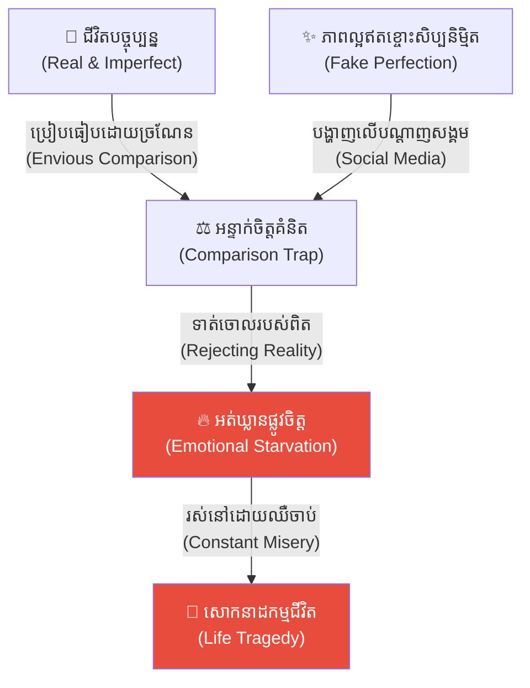
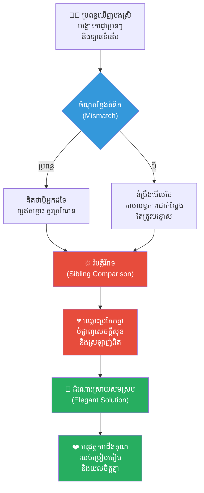
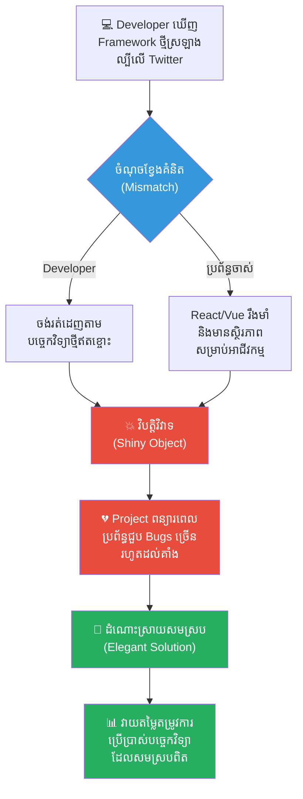
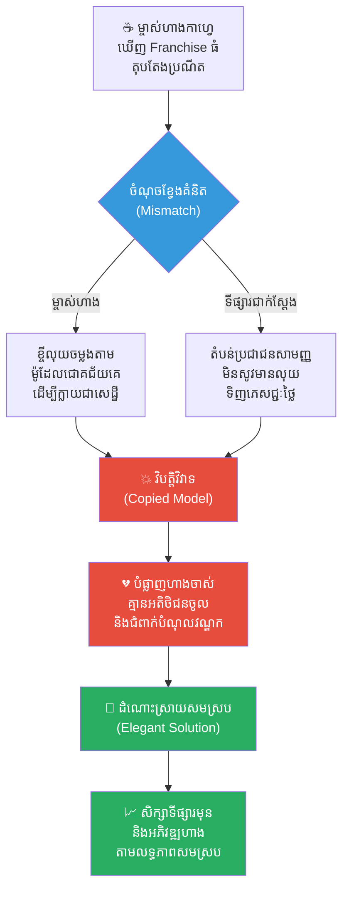
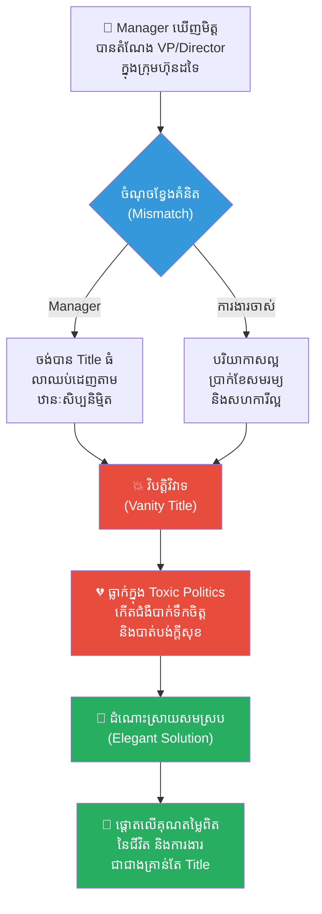
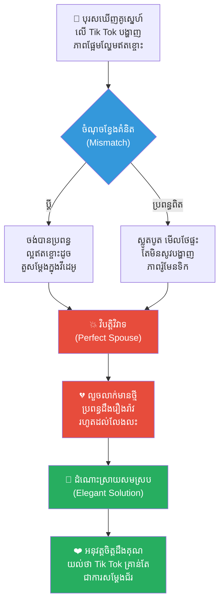
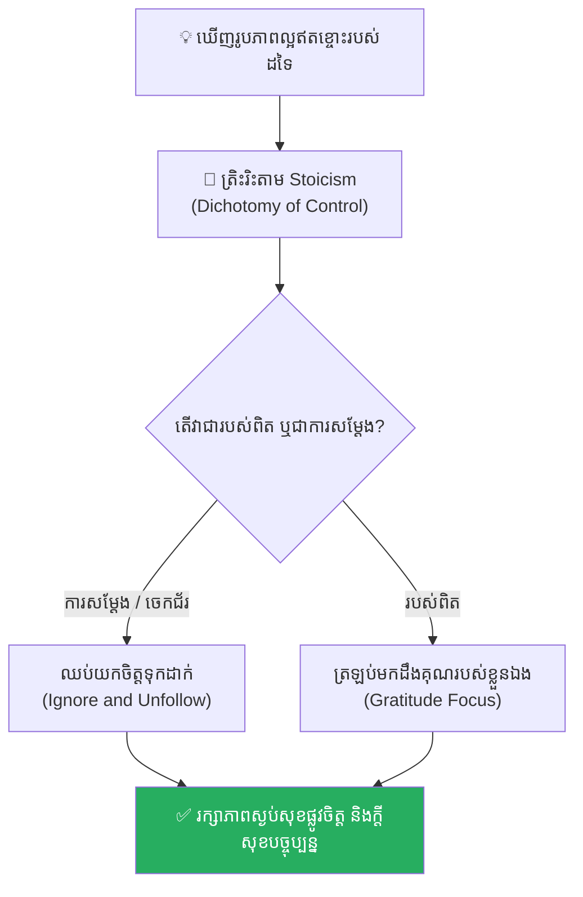

# The Perfect Banana Illusion (សត្វស្វា និងផ្លែចេកសប្បនិម្មិត)៖ គ្រោះថ្នាក់នៃការដេញតាមភាពល្អឥតខ្ចោះសិប្បនិម្មិត និងការបំផ្លាញក្តីសុខបច្ចុប្បន្ន

**Author:** ichamrong  
**Date:** 2026-05-17  
**Tags:** #social-media-illusion #comparison-trap #mental-health #life-lessons #stoicism #critical-thinking  
**Category:** Concepts  
**Read Time:** ~15 min  

---

## 📌 មាតិកា (Table of Contents)
- [អន្ទាក់ផ្លូវចិត្ត (The Trap)](#អន្ទាក់ផ្លូវចិត្ត-the-trap)
- [១. រឿងសត្វស្វា និង ផ្លែចេកសប្បនិម្មិត (The Monkey and the Artificial Banana)](#1)
  - [ការពិសោធន៍ចិត្តវិទ្យារបស់ លោកបណ្ឌិត វុហ្វហ្គាំង (Dr. Wolfgang's Experiment)](#1-1)
- [២. បញ្ហា៖ ការប្រៀបធៀបក្នុងជីវិតពិត (The Issue: The Social Media Comparison Trap)](#2)
- [៣. ឧទាហរណ៍ជាក់ស្តែងក្នុងពិភពពិត (Real World Examples)](#3)
  - [ឧទាហរណ៍ទី ១ — កម្រិតស្រាល (គ្រួសារ)៖ ការប្រៀបធៀបជីវភាពគ្រួសារ (The Sibling Comparison Trap)](#3-1)
  - [ឧទាហរណ៍ទី ២ — កម្រិតមធ្យម (បច្ចេកទេស)៖ Developer និងបច្ចេកវិទ្យាថ្មីៗ (The Shiny Object Syndrome)](#3-2)
  - [ឧទាហរណ៍ទី ៣ — កម្រិតមធ្យម (ធុរកិច្ច)៖ ការចម្លងតាមម៉ូដែលជោគជ័យរបស់អ្នកដទៃ (The Copied Business Model)](#3-3)
  - [ឧទាហរណ៍ទី ៤ — កម្រិតមធ្យម (សង្គម/គ្រប់គ្រង)៖ ការដេញតាម Title និងឋានៈក្នុងក្រុមហ៊ុន (The Vanity Title Chase)](#3-4)
  - [ឧទាហរណ៍ទី ៥ — កម្រិតធ្ងន់ (ទំនាក់ទំនង)៖ ការរំពឹងទុកដៃគូជីវិតឥតខ្ចោះ (The Perfect Spouse Illusion)](#3-5)
- [៤. ដំណោះស្រាយទូទៅ៖ Stoicism និងការស្កប់ស្កល់នឹងអ្វីដែលមាន (The General Solution: Stoicism and Appreciation)](#4)
- [សេចក្តីសន្និដ្ឋាន (Conclusion)](#conclusion)
- [ឯកសារយោង (References)](#references)
- [Related Posts](#related-posts)

---

## អន្ទាក់ផ្លូវចិត្ត (The Trap)

តើអ្នកធ្លាប់មានអារម្មណ៍ថា ជីវិតរបស់អ្នកមិនល្អគ្រប់គ្រាន់ ផ្ទះរបស់អ្នកមិនស្អាតគ្រប់គ្រាន់ ឬការងាររបស់អ្នកមិនឡូយគ្រប់គ្រាន់ គ្រាន់តែបន្ទាប់ពីអ្នកបានអូសមើលរូបភាព ឬវីដេអូរបស់នរណាម្នាក់នៅលើបណ្តាញសង្គមដែរឬទេ?

នេះគឺជា **The Perfect Banana Illusion (អន្ទាក់ផ្លែចេកសប្បនិម្មិត)**។ មនុស្សយើងភាគច្រើនតែងតែមានរបស់ល្អៗនៅក្នុងដៃរួចទៅហើយ (ដូចជាការងារដ៏មានស្ថិរភាព ដៃគូជីវិតដ៏គួរឱ្យស្រឡាញ់ ឬសុខភាពដ៏ល្អមាំមួន) ប៉ុន្តែយើងបែរជាបោះបង់ ឬទាត់ចោលរបស់ពិតប្រាកដទាំងនោះ ដើម្បីដេញតាមរូបភាពស្រមើស្រមៃដ៏ល្អឥតខ្ចោះដែលគេបង្កើតឡើងដើម្បីតែការបង្ហាញលើបណ្តាញសង្គមប៉ុណ្ណោះ។ ជាលទ្ធផល យើងរស់នៅដោយការអត់ឃ្លានផ្លូវចិត្ត និងបំផ្លាញក្តីសុខបច្ចុប្បន្នដោយដៃខ្លួនឯង។

ដើម្បីយល់ដឹងឱ្យបានគ្រប់ជ្រុងជ្រោយ នេះជាផែនទីបង្ហាញផ្លូវសម្រាប់អត្ថបទនេះ៖
1. **រឿងពិសោធន៍វិទ្យាសាស្ត្រ (The Scientific Experiment)** — ការពិសោធន៍របស់បណ្ឌិត Wolfgang ជាមួយសត្វស្វា និងផ្លែចេកជ័រលាបពណ៌ជក់ចិត្ត។
2. **បញ្ហា (The Issue)** — តើខួរក្បាលរបស់យើងរងឥទ្ធិពលពីបណ្តាញសង្គម និងការប្រៀបធៀបលំអៀងយ៉ាងដូចម្តេច?
3. **ឧទាហរណ៍ជាក់ស្តែងក្នុងពិភពពិត (Real World Examples)** — ពិនិត្យមើលឥទ្ធិពលនេះក្នុងកម្រិតគ្រួសារ ការងារបច្ចេកទេស ធុរកិច្ច ការគ្រប់គ្រង និងទំនាក់ទំនងស្នេហា។
4. **ដំណោះស្រាយទូទៅ (The General Solution)** — ការអនុវត្តទស្សនវិជ្ជា Stoicism និងការបង្កើតទម្លាប់ដឹងគុណចំពោះអ្វីដែលមាន។

---

## ១. រឿងសត្វស្វា និង ផ្លែចេកសប្បនិម្មិត (The Monkey and the Artificial Banana)

នៅក្នុងមន្ទីរពិសោធន៍ចិត្តវិទ្យា (Psychology Laboratory) មួយនាទីក្រុងប៊ែកឡាំង ប្រទេសអាល្លឺម៉ង់ លោកបណ្ឌិត **វុហ្វហ្គាំង (Dr. Wolfgang)** បានធ្វើការពិសោធន៍ (Experiment) មួយដ៏គួរឱ្យចាប់អារម្មណ៍ទាក់ទងនឹងការយល់ឃើញ និងការពេញចិត្តរបស់សត្វលោក។

គាត់បានរៀបចំទ្រុងដែកធំមួយដែលមានសត្វស្វាមួយក្បាលរស់នៅ។ នៅខាងក្រៅទ្រុងដែក លោកបណ្ឌិតបានដាក់តាំងបង្ហាញផ្លែចេកសប្បនិម្មិត (Artificial Banana) ដ៏ធំមួយ ដែលត្រូវបានធ្វើឡើងពីជ័រយ៉ាងប្រណីត និងមានពណ៌លឿងទុំភ្លឺរលោងគួរឱ្យទាក់ទាញខ្លាំងណាស់។ វាជាផ្លែចេកដែលមើលទៅល្អឥតខ្ចោះ គ្មានស្នាមអុច ឬការខូចខាតសូម្បីតែបន្តិច។

នៅពេលនោះ សត្វស្វានៅក្នុងទ្រុងកំពុងតែកាន់ផ្លែចេកពិតប្រាកដមួយនៅក្នុងដៃរបស់វាផងដែរ។ វាជាផ្លែចេកធម្មជាតិដែលមានស្នាមអុចខ្មៅៗ និងរាងវៀចបន្តិចបន្តួច ដូចជាចេកទូទៅដែលយើងធ្លាប់ឃើញ។ ទោះបីជាសត្វស្វានោះទើបតែបានស៊ីចេកឆ្អែតថ្មីៗក៏ដោយ ក៏ក្រសែភ្នែករបស់វាចាប់ផ្តើមងាកទៅសម្លឹងមើលផ្លែចេកជ័រដ៏ល្អឥតខ្ចោះនៅខាងក្រៅទ្រុងដោយមិនព្រិចភ្នែកឡើយ។

---

### ការពិសោធន៍ចិត្តវិទ្យារបស់ លោកបណ្ឌិត វុហ្វហ្គាំង (Dr. Wolfgang's Experiment)

មួយសន្ទុះក្រោយមក វាក៏បានងាកមកមើលផ្លែចេកដ៏តូចកំប៉ិតនៅក្នុងដៃរបស់ខ្លួនឯង។ ស្រាប់តែវាចាប់ផ្តើមមានអារម្មណ៍ធុញទ្រាន់ ខ្ពើមរអើម និងមានអារម្មណ៍ថាផ្លែចេករបស់ខ្លួនមានតម្លៃទាបបំផុត។ ចាប់ពីថ្ងៃនោះមក អត្តចរិត (Behavior) របស់សត្វស្វាមួយនេះក៏បានប្រែប្រួលទាំងស្រុង។

រាល់ពេលដែលលោកបណ្ឌិត វុហ្វហ្គាំង បានបោះផ្លែចេកស្រស់ៗ និងមានជីវជាតិចូលទៅក្នុងទ្រុងឱ្យវាស៊ី វា**មិនទាន់ទាំងបានហិតក្លិនផង ក៏ទាត់ចោលភ្លាមៗដោយក្តីរង្កៀស**។ វាយល់ថាផ្លែចេកធម្មជាតិទាំងអស់នោះ សុទ្ធតែជារបស់អន់ និងមិនល្អឥតខ្ចោះដូចផ្លែចេកនៅខាងក្រៅទ្រុងនោះឡើយ។

ជារៀងរាល់ថ្ងៃ វាបានត្រឹមតែខំប្រឹងបុកទម្លុះទ្រុងដែក បែកដៃបែកជើង ដើម្បីស្រវាចាប់យកផ្លែចេកដ៏ល្អឥតខ្ចោះនៅខាងក្រៅនោះ។ ជាអកុសល ប៉ុន្មានថ្ងៃក្រោយមក **សត្វស្វាក៏បានដួលស្លាប់ដោយសារតែការអត់អាហារ (Starvation)** ខណៈដែលនៅជុំវិញខ្លួនរបស់វា សុទ្ធសឹងតែជាផ្លែចេកស្រស់ៗដែលវាបានទាត់ចោល។ អ្វីដែលគួរឱ្យសង្វេគបំផុតនោះគឺ ផ្លែចេកដ៏ល្អឥតខ្ចោះដែលវាសុខចិត្តស្លាប់ដើម្បីតែចង់បាននោះ **តាមពិតទៅវាគ្រាន់តែជាផ្លែចេកជ័រដែលគេលាបពណ៌បោកប្រាស់ភ្នែក (Optical Illusion) តែប៉ុណ្ណោះ**។

---

## ២. បញ្ហា៖ ការប្រៀបធៀបក្នុងជីវិតពិត (The Issue: The Social Media Comparison Trap)

នៅក្នុងសង្គមបច្ចុប្បន្ន បណ្តាញសង្គម (Facebook, Instagram, TikTok) ដើរតួជា **«ផ្លែចេកសប្បនិម្មិត»** ដ៏ធំមួយ។

មនុស្សភាគច្រើនតែងតែបង្ហាញតែផ្នែកដ៏ល្អឥតខ្ចោះ រូបភាពកែច្នៃ ដំណើរកម្សាន្តប្រណីត និងជោគជ័យដ៏អស្ចារ្យរបស់ពួកគេ (Highlight Reel) ប៉ុណ្ណោះ។ ពេលយើងយកជីវិតពិតប្រចាំថ្ងៃរបស់យើង ដែលពោរពេញដោយភាពនឿយហត់ និងបញ្ហាស្មុគស្មាញ (ផ្លែចេកពិតដែលមានស្នាមអុចខ្មៅ) ទៅប្រៀបធៀបជាមួយរូបភាពសិប្បនិម្មិតទាំងនោះ យើងនឹងធ្លាក់ចូលទៅក្នុងអន្ទាក់៖
* **ការបាត់បង់ការដឹងគុណ៖** យើងចាប់ផ្តើមទាត់ចោលនូវក្តីសុខសាមញ្ញ និងមនុស្សល្អៗដែលនៅជុំវិញខ្លួន។
* **ជំងឺមិនស្កប់ស្កល់ (Chronic Dissatisfaction)៖** ការចង់បានរបស់ដែលមិនមានពិត ប្រៀបដូចជាការរត់ដេញតាមស្រមោល។
* **ការខូចខាតផ្លូវចិត្ត៖** ការកើតជំងឺបាក់ទឹកចិត្ត និងស្រ្តេសដោយសារការប្រៀបធៀបមិនចេះចប់។

---

## ៣. ឧទាហរណ៍ជាក់ស្តែងក្នុងពិភពពិត

ដើម្បីយល់ដឹងឱ្យកាន់តែស៊ីជម្រៅ ផ្លូវការសិក្សានឹងនាំអ្នកទៅពិនិត្យមើល **ឧទាហរណ៍ចំនួន ៥ កម្រិតខុសៗគ្នា** ក្នុងជីវិតរស់នៅប្រចាំថ្ងៃ៖

---

### ឧទាហរណ៍ទី ១ — កម្រិតស្រាល (គ្រួសារ)៖ ការប្រៀបធៀបជីវភាពគ្រួសារ (The Sibling Comparison Trap)

**ស្ថានភាព៖** កូនស្រីម្នាក់មានប្តីដែលមានជីវភាពមធ្យម ស្រឡាញ់ និងមើលថែទាំនាងយ៉ាងល្អ។ តែនាងតែងតែមើលឃើញបងស្រីរបស់នាងបង្ហោះរូបភាពកាដូកាបូបប្រ៊េនៗ និងឡានទំនើបដែលប្តីរបស់បងស្រីទិញឱ្យនៅលើបណ្តាញសង្គម។

* **ភាគី A (ប្រពន្ធ)៖** ចាប់ផ្តើមមានអារម្មណ៍ថាក្តីស្រឡាញ់របស់ប្តីខ្លួនគ្មានតម្លៃ។ នាងឈ្លោះប្រកែក និងបន្ទោសប្តីថា «អសមត្ថភាព»។
* **ភាគី B (ប្តី)៖** មានអារម្មណ៍ថាការខិតខំប្រឹងប្រែងរបស់ខ្លួនត្រូវបានមើលរំលង។ គាត់ចាប់ផ្តើមដកខ្លួនចេញពីទំនាក់ទំនង។

**ការពិតដ៏ជូរចត់៖**
តាមពិតទៅ ជីវិតអាពាហ៍ពិពាហ៍របស់បងស្រីនាងពោរពេញដោយការឈ្លោះប្រកែក និងបំណុលវណ្ឌកដែលលាក់បាំងពីក្រោយរូបភាពដ៏ស្អាតនៅលើ Instagram។ ការដេញតាមចេកជ័រ បានបំផ្លាញសេចក្តីសុខពិតប្រាកដក្នុងគ្រួសាររបស់នាង។

---

### ឧទាហរណ៍ទី ២ — កម្រិតមធ្យម (បច្ចេកទេស)៖ Developer និងបច្ចេកវិទ្យាថ្មីៗ (The Shiny Object Syndrome)

**ស្ថានភាព៖** Developer ម្នាក់កំពុងប្រើប្រាស់ Framework មួយដ៏រឹងមាំ និងមានស្ថិរភាព (ដូចជា React/Vue) សម្រាប់ Project របស់ក្រុមហ៊ុន។ ស្រាប់តែគាត់ឃើញការបង្ហោះលើ Twitter ពី Framework ថ្មីស្រឡាងមួយទៀតដែលអះអាងថាលឿនជាង និងទំនើបជាង (The Shiny Framework)។

* **ភាគី A (Developer)៖** ទាត់ចោល Framework ចាស់ និងព្យាយាមសរសេរកូដឡើងវិញទាំងស្រុងដោយប្រើ Framework ថ្មីនោះ ទោះបីជាគ្មានការគាំទ្រពីសហគមន៍ច្បាស់លាស់ក៏ដោយ។
* **ភាគី B (ក្រុមហ៊ុន)៖** Project ត្រូវពន្យារពេល និងជួបប្រទះ Bugs ដ៏ស្មុគស្មាញជាច្រើន ដែលធ្វើឱ្យប្រព័ន្ធទាំងមូលគាំងដំណើរការ។

**ការពិតដ៏ជូរចត់៖**
ការរត់ដេញតាមរបស់ដែលមើលទៅល្អឥតខ្ចោះចំពោះមុខ ដោយមិនសិក្សាពីតម្រូវការជាក់ស្តែង បាននាំមកនូវការខូចខាតដល់ផលិតផល និងទំនុកចិត្តរបស់អតិថិជន។

---

### ឧទាហរណ៍ទី ៣ — កម្រិតមធ្យម (ធុរកិច្ច)៖ ការចម្លងតាមម៉ូដែលជោគជ័យរបស់អ្នកដទៃ (The Copied Business Model)

**ស្ថានភាព៖** ម្ចាស់ហាងកាហ្វេសាមញ្ញម្នាក់ដែលកំពុងលក់ដាច់ប្រចាំថ្ងៃ ស្រាប់តែឃើញព័ត៌មានពីការបង្កើត Franchise ហាងតែកាហ្វេដ៏ធំមួយដែលមានការតុបតែងប្រណីត និងទទួលបានការពេញនិយមខ្លាំងពីយុវវ័យ។

* **ភាគី A (ម្ចាស់ហាង)៖** សម្រេចចិត្តខ្ចីបុលលុយធនាគារមកកម្ទេចហាងចាស់ចោល និងទិញ Franchise ថ្លៃនោះមកដំណើរការ ដោយសង្ឃឹមថានឹងក្លាយជាសេដ្ឋីភ្លាមៗ។
* **ភាគី B (ទីផ្សារ)៖** តំបន់នោះជាតំបន់ប្រជាជនសាមញ្ញដែលមិនសូវមានលុយទិញភេសជ្ជៈតម្លៃថ្លៃ។ ហាងថ្មីគ្មានអតិថិជនចូលឡើយ。

**ការពិតដ៏ជូរចត់៖**
គាត់បានបំផ្លាញអាជីវកម្មដែលមានស្ថិរភាពរបស់ខ្លួន ដើម្បីដេញតាមម៉ូដែលជោគជ័យរបស់គេដែលមិនត្រូវនឹងស្ថានភាពជាក់ស្តែងរបស់ខ្លួន។

---

### ឧទាហរណ៍ទី ៤ — កម្រិតមធ្យម (សង្គម/គ្រប់គ្រង)៖ ការដេញតាម Title និងឋានៈក្នុងក្រុមហ៊ុន (The Vanity Title Chase)

**ស្ថានភាព៖** Manager ម្នាក់កំពុងធ្វើការងារក្នុងក្រុមហ៊ុនមួយដែលមានបរិយាកាសល្អ ប្រាក់ខែសមរម្យ និងសហការីគួរឱ្យស្រឡាញ់។ តែគាត់ឃើញមិត្តភក្តិរួមជំនាន់របស់គាត់ទទួលបានតំណែងជា «Director» ឬ «VP» នៅក្នុងក្រុមហ៊ុនដទៃ។

* **ភាគី A (Manager)៖** សម្រេចចិត្តលាឈប់ពីការងារចាស់ដើម្បីទៅទទួលយកតំណែង VP នៅក្នុងក្រុមហ៊ុនថ្មីមួយដែលពោរពេញដោយ Toxic politics និងការកៀបសង្កត់ការងារយ៉ាងខ្លាំង។
* **ភាគី B (សុខភាពផ្លូវចិត្ត)៖** គាត់កើតជំងឺបាក់ទឹកចិត្ត និងស្ត្រេសខ្លាំង រហូតដល់ត្រូវសម្រាកព្យាបាលនៅមន្ទីរពេទ្យ。

**ការពិតដ៏ជូរចត់៖**
តំណែងធំគ្រាន់តែជា «ចេកជ័រ» ដែលលាបពណ៌ឱ្យល្អមើលពីខាងក្រៅ តែគ្មានក្តីសុខ និងសេរីភាពពិតប្រាកដឡើយ។

---

### ឧទាហរណ៍ទី ៥ — កម្រិតធ្ងន់ (ទំនាក់ទំនង)៖ ការរំពឹងទុកដៃគូជីវិតឥតខ្ចោះ (The Perfect Spouse Illusion)

**ស្ថានភាព៖** បុរសម្នាក់មានប្រពន្ធដែលពូកែមើលថែទាំផ្ទះ ស្លូតបូត និងស្រឡាញ់គាត់។ ប៉ុន្តែគាត់តែងតែមើលឃើញគូស្នេហ៍នៅលើ Tik Tok ដែលបង្ហាញពីការរ៉ូមែនទិក ការផ្អែមល្ហែម និងការយកចិត្តទុកដាក់ឥតខ្ចោះ។

* **ភាគី A (ប្តី)៖** ចាប់ផ្តើមធុញទ្រាន់នឹងប្រពន្ធខ្លួនឯង និងរំពឹងឱ្យប្រពន្ធធ្វើខ្លួនឱ្យផ្អែមល្ហែមដូចតួសម្តែងក្នុងវីដេអូ។ គាត់ចាប់ផ្តើមមានទំនាក់ទំនងក្រៅផ្លូវការជាមួយអ្នកផ្សេងដែលមើលទៅរ៉ូមែនទិកជាង។
* **ភាគី B (ប្រពន្ធ)៖** សម្រេចចិត្តលែងលះបន្ទាប់ពីដឹងរឿងរ៉ាវក្បត់ចិត្ត。

**ការពិតដ៏ជូរចត់៖**
គាត់បានបាត់បង់ប្រពន្ធដ៏ល្អម្នាក់ពេញមួយជីវិត ព្រោះតែការដេញតាមស្នេហាក្លែងក្លាយនៅលើបណ្តាញសង្គម ដែលត្រូវបានរៀបចំឡើងដោយការសម្តែងប៉ុណ្ណោះ។

---

## ៤. ដំណោះស្រាយទូទៅ៖ Stoicism និងការស្កប់ស្កល់នឹងអ្វីដែលមាន (The General Solution: Stoicism and Appreciation)

ដើម្បីរំដោះខ្លួនចេញពីអន្ទាក់ The Perfect Banana Illusion អ្នកត្រូវអនុវត្តវិធីសាស្ត្រគន្លឹះទាំងនេះ៖

### ១. អនុវត្តច្បាប់ Dichotomy of Control (Stoicism)
បែងចែកឱ្យច្បាស់រវាង «អ្វីដែលយើងអាចគ្រប់គ្រងបាន» (គំនិត សកម្មភាព ការដឹងគុណរបស់យើង) និង «អ្វីដែលយើងមិនអាចគ្រប់គ្រងបាន» (ជីវិតរបស់ដទៃ រូបភាពនៅលើបណ្តាញសង្គម)។ ផ្តោតថាមពលតែលើអ្វីដែលយើងអាចគ្រប់គ្រងបានប៉ុណ្ណោះ។

### ២. ធ្វើ Digital Detox និងឈប់ប្រៀបធៀប
កាត់បន្ថយពេលវេលាប្រើប្រាស់បណ្តាញសង្គម ឬ Unfollow គណនីណាដែលធ្វើឱ្យអ្នកកើតអារម្មណ៍ច្រណែន និងខ្វះខាត។ ចងចាំថាអ្វីដែលគេបង្ហាញ គ្រាន់តែជាជ្រុងតូចមួយនៃការពិតប៉ុណ្ណោះ។

### ៣. អនុវត្តទម្លាប់ដឹងគុណប្រចាំថ្ងៃ (Gratitude Journaling)
រៀងរាល់ព្រឹក សរសេររបស់ ៣ យ៉ាងដែលអ្នកមាន និងមានអារម្មណ៍រីករាយជាមួយ (ដូចជាការមានកាហ្វេក្តៅមួយកែវ ផ្ទះដ៏កក់ក្តៅ ឬការមានស្នាមញញឹមពីមនុស្សជាទីស្រឡាញ់)។ របស់សាមញ្ញទាំងនេះហើយគឺជា «ផ្លែចេកពិត» ដែលមានឱជារសបំផុត។

---

## សេចក្តីសន្និដ្ឋាន (Conclusion)

> **«ក្តីសុខពិតប្រាកដក្នុងជីវិត មិនមែនជាការរត់ដេញតាមផ្លែចេកជ័រដ៏ល្អឥតខ្ចោះដែលនៅខាងក្រៅទ្រុងនោះឡើយ។ ប៉ុន្តែវាគឺជាការចេះរីករាយ និងដឹងគុណចំពោះរាល់ផ្លែចេកធម្មជាតិដែលមានស្នាមអុចខ្មៅនៅក្នុងដៃរបស់អ្នកផ្ទាល់។»**

សត្វស្វាបានស្លាប់ដោយអត់អាហារ ព្រោះវាមើលងាយរបស់ពិតដែលវាកំពុងមាន។ ចូរកុំធ្វើជាសត្វស្វានៅក្នុងទ្រុងពិសោធន៍ផ្លូវចិត្តរបស់បណ្តាញសង្គមឡើយ។

ចូរស្រឡាញ់ផ្លែចេកដែលមានស្នាមអុចខ្មៅរបស់អ្នក។

---

## ឯកសារយោង (References)

* **Aurelius, M.** — *Meditations*. ទស្សនវិជ្ជា Stoicism នៃការស្កប់ស្កល់ និងការគ្រប់គ្រងចិត្តខ្លួនឯង។
* **Kahneman, D.** — *Thinking, Fast and Slow* (2011). ការវិភាគលើការលំអៀងនៃការយល់ឃើញរបស់មនុស្ស (Cognitive Biases)។
* **Vogel, E. A., et al.** — *Social Media Use and Temporarily Instigated Comparison Processes* (2014). ការសិក្សាពីឥទ្ធិពលបណ្តាញសង្គមលើទំនុកចិត្តផ្ទាល់ខ្លួន។

---

## Related Posts

* **[Relative Deprivation Effect (ឥទ្ធិពលនៃការដកហូតដោយការប្រៀបធៀប)៖ គ្រោះថ្នាក់នៃដង្ហើមច្រណែន និងការបំផ្លាញខ្លួនឯងព្រោះតែស៊ុបសាច់ចៀមមួយចាន](./02-relative-deprivation-effect.md)** — Pain of social comparisons.
* **[The Angel vs. The Demon Dilemma (ចំណោទបញ្ហារវាងទេវតា និងបិសាច)៖ ជម្រើសដ៏ពិបាករវាងប្រយោជន៍រួម និងសេចក្តីស្នេហាដាច់ខាតគ្មានលក្ខខណ្ឌ](./03-angel-and-demon-dilemma.md)** — Choosing between artificial standards and real duties.
* **[The Law of Value (ច្បាប់នៃតម្លៃ)៖ ហេតុអ្វីបានជាការខិតខំប្រឹងប្រែងតែម្ខាង មិនអាចកំណត់តម្លៃពិតប្រាកដរបស់អ្នកបាន?](./05-the-law-of-value.md)** — Determining real worth versus projected perception.
