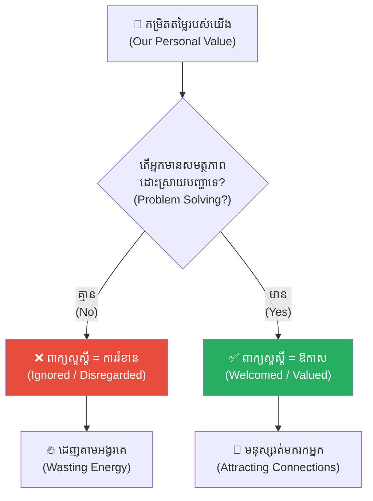
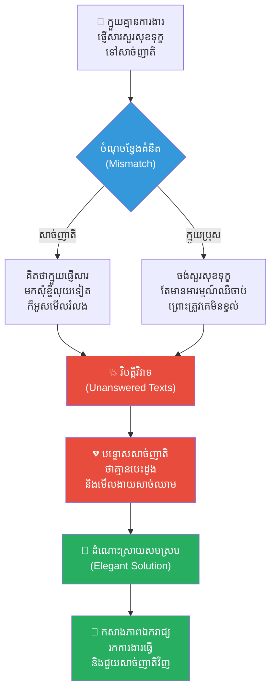
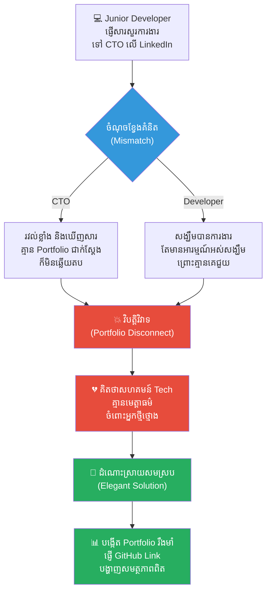
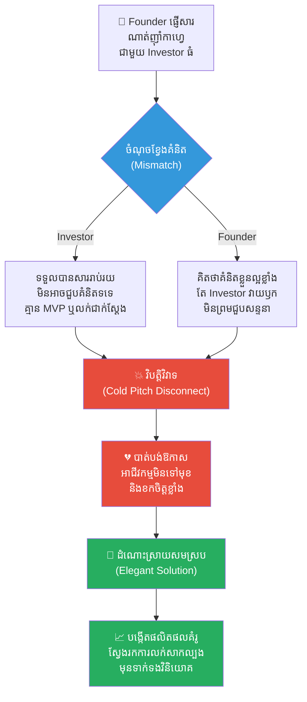
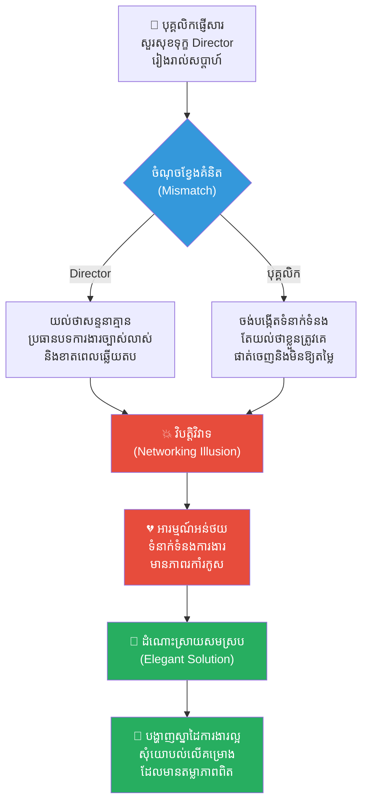
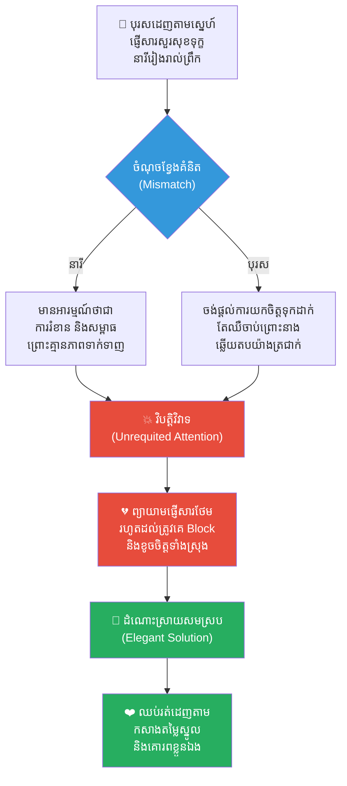
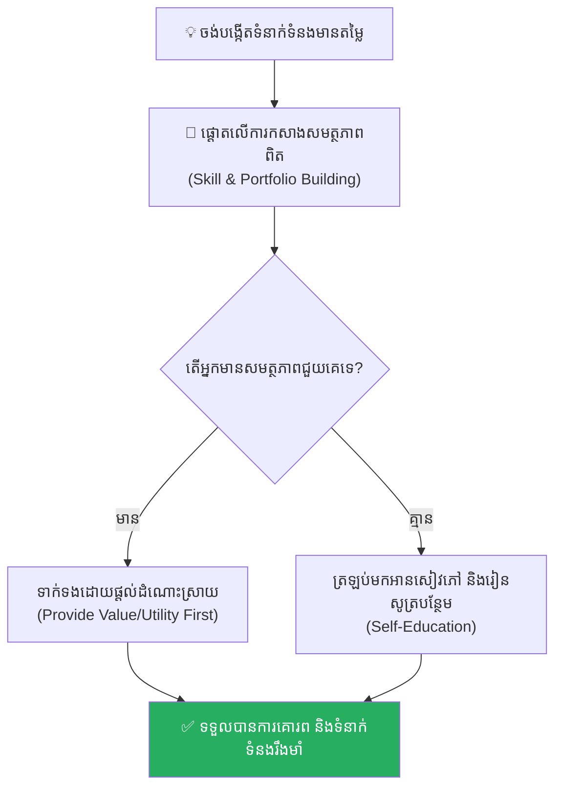

# The Law of Value (ច្បាប់នៃតម្លៃ និងពាក្យសួស្តី)៖ ហេតុអ្វីបានជាការខិតខំប្រឹងប្រែងតែម្ខាង មិនអាចកំណត់តម្លៃពិតប្រាកដរបស់អ្នកបាន?

**Author:** ichamrong  
**Date:** 2026-05-17  
**Tags:** #law-of-value #self-development #social-dynamics #life-lessons #stoicism #critical-thinking  
**Category:** Concepts  
**Read Time:** ~15 min  

---

## 📌 មាតិកា (Table of Contents)
- [អន្ទាក់ផ្លូវចិត្ត (The Trap)](#អន្ទាក់ផ្លូវចិត្ត-the-trap)
- [១. ទម្ងន់នៃពាក្យសួស្តី (The Weight of "Hello")](#1)
- [២. ការពិតនៃទំនាក់ទំនងសង្គម (The Issue: Relational Exchange Theory)](#2)
- [៣. ឧទាហរណ៍ជាក់ស្តែងក្នុងពិភពពិត (Real World Examples)](#3)
  - [ឧទាហរណ៍ទី ១ — កម្រិតស្រាល (គ្រួសារ)៖ ការផ្ញើសារសួរសុខទុក្ខសាច់ញាតិ (The Unanswered Family Texts)](#3-1)
  - [ឧទាហរណ៍ទី ២ — កម្រិតមធ្យម (បច្ចេកទេស)៖ Developer គ្មានបណ្តាញទំនាក់ទំនង ឬស្នាដៃ (The Portfolio vs. Cold Outreach)](#3-2)
  - [ឧទាហរណ៍ទី ៣ — កម្រិតមធ្យម (ធុរកិច្ច)៖ ការប្រឹងប្រែងទាក់ទងវិនិយោគិន (The Cold Pitch Disconnect)](#3-3)
  - [ឧទាហរណ៍ទី ៤ — កម្រិតមធ្យម (សង្គម/គ្រប់គ្រង)៖ ការសុំជំនួយពីអ្នកមានអំណាច (The Networking Illusion)](#3-4)
  - [ឧទាហរណ៍ទី ៥ — កម្រិតធ្ងន់ (ទំនាក់ទំនង)៖ ការព្យាយាមផ្គាប់ចិត្តដៃគូដែលមិនស្រឡាញ់ (The Unrequited Attention Trap)](#3-5)
- [៤. ដំណោះស្រាយទូទៅ៖ ការកសាងតម្លៃស្នូល និងសមត្ថភាពពិត (The General Solution: Building Core Competence)](#4)
- [សេចក្តីសន្និដ្ឋាន (Conclusion)](#conclusion)
- [ឯកសារយោង (References)](#references)
- [Related Posts](#related-posts)

---

## អន្ទាក់ផ្លូវចិត្ត (The Trap)

តើអ្នកធ្លាប់ផ្ញើសារសួរសុខទុក្ខទៅកាន់នរណាម្នាក់ ប៉ុន្តែត្រូវបានពួកគេអូសមើលរំលង ឬឆ្លើយតបមកវិញយ៉ាងត្រជាក់ស្រទំ ដែលធ្វើឱ្យអ្នកមានអារម្មណ៍ថាខ្លួនអន់ថយ និងគ្មានតម្លៃដែរឬទេ?

មនុស្សភាគច្រើនតែងតែយល់ថា ទំនាក់ទំនងកើតចេញពី **«ភាពរួសរាយរាក់ទាក់»** ឬ **«ទឹកចិត្តល្អ»**។ យ៉ាងណាមិញ នៅក្នុងពិភពពិតរបស់មនុស្សពេញវ័យ ទំនាក់ទំនងសង្គមភាគច្រើនមិនដំណើរការតាមរបៀបមនោសញ្ចេតនានោះទេ។ ផ្ទុយទៅវិញ វារត់តាម **The Law of Value (ច្បាប់នៃតម្លៃ)** និង **Relational Exchange Theory (ទ្រឹស្តីដោះដូរទំនាក់ទំនង)**។ នៅពេលអ្នកពុំទាន់មានតម្លៃ ឬសមត្ថភាពក្នុងការដោះស្រាយបញ្ហាឱ្យពួកគេឡើយ សូម្បីតែពាក្យ «សួស្តី» ដ៏ផ្អែមល្ហែមរបស់អ្នក ក៏អាចក្លាយជាការរំខានដ៏គួរឱ្យធុញទ្រាន់មួយសម្រាប់ពួកគេដែរ។

ដើម្បីយល់ដឹងឱ្យបានគ្រប់ជ្រុងជ្រោយ នេះជាផែនទីបង្ហាញផ្លូវសម្រាប់អត្ថបទនេះ៖
1. **ទម្ងន់នៃពាក្យសួស្តី (The Weight of Hello)** — ការវិភាគពីការឆ្លើយតបដ៏ត្រជាក់ស្រទំ និងការពិតចាក់ដោតដែលមនុស្សច្រើនតែមើលរំលង។
2. **បញ្ហា (The Issue)** — តើច្បាប់នៃតម្លៃ និងទ្រឹស្តីដោះដូរទំនាក់ទំនង (Social Exchange Theory) ដំណើរការយ៉ាងដូចម្តេច?
3. **ឧទាហរណ៍ជាក់ស្តែងក្នុងពិភពពិត (Real World Examples)** — ពិនិត្យមើលឥទ្ធិពលនេះក្នុងកម្រិតគ្រួសារ ការងារបច្ចេកទេស ធុរកិច្ច ការគ្រប់គ្រង និងទំនាក់ទំនងស្នេហា។
4. **ដំណោះស្រាយទូទៅ (The General Solution)** — ការបង្វែរថាមពលមកផ្តោតលើការកសាងតម្លៃខ្លួនឯង ដើម្បីទាក់ទាញមនុស្សដោយស្វ័យប្រវត្តិ។

---

## ១. ទម្ងន់នៃពាក្យសួស្តី (The Weight of "Hello")

**នៅពេលដែលបុគ្គលម្នាក់ពុំទាន់មានតម្លៃគ្រប់គ្រាន់ សូម្បីតែពាក្យ “សួស្តី” ដែលផ្ញើទៅកាន់អ្នកដទៃ ក៏អាចក្លាយជាការរំខានមួយសម្រាប់ពួកគេដែរ។** 

ប្រយោគនេះស្តាប់ទៅហាក់បីដូចជាមានភាពចាក់ដោតនិងឈឺចាប់យ៉ាងខ្លាំង ប៉ុន្តែវាបានឆ្លុះបញ្ចាំងពីការពិតមួយដែលមនុស្សជាច្រើនតែងតែព្យាយាមមើលរំលង។ ជាទូទៅ យើងតែងតែគិតថា ការសួរសុខទុក្ខគឺជាការបង្ហាញនូវភាពកក់ក្តៅ និងការនឹករលឹកចំពោះគ្នាទៅវិញទៅមក។ យ៉ាងណាមិញ នៅពេលដែលយើងឈានជើងចូលក្នុងសង្គមពេញវ័យ ឬពិភពការងារ នោះយើងនឹងដឹងថា ទំនាក់ទំនងសង្គម (Social connections) ភាគច្រើនមិនបានពឹងផ្អែកទៅលើអារម្មណ៍តែមួយមុខនោះទេ ប៉ុន្តែវាត្រូវបានចងភ្ជាប់យ៉ាងជិតស្និទ្ធទៅនឹង **“អត្ថប្រយោជន៍” (Utility)** និង **“តម្លៃ” (Value)** របស់បុគ្គលម្នាក់ៗ។

មនុស្សមួយចំនួនទទួលបានការឲ្យតម្លៃដោយសារតែសមត្ថភាពរបស់ពួកគេក្នុងការដោះស្រាយបញ្ហាឲ្យអ្នកដទៃ អ្នកខ្លះទៀតមានតម្លៃដោយសារពួកគេមានបណ្តាញទំនាក់ទំនងទូលំទូលាយ (Extensive network) មានឥទ្ធិពល (Influence) មានធនធានហិរញ្ញវត្ថុ (Financial resources) ឬមានលទ្ធភាពក្នុងការផ្តល់ឱកាស (Opportunities) ដល់អ្នកដទៃ។ ផ្ទុយទៅវិញ នៅពេលដែលអ្នកពុំទាន់មានចំណុចខ្លាំងណាមួយនៅក្នុងដៃ ការសួរសុខទុក្ខរបស់អ្នកអាចនឹងត្រូវបានចាត់ទុកថាជារឿងទទេស្អាត និងគ្មានទម្ងន់អ្វីទាំងអស់។

---

## ២. ការពិតនៃទំនាក់ទំនងសង្គម (The Issue: Relational Exchange Theory)

នៅក្នុងវិស័យចិត្តវិទ្យាសង្គម (Social Psychology) បាតុភូតនេះត្រូវបានពន្យល់តាមរយៈ **Social Exchange Theory (ទ្រឹស្តីដោះដូរទំនាក់ទំនងសង្គម)**។ 

ខួរក្បាលរបស់មនុស្សធ្វើការវាយតម្លៃទំនាក់ទំនងដោយផ្អែកលើ **«ការចំណាយ និង ផលប្រយោជន៍» (Cost-Benefit Analysis)**៖
* **ផលប្រយោជន៍ (Utility):** តើបុគ្គលម្នាក់នេះអាចនាំមកនូវចំណេះដឹង ឱកាស ដំណោះស្រាយ ឬកម្លាំងចិត្តដល់ខ្ញុំដែរឬទេ?
* **ការចំណាយ (Cost):** តើការសន្ទនា ឬការឆ្លើយតបទៅកាន់បុគ្គលនេះតម្រូវឱ្យខ្ញុំចំណាយពេលវេលា ថាមពល ឬអារម្មណ៍ច្រើនដែរឬទេ?

នៅពេលដែលផលប្រយោជន៍ទាបជាងការចំណាយ ខួរក្បាលរបស់មនុស្សនឹងជ្រើសរើសមិនយកចិត្តទុកដាក់ និងមិនឆ្លើយតបសារនោះឡើយ។ នេះមិនមែនមកពីពួកគេស្អប់អ្នកនោះទេ តែវាជាការការពារធនធានផ្ទាល់ខ្លួនរបស់ខួរក្បាល (Resource Preservation)។

---

## ៣. ឧទាហរណ៍ជាក់ស្តែងក្នុងពិភពពិត

ដើម្បីយល់ដឹងឱ្យកាន់តែស៊ីជម្រៅ ផ្លូវការសិក្សានឹងនាំអ្នកទៅពិនិត្យមើល **ឧទាហរណ៍ចំនួន ៥ កម្រិតខុសៗគ្នា** ក្នុងជីវិតរស់នៅប្រចាំថ្ងៃ៖

---

### ឧទាហរណ៍ទី ១ — កម្រិតស្រាល (គ្រួសារ)៖ ការផ្ញើសារសួរសុខទុក្ខសាច់ញាតិ (The Unanswered Family Texts)

**ស្ថានភាព៖** ក្មួយប្រុសម្នាក់ដែលគ្មានការងារធ្វើ និងតែងតែសុំខ្ចីលុយសាច់ញាតិ ផ្ញើសារ «សួស្តីពូមីង សុខសប្បាយជាទេ?»។

* **ភាគី A (សាច់ញាតិ)៖** គិតថា «វាច្បាស់ជាផ្ញើសារមកខ្ចីលុយទៀតហើយ» ពួកគេក៏អូសមើលហើយមិនឆ្លើយតប (Seen and Ignored)។
* **ភាគី B (ក្មួយប្រុស)៖** មានអារម្មណ៍ឈឺចាប់ និងបន្ទោសសាច់ញាតិថា «គ្មានបេះដូង» និងមើលងាយសាច់ឈាមខ្លួនឯង។

**ការពិតដ៏ជូរចត់៖**
ពាក្យសួស្តីរបស់គាត់គ្មានទម្ងន់ឡើយ ព្រោះប្រវត្តិទំនាក់ទំនងរបស់គាត់កន្លងមក នាំមកតែការលំបាក និងការដកហូតតម្លៃសេដ្ឋីរបស់ពួកគេប៉ុណ្ណោះ។

---

### ឧទាហរណ៍ទី ២ — កម្រិតមធ្យម (បច្ចេកទេស)៖ Developer គ្មានបណ្តាញទំនាក់ទំនង ឬស្នាដៃ (The Portfolio vs. Cold Outreach)

**ស្ថានភាព៖** Junior Developer ម្នាក់ខំប្រឹងផ្ញើសារសួរការងារទៅកាន់ CTO របស់ក្រុមហ៊ុនធំៗជាច្រើននៅលើ LinkedIn ដោយគ្រាន់តែនិយាយថា៖ *«សួស្តីបង! តើក្រុមហ៊ុនបងមានរើសបុគ្គលិកទេ? ខ្ញុំចង់រៀនសូត្រពីបង។»*

* **ភាគី A (CTO)៖** ជាមនុស្សរវល់ខ្លាំង។ ពេលឃើញសារដែលគ្មាន GitHub Link ឬគម្រោង (Portfolio) ជាក់ស្តែង CTO ក៏បដិសេធមិនឆ្លើយតប។
* **ភាគី B (Developer)៖** មានអារម្មណ៍អស់សង្ឃឹម និងគិតថាសហគមន៍បច្ចេកវិទ្យាគ្មានមេត្តាធម៌ចំពោះអ្នកថ្មីថ្មោង។

**ការពិតដ៏ជូរចត់៖**
ពាក្យសួស្តីនោះគ្មានតម្លៃ ព្រោះវាមិនបង្ហាញពីសមត្ថភាពក្នុងការដោះស្រាយបញ្ហា ឬបង្កើតតម្លៃឱ្យក្រុមហ៊ុនរបស់ពួកគេឡើយ។

---

### ឧទាហរណ៍ទី ៣ — កម្រិតមធ្យម (ធុរកិច្ច)៖ ការប្រឹងប្រែងទាក់ទងវិនិយោគិន (The Cold Pitch Disconnect)

**ស្ថានភាព៖** Founder ម្នាក់ផ្ញើសារទៅកាន់ Venture Capitalist (VC) ធំម្នាក់លើ Telegram ថា៖ *«សួស្តីបង! ខ្ញុំមានគំនិត Startup មួយឡូយខ្លាំងណាស់ ចង់ណាត់ញ៉ាំកាហ្វេជជែកជាមួយបង ២០ នាទី។»*

* **ភាគី A (Investor)៖** ទទួលបានសារបែបនេះរាប់រយក្នុងមួយថ្ងៃ។ ពួកគេមិនអាចចំណាយពេល ២០ នាទីដ៏មានតម្លៃ ទៅជួបមនុស្សដែលគ្មាន MVP ឬការលក់ជាក់ស្តែងឡើយ។ សារត្រូវបានទុកចោល។
* **ភាគី B (Founder)៖** គិតថា Investor វាយឫក និងគ្មានការយល់ដឹងពីសក្តានុពលគំនិតរបស់ខ្លួន។

**ការពិតដ៏ជូរចត់៖**
គំនិតដែលគ្មានការអនុវត្តជាក់ស្តែង គ្មានតម្លៃអ្វីសោះនៅក្នុងទីផ្សារអាជីវកម្ម។

---

### ឧទាហរណ៍ទី ៤ — កម្រិតមធ្យម (សង្គម/គ្រប់គ្រង)៖ ការសុំជំនួយពីអ្នកមានអំណាច (The Networking Illusion)

**ស្ថានភាព៖** បុគ្គលិកធម្មតាម្នាក់ព្យាយាមផ្ញើសារសួរសុខទុក្ខ និងសុំការពិគ្រោះយោបល់ពី Senior Director របស់ក្រុមហ៊ុនរៀងរាល់សប្តាហ៍ ដើម្បីបង្កើតទំនាក់ទំនង (Networking)។

* **ភាគី A (Senior Director)៖** យល់ថាការសន្ទនាទាំងនោះគ្មានប្រធានបទជាក់ស្តែង និងខាតពេល។ គាត់ឆ្លើយតបតែពាក្យខ្លីៗដូចជា «បាទ អរគុណ» រួចទុកចោល។
* **ភាគី B (បុគ្គលិក)៖** មានអារម្មណ៍ថាខ្លួនត្រូវបានគេផាត់ចេញ និងមិនឱ្យតម្លៃ។

**ការពិតដ៏ជូរចត់៖**
ការធ្វើ Networking មិនមែនជាការរត់តាមសុំស្គាល់គេឡើយ តែវាជាការបង្កើតសមត្ថភាពឱ្យគេចង់ស្គាល់យើងវិញ។

---

### ឧទាហរណ៍ទី ៥ — កម្រិតធ្ងន់ (ទំនាក់ទំនង)៖ ការព្យាយាមផ្គាប់ចិត្តដៃគូដែលមិនស្រឡាញ់ (The Unrequited Attention Trap)

**ស្ថានភាព៖** បុរសម្នាក់ដេញតាមស្រឡាញ់នារីម្នាក់។ គាត់ផ្ញើសារសួរសុខទុក្ខនាងរៀងរាល់ព្រឹក៖ *«អរុណសួស្តី! តើថ្ងៃនេះញ៉ាំអីនៅ?»* តែនាងឆ្លើយតបតែរយៈពេលរាប់ម៉ោងក្រោយ ឬគ្រាន់តែ React សារប៉ុណ្ណោះ។

* **ភាគី A (នារី)៖** មានអារម្មណ៍ថាការយកចិត្តទុកដាក់របស់បុរសនោះជាសម្ពាធ និងការរំខាន ព្រោះនាងមិនបានឃើញភាពទាក់ទាញ ឬសមត្ថភាពរបស់គាត់ឡើយ។
* **ភាគី B (បុរស)៖** ឈឺចាប់ និងព្យាយាមផ្ញើសារកាន់តែច្រើនឡើង ដែលធ្វើឱ្យនាងសម្រេចចិត្ត Block គាត់ចោលតែម្តង។

**ការពិតដ៏ជូរចត់៖**
ការមិនផ្តល់តម្លៃខ្លួនឯង និងដេញតាមសុំក្តីស្រឡាញ់ គ្រាន់តែជម្រុញឱ្យគេរត់ចេញកាន់តែឆ្ងាយប៉ុណ្ណោះ។

---

## ៤. ដំណោះស្រាយទូទៅ៖ ការកសាងតម្លៃស្នូល និងសមត្ថភាពពិត (The General Solution: Building Core Competence)

ដើម្បីឱ្យពាក្យសម្តី និងវត្តមានរបស់អ្នកទទួលបានការគោរព និងការឲ្យតម្លៃពីអ្នកដទៃ ចូរផ្លាស់ប្តូរការផ្តោតអារម្មណ៍របស់អ្នកតាមរយៈជំហានទាំងនេះ៖

### ១. ឈប់ដេញតាម ចូរចាប់ផ្តើមកសាង (Attract, Don't Chase)
ជំនួសឱ្យការចំណាយពេលផ្ញើសារសុំសេចក្តីស្រឡាញ់ ឬសុំទំនាក់ទំនង ចូរយកពេលវេលានោះទៅអភិវឌ្ឍជំនាញផ្ទាល់ខ្លួន។ នៅពេលអ្នកក្លាយជា «មេដែក» មនុស្សដែលមានប្រយោជន៍នឹងរត់មករកអ្នកដោយស្វ័យប្រវត្តិ។

### ២. ផ្តល់តម្លៃ (Utility) ជាមុន មុននឹងសុំជំនួយ
នៅពេលចង់ទាក់ទងនរណាម្នាក់ ចូរបង្ហាញពីអ្វីដែលអ្នកអាចធ្វើបានសម្រាប់ពួកគេជាមុន។ ឧទាហរណ៍៖ *«សួស្តីបង! ខ្ញុំបានឃើញវេបសាយរបស់បងមានចន្លោះប្រហោង UI ត្រង់ចំណុច X នេះ ហើយខ្ញុំបានសរសេរកូដគំរូមួយនេះដើម្បីជួយបងកែលម្អវា។»* សារបែបនេះនឹងទទួលបានការឆ្លើយតប ១០០%។

### ៣. អនុវត្តទស្សនវិជ្ជា Stoic Self-Reliance
យល់ដឹងថា ការឆ្លើយតបរបស់អ្នកដទៃមិនមែនជាការវាស់វែងតម្លៃផ្ទាល់ខ្លួនរបស់អ្នកឡើយ។ តម្លៃរបស់អ្នកស្ថិតនៅលើការគ្រប់គ្រងខ្លួនឯង និងការអភិវឌ្ឍន៍ខ្លួនឯងជារៀងរាល់ថ្ងៃ។

---

## សេចក្តីសន្និដ្ឋាន (Conclusion)

> **«រាល់សារដែលអ្នកផ្ញើទៅហើយទទួលបានភាពស្ងប់ស្ងាត់ត្រឡប់មកវិញ មិនមែនជាការបដិសេធន៍ពីមនុស្សជុំវិញខ្លួនឡើយ។ ប៉ុន្តែវាគឺជាសញ្ញាព្រមានដ៏មានតម្លៃមួយដាស់តឿនឱ្យអ្នកដឹងថា ដល់ពេលដែលត្រូវឈប់រត់តាមដេញសុំសេចក្តីសុខពីអ្នកដទៃ ហើយបង្វែរខ្លួនមកសង់ប្រាសាទនៃគុណតម្លៃនៅក្នុងខ្លួនអ្នកផ្ទាល់វិញហើយ។»**

ចូរកុំធ្វើជាអ្នកបម្រើដែលរត់តាមសុំស៊ុបសាច់ចៀមពីព្រះរាជា។ ចូរធ្វើជាបុគ្គលដែលមានសមត្ថភាព និងអំណាចគ្រប់គ្រាន់ដែលគេមិនអាចមើលរំលងបាន។

ចូរកសាងតម្លៃស្នូលរបស់អ្នក។

---

## ឯកសារយោង (References)

* **Homans, G. C.** — *Social Behavior as Exchange* (1958). ការពន្យល់ទ្រឹស្តីដោះដូរទំនាក់ទំនងសង្គមដំបូងគេបង្អស់។
* **Emerson, R. M.** — *Power-Dependence Relations* (1962). ការវិភាគទំនាក់ទំនងអំណាច និងតម្លៃដោះដូរក្នុងសង្គមវិទ្យា។
* **Seneca** — *Letters from a Stoic*. ទស្សនវិជ្ជានៃការកសាងក្តីសុខ និងតម្លៃចេញពីខាងក្នុងខ្លួន។

---

## Related Posts

* **[Relative Deprivation Effect (ឥទ្ធិពលនៃការដកហូតដោយការប្រៀបធៀប)៖ គ្រោះថ្នាក់នៃដង្ហើមច្រណែន និងការបំផ្លាញខ្លួនឯងព្រោះតែស៊ុបសាច់ចៀមមួយចាន](./02-relative-deprivation-effect.md)** — Relational inequalities.
* **[The Perfect Banana Illusion (សត្វស្វា និងផ្លែចេកសប្បនិម្មិត)៖ គ្រោះថ្នាក់នៃការដេញតាមភាពល្អឥតខ្ចោះសិប្បនិម្មិត និងការបំផ្លាញក្តីសុខបច្ចុប្បន្ន](./04-the-perfect-banana-illusion.md)** — Chasing vanity metrics and fake perfection.
* **[The Hedgehog Dilemma (ចំណោទបញ្ហារបស់សត្វប្រមា)៖ របៀបរក្សាចម្ងាយសមស្របក្នុងទំនាក់ទំនងដោយមិនបង្កើតការឈឺចាប់ឱ្យគ្នា](./08-the-hedgehog-dilemma.md)** — Boundaries and values in emotional circles.
