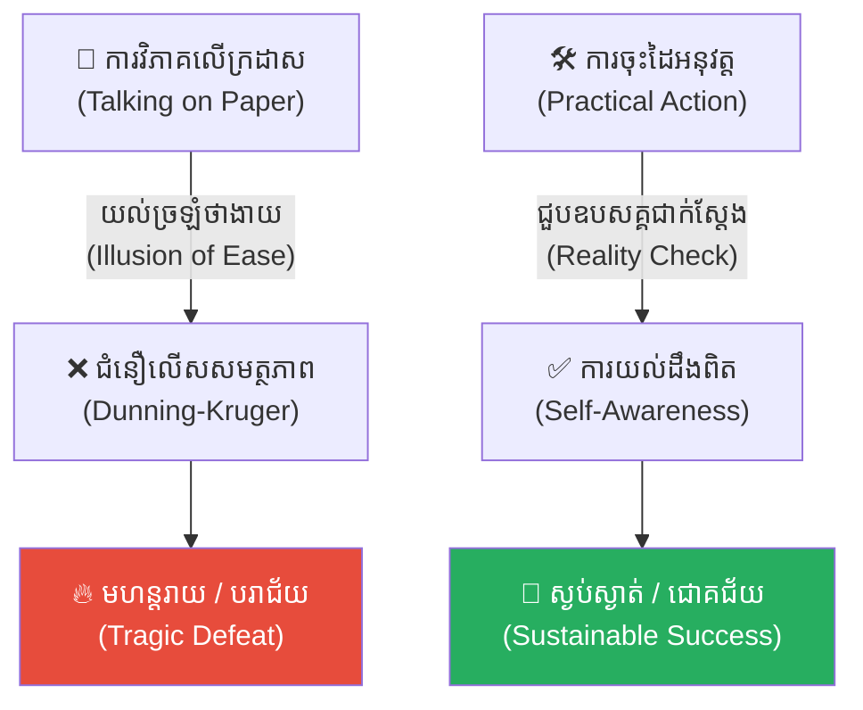
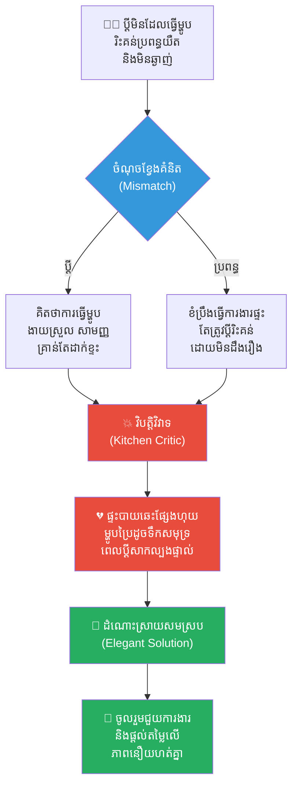
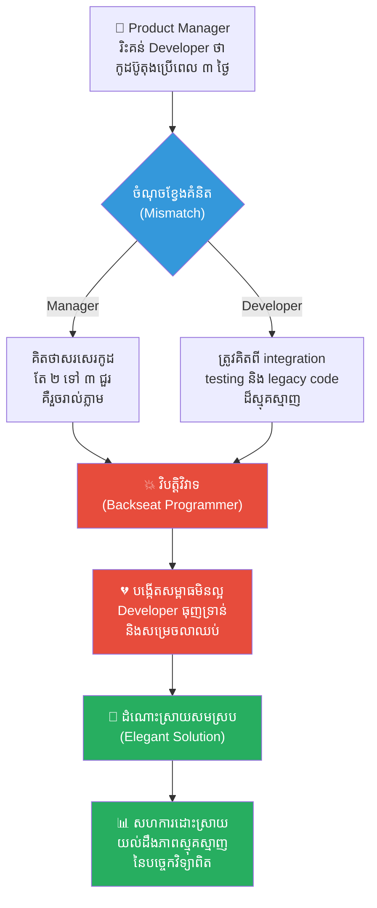
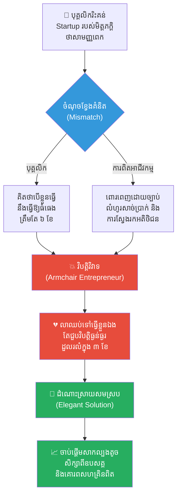
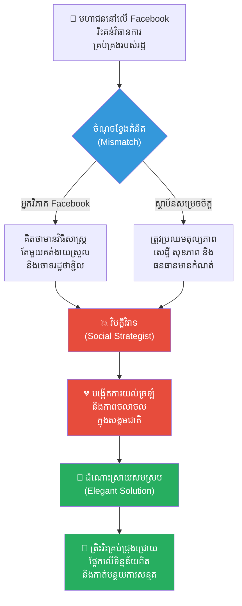
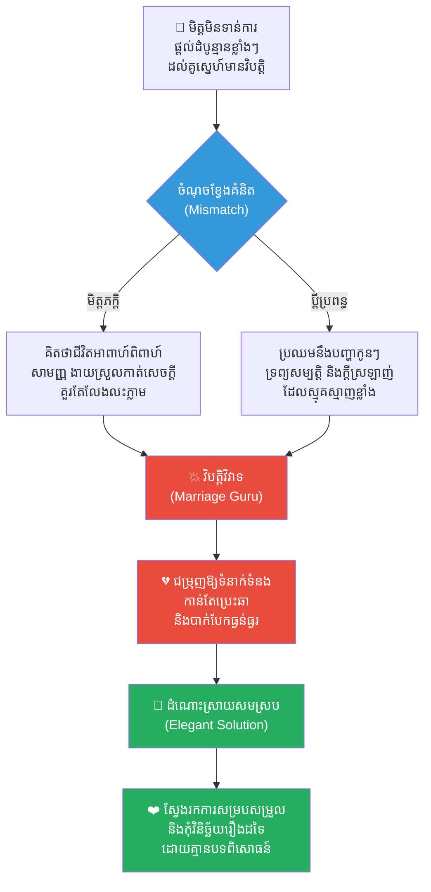
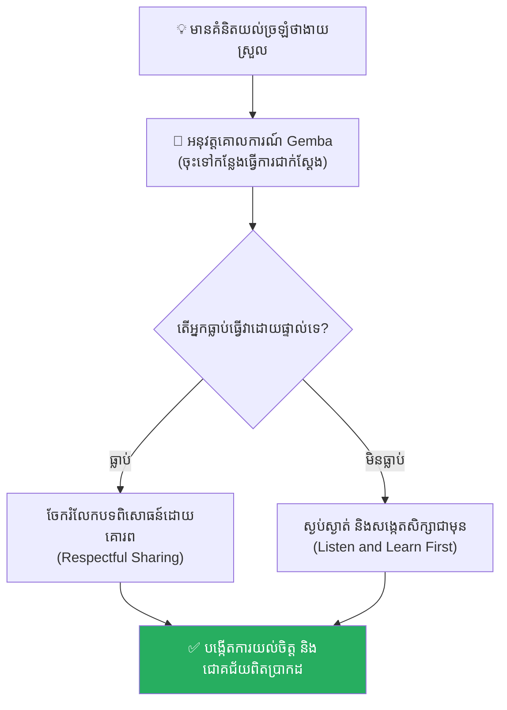

# The Illusion of Ease (អ្នកថាមិនដែលធ្វើ អ្នកធ្វើមិនដែលថា)៖ គ្រោះថ្នាក់នៃជំនឿ Dunning-Kruger និងភាពងាយស្រួលសិប្បនិម្មិត

**Author:** ichamrong  
**Date:** 2026-05-17  
**Tags:** #illusion-of-ease #dunning-kruger #taking-action #life-lessons #self-awareness #critical-thinking  
**Category:** Concepts  
**Read Time:** ~15 min  

---

## 📌 មាតិកា (Table of Contents)
- [អន្ទាក់ផ្លូវចិត្ត (The Trap)](#អន្ទាក់ផ្លូវចិត្ត-the-trap)
- [១. រឿងព្រេងប្រវត្តិសាស្ត្រចិន៖ ចាវ គួ និងសមរភូមិចានភីង (Zhao Kuo's Paper Strategy Tragedy)](#1)
  - [សោកនាដកម្មនៅសមរភូមិ ចានភីង (The Catastrophe at Changping)](#1-1)
- [២. បញ្ហា៖ ឥទ្ធិពល Dunning-Kruger និងទម្រង់នៃការយល់ច្រឡំ (The Issue: Dunning-Kruger Effect)](#2)
- [៣. ឧទាហរណ៍ជាក់ស្តែងក្នុងពិភពពិត (Real World Examples)](#3)
  - [ឧទាហរណ៍ទី ១ — កម្រិតស្រាល (គ្រួសារ)៖ ការរិះគន់ការចំអិនអាហារ ឬការងារផ្ទះ (The Kitchen Critic)](#3-1)
  - [ឧទាហរណ៍ទី ២ — កម្រិតមធ្យម (បច្ចេកទេស)៖ Code Reviewer គ្មានបទពិសោធន៍សរសេរកូដជាក់ស្តែង (The Backseat Programmer)](#3-2)
  - [ឧទាហរណ៍ទី ៣ — កម្រិតមធ្យម (ធុរកិច្ច)៖ ការមើលស្រាលលើភាពស្មុគស្មាញរបស់ Startup (The Armchair Entrepreneur)](#3-3)
  - [ឧទាហរណ៍ទី ៤ — កម្រិតមធ្យម (សង្គម/គ្រប់គ្រង)៖ មហាជនរិះគន់ការសម្រេចចិត្តរបស់រដ្ឋាភិបាល (The Social Media Strategist)](#3-4)
  - [ឧទាហរណ៍ទី ៥ — កម្រិតធ្ងន់ (ទំនាក់ទំនង)៖ ការវិនិច្ឆ័យបញ្ហាគ្រួសាររបស់អ្នកដទៃ (The Marriage Guru Illusion)](#3-5)
- [៤. ដំណោះស្រាយទូទៅ៖ ការអនុវត្ត Action Bias និងការគោរពអ្នកអនុវត្តផ្ទាល់ (The General Solution: Action over Assumptions)](#4)
- [សេចក្តីសន្និដ្ឋាន (Conclusion)](#conclusion)
- [ឯកសារយោង (References)](#references)
- [Related Posts](#related-posts)

---

## អន្ទាក់ផ្លូវចិត្ត (The Trap)

តើអ្នកធ្លាប់ជួបនរណាម្នាក់ដែលពូកែនិយាយរិះគន់ការងាររបស់អ្នកដទៃយ៉ាងច្បាស់ៗ ហាក់បីដូចជាកិច្ចការនោះងាយស្រួលបំផុត ប៉ុន្តែនៅពេលឱ្យពួកគេចុះដៃធ្វើផ្ទាល់ បែរជាមិនអាចសម្រេចបានអ្វីសោះដែរឬទេ?

នេះគឺជា **The Illusion of Ease (ការយល់ច្រឡំថាងាយស្រួល)** ឬដែលភាសាខ្មែរយើងតែងតែពោលថា **«អ្នកថាមិនដែលធ្វើ អ្នកធ្វើមិនដែលថា»**។ 

ខួរក្បាលរបស់មនុស្សមានភាពលំអៀងក្នុងការយល់ដឹងម្យ៉ាង៖ នៅពេលដែលយើងគ្រាន់តែដឹងព័ត៌មានលើក្រដាស ឬមើលពីចម្ងាយ យើងតែងតែគិតស្មានថាវាសាមញ្ញណាស់។ ប៉ុន្តែភាពងាយស្រួលនោះ គ្រាន់តែជាការបំភាន់ភ្នែកដែលបង្កើតឡើងដោយអវត្តមាននៃបទពិសោធន៍ជាក់ស្តែងប៉ុណ្ណោះ។ នៅពេលយើងធ្លាក់ចូលទៅក្នុងអន្ទាក់នេះ យើងនឹងចាប់ផ្តើមមើលស្រាលលើការងាររបស់ដទៃ បង្កើតការរំពឹងទុកខុសពីការពិត និងនាំខ្លួនឯងទៅរកបរាជ័យដ៏ធ្ងន់ធ្ងរ។

ដើម្បីយល់ដឹងឱ្យបានគ្រប់ជ្រុងជ្រោយ នេះជាផែនទីបង្ហាញផ្លូវសម្រាប់អត្ថបទនេះ៖
1. **រឿងព្រេងប្រវត្តិសាស្ត្រ (The Historic Legend)** — រឿងរ៉ាវរបស់ ចាវ គួ ដែលពូកែខាងយុទ្ធសាស្ត្រយោធាលើក្រដាស តែបានដុតបំផ្លាញជីវិតកងទ័ព ៤០០,០០០ នាក់។
2. **បញ្ហា (The Issue)** — តើ Dunning-Kruger Effect និងអន្ទាក់នៃការគិតលើសលប់ដំណើរការយ៉ាងដូចម្តេច?
3. **ឧទាហរណ៍ជាក់ស្តែងក្នុងពិភពពិត (Real World Examples)** — ពិនិត្យមើលឥទ្ធិពលនេះក្នុងកម្រិតគ្រួសារ ការងារបច្ចេកទេស ធុរកិច្ច ការគ្រប់គ្រង និងទំនាក់ទំនងស្នេហា។
4. **ដំណោះស្រាយទូទៅ (The General Solution)** — ការផ្លាស់ប្តូរទៅកាន់ផ្នត់គំនិតចុះដៃធ្វើជាក់ស្តែង និងការលុបបំបាត់ការសន្មត។

---

## ១. រឿងព្រេងប្រវត្តិសាស្ត្រចិន៖ ចាវ គួ និងសមរភូមិចានភីង (Zhao Kuo's Paper Strategy Tragedy)

នាសម័យសង្គ្រាមរវាងនគរ (Warring States Period) នៃប្រវត្តិសាស្ត្រចិន មានមេទ័ពវ័យក្មេងម្នាក់នាម **ចាវ គួ (Zhao Kuo)** ដែលជាកូនប្រុសរបស់មេទ័ពដ៏ល្បីល្បាញ ចាវ សឺ (Zhao She) នៃនគរចាវ។

តាំងពីក្មេងមក **ចាវ គួ** បានអានសៀវភៅយុទ្ធសាស្ត្រយោធារាប់ពាន់ក្បាល និងមានសមត្ថភាពជជែកពិភាក្សាអំពីកលល្បិចសង្គ្រាមយ៉ាងស្ទាត់ជំនាញ។ គ្មាននរណាម្នាក់ សូម្បីតែឪពុករបស់គាត់ អាចជជែកឈ្នះគាត់អំពីផែនការប្រយុទ្ធលើក្រដាសឡើយ។ គាត់តែងតែនិយាយដោយទំនុកចិត្តខ្ពស់ថា៖ *«ការដឹកនាំទ័ព និងកម្ទេចសត្រូវ គ្មានអ្វីពិបាកសោះ គឺងាយស្រួលដូចការក្រឡាប់ដៃតែប៉ុណ្ណោះ!»*

ទោះជាយ៉ាងណាក៏ដោយ ឪពុករបស់គាត់មិនដែលសរសើរគាត់ឡើយ ផ្ទុយទៅវិញបានព្រមានម្តាយរបស់គាត់ថា៖ *«សង្គ្រាមគឺជាបញ្ហានៃសេចក្តីស្លាប់ និងការរស់រាន តែ ចាវ គួ ចាត់ទុកវាដូចជារឿងលេងសើច និងងាយស្រួល។ ប្រសិនបើនគរចាវ ឱ្យគេដឹកនាំទ័ព គេនឹងនាំមកនូវមហន្តរាយដល់កងទ័ពទាំងមូលមិនខាន។»*

---

### សោកនាដកម្មនៅសមរភូមិ ចានភីង (The Catastrophe at Changping)

នៅឆ្នាំ ២៦០ មុនគ្រិស្តសករាជ នគរចាវ បានជួបសង្គ្រាមដ៏ធំជាមួយនគរឈីន នៅសមរភូមិ **ចានភីង (Changping)**។ ដោយសារការប្រើប្រាស់ល្បិចបំផ្លិចបំផ្លាញផ្ទៃក្នុងរបស់នគរឈីន ព្រះរាជានគរចាវបានសម្រេចចិត្តដកមេទ័ពចាស់ដែលមានបទពិសោធន៍ លាន ភូ (Lian Po) ចេញ ហើយជំនួសមកវិញដោយ **ចាវ គួ** ដែលពូកែខាងនិយាយយុទ្ធសាស្ត្រនោះ។

នៅពេលទៅដល់សមរភូមិភ្លាម **ចាវ គួ** បានផ្លាស់ប្តូរយុទ្ធសាស្ត្រការពារដ៏រឹងមាំរបស់មេទ័ពចាស់ចោលទាំងអស់។ ដោយការមើលស្រាលសត្រូវ និងជឿជាក់លើរូបមន្តយុទ្ធសាស្ត្រលើក្រដាសរបស់ខ្លួន គាត់បានបញ្ជាឱ្យកងទ័ពចាវ ៤០០,០០០ នាក់ បើកការវាយប្រហារសម្រុកត្រង់ទៅមុខយ៉ាងខ្លាំង។

ប៉ុន្តែ អ្វីៗមិនងាយស្រួលដូចនៅលើក្រដាសឡើយ។ មេទ័ពនគរឈីនគឺ បៃ ឈី (Bai Qi) ដែលជាកំពូលអ្នកយុទ្ធសាស្ត្រជាក់ស្តែង បានប្រើប្រាស់ល្បិចដកថយសិប្បនិម្មិត ដើម្បីឡោមព័ទ្ធកងទ័ពចាវ និងកាត់ផ្តាច់ផ្លូវស្បៀងអាហារទាំងស្រុង។ កងទ័ពរបស់ចាវ គួ ត្រូវជាប់ឃុំឃាំងនៅលើវាលខ្សាច់អស់រយៈពេល ៤៦ ថ្ងៃ គ្មានទឹក គ្មានអាហារ។

ក្នុងស្ថានភាពទាល់ច្រក **ចាវ គួ** បាននាំទ័ពវាយសម្រុកចេញ តែត្រូវបានព្រួញសត្រូវបាញ់ស្លាប់នៅកណ្តាលសមរភូមិ។ កងទ័ពនគរចាវ ៤០០,០០០ នាក់ដែលនៅសល់ ត្រូវបង្ខំចិត្តចុះចាញ់ និងត្រូវបានកងទ័ពឈីនកប់សម្លាប់ទាំងរស់គ្មានសល់ម្នាក់ឡើយ។ នេះគឺជាសោកនាដកម្មដ៏ធំបំផុតមួយនៅក្នុងប្រវត្តិសាស្ត្រចិន ដែលកើតឡើងពីការយល់ច្រឡំថាការអនុវត្តជាក់ស្តែង ងាយស្រួលដូចការគិតលើក្រដាស។

---

## ២. បញ្ហា៖ ឥទ្ធិពល Dunning-Kruger និងទម្រង់នៃការយល់ច្រឡំ (The Issue: Dunning-Kruger Effect)

នៅក្នុងចិត្តវិទ្យា (Psychology) បាតុភូតនេះត្រូវបានពន្យល់តាមរយៈ **Dunning-Kruger Effect**។

វាជាទំនោរចិត្តដែលមនុស្សមានសមត្ថភាពទាប ឬមិនធ្លាប់អនុវត្តការងារផ្ទាល់ តែងតែមានការយល់ឃើញថាខ្លួនឯងមានសមត្ថភាពខ្ពស់ និងវាយតម្លៃការងារនោះថាងាយស្រួលពេក (Illusion of Ease)។

* **ដំណាក់កាលមិនដឹងខ្លួន (Mount Stupid)៖** មនុស្សដែលទើបតែដឹងព័ត៌មានបន្តិចបន្តួច មានទំនុកចិត្តខ្ពស់បំផុត ព្រោះពួកគេមិនដឹងពីភាពស្មុគស្មាញដែលលាក់កំបាំងពីក្រោយ។
* **ការសន្មតលំអៀង (Assumption Bias)៖** គិតថាជំហានទី ១, ទី ២, ទី ៣ ងាយស្រួលដើរតាម តែមិនយល់ពីឧបសគ្គរវាងជំហាននីមួយៗ។

---

## ៣. ឧទាហរណ៍ជាក់ស្តែងក្នុងពិភពពិត

ដើម្បីយល់ដឹងឱ្យកាន់តែស៊ីជម្រៅ ផ្លូវការសិក្សានឹងនាំអ្នកទៅពិនិត្យមើល **ឧទាហរណ៍ចំនួន ៥ កម្រិតខុសៗគ្នា** ក្នុងជីវិតរស់នៅប្រចាំថ្ងៃ៖

---

### ឧទាហរណ៍ទី ១ — កម្រិតស្រាល (គ្រួសារ)៖ ការរិះគន់ការចំអិនអាហារ ឬការងារផ្ទះ (The Kitchen Critic)

**ស្ថានភាព៖** ប្តីម្នាក់ដែលមិនដែលធ្លាប់ចូលផ្ទះបាយធ្វើម្ហូប រិះគន់ប្រពន្ធរបស់ខ្លួនថាធ្វើម្ហូបយឺត និងមិនសូវមានរសជាតិឆ្ងាញ់។

* **ភាគី A (ប្តី)៖** គិតថា «ការធ្វើម្ហូបគ្រាន់តែជាការបោះបង់បន្លែ និងសាច់ចូលក្នុងខ្ទះ ហេតុអ្វីត្រូវចំណាយពេលរាប់ម៉ោង?»។
* **ភាគី B (ប្រពន្ធ)៖** ហុចវែកឱ្យប្តី រួចដើរចេញ។ ពេលប្តីសាកល្បងធ្វើម្តង គាត់ធ្វើឱ្យផ្ទះបាយឆេះផ្សែងហុយទ្រលោម ម្ហូបប្រៃដូចទឹកសមុទ្រ និងចំណាយពេលជាង ៣ ម៉ោង។

**ការពិតដ៏ជូរចត់៖**
ការរិះគន់ដោយមិនយល់ពីការលំបាកជាក់ស្តែង បំផ្លាញទឹកចិត្តរបស់មនុស្សដែលកំពុងខិតខំប្រឹងប្រែងដើម្បីយើង។

---

### ឧទាហរណ៍ទី ២ — កម្រិតមធ្យម (បច្ចេកទេស)៖ Code Reviewer គ្មានបទពិសោធន៍សរសេរកូដជាក់ស្តែង (The Backseat Programmer)

**ស្ថានភាព៖** Product Manager ម្នាក់ដែលគ្រាន់តែអានអត្ថបទ Tech ខ្លីៗនៅលើបណ្តាញសង្គម រិះគន់ Developer ថាហេតុអ្វីបានជាការបង្កើតប៊ូតុងមួយ ឬការកែតម្រូវ Database ត្រូវការពេលរហូតដល់ទៅ ៣ ថ្ងៃ។

* **ភាគី A (Manager)៖** គិតថា «វាងាយស្រួលណាស់ សរសេរកូដតែ ២ ទៅ ៣ ជួរគឺរួចរាល់ហើយ!»។
* **ភាគី B (Developer)៖** ត្រូវបង្ខំចិត្តពន្យល់ពី Integration, Testing, compatibility issues និង legacy code ស្មុគស្មាញ ដែល Manager មិនយល់ឡើយ។

**ការពិតដ៏ជូរចត់៖**
ការវាយតម្លៃរបស់ Manager បង្កើតជាសម្ពាធមិនសមហេតុផល នាំឱ្យ Developer ធុញទ្រាន់ និងលាឈប់ពីការងារ។

---

### ឧទាហរណ៍ទី ៣ — កម្រិតមធ្យម (ធុរកិច្ច)៖ ការមើលស្រាលលើភាពស្មុគស្មាញរបស់ Startup (The Armchair Entrepreneur)

**ស្ថានភាព៖** បុគ្គលិកការិយាល័យម្នាក់តែងតែនិយាយរិះគន់គម្រោង Startup របស់មិត្តភក្តិខ្លួនថា៖ *«គំនិតបែបនេះសាមញ្ញពេក បើជាខ្ញុំវិញ ខ្ញុំនឹងធ្វើវាឱ្យធំជាងនេះក្នុងពេល ៦ ខែ!»*។

* **ភាគី A (បុគ្គលិក)៖** ជឿជាក់លើសមត្ថភាពខ្លួន និងសម្រេចចិត្តលាឈប់ពីការងារដើម្បីបង្កើតក្រុមហ៊ុនផ្ទាល់ខ្លួន។
* **ភាគី B (ការពិតអាជីវកម្ម)៖** ជួបប្រទះបញ្ហាច្បាប់ ការគ្រប់គ្រងលំហូរសាច់ប្រាក់ (Cash flow) ការស្វែងរកអតិថិជន និងការគ្រប់គ្រងបុគ្គលិក ដែលធ្វើឱ្យគាត់ដួលរលំក្នុងរយៈពេល ៣ ខែដំបូង។

**ការពិតដ៏ជូរចត់៖**
ការជជែកអំពីជំនួញនៅក្នុងហាងកាហ្វេ ងាយស្រួលជាងការដំណើរការអាជីវកម្មជាក់ស្តែងរាប់ពាន់ដង។

---

### ឧទាហរណ៍ទី ៤ — កម្រិតមធ្យម (សង្គម/គ្រប់គ្រង)៖ មហាជនរិះគន់ការសម្រេចចិត្តរបស់រដ្ឋាភិបាល (The Social Media Strategist)

**ស្ថានភាព៖** ក្នុងអំឡុងពេលវិបត្តិសេដ្ឋកិច្ច ឬជំងឺរាតត្បាត អ្នកប្រើប្រាស់បណ្តាញសង្គមរាប់ម៉ឺននាក់សរសេរវិភាគ និងរិះគន់យ៉ាងមុតមាំលើវិធានការគ្រប់គ្រងរបស់ស្ថាប័នរដ្ឋ ដោយគិតថារឿងគ្រប់យ៉ាងងាយស្រួលដោះស្រាយ។

* **ភាគី A (អ្នកវិភាគលើ Facebook)៖** គិតថាមានតែយុទ្ធសាស្ត្រតែមួយគត់ដែលត្រឹមត្រូវ និងចោទអ្នកដឹកនាំថា «ល្ងង់ខ្លៅ»។
* **ភាគី B (ស្ថាប័នសម្រេចចិត្ត)៖** ត្រូវប្រឈមមុខនឹងតុល្យភាពសេដ្ឋកិច្ច សុខភាពសាធារណៈ ច្បាប់អន្តរជាតិ និងធនធានថវិកាមានកំណត់ ដែលគ្មានអ្នករិះគន់ណាម្នាក់យកមកគិតឡើយ។

**ការពិតដ៏ជូរចត់៖**
យុទ្ធសាស្ត្រដែលគ្មានការសាកល្បងជាក់ស្តែង គ្រាន់តែជារឿងលេងសើចរបស់ខួរក្បាលប៉ុណ្ណោះ។

---

### ឧទាហរណ៍ទី ៥ — កម្រិតធ្ងន់ (ទំនាក់ទំនង)៖ ការវិនិច្ឆ័យបញ្ហាគ្រួសាររបស់អ្នកដទៃ (The Marriage Guru Illusion)

**ស្ថានភាព៖** មិត្តភក្តិដែលមិនទាន់រៀបការ តែងតែផ្តល់ដំបូន្មានខ្លាំងៗ និងរិះគន់មិត្តម្នាក់ទៀតដែលមានជម្លោះជាមួយប្តីប្រពន្ធថា៖ *«បើជាខ្ញុំវិញ ខ្ញុំលែងលះគ្នា ឬឈ្លោះគ្នាឱ្យដឹងសខ្មៅភ្លាមៗហើយ មិនចាំបាច់ទ្រាំទេ!»*។

* **ភាគី A (មិត្តភក្តិ)៖** គិតថាជីវិតអាពាហ៍ពិពាហ៍សាមញ្ញ និងងាយស្រួលកាត់សេចក្តី។
* **ភាគី B (ប្តីប្រពន្ធ)៖** ត្រូវប្រឈមនឹងបញ្ហាកូនតូចៗ ទ្រព្យសម្បត្តិរួម ទំនាក់ទំនងសាច់ញាតិសងខាង និងក្តីស្រឡាញ់ដែលនៅសេសសល់ ដែលធ្វើឱ្យការសម្រេចចិត្តមិនអាចសាមញ្ញបានឡើយ។

**ការពិតដ៏ជូរចត់៖**
ដំបូន្មានរបស់មិត្តភក្តិដែលគ្មានបទពិសោធន៍ ជារឿយៗជម្រុញឱ្យទំនាក់ទំនងរបស់គេកាន់តែបាក់បែកធ្ងន់ធ្ងរ។

---

## ៤. ដំណោះស្រាយទូទៅ៖ ការអនុវត្ត Action Bias និងការគោរពអ្នកអនុវត្តផ្ទាល់ (The General Solution: Action over Assumptions)

ដើម្បីលុបបំបាត់អន្ទាក់ The Illusion of Ease នៅក្នុងខ្លួនអ្នក និងស្ថាប័នរបស់អ្នក ត្រូវអនុវត្តវិធីសាស្ត្រគន្លឹះទាំងនេះ៖

### ១. ឈប់និយាយ ចូរចុះដៃធ្វើ (Shut Up and Do It)
នៅពេលអ្នកគិតថាការងារណាមួយងាយស្រួល ចូរព្យាយាមចុះដៃធ្វើវាដោយខ្លួនឯងជាមុនសិន។ ឧបសគ្គដំបូងដែលអ្នកនឹងជួប នឹងដាស់ស្មារតីរបស់អ្នកឱ្យដឹងពីការពិតភ្លាមៗ។

### ២. គោរពបទពិសោធន៍របស់អ្នកអនុវត្តផ្ទាល់ (Respect the Practitioners)
មុននឹងរិះគន់ការងាររបស់នរណាម្នាក់ ចូរសាកសួរពួកគេពី «ហេតុអ្វីបានជាវាត្រូវបានធ្វើឡើងតាមរបៀបនេះ?»។ ពួកគេប្រហែលជាបានឆ្លងកាត់ការសាកល្បង និងបរាជ័យរាប់សិបដងរួចទៅហើយ ទើបសម្រេចយកវិធីសាស្ត្របច្ចុប្បន្ន។

### ៣. អនុវត្តវិធីសាស្ត្រ "Gemba" (ចុះទៅមើលការពិត)
យោងតាមទស្សនវិជ្ជាគ្រប់គ្រងរបស់ជប៉ុន (Kaizen) «Gemba» មានន័យថាជាកន្លែងដែលការងារពិតប្រាកដត្រូវបានកើតឡើង។ ប្រសិនបើអ្នកជាអ្នកដឹកនាំ ចូរចុះទៅឈរមើល និងធ្វើការងាររួមជាមួយបុគ្គលិកថ្នាក់ក្រោម ដើម្បីយល់ដឹងពីការលំបាកជាក់ស្តែងរបស់ពួកគេ។

---

## សេចក្តីសន្និដ្ឋាន (Conclusion)

> **«អ្នកដឹកនាំដ៏អស្ចារ្យ មិនមែនជាអ្នកដែលពូកែសរសេរយុទ្ធសាស្ត្រយោធាដ៏ល្អឥតខ្ចោះនៅលើក្រដាសនោះឡើយ។ ប៉ុន្តែវាគឺជាបុគ្គលដែលយល់ដឹងពីភាពនឿយហត់របស់ទាហាន និងឧបសគ្គជាក់ស្តែងនៅលើវាលខ្សាច់ ហើយគោរពអ្នកដែលកំពុងកាន់ដាវប្រយុទ្ធពិតប្រាកដ។»**

ចាវ គួ បានបង់អាយុជីវិតកងទ័ព ៤០០,០០០ នាក់ព្រោះតែការមើលស្រាលលើសង្គ្រាម។ ចូរកុំទុកឱ្យការងារ អាជីវកម្ម ឬទំនាក់ទំនងរបស់អ្នកត្រូវរលាយរលត់ដោយសារតែភាពល្ងង់ខ្លៅ Dunning-Kruger របស់អ្នកឡើយ។

ចូរឈប់និយាយ ហើយចាប់ផ្តើមចុះដៃធ្វើ។

---

## ឯកសារយោង (References)

* **Sima Qian** — *Records of the Grand Historian (Shiji)*. កំណត់ត្រាប្រវត្តិសាស្ត្រអំពីសមរភូមិចានភីង និង ចាវ គួ។
* **Kruger, J., & Dunning, D.** — *Unskilled and Unaware of It* (1999). ការសិក្សាវិទ្យាសាស្ត្រដំបូងគេបង្អស់អំពីឥទ្ធិពល Dunning-Kruger។
* **Ohno, T.** — *Toyota Production System*. ការរៀបរាប់អំពីគោលការណ៍ Gemba និងការគ្រប់គ្រងជាក់ស្តែង។

---

## Related Posts

* **[Relative Deprivation Effect (ឥទ្ធិពលនៃការដកហូតដោយការប្រៀបធៀប)៖ គ្រោះថ្នាក់នៃដង្ហើមច្រណែន និងការបំផ្លាញខ្លួនឯងព្រោះតែស៊ុបសាច់ចៀមមួយចាន](./02-relative-deprivation-effect.md)** — Disrespecting small practical roles.
* **[The Perfect Banana Illusion (សត្វស្វា និងផ្លែចេកសប្បនិម្មិត)៖ គ្រោះថ្នាក់នៃការដេញតាមភាពល្អឥតខ្ចោះសិប្បនិម្មិត និងការបំផ្លាញក្តីសុខបច្ចុប្បន្ន](./04-the-perfect-banana-illusion.md)** — Idealizing abstract layouts.
* **[Learned Helplessness (ការរៀនសូត្រពីភាពអស់សង្ឃឹម)៖ របៀបបំបែកទ្រុងផ្លូវចិត្តដែលបង្ខាំងអ្នកឱ្យឈប់បញ្ចេញសកម្មភាព](./10-learned-helplessness.md)** — Cognitive limits and actionable transitions.
