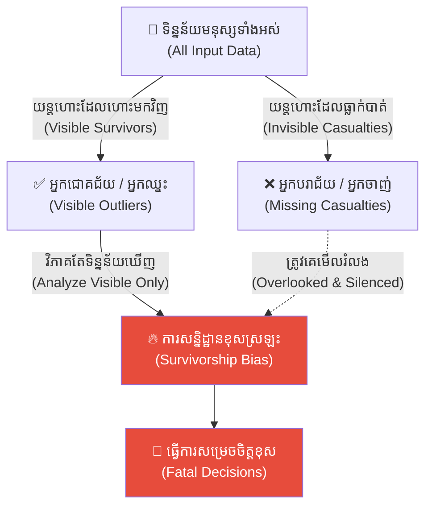
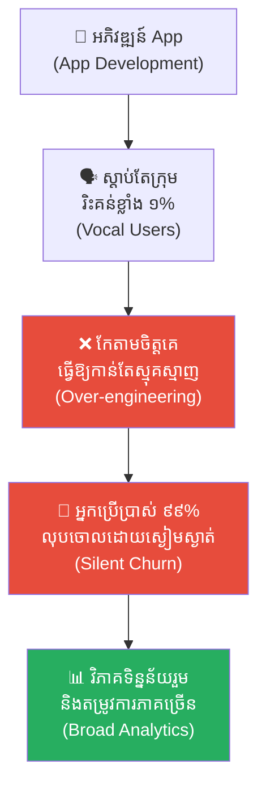
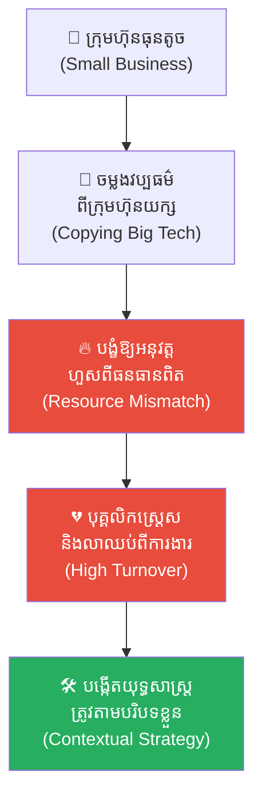
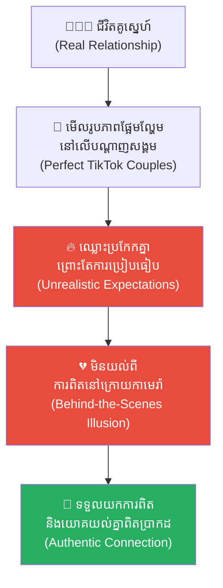
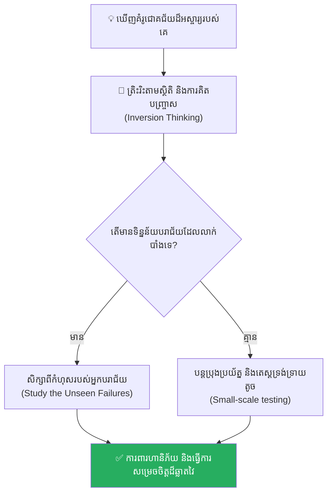

# Survivorship Bias (លំអៀងនៃការរស់រាន)៖ គ្រោះថ្នាក់នៃជំនឿលើសត្វលោកដែលឈ្នះ និងសោកនាដកម្មនៃកងទ័ពដែលបាត់ខ្លួន

**Author:** ichamrong  
**Date:** 2026-05-17  
**Tags:** #survivorship-bias #mental-models #psychology #critical-thinking #life-lessons  
**Category:** Concepts  
**Read Time:** ~15 min  

---

## 📌 មាតិកា (Table of Contents)
- [អន្ទាក់ផ្លូវចិត្ត (The Trap)](#អន្ទាក់ផ្លូវចិត្ត-the-trap)
- [១. ចំណោទបញ្ហាយន្តហោះទម្លាក់គ្រាប់បែកក្នុងសង្គ្រាមលោកលើកទី២ (The WW2 Bomber Problem)](#1)
  - [ដំណោះស្រាយដ៏វៃឆ្លាតរបស់ អ័ប្រាហាម វ៉លដ៍ (Abraham Wald's Brilliant Insight)](#1-1)
- [២. បញ្ហា៖ ការបំភាន់នៃករណីលើកលែង (The Issue: The Winner's Fallacy)](#2)
- [៣. ឧទាហរណ៍ជាក់ស្តែងក្នុងពិភពពិត (Real World Examples)](#3)
  - [ឧទាហរណ៍ទី ១ — កម្រិតស្រាល (គ្រួសារ)៖ ពាក្យចចាមអារ៉ាមសុខភាពរបស់ចាស់ទុំ (The Grandfather Smoking Myth)](#3-1)
  - [ឧទាហរណ៍ទី ២ — កម្រិតមធ្យម (បច្ចេកទេស)៖ ការកែលម្អ App ផ្អែកលើការរិះគន់របស់ User (The Vocal User Feedback)](#3-2)
  - [ឧទាហរណ៍ទី ៣ — កម្រិតមធ្យម (ធុរកិច្ច)៖ ការចម្លងតាមគំរូអ្នកបោះបង់ការសិក្សាជោគជ័យ (The College Dropout Illusion)](#3-3)
  - [ឧទាហរណ៍ទី ៤ — កម្រិតមធ្យម (សង្គម/គ្រប់គ្រង)៖ ការសរសើរវិធីសាស្រ្តការងាររបស់ក្រុមហ៊ុនយក្ស (The Big Tech Copycats)](#3-4)
  - [ឧទាហរណ៍ទី ៥ — កម្រិតធ្ងន់ (ទំនាក់ទំនង)៖ ការសម្លឹងមើលទំនាក់ទំនងគូស្នេហ៍នៅលើ Tik Tok (The Online Couple Standard)](#3-5)
- [៤. ដំណោះស្រាយទូទៅ៖ ការស្វែងរកទិន្នន័យដែលបាត់បង់ (The General Solution: Recovering the Unseen)](#4)
- [សេចក្តីសន្និដ្ឋាន (Conclusion)](#conclusion)
- [ឯកសារយោង (References)](#references)
- [Related Posts](#related-posts)

---

## អន្ទាក់ផ្លូវចិត្ត (The Trap)

តើអ្នកធ្លាប់ជឿជាក់លើរូបមន្តជោគជ័យរបស់សេដ្ឋីម្នាក់ ឬក្រុមហ៊ុនយក្សមួយ ដោយគិតថាឱ្យតែធ្វើតាមពួកគេ អ្នកប្រាកដជាទទួលបានលទ្ធផលដូចគ្នាដែរឬទេ?

នេះគឺជា **Survivorship Bias (លំអៀងនៃការរស់រាន)**។ 

នៅក្នុងសង្គមបច្ចុប្បន្ន យើងតែងតែទទួលបានព័ត៌មាន និងការអបអរសាទរចំពោះតែ «អ្នកឈ្នះ» ឬ «អ្នកដែលនៅសេសសល់» (Survivors) ប៉ុណ្ណោះ។ សម្លេងរបស់អ្នកឈ្នះលាន់ឮកងរំពងលើបណ្តាញសង្គម និងប្រព័ន្ធផ្សព្វផ្សាយ ខណៈដែលដង្ហើមចុងក្រោយ និងក្តីស្រមៃដែលខូចខាតរបស់មនុស្សរាប់ម៉ឺននាក់ដែលបរាជ័យ ត្រូវបានកប់បាត់ទៅក្នុងភាពស្ងប់ស្ងាត់ទាំងស្រុង។ ការវិភាគតែទិន្នន័យដែលយើងមើលឃើញ ជារឿយៗនាំយើងទៅរកការសន្និដ្ឋានខុសស្រឡះ និងការសម្រេចចិត្តដ៏គ្រោះថ្នាក់។

ដើម្បីយល់ដឹងឱ្យបានគ្រប់ជ្រុងជ្រោយ នេះជាផែនទីបង្ហាញផ្លូវសម្រាប់អត្ថបទនេះ៖
1. **រឿងព្រេងប្រវត្តិសាស្ត្រ (The Historic Legend)** — រឿងរ៉ាវយន្តហោះចម្បាំងដែលត្រូវគ្រាប់កាំភ្លើងក្នុងសង្គ្រាមលោកលើកទី២ និងការវិភាគដ៏វៃឆ្លាតរបស់លោក Abraham Wald។
2. **បញ្ហា (The Issue)** — តើ Survivorship Bias បង្កការយល់ច្រឡំ និងការបំភាន់នៃករណីលើកលែងយ៉ាងដូចម្តេច?
3. **ឧទាហរណ៍ជាក់ស្តែងក្នុងពិភពពិត (Real World Examples)** — ពិនិត្យមើលឥទ្ធិពលនេះក្នុងកម្រិតគ្រួសារ ការងារបច្ចេកទេស ធុរកិច្ច ការគ្រប់គ្រង និងទំនាក់ទំនងស្នេហា។
4. **ដំណោះស្រាយទូទៅ (The General Solution)** — ការស្វែងរកទិន្នន័យដែលបាត់បង់ និងការគិតបញ្ច្រាស (Inversion Thinking)។

---

## ១. ចំណោទបញ្ហាយន្តហោះទម្លាក់គ្រាប់បែកក្នុងសង្គ្រាមលោកលើកទី២ (The WW2 Bomber Problem)

នាគ្រាសង្គ្រាមលោកលើកទី២ (World War II) កងទ័ពអាកាសសហរដ្ឋអាមេរិកបានជួបប្រឈមនឹងបញ្ហាដ៏ធំមួយ៖ យន្តហោះចម្បាំងជាច្រើនត្រូវបានសត្រូវបាញ់ធ្លាក់នៅក្នុងសមរភូមិ។ ដើម្បីការពារជីវិតអ្នកបើកបរ និងយន្តហោះ ពួកគេចង់បំពាក់បន្ទះដែកក្រាស់ៗដើម្បីការពារយន្តហោះពីគ្រាប់កាំភ្លើងសត្រូវ។

ទោះជាយ៉ាងណាក៏ដោយ ពួកគេមិនអាចបំពាក់ដែកការពារពេញមួយតួខ្លួនយន្តហោះបានឡើយ ព្រោះវានឹងធ្វើឱ្យយន្តហោះធ្ងន់ពេក និងមិនអាចហោះហើរបាន។ ដូច្នេះ ពួកគេត្រូវការជ្រើសរើសទីតាំងជាក់លាក់ណាដែលរងការបាញ់ប្រហារខ្លាំងជាងគេ។

នៅពេលដែលយន្តហោះចម្បាំងដែលបានឆ្លងកាត់ការប្រយុទ្ធហោះត្រឡប់មកដល់ដីវិញ ក្រុមសេនាធិការបានយកវាទៅត្រួតពិនិត្យ និងចងក្រងទិន្នន័យ។ ពួកគេបានរកឃើញថា **ស្លាបយន្តហោះ តួខ្លួន និងកន្ទុយយន្តហោះ** គឺជាកន្លែងដែលមានស្នាមត្រូវគ្រាប់កាំភ្លើងច្រើនជាងគេបំផុត។ ផ្ទុយទៅវិញ **បរិវេណជុំវិញម៉ាស៊ីន និងកាប៊ីនអ្នកបើកបរ** មិនសូវមានស្នាមគ្រាប់កាំភ្លើងឡើយ។

ផ្អែកលើទិន្នន័យជាក់ស្តែងនេះ មន្ត្រីយោធាជាន់ខ្ពស់ទាំងអស់បានយល់ស្របគ្នាថា៖ *«យើងត្រូវតែយកបន្ទះដែកទៅពាសការពារត្រង់ស្លាប និងតួខ្លួនយន្តហោះឱ្យបានក្រាស់ជាងមុន ព្រោះវាជាកន្លែងដែលរងការវាយប្រហារខ្លាំងបំផុត!»*

---

### ដំណោះស្រាយដ៏វៃឆ្លាតរបស់ អ័ប្រាហាម វ៉លដ៍ (Abraham Wald's Brilliant Insight)

ប៉ុន្តែនាពេលនោះ មានអ្នកគណិតវិទ្យា និងអ្នកវិភាគទិន្នន័យដ៏ឆ្នើមម្នាក់នាម **អ័ប្រាហាម វ៉លដ៍ (Abraham Wald)** នៃក្រុមស្រាវជ្រាវស្ថិតិសាកលវិទ្យាល័យ Columbia បានបញ្ចេញមតិជំទាស់យ៉ាងដាច់អហង្ការ។ គាត់បានពោលពាក្យដាស់តឿនថា៖

> **«អ្នកទាំងអស់គ្នាកំពុងតែមានការសន្និដ្ឋានខុសស្រឡះហើយ! ចំណុចដែលត្រូវធ្វើការពង្រឹង និងបំពាក់ដែកការពារពិតប្រាកដ គឺជាទីតាំងដែល «មិនមានស្នាមត្រូវគ្រាប់» ទៅវិញទេ ពោលគឺបរិវេណម៉ាស៊ីន និងកាប៊ីនអ្នកបើកបរ!»**

ហេតុអ្វីបានជាលោក វ៉លដ៍ គិតបែបនេះ? 

គាត់បានពន្យល់ថា៖ យន្តហោះដែលយើងកំពុងត្រួតពិនិត្យ គឺជាយន្តហោះដែល **«នៅរស់រានមានជីវិត»** ត្រឡប់មកដល់ដីវិញបាន។ ការដែលពួកវាត្រូវគ្រាប់ចំស្លាប និងតួខ្លួនហើយនៅតែអាចហោះត្រឡប់មកវិញបាន បង្ហាញថាស្លាបនិងតួខ្លួនមិនមែនជាចំណុចគ្រោះថ្នាក់ដល់ជីវិតរបស់យន្តហោះឡើយ។ 

ផ្ទុយទៅវិញ មូលហេតុដែលយើងមិនឃើញមានយន្តហោះណាដែលមានស្នាមត្រូវគ្រាប់ត្រង់ម៉ាស៊ីន ឬកាប៊ីនត្រឡប់មកវិញឡើយ គឺដោយសារតែ **យន្តហោះណាដែលត្រូវគ្រាប់ចំម៉ាស៊ីន ឬកាប៊ីនអ្នកបើកបរ បានផ្ទុះ និងធ្លាក់ខ្ទេចខ្ទីនៅក្នុងទឹកដីសត្រូវបាត់អស់ទៅហើយ** មិនអាចត្រឡប់មកវិញឱ្យយើងឃើញស្នាមគ្រាប់ទាំងនោះបានឡើយ។

ការយល់ដឹងដ៏មហាសាលរបស់លោក Abraham Wald បានសង្គ្រោះជីវិតអ្នកបើកបរយន្តហោះរាប់ពាន់នាក់ និងបានក្លាយជាមូលដ្ឋានគ្រឹះនៃទ្រឹស្តី **Survivorship Bias** រហូតមកដល់បច្ចុប្បន្ន។

---

## ២. បញ្ហា៖ ការបំភាន់នៃករណីលើកលែង (The Issue: The Winner's Fallacy)

នៅក្នុងវិស័យចិត្តវិទ្យា និងការវិភាគទិន្នន័យ **Survivorship Bias** កើតឡើងនៅពេល៖
* **ការវិភាគទិន្នន័យលំអៀង៖** យើងយកតែសំណាកដែលទទួលបានភាពជោគជ័យ ឬនៅសេសសល់មកសិក្សា ដោយមើលរំលងសំណាកភាគច្រើនដែលបានបរាជ័យបាត់បង់ទៅហើយ។
* **ជំងឺគិតថាខ្លួនឯងជាអ្នកឈ្នះ (Winner's Fallacy)៖** ជឿជាក់ថាយុទ្ធសាស្ត្ររបស់បុគ្គលជោគជ័យ គឺជាយុទ្ធសាស្ត្រតែមួយគត់ដែលត្រឹមត្រូវ ដោយមិនយល់ថាពួកគេអាចជោគជ័យដោយសារតែកត្តាសំណាង ឬកាលៈទេសៈជាច្រើនទៀត។
* **ការមើលមិនឃើញទិន្នន័យស្ងប់ស្ងាត់ (Silent Data)៖** អ្នកដែលបរាជ័យមិនដែលប្រកាសប្រាប់ពិភពលោកឡើយ ធ្វើឱ្យយើងគិតថាអត្រាជោគជ័យមានកម្រិតខ្ពស់។

---

## ៣. ឧទាហរណ៍ជាក់ស្តែងក្នុងពិភពពិត

ដើម្បីយល់ដឹងឱ្យកាន់តែស៊ីជម្រៅ ផ្លូវការសិក្សានឹងនាំអ្នកទៅពិនិត្យមើល **ឧទាហរណ៍ចំនួន ៥ កម្រិតខុសៗគ្នា** ក្នុងជីវិតរស់នៅប្រចាំថ្ងៃ៖

---

### ឧទាហរណ៍ទី ១ — កម្រិតស្រាល (គ្រួសារ)៖ ពាក្យចចាមអារ៉ាមសុខភាពរបស់ចាស់ទុំ (The Grandfather Smoking Myth)

**ស្ថានភាព៖** ជីតាម្នាក់ជក់បារី និងផឹកស្រាជាប្រចាំតាំងពីអាយុ ២០ ឆ្នាំ រហូតដល់អាយុ ៨៥ ឆ្នាំ ដោយគ្មានបញ្ហាសុខភាពធ្ងន់ធ្ងរឡើយ។ ក្រុមគ្រួសារលើកឡើងថា៖ *«ការជក់បារីមិនបង្កគ្រោះថ្នាក់ទេ មើលតែលោកតាទៅ ដឹងហើយ!»*។

* **ភាគី A (ក្រុមគ្រួសារ)៖** យកករណីជោគជ័យដ៏កម្ររបស់លោកតា (The Survivor) មកធ្វើជាគំរូទូទៅ។
* **ភាគី B (ការពិតវេជ្ជសាស្ត្រ)៖** មនុស្សរាប់លាននាក់ផ្សេងទៀតដែលបានជក់បារី បានស្លាប់ដោយសារជំងឺមហារីកសួតតាំងពីអាយុ ៤០ ឬ ៥០ ឆ្នាំរួចទៅហើយ។ ពួកគេមិនបាននៅរស់ដើម្បីមកប្រកែកតវ៉ានឹងសម្តីលោកឡើយ។

**ការពិតដ៏ជូរចត់៖**
ការជឿជាក់លើរឿងរ៉ាវករណីលើកលែង អាចនាំមកនូវគ្រោះថ្នាក់ដល់សុខភាព និងអាយុជីវិតរបស់កូនចៅជំនាន់ក្រោយ។

---

### ឧទាហរណ៍ទី ២ — កម្រិតមធ្យម (បច្ចេកទេស)៖ ការកែលម្អ App ផ្អែកលើការរិះគន់របស់ User (The Vocal User Feedback)

**ស្ថានភាព៖** ក្រុមហ៊ុនអភិវឌ្ឍ App មួយទទួលបានមតិរិះគន់យ៉ាងខ្លាំងពីអ្នកប្រើប្រាស់ ១% ដែលចង់បាន Feature X ស្មុគស្មាញ។ ក្រុមហ៊ុនបានចំណាយពេលកែសម្រួល App តាមពួកគេ។

* **ភាគី A (ក្រុមហ៊ុន)៖** គិតថាកំពុងតែស្តាប់មតិអតិថិជនពិតប្រាកដ (Vocal Users)។
* **ភាគី B (អ្នកប្រើប្រាស់ ៩៩% ដែលស្ងៀមស្ងាត់)៖** យល់ថា App ចាប់ផ្តើមពិបាកប្រើពេក ពួកគេលែងប្រើប្រាស់ និងលុប App ចោលភ្លាមៗដោយស្ងប់ស្ងាត់ (Silent Churn)。

**ការពិតដ៏ជូរចត់៖**
ការផ្តោតតែលើមតិរបស់មនុស្សដែលមានសម្លេងខ្លាំង អាចធ្វើឱ្យយើងមើលរំលងតម្រូវការរបស់អតិថិជនភាគច្រើនដែលស្ងៀមស្ងាត់។

---

### ឧទាហរណ៍ទី ៣ — កម្រិតមធ្យម (ធុរកិច្ច)៖ ការចម្លងតាមគំរូអ្នកបោះបង់ការសិក្សាជោគជ័យ (The College Dropout Illusion)

**ស្ថានភាព៖** យុវជនម្នាក់ចង់បោះបង់ការសិក្សានៅសាកលវិទ្យាល័យ ដើម្បីទៅបង្កើត Startup ដោយលើកឡើងថា៖ *«Steve Jobs និង Mark Zuckerberg ក៏មិនបានរៀនចប់ដែរ តែនៅតែអាចក្លាយជាមហាសេដ្ឋីបាន!»*។

* **ភាគី A (យុវជន)៖** មើលឃើញតែមហាសេដ្ឋីល្បីៗពីរបីនាក់ដែលបានបោះបង់ការសិក្សា។
* **ភាគី B (ស្ថិតិរួម)៖** អ្នកបោះបង់ការសិក្សា ៩៩.៩% ផ្សេងទៀត បានជួបប្រទះវិបត្តិហិរញ្ញវត្ថុ ការងារគ្មានស្ថិរភាព និងភាពក្រីក្រពេញមួយជីវិត ដែលគ្មានសារព័ត៌មានណាចុះផ្សាយឡើយ។

**ការពិតដ៏ជូរចត់៖**
ភាពជោគជ័យរបស់បុគ្គលល្បីៗមិនមែនកើតឡើងដោយសារការបោះបង់ការសិក្សានោះទេ តែដោយសារតែសមត្ថភាពដ៏វិសេសវិសាល និងកាលៈទេសៈគាំទ្រដ៏កម្ររបស់ពួកគេ។

---

### ឧទាហរណ៍ទី ៤ — កម្រិតមធ្យម (សង្គម/គ្រប់គ្រង)៖ ការសរសើរវិធីសាស្រ្តការងាររបស់ក្រុមហ៊ុនយក្ស (The Big Tech Copycats)

**ស្ថានភាព៖** Manager ម្នាក់ចម្លងតាមវិធីសាស្ត្រគ្រប់គ្រង និងវប្បធម៌ការងារដេកផ្ទាល់ដីរបស់ក្រុមហ៊ុន Netflix ឬ Google មកបង្ខំឱ្យបុគ្គលិករបស់ក្រុមហ៊ុនតូចរបស់ខ្លួនអនុវត្តតាម ដោយសង្ឃឹមថានឹងទទួលបានការរីកចម្រើនដូចក្រុមហ៊ុនយក្សទាំងនោះ។

* **ភាគី A (Manager)៖** គិតថាឱ្យតែចម្លងតាមក្រុមហ៊ុនជោគជ័យ ប្រាកដជាទទួលបានជោគជ័យ។
* **ភាគី B (បុគ្គលិក និងធនធានក្រុមហ៊ុន)៖** ក្រុមហ៊ុនខ្វះខាតថវិកា និងធនធានគាំទ្រ ដែលធ្វើឱ្យបុគ្គលិកកើតស្រ្តេសខ្លាំង និងលាឈប់ពីការងារ។

**ការពិតដ៏ជូរចត់៖**
ក្រុមហ៊ុនដែលធ្លាក់ដួលរលំរាប់ពាន់ផ្សេងទៀត ដែលធ្លាប់ប្រើវិធីសាស្ត្រស្រដៀងគ្នានេះ ត្រូវបានគេបំភ្លេចចោលទាំងស្រុង។

---

### ឧទាហរណ៍ទី ៥ — កម្រិតធ្ងន់ (ទំនាក់ទំនង)៖ ការសម្លឹងមើលទំនាក់ទំនងគូស្នេហ៍នៅលើ Tik Tok (The Online Couple Standard)

**ស្ថានភាព៖** គូស្នេហ៍មួយគូឈ្លោះប្រកែកគ្នា ព្រោះតែប្រៀបធៀបស្នេហារបស់ខ្លួនទៅនឹងគូស្នេហ៍ល្បីៗនៅលើ Tik Tok ដែលបង្ហាញតែភាពផ្អែមល្ហែម និងការដើរកម្សាន្តប្រណីតរាល់ថ្ងៃ។

* **ភាគី A (ដៃគូ)៖** គិតថាស្នេហាពិតប្រាកដត្រូវតែគ្មានជម្លោះ និងល្អឥតខ្ចោះដូចរូបភាពនៅលើអ៊ីនធឺណិត។
* **ភាគី B (ការពិតជាក់ស្តែង)៖** គូស្នេហ៍ Tik Tok ទាំងនោះរស់នៅដោយការសម្តែង និងជួនកាលបានចែកផ្លូវគ្នាយ៉ាងលឿននៅពីក្រោយការកាមេរ៉ា។

**ការពិតដ៏ជូរចត់៖**
ការរំពឹងទុកខុសពីការពិត ផ្អែកលើការបង្ហាញតែផ្នែកល្អឥតខ្ចោះ អាចបំផ្លាញទំនាក់ទំនងដែលមានស្ថិរភាពរបស់អ្នក។

---

## ៤. ដំណោះស្រាយទូទៅ៖ ការស្វែងរកទិន្នន័យដែលបាត់បង់ (The General Solution: Recovering the Unseen)

ដើម្បីបញ្ចៀសខ្លួនពីអន្ទាក់នៃការគិត Survivorship Bias ចូរអនុវត្តវិធីសាស្ត្រខាងក្រោម៖

### ១. ស្វែងរក «យន្តហោះដែលមិនបានត្រឡប់មកវិញ» (Look for Failures)
មុននឹងសម្រេចចិត្តលើផ្លូវណាមួយ ឈប់សួររកតែអ្នកជោគជ័យ។ ចូរព្យាយាមស្វែងរក និងរៀនសូត្រពី **«អ្នកដែលបានបរាជ័យ»**៖
* *តើមានមនុស្សប៉ុន្មាននាក់ដែលបានសាកល្បងវិធីសាស្ត្រនេះហើយបរាជ័យ?*
* *តើអ្វីជាកំហុសចម្បងដែលធ្វើឱ្យពួកគេដួលរលំ?*

### ២. អនុវត្តវិធានគិតបញ្ច្រាស (Inversion Thinking)
ជំនួសឱ្យការសួរថា *«តើត្រូវធ្វើយ៉ាងណាដើម្បីជោគជ័យ?»* ចូរសួរខ្លួនឯងថា *«តើត្រូវធ្វើយ៉ាងណាទើបមិនឱ្យបរាជ័យ និងជួបមហន្តរាយ?»*។ ការការពារចំណុចខ្សោយ (ម៉ាស៊ីន និងកាប៊ីន) មានតម្លៃជាងការដេញតាមចំណុចខ្លាំងដែលគេបង្អួតចំពោះមុខ។

### ៣. ពឹងផ្អែកលើស្ថិតិរួម មិនមែនពឹងលើពាក្យចចាមអារ៉ាម (Data over Anecdotes)
កុំសម្រេចចិត្តដោយផ្អែកលើគំរូតែមួយ ឬពីរបីករណីល្បីៗ។ ចូរស្វែងរកទិន្នន័យស្ថិតិរួម ដែលមានសំណាកទូលំទូលាយ និងតំណាងឱ្យការពិតជាក់ស្តែងរបស់សង្គម។

---

## សេចក្តីសន្និដ្ឋាន (Conclusion)

> **«ភាពឆ្លាតវៃពិតប្រាកដ មិនមែនស្ថិតនៅលើសមត្ថភាពចម្លងតាមអ្នកឈ្នះដែលកំពុងឈរនៅលើឆាកនោះឡើយ។ ប៉ុន្តែវាស្ថិតនៅលើសមត្ថភាពវិភាគ និងមើលឃើញគំនរសាកសពនៃក្តីស្រមៃដែលបានដួលរលំនៅតាមផ្លូវ ដើម្បីរៀបចំខែលការពារខ្លួនកុំឱ្យដើរជាន់ដានជើងចាស់របស់ពួកគេ។»**

លោក Abraham Wald បានសង្គ្រោះយន្តហោះចម្បាំងរាប់ពាន់គ្រឿង មិនមែនដោយសារគាត់មើលស្នាមគ្រាប់ដែលឃើញនោះទេ គឺដោយសារគាត់គិតដល់យន្តហោះដែលបាត់ខ្លួននៅក្នុងបាតសមុទ្រ។

ចូរកុំបណ្តោយឱ្យពន្លឺចែងចាំងនៃភាពជោគជ័យរបស់អ្នកដទៃ ធ្វើឱ្យអ្នកមើលមិនឃើញជ្រោះជ្រៅនៃបរាជ័យដែលនៅចំពោះមុខឡើយ។

---

## ឯកសារយោង (References)

* **Wald, A.** — *A Method of Estimating Plane Vulnerability Based on Damage of Survivors* (1943). សារព័ត៌មានស្រាវជ្រាវផ្លូវការសម្រាប់ការការពារជាតិអាមេរិក។
* **Kahneman, D.** — *Thinking, Fast and Slow* (2011). ការវិភាគស៊ីជម្រៅលើការយល់ដឹងលំអៀងរបស់ខួរក្បាលមនុស្ស។
* **Taleb, N. N.** — *Fooled by Randomness* (2001). តួនាទីនៃភាពចៃដន្យ និងការបំភាន់នៃលំអៀងនៃការរស់រានក្នុងទីផ្សារហិរញ្ញវត្ថុ។

---

## Related Posts

* **[Relative Deprivation Effect (ឥទ្ធិពលនៃការដកហូតដោយការប្រៀបធៀប)៖ គ្រោះថ្នាក់នៃដង្ហើមច្រណែន និងការបំផ្លាញខ្លួនឯងព្រោះតែស៊ុបសាច់ចៀមមួយចាន](./02-relative-deprivation-effect.md)** — Looking only at general rewards while overlooking silent components.
* **[The Illusion of Ease (អ្នកថាមិនដែលធ្វើ អ្នកធ្វើមិនដែលថា)៖ គ្រោះថ្នាក់នៃជំនឿ Dunning-Kruger និងភាពងាយស្រួលសិប្បនិម្មិត](./06-the-illusion-of-ease.md)** — Paper strategists versus actual practitioners.
* **[Learned Helplessness (ការរៀនសូត្រពីភាពអស់សង្ឃឹម)៖ របៀបបំបែកទ្រុងផ្លូវចិត្តដែលបង្ខាំងអ្នកឱ្យឈប់បញ្ចេញសកម្មភាព](./10-learned-helplessness.md)** — Overcoming invisible cognitive blocks.
