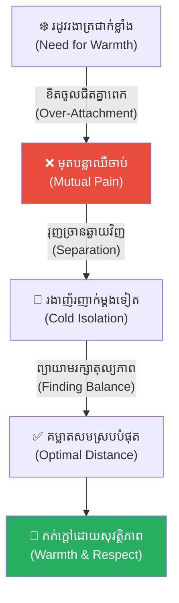
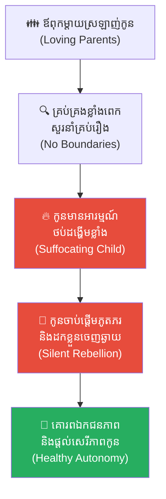
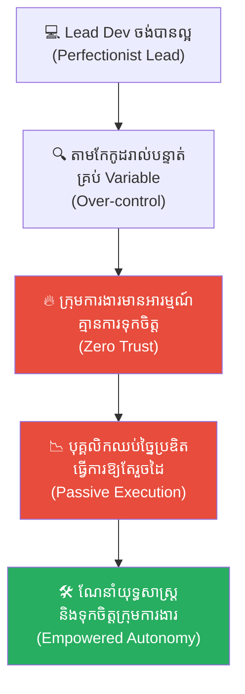
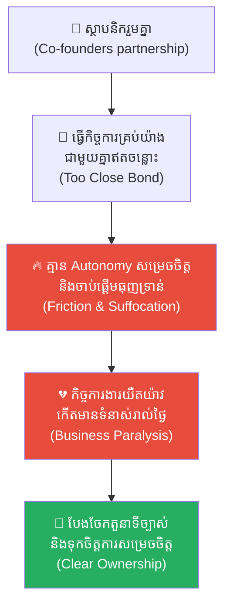
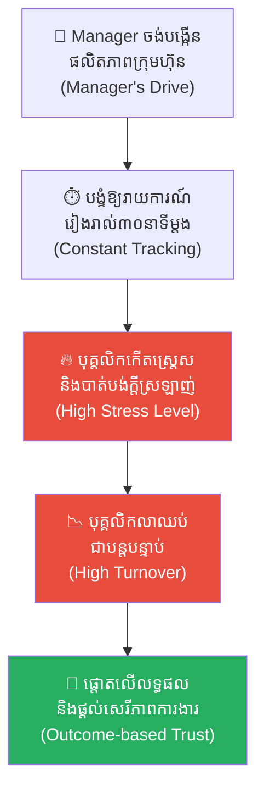
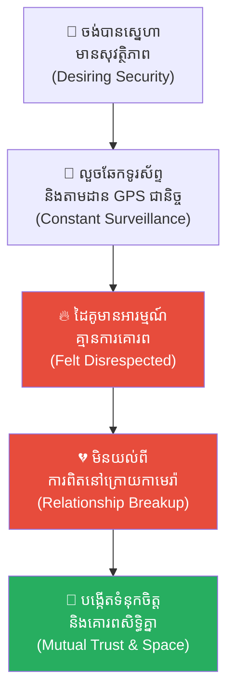
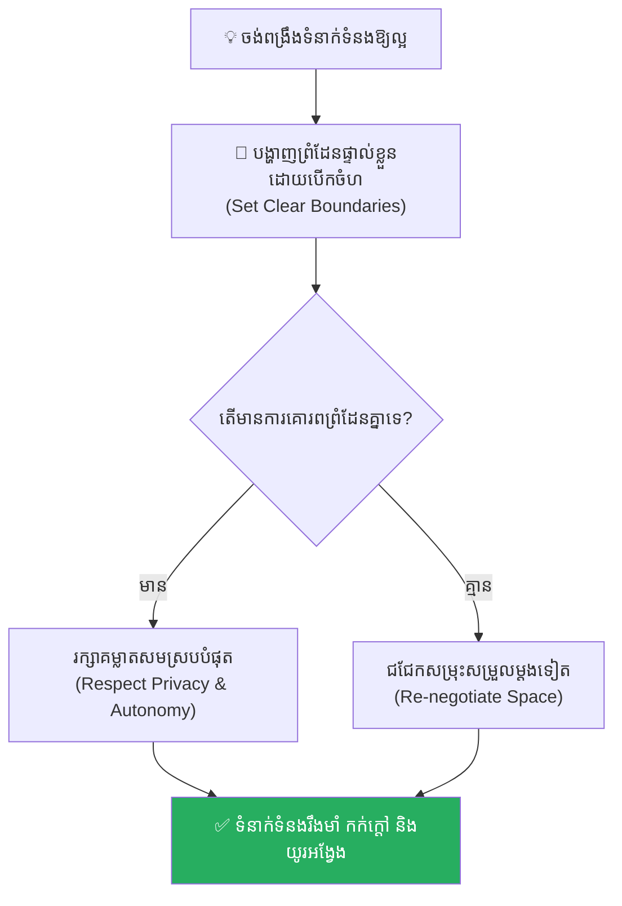

# The Hedgehog's Dilemma (ទ្រឹស្តីសត្វកាំប្រមា និងគម្លាតក្នុងស្នេហា)៖ របៀបរក្សាចម្ងាយសមស្របក្នុងទំនាក់ទំនងដោយមិនបង្កើតការឈឺចាប់ឱ្យគ្នា

**Author:** ichamrong  
**Date:** 2026-05-17  
**Tags:** #hedgehogs-dilemma #relationships #boundaries #psychology #life-lessons #critical-thinking  
**Category:** Concepts  
**Read Time:** ~15 min  

---

## 📌 មាតិកា (Table of Contents)
- [អន្ទាក់ផ្លូវចិត្ត (The Trap)](#អន្ទាក់ផ្លូវចិត្ត-the-trap)
- [១. រឿងនិទានសត្វកាំប្រមា (The Fable of the Hedgehogs)](#1)
  - [គម្លាតមួយដ៏សមស្រប (The Optimal Distance)](#1-1)
- [២. បញ្ហា៖ បន្លានៃការគ្រប់គ្រង និងការបាត់បង់សេរីភាព (The Issue: Over-Attachment and Control)](#2)
- [៣. ឧទាហរណ៍ជាក់ស្តែងក្នុងពិភពពិត (Real World Examples)](#3)
  - [ឧទាហរណ៍ទី ១ — កម្រិតស្រាល (គ្រួសារ)៖ ឪពុកម្តាយរឹតត្បិតជីវិតឯកជនរបស់កូន (The Helicopter Parents)](#3-1)
  - [ឧទាហរណ៍ទី ២ — កម្រិតមធ្យម (បច្ចេកទេស)៖ Lead Dev មីក្រូគ្រប់គ្រងកូដរបស់សមាជិក (The Micromanaged Codebase)](#3-2)
  - [ឧទាហរណ៍ទី ៣ — កម្រិតមធ្យម (ធុរកិច្ច)៖ ដៃគូសហការគ្រប់គ្រងគ្នាចង់ដឹងគ្រប់រឿង (The Over-dependent Co-founders)](#3-3)
  - [ឧទាហរណ៍ទី ៤ — កម្រិតមធ្យម (សង្គម/គ្រប់គ្រង)៖ ការគ្រប់គ្រងម៉ោងការងាររបស់ Manager (The Micro-manager's Clock)](#3-4)
  - [ឧទាហរណ៍ទី ៥ — កម្រិតធ្ងន់ (ទំនាក់ទំនង)៖ ការលួចឆែកទូរស័ព្ទ និងសង្ស័យដៃគូជីវិត (The Toxic Jealousy Trap)](#3-5)
- [៤. ដំណោះស្រាយទូទៅ៖ ការកំណត់ព្រំដែនសុខភាពល្អ និងការគោរពគ្នា (The General Solution: Healthy Boundaries)](#4)
- [សេចក្តីសន្និដ្ឋាន (Conclusion)](#conclusion)
- [ឯកសារយោង (References)](#references)
- [Related Posts](#related-posts)

---

## អន្ទាក់ផ្លូវចិត្ត (The Trap)

តើអ្នកធ្លាប់មានអារម្មណ៍ថា នៅពេលអ្នកព្យាយាមខិតជិតនរណាម្នាក់ដើម្បីផ្តល់ក្តីស្រឡាញ់ ពួកគេបែរជារត់គេច ឬធ្វើឱ្យអ្នកឈឺចាប់ ហើយនៅពេលអ្នកដកឃ្លាចេញឆ្ងាយ អ្នកទាំងពីរក៏កើតមានអារម្មណ៍ឯកោ និងរងាវិញដែរឬទេ?

នេះគឺជា **The Hedgehog's Dilemma (ចំណោទបញ្ហារបស់សត្វកាំប្រមា)**។ 

នៅក្នុងទំនាក់ទំនងរបស់មនុស្ស ជារឿយៗយើងតែងតែយកពាក្យថា «ក្តីស្រឡាញ់» ឬ «ភាពជិតស្និទ្ធ» មកធ្វើជាអាវុធដើម្បីរុករានចូលទៅក្នុង «ព្រំដែនឯកជនភាព» (Privacy Boundaries) របស់ដៃគូ។ យើងព្យាយាមគ្រប់គ្រង តាមដាន និងផ្លាស់ប្តូរជីវិតរបស់ពួកគេទាំងស្រុង។ សកម្មភាពដែលគ្មានគម្លាតសមរម្យនេះ មិនត្រឹមតែមិនអាចផ្តល់ភាពកក់ក្តៅឡើយ តែវាប្រៀបដូចជាការយកបន្លាដ៏មុតស្រួចនៅលើខ្លួនយើង ទៅចាក់ទម្លុះសាច់មនុស្សជាទីស្រឡាញ់ឱ្យរងរបួសពេញខ្លួនជារៀងរាល់ថ្ងៃ។

ដើម្បីយល់ដឹងឱ្យបានគ្រប់ជ្រុងជ្រោយ នេះជាផែនទីបង្ហាញផ្លូវសម្រាប់អត្ថបទនេះ៖
1. **រឿងនិទានសត្វកាំប្រមា (The Fable of the Hedgehogs)** — រឿងប្រៀបធៀបដ៏ល្បីល្បាញរបស់ទស្សនវិទូ Arthur Schopenhauer នារដូវរងាដ៏ត្រជាក់កាត់ស្បែក។
2. **បញ្ហា (The Issue)** — ការវិភាគចិត្តវិទ្យារបស់ Sigmund Freud អំពីគម្លាត និងព្រំដែនសុខភាពល្អក្នុងទំនាក់ទំនង។
3. **ឧទាហរណ៍ជាក់ស្តែងក្នុងពិភពពិត (Real World Examples)** — ពិនិត្យមើលឥទ្ធិពលនេះក្នុងកម្រិតគ្រួសារ ការងារបច្ចេកទេស ធុរកិច្ច ការគ្រប់គ្រង និងទំនាក់ទំនងស្នេហា។
4. **ដំណោះស្រាយទូទៅ (The General Solution)** — វិធីសាស្ត្របង្កើត «គម្លាតសមស្រប» ដើម្បីទទួលបានភាពកក់ក្តៅដោយគ្មានស្នាមរបួស។

---

## ១. រឿងនិទានសត្វកាំប្រមា (The Fable of the Hedgehogs)

មានរឿងប្រៀបប្រដូច (Allegory) មួយបង្កើតឡើងដោយទស្សនវិទូអាល្លឺម៉ង់ដ៏ល្បីល្បាញ **Arthur Schopenhauer** បានដំណាលថា នៅក្នុងរដូវរងាដ៏ត្រជាក់កាត់ស្បែក សត្វកាំប្រមាពីរក្បាលបានជាប់នៅក្នុងរូងភ្នំមួយដ៏ងងឹតសូន្យសុង។

នៅពេលដែលសីតុណ្ហភាពធ្លាក់ចុះយ៉ាងគំហុក ពួកវាទាំងពីរចាប់ផ្តើមញ័ររន្ធត់ដោយសារភាពរងា។ ដោយសារទ្រាំនឹងអាកាសធាតុត្រជាក់លែងបាន ពួកវាក៏បានខិតចូលជិតគ្នា ដើម្បីផ្តល់ភាពកក់ក្តៅដល់គ្នាទៅវិញទៅមក។ ប៉ុន្តែនៅពេលដែលរាងកាយរបស់ពួកវាប៉ះគ្នា បន្លាដ៏មុតស្រួចនៅលើដងខ្លួន ក៏បានចាក់ទម្លុះសាច់គ្នាទៅវិញទៅមក បង្កជាភាពឈឺចាប់យ៉ាងខ្លាំង។

ដោយសារភាពឈឺចាប់ ពួកវាត្រូវបានបង្ខំឲ្យបំបែកខ្លួនចេញពីគ្នាភ្លាមៗ។ ក៏ប៉ុន្តែនៅពេលដែលនៅឆ្ងាយពីគ្នា ខ្យល់រងាក៏បានបក់បោកមកម្តងទៀត ដែលធ្វើឲ្យពួកវាបង្ខំចិត្តខិតចូលជិតគ្នាសារជាថ្មី រួចក៏ត្រូវបន្លាចាក់ឲ្យឈឺចាប់ម្តងទៀត។ ពេញមួយយប់នោះ ពួកវាបានបន្តសកម្មភាពបែបនេះដដែលៗជាវដ្ត (Cycle) — រងាក៏ចូលជិតគ្នា ឈឺចាប់ក៏បែកគ្នា — រហូតទាល់តែព្រឹកព្រលឹមឈានចូលមកដល់។

---

### គម្លាតមួយដ៏សមស្រប (The Optimal Distance)

លុះព្រឹកឡើង គេសង្កេតឃើញថាសត្វកាំប្រមាទាំងពីរក្បាលនោះ មិនបានបាត់បង់ជីវិតដោយសារភាពរងានោះទេ ប៉ុន្តែរាងកាយរបស់ពួកវាបែរជាពោរពេញទៅដោយស្នាមរបួសសស្រាក់សស្រាំទៅវិញ។ អ្វីដែលគួរឲ្យកត់សម្គាល់នោះគឺ ពួកវាកំពុងឈររក្សាចម្ងាយពីគ្នាប្រហែលកន្លះម៉ែត្រ។

ចម្ងាយកន្លះម៉ែត្រនេះគឺជា **គម្លាតមួយដ៏សមស្រប (Optimal Distance)** អាចឲ្យពួកវាទទួលបានកម្តៅដែលជភាយចេញពីខ្លួនគ្នាផង និងមិនត្រូវបន្លាមុតចាក់ឱ្យឈឺចាប់គ្នាទៅវិញទៅមកផង។ ពួកវាបានរស់រានមានជីវិតដោយសារតែការចេះរក្សាតុល្យភាពនៃគម្លាតនេះឯង។

---

## ២. បញ្ហា៖ បន្លានៃការគ្រប់គ្រង និងការបាត់បង់សេរីភាព (The Issue: Over-Attachment and Control)

នៅក្នុងចិត្តវិទ្យាស៊ីជម្រៅ (Psychoanalysis) ទ្រឹស្តីសត្វកាំប្រមា **The Hedgehog's Dilemma** ឆ្លុះបញ្ចាំងពីវិបត្តិទំនាក់ទំនងរបស់មនុស្ស។

Sigmund Freud បានពន្យល់ថា មនុស្សត្រូវការភាពជិតស្និទ្ធដើម្បីកុំឱ្យឯកា ប៉ុន្តែភាពជិតស្និទ្ធខ្លាំងពេកដោយគ្មាន **«ព្រំដែនឯកជនភាព» (Personal Boundaries)** នឹងបង្កើតនូវ៖
* **ការបាត់បង់អត្តសញ្ញាណផ្ទាល់ខ្លួន (Loss of Autonomy)៖** ការព្យាយាមគ្រប់គ្រងជីវិតគូស្នេហ៍ឱ្យដូចជាកម្មសិទ្ធិផ្តាច់មុខ។
* **ភាពតានតឹងផ្លូវចិត្ត (Psychological Tension)៖** វត្តមានដែលគ្មានពេលដកដង្ហើម បង្កើតជាអារម្មណ៍ថប់ដង្ហើម និងចង់រត់គេច។
* **ការបង្កការឈឺចាប់ដោយមិនដឹងខ្លួន៖** យកបំណងល្អមកធ្វើជាលេសដើម្បីរំលោភសិទ្ធិសម្រេចចិត្តរបស់ដៃគូ។

---

## ៣. ឧទាហរណ៍ជាក់ស្តែងក្នុងពិភពពិត

ដើម្បីយល់ដឹងឱ្យកាន់តែស៊ីជម្រៅ ផ្លូវការសិក្សានឹងនាំអ្នកទៅពិនិត្យមើល **ឧទាហរណ៍ចំនួន ៥ កម្រិតខុសៗគ្នា** ក្នុងជីវិតរស់នៅប្រចាំថ្ងៃ៖

---

### ឧទាហរណ៍ទី ១ — កម្រិតស្រាល (គ្រួសារ)៖ ឪពុកម្តាយរឹតត្បិតជីវិតឯកជនរបស់កូន (The Helicopter Parents)

**ស្ថានភាព៖** ឪពុកម្តាយស្រឡាញ់កូនស្រីខ្លាំងពេក រហូតដល់តាមសួរនាំមិត្តភក្តិ គ្រប់គ្រងម៉ោងចូលគេង និងសរសេរកំណត់ហេតុប្រចាំថ្ងៃជំនួសកូន ទោះបីជានាងអាយុ ២០ ឆ្នាំហើយក៏ដោយ។

* **ភាគី A (ឪពុកម្តាយ)៖** គិតថា «ក្តីស្រឡាញ់គឺត្រូវតែដឹងគ្រប់រឿងរបស់កូន ដើម្បីការពារនាង» (បន្លាដែលចាក់កូន)។
* **ភាគី B (កូនស្រី)៖** មានអារម្មណ៍ថប់ដង្ហើម គ្មានសេរីភាព និងចាប់ផ្តើមភូតភរ លាក់បាំងរឿងរ៉ាវផ្ទាល់ខ្លួនពីឪពុកម្តាយជានិច្ច (ដកខ្លួនចេញដើម្បីការពារខ្លួន)។

**ការពិតដ៏ជូរចត់៖**
ការព្យាយាមរលាយបញ្ចូលកូនមកក្រោមការគ្រប់គ្រង បែរជាជម្រុញឱ្យកូនចាកចេញពីគ្រួសារកាន់តែលឿន និងឆ្ងាយទៅវិញ។

---

### ឧទាហរណ៍ទី ២ — កម្រិតមធ្យម (បច្ចេកទេស)៖ Lead Dev មីក្រូគ្រប់គ្រងកូដរបស់សមាជិក (The Micromanaged Codebase)

**ស្ថានភាព៖** Lead Developer ស្រឡាញ់ Project ខ្លាំង និងចង់ឱ្យវាល្អឥតខ្ចោះ។ គាត់តាមពិនិត្យ និងកែសម្រួលកូដរបស់ Junior Developers គ្រប់បន្ទាត់ សូម្បីតែឈ្មោះ Variable ក៏ត្រូវកែតាមគំនិតគាត់ផ្ទាល់ដែរ។

* **ភាគី A (Lead Dev)៖** គិតថាកំពុងតែថែរក្សាស្តង់ដារកូដឱ្យបានល្អបំផុត (Quality Control)។
* **ភាគី B (Junior Devs)៖** មានអារម្មណ៍ថាគ្មានការជឿទុកចិត្ត និងគ្មានកន្លែងសម្រាប់បញ្ចេញសមត្ថភាពច្នៃប្រឌិត។ ពួកគេឈប់ខំប្រឹង និងធ្វើការងារឱ្យតែរួចៗពីដៃ។

**ការពិតដ៏ជូរចត់៖**
ការគ្រប់គ្រងខ្លាំងពេក បំផ្លាញស្មារតីម្ចាស់ការ និងសមត្ថភាពរីកចម្រើនរបស់ក្រុមការងារ។

---

### ឧទាហរណ៍ទី ៣ — កម្រិតមធ្យម (ធុរកិច្ច)៖ ដៃគូសហការគ្រប់គ្រងគ្នាចង់ដឹងគ្រប់រឿង (The Over-dependent Co-founders)

**ស្ថានភាព៖** Co-founders ពីរនាក់ធ្វើការងារជាមួយគ្នាយ៉ាងជិតស្និទ្ធ។ ពួកគេសម្រេចចិត្តសម្រាក និងហូបបាយជាមួយគ្នា សូម្បីតែការទំនាក់ទំនងអតិថិជនតូចតាចក៏ត្រូវតែមានការយល់ព្រមពីទាំងពីរនាក់ជាមុនដែរ។

* **ភាគី A (Co-founder 1)៖** យល់ថាការសម្រេចចិត្តរួមគ្នាគ្រប់រឿងជាសញ្ញានៃភាពស្មោះត្រង់ និងការសហការ។
* **ភាគី B (Co-founder 2)៖** ចាប់ផ្តើមធុញទ្រាន់ និងមានអារម្មណ៍ថាគ្មាន Autonomy ក្នុងការគ្រប់គ្រងផ្នែករបស់ខ្លួន។ ជម្លោះតូចតាចចាប់ផ្តើមផ្ទុះឡើងរាល់ថ្ងៃ។

**ការពិតដ៏ជូរចត់៖**
កិច្ចការងារអាជីវកម្មត្រូវយឺតយ៉ាវ និងបាត់បង់ឱកាសទីផ្សារ ព្រោះតែការខ្វះទំនុកចិត្ត និងការរំលោភសិទ្ធិសម្រេចចិត្តលើផ្នែករៀងៗខ្លួន។

---

### ឧទាហរណ៍ទី ៤ — កម្រិតមធ្យម (សង្គម/គ្រប់គ្រង)៖ ការគ្រប់គ្រងម៉ោងការងាររបស់ Manager (The Micro-manager's Clock)

**ស្ថានភាព៖** Manager ម្នាក់បង្ខំឱ្យបុគ្គលិករាយការណ៍រៀងរាល់ ៣០ នាទីម្តងថាពួកគេកំពុងធ្វើអ្វី និងតាមដានចលនាកណ្ដុរលើកុំព្យូទ័រ។

* **ភាគី A (Manager)៖** គិតថាការធ្វើបែបនេះនឹងជួយបង្កើន Productivity របស់ក្រុមហ៊ុន។
* **ភាគី B (បុគ្គលិក)៖** កើតស្រ្តេសខ្លាំង បាត់បង់ក្តីស្រឡាញ់ចំពោះការងារ និងសម្រេចចិត្តលាឈប់ជាបន្តបន្ទាប់។

**ការពិតដ៏ជូរចត់៖**
ការរឹតត្បិតសេរីភាពផ្ទាល់ខ្លួន បំផ្លាញនូវផលិតភាពការងារពិតប្រាកដ និងភាពស្មោះត្រង់របស់បុគ្គលិក។

---

### ឧទាហរណ៍ទី ៥ — កម្រិតធ្ងន់ (ទំនាក់ទំនង)៖ ការលួចឆែកទូរស័ព្ទ និងសង្ស័យដៃគូជីវិត (The Toxic Jealousy Trap)

**ស្ថានភាព៖** ប្រពន្ធលួចឆែកសារទូរស័ព្ទ និងគណនីបណ្តាញសង្គមរបស់ប្តីរាល់យប់ ព្រមទាំងតាមដានទីតាំង GPS ជានិច្ច ព្រោះធ្លាប់រងការឈឺចាប់ពីស្នេហាមុន។

* **ភាគី A (ប្រពន្ធ)៖** គិតថា «ខ្ញុំសង្ស័យព្រោះខ្ញុំស្រឡាញ់ និងខ្លាចបាត់បង់គាត់ខ្លាំងពេក»។
* **ភាគី B (ប្តី)៖** មានអារម្មណ៍ថាគ្មានការគោរព និងគ្មានទំនុកចិត្តក្នុងគ្រួសារ។ គាត់ចាប់ផ្តើមធុញទ្រាន់ និងដកខ្លួនចេញពីអាពាហ៍ពិពាហ៍។

**ការពិតដ៏ជូរចត់៖**
ការខិតចូលជិតដោយក្តីសង្ស័យ និងគ្មានព្រំដែនឯកជនភាព បានបំផ្លាញសេចក្តីសុខក្នុងគ្រួសារទាំងស្រុង។

---

## ៤. ដំណោះស្រាយទូទៅ៖ ការកំណត់ព្រំដែនសុខភាពល្អ និងការគោរពគ្នា (The General Solution: Healthy Boundaries)

ដើម្បីអនុវត្តគំរូសត្វកាំប្រមាដែលជោគជ័យ ត្រូវបង្កើតច្បាប់ទំនាក់ទំនងខាងក្រោម៖

### ១. ផ្តល់ឱ្យគ្នាទៅវិញទៅមកនូវ «ចន្លោះដកដង្ហើម» (Personal Space)
យល់ដឹងថា មនុស្សម្នាក់ៗត្រូវការពេលវេលាឯកជនភាព (Me Time) ដើម្បីសញ្ជឹងគិត អភិវឌ្ឍខ្លួនឯង ឬជួបជុំមិត្តភក្តិផ្ទាល់ខ្លួន។ កុំព្យាយាមបំពេញម៉ោង ២៤ របស់ដៃគូដោយវត្តមានរបស់អ្នក។

### ២. បង្កើតទំនុកចិត្តដោយផ្អែកលើការគោរពសិទ្ធិ (Mutual Trust & Autonomy)
ឈប់សង្ស័យ ឬតាមដាន។ ទំនុកចិត្តពិតប្រាកដមិនមែនកើតឡើងដោយសារការគ្រប់គ្រងឡើយ តែវាកើតឡើងពីការផ្តល់សេរីភាពដាច់ខាតឱ្យដៃគូ ហើយពួកគេនៅតែជ្រើសរើសស្មោះត្រង់នឹងអ្នកដោយស្ម័គ្រចិត្ត។

### ៣. បង្ហាញព្រំដែន (Boundaries) ផ្ទាល់ខ្លួនដោយសុភាព
និយាយប្រាប់ដៃគូដោយបើកចិត្តទូលាយ និងទន់ភ្លន់ពីតម្រូវការផ្ទាល់ខ្លួនរបស់អ្នក៖ *«ខ្ញុំស្រឡាញ់អ្នកខ្លាំងណាស់ តែខ្ញុំត្រូវការពេល ២ ម៉ោងក្នុងមួយថ្ងៃដើម្បីផ្តោតលើការសរសេរកូដ/អានសៀវភៅស្ងៀមស្ងាត់។»*

---

## សេចក្តីសន្និដ្ឋាន (Conclusion)

> **«សេចក្តីស្រឡាញ់ដ៏ខ្ពង់ខ្ពស់បំផុត មិនមែនជាការរលាយខ្លួនបញ្ចូលគ្នាដើម្បីថប់ដង្ហើមជាមួយគ្នានោះឡើយ។ ប៉ុន្តែវាគឺជាការចេះឈររក្សាចម្ងាយសមស្របមួយ ដែលអនុញ្ញាតឱ្យអ្នកទាំងពីរអាចចាំងពន្លឺកក់ក្តៅដាក់គ្នា ដោយមិនត្រូវបន្លាចាក់ឱ្យឈឺចាប់។»**

កាំប្រមាទាំងពីរបានរស់រាន ព្រោះវាចេះស្វែងរកចម្ងាយកន្លះម៉ែត្រ។ ចូរកុំទុកឱ្យបំណងប្រាថ្នាចង់គ្រប់គ្រងហួសព្រំដែន មកដុតបំផ្លាញ និងចាក់សម្លាប់មនុស្សជាទីស្រឡាញ់របស់អ្នកឡើយ។

ចូររក្សាគម្លាតសមស្របរបស់កាំប្រមា។

---

## ឯកសារយោង (References)

* **Schopenhauer, A.** — *Parerga and Paralipomena* (1851). analogie de porc-épic.
* **Freud, S.** — *Group Psychology and the Analysis of the Ego* (1921). ការយកមកវិភាគក្នុងចិត្តវិទ្យានៃ Ego។
* **Cloud, H., & Townsend, J.** — *Boundaries: When to Say Yes, How to Say No to Take Control of Your Life* (1992). មូលដ្ឋានគ្រឹះនៃការកំណត់ព្រំដែនជីវិត។

---

## Related Posts

* **[Relative Deprivation Effect (ឥទ្ធិពលនៃការដកហូតដោយការប្រៀបធៀប)៖ គ្រោះថ្នាក់នៃដង្ហើមច្រណែន និងការបំផ្លាញខ្លួនឯងព្រោះតែស៊ុបសាច់ចៀមមួយចាន](./02-relative-deprivation-effect.md)** — Managing personal space and equity.
* **[The Angel vs. The Demon Dilemma (ចំណោទបញ្ហារវាងទេវតា និងបិសាច)៖ ជម្រើសដ៏ពិបាករវាងប្រយោជន៍រួម និងសេចក្តីស្នេហាដាច់ខាតគ្មានលក្ខខណ្ឌ](./03-angel-and-demon-dilemma.md)** — The boundaries between world expectations and individual love languages.
* **[The Law of Value (ច្បាប់នៃតម្លៃ)៖ ហេតុអ្វីបានជាការខិតខំប្រឹងប្រែងតែម្ខាង មិនអាចកំណត់តម្លៃពិតប្រាកដរបស់អ្នកបាន?](./05-the-law-of-value.md)** — Relational values and self-worth.
