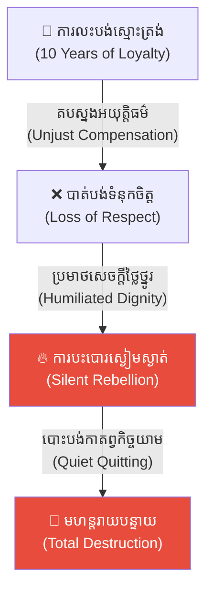
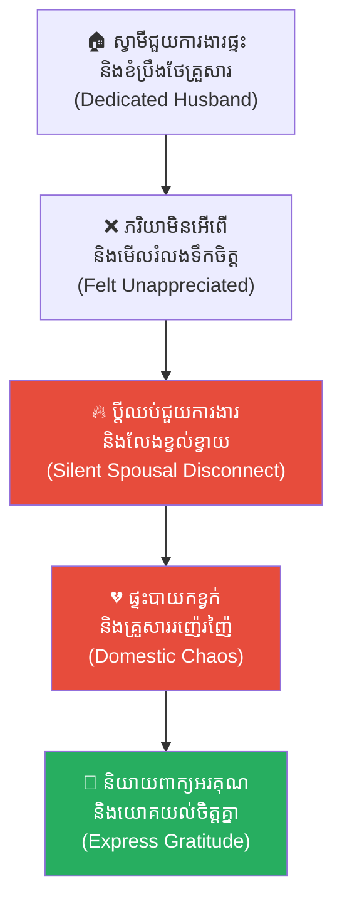
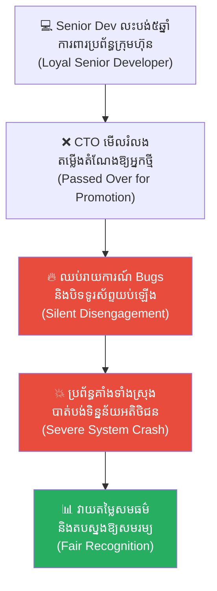
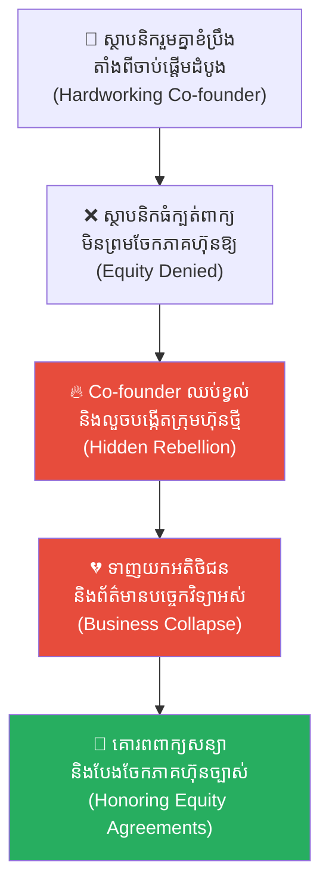
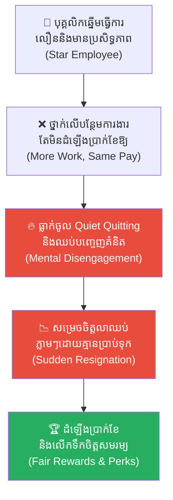
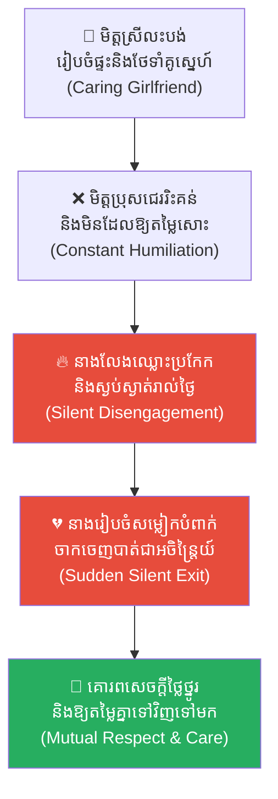
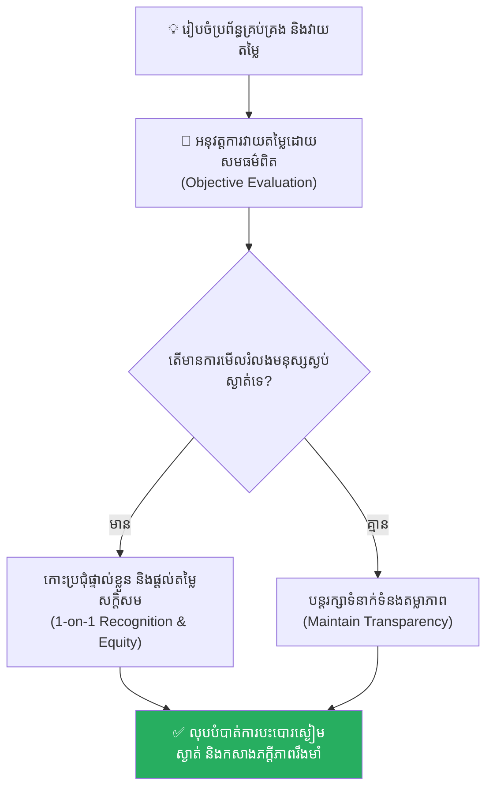

# The Silent Rebellion (ការបះបោរដោយស្ងៀមស្ងាត់)៖ គ្រោះថ្នាក់នៃការរំលោភសេចក្តីថ្លៃថ្នូរ និងការបាត់បង់ភក្តីភាពរបស់មនុស្សស្ងប់ស្ងាត់

**Author:** ichamrong  
**Date:** 2026-05-17  
**Tags:** #leadership #loyalty #silent-rebellion #betrayal #life-lessons #chinese-history #critical-thinking  
**Category:** Concepts  
**Read Time:** ~15 min  

---

## 📌 មាតិកា (Table of Contents)
- [អន្ទាក់ផ្លូវចិត្ត (The Trap)](#អន្ទាក់ផ្លូវចិត្ត-the-trap)
- [១. រឿងព្រេងប្រវត្តិសាស្ត្រចិន៖ រង្វាន់ដែលមិនសក្តិសមនៅ ច្រកទ្វារយូមិន (The Unworthy Reward at Yumen Pass)](#1)
  - [ការវាយប្រហារពេលរាត្រី និងភាពស្ងៀមស្ងាត់នៃប៉មយាម (The Night Attack and Silence of the Watchtower)](#1-1)
  - [ការសោកស្តាយរបស់ មេទ័ពកៅ ស៊ានជី (The Late Regret of General Gao)](#1-2)
- [២. បញ្ហា៖ ការបះបោរដោយស្ងៀមស្ងាត់ និង Quiet Quitting (The Issue: Silent Disengagement)](#2)
- [៣. ឧទាហរណ៍ជាក់ស្តែងក្នុងពិភពពិត (Real World Examples)](#3)
  - [ឧទាហរណ៍ទី ១ — កម្រិតស្រាល (គ្រួសារ)៖ ការមើលរំលងទឹកចិត្តកូនច្បង ឬប្តីប្រពន្ធ (The Silent Spouse Disconnect)](#3-1)
  - [ឧទាហរណ៍ទី ២ — កម្រិតមធ្យម (បច្ចេកទេស)៖ Developer ចាស់វស្សាដែលត្រូវមើលរំលងការតرفង់តំណែង (The Passed-Over Senior Dev)](#3-2)
  - [ឧទាហរណ៍ទី ៣ — កម្រិតមធ្យម (ធុរកិច្ច)៖ ការមិនផ្តល់ចំណែកភាគហ៊ុនដល់ដៃគូដំបូង (The Forgotten Co-founder Equity)](#3-3)
  - [ឧទាហរណ៍ទី ៤ — កម្រិតមធ្យម (សង្គម/គ្រប់គ្រង)៖ ការតបស្នងបុគ្គលិកឆ្នើមដោយការបន្ថែមការងារ (The Reward for Good Work is More Work)](#3-4)
  - [ឧទាហរណ៍ទី ៥ — កម្រិតធ្ងន់ (ទំនាក់ទំនង)៖ ភាពស្ងៀមស្ងាត់មុនការចាកចេញដាច់ស្រឡះ (The Silent Exit in Relationship)](#3-5)
- [៤. ដំណោះស្រាយទូទៅ៖ ការគោរពតម្លៃមនុស្ស និងយន្តការសមធម៌ (The General Solution: Equity and Recognition)](#4)
- [សេចក្តីសន្និដ្ឋាន (Conclusion)](#conclusion)
- [ឯកសារយោង (References)](#references)
- [Related Posts](#related-posts)

---

## អន្ទាក់ផ្លូវចិត្ត (The Trap)

តើអ្នកធ្លាប់ឆ្ងល់ទេថា ហេតុអ្វីបានជាបុគ្គលិកដ៏ស្ងប់ស្ងាត់ និងស្មោះត្រង់បំផុតម្នាក់ ស្រាប់តែសម្រេចចិត្តដាក់ពាក្យលាឈប់ពីការងារភ្លាមៗ ឬងាកខ្នងដាក់ក្រុមហ៊ុនដោយគ្មានការព្រមានទុកមុនសូម្បីតែមួយម៉ាត់?

នេះគឺជា **The Silent Rebellion (ការបះបោរដោយស្ងៀមស្ងាត់)**។ 

នៅក្នុងការដឹកនាំ ឬទំនាក់ទំនង មនុស្សជាច្រើនតែងតែយល់ច្រឡំថា «ភាពស្ងៀមស្ងាត់» គឺជា «ការយល់ព្រម» ឬ «ការចុះចូល»។ ពួកគេយកចិត្តស្មោះត្រង់ និងការលះបង់របស់អ្នកដទៃមកលេងសើច ដោយការផ្តល់នូវការតបស្នងដ៏អយុត្តិធម៌ និងការជាន់ឈ្លីសេចក្តីថ្លៃថ្នូររបស់ពួកគេ។ ទង្វើនេះប្រៀបដូចជាការកាត់ផ្តាច់ខ្សែជីវិតរបស់ខ្លួនឯងដោយមិនដឹងខ្លួន ព្រោះនៅពេលដែលមនុស្សស្ងប់ស្ងាត់សម្រេចចិត្ត «បះបោរ» ពួកគេមិនស្រែកតវ៉ាឡើយ គឺពួកគេគ្រាន់តែឈរមើលបន្ទាយរបស់អ្នកត្រូវដួលរលំដោយស្ងៀមស្ងាត់ប៉ុណ្ណោះ។

ដើម្បីយល់ដឹងឱ្យបានគ្រប់ជ្រុងជ្រោយ នេះជាផែនទីបង្ហាញផ្លូវសម្រាប់អត្ថបទនេះ៖
1. **រឿងព្រេងប្រវត្តិសាស្ត្រ (The Historic Legend)** — រឿងរ៉ាវរបស់មេទ័ព Gao Xianzhi ទាហានយាមប៉មដ៏កម្សត់ Lao Zhang និងកាក់ស្ពាន់ចាស់ៗនៅ Yumen Pass។
2. **បញ្ហា (The Issue)** — តើ Silent Rebellion (Quiet Quitting) ដំណើរការយ៉ាងដូចម្តេចក្នុងចិត្តវិទ្យាស្ថាប័ន?
3. **ឧទាហរណ៍ជាក់ស្តែងក្នុងពិភពពិត (Real World Examples)** — ពិនិត្យមើលឥទ្ធិពលនេះក្នុងកម្រិតគ្រួសារ ការងារបច្ចេកទេស ធុរកិច្ច ការគ្រប់គ្រង និងទំនាក់ទំនងស្នេហា។
4. **ដំណោះស្រាយទូទៅ (The General Solution)** — ការផ្លាស់ប្តូរផ្នត់គំនិតទៅរកការផ្តល់តម្លៃមនុស្ស និងការបង្កើតយន្តការសមធម៌ពិតប្រាកដ។

---

## ១. រឿងព្រេងប្រវត្តិសាស្ត្រចិន៖ រង្វាន់ដែលមិនសក្តិសមនៅ ច្រកទ្វារយូមិន (The Unworthy Reward at Yumen Pass)

នៅក្នុងសម័យរាជវង្សថាំង (Tang Dynasty) នៃប្រទេសចិនបុរាណ ក្រោយពីសម្រេចបាននូវជ័យជម្នះ (Victory) យ៉ាងត្រចះត្រចង់ក្នុងសង្គ្រាមប្រឆាំងនឹងពួកចោរព្រៃនៅទិសខាងលិច កងទ័ពក្រោមការដឹកនាំ (Leadership) របស់មេទ័ពដ៏ល្បីល្បាញនាម **កៅ ស៊ានជី (General Gao Xianzhi)** បានដើរទ័ពត្រឡប់មកកាន់បន្ទាយការពារព្រំដែននៅ **ច្រកទ្វារយូមិន (Yumen Pass)** ប្រកបដោយក្តីអំណរ និងមោទនភាព។

នារាត្រីនៃពិធីជប់លៀងអបអរសាទរ (Celebration) នោះ មេទ័ព កៅ ស៊ានជី បានរៀបចំពិធីប្រគល់រង្វាន់ (Reward Distribution) ក្នុងគោលបំណងលើកទឹកចិត្ត (Motivation) និងពង្រឹងភក្តីភាព (Loyalty) របស់កងទ័ព។ លោកបានប្រគល់រង្វាន់ជាមាសសុទ្ធចំនួន ១០ ដំឡឹង យ៉ាងសន្ធឹកសន្ធាប់ដល់ក្រុមទាហានវ័យក្មេង ដែលទើបតែចូលបម្រើការងារថ្មីថ្មោង ប៉ុន្តែពូកែខាងបញ្ចើចបញ្ចើ និងអែបអបថ្នាក់លើ។

ផ្ទុយទៅវិញ នៅពេលហៅឈ្មោះដល់វេនទាហានយាមប៉មដ៏ចំណាស់ម្នាក់នាម **ឡៅ ចាង (Lao Zhang)** ដែលបានលះបង់ពេលវេលាពេញ ១០ ឆ្នាំ ឈរយាមកាមយ៉ាងលំបាក ដើម្បីការពារច្រកព្រំដែនទាំងយប់ទាំងថ្ងៃ ឆ្លងកាត់ទាំងព្យុះខ្សាច់ និងភាពរងាប្រកបដោយការប្តេជ្ញាចិត្ត (Commitment) ខ្ពស់នោះ មេទ័ព កៅ ស៊ានជី បែរជាបង្ហាញនូវការព្រងើយកន្តើយ (Indifference)។ លោកគ្រាន់តែបោះ **កាក់ស្ពាន់ចាស់ៗមួយខ្សែ** ទៅឱ្យទាហានចំណាស់រូបនោះដោយភាពសោះអង្គើយ និងមើលងាយទៅវិញ។

**ឡៅ ចាង (Lao Zhang)** បានទទួលយកកាក់ស្ពាន់នោះមកកាន់ជាប់ក្នុងដៃ រួចឈរទ្រឹងសម្លឹងមើលវាដោយភាពស្ងៀមស្ងាត់។ ភ្នែកម្ខាងរបស់គាត់ដែលនៅសល់ពីការបាត់បង់ក្នុងសមរភូមិមុនៗ ស្រាប់តែបិទជិតមួយខណៈ ហាក់បីដូចជាកំពុងលេបត្របាក់នូវក្តីឈឺចាប់ និងការប្រមាថកិត្តិយស (Humiliation) យ៉ាងជ្រាលជ្រៅបំផុត។ ដោយមិនបានហាស្ដីទាមទារភាពយុត្តិធម៌ (Justice) សូម្បីមួយម៉ាត់ គាត់បានងាកខ្នងដើរតម្រង់ចូលទៅក្នុងភាពងងឹតនៃរាត្រីនៅជើងភ្នំយ៉ាងស្ងាត់ជ្រងំ ប្រៀបដូចជាបុគ្គលម្នាក់ដែលបានសម្រេចចិត្តដាច់ស្រេច (Firm Decision) លើរឿងអ្វីមួយ។

---

### ការវាយប្រហារពេលរាត្រី និងភាពស្ងៀមស្ងាត់នៃប៉មយាម (The Night Attack and Silence of the Watchtower)

នៅពេលរាត្រីកាន់តែជ្រៅ កងទ័ពរបស់មេទ័ព កៅ ស៊ានជី កំពុងតែលង់លក់ក្នុងភាពស្រវឹងជោកជាំ និងការសប្បាយភ្លេចខ្លួន (Complacency) ដោយគ្មានយុទ្ធជនណាម្នាក់បានយកចិត្តទុកដាក់ចំពោះសភាពការណ៍សន្តិសុខ (Security Situation) នៅជុំវិញច្រកព្រំដែនឡើយ។

រំពេចនោះ នៅពាក់កណ្តាលអធ្រាត្រ កងទ័ពសេះរាប់ពាន់នាក់របស់សត្រូវ បានលួចឆ្លងកាត់ទន្លេទឹកកកយ៉ាងស្ងៀមស្ងាត់ រួចបើកការវាយប្រហារ (Attack) សន្ធប់មកលើបន្ទាយយូមិន (Yumen Pass) យ៉ាងសន្ធឹកសន្ធាប់ប្រៀបបាននឹងទឹកបាក់ទំនប់។

យោងតាមវិន័យយោធា (Military Discipline) ដ៏តឹងរ៉ឹង ប្រសិនបើមានចលនាខុសប្រក្រតីណាមួយកើតឡើងនៅលើវាលខ្សាច់ ទោះបីជាតូចតាចយ៉ាងណាក៏ដោយ ភ្លើងសញ្ញាប្រកាសអាសន្ន (Warning Signal) នៅលើប៉មយាមដ៏ខ្ពស់ត្រូវតែត្រូវបានដុតបញ្ឆេះឡើងភ្លាមៗ។ ផ្សែងខ្មួលខ្មៅដែលហុយឡើងទៅលើអាកាស គឺជាសញ្ញាដាស់តឿន (Alert) ឱ្យកងទ័ពទូទាំងបន្ទាយភ្ញាក់ខ្លួន និងត្រៀមលក្ខណៈប្រយុទ្ធ។

យ៉ាងណាមិញ នារាត្រីនោះ ប៉មយាមដ៏ខ្ពស់ត្រដែតរបស់ **ឡៅ ចាង** បែរជាត្រូវគ្របដណ្ដប់ដោយភាពងងឹតសូន្យសុង និងស្ងាត់ជ្រងំប្រៀបដូចជាគ្មានមនុស្សនៅ។ សូម្បីតែពន្លឺភ្លើងប៉ុនអំពិលអំពែកក៏គ្មានបាញ់ចេញមកដែរ។ ដោយសារតែគ្មានប្រព័ន្ធប្រកាសអាសន្ន (Early Warning System) កងទ័ពសត្រូវអាចវាយបំបែកចូលបន្ទាយ និងកាប់សម្លាប់ទាហានដែលកំពុងស្រវឹងដេកលក់យ៉ាងងាយស្រួល ដោយគ្មានអ្នកណាម្នាក់អាចតបតបានទាន់ពេលវេលាឡើយ។

---

### ការសោកស្តាយរបស់ មេទ័ពកៅ ស៊ានជី (The Late Regret of General Gao)

លុះដល់ព្រឹកព្រលឹមស្រាងៗ បន្ទាប់ពីសត្រូវដកទ័ពត្រឡប់ទៅវិញដោយជោគជ័យ មេទ័ព កៅ ស៊ានជី ដែលនៅរស់រានមានជីវិតទាំងរងរបួស បានវារចេញពីគំនរសាកសពដែលដេករាយប៉ាយ។ នៅពេលប្រទះឃើញបន្ទាយការពារព្រំដែនដ៏រឹងមាំត្រូវខ្ទេចខ្ទីគ្មានសល់ លោកក៏កើតក្តីក្រោធខឹងយ៉ាងសន្ធោសន្ធៅ។

លោកបានស្ទុះទៅទាញដាវ រួចដើរសំដៅឡើងទៅកាន់ប៉មយាម ដោយមានបំណងកាប់សម្លាប់ទាហានយាមប៉ម **ឡៅ ចាង** ដើម្បីទារសំណងចំពោះការធ្វេសប្រហែស (Negligence) នេះ។

ប៉ុន្តែនៅពេលឡើងទៅដល់ អ្វីដែលមេទ័ពរូបនោះបានឃើញ គឺមានត្រឹមតែគំនរអុសស្ងួតដែលត្រូវបានរៀបចំរួចជាស្រេចសម្រាប់ដុតធ្វើជាសញ្ញា។ អ្វីដែលកាន់តែចាក់ដោតនោះគឺ នៅចំកណ្តាលគំនរអុស មានចងព្យួរនូវ **«កាក់ស្ពាន់ចាស់ៗមួយខ្សែ»** ដែលលោកទើបតែបានបោះឱ្យ ឡៅ ចាង កាលពីយប់មិញ។ ចំណែកឯស្រមោលរបស់ទាហានចំណាស់ដ៏កម្សត់នោះវិញ គឺបានបាត់ខ្លួនដោយមិនបន្សល់ទុកនូវដានអ្វីឡើយ។

ឡៅ ចាង មិនមែនធ្វេសប្រហែស ឬដេកលក់ឡើយ ប៉ុន្តែគាត់បានសម្រេចចិត្តបោះបង់ចោលនូវ **«ភក្តីភាព» (Loyalty)** ដែលគាត់ធ្លាប់បានលះបង់អស់រយៈពេល ១០ ឆ្នាំកន្លងមក ដើម្បីបង្ហាញឱ្យព្រះរាជា និងមេទ័ពឃើញថា៖ *«នៅពេលកាក់ស្ពាន់មួយខ្សែរបស់លោកគ្មានតម្លៃ នោះជីវិត និងបន្ទាយរបស់លោកក៏គ្មានតម្លៃសម្រាប់ខ្ញុំក្នុងការដុតភ្លើងសង្គ្រោះដូចគ្នា!»*។

---

## ២. បញ្ហា៖ ការបះបោរដោយស្ងៀមស្ងាត់ និង Quiet Quitting (The Issue: Silent Disengagement)

នៅក្នុងចិត្តវិទ្យាស្ថាប័ន (Organizational Psychology) បាតុភូតនេះត្រូវបានហៅថា **Silent Rebellion (ការបះបោរដោយស្ងៀមស្ងាត់)** ឬសម័យបច្ចុប្បន្នហៅថា **Quiet Quitting (ការលាឈប់ផ្លូវចិត្ត)**។

វាកើតឡើងនៅពេល៖
* **ការបាក់បែកកិច្ចសន្យាផ្លូវចិត្ត (Psychological Contract Breach)៖** នៅពេលបុគ្គលិកលះបង់កម្លាំងកាយចិត្ត តែទទួលបានការតបស្នងមិនសមរម្យ និងការមើលងាយសេចក្តីថ្លៃថ្នូរ។
* **ការបាត់បង់ភាពជាម្ចាស់ការ (Disengagement)៖** ឈប់ខ្វល់ខ្វាយ ឈប់បញ្ចេញគំនិត និងធ្វើតែការងារអប្បបរមាបំផុតដើម្បីកុំឱ្យគេដេញចេញ។
* **ការសងសឹកស្ងាត់ៗ (Passive-Aggressive Retaliation)៖** ឈរមើលប្រព័ន្ធមានចន្លោះប្រហោង ឬជិតខូចខាត តែបដិសេធមិនព្រមជួយដោះស្រាយ ឬដាស់តឿនថ្នាក់លើឡើយ។

---

## ៣. ឧទាហរណ៍ជាក់ស្តែងក្នុងពិភពពិត

ដើម្បីយល់ដឹងឱ្យកាន់តែស៊ីជម្រៅ ផ្លូវការសិក្សានឹងនាំអ្នកទៅពិនិត្យមើល **ឧទាហរណ៍ចំនួន ៥ កម្រិតខុសៗគ្នា** ក្នុងជីវិតរស់នៅប្រចាំថ្ងៃ៖

---

### ឧទាហរណ៍ទី ១ — កម្រិតស្រាល (គ្រួសារ)៖ ការមើលរំលងទឹកចិត្តកូនច្បង ឬប្តីប្រពន្ធ (The Silent Spouse Disconnect)

**ស្ថានភាព៖** ប្តីម្នាក់តែងតែជួយធ្វើការងារផ្ទះ បោកខោអាវ និងមើលថែកូនយ៉ាងស្អាតបាត។ ប៉ុន្តែប្រពន្ធមិនដែលសរសើរ ឬដឹងគុណឡើយ ផ្ទុយទៅវិញ នាងយកតែមាសប្រាក់ និងរង្វាន់ធំៗទៅជួយឧបត្ថម្ភដល់ប្អូនបង្កើតរបស់នាងដែលខ្ជិលច្រអូស។

* **ភាគី A (ប្តី)៖** មានអារម្មណ៍ថាការលះបង់របស់ខ្លួនគ្មានតម្លៃសោះក្នុងភ្នែកប្រពន្ធ។ គាត់ចាប់ផ្តើមធ្លាក់ចូលក្នុង Silent Rebellion។
* **ភាគី B (ប្រពន្ធ)៖** ថ្ងៃមួយ ពេលត្រឡប់មកពីធ្វើការវិញ ឃើញផ្ទះបាយពោរពេញដោយចានក្អែល កូនយំ និងខោអាវកខ្វក់គរជើងព្រោះប្តីឈប់ធ្វើការងារផ្ទះទាំងអស់ និងអង្គុយលេងហ្គេមយ៉ាងព្រងើយកន្តើយ។

**ការពិតដ៏ជូរចត់៖**
ការមើលងាយទឹកចិត្តមនុស្សល្អ បំផ្លាញនូវស្ថិរភាព និងក្តីស្រឡាញ់ក្នុងគ្រួសារទាំងស្រុង។

---

### ឧទាហរណ៍ទី ២ — កម្រិតមធ្យម (បច្ចេកទេស)៖ Developer ចាស់វស្សាដែលត្រូវមើលរំលងការតម្លើងតំណែង (The Passed-Over Senior Dev)

**ស្ថានភាព៖** Senior Developer ម្នាក់បានចំណាយពេល ៥ ឆ្នាំការពារ Codebase របស់ក្រុមហ៊ុន និងជួយសរសេរ Core Library។ ប៉ុន្តែ CTO សម្រេចចិត្តតម្លើងតំណែងជា Lead Dev ទៅឱ្យបុគ្គលិកថ្មីម្នាក់ដែលពូកែនិយាយអួតខ្លួន និងពាក់អាវធំស្អាតបាត។

* **ភាគី A (CTO)៖** គិតថា «Senior Dev នោះស្ងៀមស្ងាត់ពេក ទុកឱ្យគាត់នៅសរសេរកូដដដែលល្អជាង» (ផ្តល់កាក់ស្ពាន់ចាស់ៗ)។
* **ភាគី B (Senior Developer)៖** ឈប់រាយការណ៍ពីចន្លោះប្រហោងសុវត្ថិភាពធំៗក្នុងប្រព័ន្ធ (Security Bugs)។ ពេល System គាំងដំណើរការនៅពាក់កណ្តាលយប់ គាត់បិទទូរស័ព្ទ និងមិនឆ្លើយតបសារឡើយ។

**ការពិតដ៏ជូរចត់៖**
CTO ត្រូវប្រឈមមុខនឹងការបាត់បង់ទិន្នន័យអតិថិជន និងការខូចខាតប្រព័ន្ធយ៉ាងធ្ងន់ធ្ងរ ព្រោះតែការមើលរំលងអ្នកដែលការពារបន្ទាយពិតប្រាកដ។

---

### ឧទាហរណ៍ទី ៣ — កម្រិតមធ្យម (ធុរកិច្ច)៖ ការមិនផ្តល់ចំណែកភាគហ៊ុនដល់ដៃគូដំបូង (The Forgotten Co-founder Equity)

**ស្ថានភាព៖** ស្ថាបនិកម្នាក់ខិតខំប្រឹងប្រែងរៀបចំ operation ក្រុមហ៊ុនតាំងពីចាប់ផ្តើមដំបូងជាមួយ Founder ធំ។ ពេលក្រុមហ៊ុនជោគជ័យ Founder ធំមិនព្រមបែងចែកភាគហ៊ុន (Equity) តាមការសន្យាឡើយ ដោយផ្តល់ឱ្យត្រឹមតែ Bonus បន្តិចបន្តួចប៉ុណ្ណោះ។

* **ភាគី A (Founder ធំ)៖** គិតថា «Bonus នេះគ្រប់គ្រាន់សម្រាប់កម្លាំងពលកម្មរបស់គាត់ហើយ»។
* **ភាគី B (Co-founder)៖** ឈប់យកចិត្តទុកដាក់លើអាជីវកម្ម។ គាត់លួចបង្កើតអាជីវកម្មផ្ទាល់ខ្លួន រួចទាញយកអតិថិជនធំៗ និងព័ត៌មានបច្ចេកទេសទាំងអស់ចាកចេញទៅជាមួយយ៉ាងស្ងៀមស្ងាត់។

**ការពិតដ៏ជូរចត់៖**
ការក្បត់សេចក្តីស្មោះត្រង់របស់ដៃគូដំបូង បំផ្លាញនូវគ្រឹះអាជីវកម្មទាំងមូលឱ្យដួលរលំ។

---

### ឧទាហរណ៍ទី ៤ — កម្រិតមធ្យម (សង្គម/គ្រប់គ្រង)៖ ការតបស្នងបុគ្គលិកឆ្នើមដោយការបន្ថែមការងារ (The Reward for Good Work is More Work)

**ស្ថានភាព៖** បុគ្គលិកឆ្នើមម្នាក់ធ្វើការងារលឿន និងមានប្រសិទ្ធភាពខ្ពស់។ Manager មិនដំឡើងប្រាក់ខែឱ្យគាត់ឡើយ ផ្ទុយទៅវិញ បន្ថែមការងាររបស់បុគ្គលិកដែលខ្ជិលផ្សេងទៀតឱ្យគាត់ធ្វើបន្ថែម។

* **ភាគី A (Manager)៖** គិតថា «គាត់ពូកែ ឱ្យគាត់ធ្វើការច្រើនគឺសមស្របហើយ»។
* **ភាគី B (បុគ្គលិក)៖** ធ្លាក់ចូលក្នុងស្ថានភាព Quiet Quitting។ គាត់ធ្វើការងារយឺតយ៉ាវ និងឈប់បញ្ចេញគំនិតច្នៃប្រឌិត រហូតដល់ដាក់ពាក្យលាឈប់ភ្លាមៗនៅខែបន្ទាប់។

**ការពិតដ៏ជូរចត់៖**
ការដាក់ទណ្ឌកម្មលើមនុស្សពូកែ បំផ្លាញនូវវប្បធម៌ការងារ និងជំរុញឱ្យធនធានមនុស្សដ៏ល្អបំផុតចាកចេញពីស្ថាប័ន។

---

### ឧទាហរណ៍ទី ៥ — កម្រិតធ្ងន់ (ទំនាក់ទំនង)៖ ភាពស្ងៀមស្ងាត់មុនការចាកចេញដាច់ស្រឡះ (The Silent Exit in Relationship)

**ស្ថានភាព៖** មិត្តស្រីម្នាក់ខំប្រឹងរៀបចំអាហារ បោកខោអាវ និងមើលថែមិត្តប្រុស។ ប៉ុន្តែមិត្តប្រុសតែងតែនិយាយរិះគន់ ប្រៀបធៀបនាង និងមិនដែលឱ្យតម្លៃសូម្បីតែពាក្យអរគុណមួយម៉ាត់។

* **ភាគី A (មិត្តស្រី)៖** ឈប់ឈ្លោះប្រកែក ឈប់ទាមទារការចាប់អារម្មណ៍ និងស្ងៀមស្ងាត់រៀងរាល់ថ្ងៃ (Silent Rebellion)។
* **ភាគី B (មិត្តប្រុស)៖** គិតថានាង «ស្រូតបូត និងលែងសូវឈ្លោះប្រកែកគ្នាដូចមុន គឺល្អណាស់»។

**ការពិតដ៏ជូរចត់៖**
រហូតដល់ថ្ងៃមួយ ពេលគាត់ត្រឡប់មកពីធ្វើការវិញ ឃើញផ្ទះទទេស្អាត។ នាងបានរៀបចំសំពាយសម្លៀកបំពាក់ចាកចេញទៅបាត់ដោយគ្មានការព្រមាន គ្មានលិខិតបន្សល់ទុក និង Block ទំនាក់ទំនងទាំងអស់ជាអចិន្ត្រៃយ៍។

---

## ៤. ដំណោះស្រាយទូទៅ៖ ការគោរពតម្លៃមនុស្ស និងយន្តការសមធម៌ (The General Solution: Equity and Recognition)

ដើម្បីការពារស្ថាប័ន ឬទំនាក់ទំនងរបស់អ្នកពីការបំផ្លិចបំផ្លាញនៃ Silent Rebellion ចូរអនុវត្តជំហានគន្លឹះទាំងនេះ៖

### ១. អនុវត្តយន្តការ «ការតបស្នងប្រកបដោយសមធម៌» (Equity & Recognition)
កុំផ្តល់រង្វាន់ធំដល់តែមនុស្សដែលពូកែអែបអប (Vocal self-promoters)។ ត្រូវផ្តល់រង្វាន់ និងការសរសើរជាសាធារណៈដល់មនុស្សដែលស្ងៀមស្ងាត់ តែខិតខំប្រឹងប្រែងពិតប្រាកដ (Silent contributors)។

### ២. ទំនាក់ទំនងបែប 1-on-1 ជាប្រចាំ
កោះហៅបុគ្គលិក ឬដៃគូជីវិតមកជជែកគ្នាជាលក្ខណៈបុគ្គល ដើម្បីស្ទង់មើល «សុខភាពផ្លូវចិត្ត និងកម្រិតពេញចិត្ត» របស់ពួកគេ។ កុំទុកឱ្យភាពស្ងៀមស្ងាត់របស់ពួកគេ ក្លាយជាកំហឹងដែលកប់ជ្រៅក្នុងចិត្ត។

### ៣. គោរពកិច្ចសន្យាផ្លូវចិត្ត (Psychological Contract)
កុំផ្លាស់ប្តូរការសន្យា ឬមើលស្រាលលើការលះបង់របស់ដទៃ។ ប្រសិនបើពួកគេបានផ្តល់ភក្តីភាព និងពេលវេលាឱ្យអ្នក ចូរប្រាកដថាអ្នកផ្តល់មកវិញនូវការគោរព និងការតបស្នងដ៏សក្តិសមបំផុត។

---

## សេចក្តីសន្និដ្ឋាន (Conclusion)

> **«កំហុសឆ្គងដ៏សាហាវបំផុតរបស់អ្នកដឹកនាំ គឺការយកសេចក្តីស្មោះត្រង់របស់មនុស្សស្ងប់ស្ងាត់មកលេងសើច ដោយការបោះកាក់ស្ពាន់ចាស់ៗឱ្យពួកគេ។ ចូរចងចាំថា ពេលដែលពួកគេសម្រេចចិត្តបះបោរ ពួកគេមិនលើកដាវប្រយុទ្ធជាមួយអ្នកឡើយ គឺពួកគេគ្រាន់តែបំបាត់ខ្លួនទៅក្នុងភាពងងឹត និងឈរមើលបន្ទាយរបស់អ្នកត្រូវសត្រូវដុតកម្ទេចចោលដោយស្ងៀមស្ងាត់ប៉ុណ្ណោះ។»**

មេទ័ព Gao Xianzhi បានបាត់បង់ច្រកព្រំដែន Yumen ព្រោះតែការមើលងាយទាហានចាស់ Lao Zhang។ ចូរកុំទុកឱ្យកាក់ស្ពាន់ចាស់ៗមួយខ្សែរបស់អ្នក មកបំផ្លាញអនាគត និងជីវិតរបស់ស្ថាប័នរបស់អ្នកឡើយ។

ចូរផ្តល់តម្លៃដល់មនុស្សដែលការពារប៉មយាមរបស់អ្នក។

---

## ឯកសារយោង (References)

* **Sima Guang** — *Zizhi Tongjian (資治通鑑)*. កំណត់ត្រាប្រវត្តិសាស្ត្រថាំង អំពីយុទ្ធនាការយោធារបស់មេទ័ព Gao Xianzhi។
* **Adams, J. S.** — *Inequity in Social Exchange* (1965). ទ្រឹស្តីសមធម៌សង្គម និងការយល់ឃើញអំពីភាពអយុត្តិធម៌។
* **Kahn, W. A.** — *Psychological Conditions of Personal Engagement and Disengagement at Work* (1990). ការសិក្សាវិទ្យាសាស្ត្រដំបូងអំពី Quiet Quitting និងការបះបោរស្ងៀមស្ងាត់។

---

## Related Posts

* **[Relative Deprivation Effect (ឥទ្ធិពលនៃការដកហូតដោយការប្រៀបធៀប)៖ គ្រោះថ្នាក់នៃដង្ហើមច្រណែន និងការបំផ្លាញខ្លួនឯងព្រោះតែស៊ុបសាច់ចៀមមួយចាន](./02-relative-deprivation-effect.md)** — Tragic cost of social comparison.
* **[The Hedgehog Dilemma (ចំណោទបញ្ហារបស់សត្វប្រមា)៖ របៀបរក្សាចម្ងាយសមស្របក្នុងទំនាក់ទំនងដោយមិនបង្កើតការឈឺចាប់ឱ្យគ្នា](./08-the-hedgehog-dilemma.md)** — Closeness and boundaries.
* **[Learned Helplessness (ការរៀនសូត្រពីភាពអស់សង្ឃឹម)៖ របៀបបំបែកទ្រុងផ្លូវចិត្តដែលបង្ខាំងអ្នកឱ្យឈប់បញ្ចេញសកម្មភាព](./10-learned-helplessness.md)** — Behavioral adjustments and mental blocks.
