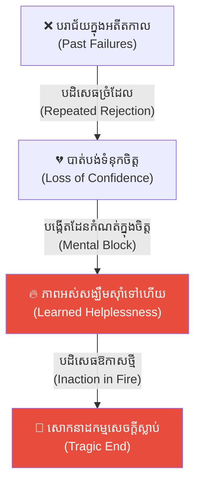
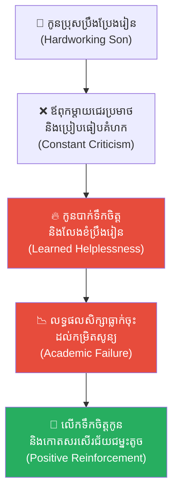
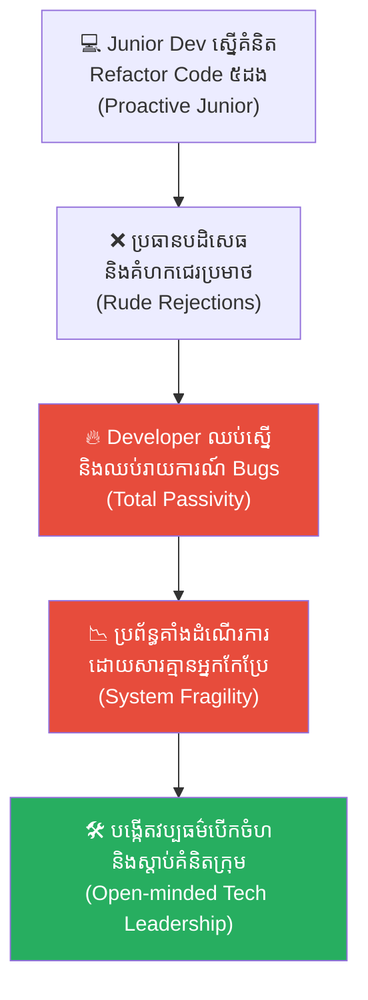
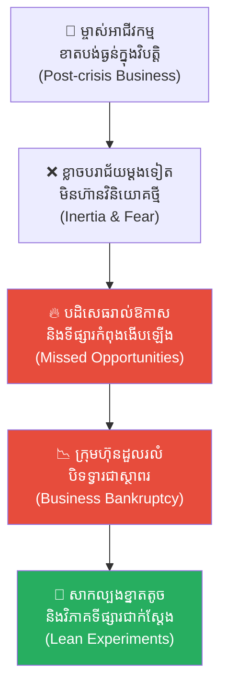
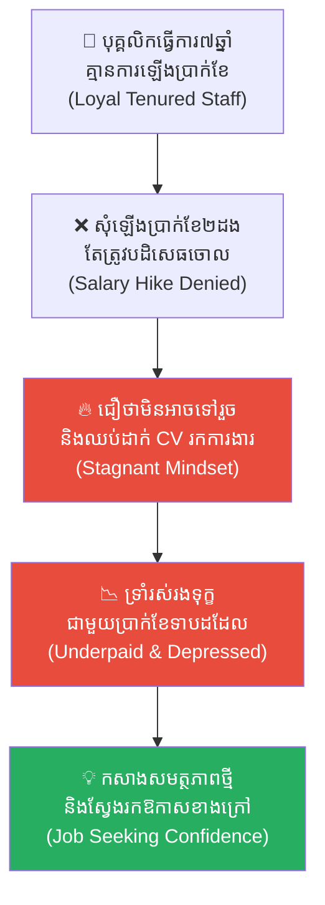
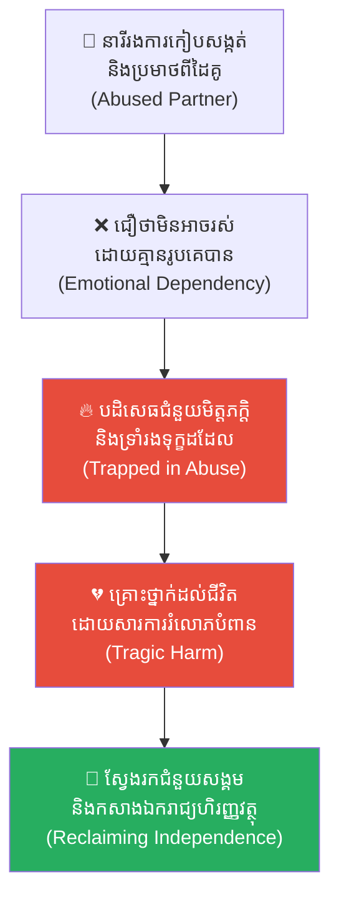
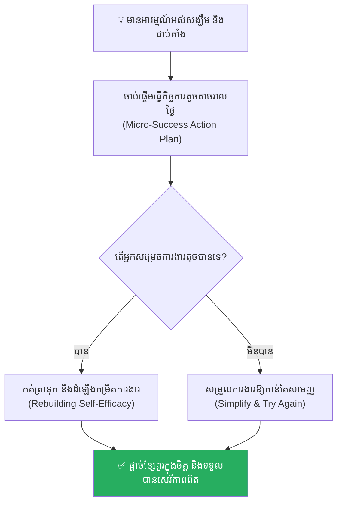

# Learned Helplessness (សត្វដំរី និងខ្សែចំណងមើលមិនឃើញ)៖ របៀបបំបែកទ្រុងផ្លូវចិត្តដែលបង្ខាំងអ្នកឱ្យឈប់បញ្ចេញសកម្មភាព

**Author:** ichamrong  
**Date:** 2026-05-17  
**Tags:** #learned-helplessness #psychology #self-belief #toxic-environment #life-lessons #critical-thinking  
**Category:** Concepts  
**Read Time:** ~15 min  

---

## 📌 មាតិកា (Table of Contents)
- [អន្ទាក់ផ្លូវចិត្ត (The Trap)](#អន្ទាក់ផ្លូវចិត្ត-the-trap)
- [១. រឿងនិទានកូនដំរី និងច្រវាក់ដែក (The Baby Elephant and the Chain)](#1)
  - [សោកនាដកម្មក្នុងភ្នក់ភ្លើង (The Tragedy in the Fire)](#1-1)
- [២. បញ្ហា៖ ភាពអស់សង្ឃឹមដែលបានរៀនសូត្រ (The Issue: Martin Seligman's Psychological Theory)](#2)
- [៣. ឧទាហរណ៍ជាក់ស្តែងក្នុងពិភពពិត (Real World Examples)](#3)
  - [ឧទាហរណ៍ទី ១ — កម្រិតស្រាល (គ្រួសារ)៖ ការរិះគន់ឥតឈប់ឈររបស់ឪពុកម្តាយលើការសិក្សា (The Defeated Child)](#3-1)
  - [ឧទាហរណ៍ទី ២ — កម្រិតមធ្យម (បច្ចេកទេស)៖ Developer ដែលឈប់បញ្ចេញគំនិតដោយសារការដេញចោលរបស់ប្រធាន (The Demotivated Developer)](#3-2)
  - [ឧទាហរណ៍ទី ៣ — កម្រិតមធ្យម (ធុរកិច្ច)៖ អាជីវករដែលលែងហ៊ានសាកល្បងម៉ូដែលថ្មីក្រោយវិបត្តិ (The Post-crisis Inertia)](#3-3)
  - [ឧទាហរណ៍ទី ៤ — កម្រិតមធ្យម (សង្គម/គ្រប់គ្រង)៖ បុគ្គលិកចាស់ដែលឈប់តស៊ូដំឡើងប្រាក់ខែ (The Silent Survivor)](#3-4)
  - [ឧទាហរណ៍ទី ៥ — កម្រិតធ្ងន់ (ទំនាក់ទំនង)៖ ការទ្រាំទ្រក្នុងទំនាក់ទំនងពុលដោយសារទម្លាប់ (The Toxic Relationship Fetter)](#3-5)
- [៤. ដំណោះស្រាយទូទៅ៖ ការកសាង Self-Efficacy និងការបំបែកទ្រុងផ្លូវចិត្ត (The General Solution: Reclaiming Agency)](#4)
- [សេចក្តីសន្និដ្ឋាន (Conclusion)](#conclusion)
- [ឯកសារយោង (References)](#references)
- [Related Posts](#related-posts)

---

## អន្ទាក់ផ្លូវចិត្ត (The Trap)

តើអ្នកធ្លាប់មានអារម្មណ៍ថា ទោះបីជាអ្នកព្យាយាមប្រឹងប្រែងខ្លាំងយ៉ាងណាក៏ដោយ ក៏លទ្ធផលចុងក្រោយនៅតែបរាជ័យ ដែលធ្វើឱ្យអ្នកសម្រេចចិត្តឈប់រើបម្រះ និងព្រមទទួលយកជោគវាសនាដ៏លំបាកលំបិននោះដោយស្ងៀមស្ងាត់ដែរឬទេ?

នេះគឺជា **Learned Helplessness (ភាពអស់សង្ឃឹមដែលបានរៀនសូត្រ)**។ 

វាមិនមែនជាការខ្វះសមត្ថភាពពិតប្រាកដឡើយ ប៉ុន្តែវាគឺជា «ខ្សែពួរដ៏តូចមួយ» ដែលបានចងផ្អោបយ៉ាងតឹងនៅក្នុងផ្នត់គំនិត (Mindset) របស់អ្នក ក្រោយពេលឆ្លងកាត់ការបដិសេធ ឬការខូចខាតច្រំដែលៗក្នុងអតីតកាល។ វាមេរោគផ្លូវចិត្តដ៏សាហាវបំផុតដែលសម្លាប់សមត្ថភាព និងឆន្ទៈតស៊ូរបស់អ្នកទាំងស្រុង ដែលធ្វើឱ្យអ្នកសុខចិត្តឈរមើលជីវិតខ្លួនឯងត្រូវបំផ្លាញក្នុងភ្នក់ភ្លើង ទោះបីជាអ្នកមានកម្លាំងគ្រប់គ្រាន់ក្នុងការរត់ចេញក៏ដោយ។

ដើម្បីយល់ដឹងឱ្យបានគ្រប់ជ្រុងជ្រោយ នេះជាផែនទីបង្ហាញផ្លូវសម្រាប់អត្ថបទនេះ៖
1. **រឿងនិទានកូនដំរី (The Baby Elephant Allegory)** — រឿងរ៉ាវរបស់សត្វដំរីទម្ងន់ ៤ តោន សោកនាដកម្មក្នុងភ្នក់ភ្លើង និងខ្សែពួរតូចមួយដែលមើលមិនឃើញ។
2. **បញ្ហា (The Issue)** — ការពិសោធន៍របស់លោក Martin Seligman និងការវិភាគចិត្តវិទ្យាអំពីការបាត់បង់ទំនុកចិត្តលើខ្លួនឯង។
3. **ឧទាហរណ៍ជាក់ស្តែងក្នុងពិភពពិត (Real World Examples)** — ពិនិត្យមើលឥទ្ធិពលនេះក្នុងកម្រិតគ្រួសារ ការងារបច្ចេកទេស ធុរកិច្ច ការគ្រប់គ្រង និងទំនាក់ទំនងស្នេហា។
4. **ដំណោះស្រាយទូទៅ (The General Solution)** — ការអនុវត្តទ្រឹស្តី Self-Efficacy ដើម្បីផ្តាច់ខ្លួនចេញពីបរិយាកាសពុល និងកសាងជំនឿចិត្តឡើងវិញ។

---

## ១. រឿងនិទានកូនដំរី និងច្រវាក់ដែក (The Baby Elephant and the Chain)

កាលពីព្រេងនាយ មានហ្មដំរីម្នាក់បានយកកូនដំរីដែលទើបនឹងកើត មកចងជើងភ្ជាប់នឹងសសរឈើដ៏រឹងមាំមួយ ដោយប្រើប្រាស់ច្រវាក់ដែកដ៏ធ្ងន់។

កូនដំរីដ៏កម្សត់បានខិតខំប្រឹងប្រែងរើបម្រះ និងទាញផ្តាច់ច្រវាក់នោះដោយប្រើប្រាស់អស់ពីកម្លាំងកាយរបស់វា។ វាខំប្រឹងតស៊ូរហូតដល់រលាត់ដាច់ស្បែកជើង និងហូរក្បាលឈាម ប៉ុន្តែទោះជាយ៉ាងណាក្តី ក៏វានៅតែមិនអាចផ្តាច់ច្រវាក់ដែកនោះបានឡើយ ព្រោះខ្លួនវានៅតូចពេក។ បន្ទាប់ពីឆ្លងកាត់ការឈឺចាប់ និងការបរាជ័យ (Failure) ម្តងហើយម្តងទៀតរាប់មិនអស់ កូនដំរីនោះក៏បានចាប់ផ្តើមចុះចាញ់នឹងព្រហ្មលិខិត ហើយព្រមទទួលស្គាល់ថា វាមិនអាចទម្លុះចំណងនេះបានឡើយ។

ចាប់តាំងពីថ្ងៃនោះមក រាល់ពេលដែលវាឃើញមានខ្សែចងនៅនឹងជើង កូនដំរីតែងតែឈប់រើបម្រះ ហើយទម្លាក់ក្បាលចុះចាញ់ដោយគ្មានការតស៊ូ (Resistance) អ្វីទាំងអស់។

---

### សោកនាដកម្មក្នុងភ្នក់ភ្លើង (The Tragedy in the Fire)

ដប់ឆ្នាំកន្លងផុតទៅ កូនដំរីតូចមួយនោះបានលូតលាស់ក្លាយជាសត្វដំរីដ៏ធំសម្បើម ដែលមានទម្ងន់ជាង ៤ តោន និងអាចប្រើកម្លាំងបុកផ្តួលឡានកុងតឺន័រដ៏ធំមួយបានយ៉ាងងាយស្រួល។ ប៉ុន្តែ អ្វីដែលគួរឲ្យហួសចិត្តនោះគឺ ហ្មដំរីលែងប្រើប្រាស់ច្រវាក់ដែកទៀតហើយ ដោយគាត់គ្រាន់តែយក **ខ្សែពួរតូចមួយ** មកចងជើងវានៅនឹងសសរឈើតូចមួយប៉ុណ្ណោះ។

ថ្ងៃមួយ មានអគ្គិភ័យឆាបេះយ៉ាងសន្ធោសន្ធៅនៅក្នុងតំបន់នោះ។ ទោះបីជាអណ្តាតភ្លើងកំពុងតែរាលដាលខិតជិតមកដល់ ហើយវាមានកម្លាំងរាប់ពាន់ដងដែលអាចផ្តាច់ខ្សែពួរនោះ ដោយគ្រាន់តែរលាស់ជើងបន្តិចក៏ដោយ ក៏វាសុខចិត្តឈររង់ចាំសេចក្តីស្លាប់ដោយភាពភ័យខ្លាច ហើយមិនហ៊ានបោះជំហានដើរចេញសូម្បីតែមួយតឹក។ ជាអកុសល ទីបំផុតវាត្រូវបានស្លាប់បាត់បង់ជីវិតយ៉ាងសង្វេគនៅក្នុងភ្នក់ភ្លើងនោះ។

តាមការពិតទៅ គ្មានច្រវាក់ដែកដ៏រឹងមាំឯណាឡើយមកចងជើងវា ប៉ុន្តែសត្វដំរីដ៏ធំមួយនេះត្រូវបានសម្លាប់ដោយ «ខ្សែពួរដ៏តូចមួយ» ដែលបានចងផ្អោបយ៉ាងតឹងនៅក្នុងផ្នត់គំនិត (Mindset) របស់វា ហើយតែងតែខ្សឹបប្រាប់វាជារៀងរាល់ថ្ងៃថា៖ **«ឯងគ្មានកម្លាំងអាចរើខ្លួនចេញពីចំណងនេះបានឡើយ»**។

---

## ២. បញ្ហា៖ ភាពអស់សង្ឃឹមដែលបានរៀនសូត្រ (The Issue: Martin Seligman's Psychological Theory)

នៅក្នុងវិស័យចិត្តវិទ្យា (Psychology) បាតុភូតនេះត្រូវបានរកឃើញដំបូងដោយលោកបណ្ឌិត **ម៉ាទីន សេលីកម៉ាន់ (Martin Seligman)** តាមរយៈការពិសោធន៍ជាមួយសត្វសុនខ។

គាត់បានរកឃើញថា សត្វដែលឆ្លងកាត់ការឆក់ខ្សែភ្លើងជាច្រើនដងដោយគ្មានផ្លូវរត់គេច (No Control) នឹងចាប់ផ្តើមចុះចាញ់។ លុះពេលក្រោយមក ពេលដែលគេបើកច្រកទ្វារឱ្យវាអាចលោតចេញដើម្បីគេចផុតយ៉ាងងាយស្រួលក៏ដោយ ក៏វានៅតែសុខចិត្តក្រាបដេកទទួលរងការឆក់ និងយំស្រែក ដោយមិនព្រមព្យាយាមលោតចេញឡើយ។

* **ការបាត់បង់ Self-Efficacy (ជំនឿលើសមត្ថភាពខ្លួន):** ជំនឿថាសកម្មភាពរបស់ខ្លួន មិនអាចជះឥទ្ធិពលលើលទ្ធផលចុងក្រោយបានឡើយ។
* **ផ្នត់គំនិតពុល (Toxic Ideology Trap):** ការយល់ឃើញថា «វាជាវាសនា ឬកំហុសរបស់យើង» ទោះបីជាវាជាកំហុសនៃប្រព័ន្ធ ឬបរិស្ថានជុំវិញខ្លួនក៏ដោយ។
* **ការបោះបង់ការតស៊ូ (Inaction):** ការឈប់រើបម្រះ និងព្រមទទួលរងគ្រោះថ្នាក់ដោយស្ងៀមស្ងាត់។

---

## ៣. ឧទាហរណ៍ជាក់ស្តែងក្នុងពិភពពិត

ដើម្បីយល់ដឹងឱ្យកាន់តែស៊ីជម្រៅ ផ្លូវការសិក្សានឹងនាំអ្នកទៅពិនិត្យមើល **ឧទាហរណ៍ចំនួន ៥ កម្រិតខុសៗគ្នា** ក្នុងជីវិតរស់នៅប្រចាំថ្ងៃ៖

---

### ឧទាហរណ៍ទី ១ — កម្រិតស្រាល (គ្រួសារ)៖ ការរិះគន់ឥតឈប់ឈររបស់ឪពុកម្តាយលើការសិក្សា (The Defeated Child)

**ស្ថានភាព៖** កូនប្រុសម្នាក់តែងតែខិតខំប្រឹងប្រែងរៀនសូត្រ តែឪពុកម្តាយតែងតែនិយាយបន្ទោស និងប្រៀបធៀបគាត់ជាមួយកូនអ្នកដទៃថា៖ *«ឯងល្ងង់ណាស់ ទោះបីជាខំយ៉ាងណាក៏រៀនមិនពូកែដូចគេដែរ!»*។

* **ភាគី A (ឪពុកម្តាយ)៖** គិតថានិយាយបែបនេះជួយឱ្យកូនខំប្រឹងរៀន (ការរុញច្រានច្រំដែល)។
* **ភាគី B (កូនប្រុស)៖** កើតមាន Learned Helplessness។ គាត់ជឿជាក់ថានិយាយប្រាកដជាពិតមែន ហើយឈប់ខំប្រឹងប្រែងរៀនសូត្រទាំងស្រុង ដោយបណ្តោយឱ្យលទ្ធផលសិក្សាធ្លាក់ចុះដល់សូន្យ។

**ការពិតដ៏ជូរចត់៖**
ការបំផ្លាញជំនឿចិត្តលើសមត្ថភាពរបស់កូន បង្កើតជាស្នាមរបួសផ្លូវចិត្តដែលចងជើងពួកគេពេញមួយជីវិត។

---

### ឧទាហរណ៍ទី ២ — កម្រិតមធ្យម (បច្ចេកទេស)៖ Developer ដែលឈប់បញ្ចេញគំនិតដោយសារការដេញចោលរបស់ប្រធាន (The Demotivated Developer)

**ស្ថានភាព៖** Junior Developer ព្យាយាមស្នើដំណោះស្រាយ ឬការសរសេរ Refactor Code ដើម្បីកាត់បន្ថយ Technical Debt ដល់ទៅ ៥ ដង ប៉ុន្តែប្រធានរបស់គាត់តែងតែបដិសេធចោលភ្លាមៗដោយពាក្យសម្តីអសុរស។

* **ភាគី A (Developer)៖** ឈប់បញ្ចេញគំនិតថ្មីៗទាំងស្រុង។ ទោះបីជាឃើញប្រព័ន្ធមាន Bug ធំ ឬមានហានិភ័យក៏ដោយ គាត់ក៏មិននិយាយ ឬមិនជួយកែសម្រួលឡើយ (Inaction)។
* **ភាគី B (ក្រុមហ៊ុន)៖** បាត់បង់ឱកាសក្នុងការកែលម្អផលិតផល និងទទួលបានកូដដែលពោរពេញដោយភាពញាប់ញ័រ។

**ការពិតដ៏ជូរចត់៖**
ការបដិសេធឥតឈប់ឈរ បំផ្លាញនូវគំនិតច្នៃប្រឌិត និងការលះបង់របស់ធនធានមនុស្សដ៏ល្អបំផុត។

---

### ឧទាហរណ៍ទី ៣ — កម្រិតមធ្យម (ធុរកិច្ច)៖ អាជីវករដែលលែងហ៊ានសាកល្បងម៉ូដែលថ្មីក្រោយវិបត្តិ (The Post-crisis Inertia)

**ស្ថានភាព៖** ម្ចាស់អាជីវកម្មម្នាក់រងការខាតបង់ថវិកាយ៉ាងធ្ងន់ធ្ងរក្នុងអំឡុងពេលវិបត្តិសេដ្ឋកិច្ចកន្លងមក។ ពេលសេដ្ឋកិច្ចចាប់ផ្តើមងើបឡើងវិញ និងមានឱកាសថ្មីៗជាច្រើន គាត់បដិសេធមិនព្រមបោះទុន ឬសាកល្បងឡើយ។

* **ភាគី A (ម្ចាស់អាជីវកម្ម)៖** គិតថា «ទោះជាធ្វើគម្រោងអ្វីក៏ដោយ ក៏ច្បាស់ជាខាតបង់ដូចមុនដដែល» (ខ្សែពួរតូចមួយក្នុងចិត្ត)។
* **ភាគី B (ទីផ្សារ)៖** គូប្រកួតប្រជែងថ្មីៗបានចូលមកកាន់កាប់ទីផ្សារទាំងអស់ រីឯអាជីវកម្មចាស់របស់គាត់ត្រូវដួលរលំបិទទ្វារជាស្ថាពរ។

**ការពិតដ៏ជូរចត់៖**
ការភ័យខ្លាចអតីតកាល បិទបាំងភ្នែកមិនឱ្យមើលឃើញឱកាសថ្មីៗដែលនៅចំពោះមុខ។

---

### ឧទាហរណ៍ទី ៤ — កម្រិតមធ្យម (សង្គម/គ្រប់គ្រង)៖ បុគ្គលិកចាស់ដែលឈប់តស៊ូដំឡើងប្រាក់ខែ (The Silent Survivor)

**ស្ថានភាព៖** បុគ្គលិកម្នាក់ធ្វើការងារក្នុងតួនាទីដដែលរយៈពេល ៧ ឆ្នាំ ដោយគ្មានការដំឡើងប្រាក់ខែ។ គាត់ព្យាយាមសុំជួបពិភាក្សាដំឡើងប្រាក់ខែ ២ ដង តែត្រូវបានបដិសេធ។

* **ភាគី A (បុគ្គលិក)៖** ជឿថាក្រុមហ៊ុននេះគ្មានផ្លូវដំឡើងឱ្យឡើយ ហើយគាត់ក៏គ្មានសមត្ថភាពទៅរកការងារថ្មីដែរ។ គាត់សុខចិត្តទ្រាំធ្វើការងារដដែលទាំងគ្មានព្រលឹង។
* **ភាគី B (ឱកាសការងារក្រៅ)៖** ក្រុមហ៊ុនដៃគូប្រកួតប្រជែងជាច្រើនកំពុងរើសបុគ្គលិកជំនាញដូចគាត់ ជាមួយនឹងប្រាក់ខែខ្ពស់ជាង ២ ដង តែគាត់មិនហ៊ានសូម្បីតែផ្ញើ CV ទៅសាកល្បង។

**ការពិតដ៏ជូរចត់៖**
ខ្សែពួរនៃការបដិសេធពីក្រុមហ៊ុនចាស់ បានបង្ខាំងគាត់ឱ្យនៅកន្លែងដដែលទាំងឈឺចាប់។

---

### ឧទាហរណ៍ទី ៥ — កម្រិតធ្ងន់ (ទំនាក់ទំនង)៖ ការទ្រាំទ្រក្នុងទំនាក់ទំនងពុលដោយសារទម្លាប់ (The Toxic Relationship Fetter)

**ស្ថានភាព៖** នារីម្នាក់រងការកៀបសង្កត់ ការប្រមាថ និងជួនកាលការរំលោភបំពានពីដៃគូជីវិត។ មិត្តភក្តិព្យាយាមជួយឱ្យនាងចាកចេញ តែនាងបដិសេធ និងត្រឡប់ទៅរកគាត់វិញ។

* **ភាគី A (នារី)៖** ជឿជាក់ថា «បើគ្មានគាត់ ខ្ញុំគ្មានសមត្ថភាពរស់នៅម្នាក់ឯង ឬរកអ្នកស្រឡាញ់ល្អជាងនេះឡើយ» (Learned Helplessness ធ្ន់ធ្ងរ)។
* **ភាគី B (ដៃគូពុល)៖** បន្តការរំលោភបំពានកាន់តែខ្លាំងឡើង រហូតដល់ថ្ងៃមួយដែលនាងរងរបួសធ្ងន់ធ្ងរដល់ជីវិត។

**ការពិតដ៏ជូរចត់៖**
ការចុះចាញ់នឹងព្រហ្មលិខិតសិប្បនិម្មិត បានបំផ្លាញសេរីភាព និងអាយុជីវិតរបស់នាងទាំងស្រុង។

---

## ៤. ដំណោះស្រាយទូទៅ៖ ការកសាង Self-Efficacy និងការបំបែកទ្រុងផ្លូវចិត្ត (The General Solution: Reclaiming Agency)

ដើម្បីបំបែកខ្សែពួរមើលមិនឃើញដែលចងជើងរបស់អ្នក ចូរអនុវត្តជំហានទាំងនេះ៖

### ១. ផ្តាច់ខ្លួនចេញពី «បរិយាកាសពុល» (Change Environment)
ប្រសិនបើអ្នករស់នៅក្នុងកន្លែងដែលផ្តល់តែការបដិសេធ និងការមើលងាយ ចូរប្រញាប់ចាកចេញភ្លាមៗ។ ដូចសត្វដំរី ត្រូវរត់ចេញពីវាលខ្សាច់ដែលឆេះ។ ផ្លាស់ប្តូរការងារ ផ្លាស់ប្តូរមិត្តភក្តិ ឬផ្លាស់ប្តូរទំនាក់ទំនងដែលទាញអ្នកចុះ។

### ២. អនុវត្តវិធីសាស្ត្រ «ជ័យជម្នះតូចៗប្រចាំថ្ងៃ» (Micro-Successes)
កុំព្យាយាមផ្តាច់ខ្សែពួរទម្ងន់ ៤ តោនភ្លាមៗ។ ចូរចាប់ផ្តើមកសាងជំនឿចិត្តឡើងវិញតាមរយៈការសម្រេចបាននូវការងារតូចៗប្រចាំថ្ងៃ (ដូចជាការបត់ភួយឱ្យស្អាត ការរត់ហាត់ប្រាណ ១០ នាទី ឬការអានសៀវភៅ ៥ ទំព័រ)។ ជ័យជម្នះតូចៗទាំងនេះនឹងដាស់ស្មារតីរបស់ខួរក្បាលឡើងវិញថា៖ *«យើងពិតជាអាចគ្រប់គ្រងលទ្ធផលបាន!»*។

### ៣. អនុវត្តផ្នត់គំនិត Optimistic Explanatory Style
នៅពេលជួបប្រទះបរាជ័យ ឈប់និយាយថា៖ *«វាជាកំហុសខ្ញុំពេញមួយជីវិត»*។ ត្រូវនិយាយថា៖ *«នេះគ្រាន់តែជាបញ្ហាបណ្តោះអាសន្ន ក្នុងកាលៈទេសៈជាក់លាក់នេះប៉ុណ្ណោះ។ ខ្ញុំអាចកែប្រែ និងរៀនសូត្រពីវាបាននៅថ្ងៃក្រោយ។»*

---

## សេចក្តីសន្និដ្ឋាន (Conclusion)

> **«សត្វដំរីដ៏ធំសម្បើមបានស្លាប់ក្នុងអណ្តាតភ្លើង មិនមែនមកពីវាគ្មានកម្លាំងផ្តាច់ខ្សែពួរឡើយ។ គឺមកពីវាជឿជាក់ថាយ៉ាងណាក៏មិនអាចផ្តាច់បាន។ កម្លាំងដ៏មហិមាបំផុតរបស់អ្នក ស្ថិតនៅលើសេរីភាពនៃការជ្រើសរើសមិនចុះចាញ់នឹងខ្សែចំណងចាស់របស់អតីតកាល។»**

ចូរកុំធ្វើជាសត្វដំរីដែលលុះជង្គង់ចុះចាញ់នឹងខ្សែពួរតូចមួយឡើយ។ 

ចូររលាស់ជើងរបស់អ្នក រួចដើរចេញពីភ្នក់ភ្លើងពុលទាំងនោះ។

---

## ឯកសារយោង (References)

* **Seligman, M. E. P.** — *Helplessness: On Development, Depression, and Death* (1975). សៀវភៅដំបូងបង្អស់កត់ត្រាការពិសោធន៍ Learned Helplessness។
* **Bandura, A.** — *Self-Efficacy: The Exercise of Control* (1997). ទ្រឹស្តីនៃការកសាងជំនឿចិត្តលើសមត្ថភាពខ្លួនឯង។
* **Dweck, C. S.** — *Mindset: The New Psychology of Success* (2006). ការផ្លាស់ប្តូរផ្នត់គំនិតពី Fixed ទៅ Growth Mindset។

---

## Related Posts

* **[The Illusion of Ease (អ្នកថាមិនដែលធ្វើ អ្នកធ្វើមិនដែលថា)៖ គ្រោះថ្នាក់នៃជំនឿ Dunning-Kruger និងភាពងាយស្រួលសិប្បនិម្មិត](./06-the-illusion-of-ease.md)** — Overcoming overthinking and assumptions.
* **[The Silent Rebellion (ការបះបោរដោយស្ងៀមស្ងាត់)៖ គ្រោះថ្នាក់នៃការរំលោភសេចក្តីថ្លៃថ្នូរ និងការបាត់បង់ភក្តីភាពរបស់មនុស្សស្ងប់ស្ងាត់](./09-the-silent-rebellion.md)** — Active and passive choices under systems of disrespect.
* **[The Hedgehog Dilemma (ចំណោទបញ្ហារបស់សត្វប្រមា)៖ របៀបរក្សាចម្ងាយសមស្របក្នុងទំនាក់ទំនងដោយមិនបង្កើតការឈឺចាប់ឱ្យគ្នា](./08-the-hedgehog-dilemma.md)** — Preserving personal space to cultivate healthy self-belief.
