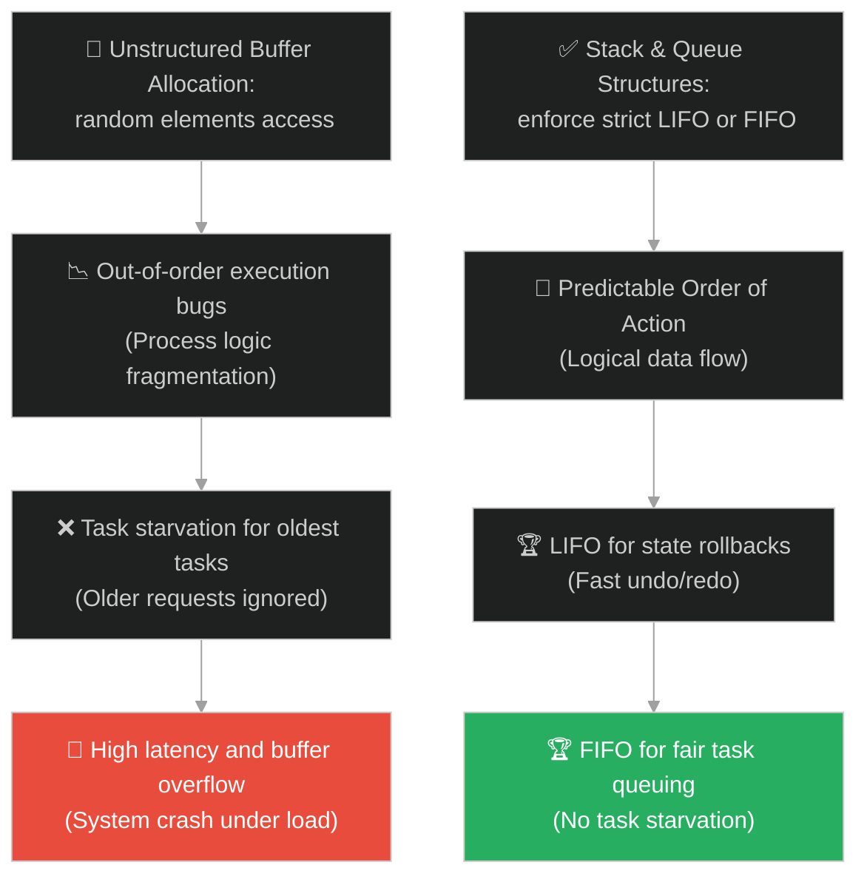
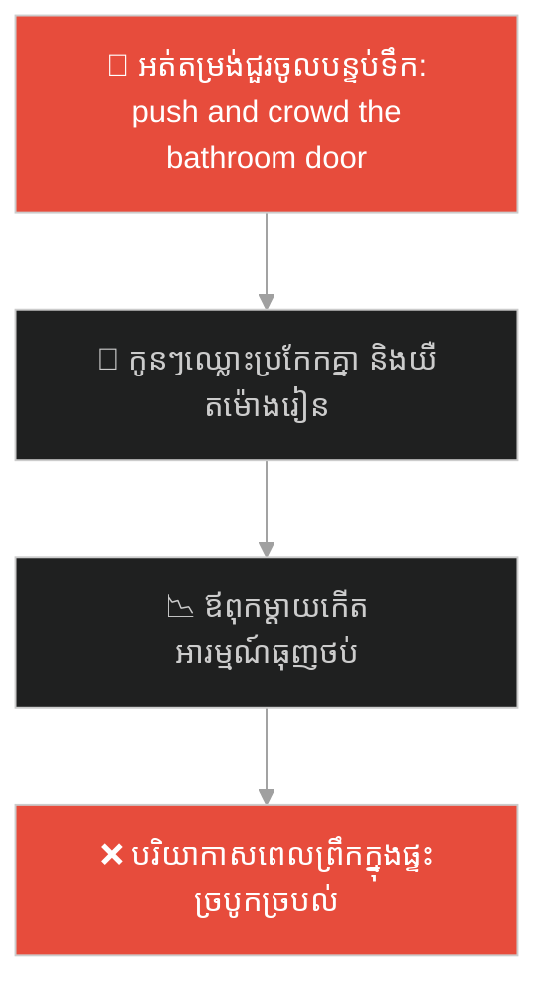
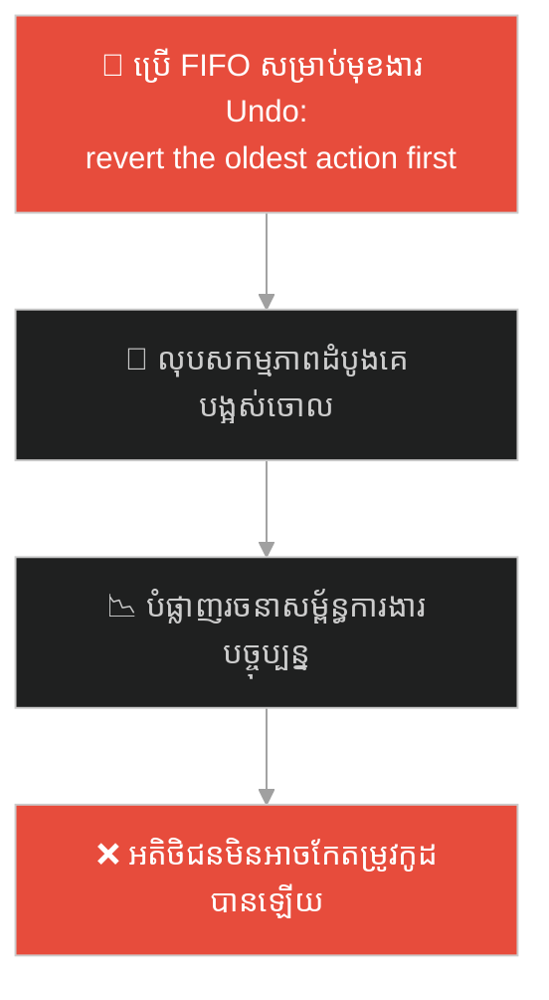
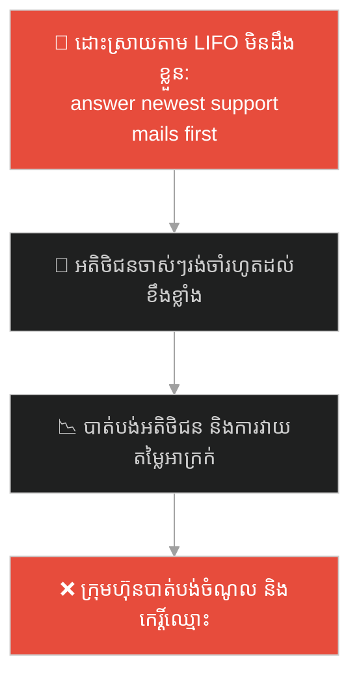
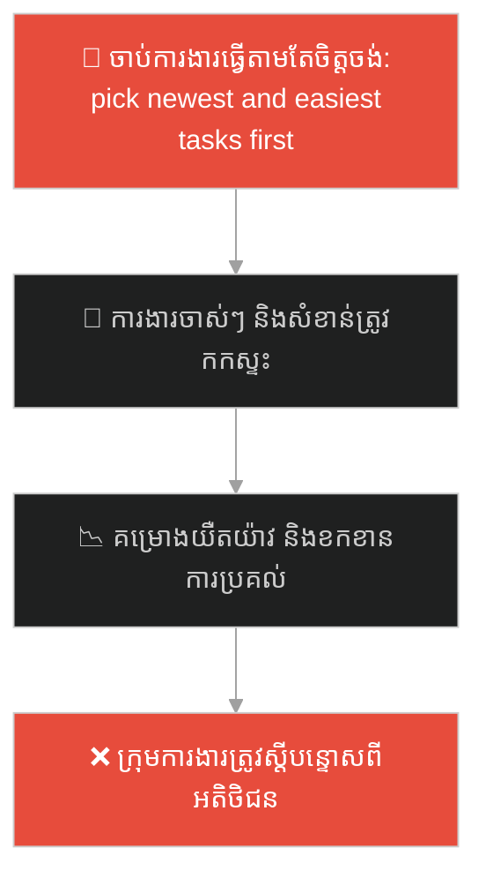
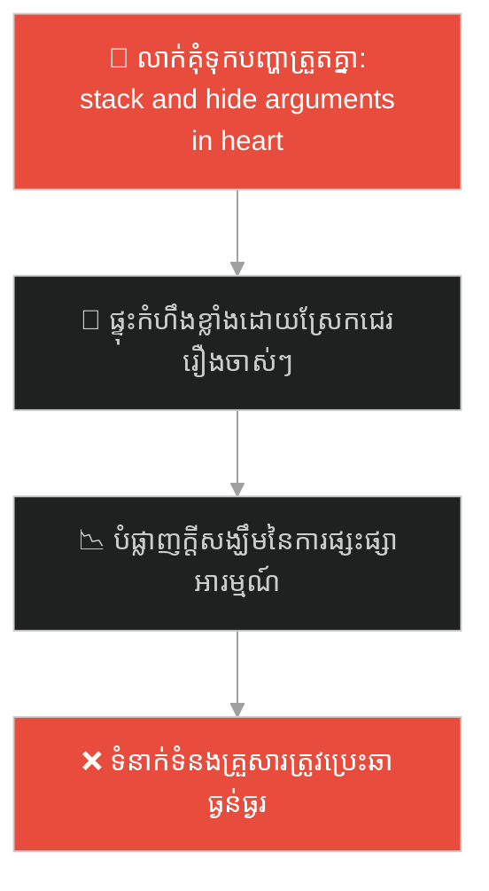
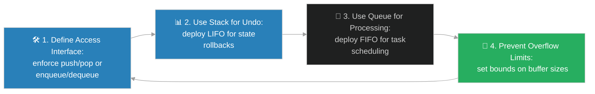

# Stack & Queue Data Structures (រចនាសម្ព័ន្ធទិន្នន័យស្ទែក និងឃ្យូ)៖ គំនរចាន និងជួររង់ចាំ (Stacks & Queues & The Dish Stack and the Ticket Queue)

**Author:** ichamrong  
**Date:** 2026-05-28  
**Tags:** #dsa #data-structures #stacks #queues #parable  
**Category:** Concepts / Parables  
**Read Time:** ~15 min  

---

## 📌 មាតិកា (Table of Contents)
- [អន្ទាក់ផ្លូវចិត្ត (The Trap)](#0)
- [១. រឿងព្រេងនិទាន៖ គំនរចានរបស់អ្នកលាងចាន និងជួរកុម្ម៉ង់អាហារ (The Legend of LIFO Dishes and FIFO Queues)](#1)
  - [យន្តការលាងចាន Last-In First-Out និងការតម្រង់ជួរ First-In First-Out (The LIFO Washing & FIFO Coffee Line Mechanics)](#1-1)
- [២. បញ្ហា៖ ការរៀបចំទិន្នន័យដោយគ្មានក្បួន និងភាពច្របូកច្របល់នៃលំដាប់លំហូរ (The Issue: Unstructured Data Flow and Out-of-Order Execution)](#2)
- [៣. ឧទាហមណ៍ជាក់ស្តែងក្នុងពិភពពិត (Real World Examples)](#3)
  - [ឧទាហរណ៍ទី ១ — កម្រិតស្រាល (គ្រួសារ)៖ គំនរខោអាវបោកគក់ និងជួរប្រើប្រាស់បន្ទប់ទឹក (Laundry Stacking vs Bathroom Waiting Line)](#3-1)
  - [ឧទាហរណ៍ទី ២ — កម្រិតមធ្យម (បច្ចេកទេស)៖ មុខងារ Undo/Redo និងប្រព័ន្ធបោះពុម្ពឯកសារ (Undo-Redo Call Stack vs Printer Spooler Queue)](#3-2)
  - [ឧទាហរណ៍ទី ៣ — កម្រិតមធ្យម (ធុរកិច្ច)៖ ការដោះស្រាយសំបុត្រគាំទ្រអតិថិជន (LIFO Ticket Mismanagement vs FIFO Queue System)](#3-3)
  - [ឧទាហរណ៍ទី ៤ — កម្រិតមធ្យម (សង្គម/គ្រប់គ្រង)៖ ការរៀបចំកិច្ចការតាមចំណង់ផ្ទាល់ខ្លួន vs ជួរ backlog នៃ Kanban (Ad-hoc Task Snatching vs Kanban Backlog Queue)](#3-4)
  - [ឧទាហរណ៍ទី ៥ — កម្រិតធ្ងន់ (ទំនាក់ទំនង)៖ ការលាក់គុំទុកដាក់បញ្ហារួម និងការដោះស្រាយភ្លាមៗ (Emotional Grievance Stacking vs Sequential Conflict Resolution)](#3-5)
- [៤. ដំណោះស្រាយទូទៅ៖ ការជ្រើសរើស និងតុល្យភាពរវាង Stack និង Queue (The General Solution: Selection and Balancing of LIFO & FIFO Structures)](#4)
- [សេចក្តីសន្និដ្ឋាន (Conclusion)](#5)
- [ឯកសារយោង (References)](#6)
- [Related Posts](#7)

---

<a id="0"></a>
## អន្ទាក់ផ្លូវចិត្ត (The Trap)

តើអ្នកធ្លាប់ជួបបញ្ហាដែលលំហូរការងារ ឬការស្នើសុំទិន្នន័យ (Requests) ត្រូវបានដោះស្រាយដោយគ្មានលំដាប់លំដោយច្បាស់លាស់ នាំឱ្យការងារដែលមកក្រោយបង្កការស្ទះដល់ការងារចាស់ ឬការងារដែលមកមុនត្រូវបានគេមើលរំលង និងគាំងចោលជារៀងរហូតដែរឬទេ?

នៅក្នុងការគ្រប់គ្រងលំហូរទិន្នន័យ៖
* **យើងងាយនឹងធ្លាក់ក្នុងអន្ទាក់** នៃការបណ្តោយឱ្យកិច្ចការដែលទើបតែមកដល់ចុងក្រោយគេ ដណ្តើមយកចំណាប់អារម្មណ៍ និងធនធានគណនាភ្លាមៗ (LIFO Trap) ដោយមើលរំលងភាពយុត្តិធម៌នៃលំដាប់លំដោយ "មកមុន ធ្វើមុន" (FIFO) ដែលនាំឱ្យការងារចាស់ៗខ្លះត្រូវរង់ចាំរហូតដល់ផុតកំណត់ (Starvation)។
* **យើងមើលរំលង** ការកំណត់លក្ខខណ្ឌកម្រិតសិទ្ធិចូលដំណើរការ (Access Constraints) លើទិន្នន័យ ដែលជួយរក្សារចនាសម្ព័ន្ធ និងការពារកុំឱ្យមានការច្របូកច្របល់នៃលំហូរកូដ។

ការព្យាយាមដោះស្រាយទិន្នន័យដោយគ្មានការរៀបចំលំដាប់លំដោយជាក់លាក់ ហៅថា **អន្ទាក់ច្របូកច្របល់លំដាប់លំហូរការងារ (Arbitrary Buffer Management Trap)**។

ដើម្បីយល់ដឹងពីរបៀបគ្រប់គ្រងលំដាប់ការងារប្រកបដោយសណ្តាប់ធ្នាប់ នេះជាផែនទីបង្ហាញផ្លូវ៖
1. **រឿងព្រេងនិទាន (The Legend)** — រឿងរ៉ាវរបស់អ្នកលាងចានដែលលាងតែចានខាងលើបង្អស់ និងជួរភ្ញៀវទិញកាហ្វេដែលតម្រូវឱ្យមានយុត្តិធម៌។
2. **បញ្ហា (The Issue)** — ការវិភាគរវាង LIFO (Last-In, First-Out) និង FIFO (First-In, First-Out) ក្នុង OOP និងផលប៉ះពាល់លើ CPU Call Stack និង Task Queue។
3. **ឧទាហមណ៍ជាក់ស្តែងក្នុងពិភពពិត (Real World Examples)** — ពិនិត្យមើលបញ្ហានេះក្នុងកម្រិតគ្រួសារ បច្ចេកវិទ្យា ធុរកិច្ច ការគ្រប់គ្រង និងទំនាក់ទំនង។
4. **ដំណោះស្រាយទូទៅ (The General Solution)** — ការអនុវត្ត Stack និង Queue ឱ្យត្រូវនឹងតម្រូវការប្រព័ន្ធ ដើម្បីធានាស្ថិរភាព និងសណ្តាប់ធ្នាប់។



---

<a id="1"></a>
## ១. រឿងព្រេងនិទាន៖ គំនរចានរបស់អ្នកលាងចាន និងជួរកុម្ម៉ង់អាហារ (The Legend of LIFO Dishes and FIFO Queues)

កាលពីព្រេងនាយ នៅក្នុងភោជនីយដ្ឋានដ៏មមាញឹកមួយកន្លែង មានតំបន់ពីរដែលដំណើរការតាមគោលការណ៍ផ្ទុយគ្នាស្រឡះ៖ ផ្ទះបាយខាងក្រោយ និងបញ្ជរលក់កាហ្វេខាងមុខ។

នៅក្នុងផ្ទះបាយខាងក្រោយ៖
* អ្នករត់តុតែងតែប្រមូលចានកខ្វក់ពីតុអតិថិជន រួចយកមកដាក់ **ត្រួតលើគ្នាជាគំនរខ្ពស់** នៅលើតុលាងចាន។ 
* ចានដែលយកមកដល់មុនគេបង្អស់ (ចានទី១) ស្ថិតនៅបាតក្រោមគេ ចំណែកឯចានដែលទើបតែប្រមូលមកក្រោយគេបំផុត (ចានទី៥) ស្ថិតនៅខាងលើបង្អស់។
* នៅពេលអ្នកលាងចានចាប់ផ្តើមលាង គាត់មិនអាចទាញយកចានពីបាតក្រោមមកលាងមុនបានឡើយ ព្រោះវាអាចធ្វើឱ្យគំនរចានទាំងមូលរលំធ្លាក់បែកខ្ទេចខ្ទី។ ជម្រើសតែមួយគត់គឺគាត់ត្រូវដកចានពីលើបង្អស់មកលាងម្តងមួយៗ។
* ដូច្នេះ ចានដែលមកដល់ **ក្រោយគេបង្អស់** ត្រូវបានយកទៅលាង **មុនគេបង្អស់** (Last In, First Out - LIFO)។ ចំណែកចានទី១ ដែលនៅបាតក្រោម ត្រូវរង់ចាំរហូតដល់ចានលើៗលាងអស់ ទើបមានឱកាសបានលាង។

---

<a id="1-1"></a>
### យន្តការលាងចាន Last-In First-Out និងការតម្រង់ជួរ First-In First-Out (The LIFO Washing & FIFO Coffee Line Mechanics)

ផ្ទុយទៅវិញ នៅបញ្ជរលក់កាហ្វេខាងមុខភោជនីយដ្ឋាន៖
* អតិថិជនឈរតម្រង់ជួរយ៉ាងមានសណ្តាប់ធ្នាប់ដើម្បីទិញភេសជ្ជៈ។
* ភ្ញៀវទីមួយដែលមកដល់តាំងពីព្រលឹម ឈរនៅខាងមុខគេបង្អស់ ចំណែកឯភ្ញៀវដែលទើបតែមកដល់ក្រោយគេ ត្រូវដើរទៅឈរនៅខាងចុងជួរ។
* អ្នកលក់កាហ្វេឆុង និងហុចភេសជ្ជៈជូនភ្ញៀវដែលឈរនៅខាងមុខជួរមុនគេជានិច្ច ព្រោះគាត់មកដល់មុនគេ។
* យន្តការនេះធានាភាពយុត្តិធម៌បំផុត៖ អ្នកដែលមកដល់ **មុនគេ** ត្រូវតែទទួលបានសេវាកម្ម **មុនគេ** (First In, First Out - FIFO)។ ប្រសិនបើនរណាម្នាក់ព្យាយាមលោតចូលកណ្តាលជួរ ឬអ្នកលក់កាហ្វេជ្រើសរើសបម្រើអ្នកមកក្រោយគេមុន វានឹងបង្កើតឱ្យមានជម្លោះ និងភាពច្របូកច្របល់មិនខាន។

ប្រព័ន្ធទាំងពីរនេះតំណាងឱ្យច្បាប់គ្រប់គ្រងលំហូរការងារជាមូលដ្ឋានក្នុងសកលលោក៖ មួយកំណត់ត្រួតពិនិត្យដោយ **លក្ខខណ្ឌសង្កត់ (Constraint of Placement - Stack)** និងមួយទៀតរក្សាដោយ **យុត្តិធម៌នៃពេលវេលា (Fairness of Time - Queue)**។

---

<a id="2"></a>
## ២. បញ្ហា៖ ការរៀបចំទិន្នន័យដោយគ្មានក្បួន និងភាពច្របូកច្របល់នៃលំដាប់លំហូរ (The Issue: Unstructured Data Flow and Out-of-Order Execution)

នៅក្នុងវិស្វកម្មផ្នែកទន់ ការមិនកំណត់លក្ខខណ្ឌ LIFO ឬ FIFO លើបណ្តុំទិន្នន័យបណ្តោះអាសន្ន (Buffers) នាំឱ្យកើតមានបញ្ហាលំដាប់នៃការអនុវត្ត៖

```java
// បើគ្មានយន្តការ Stack ឬ Queue កូដងាយនឹងច្រឡំលំដាប់ប្រតិបត្តិការ
public class TaskBuffer {
    private List<String> tasks = new ArrayList<>();

    public void addTask(String task) {
        tasks.add(task);
    }

    public String getNextTask() {
        // ទាញយកដោយគ្មានក្បួនច្បាស់លាស់ អាចជា LIFO ឬ FIFO នាំឱ្យលំដាប់ការងារខូច
        return tasks.remove(0); // អាចបង្កឱ្យមាន O(N) shifting cost ក្នុង ArrayList
    }
}
```

* **បញ្ហាកិច្ចការចាស់គាំងចោល (Task Starvation)៖** ប្រសិនបើប្រព័ន្ធគ្រប់គ្រងសំបុត្រការងារដំណើរការតាមលក្ខណៈ LIFO ដោយសារតែមាន Request ថ្មីៗហូរចូលឥតឈប់ឈរ នោះ Request ចាស់ៗដែលនៅបាតក្រោមនឹងគ្មានឱកាសត្រូវបានដំណើរការឡើយ (Starvation)។
* **ការខូចទ្រង់ទ្រាយនៃ Call/Execution Flow៖** មុខងារ Undo/Redo ត្រូវការស្គាល់ស្ថានភាពចុងក្រោយគេបង្អស់។ ប្រសិនបើយើងប្រើ FIFO នោះការចុច Undo នឹងទៅលុបសកម្មភាពដំបូងគេបង្អស់ដែលយើងបានធ្វើទៅវិញ ដែលធ្វើឱ្យខូចខាតប្រព័ន្ធទាំងស្រុង។

---

<a id="3"></a>
## ៣. ឧទាហមណ៍ជាក់ស្តែងក្នុងពិភពពិត

---

<a id="3-1"></a>
### ឧទាហរណ៍ទី ១ — កម្រិតស្រាល (គ្រួសារ)៖ គំនរខោអាវបោកគក់ និងជួរប្រើប្រាស់បន្ទប់ទឹក (Laundry Stacking vs Bathroom Waiting Line)

នៅក្នុងផ្ទះមួយ គំនរខោអាវដែលត្រូវបោកត្រូវបានបោះត្រួតលើគ្នាជារៀងរាល់ថ្ងៃ (LIFO Stack)។ អាវដែលបោះចូលចុងក្រោយគេស្ថិតនៅខាងលើបង្អស់ ហើយវានឹងត្រូវបានម្តាយទាញយកទៅបោកមុនគេ ចំណែកអាវដែលនៅបាតក្រោមត្រូវរង់ចាំយូរ។ ផ្ទុយទៅវិញ នៅពេលព្រឹកឡើង សមាជិកគ្រួសារត្រូវតម្រង់ជួរប្រើប្រាស់បន្ទប់ទឹកតាមលំដាប់មកមុនចូលមុន (FIFO Queue) ដើម្បីធានាភាពយុត្តិធម៌ និងមិនឱ្យកូនៗត្រូវយឺតម៉ោងទៅរៀន។



ការបែងចែកលំដាប់ច្បាស់លាស់ជួយឱ្យសកម្មភាពប្រចាំថ្ងៃរបស់គ្រួសារមានសណ្តាប់ធ្នាប់។

---

<a id="3-2"></a>
### ឧទាហរណ៍ទី ២ — កម្រិតមធ្យម (បច្ចេកទេស)៖ មុខងារ Undo/Redo និងប្រព័ន្ធបោះពុម្ពឯកសារ (Undo-Redo Call Stack vs Printer Spooler Queue)

នៅក្នុងកម្មវិធីកុំព្យូទ័រ រាល់ពេលអ្នកចុចគូររូប ឬសរសេរអក្សរ សកម្មភាពនីមួយៗត្រូវបានរុញចូលទៅក្នុង **Undo Stack (LIFO)**។ នៅពេលចុច `Ctrl + Z` កម្មវិធីទាញយកសកម្មភាពចុងក្រោយបង្អស់មកលុបចោលវិញភ្លាមៗ។ ផ្ទុយទៅវិញ នៅក្នុងប្រព័ន្ធបោះពុម្ពឯកសារ (Printer Spooler) ឯកសារដែលចុចបញ្ជា Print មុនគេ ត្រូវតែចេញមកក្រៅមុនគេ តាមរយៈ **Print Queue (FIFO)** ដើម្បីចៀសវាងការច្រឡំ និងលាយឡំឯកសារគ្នារវាងបុគ្គលិកច្រើនរូប។



---

<a id="3-3"></a>
### ឧទាហរណ៍ទី ៣ — កម្រិតមធ្យម (ធុរកិច្ច)៖ ការដោះស្រាយសំបុត្រគាំទ្រអតិថិជន (LIFO Ticket Mismanagement vs FIFO Queue System)

នៅក្នុងក្រុមហ៊ុនផ្តល់សេវាកម្មអតិថិជន ប្រសិនបើប្រព័ន្ធ Support Mailbox មិនត្រូវបានរៀបចំត្រឹមត្រូវ ភ្នាក់ងារគាំទ្រអាចនឹងឆ្លើយតបតែសារដែលទើបតែផ្ញើចូលថ្មីៗនៅខាងលើគេបង្អស់ (LIFO behavior)។ លទ្ធផលគឺ អតិថិជនដែលផ្ញើសំបុត្រមកមុនតាំងពី ៣ ថ្ងៃមុន ត្រូវកកស្ទះនៅបាតក្រោម និងមិនទទួលបានដំណោះស្រាយ។ ក្រុមហ៊ុនត្រូវដំឡើង **Ticketing Queue (FIFO)** ដើម្បីធានាថារាល់សំណើទាំងអស់ត្រូវបានដោះស្រាយតាមលំដាប់លំដោយយុត្តិធម៌ និងមិនមានអតិថិជនណាម្នាក់ត្រូវបានគេបោះបង់ចោល។



---

<a id="3-4"></a>
### ឧទាហរណ៍ទី ៤ — កម្រិតមធ្យម (សង្គម/គ្រប់គ្រង)៖ ការរៀបចំកិច្ចការតាមចំណង់ផ្ទាល់ខ្លួន vs ជួរ backlog នៃ Kanban (Ad-hoc Task Snatching vs Kanban Backlog Queue)

នៅក្នុងការគ្រប់គ្រងក្រុមការងារ ប្រសិនបើគ្មានប្រព័ន្ធច្បាស់លាស់ សមាជិកក្រុមអាចនឹងចាប់ធ្វើការងារណាដែលទើបតែធ្លាក់មកចុងក្រោយគេ ឬការងារដែលពួកគេចូលចិត្តមុនគេ (Ad-hoc LIFO behavior)។ នេះធ្វើឱ្យការងារសំខាន់ៗដែលមកមុន ត្រូវពន្យារពេល និងយឺតម៉ោងប្រគល់គម្រោង។ ក្រុមការងារត្រូវប្រើប្រាស់ **Kanban Backlog Queue (FIFO with priority)** ដើម្បីធានាថាកិច្ចការត្រូវបានទាញយកទៅអនុវត្តតាមលំដាប់អាទិភាព និងលំដាប់ថ្ងៃកំណត់ច្បាស់លាស់។



---

<a id="3-5"></a>
### ឧទាហរណ៍ទី ៥ — កម្រិតធ្ងន់ (ទំនាក់ទំនង)៖ ការលាក់គុំទុកដាក់បញ្ហារួម និងការដោះស្រាយភ្លាមៗ (Emotional Grievance Stacking vs Sequential Conflict Resolution)

នៅក្នុងទំនាក់ទំនងប្តីប្រពន្ធ ប្រសិនបើដៃគូម្ខាងតែងតែលាក់គុំទុកដាក់បញ្ហាមិនពេញចិត្តតូចៗត្រួតលើគ្នាក្នុងចិត្ត (Grievance Stacking - LIFO setup) ដោយមិននិយាយចេញមកក្រៅ នោះនៅពេលមានរឿងឈ្លោះប្រកែកគ្នាត្រឹមតែបន្តិចបន្តួច ពួកគេនឹងទាញយកបញ្ហាទាំងអស់ដែលបានគុំទុកមកស្រែកដាក់គ្នាច្របូកច្របល់ (LIFO emotional dumping)។ ផ្ទុយទៅវិញ គូស្វាមីភរិយាដែលយល់ចិត្តគ្នា តែងតែដោះស្រាយបញ្ហានីមួយៗភ្លាមៗតាមលំដាប់លំដោយកាលបរិច្ឆេទ (FIFO Conflict Resolution) ធានាគ្មានការដក់ជាប់របួសផ្លូវចិត្តចាស់ៗឡើយ។



---

<a id="4"></a>
## ៤. ដំណោះស្រាយទូទៅ៖ ការជ្រើសរើស និងតុល្យភាពរវាង Stack និង Queue (The General Solution: Selection and Balancing of LIFO & FIFO Structures)

ដើម្បីគ្រប់គ្រងលំហូរទិន្នន័យឱ្យមានសណ្តាប់ធ្នាប់ និងស្ថិរភាពខ្ពស់ យើងត្រូវអនុវត្តរចនាសម្ព័ន្ធទិន្នន័យឱ្យចំគោលដៅ៖



ជំហាននៃការអនុវត្ត៖
1. **កំណត់លក្ខខណ្ឌចូលដំណើរការ (Access Constraint Verification)៖** ធានាថាកូដមិនអាចលូកដៃទៅយក ឬកែប្រែទិន្នន័យនៅចំកណ្តាលបានដោយសេរីឡើយ។ រាល់សកម្មភាពត្រូវតែឆ្លងកាត់ចំណុចគ្រប់គ្រងច្បាស់លាស់ (`push`/`pop` សម្រាប់ Stack និង `enqueue`/`dequeue` សម្រាប់ Queue)។
2. **ប្រើប្រាស់ Stack សម្រាប់សកម្មភាពយោងត្រលប់ (LIFO Contexts)៖** អនុវត្ត Stack នៅពេលដែលសកម្មភាពចុងក្រោយបង្អស់មានសារៈសំខាន់បំផុត ដូចជាការត្រលប់ក្រោយ (Undo), ការចងចាំប្រវត្តិស្វែងរក (History Stacks), ឬការគ្រប់គ្រងលំហូរអនុវត្តកូដ (Call Stacks)។
3. **ប្រើប្រាស់ Queue សម្រាប់សកម្មភាពលំដាប់ការងារ (FIFO Contexts)៖** អនុវត្ត Queue នៅពេលដែលតម្រូវការយុត្តិធម៌ពេលវេលាជាចម្បង ដូចជាការផ្ញើសាររវាង microservices (Message Brokers), ការបែងចែកពេលវេលា CPU (CPU Scheduling), ឬការគ្រប់គ្រងលំហូរចរាចរណ៍ទិន្នន័យ។
4. **កំណត់ទំហំអតិបរមា (Bounded Buffers)៖** ជៀសវាងការអនុញ្ញាតឱ្យ Stack ឬ Queue លូតលាស់គ្មានដែនកំណត់ ដែលអាចនាំឱ្យមានការបែកបាក់ទំហំ Memory (StackOverflow Error ឬ Out of Memory) ដោយកំណត់ទំហំអតិបរមា និងអនុវត្តយុទ្ធសាស្ត្រទាត់ចោល (Eviction Policy) នៅពេលវាពេញ។

---

## 🐇 ធ្លាក់ចូលក្នុងរន្ធទន្សាយ (Enter the Rabbit Hole)

ដើម្បីស្វែងយល់ពីរបៀបដែលឱសថការីដ៏ល្បីល្បាញ ឬអ្នកសរសេរប្រព័ន្ធទិន្នន័យ បានចាត់ចែងរៀបចំឱសថរាប់ពាន់មុខនៅក្នុងទូដាក់ថ្នាំ ដែលអនុញ្ញាតឱ្យពួកគេអាចស្វែងរក និងដកយកថ្នាំនីមួយៗបានភ្លាមៗក្នុងរយៈពេល 0 វិនាទី ដោយប្រើប្រាស់ "ស្លាកលេខកូដសកល" (Hash Tables and Hash Functions) សូមបន្តដំណើរទៅកាន់៖

* 🚀 **[ចាប់ផ្តើមដំណើររុករក (Start the Journey) ➔ Hash Tables and Collision Resolutions](./101-the-apothecarys-cabinet.md)**

---

<a id="5"></a>
## សេចក្តីសន្និដ្ឋាន (Conclusion)

> **«ស្ថិរភាពនៃប្រព័ន្ធ សម្រេចបានទៅតាមរយៈការរៀបចំលំដាប់ការងារដ៏ត្រឹមត្រូវ និងយុត្តិធម៌»**

ការប្រើប្រាស់ Stack និង Queue ជួយឱ្យប្រព័ន្ធរបស់អ្នកមានលំដាប់លំដោយច្បាស់លាស់ លុបបំបាត់បញ្ហាទិន្នន័យកកស្ទះ ធានាបាននូវភាពងាយស្រួលក្នុងការគ្រប់គ្រងលំហូរការងារ និងផ្តល់នូវល្បឿនប្រតិបត្តិការ O(1) ដ៏មានស្ថិរភាព និងប្រសិទ្ធភាពខ្ពស់បំផុត។

---

<a id="6"></a>
## ឯកសារយោង (References)

* **Knuth, D. E.** — *The Art of Computer Programming, Volume 1: Fundamental Algorithms* (1997). Information structures, stacks, queues, and sequential allocation mechanics.
* **Cormen, T. H., Leiserson, C. E., Rivest, R. L., & Stein, C.** — *Introduction to Algorithms* (2009). Abstract data types, queueing mechanisms, and complexity bounds.

---

<a id="7"></a>
## Related Posts

* [[DSA: Stacks & Queues](../dsa/01-linear-structures.md#3-stacks--queues-order-with-constraints)] — ការពន្យល់លម្អិត និងស៊ីជម្រៅអំពី Stacks និង Queues ក្នុង DSA។
* [[Linked List Data Structure & The Spy's Treasure Hunt](./99-the-spys-treasure-hunt.md)] — របៀបប្រើប្រាស់ Linked Lists ដើម្បីបង្កើត Stacks និង Queues ដែលមានទំហំឌីណាមិកបត់បែនបាន។
