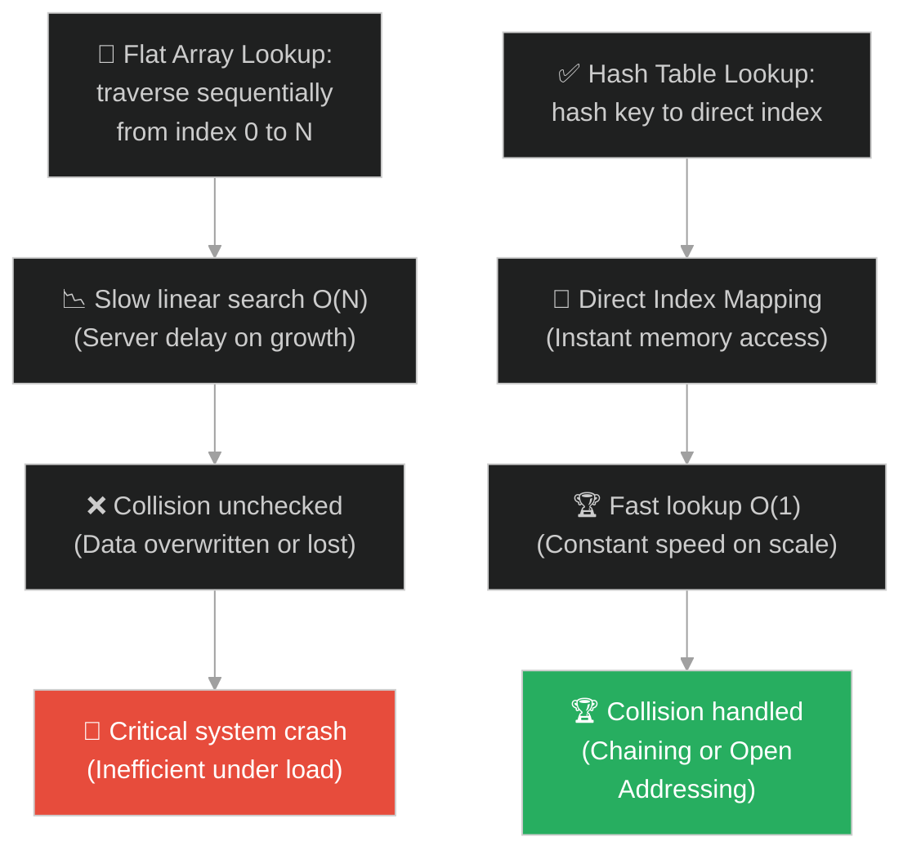
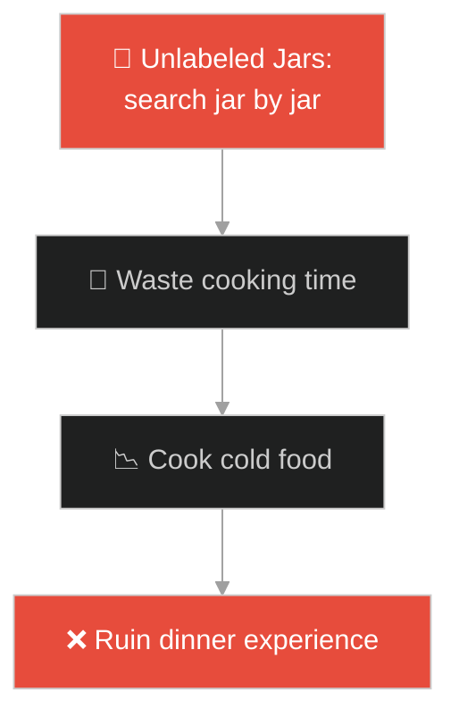
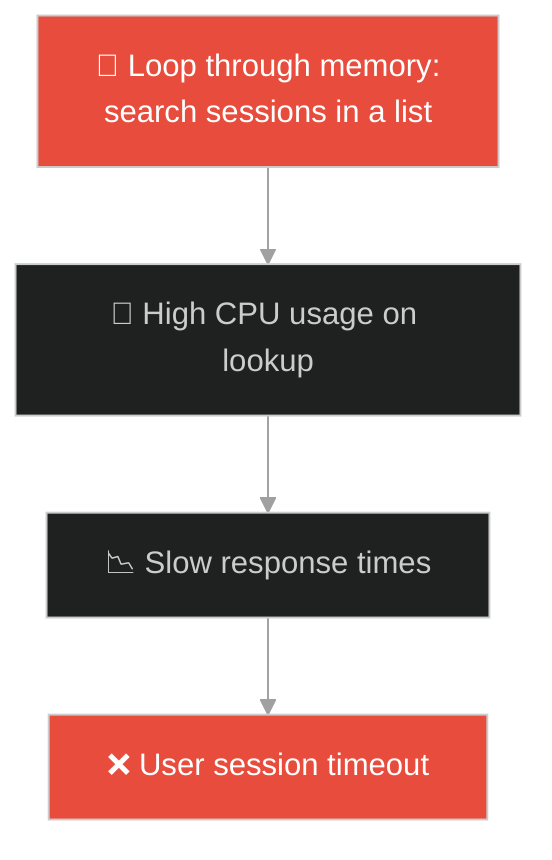
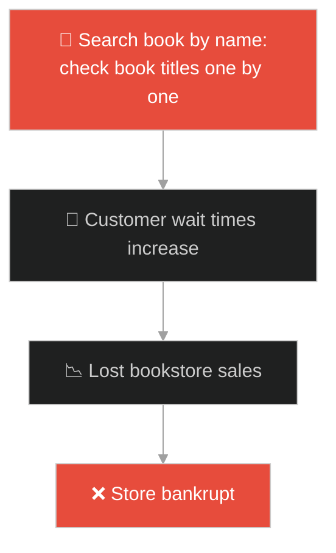
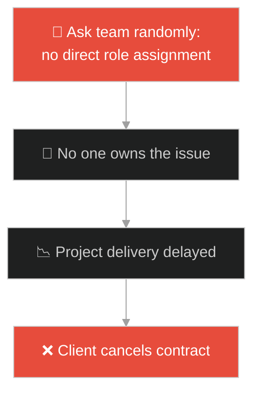
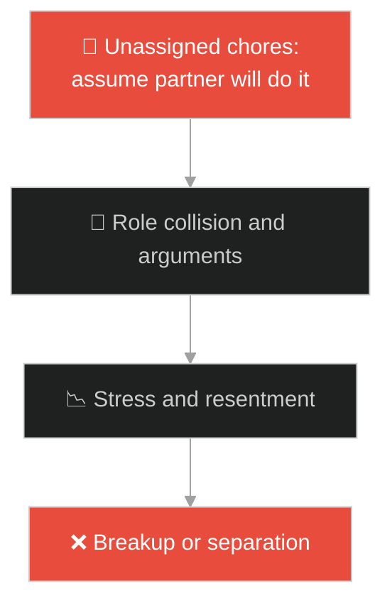
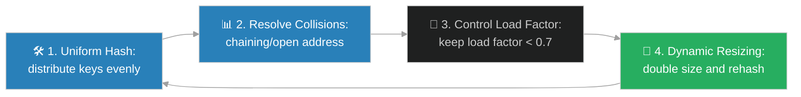

# Hash Table Data Structure (រចនាសម្ព័ន្ធទិន្នន័យហាសតារាង)៖ ទូថ្នាំវេទមន្តរបស់គ្រូពេទ្យ (Hash Tables & The Apothecary's Cabinet)

**Author:** ichamrong  
**Date:** 2026-05-28  
**Tags:** #dsa #data-structures #hash-tables #memory #parable  
**Category:** Concepts / Parables  
**Read Time:** ~15 min  

---

## 📌 មាតិកា (Table of Contents)
- [អន្ទាក់ផ្លូវចិត្ត (The Trap)](#0)
- [១. រឿងព្រេងនិទាន៖ ឱសថការី និងទូថ្នាំ ១០០០ ថត (The Legend of the Apothecary's Cabinet)](#1)
  - [រូបមន្តវេទមន្ត និងការដោះស្រាយបញ្ហាថតជាន់គ្នា (The Magic Hash Function & Collision Chaining)](#1-1)
- [២. បញ្ហា៖ ដែនកំណត់នៃការស្វែងរកលីនេអ៊ែរ និងការបុកគ្នានៃអាសយដ្ឋានទិន្នន័យ (The Issue: Limitations of Linear Search and Address Collisions)](#2)
- [៣. ឧទាហមណ៍ជាក់ស្តែងក្នុងពិភពពិត (Real World Examples)](#3)
  - [ឧទាហរណ៍ទី ១ — កម្រិតស្រាល (គ្រួសារ)៖ ការរៀបចំគ្រឿងទេសតាមពណ៌ស្លាក (Spice Jar Labeling)](#3-1)
  - [ឧទាហរណ៍ទី ២ — កម្រិតមធ្យម (បច្ចេកទេស)៖ ការរក្សាទុក cache ក្នុង memory (Key-Value Caching in Memory)](#3-2)
  - [ឧទាហរណ៍ទី ៣ — កម្រិតមធ្យម (ធុរកិច្ច)៖ កាតាឡុកសៀវភៅតាមរយៈលេខ ISBN (ISBN Cataloging)](#3-3)
  - [ឧទាហរណ៍ទី ៤ — កម្រិតមធ្យម (សង្គម/គ្រប់គ្រង)៖ ការបែងចែកតួនាទីដោះស្រាយបញ្ហា (Role-based Problem Solving)](#3-4)
  - [ឧទាហរណ៍ទី ៥ — កម្រិតធ្ងន់ (ទំនាក់ទំនង)៖ ការបែងចែកភារកិច្ចក្នុងផ្ទះច្បាស់លាស់ដើម្បីចៀសវាងជម្លោះ (Clear Task Boundaries)](#3-5)
- [៤. ដំណោះស្រាយទូទៅ៖ ការរចនា Hash Functions និងយុទ្ធសាស្ត្រដោះស្រាយ Collision (The General Solution: Hash Function Design and Collision Resolution Strategy)](#4)
- [សេចក្តីសន្និដ្ឋាន (Conclusion)](#5)
- [ឯកសារយោង (References)](#6)
- [Related Posts](#7)

---

<a id="0"></a>
## អន្ទាក់ផ្លូវចិត្ត (The Trap)

តើអ្នកធ្លាប់ជួបបញ្ហាដែលត្រូវស្វែងរកទិន្នន័យជាក់លាក់ណាមួយពីក្នុងបញ្ជីដ៏ធំ ហើយអ្នកត្រូវរត់ Loop ពិនិត្យមើលធាតុនីមួយៗតាំងពីដើមដល់ចប់ (Linear Scan) ធ្វើឱ្យកម្មវិធីដំណើរការយឺតយ៉ាវ O(N) ដែរឬទេ?

នៅក្នុងការគ្រប់គ្រង និងស្វែងរកទិន្នន័យ៖
* **យើងងាយនឹងធ្លាក់ក្នុងអន្ទាក់** នៃការប្រើប្រាស់ Flat Array ឬ List ធម្មតាដើម្បីស្វែងរកទិន្នន័យដែលមានចំនួនច្រើន ដែលនាំឱ្យកុំព្យូទ័រត្រូវចំណាយកម្លាំង CPU ស្កេន O(N) គ្រប់ពេល។
* **យើងមើលរំលង** យន្តការ "ការបំប្លែងកូដអាសយដ្ឋាន (Hashing)" ដែលជួយឱ្យយើងអាចលោតទៅយកទិន្នន័យបានភ្លាមៗ O(1) ដោយមិនខ្វល់ពីចំនួនទិន្នន័យក្នុងប្រព័ន្ធឡើយ។

ការព្យាយាមប្រើប្រាស់ការស្វែងរកលីនេអ៊ែរសម្រាប់ទិន្នន័យកើនឡើងជានិច្ច ហៅថា **អន្ទាក់ស្វែងរកលីនេអ៊ែរលើទិន្នន័យទំហំធំ (Linear Scanning Trap)**។

ដើម្បីយល់ដឹងពីរបៀបស្វែងរកទិន្នន័យលឿន O(1) នេះជាផែនទីបង្ហាញផ្លូវ៖
1. **រឿងព្រេងនិទាន (The Legend)** — រឿងរ៉ាវរបស់ឱសថការីដែលត្រូវស្វែងរកថ្នាំសង្គ្រោះបន្ទាន់ភ្លាមៗពីក្នុងទូ ១០០០ ថត ដោយប្រើរូបមន្តគណនាអាសយដ្ឋាន។
2. **បញ្ហា (The Issue)** — ការវិភាគ Hash Functions, Load Factors និងបច្ចេកទេសដោះស្រាយ Collision ដូចជា Chaining និង Open Addressing។
3. **ឧទាហមណ៍ជាក់ស្តែងក្នុងពិភពពិត (Real World Examples)** — ការអនុវត្តគំនិតនេះក្នុងកម្រិតគ្រួសារ បច្ចេកវិទ្យា ធុរកិច្ច ការគ្រប់គ្រង និងទំនាក់ទំនង។
4. **ដំណោះស្រាយទូទៅ (The General Solution)** — ជំហានជាក់ស្តែងក្នុងការអនុវត្ត Hash Table ក្នុងវិស្វកម្មប្រព័ន្ធ។



---

<a id="1"></a>
## ១. រឿងព្រេងនិទាន៖ ឱសថការី និងទូថ្នាំ ១០០០ ថត (The Legend of the Apothecary's Cabinet)

កាលពីព្រេងនាយ មានឱសថការីម្នាក់មានកេរ្តិ៍ឈ្មោះល្បីល្បាញខាងផ្សំថ្នាំសង្គ្រោះជីវិតមនុស្ស។ នៅក្នុងហាងរបស់គាត់ មានទូក្បាច់បុរាណមួយមានថតដាក់ថ្នាំចំនួន ១០០០ ថត។

ដំបូងឡើយ៖
* ឱសថការីដាក់ថ្នាំចូលក្នុងថតនីមួយៗតាមតែចិត្តចង់ ដោយគ្មានសណ្តាប់ធ្នាប់ច្បាស់លាស់។
* រាល់ពេលមានអ្នកជំងឺមកសុំទិញថ្នាំ "យិនស៊ិន" គាត់ត្រូវដើរអូសថតបើកមើលម្តងមួយៗ តាំងពីថតទី១ ដល់ថតទី ៩៩ ទើបបានជួប។
* ការស្វែងរកបែបនេះ ហៅថា **ការរាវរកលីនេអ៊ែរ (Linear Search)**។ ពេលខ្លះ អ្នកជំងឺសង្គ្រោះបន្ទាន់ត្រូវបាត់បង់ជីវិតមុនពេលគ្រូពេទ្យរកថ្នាំឃើញ ព្រោះវាចំណាយពេលយូរពេក O(N)។

---

<a id="1-1"></a>
### រូបមន្តវេទមន្ត និងការដោះស្រាយបញ្ហាថតជាន់គ្នា (The Magic Hash Function & Collision Chaining)

ដើម្បីដោះស្រាយបញ្ហានេះ ឱសថការីបានបង្កើត **រូបមន្តវេទមន្ត (The Hash Function)**៖
* គាត់បង្កើតក្បួនគណនាតួអក្សរនៃឈ្មោះថ្នាំ ឱ្យទៅជាលេខចន្លោះពី ០ ដល់ ៩៩៩។
* ឧទាហរណ៍ ឈ្មោះថ្នាំ `"Ginseng"` គណនាតាមរូបមន្តទៅឃើញលេខ `"៤២"`។ គាត់ក៏យកថ្នាំ Ginseng ទៅទុកក្នុងថតលេខ ៤២ តែម្តង។
* ពេលត្រូវការ Ginseng លើកក្រោយ គាត់គ្រាន់តែគណនាឈ្មោះតាមក្បួនដដែល រួចដើរទៅបើកថតលេខ ៤២ ភ្លាមៗ (ល្បឿនលឿន O(1))។

ប៉ុន្តែបញ្ហាថ្មីមួយទៀតបានកើតឡើង៖
* ថ្ងៃមួយ គាត់ចង់រក្សាទុកថ្នាំថ្មីមួយឈ្មោះ `"Ginger"`។ ពេលគាត់យកឈ្មោះ `"Ginger"` ទៅគណនាតាមរូបមន្ត បែរជាចេញលេខ `"៤២"` ដូចគ្នា (ហៅថា **Address Collision**)។
* ដើម្បីកុំឱ្យជាន់គ្នា ឱសថការីមិនបានបោះចោលថ្នាំចាស់នោះទេ គាត់បានយកថង់ថ្នាំ Ginger ចងភ្ជាប់ទៅនឹងថង់ Ginseng នៅក្នុងថតលេខ ៤២ នោះតែម្តង (ហៅថា **Separate Chaining** តាមរយៈ Linked List)។
* ពេលគាត់បើកថតលេខ ៤២ គាត់នឹងឃើញថង់ទាំងពីរ រួចគ្រាន់តែអានឈ្មោះស្លាកដើម្បីជ្រើសរើសថ្នាំដែលត្រឹមត្រូវជាការស្រេច។

---

<a id="2"></a>
## ២. បញ្ហា៖ ដែនកំណត់នៃការស្វែងរកលីនេអ៊ែរ និងការបុកគ្នានៃអាសយដ្ឋានទិន្នន័យ (The Issue: Limitations of Linear Search and Address Collisions)

នៅក្នុងការសរសេរកម្មវិធី OOP ភាពជំពាក់ជំពិននេះកើតឡើងនៅពេលយើងស្វែងរកទិន្នន័យពីក្នុង List ដោយប្រើ loop ស្កេន៖

```java
// វិធីស្វែងរកដែលប្រើប្រាស់ O(N) Time Complexity
public Element findElement(String key, List<Element> list) {
    for (Element el : list) {
        if (el.getKey().equals(key)) {
            return el; // ត្រូវ Loop ស្កេនគ្រប់ធាតុ
        }
    }
    return null;
}
```

* **ការស្វែងរក O(N) យឺតយ៉ាវ៖** ប្រសិនបើទិន្នន័យកើនដល់ ១លានធាតុ នោះ loop នឹងរត់រហូតដល់ ១លានដង ដែលធ្វើឱ្យ CPU ឡើងកម្តៅខ្លាំង និងពន្យារពេលឆ្លើយតបរបស់ប្រព័ន្ធ (Response Latency)។
* **ការប៉ះទង្គិចគ្នា (Collision)៖** នៅពេលយើងប្រើប្រាស់ Hash Table ជួនកាល Keys ពីរផ្សេងគ្នាអាចមាន Hash Code ដូចគ្នា។ បើគ្មានយុទ្ធសាស្ត្រដោះស្រាយ Collision ត្រឹមត្រូវទេ ទិន្នន័យចាស់នឹងត្រូវជាន់ពីលើ (Data Overwrite) ឬបាត់បង់ដោយមិនដឹងខ្លួន។

**Hash Table** និង **Collision Resolution** ដោះស្រាយបញ្ហានេះបានយ៉ាងល្អ ដោយប្រើប្រាស់គណិតវិទ្យានៃ Hash Function ដើម្បីបំប្លែង Key ទៅជា Array Index ផ្ទាល់ខ្លួន នាំមកនូវល្បឿនស្វែងរក O(1) ជានិច្ច។

---

<a id="3"></a>
## ៣. ឧទាហមណ៍ជាក់ស្តែងក្នុងពិភពពិត

---

<a id="3-1"></a>
### ឧទាហរណ៍ទី ១ — កម្រិតស្រាល (គ្រួសារ)៖ ការរៀបចំគ្រឿងទេសតាមពណ៌ស្លាក (Spice Jar Labeling)

នៅក្នុងផ្ទះបាយ បើគ្រឿងទេសទាំងអស់ត្រូវដាក់ចូលក្នុងប្រអប់ច្របូកច្របូកគ្នា នោះអ្នកម្តាយត្រូវលើកដបនីមួយៗមកមើលរាល់ពេលចម្អិនអាហារ។ ដើម្បីដោះស្រាយ គាត់បានបិទស្លាកពណ៌តាមប្រភេទ៖ ពណ៌ក្រហមសម្រាប់គ្រឿងហឹរ ពណ៌ខៀវសម្រាប់គ្រឿងផ្អែម។ ពេលចម្អិនអាហារ គាត់គ្រាន់តែក្រឡេកមើលពណ៌ រួចទាញយកគ្រឿងទេសដែលត្រូវការពិតប្រាកដភ្លាមៗ។



---

<a id="3-2"></a>
### ឧទាហរណ៍ទី ២ — កម្រិតមធ្យម (បច្ចេកទេស)៖ ការរក្សាទុក cache ក្នុង memory (Key-Value Caching in Memory)

នៅក្នុងការអភិវឌ្ឍ Web APIs ប្រព័ន្ធតែងតែប្រើប្រាស់ Redis ឬ Memory Cache ដើម្បីផ្ទុក Session របស់ User។ ជំនួសឱ្យការ query ទៅកាន់ Database រាល់ពេលដែលអ្នកប្រើប្រាស់ស្នើសុំទិន្នន័យ (Database Query Cost) ប្រព័ន្ធគណនា Session ID របស់ User រួចទាញយកទិន្នន័យពី RAM ភ្លាមៗ O(1) តាមរយៈ HashMap ជួយឱ្យ Web ដើរលឿនដូចរន្ទះ។



---

<a id="3-3"></a>
### ឧទាហរណ៍ទី ៣ — កម្រិតមធ្យម (ធុរកិច្ច)៖ កាតាឡុកសៀវភៅតាមរយៈលេខ ISBN (ISBN Cataloging)

នៅក្នុងបណ្ណាល័យ ឬហាងលក់សៀវភៅធំៗ សៀវភៅរាប់ម៉ឺនក្បាលមិនត្រូវបានរក្សាទុកដោយគ្មានលំនាំនោះទេ។ បណ្ណារក្សប្រើប្រាស់ប្រព័ន្ធលេខ ISBN ដើម្បីកំណត់ទីតាំងសៀវភៅ។ លេខ ISBN ដើរតួជា Key ដែលបំប្លែងទៅជាលេខកូដធ្នើរ និងប្រអប់ជាក់លាក់។ ពេលអតិថិជនសួររកសៀវភៅ បុគ្គលិកគ្រាន់តែវាយលេខ ISBN រួចដើរទៅយកសៀវភៅនៅធ្នើរដែលបានបង្ហាញភ្លាមៗ។



---

<a id="3-4"></a>
### ឧទាហរណ៍ទី ៤ — កម្រិតមធ្យម (សង្គម/គ្រប់គ្រង)៖ ការបែងចែកតួនាទីដោះស្រាយបញ្ហា (Role-based Problem Solving)

នៅក្នុងការគ្រប់គ្រងក្រុមការងារ ពេលមានបញ្ហាបច្ចេកទេសកើតឡើង ប្រសិនបើអ្នកគ្រប់គ្រងផ្ញើ Email សួរទៅកាន់សមាជិកទាំងអស់ដោយគ្មានការបែងចែកតួនាទី នោះនឹងគ្មាននរណាម្នាក់ដោះស្រាយឡើយ ព្រោះម្នាក់ៗគិតថាអ្នកផ្សេងនឹងធ្វើវា (Responsibility Diffusion)។ ការចាត់តាំងឱ្យមានអ្នកទទួលខុសត្រូវតាមជំនាញជាក់លាក់ (Direct role assignment) ដូចជាការចាត់ចែងបញ្ហា Server ទៅឱ្យ DevOps ផ្ទាល់ ជួយឱ្យបញ្ហាត្រូវបានដោះស្រាយភ្លាមៗ។



---

<a id="3-5"></a>
### ឧទាហរណ៍ទី ៥ — កម្រិតធ្ងន់ (ទំនាក់ទំនង)៖ ការបែងចែកភារកិច្ចក្នុងផ្ទះច្បាស់លាស់ដើម្បីចៀសវាងជម្លោះ (Clear Task Boundaries)

នៅក្នុងជីវិតអាពាហ៍ពិពាហ៍ ការឈ្លោះប្រកែកគ្នាភាគច្រើនកើតចេញពីរឿងកំប៉ិកកំប៉ុកដូចជា "អ្នកណាលាងចាន អ្នកណាត្រូវបោសផ្ទះ"។ នៅពេលការងារផ្ទះមិនត្រូវបានចាត់ចែងច្បាស់លាស់ វាបង្កើតជាជម្លោះ (Collision)។ គូស្នេហ៍ដែលវៃឆ្លាត ព្រមព្រៀងគ្នាបែងចែកកាតព្វកិច្ចច្បាស់លាស់៖ ប្តីលាងចាន ប្រពន្ធធ្វើម្ហូប។ ការបែងចែកនេះលុបបំបាត់ការប៉ះទង្គិច និងជួយរក្សាសុភមង្គលគ្រួសារ។



---

<a id="4"></a>
## ៤. ដំណោះស្រាយទូទៅ៖ ការរចនា Hash Functions និងយុទ្ធសាស្ត្រដោះស្រាយ Collision (The General Solution: Hash Function Design and Collision Resolution Strategy)

ដើម្បីរក្សាបាននូវល្បឿនស្វែងរក O(1) របស់ Hash Table និងចៀសវាងការខាតបង់ថាមពលគណនាលើ Collisions យើងត្រូវអនុវត្តយុទ្ធសាស្ត្ររចនាច្បាស់លាស់៖



ជំហាននៃការអនុវត្ត៖
1. **រចនា Hash Function ឱ្យបានល្អ (Uniform Distribution)៖** ធានាថាម៉ាស៊ីនបំប្លែងកូដ បែងចែកទិន្នន័យទៅកាន់រាល់ Index ទាំងអស់ស្មើៗគ្នា ដើម្បីកាត់បន្ថយការកើតមាន Collision ជាអប្បបរមា។
2. **ជ្រើសរើសយុទ្ធសាស្ត្រដោះស្រាយ Collision ឱ្យត្រូវនឹងតម្រូវការ៖**
   * **Separate Chaining:** ប្រើ Linked List ដើម្បីចងភ្ជាប់ទិន្នន័យដែលជាន់គ្នា (ល្អបំផុតសម្រាប់ករណីទិន្នន័យមានការបញ្ចូល/លុបច្រើន)។
   * **Open Addressing (Linear/Quadratic Probing)៖** ស្វែងរកថតទំនេរដែលនៅក្បែរនោះដើម្បីដាក់ទិន្នន័យ (ល្អសម្រាប់ករណីរក្សាទុកកន្លែង Memory ឱ្យណែន)។
3. **ត្រួតពិនិត្យកម្រិតផ្ទុក (Load Factor Control)៖** គណនាកម្រិតណែនរបស់ Hash Table $\alpha = \frac{N}{M}$ (ចំនួនទិន្នន័យចែកនឹងចំនួនថតសរុប)។ ធានាថាកម្រិតផ្ទុកមិនឱ្យហួសពី ០.៧ ឡើយ ដើម្បីរក្សាបាននូវល្បឿន O(1) ជានិច្ច។
4. **ពង្រីកទំហំស្វ័យប្រវត្ត (Dynamic Resizing & Rehashing)៖** នៅពេលកម្រិតផ្ទុកលើសពីកំណត់ ប្រព័ន្ធត្រូវបង្កើនទំហំ Array សារជាថ្មី (Capacity * 2) រួចយកទិន្នន័យទាំងអស់មក Rehash គណនាអាសយដ្ឋានថ្មីឡើងវិញ ដើម្បីធានាស្ថិរភាព និងល្បឿនស្វែងរកលឿនបំផុត។

---

## 🐇 ធ្លាក់ចូលក្នុងរន្ធទន្សាយ (Enter the Rabbit Hole)

ដើម្បីស្វែងយល់ពីរបៀបដែលរាជវង្សានុវង្សដ៏អស្ចារ្យ ឬប្រព័ន្ធទិន្នន័យថតឯកសារ បានរៀបចំរចនាសម្ព័ន្ធព័ត៌មានជាថ្នាក់ៗបន្តបន្ទាប់គ្នា (Trees and Tries) ដែលអនុញ្ញាតឱ្យប្រព័ន្ធអាចស្វែងរក និងទាញយកទិន្នន័យតាមរយៈបុព្វបទ (Prefix) ឬទំនាក់ទំនងមេ-កូន (Hierarchies) ប្រកបដោយប្រសិទ្ធភាពខ្ពស់បំផុត សូមបន្តដំណើរទៅកាន់៖

* 🚀 **[ចាប់ផ្តើមដំណើររុករក (Start the Journey) ➔ Trees, Tries, and Hierarchical Indexing](./102-the-family-tree-of-kings.md)**

---

<a id="5"></a>
## សេចក្តីសន្និដ្ឋាន (Conclusion)

> **«កម្លាំងគណិតវិទ្យានៃការបំប្លែងកូដ អាចបំផ្លាញរាល់ភាពយឺតយ៉ាវនៃការដើររុករកទិន្នន័យ»**

ការប្រើប្រាស់ Hash Table ជួយបំប្លែងរាល់សំណួរស្វែងរកទិន្នន័យឱ្យទៅជាការលោត math គណនាអាសយដ្ឋានភ្លាមៗ O(1) ធានាបាននូវការសន្សំសំចៃធនធាន CPU លុបបំបាត់ការពន្យារពេល និងផ្តល់នូវស្ថិរភាពខ្ពស់បំផុតសម្រាប់ប្រព័ន្ធរបស់អ្នក។

---

<a id="6"></a>
## ឯកសារយោង (References)

* **Knuth, D. E.** — *The Art of Computer Programming, Volume 3: Sorting and Searching* (1998). Hashing algorithms, collision resolution, and load factor computations.
* **Cormen, T. H., Leiserson, C. E., Rivest, R. L., & Stein, C.** — *Introduction to Algorithms* (2009). Hash tables, chaining methods, open addressing, and universal hashing.

---

<a id="7"></a>
## Related Posts

* [[DSA: Hash Tables](../dsa/02-non-linear-structures.md#1-hash-tables-o1-or-a-lie)] — ការពន្យល់លម្អិត និងស៊ីជម្រៅអំពី Hash Tables ក្នុង DSA។
* [[Array Data Structure & The Cinema Seats](./98-the-cinema-seats.md)] — การស្វែងយល់ពីរបៀបដែល Arrays ដើរតួជាគ្រឹះផ្ទុកទិន្នន័យសម្រាប់ Hash Tables។
