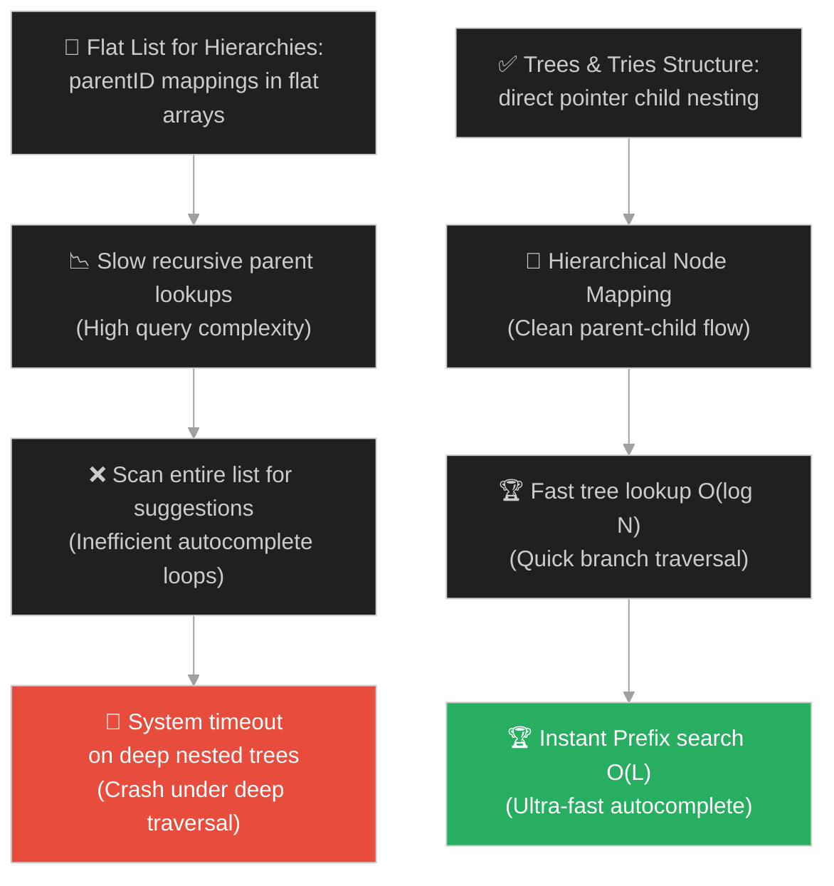
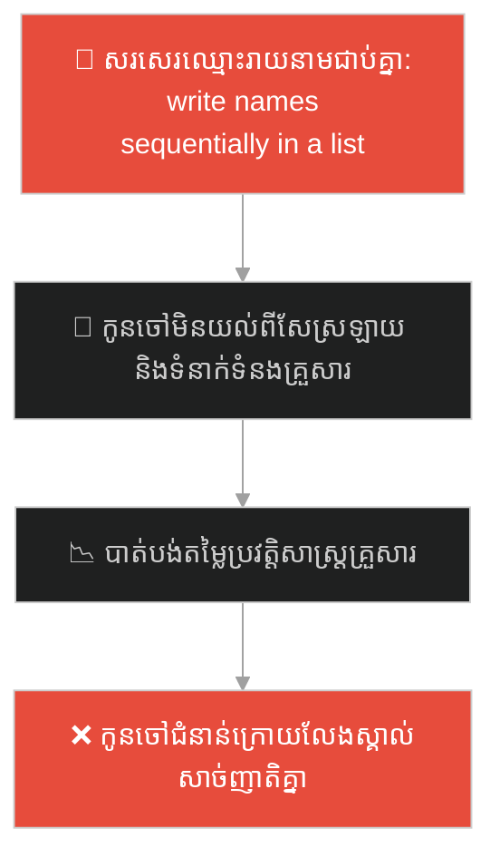
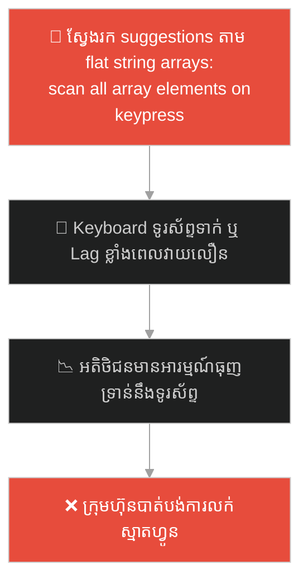
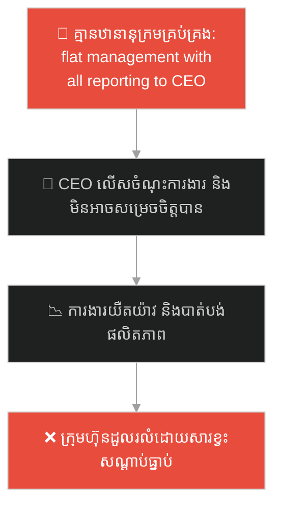
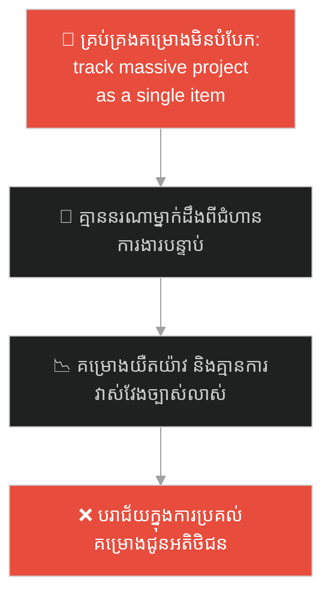
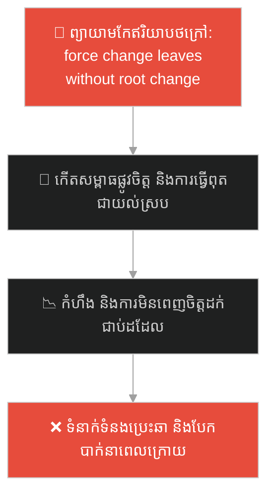
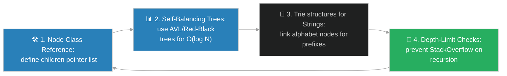

# Tree & Trie Data Structures (រចនាសម្ព័ន្ធទិន្នន័យមែកធាង និងទ្រី)៖ មែកធាងរាជវង្សានុវង្ស (Trees & Tries & The Family Tree of Kings)

**Author:** ichamrong  
**Date:** 2026-05-28  
**Tags:** #dsa #data-structures #trees #tries #parable  
**Category:** Concepts / Parables  
**Read Time:** ~15 min  

---

## 📌 មាតិកា (Table of Contents)
- [អន្ទាក់ផ្លូវចិត្ត (The Trap)](#0)
- [១. រឿងព្រេងនិទាន៖ រជ្ជកាលរាជវង្ស និងមែកធាងឋានានុក្រម (The Legend of the Royal Dynasty and Hierarchical Trees)](#1)
  - [ប្រព័ន្ធស្វែងរកពាក្យដោយស្វ័យប្រវត្តិតាមបុព្វបទអក្សរ (The Prefix Auto-complete Trie System)](#1-1)
- [២. បញ្ហា៖ ដែនកំណត់នៃរចនាសម្ព័ន្ធលីនេអ៊ែរ និងភាពច្របូកច្របល់នៃទំនាក់ទំនងស្មុគស្មាញ (The Issue: Limitations of Linear Formats and High-Complexity Traversal)](#2)
- [៣. ឧទាហមណ៍ជាក់ស្តែងក្នុងពិភពពិត (Real World Examples)](#3)
  - [ឧទាហរណ៍ទី ១ — កម្រិតស្រាល (គ្រួសារ)៖ ការរៀបចំខ្សែស្រឡាយគ្រួសារបន្តគ្នា (Generational Family Ancestry Trees)](#3-1)
  - [ឧទាហរណ៍ទី ២ — កម្រិតមធ្យម (បច្ចេកទេស)៖ រចនាសម្ព័ន្ធថតឯកសារ និងប្រព័ន្ធបំពេញពាក្យស្វ័យប្រវត្តិ (File System Folders and Search Autocomplete Tries)](#3-2)
  - [ឧទាហរណ៍ទី ៣ — កម្រិតមធ្យម (ធុរកិច្ច)៖ រចនាសម្ព័ន្ធគ្រប់គ្រងការងាររបស់ក្រុមហ៊ុន (Corporate Organizational Hierarchy)](#3-3)
  - [ឧទាហរណ៍ទី ៤ — កម្រិតមធ្យម (សង្គម/គ្រប់គ្រង)៖ ការបំបែកគម្រោងជាលំដាប់លំដោយ (Work Breakdown Structure - WBS)](#3-4)
  - [ឧទាហរណ៍ទី ៥ — កម្រិតធ្ងន់ (ទំនាក់ទំនង)៖ គ្រឹះនៃតម្លៃស្នូល និងការសម្តែងឥរិយាបថ (Core Values and Behavioral Application Tree)](#3-5)
- [៤. ដំណោះស្រាយទូទៅ៖ ការអនុវត្ត Trees & Tries ក្នុងវិស្វកម្មប្រព័ន្ធ (The General Solution: Tree & Trie Implementations in System Engineering)](#4)
- [សេចក្តីសន្និដ្ឋាន (Conclusion)](#5)
- [ឯកសារយោង (References)](#6)
- [Related Posts](#7)

---

<a id="0"></a>
## អន្ទាក់ផ្លូវចិត្ត (The Trap)

តើអ្នកធ្លាប់ជួបបញ្ហាដែលត្រូវរៀបចំរក្សាទុកទិន្នន័យដែលមានទំនាក់ទំនងមេ-កូន ឬឋានានុក្រមស្មុគស្មាញ (Parent-Child Relationships) ហើយអ្នកបានព្យាយាមបង្ខំវាឱ្យស្ថិតក្នុងទម្រង់តារាងលីនេអ៊ែរ (Linear Tables, Flat Lists) ធ្វើឱ្យអ្នកជួបការលំបាកក្នុងការគ្រប់គ្រង និងស្វែងរកទិន្នន័យដែរឬទេ?

នៅក្នុងការរៀបចំទិន្នន័យ៖
* **យើងងាយនឹងធ្លាក់ក្នុងអន្ទាក់** នៃការប្រើប្រាស់តារាងផ្ទះល្វែង (Flat Data Tables) សម្រាប់រៀបចំទិន្នន័យដែលមានទំនាក់ទំនងជាថ្នាក់ៗ ដែលនាំឱ្យកើតមានភាពជំពាក់ជំពិនគ្នាក្នុងកូដ (Structural Inefficiency) និងការសរសេរកូដស្កេនទិន្នន័យយឺតយ៉ាវ O(N)。
* **យើងមើលរំលង** យន្តការ "តភ្ជាប់មែកធាង (Node Pointer Linking)" និងការចែករំលែកតួអក្សររួម (Trie Prefix Sharing) ដែលជួយដោះស្រាយបញ្ហាស្វែងរក និងបំពេញពាក្យបានក្នុងល្បឿនលឿនដូចផ្លេកបន្ទោរ O(L) (ល្បឿនស្មើនឹងប្រវែងពាក្យស្វែងរក)។

ការព្យាយាមរៀបចំទិន្នន័យឋានានុក្រមក្នុងទម្រង់ Flat Array ហៅថា **អន្ទាក់រៀបចំទិន្នន័យឋានានុក្រមជាតារាងផ្ទះល្វែង (Flat Hierarchical Data Representation Trap)**។

ដើម្បីយល់ដឹងពីរបៀបគ្រប់គ្រងទំនាក់ទំនងឋានានុក្រមប្រកបដោយសណ្តាប់ធ្នាប់ នេះជាផែនទីបង្ហាញផ្លូវ៖
1. **រឿងព្រេងនិទាន (The Legend)** — រឿងរ៉ាវរបស់រាជវង្សដែលមិនអាចសរសេរជួរអក្សរបាន ត្រូវប្រើមែកធាង និងល្បែងស្វែងរកពាក្យបំពេញពាក្យស្វ័យប្រវត្តិរបស់ចៅហ្វាយនាយក្រុង។
2. **បញ្ហា (The Issue)** — ការវិភាគ Binary Search Trees (BST), Tries (Prefix Trees) និងការគណនា Time/Space Complexities ក្នុង OOP។
3. **ឧទាហមណ៍ជាក់ស្តែងក្នុងពិភពពិត (Real World Examples)** — ពិនិត្យមើលបញ្ហានេះក្នុងកម្រិតគ្រួសារ បច្ចេកវិទ្យា ធុរកិច្ច ការគ្រប់គ្រង និងទំនាក់ទំនង។
4. **ដំណោះស្រាយទូទៅ (The General Solution)** — ការអនុវត្តមែកធាង និងទ្រី សម្រាប់ការរចនា File Systems, Autocomplete, និង Router Matching។



---

<a id="1"></a>
## ១. រឿងព្រេងនិទាន៖ រជ្ជកាលរាជវង្ស និងមែកធាងឋានានុក្រម (The Legend of the Royal Dynasty and Hierarchical Trees)

កាលពីព្រេងនាយ នៅក្នុងនគរដ៏រុងរឿងមួយ ព្រះរាជាចង់កត់ត្រាខ្សែស្រឡាយរាជវង្សានុវង្សដើម្បីបន្សល់ទុកជាប្រវត្តិសាស្ត្រ និងបញ្ជាក់ពីសិទ្ធិឡើងគ្រងរាជ្យរបស់បុត្រាបុត្រីជំនាន់ក្រោយ។

ដំបូងឡើយ៖
* វិស្វកររដ្ឋបាលបានព្យាយាមសរសេរឈ្មោះសមាជិករាជវង្សទាំងអស់ជារបៀបតម្រង់ជួរគ្នាជាបញ្ជីវែងអន្លាយ (Flat List / Array)។
* ប៉ុន្តែបញ្ជីនេះមិនបានបង្ហាញពី "ឋានៈ" និង "ខ្សែស្រឡាយ" ឡើយ។ គ្មាននរណាម្នាក់ដឹងថា បុត្រាអង្គណាជាកូនរបស់ព្រះមហេសីអង្គណា ឬចៅអង្គណាមានសិទ្ធិឡើងគ្រងរាជ្យបន្តមុនគេ (No Hierarchical View)។
* ដើម្បីរក្សាសណ្តាប់ធ្នាប់ ព្រះរាជាបានបញ្ជាឱ្យគូរជា **មែកធាងរាជវង្ស (The Family Tree)**៖
  * ព្រះរាជាស្ថិតនៅកំពូលមែកធាង (Root Node)។
  * ព្រះរាជបុត្រទាំងឡាយជាមែកធាងបន្ទាប់ (Child Nodes)។
  * ព្រះរាជចៅដែលគ្មានបុត្របន្ត ស្ថិតនៅខាងចុងបង្អស់ (Leaf Nodes)។
* រចនាសម្ព័ន្ធនេះជួយឱ្យរាល់សមាជិកទាំងអស់មើលឃើញលំដាប់ថ្នាក់រាជវង្សភ្លាមៗ ងាយស្រួលដោះស្រាយវិវាទអំណាច និងមានសណ្តាប់ធ្នាប់ខ្ពស់។

---

<a id="1-1"></a>
### ប្រព័ន្ធស្វែងរកពាក្យដោយស្វ័យប្រវត្តិតាមបុព្វបទអក្សរ (The Prefix Auto-complete Trie System)

នៅក្នុងទីក្រុងដដែលនោះ មានការិយាល័យប្រៃសណីយ៍ដ៏មមាញឹកមួយ ដែលមានបញ្ជីឈ្មោះទីក្រុង និងភូមិរាប់ម៉ឺនឈ្មោះ។ បុគ្គលិកប្រៃសណីយ៍ពិបាកស្វែងរកឈ្មោះភូមិយ៉ាងខ្លាំង ព្រោះត្រូវដើរអានបញ្ជីរាយនាមតាំងពីដើមដល់ចប់ (Linear Scanning)។

ចៅហ្វាយនាយក្រុងដ៏វៃឆ្លាត បានសាងសង់ **ទូរក្សាទុកមែកធាងអក្សរ (The Trie Cabinet / Prefix Tree)**៖
* គាត់មិនរក្សាទុកពាក្យទាំងមូលក្នុងប្រអប់តែមួយទេ។ គាត់បំបែកវាជាតួអក្សរតម្រៀបបន្តគ្នា៖
  * ឫសទទេ (Root) ចង្អុលទៅតួអក្សរដំបូង (ឧទាហរណ៍ `C`)។
  * អក្សរ `C` ចង្អុលទៅមែកអក្សរបន្ទាប់ `A`។
  * អក្សរ `A` បែកចេញជាពីរមែកគឺ `T` (បង្កើតបានជាពាក្យ CAT) និង `R` (បង្កើតបានជាពាក្យ CAR)។
* ឥឡូវនេះ ពេលបុគ្គលិកសរសេរតួអក្សរផ្ដើម `"C-A"` ពួកគេគ្រាន់តែដើរតាមផ្លូវមែកធាង `C -> A` រួចមើលទៅមុខភ្លាមៗ ពួកគេឃើញចម្លើយដែលអាចកើតមានតែ ២ ប៉ុណ្ណោះគឺ `CAT` និង `CAR` (Autocomplete O(L) speed)។
* ពួកគេលែងខាតពេលអានឈ្មោះរាប់ម៉ឺនទៀតហើយ។ ប្រព័ន្ធបកប្រែអក្សរដើរលឿនដូចរន្ទះ និងជួយសម្រួលការងារដឹកជញ្ជូនទូទាំងនគរ។

---

<a id="2"></a>
## ២. បញ្ហា៖ ដែនកំណត់នៃរចនាសម្ព័ន្ធលីនេអ៊ែរ និងភាពច្របូកច្របល់នៃទំនាក់ទំនងស្មុគស្មាញ (The Issue: Limitations of Linear Formats and High-Complexity Traversal)

នៅក្នុងការសរសេរកម្មវិធី OOP ភាពជំពាក់ជំពិននេះកើតឡើងនៅពេលយើងព្យាយាមបង្កើត File System ឬ Organization Chart ដោយប្រើ ArrayList នៃ Object ដែលមាន `parentID`៖

```java
// កូដដែលគ្មាន Tree Node Reference គឺត្រូវ Loop រាវរក parent រាល់ព្រឹក
public class FlatNode {
    private String id;
    private String parentId; // ចង្អុលទៅ parentID តែមិនមែនជា object reference ឡើយ
    
    // រាល់ពេលចង់រកកូនៗទាំងអស់ ត្រូវ Loop O(N) លើបញ្ជីសរុប
}
```

* **ការស្វែងរក recursive យឺតខ្លាំង (Traverse Cost O(N))៖** រាល់ពេលចង់បង្ហាញរចនាសម្ព័ន្ធ Folders ម្តងៗ កុំព្យូទ័រត្រូវសរសេរ Nested Loops ស្វែងរក `parentId` ពីក្នុង Array ធំ ដែលធ្វើឱ្យម៉ាស៊ីនដំណើរការយឺតយ៉ាវ និងគាំងពេល Folder មានច្រើនកម្រិត។
* **បញ្ហាស្វែងរកពាក្យយឺត (Slow Autocomplete)៖** បើប្រព័ន្ធព្យាយាមស្វែងរកពាក្យ suggestions ពីក្នុង List នៃពាក្យ ១ លានម៉ាត់ដោយប្រើ `string.startsWith()` វានឹងត្រូវរត់ Loop ១ លានដង ដែលធ្វើឱ្យ keyboard អតិថិជនវាយអក្សរទាក់ៗ (UI Lag)។

**Tree Data Structure** ដោះស្រាយបញ្ហានេះដោយប្រើ Node Objects ដែលផ្ទុក Array នៃ child references ផ្ទាល់ខ្លួន (`List<Node> children`)។ 

**Trie (Prefix Tree) Data Structure** ដោះស្រាយបញ្ហា autocomplete ដោយឱ្យ Node នីមួយៗតំណាងឱ្យតួអក្សរមួយ និងផ្ទុក Array នៃ Child Nodes ចំនួន ២៦ ធាតុ (តំណាងឱ្យអក្សរ a-z)។ ការស្វែងរកពាក្យគឺគ្រាន់តែដើរតាមមែកអក្សរ ធានាល្បឿនលឿន និងសន្សំសំចៃ CPU ខ្ពស់បំផុត។

---

<a id="3"></a>
## ៣. ឧទាហមណ៍ជាក់ស្តែងក្នុងពិភពពិត

---

<a id="3-1"></a>
### ឧទាហរណ៍ទី ១ — កម្រិតស្រាល (គ្រួសារ)៖ ការរៀបចំខ្សែស្រឡាយគ្រួសារបន្តគ្នា (Generational Family Ancestry Trees)

នៅក្នុងគ្រួសារមួយ ជីតាចង់រៀបចំមែកធាងគ្រួសារ (Family Tree) ដើម្បីកូនចៅជំនាន់ក្រោយដឹងពីប្រភពកំណើតរបស់ខ្លួន។ ជំនួសឱ្យការសរសេរឈ្មោះរាយនាមធម្មតាដែលកូនៗអានហើយមិនយល់ពីសែស្រឡាយ ជីតាបានគូរមែកធាង៖ ជីតា (Root) -> ឪពុក/មា (Children) -> កូនៗ/ក្មួយៗ (Grandchildren)។ គំនូរមែកធាងនេះជួយឱ្យសមាជិកគ្រួសារគ្រប់រូបយល់ដឹងពីសែស្រឡាយ និងទំនាក់ទំនងក្នុងគ្រួសារយ៉ាងច្បាស់លាស់ និងមានមោទនភាព។



ការរៀបចំខ្សែស្រឡាយតាមទម្រង់មែកធាង ជួយរក្សាតម្លៃវប្បធម៌គ្រួសារបានល្អបំផុត។

---

<a id="3-2"></a>
### ឧទាហរណ៍ទី ២ — កម្រិតមធ្យម (បច្ចេកទេស)៖ រចនាសម្ព័ន្ធថតឯកសារ និងប្រព័ន្ធបំពេញពាក្យស្វ័យប្រវត្តិ (File System Folders and Search Autocomplete Tries)

នៅក្នុងប្រព័ន្ធប្រតិបត្តិការ (Windows, macOS) ឯកសារត្រូវបានរៀបចំទុកដាក់តាមទម្រង់ Tree (ឧទាហរណ៍៖ `C: -> Program Files -> Java -> bin`)។ លើសពីនេះ នៅក្នុង Keyboard របស់ទូរស័ព្ទដៃស្មាតហ្វូន ពេលអ្នកវាយអក្សរវានឹងលោតពាក្យស្នើសុំ (Suggestions) បំពេញពាក្យស្វ័យប្រវត្ត។ ប្រព័ន្ធប្រើប្រាស់ **Trie Data Structure** ក្នុង Memory ដើម្បីស្កេន និងបំពេញពាក្យជូនអ្នកភ្លាមៗក្នុងរយៈពេល 0 ណាណូវិនាទី ជួយឱ្យការវាយអត្ថបទលឿន និងគ្មានការទាក់ឡើយ។



---

<a id="3-3"></a>
### ឧទាហរណ៍ទី ៣ — កម្រិតមធ្យម (ធុរកិច្ច)៖ រចនាសម្ព័ន្ធគ្រប់គ្រងការងាររបស់ក្រុមហ៊ុន (Corporate Organizational Hierarchy)

នៅក្នុងក្រុមហ៊ុនធំៗ រចនាសម្ព័ន្ធគ្រប់គ្រងត្រូវតែរៀបចំតាមលំដាប់មែកធាង (Org Chart)៖ `CEO` (Root) -> `Vice Presidents` -> `Directors` -> `Managers` -> `Staff` (Leaves)។ របាយការណ៍ការងារ និងការសម្រេចចិត្តហូរតាមខ្សែសង្វាក់មែកធាងនេះ។ ប្រសិនបើគ្មានឋានានុក្រមច្បាស់លាស់ទេ បុគ្គលិកគ្រប់រូបនឹងត្រូវរត់ទៅសួរ CEO ដោយផ្ទាល់ ដែលធ្វើឱ្យ CEO លើសចំណុះការងារ (Bottleneck) និងក្រុមហ៊ុនបាត់បង់ផលិតភាពការងារធ្ងន់ធ្ងរ។



---

<a id="3-4"></a>
### ឧទាហរណ៍ទី ៤ — កម្រិតមធ្យម (សង្គម/គ្រប់គ្រង)៖ ការបំបែកគម្រោងជាលំដាប់លំដោយ (Work Breakdown Structure - WBS)

នៅក្នុងការគ្រប់គ្រងគម្រោងធំៗ (Project Management) គម្រោងទាំងមូលមិនត្រូវបានចាត់ចែងជាដុំកំភួនតែមួយឡើយ។ វិស្វករគ្រប់គ្រងប្រើប្រាស់ **Work Breakdown Structure (WBS) Tree** ដើម្បីបំបែកគម្រោងធំ៖ គម្រោង (Root) -> ដំណាក់កាលការងារ (Phases) -> កញ្ចប់ការងារ (Work Packages) -> ភារកិច្ចលម្អិត (Tasks)។ ការបំបែកតាមលំដាប់មែកធាងជួយឱ្យការបែងចែកការងារ និងការតាមដានស្ថានភាពគម្រោងមានភាពងាយស្រួល ត្រឹមត្រូវ និងទាន់ពេលវេលា។



---

<a id="3-5"></a>
### ឧទាហរណ៍ទី ៥ — កម្រិតធ្ងន់ (ទំនាក់ទំនង)៖ គ្រឹះនៃតម្លៃស្នូល និងការសម្តែងឥរិយាបថ (Core Values and Behavioral Application Tree)

នៅក្នុងទំនាក់ទំនងស្នេហា និងគ្រួសារ ឥរិយាបថ និងសកម្មភាពប្រចាំថ្ងៃរបស់ដៃគូ (ដូចជា ការនិយាយស្តី ការទុកចិត្ត ពេលវេលា) មិនមែនកើតឡើងដោយចៃដន្យឡើយ។ វាហូរចេញពី **មែកធាងតម្លៃស្នូល (Core Values Tree)** ក្នុងចិត្តរបស់ពួកគេ៖ តម្លៃស្នូលនៃភាពស្មោះត្រង់ និងការគោរពគ្នា (Root) ➔ នាំឱ្យកើតមានការបើកចំហចិត្ត និងការយោគយល់ (Branches) ➔ បង្ហាញចេញជាពាក្យសម្តីទន់ភ្លន់ និងការជួយគ្នាប្រចាំថ្ងៃ (Leaves)។ ការព្យាយាមកែឥរិយាបថខាងក្រៅ (ស្លឹក) ដោយមិនបានកែប្រែតម្លៃស្នូលក្នុងចិត្ត (ឫស) នឹងមិនអាចផ្តល់នូវការផ្លាស់ប្តូរពិតប្រាកដ និងយូរអង្វែងឡើយ។



---

<a id="4"></a>
## ៤. ដំណោះស្រាយទូទៅ៖ ការអនុវត្ត Trees & Tries ក្នុងវិស្វកម្មប្រព័ន្ធ (The General Solution: Tree & Trie Implementations in System Engineering)

ដើម្បីរក្សាបាននូវល្បឿន និងឋានានុក្រមច្បាស់លាស់ វិស្វករត្រូវអនុវត្តរចនាសម្ព័ន្ធមែកធាងឱ្យបានត្រឹមត្រូវ៖



ជំហាននៃការអនុវត្ត៖
1. **រចនា Node References ផ្ទាល់ខ្លួន៖** ធានាថា Node នីមួយៗរក្សាតំណភ្ជាប់ទៅកាន់ parent និង children references ផ្ទាល់ (`Node parent`, `List<Node> children`) ដើម្បីងាយស្រួលរុករកឡើងលើ ឬចុះក្រោមដោយមិនបាច់ប្រើ Loop O(N)។
2. **ប្រើប្រាស់មែកធាងរក្សាត្រលប់តុល្យភាព (Self-Balancing Trees)៖** នៅក្នុងប្រព័ន្ធទិន្នន័យ (Database B-Tree Index) ត្រូវប្រើប្រាស់ Red-Black Tree ឬ AVL Tree ដើម្បីធានាថាមែកធាងមិនលូតលាស់ទៅម្ខាង (Unbalanced Tree) ដែលអាចធ្វើឱ្យល្បឿនស្វែងរកធ្លាក់ចុះដល់ O(N)។ ការរក្សាតុល្យភាពធានាល្បឿន O(log N) ជានិច្ច។
3. **អនុវត្ត Trie សម្រាប់ទិន្នន័យអត្ថបទ (String Dictionaries)៖** ប្រើប្រាស់ Trie សម្រាប់ការងារស្វែងរកពាក្យដែលមានបុព្វបទរួមគ្នា (Prefix Matches) ដូចជា ប្រព័ន្ធ Autocomplete, Routing Tables, និង IP Route Matching ដើម្បីទទួលបានល្បឿន query O(L) ដ៏អស្ចារ្យ។
4. **ការពារការបែកបាក់ Stack (Recursion Depth Control)៖** រាល់ពេលសរសេរកូដរុករកមែកធាង (Tree Traversal using DFS/BFS) ត្រូវកំណត់ជម្រៅអតិបរមា ឬប្រើប្រាស់ Iterative traversal ជាមួយ Stack ផ្ទាល់ខ្លួន ដើម្បីចៀសវាងការគាំងប្រព័ន្ធដោយសារ StackOverflow Error ក្នុង CPU។

---

## 🐇 ធ្លាក់ចូលក្នុងរន្ធទន្សាយ (Enter the Rabbit Hole)

ដើម្បីស្វែងយល់ពីរបៀបដែលបណ្តាញទំនាក់ទំនងសង្គម ឬប្រព័ន្ធចែកចាយថាមពលអគ្គិសនី បានរៀបចំរចនាសម្ព័ន្ធព័ត៌មានដែលគ្មានទិសដៅ ឬឋានានុក្រមច្បាស់លាស់ ដោយប្រើប្រាស់ "បណ្តាញមិត្តភាព និងការតភ្ជាប់ចុងក្រោយ" (Graphs) សូមបន្តដំណើរទៅកាន់៖

* 🚀 **[ចាប់ផ្តើមដំណើររុករក (Start the Journey) ➔ Graph Data Structure and Network Mappings](./103-the-web-of-friendship.md)**

---

<a id="5"></a>
## សេចក្តីសន្និដ្ឋាន (Conclusion)

> **«រៀបចំទិន្នន័យតាមលំដាប់លំដោយឋានានុក្រម ជួយឱ្យលំហូរនៃការងារដំណើរការដោយទន់ភ្លន់ និងគ្មានភាពទាល់ច្រក»**

ការប្រើប្រាស់ Tree និង Trie ជួយបំប្លែងរចនាសម្ព័ន្ធទិន្នន័យស្មុគស្មាញឱ្យទៅជាមែកធាងប្រកបដោយសណ្តាប់ធ្នាប់ ធានាបាននូវការសន្សំសំចៃទំហំស្វែងរក ល្បឿនលឿនទាន់ចិត្ត និងលទ្ធភាពពង្រីកប្រព័ន្ធដោយគ្មានដែនកំណត់។

---

<a id="6"></a>
## ឯកសារយោង (References)

* **Knuth, D. E.** — *The Art of Computer Programming, Volume 1: Fundamental Algorithms* (1997). Tree traversal algorithms, binary trees, and dynamic storage allocation.
* **Cormen, T. H., Leiserson, C. E., Rivest, R. L., & Stein, C.** — *Introduction to Algorithms* (2009). Binary search trees, red-black trees, tries, and search complexity analysis.

---

<a id="7"></a>
## Related Posts

* [[DSA: Trees & Tries](../dsa/02-non-linear-structures.md#2-trees--tries-navigating-hierarchy)] — ការពន្យល់លម្អិត និងស៊ីជម្រៅអំពី Trees និង Tries ក្នុង DSA។
* [[Linked List Data Structure & The Spy's Treasure Hunt](./99-the-spys-treasure-hunt.md)] — របៀបយល់ដឹងពី Pointers/References ដែលប្រើសម្រាប់តភ្ជាប់ Node នីមួយៗក្នុង Tree។
