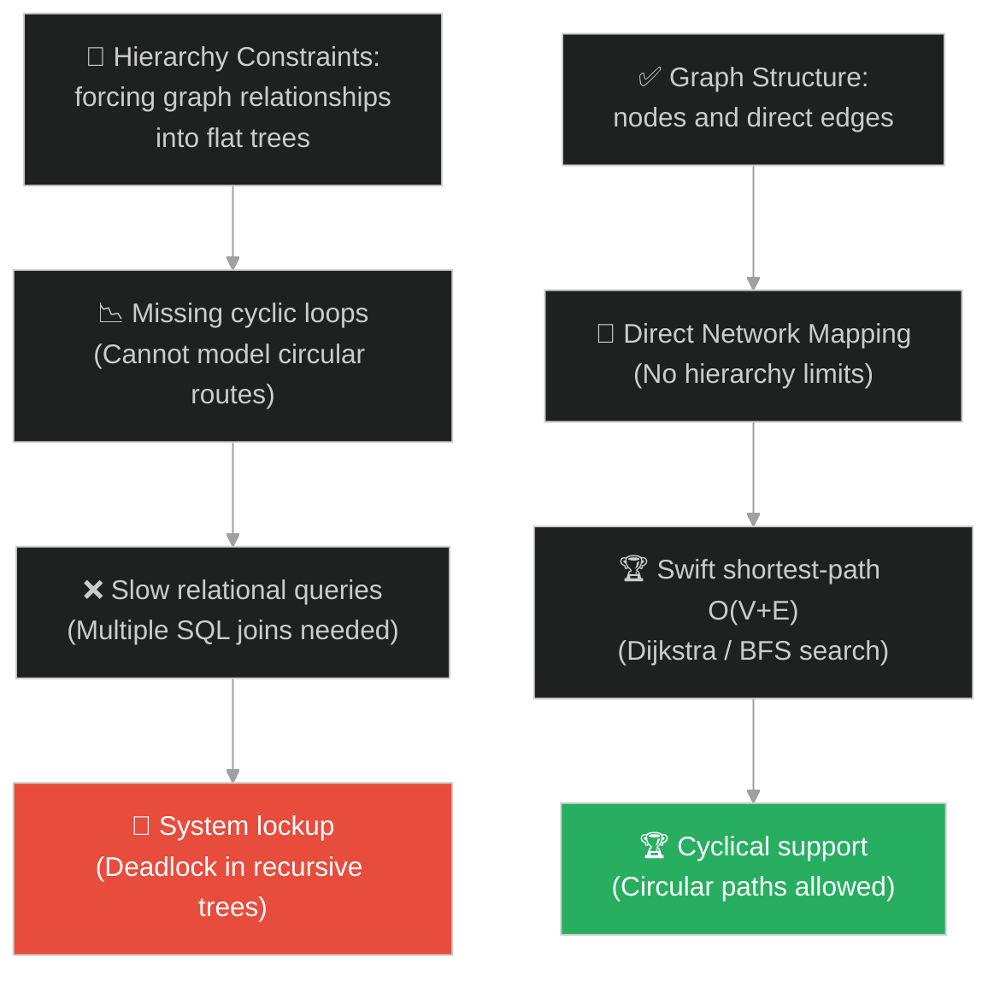
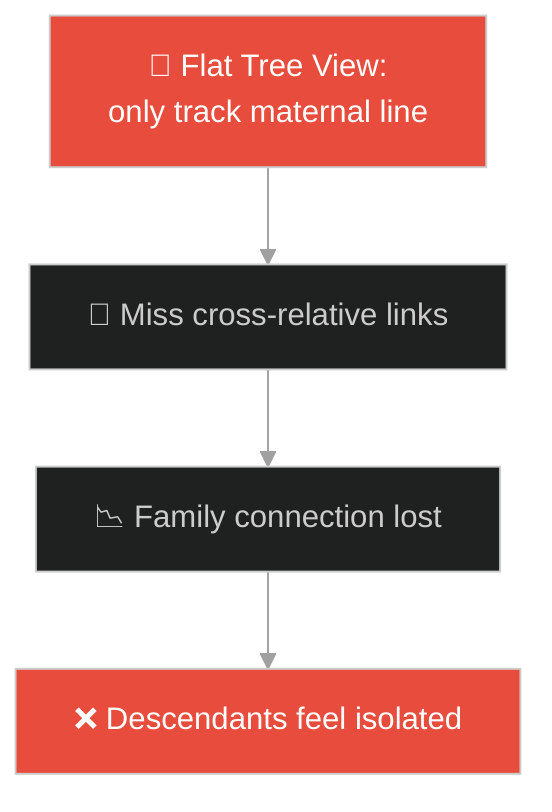
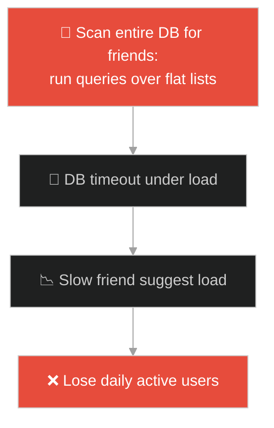
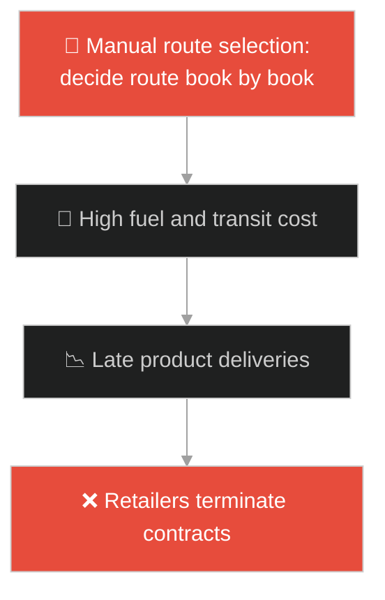
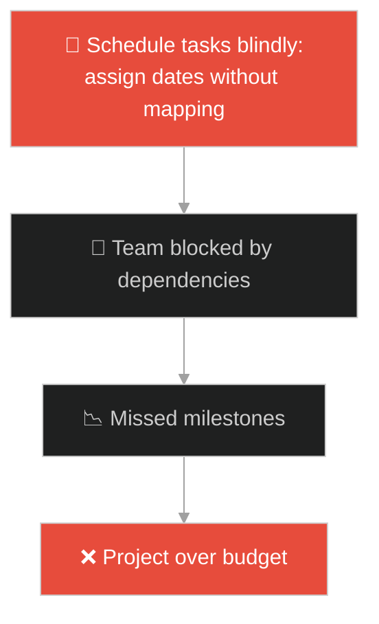
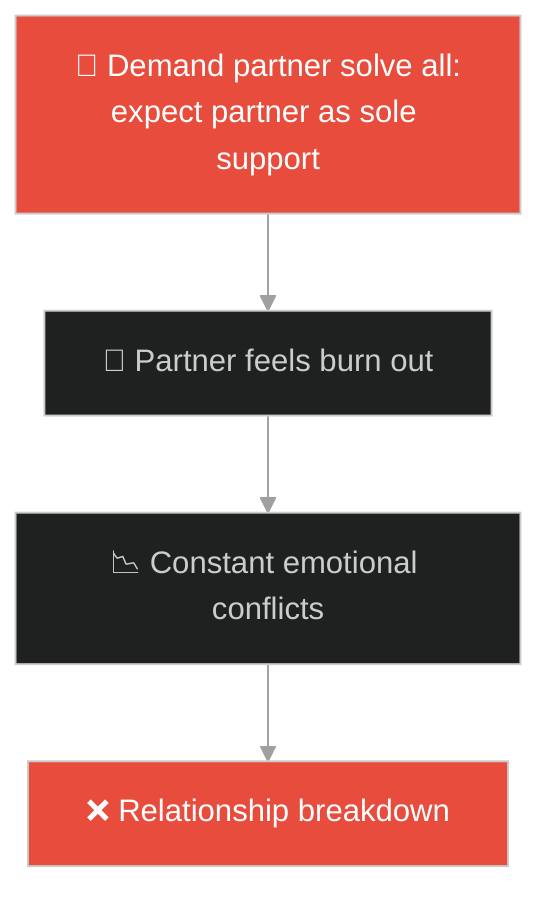
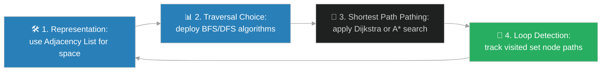

# Graph Data Structure (រចនាសម្ព័ន្ធទិន្នន័យក្រាហ្វ)៖ បណ្តាញនៃមិត្តភាព និងការធ្វើដំណើរ (Graphs & The Web of Friendship)

**Author:** ichamrong  
**Date:** 2026-05-28  
**Tags:** #dsa #data-structures #graphs #architecture #parable  
**Category:** Concepts / Parables  
**Read Time:** ~15 min  

---

## 📌 មាតិកា (Table of Contents)
- [អន្ទាក់ផ្លូវចិត្ត (The Trap)](#0)
- [១. រឿងព្រេងនិទាន៖ ភូមិអាកាសធាតុ និងបណ្តាញផ្លូវដោះស្រាយបញ្ហា (The Legend of the Weathered Villages and Network Paths)](#1)
  - [បណ្តាញមិត្តភាព និងការស្វែងរកផ្លូវខ្លីបំផុត (Friendship Networks and Shortest Path Traversal)](#1-1)
- [២. បញ្ហា៖ ដែនកំណត់នៃឋានានុក្រម និងការរុករកបណ្តាញស្មុគស្មាញ (The Issue: Limitations of Hierarchy and Network Navigation)](#2)
- [៣. ឧទាហមណ៍ជាក់ស្តែងក្នុងពិភពពិត (Real World Examples)](#3)
  - [ឧទាហរណ៍ទី ១ — កម្រិតស្រាល (គ្រួសារ)៖ ខ្សែស្រឡាយសាច់ញាតិ និងមិត្តភក្តិរួមគ្នា (Family Connection Graph)](#3-1)
  - [ឧទាហរណ៍ទី ២ — កម្រិតមធ្យម (បច្ចេកទេស)៖ ប្រព័ន្ធណែនាំមិត្តភក្តិ និងការបញ្ជូនកញ្ចប់ទិន្នន័យ (Social Graph and Packet Routing)](#3-2)
  - [ឧទាហរណ៍ទី ៣ — កម្រិតមធ្យម (ធុរកិច្ច)៖ ខ្សែសង្វាក់ផ្គត់ផ្គង់ និងការដឹកជញ្ជូន (Supply Chain Logistics)](#3-3)
  - [ឧទាហរណ៍ទី ៤ — កម្រិតមធ្យម (សង្គម/គ្រប់គ្រង)៖ ទំនាក់ទំនងការពឹងផ្អែកនៃកិច្ចការងារគម្រោង (Task Dependency Network)](#3-4)
  - [ឧទាហរណ៍ទី ៥ — កម្រិតធ្ងន់ (ទំនាក់ទំនង)៖ បណ្តាញគាំទ្រផ្លូវចិត្តជុំវិញខ្លួន (Social Support Graph)](#3-5)
- [៤. ដំណោះស្រាយទូទៅ៖ ការអនុវត្ត Graph ក្នុងវិស្វកម្មប្រព័ន្ធ (The General Solution: Graph Representation and Traversal Algorithms)](#4)
- [សេចក្តីសន្និដ្ឋាន (Conclusion)](#5)
- [ឯកសារយោង (References)](#6)
- [Related Posts](#7)

---

<a id="0"></a>
## អន្ទាក់ផ្លូវចិត្ត (The Trap)

ตើអ្នកធ្លាប់ព្យាយាមរៀបចំទិន្នន័យបណ្តាញដែលមានការតភ្ជាប់គ្នាទៅវិញទៅមកដោយគ្មាន "ចំណុចកំពូល (Root)" ឬ "លំដាប់លំដោយឋានានុក្រមច្បាស់លាស់" ដោយបង្ខំវាឱ្យស្ថិតក្នុងទម្រង់មែកធាង (Tree) ឬបញ្ជីតារាងលីនេអ៊ែរ (Flat Tables) ដែរឬទេ?

នៅក្នុងការរចនាប្រព័ន្ធ៖
* **យើងងាយនឹងធ្លាក់ក្នុងអន្ទាក់** នៃការសន្មត់ថាទិន្នន័យទាំងអស់ត្រូវតែមានទំនាក់ទំនងជាឋានានុក្រម (Parent-Child) ដែលនាំឱ្យមានភាពទាល់ច្រកក្នុងការតភ្ជាប់បណ្តាញផ្លូវស្មុគស្មាញ និងបង្កើតឱ្យមាន Loop វិលជុំដែលកូដមិនអាចដោះស្រាយបាន។
* **យើងមើលរំលង** គំរូទំនាក់ទំនងជាក្រាហ្វ (Graph Model) ដែលអនុញ្ញាតឱ្យរាល់ Node ទាំងអស់អាចតភ្ជាប់គ្នាទៅវិញទៅមកតាមរយៈ Edges ដោយសេរី ជួយដោះស្រាយបញ្ហាស្វែងរកផ្លូវ និងការវិភាគបណ្តាញបានយ៉ាងមានប្រសិទ្ធភាព។

ការព្យាយាមរៀបចំទិន្នន័យបណ្តាញស្មុគស្មាញឱ្យស្ថិតក្នុងទម្រង់ Flat Table ហៅថា **អន្ទាក់រៀបចំទិន្នន័យបណ្តាញបែបលីនេអ៊ែរ (Linear Network Data Trap)**។

ដើម្បីយល់ដឹងពីរបៀបគ្រប់គ្រងបណ្តាញឥតដែនកំណត់ នេះជាផែនទីបង្ហាញផ្លូវ៖
1. **រឿងព្រេងនិទាន (The Legend)** — រឿងរ៉ាវរបស់ភូមិនានាដែលគ្មានចំណុចកណ្តាល ត្រូវតភ្ជាប់ផ្លូវទៅវិញទៅមកដើម្បីពឹងពាក់គ្នា និងចែករំលែកធនធាន។
2. **បញ្ហា (The Issue)** — ការវិភាគ Direct vs Undirected Graphs, Adjacency List/Matrix, និងការគណនាក្បួនដោះស្រាយ BFS/DFS។
3. **ឧទាហមណ៍ជាក់ស្តែងក្នុងពិភពពិត (Real World Examples)** — ពិនិត្យមើលគំនិតនេះក្នុងកម្រិតគ្រួសារ បច្ចេកវិទ្យា ធុរកិច្ច ការគ្រប់គ្រង និងទំនាក់ទំនង។
4. **ដំណោះស្រាយទូទៅ (The General Solution)** — ការជ្រើសរើសទម្រង់រក្សាទុក Graph និងការអនុវត្ត Dijkstra's algorithm សម្រាប់ស្វែងរកផ្លូវខ្លីបំផុត។



---

<a id="1"></a>
## ១. រឿងព្រេងនិទាន៖ ភូមិអាកាសធាតុ និងបណ្តាញផ្លូវដោះស្រាយបញ្ហា (The Legend of the Weathered Villages and Network Paths)

កាលពីព្រេងនាយ មានបណ្តុំភូមិជាច្រើនស្ថិតនៅក្នុងជ្រលងភ្នំដ៏ធំមួយ។ នៅក្នុងជ្រលងភ្នំនោះ គ្មានភូមិណាជា "មេ" ឬមានអំណាចលើភូមិផ្សេងទៀតឡើយ (No Hierarchical Root)។ ភូមិនីមួយៗដុះឡើងដោយឯកឯង និងមានលក្ខណៈពិសេសរៀងៗខ្លួន។

ដំបូងឡើយ៖
* ភូមិភ្នំពេញ ភ្ជាប់ទៅកាន់ភូមិសៀមរាប, ភូមិសៀមរាប ភ្ជាប់ទៅកាន់ភូមិបាត់ដំបង, ហើយភូមិបាត់ដំបង អាចតភ្ជាប់ត្រឡប់មកភូមិភ្នំពេញវិញ បង្កើតបានជារង្វង់ផ្លូវធ្វើដំណើរ (Cyclic Path)។
* វិស្វករផ្លូវថ្នល់ដំបូងព្យាយាមរៀបចំផ្លូវទាំងនេះជាជួរលីនេអ៊ែរ ឬតាមលំដាប់ថ្នាក់មែកធាង ប៉ុន្តែពួកគេតែងតែជួបការបរាជ័យ ព្រោះផ្លូវថ្នល់តែងតែខ្វាត់ខ្វែង និងបង្កើតបានជារង្វង់ជំពាក់ជំពិនគ្នា។
* ដើម្បីគ្រប់គ្រងការធ្វើដំណើរ ចៅហ្វាយស្រុកបានសម្រេចចិត្តគូរ **ផែនទីបណ្តាញ (The Graph Map)**៖
  * ភូមិនីមួយៗតំណាងឱ្យចំនុចប្រសព្វ (Vertices/Nodes)។
  * ផ្លូវតភ្ជាប់រវាងភូមិតំណាងឱ្យខ្សែផ្លូវ (Edges)។

---

<a id="1-1"></a>
### បណ្តាញមិត្តភាព និងការស្វែងរកផ្លូវខ្លីបំផុត (Friendship Networks and Shortest Path Traversal)

នៅក្នុងតំបន់នោះ ការបង្កើតមិត្តភាពក៏ដូចគ្នាដែរ៖
* ប្រសិនបើ សួង ធ្វើមិត្តជាមួយ សាន ហើយ សាន ធ្វើមិត្តជាមួយ ធារ៉ា នោះមិនមែនមានន័យថា សួង ត្រូវតែជាមេរបស់ សាន ឡើយ។ ពួកគេជាមិត្តភក្តិស្មើគ្នា (Undirected Graph)។
* ប៉ុន្តែនៅលើបណ្តាញចែករំលែកព័ត៌មាន (ដូចជាការ Follow គ្នា) វាជាផ្លូវឯកទិស (Directed Graph)៖ តារា អាច Follow សេលេបល្បីម្នាក់ ប៉ុន្តែសេលេបនោះមិនបាន Follow តារា វិញឡើយ។
* តាមរយៈការគូរផែនទីតភ្ជាប់គ្នានេះ ពួកគេអាចស្វែងរកអ្នកនាំសារដែលអាចរត់យកសំបុត្រពីភូមិមួយទៅភូមិមួយទៀតបានលឿនបំផុត (Shortest Path) ដោយប្រើប្រាស់គំរូនៃ "ការដើររាវរកតាមចម្ងាយជិតបង្អស់"។

---

<a id="2"></a>
## ២. បញ្ហា៖ ដែនកំណត់នៃឋានានុក្រម និងការរុករកបណ្តាញស្មុគស្មាញ (The Issue: Limitations of Hierarchy and Network Navigation)

នៅក្នុងការសរសេរកូដ OOP ភាពជំពាក់ជំពិនកើតឡើងនៅពេលយើងព្យាយាមតំណាងឱ្យទិន្នន័យបណ្តាញ (ដូចជា Social Network Connections ឬ Route Maps) ដោយប្រើ Parent-Child Class References៖

```java
// កូដដែលព្យាយាមបង្ខំ Graph ឱ្យស្ថិតក្នុងទម្រង់ Tree
public class BadTreeNode {
    private BadTreeNode parent;
    private List<BadTreeNode> children;
    // មិនអាចតំណាងឱ្យ cyclic loops ឬ cross-relations បានឡើយ
}
```

* **មិនអាចតំណាងទំនាក់ទំនងវិលជុំ (Cyclic Relations)៖** នៅក្នុង Tree ឬ List ប្រសិនបើ Node A ចង្អុលទៅ B, B ចង្អុលទៅ C, ហើយ C ចង្អុលមក A វិញ វានឹងបង្កើតឱ្យមាន Infinite Recursion Loop ធ្វើឱ្យកុំព្យូទ័រគាំង StackOverflow immediately។
* **ភាពលំបាកក្នុងការគណនាផ្លូវ (Lookup Overhead)៖** ប្រសិនបើប្រើ SQL Tables ធម្មតាដែលមាន `from_id` និង `to_id` ដើម្បីស្វែងរកទំនាក់ទំនងមិត្តភក្តិ ៥ ថ្នាក់ (5th-degree connections) នោះ Database ត្រូវសរសេរ JOIN ៥ ដង ដែលនាំឱ្យល្បឿន Query ធ្លាក់ចុះដល់សូន្យ និងគាំង Server។

**Graph Data Structure** ដោះស្រាយបញ្ហានេះដោយបោះបង់ចោលនូវគំនិត Hierarchical Root។ Node នីមួយៗរក្សាទុកតែបញ្ជីនៃ Edges (Adjacency List) ដែលភ្ជាប់វាទៅកាន់ Nodes ផ្សេងទៀតប៉ុណ្ណោះ។ យន្តការនេះអនុញ្ញាតឱ្យប្រព័ន្ធធ្វើការរុករកតាមរយៈក្បួនដោះស្រាយ BFS (Breadth-First Search) ឬ DFS (Depth-First Search) ដោយមិនបារម្ភពីរង្វង់ជំពាក់ជំពិនឡើយ។

---

<a id="3"></a>
## ៣. ឧទាហមណ៍ជាក់ស្តែងក្នុងពិភពពិត

---

<a id="3-1"></a>
### ឧទាហមណ៍ទី ១ — កម្រិតស្រាល (គ្រួសារ)៖ ខ្សែស្រឡាយសាច់ញាតិ និងមិត្តភក្តិរួមគ្នា (Family Connection Graph)

នៅក្នុងក្រុមគ្រួសារ និងសាច់ញាតិធំៗ ទំនាក់ទំនងមិនមែនហូរចុះត្រង់តែមួយផ្លូវទេ។ សាច់ញាតិខាងម្តាយ អាចត្រូវជាបងប្អូនជីដូនមួយរបស់ខាងឪពុក ហើយមានមិត្តភក្តិរួមគ្នាជាច្រើន។ ប្រសិនបើព្យាយាមគូរត្រឹមតែមែកធាងត្រង់ៗ នោះនឹងមិនអាចបង្ហាញពីទំនាក់ទំនង "សាច់ញាតិខ្វាត់ខ្វែង" បានឡើយ។ ការប្រើប្រាស់ Graph ជួយឱ្យគ្រួសារយល់ពីបណ្តាញសាច់ញាតិទាំងសងខាងយ៉ាងច្បាស់លាស់។



---

<a id="3-2"></a>
### ឧទាហមណ៍ទី ២ — កម្រិតមធ្យម (បច្ចេកទេស)៖ ប្រព័ន្ធណែនាំមិត្តភក្តិ និងការបញ្ជូនកញ្ចប់ទិន្នន័យ (Social Graph and Packet Routing)

ក្រុមហ៊ុនដូចជា Facebook, LinkedIn ប្រើប្រាស់ "Social Graph" ដើម្បីដំណើរការប្រព័ន្ធណែនាំមិត្តភក្តិ (People You May Know)។ លើសពីនេះ ឧបករណ៍ Network Routers ប្រើប្រាស់ Graph Algorithms (ដូចជា OSPF - Open Shortest Path First) ដើម្បីបញ្ជូនកញ្ចប់ទិន្នន័យអុិនធឺណិតពីកុំព្យូទ័រមួយទៅកុំព្យូទ័រមួយទៀតតាមរយៈផ្លូវដែលលឿនបំផុត និងមិនកកស្ទះ។



---

<a id="3-3"></a>
### ឧទាហមណ៍ទី ៣ — កម្រិតមធ្យម (ធុរកិច្ច)៖ ខ្សែសង្វាក់ផ្គត់ផ្គង់ និងការដឹកជញ្ជូន (Supply Chain Logistics)

នៅក្នុងធុរកិច្ចពាណិជ្ជកម្ម និងដឹកជញ្ជូន (Logistics) ទំនិញត្រូវហូរចេញពីរោងចក្រជាច្រើន ទៅកាន់ឃ្លាំងស្តុក និងបន្តទៅកាន់ភ្នាក់ងារចែកចាយទូទាំងប្រទេស។ ផ្លូវដឹកជញ្ជូនត្រូវតែរៀបចំជា Graph ដើម្បីឱ្យប្រព័ន្ធអាចគណនាផ្លូវដឹកជញ្ជូនដែលមានតម្លៃទាបបំផុត និងលឿនបំផុត ធានាបាននូវការសន្សំសំចៃថ្លៃប្រេង និងចែកចាយទំនិញទាន់ពេលវេលា។



---

<a id="3-4"></a>
### ឧទាហមណ៍ទី ៤ — កម្រិតមធ្យម (សង្គម/គ្រប់គ្រង)៖ ទំនាក់ទំនងការពឹងផ្អែកនៃកិច្ចការងារគម្រោង (Task Dependency Network)

នៅក្នុងការគ្រប់គ្រងគម្រោងធំៗ (Project Management) កិច្ចការងារនីមួយៗមិនរត់ដាច់ដោយឡែកនោះទេ។ Task B អាចផ្តើមបានលុះត្រាតែ Task A បញ្ចប់ (Task Dependency)។ វិស្វករគម្រោងប្រើប្រាស់ **PERT Chart / Critical Path Method (CPM)** ដែលជា Directed Acyclic Graph (DAG) ដើម្បីតាមដាន និងរកមើលថា កិច្ចការណាខ្លះដែលជាខ្សែសង្វាក់សំខាន់ (Critical Path) ដែលមិនអាចពន្យារពេលបានឡើយ។



---

<a id="3-5"></a>
### ឧទាហមណ៍ទី ៥ — កម្រិតធ្ងន់ (ទំនាក់ទំនង)៖ បណ្តាញគាំទ្រផ្លូវចិត្តជុំវិញខ្លួន (Social Support Graph)

នៅក្នុងទំនាក់ទំនងផ្ទាល់ខ្លួន គ្មានដៃគូណាដែលអាចដើរតួជាអ្នកផ្គត់ផ្គង់រាល់តម្រូវការផ្លូវចិត្តទាំងអស់របស់ដៃគូម្នាក់ទៀតបានឡើយ (No single relationship root)។ មនុស្សម្នាក់ៗត្រូវការបណ្តាញគាំទ្រផ្លូវចិត្ត (Social Support Graph) ដែលរួមមាន៖ ដៃគូជីវិត គ្រួសារ មិត្តភក្តិជិតស្និទ្ធ សហការី និងគ្រូពេទ្យពិគ្រោះយោបល់។ ការព្យាយាមដាក់សម្ពាធឱ្យដៃគូជីវិតតែម្នាក់ទទួលរាល់តួនាទីទាំងអស់ (forcing a tree relationship) នឹងនាំឱ្យបាក់បែក និងអស់កម្លាំងចិត្តទាំងសងខាង។



---

<a id="4"></a>
## ៤. ដំណោះស្រាយទូទៅ៖ ការអនុវត្ត Graph ក្នុងវិស្វកម្មប្រព័ន្ធ (The General Solution: Graph Representation and Traversal Algorithms)

ដើម្បីសាងសង់ប្រព័ន្ធគ្រប់គ្រងបណ្តាញដែលមានភាពបត់បែន និងល្បឿនលឿន វិស្វករត្រូវរៀបចំ Graph ឱ្យបានត្រឹមត្រូវ៖



ជំហាននៃការអនុវត្ត៖
1. **ជ្រើសរើសទម្រង់រក្សាទុក Graph ឱ្យត្រូវនឹងទំហំ (Representation Choice)៖**
   * **Adjacency List:** ប្រើ Map នៃ Node ទៅកាន់ List នៃក្បែរខាង (`Map<Node, List<Node>>`) ដែលសន្សំសំចៃ Memory បំផុតសម្រាប់ Sparse Graphs។
   * **Adjacency Matrix:** ប្រើតារាងពីរកម្រិត (`boolean[][]`) សម្រាប់ Dense Graphs ដែលមានខ្សែភ្ជាប់ច្រើនខ្វាត់ខ្វែង ដើម្បីឆែកទំនាក់ទំនងភ្លាមៗ O(1)។
2. **អនុវត្តក្បួនរុករកទិន្នន័យ (BFS vs DFS)៖**
   * **Breadth-First Search (BFS):** ប្រើប្រាស់ Queue ដើម្បីរុករកតាមកម្រិតជិតឆ្ងាយ (ល្អសម្រាប់ស្វែងរកផ្លូវខ្លីបំផុតលើក្រាហ្វដែលគ្មានទម្ងន់)។
   * **Depth-First Search (DFS):** ប្រើប្រាស់ Stack ឬ Recursion ដើម្បីរុករកឱ្យដល់ជម្រៅចុងក្រោយ (ល្អសម្រាប់ដោះស្រាយល្បែង Maze ឬ Topology Sort)។
3. **ប្រើប្រាស់ Dijkstra's Algorithm សម្រាប់ស្វែងរកផ្លូវខ្លីបំផុត៖** នៅពេល Edges មានតម្លៃទម្ងន់ (ឧទាហរណ៍ ពេលវេលាធ្វើដំណើរ ឬចម្ងាយគីឡូម៉ែត្រ) ត្រូវប្រើ Dijkstra's algorithm ជាមួយ Priority Queue (Min-Heap) ដើម្បីធានាបាននូវល្បឿនស្វែងរក $O((V+E)\log V)$។
4. **អនុវត្តយន្តការការពាររង្វង់ជំពាក់ជំពិន (Visited Set Tracking)៖** រាល់ពេលដំណើរការ DFS/BFS ត្រូវរក្សាទុកបញ្ជី Node ដែលបានទៅដល់រួចហើយ (`Set<Node> visited`) ដើម្បីចៀសវាងការធ្លាក់ចូលទៅក្នុង Infinite Loops និងបង្ការការគាំង StackOverflow នៃ CPU។

---

## 🐇 ធ្លាក់ចូលក្នុងរន្ធទន្សាយ (Enter the Rabbit Hole)

ដើម្បីស្វែងយល់ពីរបៀបដែលបន្ទប់សង្គ្រោះបន្ទាន់ ឬប្រព័ន្ធគ្រប់គ្រងការងារបន្ទាន់របស់ CPU បានរៀបចំរចនាសម្ព័ន្ធទិន្នន័យដើម្បីដោះស្រាយកិច្ចការដែលមានអាទិភាពខ្ពស់បំផុតជាមុន ដោយមិនចាំបាច់រៀបចំជម្រើសតម្រៀបទិន្នន័យឡើងវិញរាល់វិនាទី (Heaps & Priority Queues) សូមបន្តដំណើរទៅកាន់៖

* 🚀 **[ចាប់ផ្តើមដំណើររុករក (Start the Journey) ➔ Heap Data Structure and Priority Triage](./104-the-emergency-room-triage.md)**

---

<a id="5"></a>
## សេចក្តីសន្និដ្ឋាន (Conclusion)

> **«នៅពេលយើងលុបបំបាត់គំនិតឋានានុក្រមរឹងរូស យើងនឹងមើលឃើញពិភពលោកជាបណ្តាញដែលតភ្ជាប់គ្នាប្រកបដោយសេរី និងភាពបត់បែន»**

ការប្រើប្រាស់ Graph ជួយឱ្យវិស្វករបំប្លែងរាល់ទំនាក់ទំនងបណ្តាញខ្វាត់ខ្វែងឱ្យទៅជារចនាសម្ព័ន្ធទិន្នន័យដ៏មានឥទ្ធិពល ធានាបាននូវល្បឿនរុករកខ្ពស់ លទ្ធភាពស្វែងរកផ្លូវល្អបំផុត និងសមត្ថភាពវិភាគទំនាក់ទំនងស្មុគស្មាញឥតដែនកំណត់។

---

<a id="6"></a>
## ឯកសារយោង (References)

* **Knuth, D. E.** — *The Art of Computer Programming, Volume 1: Fundamental Algorithms* (1997). Graph and tree traversal foundations.
* **Cormen, T. H., Leiserson, C. E., Rivest, R. L., & Stein, C.** — *Introduction to Algorithms* (2009). Graph representations, BFS, DFS, Dijkstra's algorithm, and topological sort.

---

<a id="7"></a>
## Related Posts

* [[DSA: Graphs](../dsa/02-non-linear-structures.md#3-graphs-the-universal-model)] — ការពន្យល់លម្អិត និងស៊ីជម្រៅអំពី Graphs ក្នុង DSA។
* [[Linked List Data Structure & The Spy's Treasure Hunt](./99-the-spys-treasure-hunt.md)] — ការស្វែងយល់ពី Pointers និង References ដែលប្រើសម្រាប់ភ្ជាប់ Node នីមួយៗក្នុង Graph។
