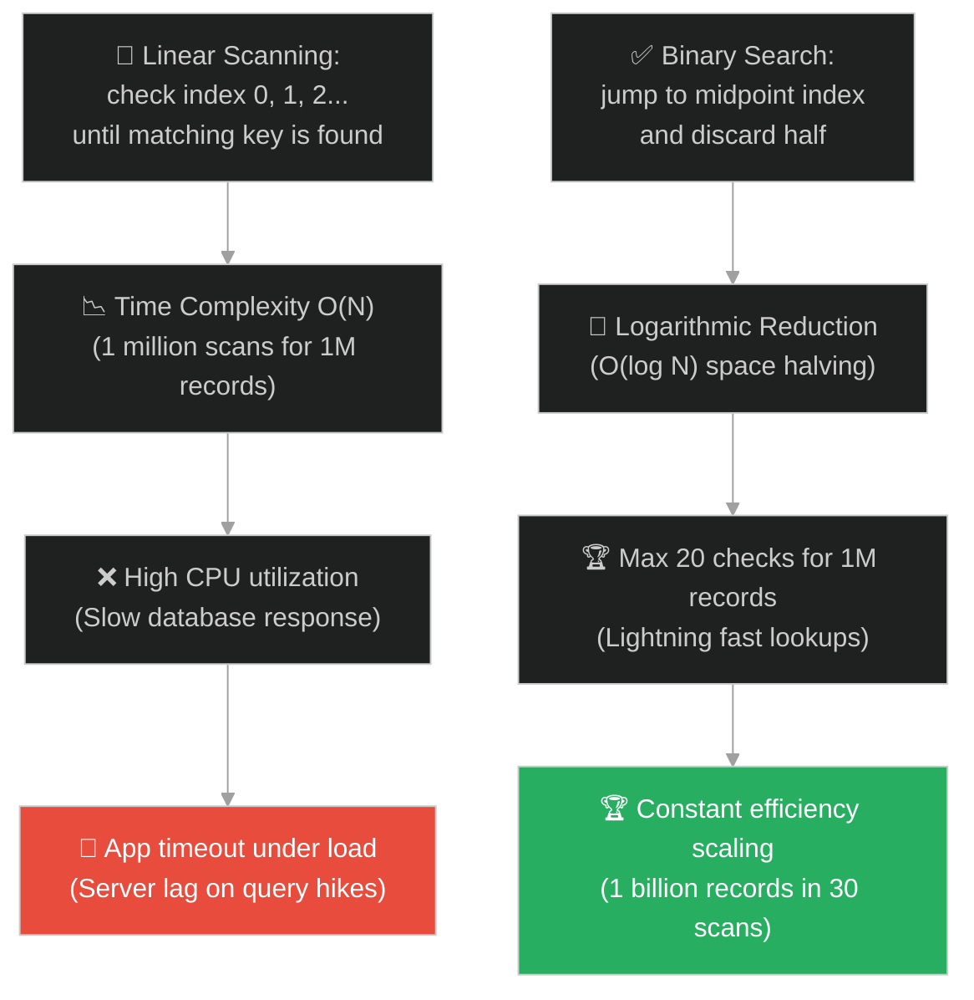
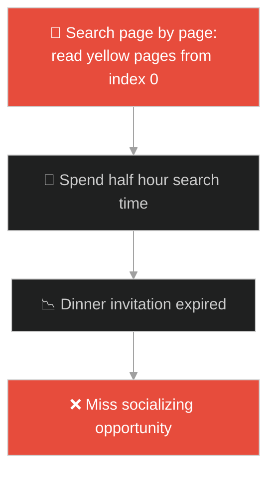
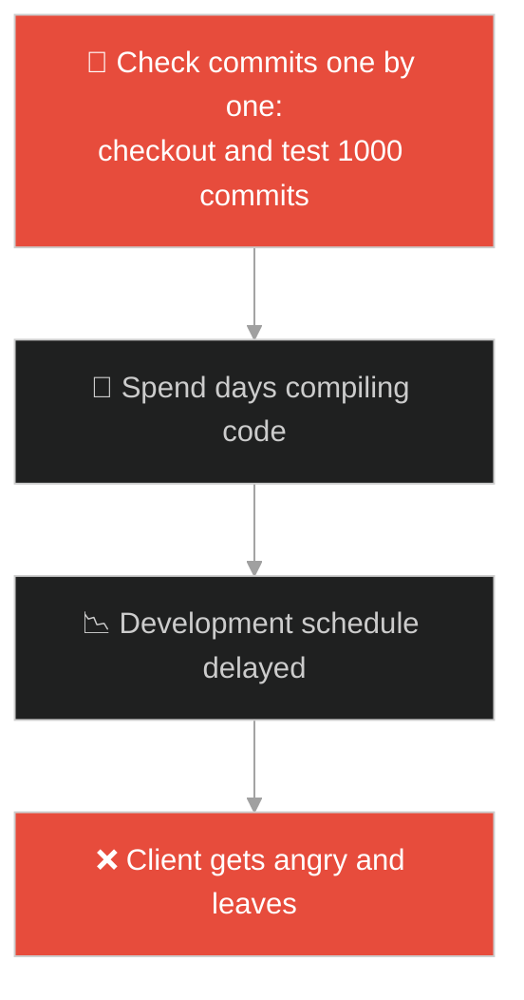
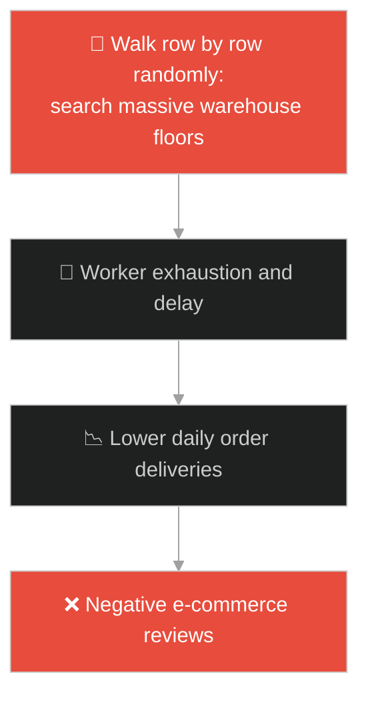
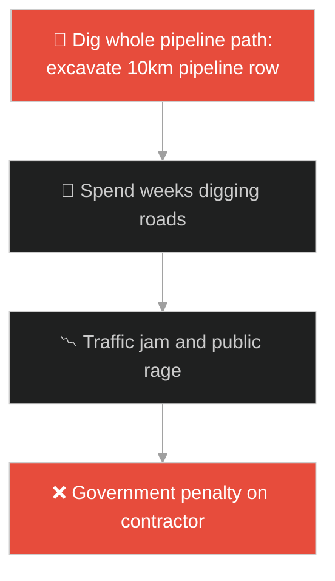
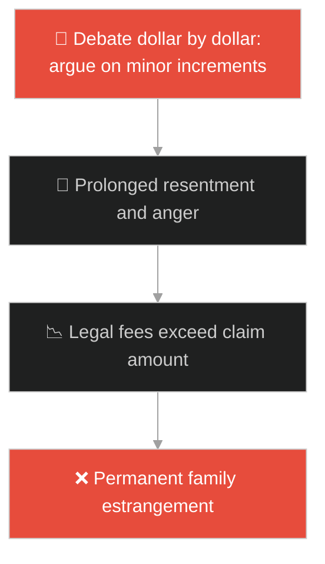
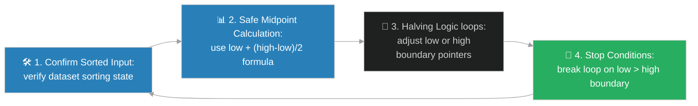

# Binary Search Algorithm (ក្បួនដោះស្រាយស្វែងរកតាមបែបពាក់កណ្តាល)៖ វចនានុក្រមនៃអាថ៌កំបាំង (Binary Search & The Dictionary of Secrets)

**Author:** ichamrong  
**Date:** 2026-05-28  
**Tags:** #dsa #algorithms #binary-search #divide-and-conquer #parable  
**Category:** Concepts / Parables  
**Read Time:** ~15 min  

---

## 📌 មាតិកា (Table of Contents)
- [អន្ទាក់ផ្លូវចិត្ត (The Trap)](#0)
- [១. រឿងព្រេងនិទាន៖ អ្នកស៊ើបអង្កេត និងសៀវភៅលេខសម្ងាត់រាប់លានទំព័រ (The Legend of the Detective and the Book of Secrets)](#1)
  - [សិល្បៈនៃការកាត់ពាក់កណ្តាល និងការស្វែងរក O(log N) (The Art of Bisection and Logarithmic Search)](#1-1)
- [២. បញ្ហា៖ ការស្វែងរកយឺតយ៉ាវ O(N) លើបញ្ជីវែងអន្លាយ និងកង្វះការតម្រៀបទិន្នន័យ (The Issue: Linear Search Bottleneck and Unsorted Data Constraints)](#2)
- [៣. ឧទាហមណ៍ជាក់ស្តែងក្នុងពិភពពិត (Real World Examples)](#3)
  - [ឧទាហរណ៍ទី ១ — កម្រិតស្រាល (គ្រួសារ)៖ ការរាវរកលេខទូរស័ព្ទក្នុងសៀវភៅលឿង (Finding Contacts in Physical Directories)](#3-1)
  - [ឧទាហរណ៍ទី ២ — កម្រិតមធ្យម (បច្ចេកទេស)៖ ការរកកូដខូចតាមរយៈ Git Bisect (Debugging with Git Bisect)](#3-2)
  - [ឧទាហរណ៍ទី ៣ — កម្រិតមធ្យម (ធុរកិច្ច)៖ ការស្វែងរកកញ្ចប់ទំនិញក្នុងឃ្លាំងស្តុក (Sorted Warehouse Row Inventory Search)](#3-3)
  - [ឧទាហរណ៍ទី ៤ — កម្រិតមធ្យម (សង្គម/គ្រប់គ្រង)៖ ការកំណត់ចំណុចខូចខាតនៃបណ្តាញចែកចាយ (Isolating Network Failure Points)](#3-4)
  - [ឧទាហរណ៍ទី ៥ — កម្រិតធ្ងន់ (ទំនាក់ទំនង)៖ ការស្វែងរកចំណុចកណ្តាលយោគយល់ក្នុងវិវាទ (Finding Middle Ground Compromise)](#3-5)
- [៤. ដំណោះស្រាយទូទៅ៖ ការអនុវត្ត Binary Search ក្នុងវិស្វកម្មប្រព័ន្ធ (The General Solution: Binary Search Implementation and Overflow Prevention)](#4)
- [សេចក្តីសន្និដ្ឋាន (Conclusion)](#5)
- [ឯកសារយោង (References)](#6)
- [Related Posts](#7)

---

<a id="0"></a>
## អន្ទាក់ផ្លូវចិត្ត (The Trap)

តើអ្នកធ្លាប់ជួបបញ្ហាដែលត្រូវស្វែងរកទិន្នន័យពីក្នុងបញ្ជីដែលបានតម្រៀបរួចជាស្រេច (Sorted List) ហើយអ្នកបានប្រើ loop ធម្មតាដើម្បីស្កេនរកម្តងមួយៗ (Linear Search) ធ្វើឱ្យកម្មវិធីដំណើរការយឺតយ៉ាវ O(N) ដែរឬទេ?

នៅក្នុងការស្វែងរកទិន្នន័យ៖
* **យើងងាយនឹងធ្លាក់ក្នុងអន្ទាក់** នៃការប្រើ loop រត់ពីដើមដល់ចប់ (Linear Scan) ព្រោះវាជាកូដដែលងាយស្រួលសរសេរបំផុត ប៉ុន្តែវាបង្កឱ្យមានភាពយឺតយ៉ាវខ្លាំង O(N) នៅពេលទិន្នន័យកើនឡើងដល់រាប់លាន។
* **យើងមើលរំលង** លក្ខណៈពិសេសនៃ "ការតម្រៀបរួច (Sorted Property)" ដែលជួយឱ្យយើងអាចកាត់ចោលទិន្នន័យពាក់កណ្តាលដែលមិនត្រូវការ O(log N) ត្រឹមតែមួយប៉ព្រិចភ្នែក។

ការព្យាយាមរាវរកទិន្នន័យដែលតម្រៀបរួចដោយមិនប្រើប្រាស់ Binary Search ហៅថា **អន្ទាក់រាវរកលីនេអ៊ែរលើទិន្នន័យតម្រៀបរួច (Linear Search on Sorted Data Trap)**។

ដើម្បីយល់ដឹងពីរបៀបស្វែងរកទិន្នន័យ O(log N) នេះជាផែនទីបង្ហាញផ្លូវ៖
1. **រឿងព្រេងនិទាន (The Legend)** — រឿងរ៉ាវរបស់អ្នកស៊ើបអង្កេតដែលត្រូវស្វែងរកពាក្យសម្ងាត់ពីក្នុងសៀវភៅក្រាស់ឃ្មឹក ដោយការហែកសៀវភៅជាពីរជាបន្តបន្ទាប់។
2. **បញ្ហា (The Issue)** — ការវិភាគ Binary Search Logic, Integer Overflow `(low + high) / 2`, ភាពខុសគ្នារវាង O(N) និង O(log N)។
3. **ឧទាហមណ៍ជាក់ស្តែងក្នុងពិភពពិត (Real World Examples)** — ពិនិត្យមើលគំនិតនេះក្នុងកម្រិតគ្រួសារ បច្ចេកវិទ្យា ធុរកិច្ច ការគ្រប់គ្រង និងទំនាក់ទំនង។
4. **ដំណោះស្រាយទូទៅ (The General Solution)** — ការសរសេរកូដ Binary Search ប្រកបដោយសុវត្ថិភាព និងការការពារ StackOverflow។



---

<a id="1"></a>
## ១. រឿងព្រេងនិទាន៖ អ្នកស៊ើបអង្កេត និងសៀវភៅលេខសម្ងាត់រាប់លានទំព័រ (The Legend of the Detective and the Book of Secrets)

កាលពីព្រេងនាយ មានអ្នកស៊ើបអង្កេតម្នាក់ត្រូវបានព្រះរាជាប្រគល់បេសកកម្មសម្ងាត់មួយ គឺត្រូវស្វែងរកលេខសម្ងាត់រំដោះនគរពីក្នុងសៀវភៅអាថ៌កំបាំងដែលមានកម្រាស់រហូតដល់ ១០០០០ ទំព័រ។

ដំបូងឡើយ៖
* សៀវភៅនោះត្រូវបានកត់ត្រាលេខកូដដោយតម្រៀបពីតូចទៅធំរួចជាស្រេច (Sorted List)។
* ប៉ុន្តែដោយសារភាពភ័យស្លន់ស្លោ អ្នកស៊ើបអង្កេតបានចាប់ផ្តើមបើកមើលម្តងមួយទំព័រ តាំងពីទំព័រទី១ ទំព័រទី២ ទំព័រទី៣... ក្នុងល្បឿនយឺតយ៉ាវ O(N)។
* ពេលវេលាកាន់តែខើចទៅៗ ព្រះអាទិត្យជិតលិចដី តែគាត់ទើបតែបើកមើលដល់ទំព័រទី ២០០ ប៉ុណ្ណោះ។ គាត់ដឹងខ្លួនថា វិធីសាស្ត្រនេះនឹងធ្វើឱ្យគាត់បរាជ័យ និងត្រូវកាត់ក្បាលជាមិនខាន។

---

<a id="1-1"></a>
### សិល្បៈនៃការកាត់ពាក់កណ្តាល និងការស្វែងរក O(log N) (The Art of Bisection and Logarithmic Search)

នៅក្នុងគ្រាអាសន្ននោះ គាត់បានដកដង្ហើមធំ ហើយគិតឡើងវិញ៖
* "សៀវភៅនេះតម្រៀបរួចហើយ! បើខ្ញុំចង់រកលេខសម្ងាត់ `៨៥០០` ហេតុអ្វីខ្ញុំត្រូវមើលទំព័រដំបូងៗ?"
* គាត់ក៏បើកចំកណ្តាលសៀវភៅគឺទំព័រទី `៥០០០` ភ្លាម។ លេខកូដនៅទំព័រនោះគឺ `៥០០០`។
* ដោយសារលេខសម្ងាត់ `៨៥០០` ធំជាង `៥០០០` គាត់ដឹងច្បាស់ ១០០% ថាវាមិនអាចស្ថិតនៅចន្លោះពីទំព័រទី ១ ដល់ ៥០០០ ឡើយ។ គាត់ក៏ហែកទំព័រទាំង ៥០០០ នោះបោះចោលក្នុងទឹកទន្លេភ្លាមៗ (កម្ចាត់ចោល ៥០% នៃទិន្នន័យក្នុងពេល ១ វិនាទី)។
* គាត់បន្តបើកចំកណ្តាលនៃទំព័រដែលនៅសល់ (ទំព័រទី `៧៥០០`)។ គាត់ឃើញលេខ `៧៥០០`។ គាត់បោះចោលទំព័រពី ៥០០០ ដល់ ៧៥០០ ទៀត។
* ដោយសារវិធីកាត់ពាក់កណ្តាលដ៏វៃឆ្លាតនេះ គាត់ចំណាយពេលបើកសៀវភៅត្រឹមតែ ១៤ ដងប៉ុណ្ណោះ គាត់ក៏រកឃើញលេខសម្ងាត់ `៨៥០០` យ៉ាងត្រឹមត្រូវ និងអាចសង្គ្រោះនគរបានទាន់ពេលវេលាមុនពេលព្រះអាទិត្យលិចដី។

---

<a id="2"></a>
## ២. បញ្ហា៖ ការស្វែងរកយឺតយ៉ាវ O(N) លើបញ្ជីវែងអន្លាយ និងកង្វះការតម្រៀបទិន្នន័យ (The Issue: Linear Search Bottleneck and Unsorted Data Constraints)

នៅក្នុងការសរសេរកម្មវិធី OOP ភាពជំពាក់ជំពិនកើតឡើងនៅពេលយើងស្វែងរកទិន្នន័យពីក្នុង Array ដែលតម្រៀបរួចដោយមិនប្រើប្រាស់ Binary Search៖

```java
// កូដដែលរត់ O(N) លើទិន្នន័យដែលតម្រៀបរួច
public int linearSearch(int[] arr, int target) {
    for (int i = 0; i < arr.length; i++) {
        if (arr[i] == target) return i;
    }
    return -1; // ខាតបង់ O(N) time ទោះបីជា arr តម្រៀបរួចក៏ដោយ
}
```

* **ការខាតបង់ CPU O(N)៖** ប្រសិនបើយើងមានទិន្នន័យ ១លានធាតុ ការប្រើ Linear Search ត្រូវការ scans ជាមធ្យម ៥០០,០០០ ដង។ ចំណែក Binary Search ត្រូវការត្រឹមតែ ២០ ដងប៉ុណ្ណោះ O(log N)។
* **បញ្ហា Overflow ក្នុងការគណនា Midpoint៖** វិស្វករជាច្រើនសរសេរកូដគណនា midpoint បែបនេះ៖ `int mid = (low + high) / 2;`។ ប្រសិនបើ `low` និង `high` មានតម្លៃធំជិតដល់កម្រិតអតិបរមានៃ Integer (32-bit Max Value) ការបូកបញ្ចូលគ្នានឹងបង្កឱ្យកើតមាន **Integer Overflow** នាំឱ្យតម្លៃ `mid` ទៅជាអវិជ្ជមាន និងបង្កឱ្យមាន Runtime Crash error។

**Binary Search Algorithm** ដោះស្រាយបញ្ហានេះដោយគណនា `mid` តាមរូបមន្តដែលមានសុវត្ថិភាព៖ `int mid = low + (high - low) / 2;` ដែលធានាថាមិនមានការ Overflow ឡើយ។

---

<a id="3"></a>
## ៣. ឧទាហមណ៍ជាក់ស្តែងក្នុងពិភពពិត

---

<a id="3-1"></a>
### ឧទាហមណ៍ទី ១ — កម្រិតស្រាល (គ្រួសារ)៖ ការរាវរកលេខទូរស័ព្ទក្នុងសៀវភៅលឿង (Finding Contacts in Physical Directories)

កាលពីសម័យមិនទាន់មានទូរស័ព្ទស្មាតហ្វូន ពេលចង់រកលេខទូរស័ព្ទមិត្តភក្តិម្នាក់ឈ្មោះ "ពិសិដ្ឋ" នៅក្នុងសៀវភៅបញ្ជីទូរស័ព្ទកម្រាស់ ៥០០ ទំព័រ (Yellow Pages) យើងមិនបើកមើលពីទំព័រទី១ ឡើយ។ យើងបើកចំកណ្តាលសៀវភៅ រួចមើលអក្សរផ្តើម បើឃើញអក្សរ "ម" យើងដឹងថា "ព" នៅខាងស្តាំ។ យើងបន្តកាត់ពាក់កណ្តាលរហូតដល់រកឃើញឈ្មោះ "ពិសិដ្ឋ" ក្នុងរយៈពេល ១៥ វិនាទី។



---

<a id="3-2"></a>
### ឧទាហមណ៍ទី ២ — កម្រិតមធ្យម (បច្ចេកទេស)៖ ការរកកូដខូចតាមរយៈ Git Bisect (Debugging with Git Bisect)

នៅក្នុងការអភិវឌ្ឍផ្នែកទន់ ពេលមាន Bug កើតឡើងក្នុងប្រព័ន្ធ ហើយយើងដឹងថាវាធ្លាប់ដើរល្អកាលពី ១០០០ Commits មុន។ ជំនួសឱ្យការតេស្តកូដម្តងមួយ Commit (Linear Debugging) វិស្វករប្រើប្រាស់បញ្ជា `git bisect`។ វាដំណើរការ Binary Search លើ Commit History ដោយបែងចែក Commits ជាពីរ រកមើលកន្លែងខូច និងកំណត់ទីតាំង Commit ដែលបង្ក Bug ក្នុងរយៈពេលតេស្តតែ ១០ ដងប៉ុណ្ណោះ។



---

<a id="3-3"></a>
### ឧទាហមណ៍ទី ៣ — កម្រិតមធ្យម (ធុរកិច្ច)៖ ការស្វែងរកកញ្ចប់ទំនិញក្នុងឃ្លាំងស្តុក (Sorted Warehouse Row Inventory Search)

នៅក្នុងឃ្លាំងទំនិញខ្នាតយក្សរបស់ Amazon ធ្នើរទំនិញត្រូវបានតម្រៀបតាមលេខកូដលំដាប់លំដោយយ៉ាងម៉ត់ចត់។ នៅពេលបុគ្គលិកត្រូវស្វែងរកប្រអប់ទំនិញដែលមានលេខសម្គាល់ជាក់លាក់ ពួកគេមិនដើររកពីធ្នើរទី១ ឡើយ។ ពួកគេឆែកមើលស្លាកលេខកូដនៅធ្នើរកណ្តាល ដើម្បីសម្រេចចិត្តដើរទៅទិសដៅខាងឆ្វេង ឬខាងស្តាំ ជួយកាត់បន្ថយពេលវេលាដើរស្វែងរកបានរាប់ម៉ោងក្នុងមួយថ្ងៃ។



---

<a id="3-4"></a>
### ឧទាហមណ៍ទី ៤ — កម្រិតមធ្យម (សង្គម/គ្រប់គ្រង)៖ ការកំណត់ចំណុចខូចខាតនៃបណ្តាញចែកចាយ (Isolating Network Failure Points)

នៅក្នុងការគ្រប់គ្រងហេដ្ឋារចនាសម្ព័ន្ធបណ្តាញទឹកស្អាត ឬខ្សែភ្លើង បើមានការលេចធ្លាយ ឬដាច់ចរន្តនៅចន្លោះចម្ងាយ ១០ គីឡូម៉ែត្រ វិស្វករមិនជីកដីមើលគ្រប់ម៉ែត្រឡើយ។ ពួកគេកាត់បណ្តាញជាពីរកន្លែងចំកណ្តាល (៥ គីឡូម៉ែត្រ) រួចតេស្តសម្ពាធទឹក ឬចរន្តអគ្គិសនី។ បើសម្ពាធធ្លាក់ចុះនៅពាក់កណ្តាលទីពីរ ពួកគេដឹងថាចំណុចខូចស្ថិតនៅខាងស្តាំ។ ការកាត់បំបែកជាពីរជួយរកឃើញចំណុចលេចធ្លាយក្នុងរយៈពេលដ៏ខ្លីបំផុត។



---

<a id="3-5"></a>
### ឧទាហមណ៍ទី ៥ — កម្រិតធ្ងន់ (ទំនាក់ទំនង)៖ ការស្វែងរកចំណុចកណ្តាលយោគយល់ក្នុងវិវាទ (Finding Middle Ground Compromise)

នៅក្នុងការដោះស្រាយវិវាទហិរញ្ញវត្ថុ ឬជម្លោះព្រំដែនដីធ្លីរវាងសមាជិកគ្រួសារ ភាគីទាំងសងខាងតែងតែចាប់ផ្តើមពីការទាមទារនូវកម្រិតជ្រុលនិយមរៀងៗខ្លួន (ឧទាហរណ៍ ម្ខាងចង់បាន ១០០០ ដុល្លារ ម្ខាងទៀតព្រមឱ្យតែ ១០០ ដុល្លារ)។ ជំនួសឱ្យការឈ្លោះប្រកែកដេញដោលគ្នាម្តងមួយដុល្លារ (Linear Negotiation) អ្នកសម្របសម្រួលវៃឆ្លាតប្រើវិធីសាស្ត្រ "ស្វែងរកចំណុចកណ្តាល (Binary Compromise Search)"៖ លើកសំណើ ៥០០ ដុល្លារ រួចវាស់ស្ទង់អារម្មណ៍ មុននឹងបន្តដេញរកចំណុចដែលភាគីទាំងពីរអាចទទួលយកបានយ៉ាងឆាប់រហ័ស។



---

<a id="4"></a>
## ៤. ដំណោះស្រាយទូទៅ៖ ការអនុវត្ត Binary Search ក្នុងវិស្វកម្មប្រព័ន្ធ (The General Solution: Binary Search Implementation and Overflow Prevention)

ដើម្បីអនុវត្តក្បួនដោះស្រាយ Binary Search ប្រកបដោយសុវត្ថិភាព និងល្បឿនលឿន វិស្វករត្រូវអនុវត្តតាមគោលការណ៍ខាងក្រោម៖



ជំហាននៃការអនុវត្ត៖
1. **ធានាទិន្នន័យត្រូវបានតម្រៀបរួចរាល់ (Ensure Sorted Input)៖** មុននឹងហៅ Binary Search ត្រូវប្រាកដថាទិន្នន័យត្រូវបាន Sorted រួចជាស្រេច។ បើទិន្នន័យមិនទាន់ Sorted ត្រូវចំណាយពេល Sort ជាមុន O(N log N) ឬប្រើ Linear Search ករណីស្វែងរកតែម្តង។
2. **គណនា Midpoint ប្រកបដោយសុវត្ថិភាព (Prevent Integer Overflow)៖** ជៀសវាងការសរសេរ `(low + high) / 2` ព្រោះវាអាចបណ្តាលឱ្យកើតមាន overflow ក្នុងប្រព័ន្ធ 32-bit Java/C++។ ត្រូវជំនួសដោយ៖
   $$\text{mid} = \text{low} + \frac{\text{high} - \text{low}}{2}$$
3. **កែសម្រួលព្រំដែនស្វែងរកដោយប្រុងប្រយ័ត្ន (Boundary Updates)៖**
   * ប្រសិនបើ `arr[mid] < target` ត្រូវកំណត់ `low = mid + 1` (បោះចោលពាក់កណ្តាលឆ្វេង)។
   * ប្រសិនបើ `arr[mid] > target` ត្រូវកំណត់ `high = mid - 1` (បោះចោលពាក់កណ្តាលស្តាំ)។
   * ជៀសវាងការសរសេរ `low = mid` ឬ `high = mid` ព្រោះវាអាចបង្កឱ្យកើតមាន **Infinite Loop** ពេលនៅសល់ទិន្នន័យ ២ ធាតុចុងក្រោយ។
4. **កំណត់លក្ខខណ្ឌបញ្ឈប់ច្បាស់លាស់ (Termination Conditions)៖** ធានាថា Loop រត់បានលុះត្រាតែ `low <= high`។ ប្រសិនបើ `low > high` នោះមានន័យថា ធាតុដែលយើងស្វែងរកមិនមាននៅក្នុងបញ្ជីឡើយ រួចប្រព័ន្ធត្រូវត្រលប់តម្លៃ `-1` ឬ `not found`។

---

## 🐇 ធ្លាក់ចូលក្នុងរន្ធទន្សាយ (Enter the Rabbit Hole)

ដើម្បីស្វែងយល់ពីរបៀបដែលអ្នកថតរូបប្រើប្រាស់កញ្ចក់ឡេនដើម្បីពង្រីក និងបង្រួមរូបភាព ដោយការគ្រប់គ្រងលើចំណុចចាប់ផ្តើម និងចំណុចបញ្ចប់ពីរស្របគ្នា ដើម្បីកត់ត្រាបទពិសោធន៍ធ្វើដំណើរ និងការស្វែងរកទិន្នន័យជាបន្តបន្ទាប់ (Two Pointers & Sliding Window Algorithms) សូមបន្តដំណើរទៅកាន់៖

* 🚀 **[ចាប់ផ្តើមដំណើររុករក (Start the Journey) ➔ Two Pointers, Sliding Windows and Photographer's Lens](./106-the-photographers-lens.md)**

---

<a id="5"></a>
## សេចក្តីសន្និដ្ឋាន (Conclusion)

> **«ការចេះបំបែកកិច្ចការជាពីរ និងកាត់ចោលរាល់របស់ដែលមិនត្រូវការ ជួយយើងឱ្យសម្រេចគោលដៅបានលឿនបំផុត»**

ការប្រើប្រាស់ Binary Search ជួយកាត់បន្ថយពេលវេលាស្វែងរកលើទិន្នន័យ Sorted ពី O(N) មក O(log N) ផ្តល់នូវការសន្សំសំចៃធនធានម៉ាស៊ីនយ៉ាងអស្ចារ្យ និងជាមូលដ្ឋានគ្រឹះសម្រាប់ការកសាង Database Indexing ទំនើបៗ។

---

<a id="6"></a>
## ឯកសារយោង (References)

* **Knuth, D. E.** — *The Art of Computer Programming, Volume 3: Sorting and Searching* (1998). Binary search algorithms, histories, and correctness proofs.
* **Cormen, T. H., Leiserson, C. E., Rivest, R. L., & Stein, C.** — *Introduction to Algorithms* (2009). Divide and conquer, binary search recurrence relations, and complexity analyses.

---

<a id="7"></a>
## Related Posts

* [[DSA: Binary Search](../dsa/03-algorithms.md#1-binary-search-the-logarithmic-scalpel)] — ការពន្យល់លម្អិត និងស៊ីជម្រៅអំពី Binary Search ក្នុង DSA។
* [[Hash Table Data Structure & The Apothecary's Cabinet](./101-the-apothecarys-cabinet.md)] — របៀបស្វែងរកទិន្នន័យ O(1) តាមរយៈ Hashing ប្រៀបធៀបនឹង Binary Search O(log N)។
