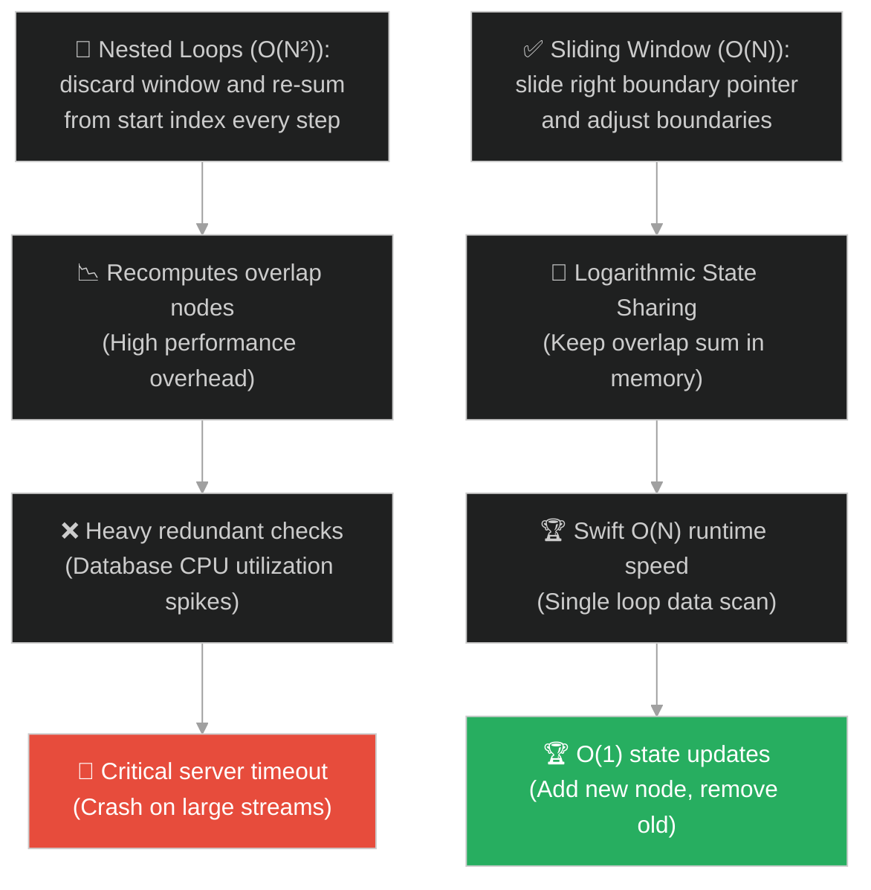
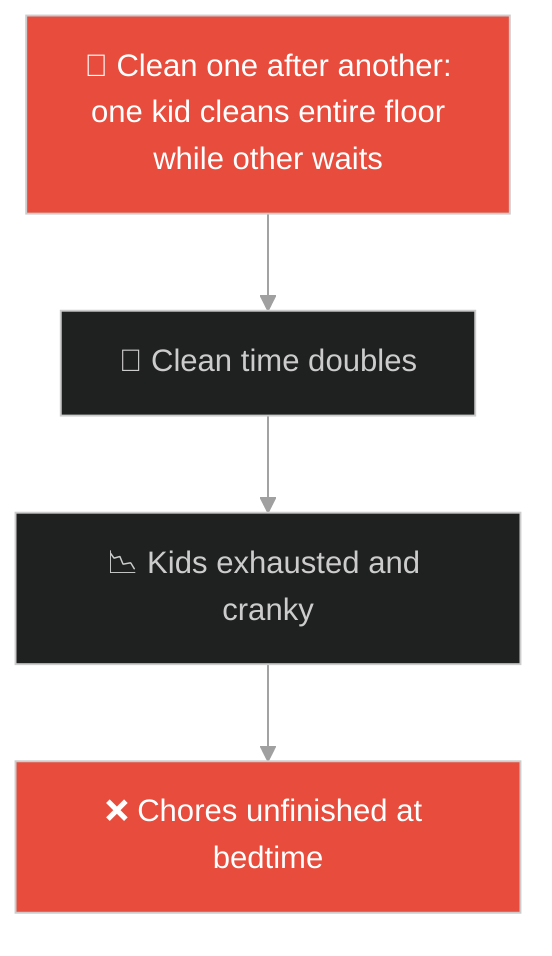
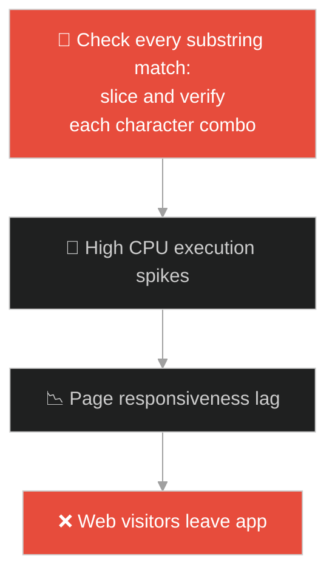
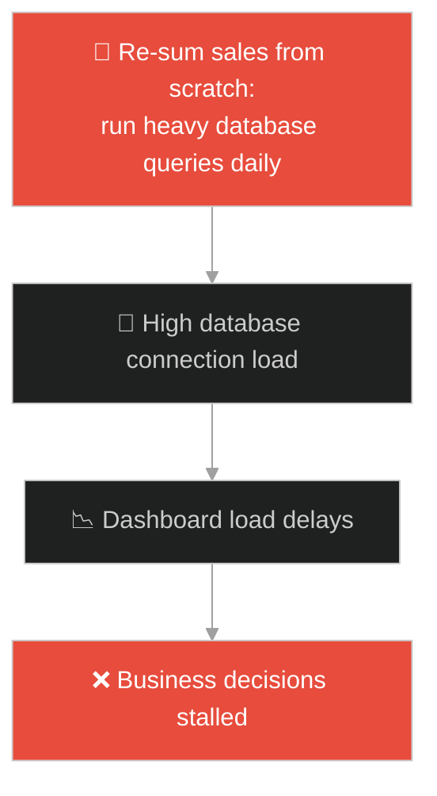
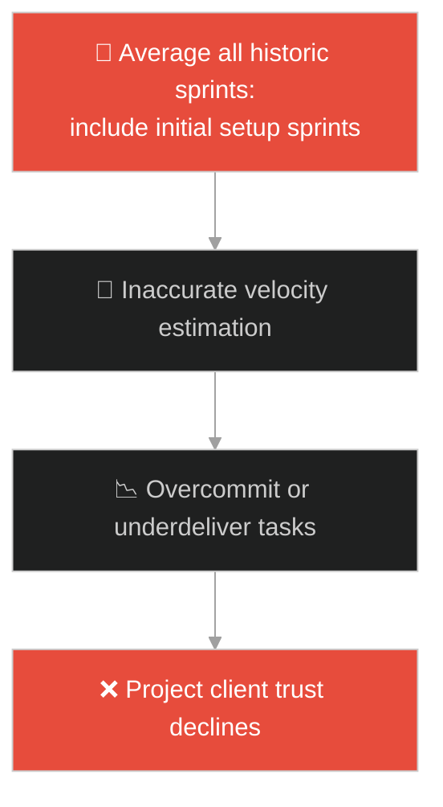
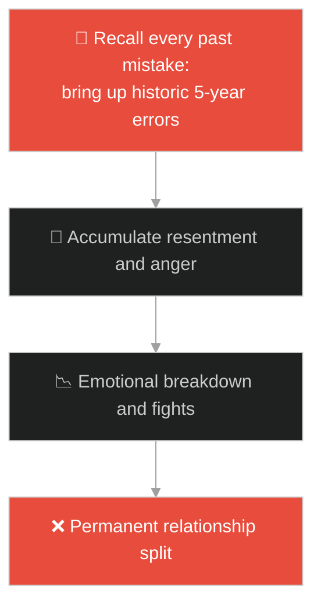
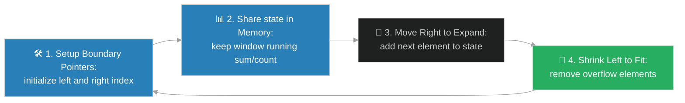

# Two Pointers & Sliding Window Algorithms (ក្បួនដោះស្រាយចង្អុលពីរ និងប្រអប់រំកិល)៖ កែវយឺតរបស់អ្នកថតរូប (Two Pointers & Sliding Window & The Photographer's Lens)

**Author:** ichamrong  
**Date:** 2026-05-28  
**Tags:** #dsa #algorithms #sliding-window #two-pointers #parable  
**Category:** Concepts / Parables  
**Read Time:** ~15 min  

---

## 📌 មាតិកា (Table of Contents)
- [អន្ទាក់ផ្លូវចិត្ត (The Trap)](#0)
- [១. រឿងព្រេងនិទាន៖ វិចិត្រករ និងស៊ុមរូបភាពរំកិល O(N) (The Legend of the Painter and the Sliding Lens)](#1)
  - [យន្តការចង្អុលពីរសម្រាប់ការជួបគ្នាកណ្តាល (Two Pointers for Converging Search)](#1-1)
- [២. បញ្ហា៖ ការគណនាជាន់គ្នាច្រើនដង និងបន្ទុក CPU O(N²) (The Issue: Expensive Overlapping Computations and O(N²) Overhead)](#2)
- [៣. ឧទាហមណ៍ជាក់ស្តែងក្នុងពិភពពិត (Real World Examples)](#3)
  - [ឧទាហរណ៍ទី ១ — កម្រិតស្រាល (គ្រួសារ)៖ កូនពីរនាក់សម្អាតផ្ទះជួបគ្នាកណ្តាល (Two Kids Cleaning Room from Ends)](#3-1)
  - [ឧទាហរណ៍ទី ២ — កម្រិតមធ្យម (បច្ចេកទេស)៖ ការស្វែងរកផលបូកគោលដៅ និងអក្សរមិនជាន់គ្នា (Sum Targeting and Unique Substrings)](#3-2)
  - [ឧទាហរណ៍ទី ៣ — កម្រិតមធ្យម (ធុរកិច្ច)៖ ការវិភាគសកម្មភាពទិញទំនិញ ៣០ ថ្ងៃឌីណាមិក (Rolling 30-Day Purchase Activity)](#3-3)
  - [ឧទាហរណ៍ទី ៤ — កម្រិតមធ្យម (សង្គម/គ្រប់គ្រង)៖ ការវាស់ស្ទង់ល្បឿនការងាររបស់ក្រុម (Measuring Sprint Team Velocity)](#3-4)
  - [ឧទាហរណ៍ទី ៥ — កម្រិតធ្ងន់ (ទំនាក់ទំនង)៖ ការវាយតម្លៃសុខភាពស្នេហាក្នុងកំឡុងពេលចុងក្រោយ (Rolling Window Relationship Quality)](#3-5)
- [៤. ដំណោះស្រាយទូទៅ៖ ការអនុវត្ត Two Pointers & Sliding Window ក្នុងប្រព័ន្ធ (The General Solution: Two Pointers and Sliding Window Design Patterns)](#4)
- [សេចក្តីសន្និដ្ឋាន (Conclusion)](#5)
- [ឯកសារយោង (References)](#6)
- [Related Posts](#7)

---

<a id="0"></a>
## អន្ទាក់ផ្លូវចិត្ត (The Trap)

តើអ្នកធ្លាប់ជួបបញ្ហាដែលត្រូវគណនាតម្លៃលើផ្នែកជាបន្តបន្ទាប់ (Subarrays) នៃបញ្ជីទិន្នន័យ ហើយអ្នកបានសរសេរ loop ពីរជាន់ (Nested Loops) ធ្វើឱ្យប្រព័ន្ធរត់កាន់តែយឺត O(N²) ខ្លាំងនៅពេលទិន្នន័យកើនឡើងដែរឬទេ?

នៅក្នុងការដោះស្រាយ algorithms៖
* **យើងងាយនឹងធ្លាក់ក្នុងអន្ទាក់** នៃការគណនាតម្លៃដដែលៗឡើងវិញលើផ្នែកដែលជាន់គ្នា (Overlapping computations) ដោយសារតែការលុបចោលស៊ុមទិន្នន័យចាស់ទាំងស្រុង រួចចាប់ផ្តើមគណនាពីដំបូងឡើងវិញ។
* **យើងមើលរំលង** លទ្ធភាពនៃការរក្សាទុកតម្លៃចាស់ រួចគ្រាន់តែដកធាតុចាស់ដែលហួសស៊ុមខាងឆ្វេង (Remove Left) និងបូកបញ្ចូលធាតុថ្មីដែលចូលស៊ុមខាងស្តាំ (Add Right) ក្នុងល្បឿន O(1)។

ការព្យាយាមគណនា Subarrays ឡើងវិញទាំងស្រុងដោយប្រើ Nested Loops ហៅថា **អន្ទាក់គណនាឡើងវិញជាន់គ្នា (Overlapping Recomputation Trap)**។

ដើម្បីយល់ដឹងពីរបៀបគណនាក្នុងល្បឿន O(N) នេះជាផែនទីបង្ហាញផ្លូវ៖
1. **រឿងព្រេងនិទាន (The Legend)** — រឿងរ៉ាវរបស់វិចិត្រករដែលលុបគំនូរចាស់ចោលរាល់ពេលរំកិលទីតាំង ប្រៀបធៀបនឹងអ្នកថតរូបដែលប្រើស៊ុមរំកិល O(1)។
2. **បញ្ហា (The Issue)** — ការវិភាគ Two Pointers (បង្រួមពីសងខាង) និង Sliding Window (ស៊ុមថេរ/ស៊ុមឌីណាមិក) ព្រមទាំងការសន្សំសំចៃទំហំគណនា។
3. **ឧទាហមណ៍ជាក់ស្តែងក្នុងពិភពពិត (Real World Examples)** — ពិនិត្យមើលបញ្ហានេះក្នុងកម្រិតគ្រួសារ បច្ចេកវិទ្យា ធុរកិច្ច ការគ្រប់គ្រង និងទំនាក់ទំនង។
4. **ដំណោះស្រាយទូទៅ (The General Solution)** — លំនាំការសរសេរកូដ Two Pointers និង Sliding Window សម្រាប់វិស្វកម្មប្រព័ន្ធ។



---

<a id="1"></a>
## ១. រឿងព្រេងនិទាន៖ វិចិត្រករ និងស៊ុមរូបភាពរំកិល O(N) (The Legend of the Painter and the Sliding Lens)

កាលពីព្រេងនាយ មានវិចិត្រករម្នាក់ត្រូវបានព្រះរាជាបញ្ជាឱ្យគូរផ្ទាំងគំនូរទេសភាពដ៏វែងអន្លាយមួយនៃព្រះនគរ ដោយក្នុងគំនូរនីមួយៗត្រូវបង្ហាញទេសភាព “៣ ចំណុចជាប់គ្នា” (ដូចជា ភ្នំ-ជ្រលង-ទន្លេ)។

ដំបូងឡើយ៖
* វិចិត្រករដំបូងគេបានគូរ [ភ្នំ, ជ្រលង, ទន្លេ] ចូលក្នុងស៊ុម។ ពេលចង់គូរទេសភាពបន្ទាប់ គាត់បានយកជ័រលុបមកលុប [ជ្រលង និង ទន្លេ] ចេញ រួចគូរវាឡើងវិញរួមផ្សំនឹង [ព្រៃ] បង្កើតបានជាគំនូរ [ជ្រលង, ទន្លេ, ព្រៃ]។
* គាត់ត្រូវលុប និងគូរផ្នែកដែលជាន់គ្នាឡើងវិញរាល់ពេលដែលគាត់រំកិលទៅមុខ (Nested Operations O(N²))។ គាត់ហត់នឿយខ្លាំង និងគូរមិនទាន់ពេលវេលាឡើយ។

---

<a id="1-1"></a>
### យន្តការចង្អុលពីរសម្រាប់ការជួបគ្នាកណ្តាល (Two Pointers for Converging Search)

ដើម្បីជួយសម្រាលការងារ ជំនួយការរបស់គាត់បាននាំយក **កែវយឺតកាមេរ៉ារំកិល (The Sliding Lens)** មកជូន៖
* គាត់ដាក់ស៊ុមឡេនលើ [ភ្នំ, ជ្រលង, ទន្លេ]។ ពេលចង់រំកិលទៅមុខ គាត់មិនបានលុបអ្វីឡើយ គាត់គ្រាន់តែរុញស៊ុមឡេនទៅស្តាំ ១ ចំហាន។
* ភ្លាមនោះ "ភ្នំ" ធ្លាក់ចេញពីស៊ុមខាងឆ្វេង (Remove Left) ហើយ "ព្រៃ" ចូលមកក្នុងស៊ុមខាងស្តាំ (Add Right)។ ទេសភាពកណ្តាល "ជ្រលង និង ទន្លេ" នៅដដែលដោយមិនបាច់គូរឡើងវិញឡើយ O(1)。
* លើសពីនេះ ពេលពួកគេត្រូវស្វែងរកចំណុចផ្គូផ្គងពីរដែលស្ថិតនៅចុងសងខាងនៃបញ្ជីតម្រៀបរួច ពួកគេមិនរត់ Loop ពីរជាន់ទេ។ ពួកគេប្រើមនុស្សពីរនាក់ដើរពីចុងសងខាងមករកគ្នា (Two Pointers: Left & Right) រហូតដល់ជួបគ្នាកណ្តាល (Converging Search) ក្នុងល្បឿន O(N) យ៉ាងរលូន។

---

<a id="2"></a>
## ២. បញ្ហា៖ ការគណនាជាន់គ្នាច្រើនដង និងបន្ទុក CPU O(N²) (The Issue: Expensive Overlapping Computations and O(N²) Overhead)

នៅក្នុងការសរសេរកូដ algorithms ភាពជំពាក់ជំពិននេះកើតឡើងនៅពេលយើងស្វែងរក Sum ធំបំផុតនៃ Subarray ដែលមានប្រវែង $K$៖

```java
// កូដដែលប្រើ loop ពីរជាន់ O(N*K) នាំឱ្យ CPU ឡើងកម្តៅខ្លាំង
public int getMaxSum(int[] arr, int k) {
    int maxSum = 0;
    for (int i = 0; i <= arr.length - k; i++) {
        int currentSum = 0;
        for (int j = i; j < i + k; j++) {
            currentSum += arr[j]; // គណនាធាតុជាន់គ្នាឡើងវិញរាល់ពេល
        }
        maxSum = Math.max(maxSum, currentSum);
    }
    return maxSum;
}
```

* **ការខាតបង់ CPU O(N²):** ប្រសិនបើ Array មានទំហំ ១លានធាតុ ហើយ $K = 1000$ ការសរសេរកូដបែបនេះនឹងរត់ loop រាប់រយលានដង ដែលធ្វើឱ្យ Server ឡើងកម្តៅ និងគាំងភ្លាមៗ (Server Lag/Hang)។
* **ការស្វែងរកគូទិន្នន័យយឺត (Target Sum):** ពេលស្វែងរកគូទិន្នន័យពីរដែលបូកបញ្ចូលគ្នាស្មើ Target ក្នុង Sorted Array ការប្រើ Nested Loops នឹងបង្កឱ្យមានល្បឿនយឺត O(N²) ដោយសារតែការប្រៀបធៀបធាតុគ្រប់គូទាំងអស់។

**Two Pointers & Sliding Window** ដោះស្រាយបញ្ហានេះដោយ៖
* **Two Pointers:** ប្រើប្រាស់ pointer ពីរ (`left` និង `right`) រត់ពីចុងសងខាងមកកណ្តាល ឬរត់ក្នុងល្បឿនខុសគ្នា (Fast-Slow pointers)។
* **Sliding Window:** រក្សាទុកតម្លៃផលបូករបស់ window ចាស់។ ពេលរំកិលទៅមុខ គ្រាន់តែដកធាតុខាងឆ្វេង `arr[i-1]` និងបូកធាតុខាងស្តាំ `arr[i+k-1]` នាំឱ្យល្បឿនគណនាក្នុងជំហាននីមួយៗធ្លាក់ចុះមកត្រឹម O(1) ជានិច្ច។

---

<a id="3"></a>
## ៣. ឧទាហមណ៍ជាក់ស្តែងក្នុងពិភពពិត

---

<a id="3-1"></a>
### ឧទាហមណ៍ទី ១ — កម្រិតស្រាល (គ្រួសារ)៖ កូនពីរនាក់សម្អាតផ្ទះជួបគ្នាកណ្តាល (Two Kids Cleaning Room from Ends)

នៅក្នុងផ្ទះមួយ ម្តាយចង់ឱ្យកូនពីរនាក់សម្អាតឥដ្ឋការ៉ូដ៏វែងមួយ។ ប្រសិនបើគាត់ឱ្យកូនម្នាក់ដើរសម្អាតពីឆ្វេងទៅស្តាំ រួចឱ្យកូនម្នាក់ទៀតដើរពិនិត្យឡើងវិញ (Linear Scan) វានឹងខាតពេល។ ផ្ទុយទៅវិញ គាត់ឱ្យកូនទី១ ចាប់ផ្តើមបោសពីជញ្ជាំងខាងឆ្វេងដើរទៅស្តាំ ហើយកូនទី២ បោសពីជញ្ជាំងខាងស្តាំដើរទៅឆ្វេង (Two Pointers)។ ពួកគេនឹងជួបគ្នាចំកណ្តាលបន្ទប់ រួចបញ្ចប់ការងារក្នុងរយៈពេលលឿនពាក់កណ្តាល។



---

<a id="3-2"></a>
### ឧទាហមណ៍ទី ២ — កម្រិតមធ្យម (បច្ចេកទេស)៖ ការស្វែងរកផលបូកគោលដៅ និងអក្សរមិនជាន់គ្នា (Sum Targeting and Unique Substrings)

នៅក្នុងការសរសេរកម្មវិធី ពេលត្រូវដោះស្រាយបញ្ហាស្វែងរកគូសន្ទស្សន៍ក្នុង Array ដែលមានផលបូកស្មើ Target (Two Sum in Sorted Array) វិស្វករប្រើ Two Pointers រត់រកគ្នា O(N)។ ចំណែកឯបញ្ហាស្វែងរកឃ្លាវែងបំផុតដែលគ្មានតួអក្សរជាន់គ្នា (Longest Substring Without Repeating Characters) ពួកគេប្រើប្រាស់ Dynamic Sliding Window ដើម្បីពង្រីក និងបង្រួមព្រំដែនស៊ុមអក្សរយ៉ាងមានប្រសិទ្ធភាពខ្ពស់បំផុត។



---

<a id="3-3"></a>
### ឧទាហមណ៍ទី ៣ — កម្រិតមធ្យម (ធុរកិច្ច)៖ ការវិភាគសកម្មភាពទិញទំនិញ ៣០ ថ្ងៃឌីណាមិក (Rolling 30-Day Purchase Activity)

នៅក្នុងប្រព័ន្ធគ្រប់គ្រងសន្និធិ (Inventory & Sales Systems) ម្ចាស់អាជីវកម្មត្រូវការវិភាគ "ផលបូកការលក់សរុបក្នុងរយៈពេល ៣០ ថ្ងៃចុងក្រោយ" ជាប្រចាំរាល់ព្រឹក។ ប្រសិនបើប្រព័ន្ធត្រូវ Query និងបូកសរុបទិន្នន័យ ៣០ ថ្ងៃឡើងវិញទាំងស្រុងរាល់ថ្ងៃ វានឹងបង្កបន្ទុកធ្ងន់ដល់ Database។ ប្រព័ន្ធឆ្លាតវៃប្រើប្រាស់ Sliding Window៖ ផលបូកថ្ងៃនេះ = ផលបូកម្សិលមិញ - ផលលក់ថ្ងៃទី៣១ មុន + ផលលក់ថ្ងៃនេះ (O(1) update)។



---

<a id="3-4"></a>
### ឧទាហមណ៍ទី ៤ — កម្រិតមធ្យម (សង្គម/គ្រប់គ្រង)៖ ការវាស់ស្ទង់ល្បឿនការងាររបស់ក្រុម (Measuring Sprint Team Velocity)

នៅក្នុងការគ្រប់គ្រងគម្រោង Agile Scrum ល្បឿនការងាររបស់ក្រុមការងារ (Team Velocity) មិនត្រូវបានគណនាដោយមធ្យមភាគតាំងពីចាប់ផ្តើមគម្រោងរហូតដល់ចប់នោះទេ ព្រោះលក្ខខណ្ឌការងារ និងសមាសភាពក្រុមតែងតែប្រែប្រួល។ ពួកគេប្រើប្រាស់ **Rolling 3-Sprint Window** (មធ្យមភាគនៃ Sprint ៣ ចុងក្រោយបង្អស់) ដើម្បីប៉ាន់ប្រមាណផលិតភាពពិតប្រាកដរបស់ក្រុមការងារសម្រាប់ការរៀបចំគម្រោងបន្ទាប់។



---

<a id="3-5"></a>
### ឧទាហមណ៍ទី ៥ — កម្រិតធ្ងន់ (ទំនាក់ទំនង)៖ ការវាយតម្លៃសុខភាពស្នេហាក្នុងកំឡុងពេលចុងក្រោយ (Rolling Window Relationship Quality)

នៅក្នុងទំនាក់ទំនងស្នេហា ដៃគូជីវិតមិនគួរវាយតម្លៃសុខភាពស្នេហាដោយផ្អែកលើការចងចាំរាល់រឿងរ៉ាវអតីតកាលតាំងពី ៥ ឆ្នាំមុន (Full history scans) ឬផ្អែកលើការប៉ះទង្គិចគ្នាតែមួយចំណុចក្នុងថ្ងៃនេះឡើយ។ ពួកគេគួរប្រើប្រាស់ **ស៊ុមរំកិលយោគយល់ (Rolling Window of past few weeks)**៖ វាយតម្លៃគុណភាពនៃការប្រាស្រ័យទាក់ទងគ្នា និងការយកចិត្តទុកដាក់គ្នាលើរយៈពេល ៧ ថ្ងៃចុងក្រោយ ដើម្បីធ្វើការកែលម្អឥរិយាបថ និងដោះស្រាយការអាក់អន់ចិត្តទាន់ពេលវេលា។



---

<a id="4"></a>
## ៤. ដំណោះស្រាយទូទៅ៖ ការអនុវត្ត Two Pointers & Sliding Window ក្នុងប្រព័ន្ធ (The General Solution: Two Pointers and Sliding Window Design Patterns)

ដើម្បីកាត់បន្ថយកម្រិតស្មុគស្មាញគណនាពី O(N²) មក O(N) វិស្វករត្រូវអនុវត្តគំរូរចនាខាងក្រោម៖



ជំហាននៃការអនុវត្ត៖
1. **រៀបចំចង្អុលព្រំដែន (Setup Boundary Pointers)៖** 
   * **Two Pointers:** កំណត់ `left = 0` និង `right = arr.length - 1` សម្រាប់ករណីបង្រួមពីសងខាង (ធានាទិន្នន័យ Sorted រួច)។
   * **Sliding Window:** កំណត់ `left = 0` និង `right = 0` (ស៊ុមរំកិលចម្ងាយឌីណាមិក)។
2. **រក្សាទុកលទ្ធផលចែករំលែក (State Caching)៖** បង្កើតអថេរដើម្បីរក្សាតម្លៃបច្ចុប្បន្នរបស់ window (ដូចជា `windowSum`, `HashSet` ផ្ទុកតួអក្សរ) ដើម្បីចៀសវាងការគណនាឡើងវិញពីដើម។
3. **ពង្រីកស៊ុមខាងស្តាំ (Expand Right Boundary)៖** ប្រើ loop រុញ `right` pointer ទៅមុខ។ រាល់ពេល `right` កើនឡើង ត្រូវបូកបញ្ចូលតម្លៃធាតុថ្មី `arr[right]` ចូលក្នុង `windowSum` ក្នុងល្បឿន O(1)។
4. **បង្រួមស៊ុមខាងឆ្វេង (Shrink Left Boundary)៖** នៅពេលលក្ខខណ្ឌរបស់ window មិនត្រូវបានបំពេញ (ឧទាហរណ៍ ផលបូកធំជាង target ឬមានតួអក្សរជាន់គ្នា) ត្រូវប្រើ loop រំកិល `left` pointer ទៅមុខ រួចដកតម្លៃធាតុ `arr[left]` ចេញពី `windowSum` មុននឹងបន្តដំណើរការ។

---

## 🐇 ធ្លាក់ចូលក្នុងរន្ធទន្សាយ (Enter the Rabbit Hole)

ដើម្បីស្វែងយល់ពីរបៀបដែលគណៈកម្មការសាលារៀបចំលំដាប់លំដោយសិស្សានុសិស្សរាប់ពាន់នាក់តាមកម្ពស់ ឬពិន្ទុប្រឡង ឱ្យមានសណ្តាប់ធ្នាប់ល្អក្នុងរយៈពេលដ៏ខ្លី ដោយការបែងចែកទិន្នន័យជាចំណែកតូចៗ និងតម្រៀបផ្គុំបញ្ចូលគ្នា (Sorting Algorithms: Merge Sort vs Quick Sort) សូមបន្តដំណើរទៅកាន់៖

* 🚀 **[ចាប់ផ្តើមដំណើររុករក (Start the Journey) ➔ Sorting Algorithms and the Graduating Class](./107-the-graduating-class.md)**

---

<a id="5"></a>
## សេចក្តីសន្និដ្ឋាន (Conclusion)

> **«ការចេះចែករំលែក និងប្រើប្រាស់ការគណនាចាស់ឡើងវិញ ជួយឱ្យយើងឆ្លងកាត់រាល់បញ្ហាធំៗបានយ៉ាងឆាប់រហ័ស»**

ការអនុវត្ត Two Pointers និង Sliding Window ជួយលុបបំបាត់ការគណនាស្ទួនជាច្រើនដង បំប្លែង algorithms ដែលមានល្បឿនយឺត O(N²) ឱ្យមក O(N) ជួយសន្សំសំចៃធនធានម៉ាស៊ីន និងធានាស្ថិរភាពខ្ពស់សម្រាប់ Web App ទំនើបៗ។

---

<a id="6"></a>
## ឯកសារយោង (References)

* **Knuth, D. E.** — *The Art of Computer Programming, Volume 3: Sorting and Searching* (1998). Array indexing patterns, sub-segment optimizations, and windowing methods.
* **Cormen, T. H., Leiserson, C. E., Rivest, R. L., & Stein, C.** — *Introduction to Algorithms* (2009). Two pointers search, sliding windows bounds, and runtime complexity analyses.

---

<a id="7"></a>
## Related Posts

* [[DSA: Two Pointers & Sliding Window](../dsa/03-algorithms.md#2-two-pointers--sliding-window)] — ការពន្យល់លម្អិត និងស៊ីជម្រៅអំពី Two Pointers និង Sliding Window ក្នុង DSA។
* [[Binary Search Algorithm & The Dictionary of Secrets](./105-the-dictionary-of-secrets.md)] — ការប្រៀបធៀបល្បឿន O(log N) របស់ Binary Search ជាមួយនឹងល្បឿន O(N) របស់ Sliding Window algorithms។
