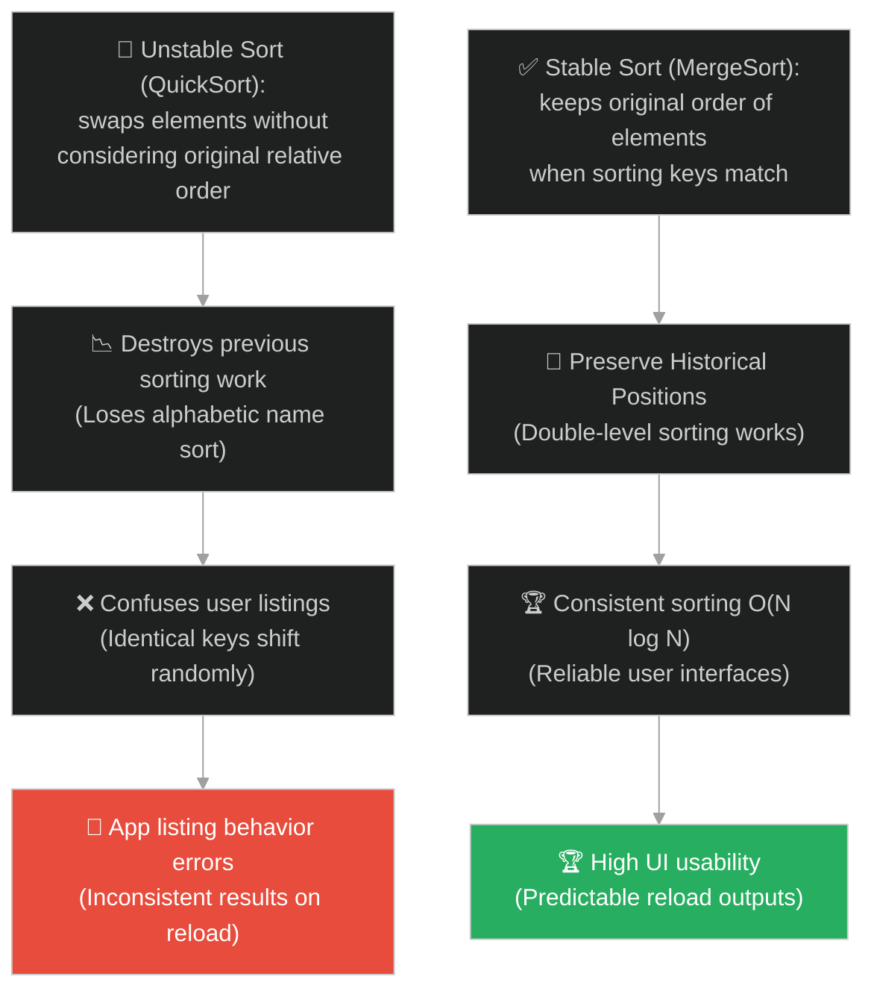
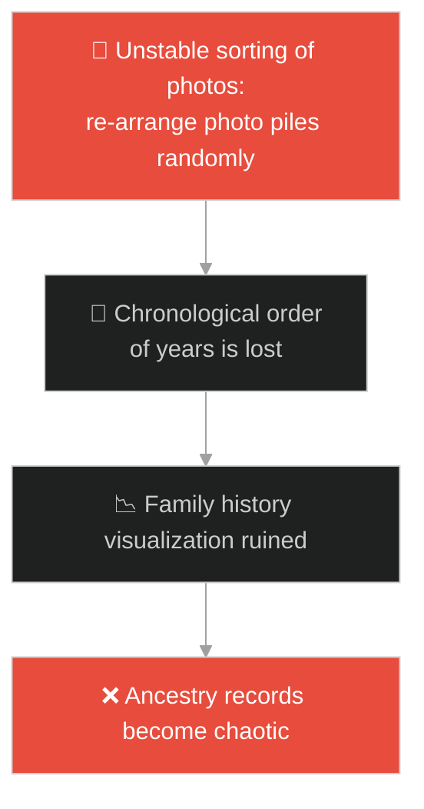
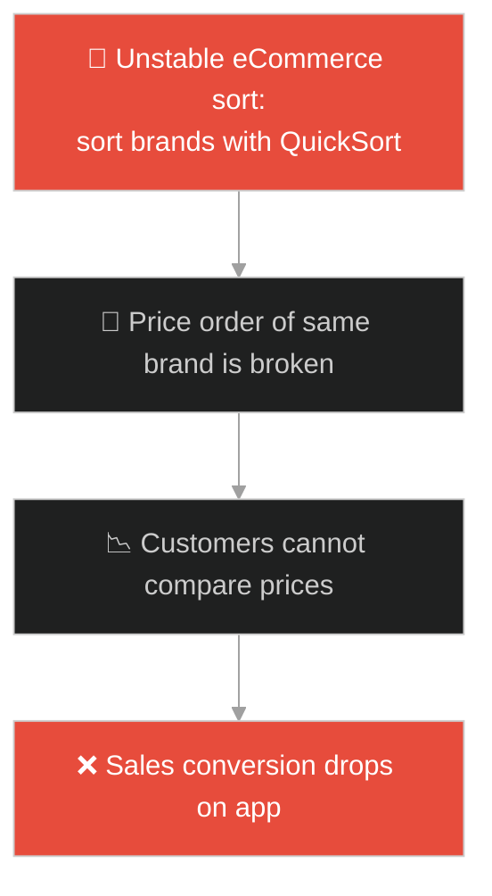
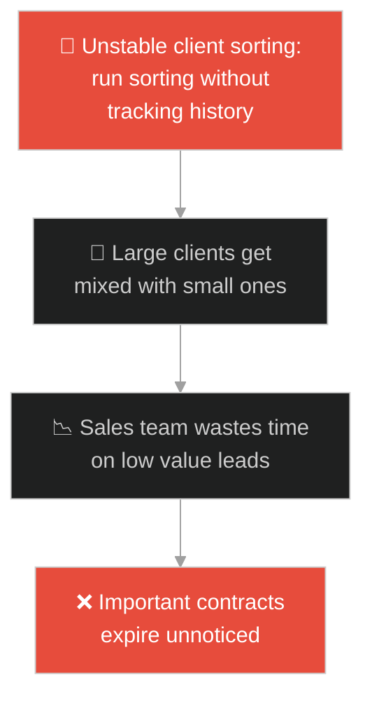
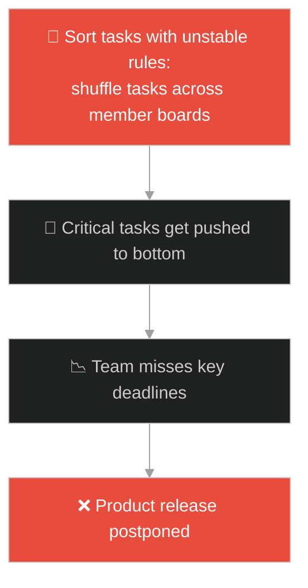
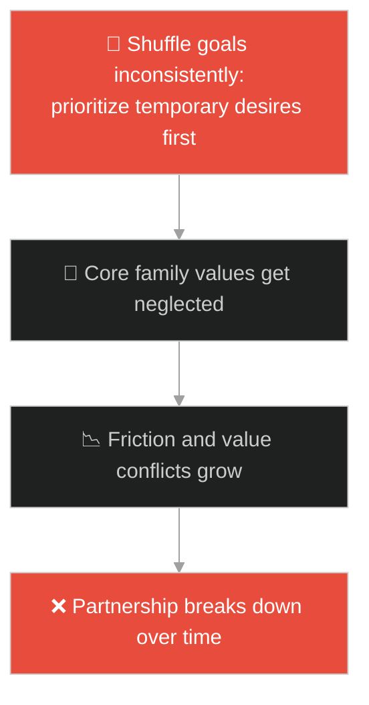

# Sorting Algorithms & Stability (ក្បួនដោះស្រាយតម្រៀបទិន្នន័យ និងស្ថិរភាព)៖ ជួរនិស្សិតបញ្ចប់ការសិក្សា (Sorting Algorithms & Stability & The Graduating Class)

**Author:** ichamrong  
**Date:** 2026-05-28  
**Tags:** #dsa #algorithms #sorting-stability #sorting #parable  
**Category:** Concepts / Parables  
**Read Time:** ~15 min  

---

## 📌 មាតិកា (Table of Contents)
- [អន្ទាក់ផ្លូវចិត្ត (The Trap)](#0)
- [១. រឿងព្រេងនិទាន៖ សាលាប្រគល់សញ្ញាបត្រ និងជួរអក្ខរក្រមដ៏ច្របូកច្របូក (The Legend of the Graduation Order and Sorting Mess)](#1)
  - [ស្ថិរភាពជួរ និងការដោះស្រាយកិច្ចការស្មើគ្នា (Stability and Handling Identical Values)](#1-1)
- [២. បញ្ហា៖ ការបំផ្លាញលំដាប់តម្រៀបចាស់ និងការខាតបង់ថាមពលគណនា (The Issue: Multi-key Sort Failures and Unstable Algorithm Limits)](#2)
- [៣. ឧទាហមណ៍ជាក់ស្តែងក្នុងពិភពពិត (Real World Examples)](#3)
  - [ឧទាហរណ៍ទី ១ — កម្រិតស្រាល (គ្រួសារ)៖ ការរៀបចំអាល់ប៊ុមរូបថតគ្រួសារ (Family Photo Album Sorting)](#3-1)
  - [ឧទាហរណ៍ទី ២ — កម្រិតមធ្យម (បច្ចេកទេស)៖ ការតម្រៀបទំនិញអេឡិចត្រូនិចតាមលក្ខខណ្ឌច្រើនតង់ (Multi-column e-Commerce Sorting)](#3-2)
  - [ឧទាហរណ៍ទី ៣ — កម្រិតមធ្យម (ធុរកិច្ច)៖ ការចាត់ចែងទិន្នន័យអតិថិជនតាមលំដាប់លក់ចេញ (Customer Sales Volume Sorting)](#3-3)
  - [ឧទាហរណ៍ទី ៤ — កម្រិតមធ្យម (សង្គម/គ្រប់គ្រង)៖ ការរៀបចំអាទិភាពកិច្ចការងាររបស់ក្រុម (Agile Task Sorting)](#3-4)
  - [ឧទាហរណ៍ទី ៥ — កម្រិតធ្ងន់ (ទំនាក់ទំនង)៖ ការកំណត់គោលដៅរួមគ្នាប្រចាំឆ្នាំ (Prioritizing Shared Relationship Goals)](#3-5)
- [៤. ដំណោះស្រាយទូទៅ៖ ការអនុវត្ត Stable Sort ក្នុងវិស្វកម្មប្រព័ន្ធ (The General Solution: Implementing Stable Sort and Multi-key Comparators)](#4)
- [សេចក្តីសន្និដ្ឋាន (Conclusion)](#5)
- [ឯកសារយោង (References)](#6)
- [Related Posts](#7)

---

<a id="0"></a>
## អន្ទាក់ផ្លូវចិត្ត (The Trap)

តើអ្នកធ្លាប់ជួបបញ្ហាដែលត្រូវតម្រៀបបញ្ជីទិន្នន័យតាមលក្ខខណ្ឌពីរផ្សេងគ្នាបន្តបន្ទាប់គ្នា (ដូចជា តម្រៀបតាមឈ្មោះមុន រួចតម្រៀបតាមពិន្ទុក្រោយ) ហើយការតម្រៀបលើកទីពីរបានបំផ្លាញសណ្តាប់ធ្នាប់អក្សរនៃការតម្រៀបលើកទីមួយទាំងស្រុងដែរឬទេ?

នៅក្នុងការតម្រៀបទិន្នន័យ៖
* **យើងងាយនឹងធ្លាក់ក្នុងអន្ទាក់** នៃការគិតថា "ក្បួនតម្រៀប (Sorting Algorithm)" ទាំងអស់ដំណើរការដូចគ្នា ឱ្យតែលទ្ធផលចេញមក Sorted គឺគ្រប់គ្រាន់ហើយ ដែលនាំឱ្យប្រព័ន្ធផ្តល់លទ្ធផលមិនត្រឹមត្រូវ និងច្របូកច្របល់ដល់អ្នកប្រើប្រាស់។
* **យើងមើលរំលង** គំនិតនៃ "ស្ថិរភាពតម្រៀប (Sorting Stability)" ដែលជួយរក្សាទីតាំងចាស់របស់ធាតុដែលមានតម្លៃស្មើគ្នា ដើម្បីកុំឱ្យប៉ះពាល់ដល់ការតម្រៀបដំណាក់កាលមុន។

ការព្យាយាមរៀបចំទិន្នន័យច្រើនជួរដោយប្រើប្រាស់ក្បួនតម្រៀបដែលគ្មានស្ថិរភាព (Unstable Sort) ហៅថា **អន្ទាក់បំផ្លាញសណ្តាប់ធ្នាប់តម្រៀបចាស់ (Sorting Destruction Trap)**។

ដើម្បីយល់ដឹងពីរបៀបតម្រៀបទិន្នន័យប្រកបដោយស្ថិរភាព នេះជាផែនទីបង្ហាញផ្លូវ៖
1. **រឿងព្រេងនិទាន (The Legend)** — រឿងរ៉ាវរបស់សិស្សបញ្ចប់ការសិក្សាដែលជួបការរៀបចំជួរដ៏ច្របូកច្របល់របស់គ្រូដែលមិនខ្វល់ពីប្រវត្តិជួរចាស់។
2. **បញ្ហា (The Issue)** — ការវិភាគ Stable vs Unstable Sorting, ភាពខុសគ្នារវាង Merge Sort (Stable) និង Quick Sort (Unstable) ក្នុង OOP។
3. **ឧទាហមណ៍ជាក់ស្តែងក្នុងពិភពពិត (Real World Examples)** — ពិនិត្យមើលគំនិតនេះក្នុងកម្រិតគ្រួសារ បច្ចេកវិទ្យា ធុរកិច្ច ការគ្រប់គ្រង និងទំនាក់ទំនង។
4. **ដំណោះស្រាយទូទៅ (The General Solution)** — ការបង្កើត Multi-key Comparator និងការជ្រើសរើស Sorting Algorithms ឱ្យសមស្របនឹងប្រព័ន្ធ។



---

<a id="1"></a>
## ១. រឿងព្រេងនិទាន៖ សាលាប្រគល់សញ្ញាបត្រ និងជួរអក្ខរក្រមដ៏ច្របូកច្របូក (The Legend of the Graduation Order and Sorting Mess)

កាលពីព្រេងនាយ មានសាលាដ៏ល្បីល្បាញមួយរៀបចំពិធីប្រគល់សញ្ញាបត្រជូននិស្សិតបញ្ចប់ការសិក្សា។ ដើម្បីរៀបចំឱ្យមានសណ្តាប់ធ្នាប់ នាយកសាលាបានប្រាប់ឱ្យរៀបចំសិស្សឱ្យឈរតាមអក្ខរក្រមឈ្មោះ (A-Z)។

ជួរដំបូងឡើយ៖
* `Alice (ពិន្ទុ A+)`, `Bob (ពិន្ទុ A+)`, `Charlie (ពិន្ទុ B)` ត្រូវបានរៀបរៀបចំយ៉ាងត្រឹមត្រូវ។ `Alice` ឈរនៅមុខ `Bob` ព្រោះអក្សរ A មកមុន B។
* រំពេចនោះ នាយកសាលាផ្លាស់ប្តូរចិត្ត៖ *"តម្រៀបពួកគេតាមពិន្ទុប្រឡងវិញ (អ្នកពិន្ទុខ្ពស់នៅមុខគេ)!"*
* លោកគ្រូម្នាក់ដែលប្រើវិធី **Unstable Sort (ក្បួនគ្មានស្ថិរភាព)** បានចាប់ទាញសិស្សឱ្យផ្លាស់ប្តូរទីតាំងគ្នា។

---

<a id="1-1"></a>
### ស្ថិរភាពជួរ និងការដោះស្រាយកិច្ចការស្មើគ្នា (Stability and Handling Identical Values)

ក្រោយពេលរៀបចំចប់៖
* ស្រាប់តែ `Bob` ត្រូវផ្លាស់ប្តូរមកឈរនៅខាងមុខ `Alice` វិញ ទោះបីជាអ្នកទាំងពីរមានពិន្ទុ A+ ដូចគ្នាក៏ដោយ។ 
* ក្បួនគ្មានស្ថិរភាពនេះគិតតែពីការ Swap ធាតុរហូតដល់ចប់ ដោយមិនខ្វល់ថា `Alice` ធ្លាប់ឈរនៅមុខ `Bob` កាលពីពេលរៀបចំតាមអក្ខរក្រមឡើយ។
* `Alice` មានអារម្មណ៍ខកចិត្ត និងអាក់អន់ចិត្តយ៉ាងខ្លាំង ព្រោះនាងមានអារម្មណ៍ថា សណ្តាប់ធ្នាប់ និងសិទ្ធិរបស់នាងត្រូវបានរំលោភបំពាន។
* ឃើញដូចនោះ នាយកសាលាបានឱ្យលោកគ្រូម្នាក់ទៀតរៀបចំសារជាថ្មីដោយប្រើ **Stable Sort (ក្បួនមានស្ថិរភាព)**។ លោកគ្រូបានចែងច្បាប់ថា៖ *"បើពិន្ទុស្មើគ្នា ខ្ញុំត្រូវរក្សាលំដាប់ចាស់របស់ពួកគេឱ្យដដែល"*។
* តាមរបៀបនេះ `Alice` បានត្រឡប់មកឈរនៅមុខ `Bob` ដូចដើម។ និស្សិតទាំងអស់សប្បាយរីករាយ ហើយពិធីប្រគល់សញ្ញាបត្រត្រូវបានប្រព្រឹត្តទៅប្រកបដោយសណ្តាប់ធ្នាប់ខ្ពស់។

---

<a id="2"></a>
## ២. បញ្ហា៖ ការបំផ្លាញលំដាប់តម្រៀបចាស់ និងការខាតបង់ថាមពលគណនា (The Issue: Multi-key Sort Failures and Unstable Algorithm Limits)

នៅក្នុងការសរសេរកូដ OOP ភាពជំពាក់ជំពិនកើតឡើងនៅពេលយើងសរសេរកូដតម្រៀប Object ក្នុង List តាមលក្ខខណ្ឌច្រើនជាន់ (ដូចជា តម្រៀបតាមតំលៃទំនិញ និង rating)៖

```java
// កូដដែលតម្រៀប Object ដោយមិនខ្វល់ពីស្ថិរភាព
public void sortProducts(List<Product> products) {
    // តម្រៀបតាមតំលៃជាមុន
    products.sort(Comparator.comparingDouble(Product::getPrice));
    
    // បន្ទាប់មកតម្រៀបតាម Rating ផ្កាយដោយប្រើ QuickSort 
    unstableQuickSortByRating(products); 
    // ការតម្រៀបលើកទី២ នឹងកម្ទេចលំដាប់តម្លៃដែលបានតម្រៀបរួច!
}
```

* **ការបាត់បង់លំដាប់តម្រៀបចាស់ (Lost State)៖** ប្រសិនបើ `Product A` និង `Product B` មាន ៥ ផ្កាយដូចគ្នា ប៉ុន្តែ A មានតម្លៃ $១០$ ដុល្លារ ហើយ B មានតម្លៃ $៥០$ ដុល្លារ។ ក្រោយការតម្រៀបលើកទី២ B អាចនឹងលោតទៅមុខ A វិញ ធ្វើឱ្យការតម្រៀបតម្លៃដំបូងក្លាយជាឥតប្រយោជន៍។
* **ភាពមិនស៊ីសង្វាក់គ្នានៃលទ្ធផល (Inconsistent Output)៖** នៅពេលអ្នកប្រើប្រាស់ចុច Reload ទំព័រដដែល ធាតុដែលមានតម្លៃស្មើគ្នាអាចនឹងលោតចុះឡើងឥតឈប់ឈរ ធ្វើឱ្យប៉ះពាល់ដល់បទពិសោធន៍អ្នកប្រើប្រាស់យ៉ាងធ្ងន់ធ្ងរ។

**Stable Sorting Algorithms** (ដូចជា Merge Sort, Insertion Sort, Timsort) ធានាថារក្សាទីតាំងចាស់របស់ធាតុដែលមានតម្លៃស្មើគ្នាជានិច្ច។

---

<a id="3"></a>
## ៣. ឧទាហមណ៍ជាក់ស្តែងក្នុងពិភពពិត

---

<a id="3-1"></a>
### ឧទាហមណ៍ទី ១ — កម្រិតស្រាល (គ្រួសារ)៖ ការរៀបចំអាល់ប៊ុមរូបថតគ្រួសារ (Family Photo Album Sorting)

នៅក្នុងផ្ទះមួយ កូនប្រុសម្នាក់ចង់រៀបចំរូបថតគ្រួសារទាំងអស់ក្នុងប្រអប់ឱ្យមានសណ្តាប់ធ្នាប់។ ដំបូងគាត់តម្រៀបរូបថតតាម "ឆ្នាំថត"។ បន្ទាប់មកគាត់ចង់តម្រៀបតាម "សមាជិកដែលលេចមុខក្នុងរូប"។ បើសិនជាគាត់ប្រើវិធីគ្មានស្ថិរភាព ពេលគាត់រៀបចំតាមសមាជិក រូបថតទាំងនោះនឹងលែងស្ថិតក្នុងលំដាប់ "ឆ្នាំថត" ទៀតហើយ ធ្វើឱ្យប្រព័ន្ធគ្រប់គ្រងរូបថតគ្រួសារច្របូកច្របល់។



---

<a id="3-2"></a>
### ឧទាហមណ៍ទី ២ — កម្រិតមធ្យម (បច្ចេកទេស)៖ ការតម្រៀបទំនិញអេឡិចត្រូនិចតាមលក្ខខណ្ឌច្រើនតង់ (Multi-column e-Commerce Sorting)

នៅក្នុងគេហទំព័រលក់ទំនិញអនឡាញ (Amazon, Taobao) អតិថិជនតែងតែចង់តម្រៀបទំនិញតាម "តម្លៃទាបទៅខ្ពស់" និងចង់បន្តតម្រៀបតាម "ម៉ាកយីហោ"។ Web Server ត្រូវតែប្រើប្រាស់ Stable Sort (ដូចជា Timsort ក្នុង Java/Python/V8 JavaScript) ដើម្បីធានាថា ទំនិញដែលមកពីម៉ាកយីហោដដែល នៅតែរក្សាបាននូវការតម្រៀបតម្លៃពីទាបទៅខ្ពស់ដដែល។



---

<a id="3-3"></a>
### ឧទាហមណ៍ទី ៣ — កម្រិតមធ្យម (ធុរកិច្ច)៖ ការចាត់ចែងទិន្នន័យអតិថិជនតាមលំដាប់លក់ចេញ (Customer Sales Volume Sorting)

នៅក្នុងអាជីវកម្ម B2B ផ្នែកលក់ត្រូវការតម្រៀបបញ្ជីអតិថិជនតាម "ប្រទេស" ជាមុន រួចបន្តតម្រៀបតាម "ទំហំនៃការបញ្ជាទិញ (Sales Volume)"។ ការប្រើប្រាស់ Stable Sort ធានាថា ក្នុងប្រទេសនីមួយៗ អតិថិជនធំៗត្រូវបានបង្ហាញនៅលើគេបង្អស់ ជួយឱ្យភ្នាក់ងារលក់អាចកំណត់គោលដៅ និងថែទាំអតិថិជនសំខាន់ៗបានយ៉ាងត្រឹមត្រូវ។



---

<a id="3-4"></a>
### ឧទាហមណ៍ទី ៤ — កម្រិតមធ្យម (សង្គម/គ្រប់គ្រង)៖ ការរៀបចំអាទិភាពកិច្ចការងាររបស់ក្រុម (Agile Task Sorting)

នៅក្នុងការគ្រប់គ្រងក្រុមការងារ កិច្ចការងារត្រូវបានតម្រៀបតាម "សមាជិកដែលត្រូវទទួលខុសត្រូវ" ជាមុន រួចតម្រៀបតាម "កម្រិតអាទិភាព (Priority: High, Medium, Low)"។ ការប្រើប្រាស់ Stable Sort ជួយឱ្យកិច្ចការងាររបស់បុគ្គលិកម្នាក់ៗនៅតែរក្សាបាននូវលំដាប់អាទិភាពពីខ្ពស់ទៅទាបដដែល ជួយឱ្យអ្នកគ្រប់គ្រង និងក្រុមការងារមើលឃើញផែនការងារបានយ៉ាងច្បាស់លាស់។



---

<a id="3-5"></a>
### ឧទាហមណ៍ទី ៥ — កម្រិតធ្ងន់ (ទំនាក់ទំនង)៖ ការកំណត់គោលដៅរួមគ្នាប្រចាំឆ្នាំ (Prioritizing Shared Relationship Goals)

នៅក្នុងជីវិតអាពាហ៍ពិពាហ៍ ដៃគូជីវិតតែងតែរៀបចំ "បញ្ជីគោលដៅប្រចាំឆ្នាំ" (ដូចជា ការសន្សំលុយទិញផ្ទះ ការដើរកម្សាន្ត ការថែទាំសុខភាព)។ ពួកគេតម្រៀបគោលដៅតាម "តម្លៃស្នូល" ជាមុន រួចតម្រៀបតាម "ពេលវេលាត្រូវអនុវត្ត"។ ការប្រើប្រាស់គំនិត Stable Sort ជួយឱ្យពួកគេធានាថា រាល់គោលដៅដែលត្រូវអនុវត្តបន្ទាន់ នៅតែធានាមិនឱ្យប៉ះពាល់ដល់តម្លៃស្នូលរួម (Core values) របស់គ្រួសារឡើយ នាំមកនូវសេចក្តីសុខ និងការយោគយល់គ្នាខ្ពស់។



---

<a id="4"></a>
## ៤. ដំណោះស្រាយទូទៅ៖ ការអនុវត្ត Stable Sort ក្នុងវិស្វកម្មប្រព័ន្ធ (The General Solution: Implementing Stable Sort and Multi-key Comparators)

ដើម្បីរក្សាស្ថិរភាពទិន្នន័យ និងសម្រេចបាននូវការតម្រៀបត្រឹមត្រូវ វិស្វករត្រូវអនុវត្តយន្តការដូចខាងក្រោម៖


ជំហាននៃការអនុវត្ត៖
1. **ជ្រើសរើស Sorting Algorithm ដែលមានស្ថិរភាព (Stable Algorithms)៖**
   * **Merge Sort:** ដំណើរការតម្រៀប O(N log N) ជានិច្ច និងមានស្ថិរភាពខ្ពស់ ប៉ុន្តែត្រូវការ Memory បន្ថែម O(N)។
   * **Timsort:** ក្បួនតម្រៀបកូនកាត់ (Hybrid of Merge & Insertion Sort) ដែលប្រើប្រាស់ក្នុង Java, Python, V8 JavaScript ដែលមានស្ថិរភាព និងដំណើរការលឿនបំផុតលើទិន្នន័យពិត O(N)。
   * ជៀសវាងការប្រើប្រាស់ **Quick Sort** ឬ **Heap Sort** សម្រាប់ការតម្រៀបទិន្នន័យដែលត្រូវការរក្សាស្ថិរភាព។
2. **រចនា Comparators ជាមួយ Tie-breakers៖** នៅពេលសរសេរកូដប្រៀបធៀប Object ត្រូវប្រាកដថា Comparator មានលក្ខខណ្ឌដោះស្រាយ Tie (តម្លៃស្មើគ្នា) ច្បាស់លាស់៖
   ```java
   Comparator<Product> stableComparator = (p1, p2) -> {
       int result = Integer.compare(p1.getRating(), p2.getRating());
       if (result == 0) {
           // បើ rating ស្មើគ្នា ប្រើប្រាស់ price ជា tie-breaker
           return Double.compare(p1.getPrice(), p2.getPrice());
       }
       return result;
   };
   ```
3. **សរសេរកូដតម្រៀបទិន្នន័យច្រើនជាន់ (Multi-level Comparator Chaining)៖** នៅក្នុង Java 8+ យើងអាចសរសេរ Comparator Chaining យ៉ាងងាយស្រួល និងធានាស្ថិរភាព៖
   `products.sort(Comparator.comparing(Product::getBrand).thenComparingDouble(Product::getPrice));`
4. **វាយតម្លៃរវាង Time and Space Complexity៖** ប្រសិនបើឧបករណ៍ចល័ត (Mobile Device) មាន Memory កំណត់ខ្លាំង ការប្រើប្រាស់ Merge Sort អាចបណ្តាលឱ្យកើត OutOfMemory។ ក្នុងករណីនេះ វិស្វករត្រូវប្រើប្រាស់ In-place Unstable Sort ប៉ុន្តែត្រូវរចនា Comparator ឱ្យយក "Index ដើម" របស់ Object មកធ្វើជា Tie-breaker ដើម្បីបង្កើតស្ថិរភាពសិប្បនិម្មិត (Artificial Stability)។

---

## 🐇 ធ្លាក់ចូលក្នុងរន្ធទន្សាយ (Enter the Rabbit Hole)

ដើម្បីស្វែងយល់ពីរបៀបដែលស្ថាបត្យករប្រព័ន្ធ ឬអ្នកគណនាគណិតវិទ្យា អាចរក្សាទុក និងគណនាទិន្នន័យដែលមានលំនាំត្រួតគ្នាជាច្រើនដង ដោយការកត់ត្រាលទ្ធផលចាស់ទុកក្នុង Memory (Memoization & Dynamic Programming) ដើម្បីចៀសវាងការគណនាដដែលៗឥតកំណត់ (Overlapping Subproblems) សូមបន្តដំណើរទៅកាន់៖

* 🚀 **[ចាប់ផ្តើមដំណើររុករក (Start the Journey) ➔ Dynamic Programming and the Fibonacci Staircase](./108-the-fibonacci-staircase.md)**

---

<a id="5"></a>
## សេចក្តីសន្និដ្ឋាន (Conclusion)

> **«ស្ថិរភាពនៃការរៀបចំសណ្តាប់ធ្នាប់ ជួយរក្សាបាននូវប្រវត្តិសាស្ត្រ និងការខិតខំប្រឹងប្រែងពីមុនមិនឱ្យបាត់បង់»**

ការប្រើប្រាស់ Sorting Algorithms ដែលមានស្ថិរភាព ជួយធានាឱ្យលទ្ធផលនៃការតម្រៀបទិន្នន័យច្រើនជាន់មានភាពត្រឹមត្រូវ គ្មានការលោតប្រែប្រួលច្របូកច្របល់ និងផ្តល់នូវបទពិសោធន៍ដ៏ល្អឥតខ្ចោះដល់អ្នកប្រើប្រាស់ប្រព័ន្ធ។

---

<a id="6"></a>
## ឯកសារយោង (References)

* **Knuth, D. E.** — *The Art of Computer Programming, Volume 3: Sorting and Searching* (1998). Stable sorting, selection sort, merge sort, and multi-key sorting proofs.
* **Cormen, T. H., Leiserson, C. E., Rivest, R. L., & Stein, C.** — *Introduction to Algorithms* (2009). Sorting algorithms, sorting network stability, and lower bounds of comparison sorts.

---

<a id="7"></a>
## Related Posts

* [[DSA: Sorting Algorithms](../dsa/03-algorithms.md#3-sorting-stability-why-it-matters-in-production)] — ការពន្យល់លម្អិត និងស៊ីជម្រៅអំពី Sorting Algorithms ក្នុង DSA។
* [[Two Pointers & Sliding Window Algorithms & The Photographer's Lens](./106-the-photographers-lens.md)] — របៀបគ្រប់គ្រង Pointers ពីរសម្រាប់ស្វែងរក និងរៀបចំទិន្នន័យ O(N) មុនពេលឈានដល់ការតម្រៀប។
