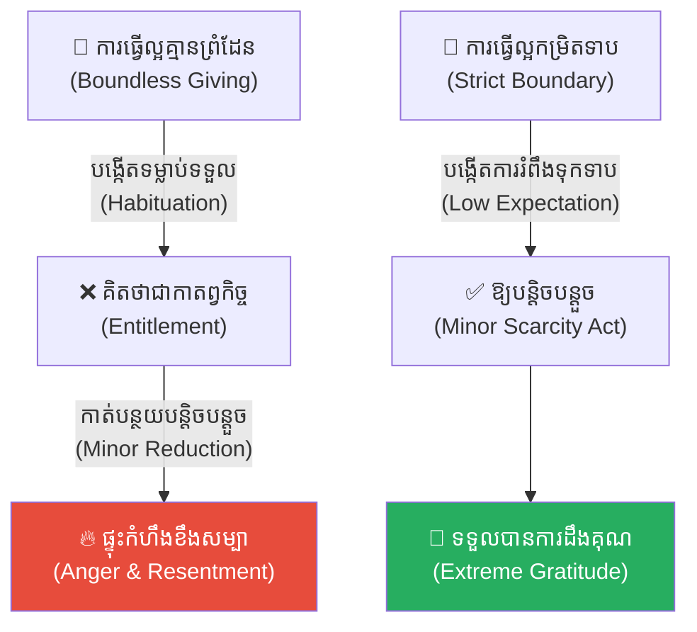
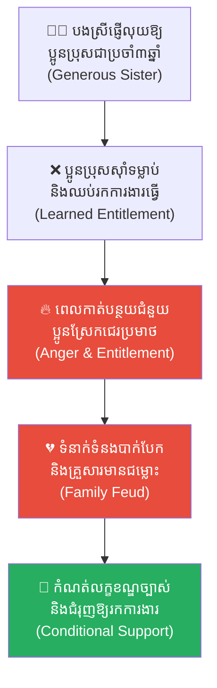
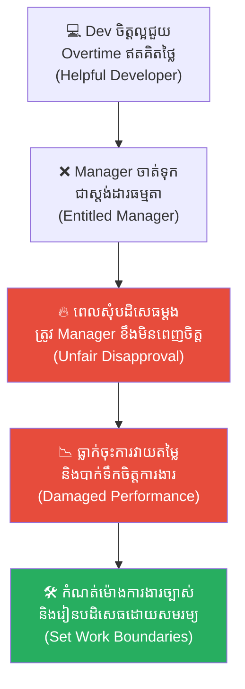
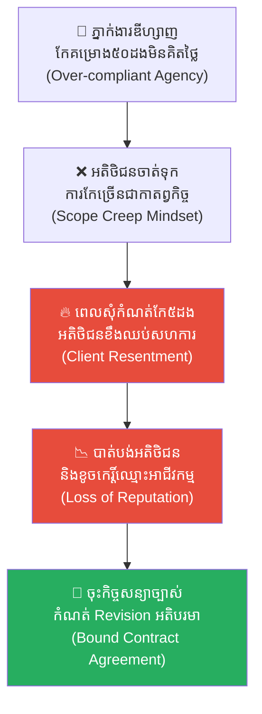
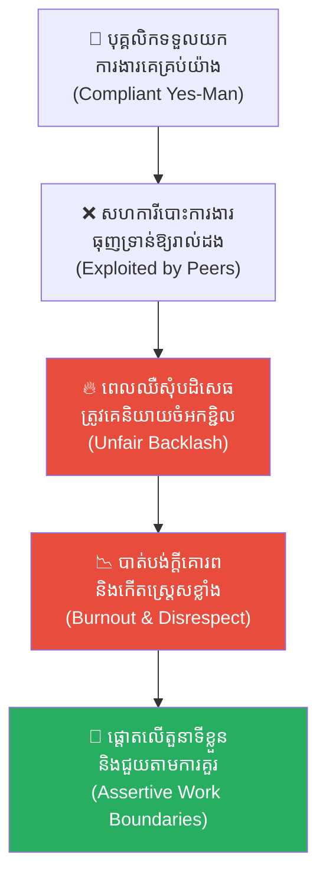
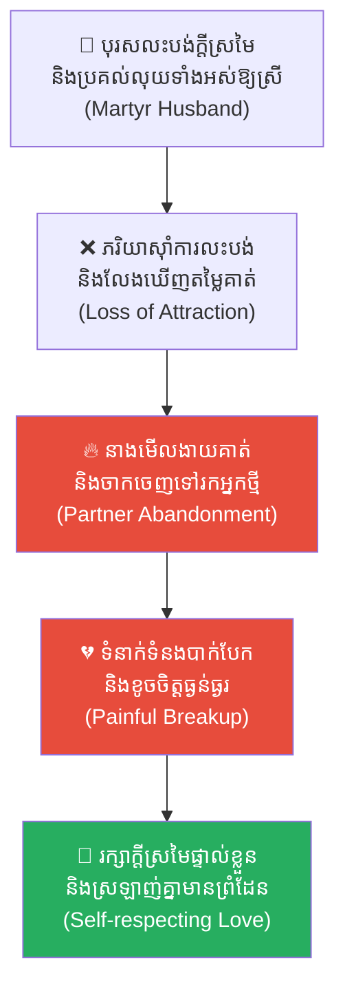
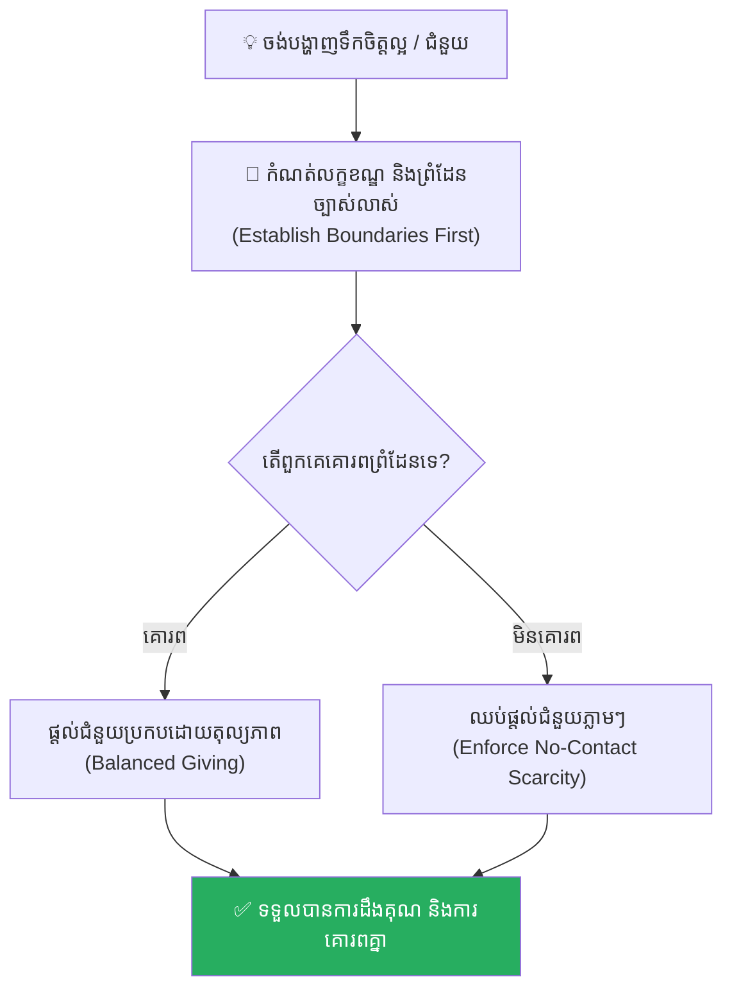

# The Baker and the Butcher (កំហុសនៃភាពល្អ និងការរំពឹងទុក)៖ គ្រោះថ្នាក់នៃការលះបង់គ្មានដែនកំណត់ និងការកសាងមនុស្សលោភលន់គ្មានព្រំដែន

**Author:** ichamrong  
**Date:** 2026-05-17  
**Tags:** #boundaries #human-nature #entitlement #psychology #life-lessons #european-fable #critical-thinking  
**Category:** Concepts  
**Read Time:** ~15 min  

---

## 📌 មាតិកា (Table of Contents)
- [អន្ទាក់ផ្លូវចិត្ត (The Trap)](#អន្ទាក់ផ្លូវចិត្ត-the-trap)
- [១. ម្ចាស់ហាងនំប៉័ងដ៏សប្បុរស លោក ព្យែរ និង លោក ហ្សង់ (Colmar's Fable of Pierre and Jean)](#1)
  - [សាច់មួយដុំ និង លោក ហ្សង់ អ្នកលក់សាច់កំណាញ់ (The Butcher Jean and the Scrap of Meat)](#1-1)
- [២. បញ្ហា៖ គុណមួយសំពៅ ទោសមួយចូលទៅរលាយគុណអស់ (The Paradox of Kindness)](#2)
- [៣. ឧទាហរណ៍ជាក់ស្តែងក្នុងពិភពពិត (Real World Examples)](#3)
  - [ឧទាហរណ៍ទី ១ — កម្រិតស្រាល (គ្រួសារ)៖ ការជួយជ្រោមជ្រែងហិរញ្ញវត្ថុដល់សាច់ញាតិ (The Enabler Parent/Sibling)](#3-1)
  - [ឧទាហរណ៍ទី ២ — កម្រិតមធ្យម (បច្ចេកទេស)៖ Developer ស្លូតបូតដែលឧស្សាហ៍ជួយ Overtime (The Compliant Developer)](#3-2)
  - [ឧទាហរណ៍ទី ៣ — កម្រិតមធ្យម (ធុរកិច្ច)៖ ការផ្តល់សេវាកម្មបន្ថែមដោយឥតគិតថ្លៃឱ្យអតិថិជន (The Scope Creep Illusion)](#3-3)
  - [ឧទាហរណ៍ទី ៤ — កម្រិតមធ្យម (សង្គម/គ្រប់គ្រង)៖ ការយល់ព្រមទទួលរងសម្ពាធការងារជំនួសគេ (The Yes-Man Colleague)](#3-4)
  - [ឧទាហរណ៍ទី ៥ — កម្រិតធ្ងន់ (ទំនាក់ទំនង)៖ ការផ្តល់ក្តីស្រឡាញ់ និងការលះបង់ហួសព្រំដែន (The Martyr Partner Trap)](#3-5)
- [៤. ដំណោះស្រាយទូទៅ៖ ការកំណត់ព្រំដែន និងការគ្រប់គ្រងការរំពឹងទុក (The General Solution: Managing Boundaries)](#4)
- [សេចក្តីសន្និដ្ឋាន (Conclusion)](#conclusion)
- [ឯកសារយោង (References)](#references)
- [Related Posts](#related-posts)

---

## អន្ទាក់ផ្លូវចិត្ត (The Trap)

តើអ្នកធ្លាប់មានអារម្មណ៍ថា ទោះបីជាអ្នកបានប្រឹងប្រែងខំជួយសម្រាលទុក្ខលំបាក ឬលះបង់អ្វីៗគ្រប់យ៉ាងដើម្បីអ្នកដទៃក៏ដោយ ក៏នៅពេលអ្នកបដិសេធសុំមិនជួយតែម្តងគត់ បែរជាត្រូវបានគេកាត់កល និងចោទប្រកាន់ថាជាមនុស្សអាក្រក់ភ្លាមៗដែរឬទេ?

នេះគឺជា **The Baker and the Butcher Dilemma (កំហុសនៃភាពល្អ និងការរំពឹងទុក)**។ 

នៅក្នុងចិត្តវិទ្យារបស់មនុស្ស មានបាតុភូតម្យ៉ាងហៅថា **Habituation (ការទម្លាប់)** និង **Sense of Entitlement (ការយល់ឃើញថាខ្លួនសមនឹងទទួលបាន)**។ នៅពេលយើងផ្តល់ «ភាពល្អ» ឬ «ការលះបង់» ដល់អ្នកដទៃដោយគ្មានដែនកំណត់ និងគ្មានលក្ខខណ្ឌច្បាស់លាស់ ពួកគេនឹងស៊ាំទៅនឹងការ «ទទួល» រហូតដល់ចាត់ទុកថាទង្វើនោះជា «កាតព្វកិច្ចដែលយើងត្រូវតែធ្វើ»។ លុះដល់ពេលដែលយើងលែងមានសមត្ថភាពផ្តល់ឱ្យ ពួកគេមិនត្រឹមតែមិនយល់ចិត្តឡើយ តែថែមទាំងផ្ទុះកំហឹងយ៉ាងខ្លាំង និងបំផ្លាញគុណបំណាច់រាប់ពាន់ដងកន្លងមកចោលភ្លាមៗ។

ដើម្បីយល់ដឹងឱ្យបានគ្រប់ជ្រុងជ្រោយ នេះជាផែនទីបង្ហាញផ្លូវសម្រាប់អត្ថបទនេះ៖
1. **រឿងនិទានអឺរ៉ុបបុរាណ (The European Fable)** — រឿងរ៉ាវរបស់លោក Pierre ម្ចាស់ហាងនំប៉័ងដ៏សប្បុរស និងលោក Jean អ្នកលក់សាច់កំណាញ់នៅទីក្រុង Colmar។
2. **បញ្ហា (The Issue)** — ការវិភាគចិត្តវិទ្យាសង្គមអំពីការរលាយបាត់នៃគុណបំណាច់ និងការបំប៉ោងមហិច្ឆតារបស់មនុស្ស។
3. **ឧទាហរណ៍ជាក់ស្តែងក្នុងពិភពពិត (Real World Examples)** — ពិនិត្យមើលឥទ្ធិពលនេះក្នុងកម្រិតគ្រួសារ ការងារបច្ចេកទេស ធុរកិច្ច ការគ្រប់គ្រង និងទំនាក់ទំនងស្នេហា។
4. **ដំណោះស្រាយទូទៅ (The General Solution)** — វិធីសាស្ត្រកំណត់ «ព្រំដែននៃការធ្វើល្អ» ដើម្បីការពារខ្លួន និងបង្កើតទំនាក់ទំនងសុខភាពល្អ។

---

## ១. ម្ចាស់ហាងនំប៉័ងដ៏សប្បុរស លោក ព្យែរ និង លោក ហ្សង់ (Colmar's Fable of Pierre and Jean)

នៅក្នុងសម័យមជ្ឈិមសម័យ នៅទីប្រជុំជន **កុលម៉ា (Colmar)** នៃទ្វីបអឺរ៉ុប មានម្ចាស់ហាងនំប៉័ងដ៏សប្បុរសម្នាក់ឈ្មោះ **លោក ព្យែរ (Monsieur Pierre)**។ ជារៀងរាល់ថ្ងៃ ពេលឃើញអ្នកសុំទានកម្សត់ៗជាច្រើននៅតាមដងផ្លូវ ដោយក្តីអាណិតអាសូរ មុនពេលបិទទ្វារហាង គាត់តែងតែយកនំប៉័ងបារាំងដែលលក់សល់ ទៅកម្តៅឱ្យក្តៅហុយៗ រួចយកទៅចែកជូនពួកគេបរិភោគដោយឥតគិតថ្លៃ ម្នាក់ៗចំនួនពីរដុំធំ។

នៅថ្ងៃដំបូងៗ អ្នកសុំទានទាំងនោះត្រេកអរយ៉ាងខ្លាំង ពួកគេលុតជង្គង់សំពះ និងអរគុណលោក ព្យែរ ស្ទើរស្រក់ទឹកភ្នែក។ ប៉ុន្តែ មួយខែកន្លងផុតទៅ ពួកគេក៏ចាប់ផ្តើមស៊ាំទម្លាប់នឹងទង្វើនេះ។ ឱ្យតែដល់ម៉ោងបិទហាង ពួកគេនឹងមកឈរចាំទទួលនំប៉័ងដោយស្វ័យប្រវត្តិ ហើយពាក្យថា **«អរគុណ»** ក៏លែងមានឡើយ។ ពួកគេចាត់ទុកការចែកនំប៉័ងនេះដូចជា «ប្រាក់ខែ» ឬជាកាតព្វកិច្ចដែលលោក ព្យែរ ត្រូវតែផ្តល់ឱ្យពួកគេ។

កន្លះឆ្នាំក្រោយមក តម្លៃម្សៅធ្វើនំប៉័ងបានឡើងថ្លៃកប់ពពក ធ្វើឱ្យអាជីវកម្មរបស់លោក ព្យែរ ជួបការលំបាកយ៉ាងខ្លាំង។ ដោយមិនមានលទ្ធភាពទប់ទល់ គាត់ក៏សម្រេចចិត្តកាត់បន្ថយនំប៉័ងដែលចែកឱ្យអ្នកសុំទាន ពីមនុស្សម្នាក់ពីរដុំ មកសល់ត្រឹមម្នាក់មួយដុំវិញ។

គ្រាន់តែឃើញដូច្នេះ ក្រុមអ្នកសុំទានស្រាប់តែផ្ទុះកំហឹងយ៉ាងខ្លាំង។ មានអ្នកសុំទានម្នាក់បានយកនំប៉័ងក្តៅៗនោះ គប់ចោលទៅលើមុខលោក ព្យែរ រួចស្រែកគំហកថា៖ **«ហេតុអ្វីបានជាឯងកាត់បន្ថយអាហាររបស់ពួកយើង? ឯងជាមនុស្សកំណាញ់លួចបន្លំកម្រៃរបស់ពួកយើង!»** នៅក្នុងការប្រកែកគ្នាដ៏តានតឹងនោះ នំប៉័ងទាំងអស់ក៏បានធ្លាក់រាយប៉ាយប្រឡាក់ដីខ្ទេចខ្ទីអស់។ លោក ព្យែរ ឈរស្ងៀមធ្លាក់ទឹកចិត្តយ៉ាងខ្លាំង គាត់នឹកស្មានមិនដល់សោះថា ក្តីមេត្តារបស់គាត់ បែរជាត្រូវបានគេតបស្នងមកវិញបែបនេះសោះ។

---

### សាច់មួយដុំ និង លោក ហ្សង់ អ្នកលក់សាច់កំណាញ់ (The Butcher Jean and the Scrap of Meat)

ផ្ទុយទៅវិញ នៅឯចុងផ្លូវម្ខាងទៀត មានម្ចាស់ហាងលក់សាច់ម្នាក់ឈ្មោះ **លោក ហ្សង់ (Monsieur Jean)** ដែលល្បីឈ្មោះថាជាមនុស្សកំណាញ់ និងចិត្តអាក្រក់បំផុតក្នុងទីក្រុង Colmar។ ឱ្យតែមានអ្នកសុំទានណាហ៊ានដើរទៅជិតហាង គាត់ប្រាកដជាស្រែកជេរ បោះទឹកក្តៅ និងដេញកម្ចាត់មិនឱ្យនៅក្បែរឡើយ។

ប៉ុន្តែ នៅថ្ងៃបន្ទាប់ពីមានរឿងហេតុនៅហាងនំប៉័ងរបស់លោក ព្យែរ ដោយសារតែលក់ដាច់និងអារម្មណ៍ល្អ លោក ហ្សង់ ក៏បានបោះកម្ទេចឆ្អឹងនិងសាច់សល់ៗដែលទុកយូរថ្ងៃលក់មិនចេញ ឱ្យទៅអ្នកសុំទានទាំងនោះមួយដុំតូច។

គ្រាន់តែទទួលបានឆ្អឹងសាច់សល់មួយដុំនោះ ក្រុមអ្នកសុំទានបែរជាអរគុណលោក ហ្សង់ ស្ទើរក្រាបដល់ដី និងលាន់មាត់សរសើរប្រាប់គ្នាទៅវិញទៅមកថា៖ **«លោក ហ្សង់ ម្ចាស់ហាងលក់សាច់រូបនេះ ពិតជាកំពូលមនុស្សចិត្តល្អ និងសប្បុរសមែន!»** ពួកគេបំភ្លេចចោលរាល់ការជេរប្រមាថ និងការព្រងើយកន្តើយរាប់ឆ្នាំរបស់លោក Jean ភ្លាមៗ គ្រាន់តែដោយសារតែគាត់បានបោះសាច់ឱ្យមួយដុំតូច។

---

## ២. បញ្ហា៖ គុណមួយសំពៅ ទោសមួយចូលទៅរលាយគុណអស់ (The Paradox of Kindness)

នៅក្នុងចិត្តវិទ្យាសង្គម បាតុភូតនេះឆ្លុះបញ្ចាំងពី **The Paradox of Kindness (ភាពផ្ទុយគ្នានៃសេចក្តីល្អ)**៖
* **ការស៊ាំនឹងការរំពឹងទុក (Habituation of Rewards)៖** ខួរក្បាលរបស់មនុស្សនឹងទម្លាប់ទៅនឹងរបស់ដែលទទួលបានឥតគិតថ្លៃយ៉ាងលឿន និងបង្កើន «កម្រិតរំពឹងទុក» ឱ្យកាន់តែខ្ពស់។
* **ការបាត់បង់ព្រំដែន (Loss of Boundaries)៖** ការធ្វើល្អគ្មានលក្ខខណ្ឌ ធ្វើឱ្យគេលែងស្គាល់ «ព្រំដែននៃការទាមទារ»។ គេនឹងគិតថាភាពល្អរបស់យើងគឺជា «សិទ្ធិស្របច្បាប់» របស់គេ។
* **តម្លៃធៀប (Contrast Effect)៖** លោក Jean ធ្វើអាក្រក់រាល់ថ្ងៃ ឱ្យតែធ្វើល្អបន្តិច គេនឹងយល់ថាអស្ចារ្យ។ លោក Pierre ធ្វើល្អរាល់ថ្ងៃ ឱ្យតែធ្វើខុសបន្តិច គេនឹងចាត់ទុកជាសត្រូវភ្លាម។

---

## ៣. ឧទាហរណ៍ជាក់ស្តែងក្នុងពិភពពិត

ដើម្បីយល់ដឹងឱ្យកាន់តែស៊ីជម្រៅ ផ្លូវការសិក្សានឹងនាំអ្នកទៅពិនិត្យមើល **ឧទាហរណ៍ចំនួន ៥ កម្រិតខុសៗគ្នា** ក្នុងជីវិតរស់នៅប្រចាំថ្ងៃ៖

---

### ឧទាហរណ៍ទី ១ — កម្រិតស្រាល (គ្រួសារ)៖ ការជួយជ្រោមជ្រែងហិរញ្ញវត្ថុដល់សាច់ញាតិ (The Enabler Parent/Sibling)

**ស្ថានភាព៖** បងស្រីម្នាក់ធ្វើការងារមានប្រាក់ខែសមរម្យ តែងតែជួយផ្ញើលុយឱ្យប្អូនប្រុសខ្ជិលច្រអូសចាយវាយរៀងរាល់ខែរយៈពេល ៣ ឆ្នាំ ដោយគ្មានលក្ខខណ្ឌ។

* **ភាគី A (បងស្រី)៖** គិតថាការជួយដោយបេះដូងសប្បុរស នឹងជួយឱ្យប្អូនប្រុសមានក្តីសុខ (បន្លាដែលចិញ្ចឹមមហិច្ឆតា)។
* **ភាគី B (ប្អូនប្រុស)៖** ឈប់រកការងារធ្វើទាំងស្រុង ព្រោះស៊ាំនឹងការទទួលបានលុយស្រួលៗ។ នៅពេលបងស្រីត្រូវរៀបការ និងកាត់បន្ថយការផ្ញើលុយ គាត់ខឹងសម្បា និងជេរប្រមាថបងស្រីថា «អាត្មានិយម បំផ្លាញជីវិតប្អូន»។

**ការពិតដ៏ជូរចត់៖**
ភាពល្អគ្មានព្រំដែន បានបំផ្លាញអនាគតរបស់ប្អូនប្រុស និងបង្កើតសត្រូវនៅក្នុងគ្រួសារខ្លួនឯង។

---

### ឧទាហរណ៍ទី ២ — កម្រិតមធ្យម (បច្ចេកទេស)៖ Developer ស្លូតបូតដែលឧស្សាហ៍ជួយ Overtime (The Compliant Developer)

**ស្ថានភាព៖** Developer ម្នាក់ចិត្តល្អ តែងតែយល់ព្រមជួយជួសជុល Bugs ឬបន្ថែម Feature ក្រៅម៉ោងការងារ (Overtime) រៀងរាល់ចុងសប្តាហ៍ឱ្យ Manager ដោយមិនទាមទារប្រាក់បន្ថែម។

* **ភាគី A (Developer)៖** គិតថាការលះបង់នេះបង្ហាញពីភាពស្មោះត្រង់ និងការស្រឡាញ់ក្រុមការងារ។
* **ភាគី B (Manager)៖** ចាត់ទុកទង្វើនេះជា «ស្តង់ដារធម្មតា» របស់គាត់។ នៅពេលចុងសប្តាហ៍មួយ Developer សុំបដិសេធមិនជួយព្រោះត្រូវនាំម្តាយទៅមន្ទីរពេទ្យ Manager កើតការមិនពេញចិត្ត និងដាក់ពិន្ទុ Performance គាត់ទាបភ្លាមៗ។

**ការពិតដ៏ជូរចត់៖**
ការធ្វើល្អហួសព្រំដែន បំប៉ោងការរំពឹងទុករបស់ថ្នាក់លើ និងធ្វើឱ្យសិទ្ធិសម្រេចចិត្តផ្ទាល់ខ្លួនរបស់យើងត្រូវបានរំលោភបំពាន។

---

### ឧទាហរណ៍ទី ៣ — កម្រិតមធ្យម (ធុរកិច្ច)៖ ការផ្តល់សេវាកម្មបន្ថែមដោយឥតគិតថ្លៃឱ្យអតិថិជន (The Scope Creep Illusion)

**ស្ថានភាព៖** ភ្នាក់ងារឌីហ្សាញ (Agency) មួយចង់ឱ្យអតិថិជនពេញចិត្ត ក៏យល់ព្រមធ្វើការកែសម្រួលគម្រោង (Revision) រហូតដល់ ៥០ ដងដោយមិនគិតថ្លៃបន្ថែម។

* **ភាគី A (Agency)៖** គិតថាកំពុងតែបង្កើត Customer Loyalty ដ៏រឹងមាំ។
* **ភាគី B (Client)៖** ចាត់ទុកថាការកែរាប់សិបដងជាសិទ្ធិរបស់ខ្លួន។ នៅពេល Agency ប្រកាសសុំកាត់បន្ថយត្រឹម ៥ ដង Client កើតកំហឹង និងឈប់សហការ ព្រមទាំងដើរនិយាយខូចឈ្មោះ Agency នោះ។

**ការពិតដ៏ជូរចត់៖**
ការមិនរៀបចំកិច្ចសន្យាច្បាស់លាស់ និងការផ្តល់ឱ្យដោយគ្មានដែនកំណត់ នឹងបំផ្លាញតម្លៃសេវាកម្មអាជីពរបស់អ្នក។

---

### ឧទាហរណ៍ទី ៤ — កម្រិតមធ្យម (សង្គម/គ្រប់គ្រង)៖ ការយល់ព្រមទទួលរងសម្ពាធការងារជំនួសគេ (The Yes-Man Colleague)

**ស្ថានភាព៖** បុគ្គលិការិយាល័យម្នាក់តែងតែនិយាយពាក្យ «បាទ/ចាស» ព្រមទទួលយកការងាររបស់សហការីផ្សេងទៀតមកធ្វើជំនួសរាល់ពេលដែលពួកគេសុំជំនួយ។

* **ភាគី A (បុគ្គលិក)៖** ចង់ឱ្យគ្រប់គ្នានៅកន្លែងការងារចូលចិត្តខ្លួន។
* **ភាគី B (សហការី)៖** យកការងារដែលធុញទ្រាន់ទាំងអស់បោះឱ្យគាត់ធ្វើ。 នៅពេលគាត់ធ្លាក់ខ្លួនឈឺ និងសុំបដិសេធ ពួកគេនិយាយចំអកថាគាត់ «ខ្ជិល និងគ្មានស្មារតីជួយក្រុម»។

**ការពិតដ៏ជូរចត់៖**
ការធ្វើជា Yes-Man មិននាំមកនូវការគោរពឡើយ តែនាំមកនូវការកេងប្រវ័ញ្ច និងការបាត់បង់សេចក្តីថ្លៃថ្នូរ។

---

### ឧទាហរណ៍ទី ៥ — កម្រិតធ្ងន់ (ទំនាក់ទំនង)៖ ការផ្តល់ក្តីស្រឡាញ់ និងការលះបង់ហួសព្រំដែន (The Martyr Partner Trap)

**ស្ថានភាព៖** បុរសម្នាក់លះបង់ក្តីស្រមៃផ្ទាល់ខ្លួន ប្រគល់លុយកាក់ទាំងអស់ និងតាមបម្រើដៃគូជីវិតគ្រប់ជំហាន ដើម្បីឱ្យនាងមានសេចក្តីសុខ។

* **ភាគី A (ប្តី)៖** ជឿថា «ការធ្វើជាមនុស្សល្អដាច់ខាត នឹងរក្សាស្នេហាឱ្យគង់វង្ស»។
* **ភាគី B (ប្រពន្ធ)៖** ស៊ាំនឹងការលះបង់របស់គាត់ រហូតដល់លែងឃើញភាពទាក់ទាញ ឬតម្លៃរបស់គាត់។ នាងចាប់ផ្តើមមើលងាយគាត់ និងសម្រេចចិត្តចាកចេញទៅរកអ្នកផ្សេងដែលរឹងមាំ និងមានព្រំដែនច្បាស់លាស់ជាង។

**ការពិតដ៏ជូរចត់៖**
ស្នេហាដែលគ្មានព្រំដែន និងការលះបង់អស់ពីខ្លួន បំផ្លាញនូវតុល្យភាពនៃទំនាក់ទំនង និងជំរុញឱ្យដៃគូចាត់ទុកយើងជាជម្រើសគ្មានតម្លៃ។

---

## ៤. ដំណោះស្រាយទូទៅ៖ ការកំណត់ព្រំដែន និងការគ្រប់គ្រងការរំពឹងទុក (The General Solution: Managing Boundaries)

ដើម្បីការពារភាពសប្បុរសរបស់អ្នកកុំឱ្យក្លាយជាអាវុធបំផ្លាញខ្លួនឯង ចូរអនុវត្តជំហានខាងក្រោម៖

### ១. អនុវត្តវិធាន «ធ្វើល្អដោយមានកិច្ចសន្យាច្បាស់លាស់» (Conditional Kindness)
ឈប់ផ្តល់សេវាកម្ម ឬក្តីស្រឡាញ់ដោយគ្មានលក្ខខណ្ឌកំណត់។ ត្រូវរៀបចំកិច្ចសន្យា ឬកំណត់ព្រំដែនជាមុន៖ *«ខ្ញុំរីករាយនឹងជួយអ្នកក្នុងកម្រិត X នេះ ប៉ុន្តែលើសពីនេះ ខ្ញុំត្រូវការថ្លៃបន្ថែម ឬពេលវេលាសម្រាកផ្ទាល់ខ្លួន។»*

### ២. រៀននិយាយពាក្យ «ទេ» (The Art of Saying No)
ការបដិសេធដ៏មានសីលធម៌ គឺជាការបង្ហាញពីតម្លៃខ្លួនឯង និងការគោរពពេលវេលាផ្ទាល់ខ្លួន។ មនុស្សដែលគោរពអ្នក ប្រាកដជាគោរពពាក្យ «ទេ» របស់អ្នក។

### ៣. អនុវត្ត Scarcity Principle (ច្បាប់នៃភាពកម្រ)
កុំធ្វើខ្លួនឱ្យគេហៅបានរាល់ ២៤ ម៉ោង ឬផ្តល់ជំនួយរាល់ពេលដែលគេសុំឡើយ។ ភាពកម្រនៃវត្តមាន និងជំនួយរបស់អ្នក នឹងជួយបង្កើនតម្លៃនៃការលះបង់របស់អ្នកឱ្យកាន់តែខ្ពស់នៅក្នុងភ្នែករបស់ពួកគេ។

---

## សេចក្តីសន្និដ្ឋាន (Conclusion)

> **«ភាពល្អដ៏បរិសុទ្ធដែលគ្មានព្រំដែនកំណត់ មិនមែនជាគុណធម៌ឡើយ ប៉ុន្តែវាជាការបើកទ្វារបន្ទាយឱ្យមនុស្សលោភលន់ចូលមកកេងប្រវ័ញ្ច។ ចូររៀនធ្វើជាមនុស្សល្អដែលមានក្រចក និងចង្កូម ដើម្បីការពារសេចក្តីថ្លៃថ្នូរ និងបេះដូងរបស់អ្នកដទៃផងដែរ។»**

លោក Pierre បានផ្តល់នំប៉័ងក្តៅៗរាល់ថ្ងៃ តែត្រូវបានគេគប់លើផ្ទៃមុខ។ លោក Jean ផ្តល់ត្រឹមឆ្អឹងចាស់មួយដុំ បែរជាត្រូវបានគេចាត់ទុកជាទេវតា។ 

ចូរកុំទុកឱ្យភាពល្អរបស់អ្នក ក្លាយជាកាតព្វកិច្ចដែលបំផ្លាញជីវិតរបស់អ្នកឡើយ។

---

## ឯកសារយោង (References)

* **Mauss, M.** — *The Gift: Forms and Functions of Exchange in Archaic Societies* (1925). ការសិក្សាអំពីអំណាចដោះដូរនៃការផ្តល់អំណោយ និងការបង្កើតកាតព្វកិច្ចផ្លូវចិត្ត។
* **Cloud, H.** — *Boundaries in Marriage* (1999). ការកំណត់ព្រំដែនក្នុងអាពាហ៍ពិពាហ៍ដើម្បីបង្ការភាពថប់ដង្ហើម។
* **Cialdini, R. B.** — *Influence: The Psychology of Persuasion* (1984). ច្បាប់នៃភាពកម្រ (Scarcity Principle) និងតម្លៃ contrast effect។

---

## Related Posts

* **[The Hedgehog Dilemma (ទ្រឹស្តីសត្វកាំប្រមា និងគម្លាតក្នុងស្នេហា)៖ របៀបរក្សាចម្ងាយសមស្របក្នុងទំនាក់ទំនងដោយមិនបង្កើតការឈឺចាប់ឱ្យគ្នា](./08-the-hedgehog-dilemma.md)** — Relational spaces.
* **[The Law of Value (ច្បាប់នៃតម្លៃ)៖ ហេតុអ្វីបានជាការខិតខំប្រឹងប្រែងតែម្ខាង មិនអាចកំណត់តម្លៃពិតប្រាកដរបស់អ្នកបាន?](./05-the-law-of-value.md)** — Worth versus transaction equations.
* **[The Weaver and the Emperor's Robe (អ្នកត្បាញក្រណាត់ និងអាវធំព្រះរាជា)៖ គ្រោះថ្នាក់នៃការកាត់បន្ថយចំណាយលើផ្នែកសំខាន់ និងមហន្តរាយនៃការមើលរំលងតួនាទីតូចតាច](./16-the-weaver-and-the-emperors-robe.md)** — Relational values under stress.
