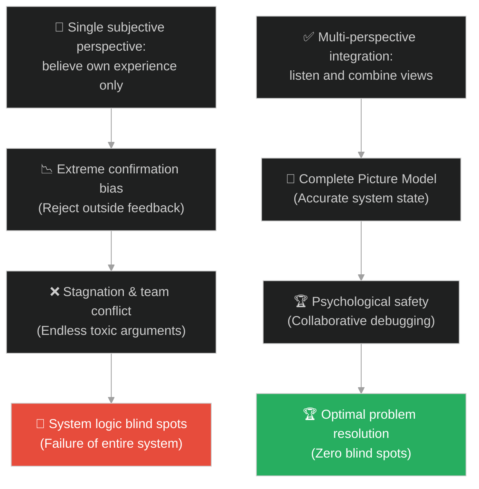
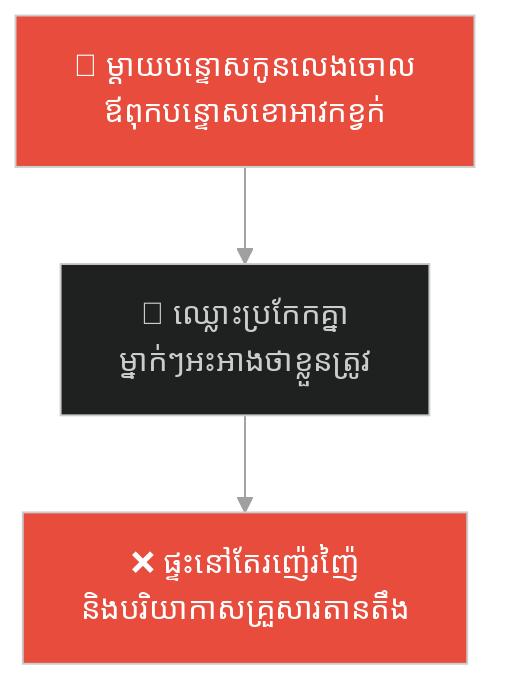
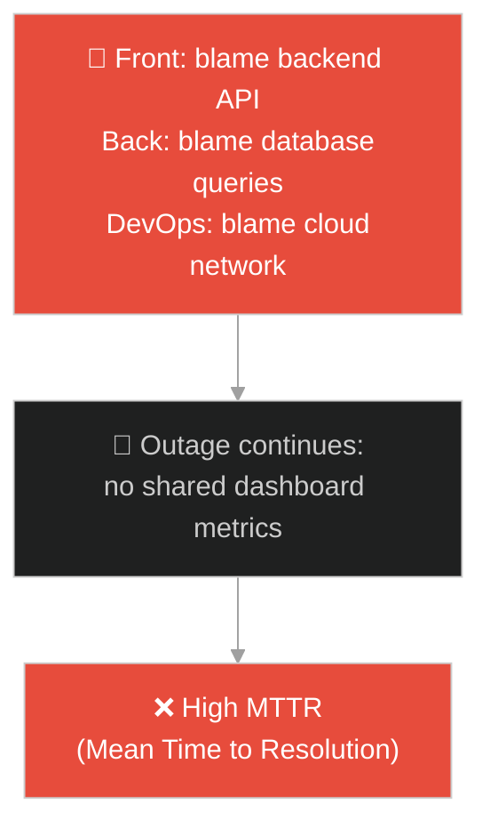
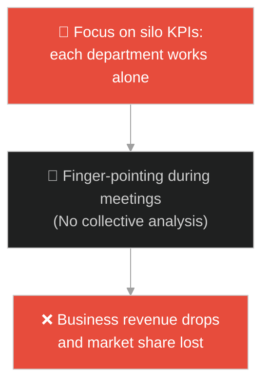
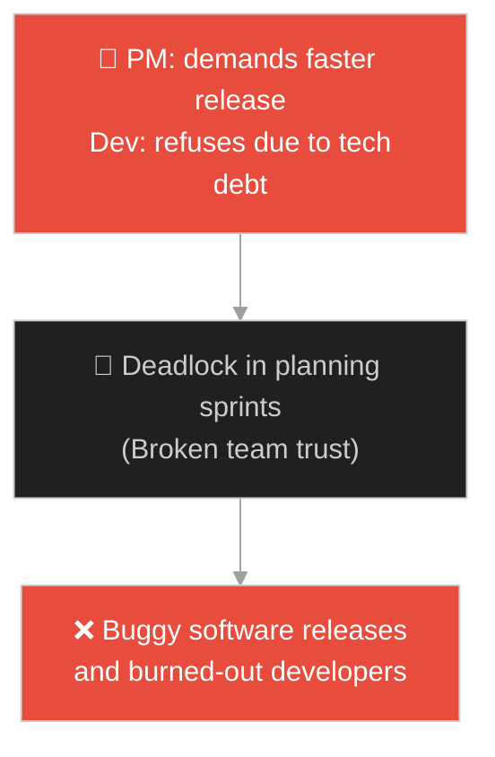
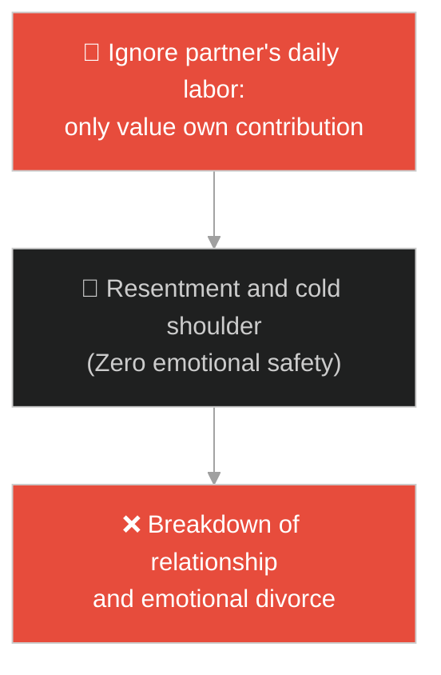
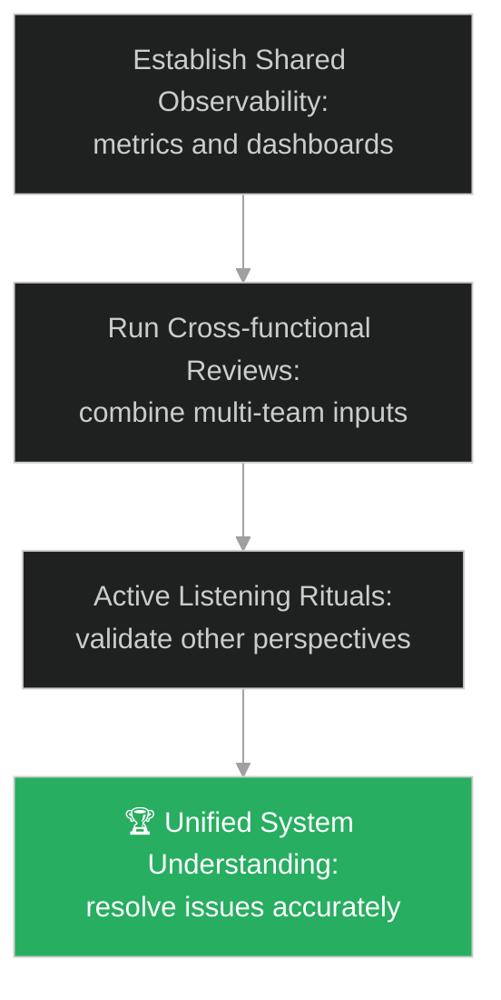

# Confirmation Bias & Perspectives (លម្អៀងការយល់ឃើញ និងទស្សនវិស័យ)៖ មនុស្សខ្វាក់ស្ទាបដំរី (Confirmation Bias & Perspectives & The Blind Men and the Elephant)

**Author:** ichamrong  
**Date:** 2026-05-28  
**Tags:** #buddhism #perspectives #confirmation-bias #egocentric-bias #life-lessons #parable  
**Category:** Concepts / Parables  
**Read Time:** ~15 min  

---

## 📌 មាតិកា (Table of Contents)
- [អន្ទាក់ផ្លូវចិត្ត (The Trap)](#0)
- [១. រឿងព្រេងព្រះពុទ្ធសាសនា៖ មនុស្សខ្វាក់ស្ទាបដំរី (The Legend of the Blind Men and the Elephant)](#1)
  - [ការឈ្លោះប្រកែកគ្នាដែលគ្មានទីបញ្ចប់ និងការកាត់ក្តីរបស់ព្រះរាជា (The Endless Argument and the King's Judgment)](#1-1)
- [២. បញ្ហា៖ ការយល់ច្រឡំថាទស្សនៈរបស់ខ្លួនជាការពិតតែមួយគត់ (The Issue: Mistaking Perspective for Absolute Truth)](#2)
- [៣. ឧទាហមណ៍ជាក់ស្តែងក្នុងពិភពពិត (Real World Examples)](#3)
  - [ឧទាហរណ៍ទី ១ — កម្រិតស្រាល (គ្រួសារ)៖ ការឈ្លោះគ្នាអំពីមូលហេតុផ្ទះរញ៉េរញ៉ៃ (Family Dispute Over Household Messiness)](#3-1)
  - [ឧទាហរណ៍ទី ២ — កម្រិតមធ្យម (បច្ចេកទេស)៖ មុខងារដំណើរការយឺត និងការទម្លាក់កំហុសរវាងផ្នែក (Frontend vs Backend vs DevOps on Performance)](#3-2)
  - [ឧទាហរណ៍ទី ៣ — កម្រិតមធ្យម (ធុរកិច្ច)៖ វិបត្តិធ្លាក់ចុះការលក់ និងការយល់ឃើញផ្សេងគ្នានៃនាយកដ្ឋាន (Marketing vs Sales vs Engineering)](#3-3)
  - [ឧទាហរណ៍ទី ៤ — កម្រិតមធ្យម (សង្គម/គ្រប់គ្រង)៖ ជម្លោះលើការកំណត់ផែនការការងារ (Project Timeline vs Tech Debt Dispute)](#3-4)
  - [ឧទាហរណ៍ទី ៥ — កម្រិតធ្ងន់ (ទំនាក់ទំនង)៖ ការលះបង់ដែលមើលមិនឃើញ និងការមិនយល់ចិត្តគ្នា (Invisible Labor and Empathy Deficit)](#3-5)
- [៤. ដំណោះស្រាយទូទៅ៖ ការបើកចិត្តស្តាប់ និងការរួមបញ្ចូលទស្សនៈ (The General Solution: Perspective Taking and Collective Intelligence)](#4)
- [សេចក្តីសន្និដ្ឋាន (Conclusion)](#5)
- [ឯកសារយោង (References)](#6)
- [Related Posts](#7)

---

<a id="0"></a>
## អន្ទាក់ផ្លូវចិត្ត (The Trap)

តើអ្នកធ្លាប់ជួបបញ្ហាដែលសមាជិកក្នុងក្រុម ឬដៃគូរបស់អ្នក ប្រកែកគ្នាយ៉ាងខ្លាំងក្លាអំពីបញ្ហាមួយ ដោយម្នាក់ៗប្រមូលភស្តុតាង និងបទពិសោធន៍ផ្ទាល់ខ្លួនមកអះអាងថាខ្លួនត្រឹមត្រូវ ១០០% ចំណែកអ្នកដទៃខុសទាំងស្រុងដែរឬទេ? 

នៅក្នុងការវាយតម្លៃបញ្ហា៖
* **យើងងាយនឹងធ្លាក់ក្នុងអន្ទាក់** នៃការជឿជាក់លើបទពិសោធន៍ផ្ទាល់ខ្លួនដែលមានដែនកំណត់ រួចសន្និដ្ឋានថាវាជាការពិតទាំងស្រុងនៃបញ្ហាទាំងមូល (Egocentric Default) ដោយបដិសេធមិនស្តាប់ទស្សនៈរបស់មនុស្សឈរនៅជ្រុងផ្សេងទៀត។
* **យើងមើលរំលង** ភាពស្មុគស្មាញនៃប្រព័ន្ធ ដែលទាមទារការបូកបញ្ចូលគ្នានៃចំណេះដឹង និងទស្សនវិស័យជាច្រើន ដើម្បីបង្កើតរូបភាពពិតប្រាកដរួមមួយ។

ការយល់ច្រឡំថាទស្សនវិស័យផ្ទាល់ខ្លួនដែលមានកម្រិតរបស់ខ្លួន គឺជាការពិតតែមួយគត់ ហៅថា **អន្ទាក់ការពិតដាច់ខាតរបស់មនុស្សខ្វាក់ (Illusion of Absolute Truth Trap)**។

ដើម្បីយល់ដឹងពីរបៀបបំបែកអន្ទាក់ផ្លូវចិត្តនេះ នេះជាផែនទីបង្ហាញផ្លូវ៖
1. **រឿងព្រេងនិទាន (The Legend)** — រឿងរ៉ាវរបស់មនុស្សខ្វាក់ដែលស្ទាបផ្នែកផ្សេងគ្នានៃដំរី រួចប្រកែកគ្នាថារូបរាងដំរីពិតប្រាកដជាអ្វី។
2. **បញ្ហា (The Issue)** — ការវិភាគការលម្អៀងនៃការយល់ឃើញ (Confirmation Bias, Egocentric Bias) និងផលប៉ះពាល់លើការងារប្រព័ន្ធ។
3. **ឧទាហមណ៍ជាក់ស្តែងក្នុងពិភពពិត (Real World Examples)** — ពិនិត្យមើលបញ្ហានេះក្នុងកម្រិតគ្រួសារ បច្ចេកវិទ្យា ធុរកិច្ច ការគ្រប់គ្រង និងទំនាក់ទំនង។
4. **ដំណោះស្រាយទូទៅ (The General Solution)** — វិធីសាស្ត្ររួមបញ្ចូលទស្សនៈ (Perspective Taking) និងការកសាងប្រព័ន្ធសម្រេចចិត្តរួមគ្នា។



---

<a id="1"></a>
## ១. រឿងព្រេងព្រះពុទ្ធសាសនា៖ មនុស្សខ្វាក់ស្ទាបដំរី (The Legend of the Blind Men and the Elephant)

កាលពីសម័យពុទ្ធកាល ព្រះសម្មាសម្ពុទ្ធទ្រង់គង់ប្រថាប់នៅក្នុងវត្តជេតពន។ ទ្រង់បានលើកយករឿងប្រៀបប្រដូចមួយអំពីអតីតកាល ដើម្បីសម្តែងទៅកាន់ភិក្ខុសង្ឃអំពីបញ្ហានៃការឈ្លោះប្រកែកគ្នា និងការយល់ខុសរបស់សត្វលោក។

នៅក្នុងរឿងនោះ៖
* មានព្រះរាជាសក្ដិធំមួយអង្គ បានបង្គាប់ឱ្យរាជបុរសប្រមូលមនុស្សខ្វាក់ពីកំណើតមួយក្រុមធំនៅក្នុងទីក្រុង មកជួបជុំគ្នាជុំវិញសត្វដំរីដ៏ធំមួយក្បាល។
* ព្រះរាជាបានប្រាប់មនុស្សខ្វាក់ទាំងនោះថា៖ *"ចូរអ្នកទាំងអស់គ្នាស្ទាបសត្វដំរីនេះ រួចប្រាប់យើងថាតើដំរីមានរូបរាងបែបណា?"*
* ដោយសារពួកគេខ្វាក់ភ្នែក ពួកគេម្នាក់ៗអាចស្ទាបបានត្រឹមតែផ្នែកខ្លះនៃរាងកាយដំរីប៉ុណ្ណោះ៖
  * អ្នកដែលស្ទាបប៉ះ **ក្បាលដំរី** បានស្រែកឡើងថា៖ *"ឱព្រះរាជា! ដំរីនេះមានរូបរាងដូចជាក្អមដីដុតអញ្ចឹង!"*
  * អ្នកដែលស្ទាបប៉ះ **ត្រចៀក** ជំទាស់ថា៖ *"មិនមែនទេ! ដំរីនេះគឺដូចជាកង្ហារត្នោតសម្រាប់បក់!"*
  * អ្នកដែលស្ទាបប៉ះ **ភ្លុក** ស្រែកឡើង៖ *"អ្នកទាំងពីរនិយាយខុសហើយ! ដំរីនេះស្រួចនិងរឹងដូចជាចបជីកទេតើ!"*
  * អ្នកដែលស្ទាបប៉ះ **ដងខ្លួន** និយាយថា៖ *"ដំរីនេះធំនិងសំប៉ែត ដូចជាជញ្ជាំងផ្ទះ!"*
  * អ្នកដែលស្ទាបប៉ះ **ជើង** អះអាង៖ *"ដំរីនេះមូលនិងត្រង់ ដូចជាសសរវាំង!"*
  * អ្នកដែលស្ទាបប៉ះ **កន្ទុយ** និយាយថា៖ *"ដំរីនេះតូចនិងវែង ដូចជាខ្សែពួរ!"*

---

<a id="1-1"></a>
### ការឈ្លោះប្រកែកគ្នាដែលគ្មានទីបញ្ចប់ និងការកាត់ក្តីរបស់ព្រះរាជា (The Endless Argument and the King's Judgment)

បន្ទាប់ពីបានស្ទាបដំរីរួច មនុស្សខ្វាក់ទាំងនោះចាប់ផ្តើមប្រកែកគ្នាយ៉ាងខ្លាំង។ ម្នាក់ៗសុទ្ធតែជឿជាក់លើ "បទពិសោធន៍ផ្ទាល់ដៃ" របស់ខ្លួនថាជាការពិតតែមួយគត់ ហើយចោទអ្នកដទៃថាជាមនុស្សកុហក ឬឆ្កួត។

ជម្លោះពាក្យសម្តីបានរីករាលដាលទៅជាការឈ្លោះប្រកែកគ្នា រហូតឈានដល់ការប្រើកណ្តាប់ដៃវាយតប់គ្នាទៅវិញទៅមក។ ព្រះរាជាទ្រង់ឈរទតមើលព្រឹត្តិការណ៍នោះ រួចទ្រង់សើចយ៉ាងខ្លាំង ហើយមានបន្ទូលទៅកាន់ពួកអាមាត្យថា៖
> «មនុស្សទាំងនេះម្នាក់ៗដឹងការពិតតែមួយចំណែកតូចប៉ុណ្ណោះ ប៉ុន្តែពួកគេបែរជានាំគ្នាឈ្លោះប្រកែកគ្នាស្លាប់រស់ ព្រោះពួកគេគិតថាចំណែកតូចដែលពួកគេដឹង គឺជាការពិតទាំងស្រុងនៃសត្វដំរីទៅវិញ។»

ព្រះពុទ្ធទ្រង់បានសន្និដ្ឋានថា មនុស្សលោកដែលជាប់ជំពាក់នឹងទស្សនៈផ្ទាល់ខ្លួន ក៏ដូចជាមនុស្សខ្វាក់ទាំងនេះដែរ — ពួកគេមើលឃើញតែមួយផ្នែកនៃការពិត រួចក៏បង្កើតជាជម្លោះ និងការបែកបាក់។

---

<a id="2"></a>
## ២. បញ្ហា៖ ការយល់ច្រឡំថាទស្សនៈរបស់ខ្លួនជាការពិតតែមួយគត់ (The Issue: Mistaking Perspective for Absolute Truth)

នៅក្នុងវិស្វកម្មប្រព័ន្ធស្មុគស្មាញ និងការគ្រប់គ្រង អន្ទាក់នេះកើតឡើងនៅពេលដែលសមាជិកក្រុមការងារមកពីផ្នែកផ្សេងៗគ្នា វាយតម្លៃប្រព័ន្ធទាំងមូលតាមរយៈកែវយឺតតូចចង្អៀតនៃជំនាញផ្ទាល់ខ្លួនរបស់ពួកគេ។

```java
// ការព្យាយាមដោះស្រាយបញ្ហាដោយផ្អែកលើទិន្នន័យតែមួយផ្នែក នាំឱ្យប្រព័ន្ធទាំងមូលបរាជ័យ
public class SystemDiagnostics {
    public void analyzeOutage(boolean databaseErrorOnly, boolean networkOk) {
        if (databaseErrorOnly) {
            // អន្ទាក់មនុស្សខ្វាក់៖ ដោះស្រាយតែបញ្ហា Database ដោយមិនពិនិត្យមើលលំហូរបណ្តាញទាំងមូល
            System.out.println("Optimize DB Queries only!");
            // អាចនឹងខកខានមិនបានឃើញថា Network firewall កំពុងទម្លាក់ connection packets
        }
    }
}
```

* **កង្វះយន្តការ Feedback Loop ឆ្លងផ្នែក (Cross-functional Blind Spots)៖** នៅពេលដែលផ្នែកនីមួយៗផ្តោតតែលើ KPI របស់ខ្លួន ពួកគេនឹងមិនអាចមើលឃើញចំណុចខ្សោយរួមរបស់ប្រព័ន្ធឡើយ។
* **Egocentric and Confirmation Biases៖** មនុស្សច្រើនតែស្វែងរកតែភស្តុតាងណាដែលគាំទ្រទស្សនៈចាស់របស់ខ្លួន និងបដិសេធព័ត៌មានថ្មីៗដែលផ្ទុយពីបទពិសោធន៍ផ្ទាល់ខ្លួន។

---

<a id="3"></a>
## ៣. ឧទាហមណ៍ជាក់ស្តែងក្នុងពិភពពិត

---

<a id="3-1"></a>
### ឧទាហរណ៍ទី ១ — កម្រិតស្រាល (គ្រួសារ)៖ ការឈ្លោះគ្នាអំពីមូលហេតុផ្ទះរញ៉េរញ៉ៃ (Family Dispute Over Household Messiness)

នៅក្នុងគ្រួសារមួយ ឪពុកម្តាយ និងកូនៗប្រកែកគ្នាឥតឈប់ឈរអំពីមូលហេតុដែលផ្ទះរញ៉េរញ៉ៃ។ ម្តាយមើលឃើញតែក្មេងៗលេងចោលល្បែង (ទស្សនៈទី១) ឪពុកមើលឃើញតែខោអាវមិនទាន់បោក (ទស្សនៈទី២) ចំណែកកូនៗមើលឃើញតែគ្មានប្រអប់ដាក់ទិន្នន័យសម្ភារៈគ្រប់គ្រាន់ (ទស្សនៈទី៣)។ ម្នាក់ៗបន្ទោសគ្នាទៅវិញទៅមកដោយមិនព្រមរួមគ្នារៀបចំប្រព័ន្ធទុកដាក់រួម។



---

<a id="3-2"></a>
### ឧទាហរណ៍ទី ២ — កម្រិតមធ្យម (បច្ចេកទេស)៖ មុខងារដំណើរការយឺត និងការទម្លាក់កំហុសរវាងផ្នែក (Frontend vs Backend vs DevOps on Performance)

នៅពេលប្រព័ន្ធរបស់ក្រុមហ៊ុនជួបបញ្ហាដំណើរការយឺត (High Latency) ក្រុមការងារនីមួយៗមើលឃើញមូលហេតុខុសៗគ្នា៖ ក្រុម Frontend និយាយថា API backend យឺត (ភ្លុកដំរី) ក្រុម Backend និយាយថា SQL query របស់ Database យឺត (ជើងដំរី) ចំណែកក្រុម DevOps និយាយថា Bandwidth របស់ Server ពេញ (ត្រចៀកដំរី)។ ការមិនសហការគ្នាវិភាគលំហូរទិន្នន័យរួម ធ្វើឱ្យការដោះស្រាយអូសបន្លាយពេលយូរ។



---

<a id="3-3"></a>
### ឧទាហរណ៍ទី ៣ — កម្រិតមធ្យម (ធុរកិច្ច)៖ វិបត្តិធ្លាក់ចុះការលក់ និងការយល់ឃើញផ្សេងគ្នានៃនាយកដ្ឋាន (Marketing vs Sales vs Engineering)

ក្រុមហ៊ុនមួយបានជួបប្រទះការធ្លាក់ចុះនៃការលក់ផលិតផល។ ផ្នែកទីផ្សារ (Marketing) យល់ថាផលិតផលមិនល្អ (ទស្សនៈទី១) ផ្នែកលក់ (Sales) យល់ថាតម្លៃថ្លៃពេក (ទស្សនៈទី២) ហើយផ្នែកបច្ចេកវិទ្យា (Engineering) យល់ថាមកពីយុទ្ធនាការទីផ្សារមិនចំគោលដៅ (ទស្សនៈទី៣)។ ការស្ដីបន្ទោសគ្នាទៅវិញទៅមក នាំឱ្យក្រុមហ៊ុនខកខានការកែសម្រួលយុទ្ធសាស្ត្ររួម។



---

<a id="3-4"></a>
### ឧទាហរណ៍ទី ៤ — កម្រិតមធ្យម (សង្គម/គ្រប់គ្រង)៖ ជម្លោះលើការកំណត់ផែនការការងារ (Project Timeline vs Tech Debt Dispute)

ប្រធានគម្រោង (Project Manager) យល់ឃើញតែតម្រូវការបញ្ចេញមុខងារថ្មីឱ្យទាន់ពេល ដើម្បីឆ្លើយតបនឹងទីផ្សារ ចំណែកឯអ្នកបង្កើតកម្មវិធី (Developers) យល់ឃើញតែពីបញ្ហាបំណុលបច្ចេកទេស (Technical Debt) ដែលត្រូវដោះស្រាយជាបន្ទាន់មុននឹងបន្ថែមមុខងារថ្មី។ ការមិនសម្របសម្រួលគ្នា និងមិនយល់ពីតម្រូវការរបស់គ្នា ធ្វើឱ្យការងារទាំងមូលត្រូវជាប់គាំង។



---

<a id="3-5"></a>
### ឧទាហរណ៍ទី ៥ — កម្រិតធ្ងន់ (ទំនាក់ទំនង)៖ ការលះបង់ដែលមើលមិនឃើញ និងការមិនយល់ចិត្តគ្នា (Invisible Labor and Empathy Deficit)

នៅក្នុងទំនាក់ទំនងប្តីប្រពន្ធ ស្វាមីគិតថាខ្លួនធ្វើការហត់នឿយនៅក្រៅផ្ទះដើម្បីរកចំណូល ចំណែកភរិយាគិតថានាងហត់នឿយខ្លាំងក្នុងការមើលថែកូន និងគ្រប់គ្រងផ្ទះសម្បែង។ ម្នាក់ៗយល់ថាខ្លួនឯងធ្វើការលះបង់ច្រើនជាងគេ ហើយចាប់ផ្តើមមានអារម្មណ៍មិនពេញចិត្តនឹងគ្នា ព្រោះពួកគេមិនធ្លាប់ឈរនៅជ្រុងម្ខាងទៀតដើម្បីមើលឃើញពីការលំបាកពិតប្រាកដរបស់ដៃគូឡើយ។



---

<a id="4"></a>
## ៤. ដំណោះស្រាយទូទៅ៖ ការបើកចិត្តស្តាប់ និងការរួមបញ្ចូលទស្សនៈ (The General Solution: Perspective Taking and Collective Intelligence)

ដើម្បីដោះស្រាយអន្ទាក់មនុស្សខ្វាក់ស្ទាបដំរី យើងត្រូវអនុវត្តប្រព័ន្ធរួមបញ្ចូលទស្សនៈ និងការកសាងចំណេះដឹងរួមគ្នា (Shared Context)៖



* **ការបង្កើតទិន្នន័យសង្កេតរួម (Shared Observability Dashboard)៖** ក្នុងវិស័យបច្ចេកវិទ្យា ត្រូវប្រើប្រព័ន្ធ Trace និង APM តែមួយ ដើម្បីឱ្យក្រុម Frontend, Backend, និង DevOps មើលឃើញការពិតដូចគ្នាដោយគ្មានការទម្លាក់កំហុសដាក់គ្នា។
* **យុទ្ធសាស្ត្រប្តូរតួនាទី (Role-reversal & Shadowing)៖** ឱ្យអ្នកគ្រប់គ្រងគម្រោងទៅអង្គុយមើលការងារសរសេរកូដរបស់ Developer ហើយឱ្យ Developer ចូលរួមស្តាប់ការប្រជុំជាមួយអតិថិជន ដើម្បីឱ្យភាគីនីមួយៗយល់ពីការលំបាករវាងគ្នា។
* **ការអនុវត្តការសន្ទនាដោយមិនបន្ទោសគ្នា (Blameless Post-Mortems)៖** នៅពេលមានបញ្ហាកើតឡើង ផ្តោតលើសំណួរថា "តើមានអ្វីកើតឡើង?" និង "តើយើងអាចរៀនសូត្រអ្វីខ្លះ?" ជាជាងការចោទប្រកាន់បុគ្គល ឬក្រុមណាមួយ។

---

## 🐇 ធ្លាក់ចូលក្នុងរន្ធទន្សាយ (Enter the Rabbit Hole)

ដើម្បីស្វែងយល់កាន់តែស៊ីជម្រៅអំពីរបៀបគ្រប់គ្រងចិត្តសាស្ត្រ និងការដោះស្រាយបញ្ហា សូមចាប់ផ្តើមដំណើររុករករបស់អ្នកដោយចុចលើតំណភ្ជាប់ខាងក្រោម៖

* 🚀 **[ចាប់ផ្តើមដំណើររុករក (Start the Journey) ➔ គ្រាប់ស្ពៃនៃសេចក្តីពិត (The Mustard Seed)](./111-buddha-and-the-mustard-seed.md)**

---

<a id="5"></a>
## សេចក្តីសន្និដ្ឋាន (Conclusion)

> **«ការពិតតែងតែមានលក្ខណៈស្មុគស្មាញ និងធំធេងជាងបទពិសោធន៍ផ្ទាល់ខ្លួនរបស់យើងជានិច្ច។»**

ការដឹងខ្លួនថាខ្លួនឯងគ្រាន់តែជា "មនុស្សខ្វាក់ស្ទាបដំរី" ម្នាក់ គឺជាជំហានដំបូងបង្អស់នៃបញ្ញា។ នៅពេលយើងលះបង់អំនួតនៃការពិតដាច់ខាត រួចចាប់ផ្តើមបើកចិត្តស្តាប់ទស្សនៈរបស់មនុស្សជុំវិញខ្លួន យើងនឹងអាចផ្គុំបំណែកផ្សេងៗគ្នានៃការពិត ដើម្បីមើលឃើញរូបភាពដំរីទាំងមូលដ៏អស្ចារ្យ។

---

<a id="6"></a>
## ឯកសារយោង (References)

* **Jalina Sutta** — Udana 6.4, Buddhist Pali Canon (The origin of the Blind Men and Elephant parable).
* **Daniel Kahneman** — *Thinking, Fast and Slow* (2011). Explaining cognitive biases and system blind spots.
* **Google SRE Book** — *Blameless Post-Mortems* (2016). Establishing cross-team collaboration frameworks.

---

<a id="7"></a>
## Related Posts

* [Buddha and the Poisoned Arrow](./109-buddha-and-the-poisoned-arrow.md) — How over-analysis paralysis delays pragmatic action.
* [The Tower of Babel](./41-the-tower-of-babel.md) — Breakdowns in cross-team API contract alignment.
