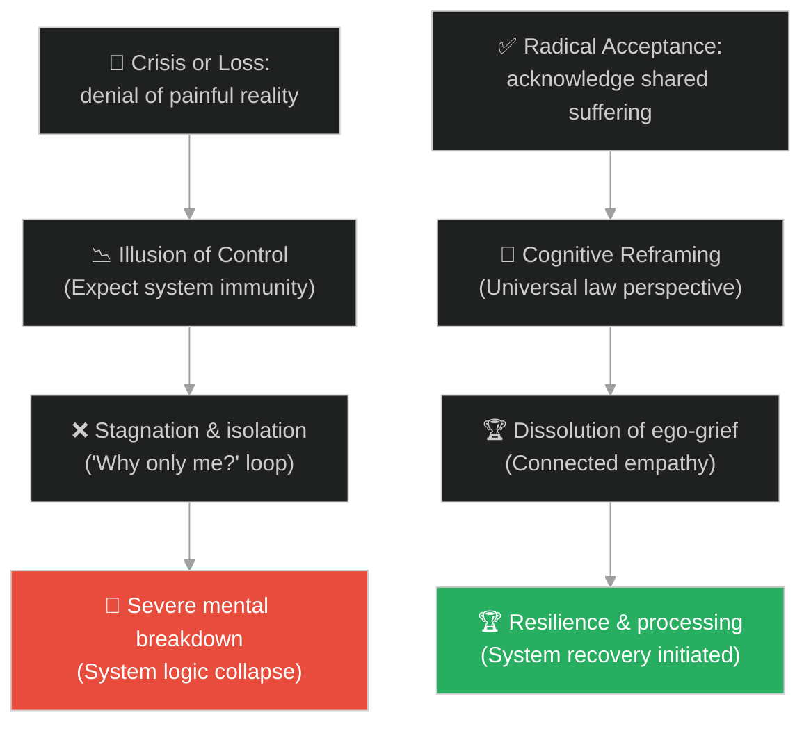
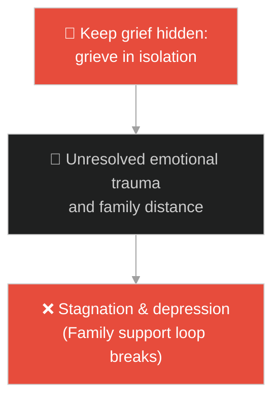
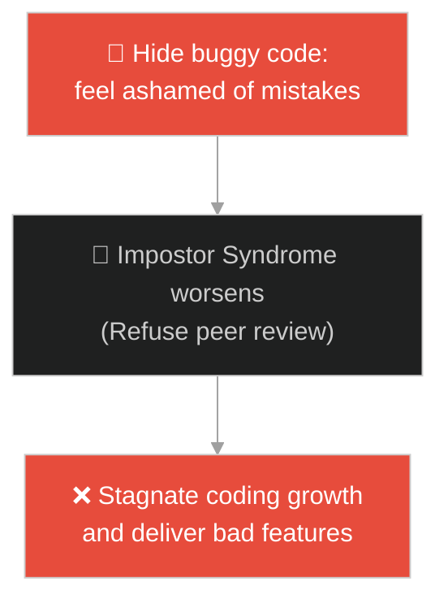
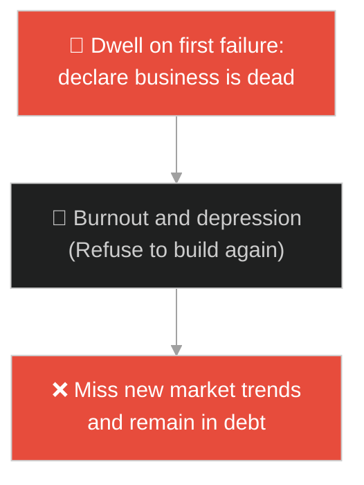
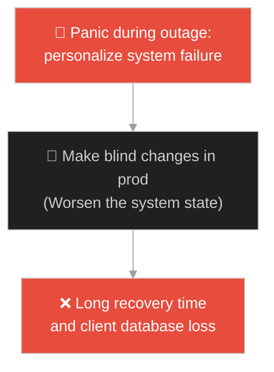
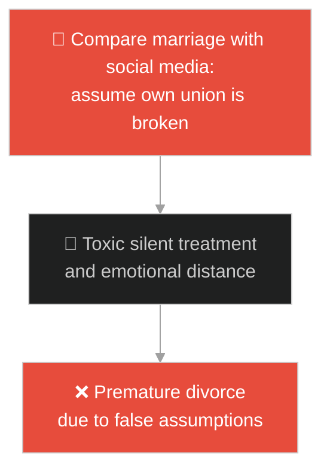
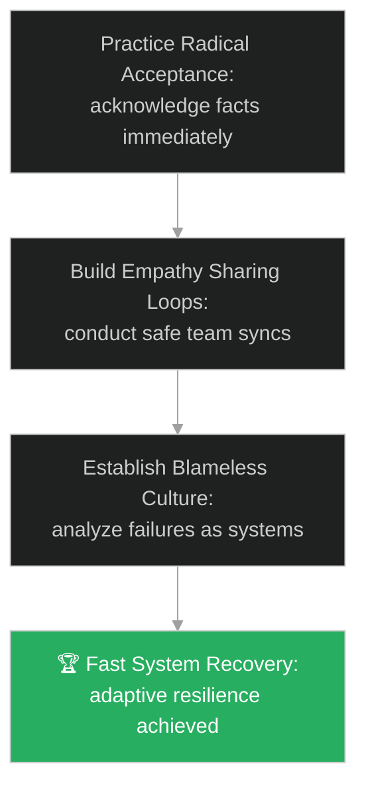

# Acceptance & Shared Suffering (ការទទួលយកការពិត និងសេចក្តីទុក្ខរួម)៖ គ្រាប់ស្ពៃនៃសេចក្តីពិត (Shared Human Experience & The Mustard Seed)

**Author:** ichamrong  
**Date:** 2026-05-28  
**Tags:** #buddhism #acceptance #grief #mental-models #life-lessons #illusion-of-control #parable  
**Category:** Concepts / Parables  
**Read Time:** ~15 min  

---

## 📌 មាតិកា (Table of Contents)
- [អន្ទាក់ផ្លូវចិត្ត (The Trap)](#0)
- [១. រឿងព្រេងព្រះពុទ្ធសាសនា៖ នាងគីសាគោតមី និងគ្រាប់ស្ពៃ (The Legend of Kisa Gotami and the Mustard Seed)](#1)
  - [ការស្វែងរកគ្រាប់ស្ពៃដែលគ្មានលទ្ធផល (The Fruitless Search for the Seed)](#1-1)
- [២. បញ្ហា៖ វិបត្តិបដិសេធការពិត និងការយល់ច្រឡំថាយើងរងទុក្ខតែម្នាក់ឯង (The Issue: Denial and the Isolation of Suffering)](#2)
- [៣. ឧទាហមណ៍ជាក់ស្តែងក្នុងពិភពពិត (Real World Examples)](#3)
  - [ឧទាហរណ៍ទី ១ — កម្រិតស្រាល (គ្រួសារ)៖ ការកាន់ទុក្ខចំពោះការបាត់បង់សមាជិកគ្រួសារ (Family Grief and Shared Connection)](#3-1)
  - [ឧទាហរណ៍ទី ២ — កម្រិតមធ្យម (បច្ចេកទេស)៖ វិបត្តិអន់ជាងគេក្នុងក្រុមការងារ (Developer Impostor Syndrome)](#3-2)
  - [ឧទាហរណ៍ទី ៣ — កម្រិតមធ្យម (ធុរកិច្ច)៖ ការខូចខាតអាជីវកម្មដំបូង និងការលះបង់ក្តីសង្ឃឹម (First-time Founder Business Failure)](#3-3)
  - [ឧទាហរណ៍ទី ៤ — កម្រិតមធ្យម (សង្គម/គ្រប់គ្រង)៖ វិបត្តិប្រព័ន្ធគាំង និងការទម្លាក់កំហុសផ្ទាល់ខ្លួន (Handling Major Production Outage)](#3-4)
  - [ឧទាហរណ៍ទី ៥ — កម្រិតធ្ងន់ (ទំនាក់ទំនង)៖ វិបត្តិជម្លោះប្តីប្រពន្ធ និងការគិតថាគ្រួសារខ្លួនឯងខូចខាតតែមួយគត់ (Normalizing Marital Conflict)](#3-5)
- [៤. ដំណោះស្រាយទូទៅ៖ ការទទួលយកបែបអនុវត្ត និងការកសាងបណ្តាញយល់ចិត្ត (The General Solution: Radical Acceptance and Shared Empathy Loops)](#4)
- [សេចក្តីសន្និដ្ឋាន (Conclusion)](#5)
- [ឯកសារយោង (References)](#6)
- [Related Posts](#7)

---

<a id="0"></a>
## អន្ទាក់ផ្លូវចិត្ត (The Trap)

តើអ្នកធ្លាប់ជួបវិបត្តិផ្លូវចិត្ត ឬការបរាជ័យធំដំក្នុងជីវិត រួចមានអារម្មណ៍ថាលោកនេះអយុត្តិធម៌ខ្លាំង ហើយសួរខ្លួនឯងថា៖ *"ហេតុអ្វីបានជាមានតែខ្ញុំម្នាក់គត់ដែលរងទុក្ខ និងជួបបញ្ហាពិបាកបែបនេះ?"* ដែរឬទេ?

នៅក្នុងការប្រឈមមុខនឹងបញ្ហា៖
* **យើងងាយនឹងធ្លាក់ក្នុងអន្ទាក់** នៃការបដិសេធការពិត (Denial) និងការយល់ច្រឡំថាយើងរងទុក្ខដាច់ដោយឡែកពីគេ ដែលបង្កើតឱ្យមានអារម្មណ៍ឯកោ អាក់អន់ចិត្ត និងបាក់ទឹកចិត្ត។
* **យើងមើលរំលង** ការពិតជាសកលដែលថាសេចក្តីឈឺចាប់ ការបរាជ័យ និងការបាត់បង់គឺជាផ្នែកមួយដែលមិនអាចចៀសផុតនៃជីវិតរបស់សត្វលោកគ្រប់រូប (Shared Human Experience)។

ការយល់ច្រឡំថាខ្លួនឯងគឺជាជនរងគ្រោះតែម្នាក់គត់ដែលរងគ្រោះថ្នាក់ ហៅថា **អន្ទាក់ឯកោនៃសេចក្តីទុក្ខ (Isolated Suffering Trap)**។

ដើម្បីយល់ដឹងពីរបៀបយកឈ្នះវា នេះជាផែនទីបង្ហាញផ្លូវ៖
1. **រឿងព្រេងនិទាន (The Legend)** — រឿងរ៉ាវរបស់នាងគីសាគោតមីដែលដើរស្វែងរកគ្រាប់ស្ពៃពីផ្ទះដែលគ្មានមនុស្សស្លាប់ ដើម្បីប្រោសកូនឱ្យរស់ឡើងវិញ។
2. **បញ្ហា (The Issue)** — ការវិភាគការបដិសេធការពិត (Denial) និងការជាប់គាំងក្នុងអន្ទាក់គ្រប់គ្រង (Illusion of Control)។
3. **ឧទាហមណ៍ជាក់ស្តែងក្នុងពិភពពិត (Real World Examples)** — ពិនិត្យមើលបញ្ហានេះក្នុងកម្រិតគ្រួសារ បច្ចេកវិទ្យា ធុរកិច្ច ការគ្រប់គ្រង និងទំនាក់ទំនង។
4. **ដំណោះស្រាយទូទៅ (The General Solution)** — ការអនុវត្ត Radical Acceptance ក្នុងជីវិត និងការកសាង Empathy Loops ក្នុងក្រុមការងារ។



---

<a id="1"></a>
## ១. រឿងព្រេងព្រះពុទ្ធសាសនា៖ នាងគីសាគោតមី និងគ្រាប់ស្ពៃ (The Legend of Kisa Gotami and the Mustard Seed)

នៅក្នុងសម័យពុទ្ធកាល នាងគីសាគោតមី ជាស្ត្រីក្រីក្រម្នាក់ដែលទើបតែបានផ្តល់កំណើតដល់កូនប្រុសដ៏គួរឱ្យស្រឡាញ់ម្នាក់។ ទោះជាយ៉ាងណា នៅពេលកូននោះទើបតែចេះដើរតេះតះ គេក៏ធ្លាក់ខ្លួនឈឺយ៉ាងធ្ងន់ធ្ងរ រហូតដល់ស្លាប់បាត់បង់ជីវិតទៅ។

ដោយក្តីសោកសៅជាពន់ពេក និងដោយសារមិនអាចទទួលយកការពិតដ៏ជូរចត់នេះបាន៖
* នាងគីសាគោតមីបានបីសាកសពកូនប្រុសរបស់នាងដើរទៅគ្រប់ផ្ទះទូទាំងភូមិ ដោយស្រែកសួររកថ្នាំ ឬគ្រូពេទ្យដែលអាចប្រោសកូនរបស់នាងឱ្យរស់ឡើងវិញ។
* អ្នកភូមិទាំងឡាយបានត្រឹមតែអាណិតអាសូរ និងនិយាយប្រាប់នាងថា៖ *"នាងអើយ កូនរបស់នាងបានស្លាប់បាត់ទៅហើយ គ្មានថ្នាំណាអាចជួយបានទេ!"* ប៉ុន្តែនាងនៅតែបដិសេធមិនព្រមស្តាប់។
* ទីបំផុត បុរសចំណាស់ម្នាក់បានអាណិតនាងយ៉ាងខ្លាំង ហើយណែនាំនាងថា៖ *"នាងអើយ ចូរនាងទៅជួបព្រះសម្មាសម្ពុទ្ធចុះ ទ្រង់ប្រហែលជាមានថ្នាំជួយកូននាងបាន។"*

---

<a id="1-1"></a>
### ការស្វែងរកគ្រាប់ស្ពៃដែលគ្មានលទ្ធផល (The Fruitless Search for the Seed)

នាងបានរត់ទៅកាន់វត្តជេតពន ហើយបានទូលអង្វរព្រះពុទ្ធដោយទឹកភ្នែក។ ព្រះអង្គទ្រង់ទតឃើញសេចក្តីទុក្ខដ៏ធំធេងរបស់នាង រួចក៏មានបន្ទូលដោយព្រះហឫទ័យស្ងប់ថា៖
> «ចូរអ្នកទៅរកគ្រាប់ស្ពៃមួយក្តាប់ពីផ្ទះណាមួយដែលមិនធ្លាប់មានឪពុក ម្តាយ កូន ប្តី ប្រពន្ធ ឬសាច់ញាតិណាម្នាក់ស្លាប់សោះ យកមកឱ្យតថាគត នោះតថាគតនឹងជួយកូនរបស់អ្នកឱ្យរស់ឡើងវិញ។»

ដោយក្តីសង្ឃឹម នាងគីសាគោតមីបានរត់ទៅគោះទ្វារផ្ទះអ្នកភូមិម្តងមួយៗ ដើម្បីសុំគ្រាប់ស្ពៃ៖
* អ្នកភូមិទាំងអស់សុទ្ធតែស្ម័គ្រចិត្តហុចគ្រាប់ស្ពៃឱ្យនាង ប៉ុន្តែនៅពេលនាងសួរលក្ខខណ្ឌថា៖ *"តើផ្ទះរបស់អ្នកធ្លាប់មានមនុស្សស្លាប់ដែរឬទេ?"*
* ម្ចាស់ផ្ទះនីមួយៗតែងតែឆ្លើយតបវិញដោយសេចក្តីក្រៀមក្រំថា៖
  * ផ្ទះខ្លះ៖ *"កូនប្រុសខ្ញុំទើបតែស្លាប់កាលពីខែមុន!"*
  * ផ្ទះខ្លះ៖ *"ឪពុកម្តាយខ្ញុំបានចែកឋានទៅជាច្រើនឆ្នាំហើយ!"*
  * ផ្ទះខ្លះទៀត៖ *"អ្នកស្លាប់នៅក្នុងផ្ទះនេះមានច្រើនជាងអ្នករស់នៅទៅទៀត នាងអើយ!"*

នាងដើរសួរគ្រប់ផ្ទះពេញមួយថ្ងៃ ពីភូមិមួយទៅភូមិមួយ តែរកមិនបានសូម្បីតែផ្ទះមួយ ដែលមិនធ្លាប់មានមនុស្សស្លាប់ឡើយ។ នៅពេលព្រះអាទិត្យលិចដី នាងគីសាគោតមីទើបតែភ្ញាក់ស្មារតីយល់ច្បាស់ថា៖ **សេចក្តីស្លាប់ និងការបាត់បង់ មិនមែនកើតឡើងចំពោះតែនាងម្នាក់ឯងនោះទេ តែវាជាសេចក្តីទុក្ខរួមរបស់មនុស្សលោកគ្រប់រូប។**

នាងបានយកសាកសពកូនទៅបញ្ចុះនៅក្នុងព្រៃស្មសានដោយក្តីស្ងប់ រួចក៏ត្រឡប់មកថ្វាយបង្គំព្រះពុទ្ធ និងសុំបួសជាភិក្ខុនី ដើម្បីសិក្សារំលត់ទុក្ខ។

---

<a id="2"></a>
## ២. បញ្ហា៖ វិបត្តិបដិសេធការពិត និងការយល់ច្រឡំថាយើងរងទុក្ខតែម្នាក់ឯង (The Issue: Denial and the Isolation of Suffering)

នៅក្នុងចិត្តវិទ្យា និងការគ្រប់គ្រងប្រព័ន្ធ ការបដិសេធការពិត (Denial) និងការជាប់គាំងក្នុងអន្ទាក់គ្រប់គ្រង (Illusion of Control) ធ្វើឱ្យមានការខូចខាតសមត្ថភាពក្នុងការដោះស្រាយបញ្ហាជាក់ស្តែង៖

```java
// ការព្យាយាមបដិសេធកូដដែលខូច ដោយគិតថាវាជាករណីពិសេសតែមួយគត់
public class DefectManager {
    public void logBug(String bugReport) {
        // អន្ទាក់បដិសេធ៖ គិតថាកំហុសនេះកើតឡើងតែលើកូដយើងម្នាក់ឯង រួចក៏លាក់បាំងវាទុក
        System.out.println("Hide bug from team to avoid shame.");
        // នាំឱ្យខកខានការដោះស្រាយបញ្ហាជាលក្ខណៈប្រព័ន្ធ (Shared System Failure)
    }
}
```

* **ការខូចចិត្តនិងការដាក់ខ្លួនឯងឱ្យនៅឯកោ (Impostor/Victim Isolation)៖** នៅពេលយើងគិតថាយើងជួបបញ្ហាតែម្នាក់ឯង យើងនឹងមានអារម្មណ៍អៀនខ្មាស និងមិនហ៊ានស្វែងរកជំនួយពីសមាជិកដទៃទៀតឡើយ។
* **ការខ្ជះខ្ជាយថាមពលជាមួយរឿងដែលមិនអាចកែប្រែបាន (Denial Sunk Cost)៖** ការចំណាយពេលស្រែកតវ៉ានឹងអ្វីដែលបានកើតឡើងរួចទៅហើយ (ដូចជា ប្រព័ន្ធទិន្នន័យត្រូវបានលុបចោលទាំងស្រុងដោយចៃដន្យ) ជំនួសឱ្យការចាប់ផ្តើមអនុវត្តផែនការស្តារឡើងវិញ (Disaster Recovery)។

---

<a id="3"></a>
## ៣. ឧទាហមណ៍ជាក់ស្តែងក្នុងពិភពពិត

---

<a id="3-1"></a>
### ឧទាហរណ៍ទី ១ — កម្រិតស្រាល (គ្រួសារ)៖ ការកាន់ទុក្ខចំពោះការបាត់បង់សមាជិកគ្រួសារ (Family Grief and Shared Connection)

នៅពេលសមាជិកគ្រួសារម្នាក់បានចែកឋានទៅ ម្នាក់ៗស្ថិតក្នុងភាពសោកសៅ និងឯកោដោយគិតថាគ្មាននរណាម្នាក់អាចយល់ពីក្តីឈឺចាប់របស់ខ្លួនឡើយ (ទស្សនៈ Denial)។ ទាល់តែសមាជិកគ្រួសារទាំងអស់ជួបជុំគ្នា ចែករំលែកសេចក្តីចងចាំ និងរៀបរាប់ពីការឈឺចាប់រៀងៗខ្លួន ទើបពួកគេដឹងថាពួកគេកំពុងរួមគ្នាកាន់ទុក្ខ និងជួយគ្នាព្យាបាលផ្លូវចិត្តបាន។



---

<a id="3-2"></a>
### ឧទាហរណ៍ទី ២ — កម្រិតមធ្យម (បច្ចេកទេស)៖ វិបត្តិអន់ជាងគេក្នុងក្រុមការងារ (Developer Impostor Syndrome)

អ្នកសរសេរកូដថ្មីម្នាក់តែងតែមានអារម្មណ៍តានតឹង និងគិតថាខ្លួនឯងល្ងង់ជាងគេ ដោយសារតែគាត់សរសេរកូដជួបប៊ឺគ (Bugs) ឥតឈប់ឈរ (ទស្សនៈ Isolated Suffering)។ លុះត្រាតែគាត់ដឹងការពិតថា សូម្បីតែអ្នកជំនាញជាន់ខ្ពស់ (Senior Devs) ក៏សរសេរកូដជួបប៊ឺគរាល់ថ្ងៃ និងចំណាយពេលស្វែងរកដោះស្រាយដូចគ្នា ទើបគាត់ឈប់ភ័យខ្លាច ហើយចាប់ផ្តើមរៀនសូត្រពីកំហុស។



---

<a id="3-3"></a>
### ឧទាហរណ៍ទី ៣ — កម្រិតមធ្យម (ធុរកិច្ច)៖ ការខូចខាតអាជីវកម្មដំបូង និងការលះបង់ក្តីសង្ឃឹម (First-time Founder Business Failure)

ស្ថាបនិកអាជីវកម្មដំបូងម្នាក់ជួបរឿងក្ស័យធន ហើយមានអារម្មណ៍ខ្មាស់អៀនរហូតដល់មិនហ៊ានជួបនរណាម្នាក់ឡើយ។ ក្រោយមក គាត់បានចូលរួមក្នុងក្លឹបសហគ្រិន និងបានដឹងថា ៩០% នៃសហគ្រិនល្បីៗសុទ្ធតែធ្លាប់ឆ្លងកាត់ការក្ស័យធន ២ ទៅ ៣ ដង មុនពេលទទួលបានជោគជ័យ។ ការទទួលយកការពិតនេះ ធ្វើឱ្យគាត់ហ៊ានចាប់ផ្តើមគម្រោងថ្មីម្តងទៀត។



---

<a id="3-4"></a>
### ឧទាហរណ៍ទី ៤ — កម្រិតមធ្យម (សង្គម/គ្រប់គ្រង)៖ វិបត្តិប្រព័ន្ធគាំង និងការទម្លាក់កំហុសផ្ទាល់ខ្លួន (Handling Major Production Outage)

នៅពេលប្រព័ន្ធ Server ធ្លាក់ចុះ (System Outage) ក្នុងអំឡុងពេលយុទ្ធនាការលក់ធំ អ្នកគ្រប់គ្រងប្រព័ន្ធ (SRE) ម្នាក់មានអារម្មណ៍ភ័យស្លន់ស្លោ និងបន្ទោសខ្លួនឯងថាជាអ្នកបំផ្លាញក្រុមហ៊ុន។ ក្រោយមក គាត់បានដឹងថា សូម្បីតែក្រុមហ៊ុនបច្ចេកវិទ្យាយក្សដូចជា AWS, Google និង Netflix ក៏ធ្លាប់ជួប outage ធំៗដែរ។ ការយល់ឃើញនេះជួយឱ្យគាត់រក្សាភាពស្ងប់ស្ងាត់ និងចាប់ផ្តើមដោះស្រាយបញ្ហាតាមនីតិវិធី។



---

<a id="3-5"></a>
### ឧទាហរណ៍ទី ៥ — កម្រិតធ្ងន់ (ទំនាក់ទំនង)៖ វិបត្តិជម្លោះប្តីប្រពន្ធ និងការគិតថាគ្រួសារខ្លួនឯងខូចខាតតែមួយគត់ (Normalizing Marital Conflict)

គូស្វាមីភរិយាថ្មីថ្មោងមួយគូ ឈ្លោះប្រកែកគ្នាឥតឈប់ឈរអំពីការបែងចែកពេលវេលា និងការងារផ្ទះ។ ពួកគេមានអារម្មណ៍បាក់ទឹកចិត្តខ្លាំង ដោយគិតថាមានតែទំនាក់ទំនងរបស់ពួកគេទេដែលបរាជ័យ និងមិនដូចអ្វីដែលពួកគេឃើញនៅលើបណ្តាញសង្គមឡើយ។ នៅពេលពួកគេទៅពិគ្រោះជាមួយអ្នកឯកទេស និងបានជួបគូស្នេហ៍ដទៃទៀត ទើបដឹងថាការលៃលកតម្រូវគ្នាគឺជាដំណើរធម្មជាតិនៃគូស្វាមីភរិយាគ្រប់រូប។



---

<a id="4"></a>
## ៤. ដំណោះស្រាយទូទៅ៖ ការទទួលយកបែបអនុវត្ត និងការកសាងបណ្តាញយល់ចិត្ត (The General Solution: Radical Acceptance and Shared Empathy Loops)

ដើម្បីបំបែកអន្ទាក់បដិសេធ និងការឯកោនៃសេចក្តីទុក្ខ យើងត្រូវកសាងប្រព័ន្ធទំនាក់ទំនងបើកចំហ និងការទទួលយកការពិត៖



* **ការអនុវត្តវិធីសាស្ត្រ Radical Acceptance ក្នុងវិបត្តិ៖** នៅពេលមានកំហុស ឬការបាត់បង់កើតឡើង (ដូចជា Data corruption) ត្រូវឈប់សួរថា *"ហេតុអ្វីជារឿងនេះ?"* ហើយងាកមកសួរថា *"នេះជាស្ថានភាពបច្ចុប្បន្ន តើយើងត្រូវធ្វើអ្វីបន្ត?"*។
* **ការបង្កើតយន្តការចែករំលែកកំហុស (Safe Failure Sharing Rituals)៖** បង្កើតវគ្គ "FuckUp Nights" ឬ "Failure Reports" នៅក្នុងក្រុមហ៊ុន ដែលថ្នាក់ដឹកនាំ និងបុគ្គលិកជាន់ខ្ពស់មកចែករំលែកកំហុសដ៏ធំបំផុតរបស់ពួកគេ ដើម្បីកាត់បន្ថយអារម្មណ៍អៀនខ្មាសរបស់បុគ្គលិកថ្មី។
* **ការប្រើប្រាស់បណ្តាញគាំទ្រសង្គម (Peer Support Networks)៖** ក្នុងជីវិតផ្ទាល់ខ្លួន ត្រូវសន្ទនាជាមួយមនុស្សដែលមានសេចក្តីទុក្ខ ឬការបរាជ័យប្រហាក់ប្រហែលគ្នា ដើម្បីកសាង Empathy Loops និងកុំដាក់ខ្លួនឱ្យនៅឯកោ។

---

## 🐇 ធ្លាក់ចូលក្នុងរន្ធទន្សាយ (Enter the Rabbit Hole)

ដើម្បីស្វែងយល់កាន់តែស៊ីជម្រៅអំពីរបៀបគ្រប់គ្រងអារម្មណ៍ និងការឆ្លើយតបនឹងការឈឺចាប់ សូមចាប់ផ្តើមដំណើររុករករបស់អ្នកដោយចុចលើតំណភ្ជាប់ខាងក្រោម៖

* 🚀 **[ចាប់ផ្តើមដំណើររុករក (Start the Journey) ➔ ព្រួញពីរគ្រាប់ (The Two Arrows)](./112-buddha-and-the-two-arrows.md)**

---

<a id="5"></a>
## សេចក្តីសន្និដ្ឋាន (Conclusion)

> **«សេចក្តីឈឺចាប់គឺជាច្បាប់ធម្មជាតិ ប៉ុន្តែការរងទុក្ខគឺជាការជ្រើសរើសរបស់យើង។»**

នៅពេលយើងដឹងច្បាស់ថា សត្វលោកគ្រប់រូបសុទ្ធតែត្រូវឆ្លងកាត់ការបាត់បង់ និងការឈឺចាប់ដូចគ្នា សេចក្តីសោកសង្រេងផ្ទាល់ខ្លួនរបស់យើងនឹងរលាយបាត់ទៅ។ គ្រាប់ស្ពៃនៃសេចក្តីពិតបង្រៀនយើងឱ្យលះបង់នូវការចង់គ្រប់គ្រងច្បាប់ធម្មជាតិ និងជួយឱ្យយើងកសាងបណ្តាញនៃការយល់ចិត្តគ្នាទៅវិញទៅមក ដើម្បីរួមគ្នាឆ្លងកាត់វិបត្តិគ្រប់យ៉ាង។

---

<a id="6"></a>
## ឯកសារយោង (References)

* **Therigatha (Verses of the Elder Nuns)** — Pali Canon, Buddhist Scriptures (The story of Kisa Gotami).
* **Marsha Linehan** — *Cognitive-Behavioral Treatment of Borderline Personality Disorder* (1993). Introducing Radical Acceptance.
* **Brene Brown** — *Daring Greatly* (2012). The power of vulnerability and shared empathy in overcoming shame.

---

<a id="7"></a>
## Related Posts

* [Buddha and the Blind Men](./110-buddha-and-the-blind-men.md) — Overcoming confirmation bias and egocentric defaults.
* [Solomon's Ring](./40-solomons-ring.md) — Managing emotions and resilience in crisis situations.
