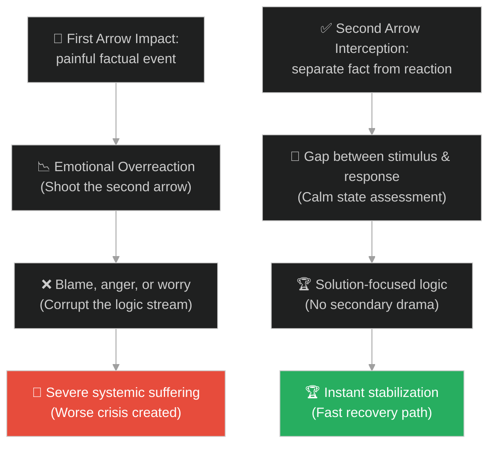
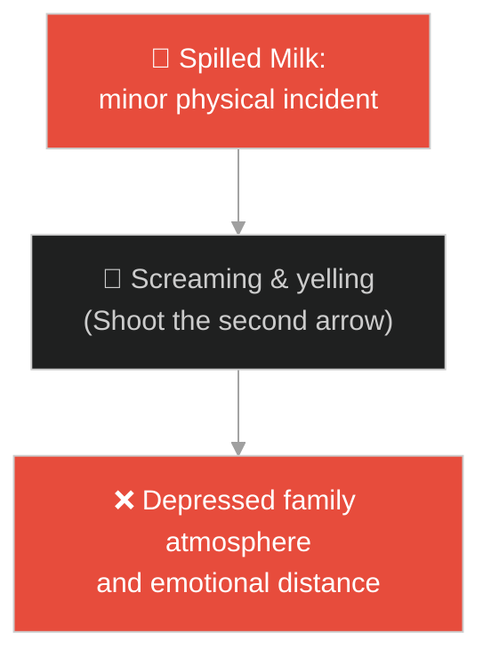
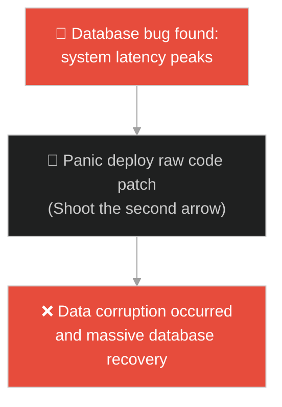
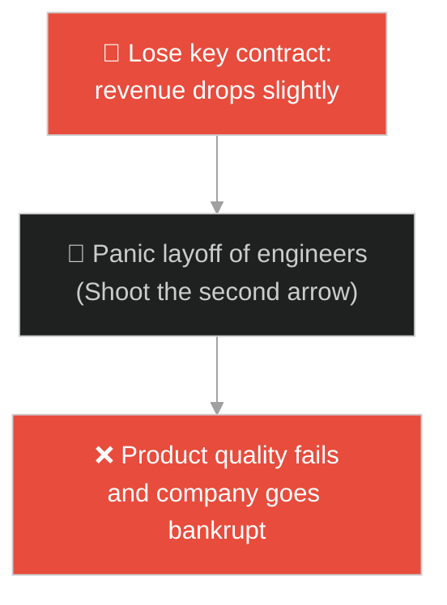
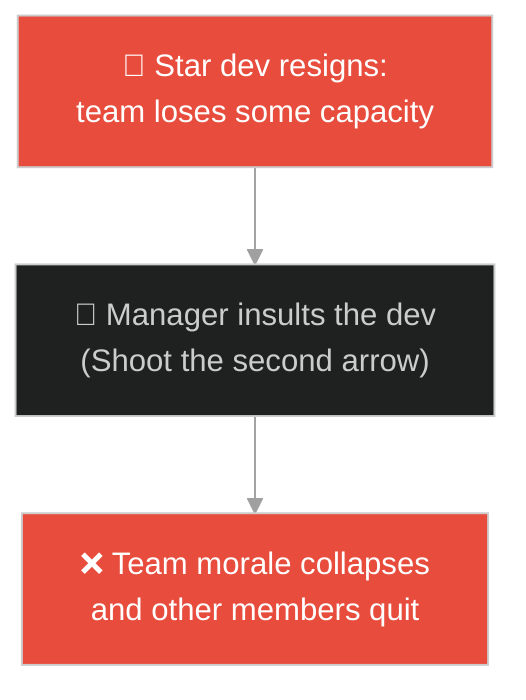
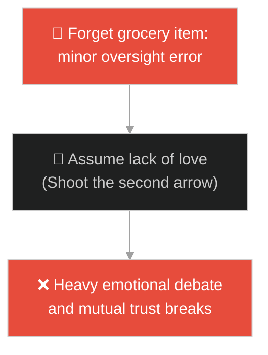
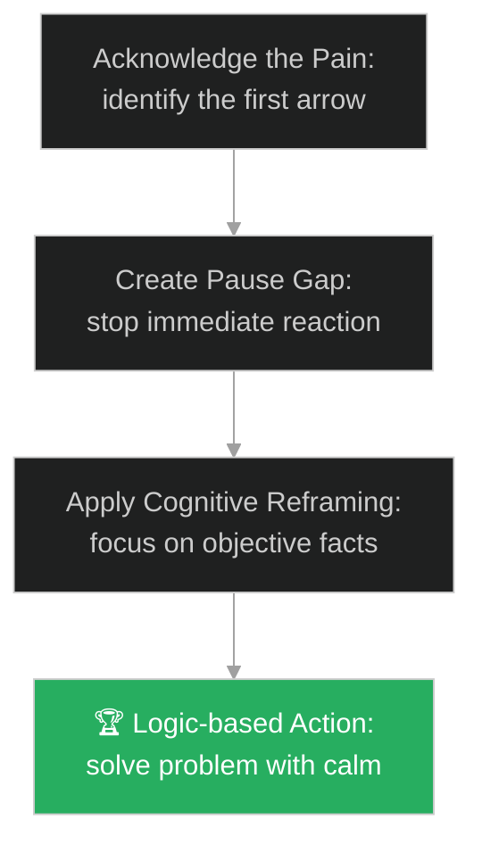

# Pain vs Suffering (ការឈឺចាប់ និងសេចក្តីទុក្ខ)៖ ព្រួញពីរគ្រាប់ (Pain vs Suffering & The Two Arrows)

**Author:** ichamrong  
**Date:** 2026-05-28  
**Tags:** #buddhism #emotional-regulation #cognitive-reframing #mental-models #life-lessons #parable  
**Category:** Concepts / Parables  
**Read Time:** ~15 min  

---

## 📌 មាតិកា (Table of Contents)
- [អន្ទាក់ផ្លូវចិត្ត (The Trap)](#0)
- [១. រឿងព្រេងព្រះពុទ្ធសាសនា៖ ព្រួញពីរគ្រាប់ (The Legend of the Two Arrows)](#1)
  - [យន្តការនៃការរងរបួសទ្វេដង និងការប្រតិកម្មផ្លូវចិត្ត (The Mechanics of Double Injury and Emotional Reaction)](#1-1)
- [២. បញ្ហា៖ ការស្វែងរកជនរងគ្រោះ និងការបង្កើតប្រតិកម្មហួសហេតុ (The Issue: Reactive Victimhood and Secondary Feedback Loops)](#2)
- [៣. ឧទាហមណ៍ជាក់ស្តែងក្នុងពិភពពិត (Real World Examples)](#3)
  - [ឧទាហរណ៍ទី ១ — កម្រិតស្រាល (គ្រួសារ)៖ ការកំពប់ទឹកដោះគោ និងការខឹងសម្បារពេញមួយថ្ងៃ (Spilled Milk and Family Screaming)](#3-1)
  - [ឧទាហរណ៍ទី ២ — កម្រិតមធ្យម (បច្ចេកទេស)៖ កំហុសកូដក្នុងប្រព័ន្ធ និងការភ័យស្លន់ស្លោធ្វើឱ្យខូចបន្ថែម (Prod Bug and Panic Deployments)](#3-2)
  - [ឧទាហរណ៍ទី ៣ — កម្រិតមធ្យម (ធុរកិច្ច)៖ ការបាត់បង់អតិថិជនធំ និងការកាត់បន្ថយថវិកាដោយក្តីបារម្ភ (Lost Major Client and Executive Panic)](#3-3)
  - [ឧទាហរណ៍ទី ៤ — កម្រិតមធ្យម (សង្គម/គ្រប់គ្រង)៖ បុគ្គលិកសុំលាឈប់ និងការយកកំហុសដាក់ខ្លួនរបស់ប្រធាន (Employee Resignation and Manager Defensiveness)](#3-4)
  - [ឧទាហរណ៍ទី ៥ — កម្រិតធ្ងន់ (ទំនាក់ទំនង)៖ ការភ្លេចទិញឥវ៉ាន់ និងការសង្ស័យលើក្តីស្រឡាញ់ (Forgotten Grocery and Relationship Doubt)](#3-5)
- [៤. ដំណោះស្រាយទូទៅ៖ ការទប់ស្កាត់ព្រួញទីពីរ និងការគ្រប់គ្រងប្រតិកម្ម (The General Solution: Intercepting the Second Arrow and Reframing Loops)](#4)
- [សេចក្តីសន្និដ្ឋាន (Conclusion)](#5)
- [ឯកសារយោង (References)](#6)
- [Related Posts](#7)

---

<a id="0"></a>
## អន្ទាក់ផ្លូវចិត្ត (The Trap)

តើអ្នកធ្លាប់ជួបបញ្ហាដែលរឿងមិនល្អតូចតាចមួយបានកើតឡើងក្នុងថ្ងៃការងាររបស់អ្នក រួចអ្នកក៏អនុញ្ញាតឱ្យកំហឹង ឬការព្រួយបារម្ភរបស់អ្នកពង្រីកវាឱ្យទៅជាថ្ងៃដ៏មហន្តរាយ និងបំផ្លាញទំនាក់ទំនងជាមួយមនុស្សជុំវិញខ្លួនដែរឬទេ?

នៅក្នុងការគ្រប់គ្រងអារម្មណ៍៖
* **យើងងាយនឹងធ្លាក់ក្នុងអន្ទាក់** នៃការបណ្តោយឱ្យប្រតិកម្មបន្ទាប់បន្សំ (Emotional Reaction) គ្រប់គ្រងលើបញ្ហាពិតប្រាកដ ដោយបង្កើតជាការឈឺចាប់ផ្លូវចិត្តបន្ថែមទៀត (Suffering) ដែលធំជាងបញ្ហាដើមឆ្ងាយណាស់។
* **យើងមើលរំលង** ការពិតដែលថា ព្រឹត្តិការណ៍អាក្រក់ជាការឈឺចាប់ដែលជៀសមិនរួច (Physical Pain/Factual Error) ប៉ុន្តែការរងទុក្ខវេទនាផ្លូវចិត្ត (Mental Suffering) គឺជាជម្រើសដែលយើងអាចគ្រប់គ្រងបាន។

ការយល់ច្រឡំនិងការបន្ថែមការឈឺចាប់ផ្លូវចិត្តលើបញ្ហាពិតប្រាកដ ហៅថា **អន្ទាក់ព្រួញពុលទីពីរ (Second Arrow Trap)**។

ដើម្បីយល់ដឹងពីរបៀបការពារចិត្តកុំឱ្យរងរបួសទ្វេដង នេះជាផែនទីបង្ហាញផ្លូវ៖
1. **រឿងព្រេងនិទាន (The Legend)** — រឿងរ៉ាវរបស់បុរសរងរបួសដោយសារព្រួញពីរគ្រាប់ដែលបាញ់ចំកន្លែងដដែល។
2. **បញ្ហា (The Issue)** — ការវិភាគយន្តការប្រតិកម្ម (Reactive Loop) ផលប៉ះពាល់លើការសម្រេចចិត្តក្នុងស្ថានភាពវិបត្តិ។
3. **ឧទាហមណ៍ជាក់ស្តែងក្នុងពិភពពិត (Real World Examples)** — ពិនិត្យមើលបញ្ហានេះក្នុងកម្រិតគ្រួសារ បច្ចេកវិទ្យា ធុរកិច្ច ការគ្រប់គ្រង និងទំនាក់ទំនង។
4. **ដំណោះស្រាយទូទៅ (The General Solution)** — ការអនុវត្តយុទ្ធសាស្ត្រ "ដកដង្ហើមធំមុនឆ្លើយតប" (Stimulus-Response Gap) និងវិធីសាស្ត្រ Cognitive Reframing។



---

<a id="1"></a>
## ១. រឿងព្រេងព្រះពុទ្ធសាសនា៖ ព្រួញពីរគ្រាប់ (The Legend of the Two Arrows)

សម័យមួយ ព្រះសម្មាសម្ពុទ្ធទ្រង់គង់ប្រថាប់នៅវត្តជេតពន។ ព្រះអង្គទ្រង់បានសម្តែងធម្មទេសនាទៅកាន់ភិក្ខុសង្ឃទាំងឡាយអំពីរបៀបដែលសត្វលោកឆ្លើយតបនឹងការឈឺចាប់ និងសេចក្តីទុក្ខ។

ព្រះពុទ្ធបានចោទសួរភិក្ខុសង្ឃថា៖
* *"ម្នាលភិក្ខុទាំងឡាយ ប្រសិនបើមានបុរសម្នាក់កំពុងដើរក្នុងព្រៃ រួចត្រូវគេបាញ់មួយព្រួញ តើគាត់ឈឺចាប់ដែរឬទេ?"*
* ភិក្ខុសង្ឃទាំងឡាយក្រាបទូលឆ្លើយតបវិញថា៖ *"បពិត្រព្រះអង្គដ៏ចម្រើន គាត់ប្រាកដជាឈឺចាប់ខ្លាំងណាស់ ព្រោះមុខព្រួញមុតស្រួចធ្វើឱ្យរាងកាយរងរបួស។"*
* ព្រះពុទ្ធទ្រង់សួរទៀតថា៖ *"ចុះប្រសិនបើមានគេបាញ់មួយព្រួញទៀត ចំកន្លែងដដែលនោះភ្លាមៗ តើការឈឺចាប់របស់គាត់នឹងកើនឡើងបែបណា?"*
* ភិក្ខុសង្ឃក្រាបបង្គំទូលឆ្លើយ៖ *"បពិត្រព្រះអង្គដ៏ចម្រើន ការឈឺចាប់របស់គាត់នឹងកើនឡើងទ្វេដង ឬច្រើនជាងនេះទៅទៀត ព្រោះរបួសចាស់មិនទាន់ជាផង ត្រូវរបួសថ្មីមកបន្ថែមពីលើ។"*

---

<a id="1-1"></a>
### យន្តការនៃការរងរបួសទ្វេដង និងការប្រតិកម្មផ្លូវចិត្ត (The Mechanics of Double Injury and Emotional Reaction)

ព្រះពុទ្ធទ្រង់ក៏មានបន្ទូលពន្យល់ថា៖
> «ត្រូវហើយ ម្នាលភិក្ខុទាំងឡាយ មនុស្សទូទៅតែងតែរងទុក្ខដោយសារព្រួញពីរគ្រាប់នេះជានិច្ច នៅក្នុងជីវិត។»

ព្រះអង្គបានពន្យល់លម្អិត៖
* **ព្រួញគ្រាប់ទីមួយ (The First Arrow):** គឺជារាងកាយវេទនា ឬការឈឺចាប់ដែលយើងមិនអាចចៀសវាងបាន។ វាតំណាងឱ្យព្រឹត្តិការណ៍ពិត ឬហេតុការណ៍អាក្រក់ដែលកើតឡើងចំពោះយើងដោយចៃដន្យ (ដូចជា ជំងឺកាយ ការបាត់បង់ ការរងរបួស ឬកំហុសប្រព័ន្ធ)។ នេះជាច្បាប់ធម្មជាតិ។
* **ព្រួញគ្រាប់ទីពីរ (The Second Arrow):** គឺការឈឺចាប់ផ្លូវចិត្តដែលយើងបង្កើតឡើងដោយខ្លួនឯង តាមរយៈប្រតិកម្មអវិជ្ជមានចំពោះព្រួញគ្រាប់ទីមួយ។ វាតំណាងឱ្យការត្អូញត្អែរ ការខឹងសម្បារ ការស្វែងរកអ្នកបន្ទោស ការខ្វល់ខ្វាយ និងការសោកសង្រេងដែលមិនចាំបាច់។

ព្រះពុទ្ធទ្រង់បានសន្និដ្ឋានថា មនុស្សដែលមានការអប់រំផ្លូវចិត្តល្អ នឹងទទួលរងរបួសតែពី **ព្រួញគ្រាប់ទីមួយ** ប៉ុណ្ណោះ ប៉ុន្តែពួកគេនឹងមិនអនុញ្ញាតឱ្យ **ព្រួញគ្រាប់ទីពីរ** បាញ់មកទម្លុះបេះដូងរបស់ពួកគេឡើយ។

---

<a id="2"></a>
## ២. បញ្ហា៖ ការស្វែងរកជនរងគ្រោះ និងការបង្កើតប្រតិកម្មហួសហេតុ (The Issue: Reactive Victimhood and Secondary Feedback Loops)

នៅក្នុងការងារបច្ចេកវិទ្យា និងការគ្រប់គ្រង វិបត្តិព្រួញទីពីរជាធម្មតាកើតឡើងនៅពេលមានកំហុសប្រព័ន្ធ (System Bugs) ហើយក្រុមការងារចំណាយពេលភ័យស្លន់ស្លោ ឬទម្លាក់កំហុសដាក់គ្នា ជំនួសឱ្យការដោះស្រាយ៖

```java
// ការអនុញ្ញាតឱ្យប្រតិកម្មអវិជ្ជមានពន្យារពេលនៃការដោះស្រាយបញ្ហាពិត
public class IssueResponse {
    public void handleOutage(boolean serverDown) {
        if (serverDown) {
            // ព្រួញទីមួយ៖ Server down (Pain)
            // ព្រួញទីពីរ៖ ភ័យស្លន់ស្លោ និងខឹងសម្បារ បង្កើតការប្រជុំបន្ទាន់ដើម្បីរកអ្នកបន្ទោស
            triggerPanicMeeting();
            // លទ្ធផល៖ ប្រព័ន្ធយឺតយ៉ាវការស្តារឡើងវិញទ្វេដង (Suffering)
        }
    }
    
    private void triggerPanicMeeting() {
        System.out.println("Shouting at developers: Who deployment this bug?!");
    }
}
```

* **ការបង្កើតវិបត្តិលើសពីវិបត្តិដើម (Compounding the Crisis)៖** ការខឹងនឹងអតិថិជនដែលរិះគន់ប្រព័ន្ធរបស់យើង នាំឱ្យយើងសរសេរអ៊ីមែលឆ្លើយតបដ៏អាក្រក់មួយ ដែលបំផ្លាញកេរ្តិ៍ឈ្មោះក្រុមហ៊ុន។
* **ការបាត់បង់ភាពច្បាស់លាស់ក្នុងការសម្រេចចិត្ត (Cognitive Dissonance)៖** នៅពេលខួរក្បាលពោរពេញដោយអរម៉ូនស្រ្តេស (Cortisol) ដោយសារប្រតិកម្មអវិជ្ជមាន យើងមិនអាចគិតរកដំណោះស្រាយបច្ចេកទេសដ៏ត្រឹមត្រូវឡើយ។

---

<a id="3"></a>
## ៣. ឧទាហមណ៍ជាក់ស្តែងក្នុងពិភពពិត

---

<a id="3-1"></a>
### ឧទាហរណ៍ទី ១ — កម្រិតស្រាល (គ្រួសារ)៖ ការកំពប់ទឹកដោះគោ និងការខឹងសម្បារពេញមួយថ្ងៃ (Spilled Milk and Family Screaming)

កូនតូចម្នាក់បានធ្វើឱ្យកំពប់ទឹកដោះគោនៅលើតុអាហារពេលព្រឹក (ព្រួញទីមួយ)។ ឪពុកម្តាយបានខឹងសម្បារយ៉ាងខ្លាំង ហើយចាប់ផ្តើមស្រែកជេរប្រមាថកូន និងឈ្លោះគ្នាទៅវិញទៅមក (ព្រួញទីពីរ)។ លទ្ធផលគឺទឹកដោះគោមួយកែវតម្លៃតិចតួច បានបំប្លែងទៅជាការខូចខាតអារម្មណ៍របស់សមាជិកគ្រួសារទាំងអស់ពេញមួយថ្ងៃ។



---

<a id="3-2"></a>
### ឧទាហរណ៍ទី ២ — កម្រិតមធ្យម (បច្ចេកទេស)៖ កំហុសកូដក្នុងប្រព័ន្ធ និងការភ័យស្លន់ស្លោធ្វើឱ្យខូចបន្ថែម (Prod Bug and Panic Deployments)

ប្រព័ន្ធជួបប្រទះបញ្ហាប៊ឺគមួយចៃដន្យនៅក្នុង Database (ព្រួញទីមួយ)។ អ្នកសរសេរកូដភ័យស្លន់ស្លោ និងបារម្ភពីការស្តីបន្ទោស (ព្រួញទីពីរ) រួចក៏ប្រញាប់ប្រញាល់សរសេរកូដបំណះ (Hotfix) ដោយគ្មានការធ្វើតេស្តត្រឹមត្រូវ។ កូដបំណះថ្មីនេះបានលុបទិន្នន័យអតិថិជនអស់ជាច្រើន ដែលធ្វើឱ្យប្រព័ន្ធខូចខាតធ្ងន់ធ្ងរជាងមុន ១០ ដង។



---

<a id="3-3"></a>
### ឧទាហរណ៍ទី ៣ — កម្រិតមធ្យម (ធុរកិច្ច)៖ ការបាត់បង់អតិថិជនធំ និងការកាត់បន្ថយថវិកាដោយក្តីបារម្ភ (Lost Major Client and Executive Panic)

ក្រុមហ៊ុនបាត់បង់កិច្ចសន្យាជាមួយអតិថិជនធំមួយដោយសារការប្រកួតប្រជែងទីផ្សារ (ព្រួញទីមួយ)។ នាយកប្រតិបត្តិភ័យស្លន់ស្លោ និងគិតថាអាជីវកម្មជិតដួលរលំ (ព្រួញទីពីរ) រួចក៏ប្រញាប់ប្រញាល់កាត់បន្ថយថវិកាអភិវឌ្ឍន៍ផលិតផល និងបញ្ឈប់បុគ្គលិកជំនាញសំខាន់ៗ ដែលធ្វើឱ្យគុណភាពផលិតផលធ្លាក់ចុះ ហើយអតិថិជនដទៃទៀតក៏នាំគ្នាចាកចេញបន្ថែម។



---

<a id="3-4"></a>
### ឧទាហរណ៍ទី ៤ — កម្រិតមធ្យម (សង្គម/គ្រប់គ្រង)៖ បុគ្គលិកសុំលាឈប់ និងការយកកំហុសដាក់ខ្លួនរបស់ប្រធាន (Employee Resignation and Manager Defensiveness)

សមាជិកក្រុមដ៏ពូកែម្នាក់សុំលាឈប់ដើម្បីទៅចាប់យកឱកាសថ្មី (ព្រួញទីមួយ)។ ប្រធានក្រុមមានអារម្មណ៍ខឹង និងគិតថានេះជាការក្បត់ ឬការមិនគោរពខ្លួន (ព្រួញទីពីរ) រួចក៏ចាប់ផ្តើមប្រព្រឹត្តមិនល្អដាក់បុគ្គលិកនោះ ធ្វើឱ្យបរិយាកាសការងារក្នុងក្រុមមានជាតិពុល ហើយសមាជិកដទៃទៀតក៏ចាប់ផ្តើមរៀបចំលាឈប់តាមគ្នា។



---

<a id="3-5"></a>
### ឧទាហរណ៍ទី ៥ — កម្រិតធ្ងន់ (ទំនាក់ទំនង)៖ ការភ្លេចទិញឥវ៉ាន់ និងការសង្ស័យលើក្តីស្រឡាញ់ (Forgotten Grocery and Relationship Doubt)

ប្តីបានភ្លេចទិញបន្លែសម្រាប់ធ្វើអាហារពេលល្ងាចតាមការកុម្ម៉ង់របស់ប្រពន្ធ (ព្រួញទីមួយ)។ ប្រពន្ធចាប់ផ្តើមគិតអវិជ្ជមានភ្លាមថា ប្តីលែងស្រឡាញ់ និងមិនយកចិត្តទុកដាក់នឹងនាងទៀតហើយ (ព្រួញទីពីរ) រួចក៏ចាប់ផ្តើមរំលឹករឿងរ៉ាវកំហុសចាស់ៗមកឈ្លោះប្រកែកគ្នា ដែលធ្វើឱ្យរាត្រីដ៏ស្ងប់ស្ងាត់ប្រែជាសង្គ្រាមផ្លូវចិត្ត។



---

<a id="4"></a>
## ៤. ដំណោះស្រាយទូទៅ៖ ការទប់ស្កាត់ព្រួញទីពីរ និងការគ្រប់គ្រងប្រតិកម្ម (The General Solution: Intercepting the Second Arrow and Reframing Loops)

ដើម្បីដោះស្រាយ និងបញ្ឈប់ការរងរបួសទ្វេដង យើងត្រូវអនុវត្តប្រព័ន្ធគ្រប់គ្រងប្រតិកម្មផ្លូវចិត្ត និងការសម្រេចចិត្តប្រកបដោយសតិស្មារតី៖



* **ការអនុវត្ត Stimulus-Response Gap (ចន្លោះរវាងសញ្ញាណ និងប្រតិកម្ម)៖** នៅពេលជួបរឿងអាក្រក់ ចូរអនុវត្តច្បាប់ "ដកដង្ហើមវែងៗ ៥ ដង" ឬ "រង់ចាំ ១០ វិនាទី" មុននឹងឆ្លើយតប ដើម្បីទុកពេលឱ្យខួរក្បាលផ្នែកសនិទានភាព (Prefrontal Cortex) ដំណើរការជំនួសឱ្យខួរក្បាលអារម្មណ៍ (Amygdala)។
* **ការប្រើប្រាស់បច្ចេកទេសបំបែកការពិត និងអារម្មណ៍ (Fact-Reaction Separation)៖** សរសេរលើក្រដាសនូវ "តើអ្វីជាការពិតជាក់ស្តែង?" (ដូចជា Server Down) និង "តើអ្វីជាការគិតបារម្ភរបស់ខ្ញុំ?" (ដូចជា ខ្ញុំនឹងត្រូវគេបណ្តេញចេញ) ដើម្បីមើលឃើញការបំផ្លើសផ្លូវចិត្តរបស់ខ្លួនឯង។
* **ការបង្កើតវប្បធម៌ដោះស្រាយបញ្ហាមុនបន្ទោសបុគ្គល (Fix-First-Blame-Never)៖** ក្នុងស្ថាប័នការងារ ត្រូវបញ្ឈប់ការសួររក "តើនរណាធ្វើឱ្យខូច?" ក្នុងអំឡុងពេលវិបត្តិ។ ត្រូវបង្វែរថាមពលទាំងស្រុងទៅលើ "តើយើងត្រូវដោះស្រាយវាដោយរបៀបណា?"។

---

## 🐇 ធ្លាក់ចូលក្នុងរន្ធទន្សាយ (Enter the Rabbit Hole)

ដើម្បីស្វែងយល់កាន់តែស៊ីជម្រៅអំពីរបៀបគ្រប់គ្រងតុល្យភាពការងារ និងកាត់បន្ថយភាពតានតឹង សូមចាប់ផ្តើមដំណើររុករករបស់អ្នកដោយចុចលើតំណភ្ជាប់ខាងក្រោម៖

* 🚀 **[ចាប់ផ្តើមដំណើររុករក (Start the Journey) ➔ ពិណដែលរឹតតឹងពេក (The Lute Strings)](./113-buddha-and-the-lute-strings.md)**

---

<a id="5"></a>
## សេចក្តីសន្និដ្ឋាន (Conclusion)

> **«យើងមិនអាចគ្រប់គ្រងកម្លាំងខ្យល់ដែលបក់មកបានទេ ប៉ុន្តែយើងអាចគ្រប់គ្រងក្តោងទូករបស់យើងបាន។»**

ការឈឺចាប់ និងព្រឹត្តិការណ៍មិនល្អជាចំណែកមួយនៃជីវិតធម្មជាតិដែលមិនអាចចៀសផុត។ វិទ្យាសាស្ត្រពិតនៃការរស់នៅគឺការរៀនបញ្ឈប់ការបាញ់ព្រួញពុលគ្រាប់ទីពីរដាក់ខ្លួនឯង។ នៅពេលយើងរក្សាបាននូវចិត្តស្ងប់ និងបើកទូលាយ យើងនឹងមិនត្រឹមតែដោះស្រាយបញ្ហាបានល្អប្រសើរប៉ុណ្ណោះទេ ប៉ុន្តែថែមទាំងរក្សាបាននូវភាពសុខសាន្តផ្លូវចិត្តផងដែរ។

---

<a id="6"></a>
## ឯកសារយោង (References)

* **Sallatha Sutta (The Arrow)** — Samyutta Nikaya 36.6, Buddhist Pali Canon.
* **Viktor Frankl** — *Man's Search for Meaning* (1946). Discussing the gap between stimulus and response.
* **Albert Ellis** — *Reason and Emotion in Psychotherapy* (1962). The foundation of Rational Emotive Behavior Therapy (REBT).

---

<a id="7"></a>
## Related Posts

* [The Mustard Seed](./111-buddha-and-the-mustard-seed.md) — Radical acceptance of loss and shared human suffering.
* [Solomon's Ring](./40-solomons-ring.md) — Stoic approaches to managing emotional highs and lows in incident response.
