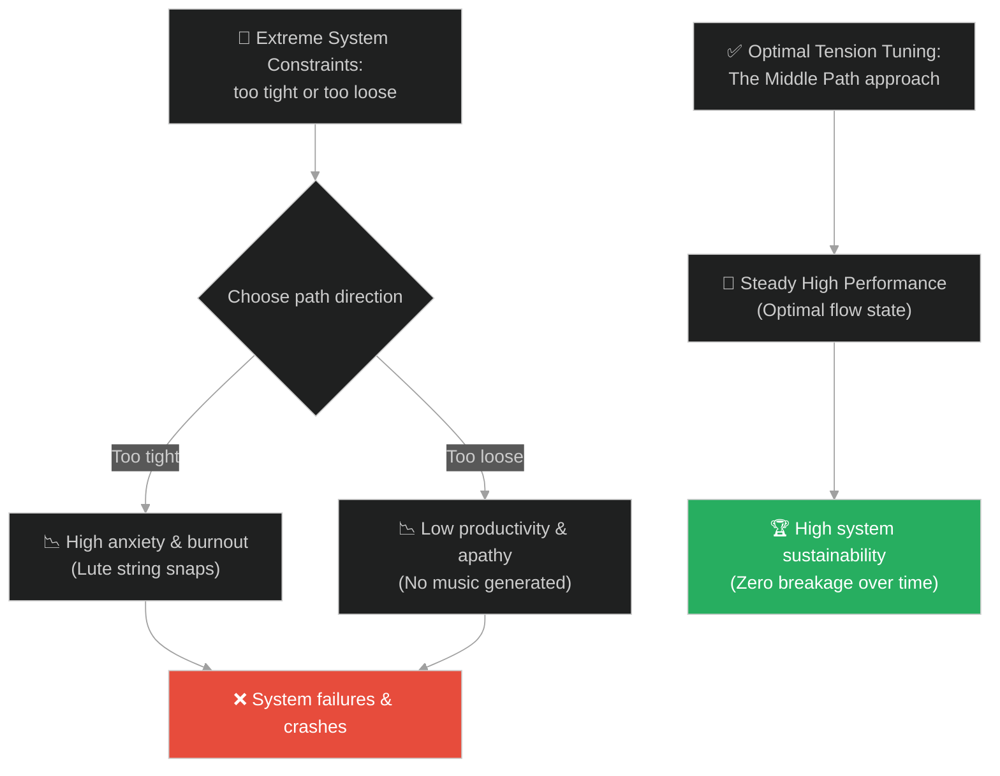
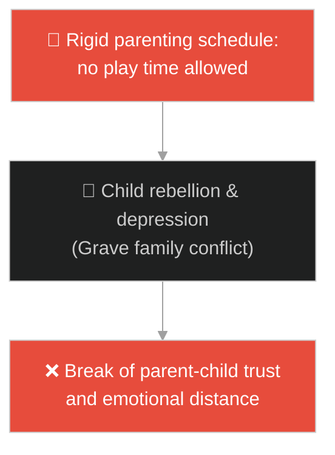
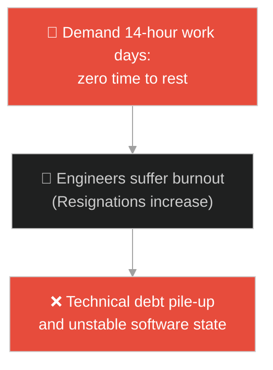
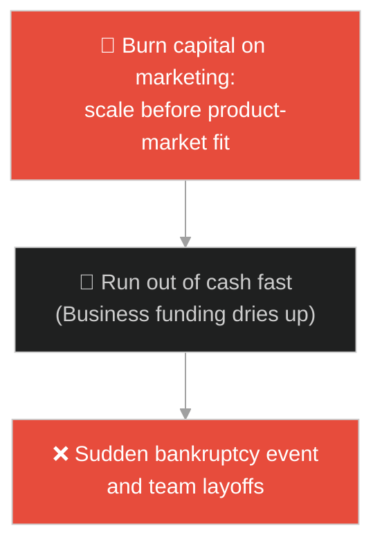
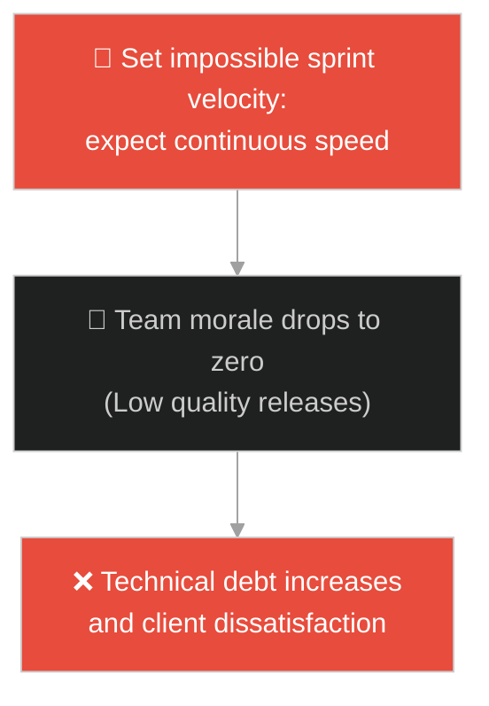
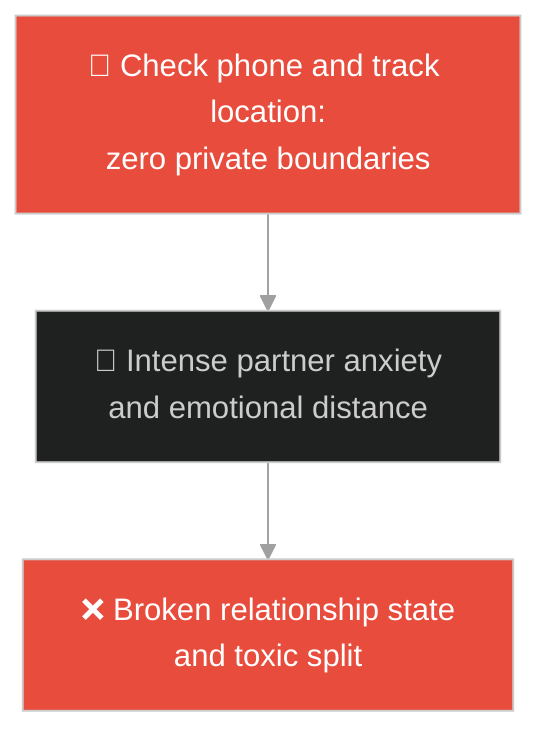
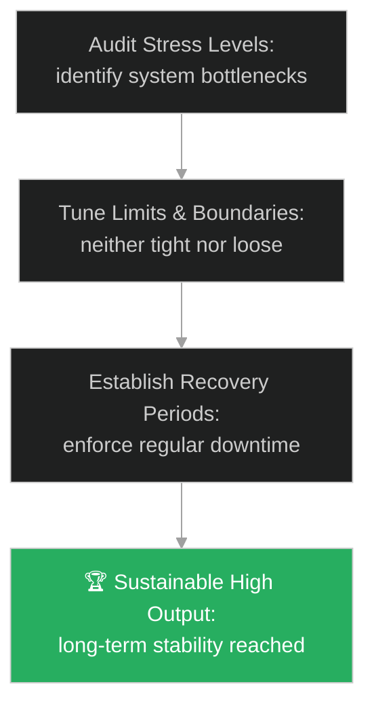

# The Middle Path (ផ្លូវកណ្តាល និងតុល្យភាព)៖ ខ្សែពិណរបស់ភិក្ខុសោណៈ (The Middle Path & The Lute Strings)

**Author:** ichamrong  
**Date:** 2026-05-28  
**Tags:** #buddhism #middle-way #burnout #yerkes-dodson-law #mental-models #parable  
**Category:** Concepts / Parables  
**Read Time:** ~15 min  

---

## 📌 មាតិកា (Table of Contents)
- [អន្ទាក់ផ្លូវចិត្ត (The Trap)](#0)
- [១. រឿងព្រេងព្រះពុទ្ធសាសនា៖ ភិក្ខុសោណៈ និងខ្សែពិណ (The Legend of Sona and the Lute Strings)](#1)
  - [សំនួរទៅកាន់អតីតអ្នកលេងពិណ និងយន្តការនៃផ្លូវកណ្តាល (Questions for the Lute Player and Middle Way Mechanics)](#1-1)
- [២. បញ្ហា៖ វិបត្តិអស់កម្លាំងលែងចង់ធ្វើ និងការបាត់បង់តុល្យភាពប្រព័ន្ធ (The Issue: Burnout vs Boreout and Systemic Out-of-Tune)](#2)
- [៣. ឧទាហមណ៍ជាក់ស្តែងក្នុងពិភពពិត (Real World Examples)](#3)
  - [ឧទាហរណ៍ទី ១ — កម្រិតស្រាល (គ្រួសារ)៖ ការអប់រំកូនតឹងតែងហួសហេតុ vs ធូររលុងហួសប្រមាណ (Over-controlling vs Neglectful Parenting)](#3-1)
  - [ឧទាហរណ៍ទី ២ — កម្រិតមធ្យម (បច្ចេកទេស)៖ វប្បធម៌ប្រឹងហួសប្រមាណ vs កង្វះគោលដៅបញ្ហាប្រឈម (Hustle Crunch vs Lack of Challenge)](#3-2)
  - [ឧទាហរណ៍ទី ៣ — កម្រិតមធ្យម (ធុរកិច្ច)៖ ការចំណាយដើមទុនបំភាយហួសសមត្ថភាព vs ភាពយឺតយ៉ាវនៃទីផ្សារ (Aggressive Scaling vs Market Inertia)](#3-3)
  - [ឧទាហរណ៍ទី ៤ — កម្រិតមធ្យម (សង្គម/គ្រប់គ្រង)៖ ការកំណត់ KPI ខ្ពស់ជ្រុល vs កង្វះការវាយតម្លៃលទ្ធផល (Impossible Sprint Goals vs Unmanaged Backlog)](#3-4)
  - [ឧទាហរណ៍ទី ៥ — កម្រិតធ្ងន់ (ទំនាក់ទំនង)៖ ភាពប្រច័ណ្ឌថប់ដង្ហើម vs ភាពត្រជាក់ស្រជុំនៃអារម្មណ៍ (Suffocating Control vs Emotional Apathy)](#3-5)
- [៤. ដំណោះស្រាយទូទៅ៖ ការអនុវត្តតុល្យភាពប្រព័ន្ធ និងច្បាប់ Yerkes-Dodson (The General Solution: Tuning System Constraints and Managing Stress Curves)](#4)
- [សេចក្តីសន្និដ្ឋាន (Conclusion)](#5)
- [ឯកសារយោង (References)](#6)
- [Related Posts](#7)

---

<a id="0"></a>
## អន្ទាក់ផ្លូវចិត្ត (The Trap)

តើអ្នកធ្លាប់ជួបបញ្ហាដែលក្រុមការងារ ឬខ្លួនឯងប្រឹងប្រែងធ្វើការងាររហូតដល់អស់កម្លាំងកាយចិត្តទាំងស្រុង (Burnout) រហូតដល់ចង់បោះបង់ចោលកិច្ចការនោះទាំងកណ្តាលទី ឬផ្ទុយទៅវិញ បណ្តោយខ្លួនឱ្យធូររលុងពេករហូតដល់គ្មានការរីកចម្រើន (Boreout) ដែរឬទេ?

នៅក្នុងការគ្រប់គ្រងសម្ពាធ និងការងារ៖
* **យើងងាយនឹងធ្លាក់ក្នុងអន្ទាក់** នៃការគិតថា "ការប្រឹងប្រែងកាន់តែច្រើនដោយគ្មានការសម្រាក នាំឱ្យលទ្ធផលកាន់តែអស្ចារ្យ" (Hustle Culture Trap) ដែលនាំឱ្យខ្សែជីវិតរឹតតឹងពេករហូតដល់ដាច់។
* **យើងមើលរំលង** សារៈសំខាន់នៃ "តុល្យភាពភាពតានតឹង" (Optimal Tension) ដែលជាចំណុចកណ្តាលធានាឱ្យប្រព័ន្ធដំណើរការបានយូរអង្វែង និងបញ្ចេញសមត្ថភាពបានល្អបំផុត។

ការព្យាយាមរុញច្រានប្រព័ន្ធឱ្យដំណើរការក្រោមសម្ពាធជ្រុល ឬខ្វះការជំរុញទាំងស្រុង ហៅថា **អន្ទាក់អសមតុល្យនៃខ្សែពិណ (System Out-of-Tune Trap)**។

ដើម្បីយល់ដឹងពីរបៀបស្វែងរកចំណុចកណ្តាលប្រកបដោយនិរន្តរភាព នេះជាផែនទីបង្ហាញផ្លូវ៖
1. **រឿងព្រេងនិទាន (The Legend)** — រឿងរ៉ាវរបស់ភិក្ខុសោណៈដែលព្យាយាមបដិបត្តិធម៌រហូតបែកជើងឈាម តែមិនបានផល ទាល់តែព្រះពុទ្ធប្រដៅរឿងខ្សែពិណ។
2. **បញ្ហា (The Issue)** — ការវិភាគចិត្តវិទ្យានៃសម្ពាធ និងសមត្ថភាពការងារ (Yerkes-Dodson Law)។
3. **ឧទាហមណ៍ជាក់ស្តែងក្នុងពិភពពិត (Real World Examples)** — ពិនិត្យមើលបញ្ហានេះក្នុងកម្រិតគ្រួសារ បច្ចេកវិទ្យា ធុរកិច្ច ការគ្រប់គ្រង និងទំនាក់ទំនង។
4. **ដំណោះស្រាយទូទៅ (The General Solution)** — ការកំនត់លក្ខខណ្ឌការងារឱ្យមានតុល្យភាព និងការអនុវត្តច្បាប់រឹតខ្សែពិណ។



---

<a id="1"></a>
## ១. រឿងព្រេងព្រះពុទ្ធសាសនា៖ ភិក្ខុសោណៈ និងខ្សែពិណ (The Legend of Sona and the Lute Strings)

សម័យមួយ ព្រះសម្មាសម្ពុទ្ធទ្រង់គង់ប្រថាប់នៅវត្តជេតពន។ ក្នុងចំណោមភិក្ខុសង្ឃ មានភិក្ខុមួយអង្គព្រះនាម **សោណៈ (Sona)** ដែលជាបុត្ររបស់សេដ្ឋីម្នាក់ និងជាអ្នកលេងពិណ (Vina) ដ៏ល្បីល្បាញកាលនៅជាគ្រហស្ថ។

បន្ទាប់ពីបានសុំបួសក្នុងពុទ្ធសាសនា៖
* ភិក្ខុសោណៈបានបដិបត្តិធម៌ដោយសេចក្តីព្យាយាមយ៉ាងខ្លាំងក្លាបំផុត។ លោកបានដើរចង្ក្រម (Walking Meditation) ឥតឈប់ឈរទាំងយប់ទាំងថ្ងៃ រហូតដល់បាតជើងរបស់លោកបែកពងបែកឈាមប្រឡាក់ពេញផ្លូវចង្ក្រម។
* ទោះបីជាខិតខំប្រឹងប្រែងស្ទើរតែស្លាប់ខ្លួនយ៉ាងណាក៏ដោយ ក៏លោកនៅតែមិនអាចសម្រេចធម៌ ឬរកឃើញសេចក្តីស្ងប់ក្នុងចិត្តបានឡើយ។
* ដោយក្តីអស់សង្ឃឹម និងបាក់ទឹកចិត្តជាខ្លាំង ភិក្ខុសោណៈក៏បានគិតក្នុងចិត្តថា៖ *"ក្នុងចំណោមសិស្សរបស់ព្រះពុទ្ធ ខ្ញុំជាអ្នកប្រឹងប្រែងជាងគេបំផុតម្នាក់។ តែហេតុអ្វីចិត្តខ្ញុំនៅតែមិនទាន់រួចចាកទុក្ខ? ប្រហែលជាខ្ញុំគ្មានវាសនាបួសសម្រេចធម៌ទេ មករកផ្លូវសឹកទៅរស់នៅជាគ្រហស្ថ និងធ្វើបុណ្យវិញប្រសើរជាង។"*

---

<a id="1-1"></a>
### សំនួរទៅកាន់អតីតអ្នកលេងពិណ និងយន្តការនៃផ្លូវកណ្តាល (Questions for the Lute Player and Middle Way Mechanics)

ព្រះពុទ្ធទ្រង់ជ្រាបពីគំនិតរបស់ភិក្ខុសោណៈ ទ្រង់ក៏បានយាងមកកាន់កុដិរបស់លោកផ្ទាល់ រួចមានបន្ទូលសួរដេញដោលថា៖
* *"ម្នាលសោណៈ កាលអ្នកនៅជាគ្រហស្ថ តើអ្នកជាអ្នកលេងពិណដ៏ពូកែម្នាក់មែនដែរឬទេ?"* (សោណៈក្រាបបង្គំទូលថា ពិតមែនហើយ)
* *"ចុះប្រសិនបើអ្នករឹតខ្សែពិណនោះ **តឹងខ្លាំងពេក** តើវាអាចបន្លឺសម្លេងពីរោះ និងងាយលេងដែរឬទេ?"* 
  សោណៈឆ្លើយថា៖ *"មិនអាចទេព្រះអង្គ ខ្សែពិណនឹងឡើងតឹងខ្លាំង ហើយងាយនឹងដាច់ជាមិនខាន។"*
* *"ចុះប្រសិនបើអ្នកបន្ធូរខ្សែពិណនោះ **ធូរខ្លាំងពេក** តើវានឹងបន្លឺសម្លេងពីរោះដែរឬទេ?"* 
  សោណៈឆ្លើយថា៖ *"មិនពីរោះទេព្រះអង្គ ព្រោះខ្សែធូរពេកលែងមានកម្លាំងបន្លឺសម្លេងបានឡើយ។"*
* *"ចុះតើត្រូវធ្វើដូចម្តេច ទើបពិណនោះបន្លឺសម្លេងបានពីរោះបំផុត?"*
  សោណៈក្រាបទូលថា៖ *"ទាល់តែយើងរឹតខ្សែពិណនោះក្នុង **កម្រិតមធ្យមល្មម** មិនតឹងពេក មិនធូរពេក ស្ថិតក្នុងសភាពតុល្យភាព។"*

ព្រះពុទ្ធទ្រង់ក៏សម្តែងបន្ទូលសន្និដ្ឋានថា៖
> «ការខិតខំប្រឹងប្រែងបដិបត្តិធម៌ក៏ដូចគ្នាដែរ សោណៈ។ ប្រសិនបើយើងព្យាយាមតឹងតែងជ្រុលពេក វានឹងបង្កើតឱ្យមានភាពតានតឹង ក្តីបារម្ភ និងនាំឱ្យអស់កម្លាំងបោះបង់ចោល។ តែបើយើងធូររលុងពេក វានឹងនាំឱ្យកើតសេចក្តីខ្ជិលច្រអូស។ ចូរអ្នកអនុវត្តការព្យាយាមក្នុងកម្រិតសមល្មម (The Middle Way) ស្វែងរកតុល្យភាពរបស់វាចុះ។»

ភិក្ខុសោណៈបានយល់ដឹងពីសច្ចធម៌នេះ រួចលោកក៏កែសម្រួលវិធីសាស្ត្របដិបត្តិធម៌មកកាន់ផ្លូវកណ្តាលវិញ និងបានសម្រេចជាព្រះអរហន្តក្នុងពេលដ៏ខ្លីខាងមុខ។

---

<a id="2"></a>
## ២. បញ្ហា៖ វិបត្តិអស់កម្លាំងលែងចង់ធ្វើ និងការបាត់បង់តុល្យភាពប្រព័ន្ធ (The Issue: Burnout vs Boreout and Systemic Out-of-Tune)

នៅក្នុងវិស្វកម្ម និងការគ្រប់គ្រង កង្វះការសម្របសម្រួលកម្រិតសម្ពាធការងារនាំឱ្យកើតមានបញ្ហានិរន្តរភាព (Sustainability Failure)៖

```java
// ការកំណត់អត្រាការងារ (Throughput Constraints) មិនត្រឹមត្រូវ នាំឱ្យប្រព័ន្ធគាំង
public class PipelineProcessor {
    public void processTasks(int loadFactor) {
        if (loadFactor > 95) {
            // ខ្សែតឹងពេក៖ ប្រព័ន្ធដំណើរការពេញទំហំ ១០០% រហូតដល់ Overheat និងខូច Memory (Burnout)
            throw new RuntimeException("Memory leak / CPU Burnout!");
        } else if (loadFactor < 10) {
            // ខ្សែធូរពេក៖ ប្រព័ន្ធទំនេរលែងដំណើរការ (Boreout/Inertia)
            System.out.println("Idle state... resource wasted.");
        }
    }
}
```

* **បាតុភូត Burnout របស់បុគ្គលិក (Developer Attrition)៖** នៅពេលស្ថាប័នការងារបង្ខំបុគ្គលិកឱ្យធ្វើការបន្ថែមម៉ោងឥតឈប់ឈរ (Crunch Mode) គុណភាពកូដនឹងធ្លាក់ចុះ ហើយកំហុសធ្ងន់ៗនឹងកើតឡើងដោយសារភាពនឿយហត់។
* **បាតុភូត Boreout (Resource Waste/Stagnation)៖** នៅពេលគ្មានគោលដៅច្បាស់លាស់ គ្មានការជំរុញ ឬការងារដដែលៗធុញទ្រាន់ ក្រុមការងារនឹងបាត់បង់ថាមពលអភិវឌ្ឍជំនាញ និងលែងចង់បង្កើតថ្មី។

---

<a id="3"></a>
## ៣. ឧទាហមណ៍ជាក់ស្តែងក្នុងពិភពពិត

---

<a id="3-1"></a>
### ឧទាហរណ៍ទី ១ — កម្រិតស្រាល (គ្រួសារ)៖ ការអប់រំកូនតឹងតែងហួសហេតុ vs ធូររលុងហួសប្រមាណ (Over-controlling vs Neglectful Parenting)

នៅក្នុងការចិញ្ចឹមកូន ឪពុកម្តាយខ្លះគ្រប់គ្រងកូនតឹងតែងជ្រុល (ខ្សែតឹង) ដោយកំណត់កាលវិភាគសិក្សា ២៤ម៉ោង និងហាមឃាត់ការលេងកម្សាន្ត ធ្វើឱ្យកូនកើតស្ត្រេសខ្លាំង និងចង់រត់ចេញពីផ្ទះ។ ផ្ទុយទៅវិញ ឪពុកម្តាយខ្លះបណ្តោយកូនពេក (ខ្សែធូរ) មិនខ្វល់ពីការសិក្សា និងការប្រព្រឹត្ត ធ្វើឱ្យកូនបាត់បង់សណ្តាប់ធ្នាប់ និងអនាគត។ តុល្យភាពគឺការកំណត់ព្រំដែនច្បាស់លាស់ តែផ្តល់សេរីភាពសមរម្យ។



---

<a id="3-2"></a>
### ឧទាហរណ៍ទី ២ — កម្រិតមធ្យម (បច្ចេកទេស)៖ វប្បធម៌ប្រឹងហួសប្រមាណ vs កង្វះគោលដៅបញ្ហាប្រឈម (Hustle Crunch vs Lack of Challenge)

នៅក្នុងក្រុមហ៊ុនបច្ចេកវិទ្យាមួយ នាយកដ្ឋានសរសេរកូដតម្រូវឱ្យបុគ្គលិកធ្វើការ ១៤ម៉ោងក្នុងមួយថ្ងៃ ដើម្បីបញ្ចេញផលិតផលឱ្យលឿនបំផុត (Crunch Mode)។ លទ្ធផលគឺអ្នកសរសេរកូដលាឈប់ពាក់កណ្តាល ហើយប្រព័ន្ធជួប outage ឥតឈប់ឈរ។ ផ្ទុយទៅវិញ ក្រុមហ៊ុនរដ្ឋមួយដំណើរការការងារធូររលុងពេក គ្មានគម្រោងថ្មី ធ្វើឱ្យអ្នកសរសេរកូដលែងអភិវឌ្ឍសមត្ថភាព និងដើរយឺតជាងបច្ចេកវិទ្យាទំនើប។



---

<a id="3-3"></a>
### ឧទាហរណ៍ទី ៣ — កម្រិតមធ្យម (ធុរកិច្ច)៖ ការចំណាយដើមទុនបំភាយហួសសមត្ថភាព vs ភាពយឺតយ៉ាវនៃទីផ្សារ (Aggressive Scaling vs Market Inertia)

Startup មួយបន្ទាប់ពីទទួលបានទុនវិនិយោគ បានសម្រេចចិត្តជ្រើសរើសបុគ្គលិកថ្មី ៥០០ នាក់ក្នុងមួយខែ និងផ្សព្វផ្សាយពាណិជ្ជកម្មយ៉ាងគំហុក (ខ្សែតឹងខ្លាំង) ធ្វើឱ្យដើមទុនអស់លឿនមុនពេលផលិតផលត្រូវចិត្តទីផ្សារ (Burn Cash too fast)។ ផ្ទុយទៅវិញ ក្រុមហ៊ុនប្រពៃណីមួយមិនព្រមចំណាយទុនលើការស្រាវជ្រាវផលិតផលថ្មីទាល់តែសោះ (ខ្សែធូរ) ធ្វើឱ្យគូប្រជែងដណ្តើមយកទីផ្សារអស់ជារៀងរហូត។



---

<a id="3-4"></a>
### ឧទាហរណ៍ទី ៤ — កម្រិតមធ្យម (សង្គម/គ្រប់គ្រង)៖ ការកំណត់ KPI ខ្ពស់ជ្រុល vs កង្វះការវាយតម្លៃលទ្ធផល (Impossible Sprint Goals vs Unmanaged Backlog)

ប្រធានក្រុមការងារម្នាក់កំណត់គោលដៅការងារ (Sprint Velocity) ខ្ពស់ជ្រុល ដើម្បីផ្គាប់ចិត្តថ្នាក់លើ ដោយបង្ខំឱ្យក្រុមការងារធ្វើការងារហួសកម្លាំង (ខ្សែតឹង) ដែលធ្វើឱ្យកូដដែលបានមកពោរពេញដោយកំហុសបច្ចេកទេស។ ផ្ទុយទៅវិញ ប្រធានម្នាក់ទៀតមិនកំណត់គោលដៅ និងមិនតាមដានលទ្ធផលការងារទាល់តែសោះ (ខ្សែធូរ) ធ្វើឱ្យគម្រោងអូសបន្លាយពេលយឺតជាងកាលកំណត់រាប់ឆ្នាំ។



---

<a id="3-5"></a>
### ឧទាហរណ៍ទី ៥ — កម្រិតធ្ងន់ (ទំនាក់ទំនង)៖ ភាពប្រច័ណ្ឌថប់ដង្ហើម vs ភាពត្រជាក់ស្រជុំនៃអារម្មណ៍ (Suffocating Control vs Emotional Apathy)

នៅក្នុងទំនាក់ទំនងគូស្នេហ៍ ម្នាក់ៗតាមដាន និងគ្រប់គ្រងសេរីភាពរបស់ដៃគូ ២៤ម៉ោងលើ២៤ម៉ោង (ខ្សែតឹងជ្រុល) ធ្វើឱ្យដៃគូមានអារម្មណ៍ថប់ដង្ហើម និងចង់ចាកចេញពីទំនាក់ទំនងនោះ។ ផ្ទុយទៅវិញ បើគ្មានការយកចិត្តទុកដាក់ គ្មានការសួរនាំ និងមិនខ្វល់ពីអារម្មណ៍របស់គ្នាទាល់តែសោះ (ខ្សែធូរជ្រុល) ទំនាក់ទំនងនឹងត្រូវរលាយបាត់ដោយសារភាពត្រជាក់ស្រជុំនៃអារម្មណ៍។



---

<a id="4"></a>
## ៤. ដំណោះស្រាយទូទៅ៖ ការអនុវត្តតុល្យភាពប្រព័ន្ធ និងច្បាប់ Yerkes-Dodson (The General Solution: Tuning System Constraints and Managing Stress Curves)

เพื่อដោះស្រាយបញ្ហានៃខ្សែជីវិតតឹងពេក ឬធូរពេក យើងត្រូវអនុវត្តប្រព័ន្ធគ្រប់គ្រងតុល្យភាព និងការកំណត់កម្រិតសម្ពាធការងារប្រកបដោយចីរភាព៖



* **ការប្រើប្រាស់ច្បាប់ Yerkes-Dodson Curve ដើម្បីកំណត់ទិន្នផល៖** ត្រូវយល់ដឹងថាការងារល្អបំផុត (Flow State) កើតឡើងនៅពេលការងារនោះមានកម្រិតបញ្ហាប្រឈមមធ្យម មិនមែនការងារដែលងាយស្រួលពេក ឬពិបាករហូតដល់ថប់បារម្ភនោះឡើយ។
* **ការអនុវត្តយុទ្ធសាស្ត្រ Timeboxing និងការសម្រាក (Sustainable Pace)៖** ក្នុងវិស្វកម្មកម្មវិធី ត្រូវកំណត់ល្បឿននៃការងារ (Sprint Planning) ឱ្យសមស្របនឹងសមត្ថភាពពិតប្រាកដរបស់ក្រុម ដោយរក្សាទុកយ៉ាងហោចណាស់ ២០% នៃពេលវេលាសម្រាប់ដោះស្រាយបំណុលបច្ចេកទេស និងសម្រាកកាយ។
* **ការកំណត់ព្រំដែនជីវិត និងការងារ (Work-Life Boundaries)៖** បិទការជូនដំណឹង (Notifications) នៃប្រព័ន្ធការងារបន្ទាប់ពីម៉ោងការងារផ្លូវការ ដើម្បីឱ្យខួរក្បាលបានសម្រាក និងស្តារថាមពលត្រឡប់មកវិញ។

---

## 🐇 ធ្លាក់ចូលក្នុងរន្ធទន្សាយ (Enter the Rabbit Hole)

ដើម្បីស្វែងយល់កាន់តែស៊ីជម្រៅអំពីរបៀបគ្រប់គ្រងតុល្យភាពផ្លូវចិត្ត និងការឆ្លើយតបនឹងការប្រមាថមើលងាយ សូមចាប់ផ្តើមដំណើររុករករបស់អ្នកដោយចុចលើតំណភ្ជាប់ខាងក្រោម៖

* 🚀 **[ចាប់ផ្តើមដំណើររុករក (Start the Journey) ➔ កាដូនៃពាក្យប្រមាថ (The Gift of Insults)](./114-buddha-and-the-angry-man.md)**

---

<a id="5"></a>
## សេចក្តីសន្និដ្ឋាន (Conclusion)

> **«កុំរឹតខ្សែជីវិតឱ្យតឹងពេករហូតដល់ដាច់ ហើយក៏កុំបន្ធូរវាឱ្យធូរពេករហូតដល់លែងបន្លឺសម្លេងបាន។»**

តុល្យភាពគឺជាច្បាប់ចម្បងនៃចក្រវាឡ។ មិនថាក្នុងការគ្រប់គ្រងប្រព័ន្ធបច្ចេកវិទ្យា អាជីវកម្ម ឬការកសាងទំនាក់ទំនងនោះទេ ការស្វែងរក "ផ្លូវកណ្តាល" គឺជាយន្តការតែមួយគត់ដែលធានាឱ្យមាននិរន្តរភាព និងការរីកចម្រើនប្រកបដោយសន្តិភាពផ្លូវចិត្ត។

---

<a id="6"></a>
## ឯកសារយោង (References)

* **Sona Sutta (Sona's Effort)** — Anguttara Nikaya 6.55, Pali Canon.
* **Robert Yerkes & John Dodson** — *The Relation of Strength of Stimulus to Rapidity of Habit-Formation* (1908). Yerkes-Dodson Law of arousal and performance.
* **Mihaly Csikszentmihalyi** — *Flow: The Psychology of Optimal Experience* (1990). Explaining the balance between challenge and skill levels.

---

<a id="7"></a>
## Related Posts

* [The Two Arrows](./112-buddha-and-the-two-arrows.md) — Overcoming emotional overreactions and secondary suffering loops.
* [Solomon's Ring](./40-solomons-ring.md) — Finding emotional resilience in critical incident management situations.
