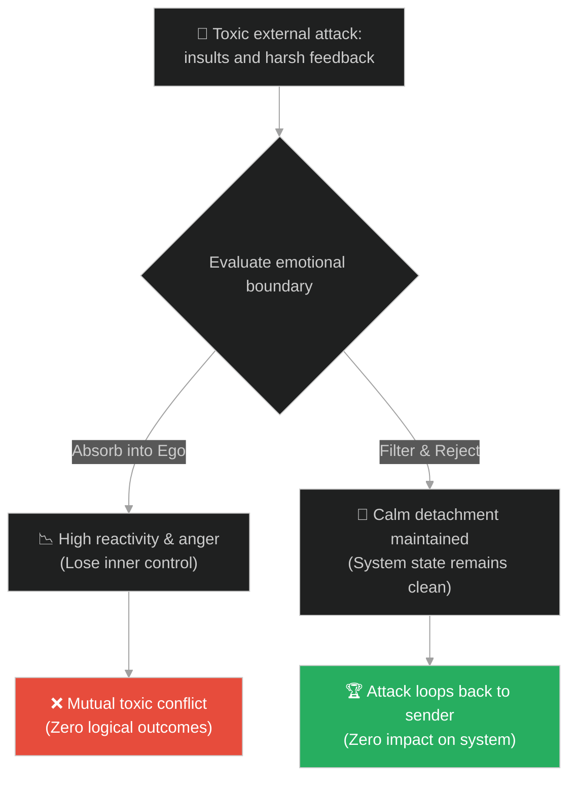
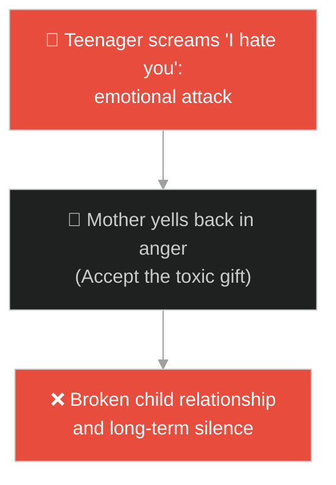
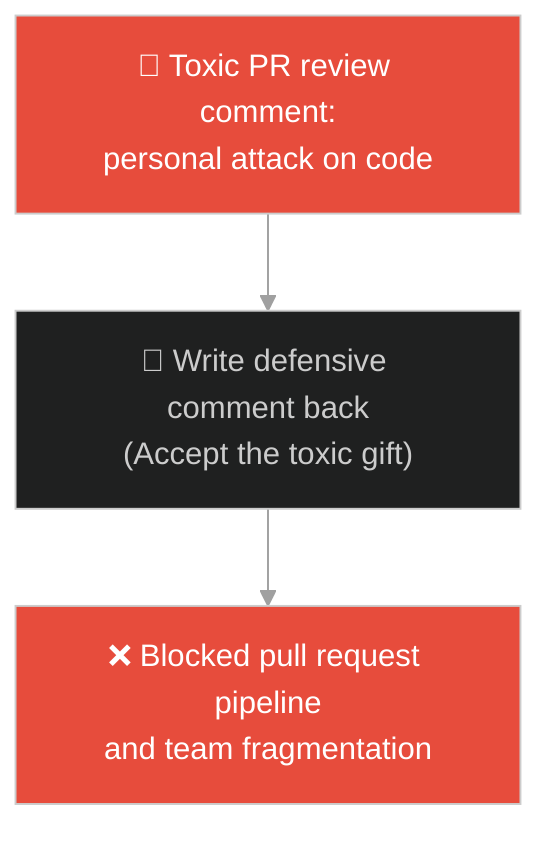
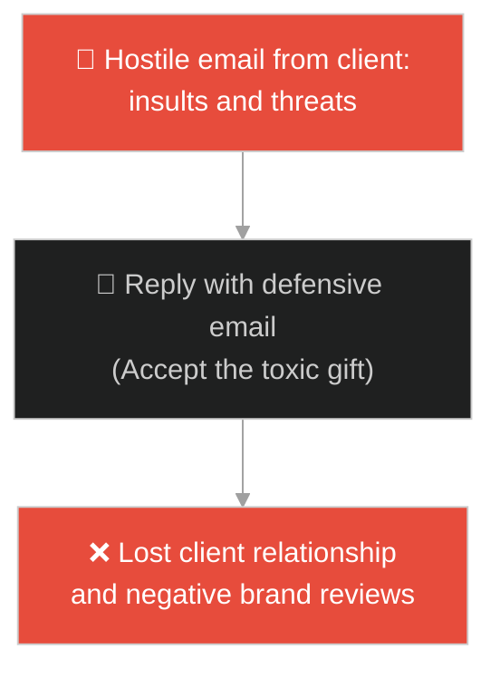
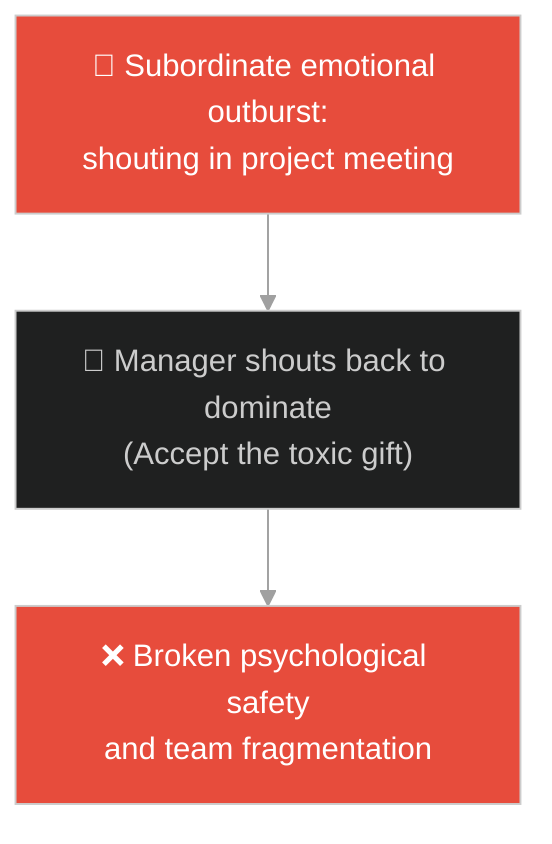
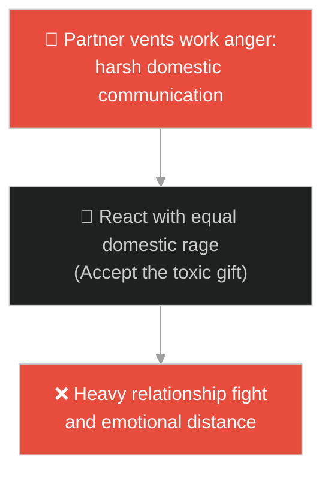
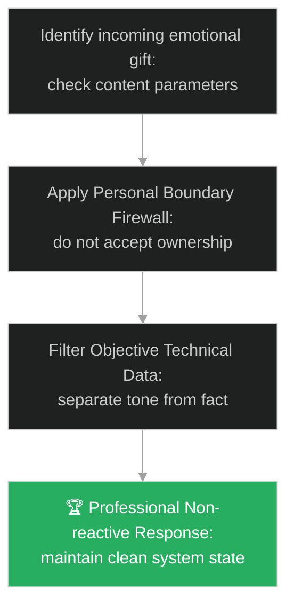

# Emotional Detachment & Ego Defense (ភាពមិនប្រតិកម្ម និងការការពារអត្មា)៖ កាដូនៃពាក្យប្រមាថ (Emotional Detachment & The Gift of Insults)

**Author:** ichamrong  
**Date:** 2026-05-28  
**Tags:** #buddhism #stoicism #emotional-boundaries #mental-models #life-lessons #parable  
**Category:** Concepts / Parables  
**Read Time:** ~15 min  

---

## 📌 មាតិកា (Table of Contents)
- [អន្ទាក់ផ្លូវចិត្ត (The Trap)](#0)
- [១. រឿងព្រេងព្រះពុទ្ធសាសនា៖ បុរសអ្នកខឹងសម្បារ (The Legend of the Angry Man and the Rejected Gift)](#1)
  - [សំនួរអំពីកាដូ និងយន្តការមិនទទួលយក (The Question of Ownership and Non-Reactivity)](#1-1)
- [២. បញ្ហា៖ វិបត្តិឆ្លើយតបដោយអារម្មណ៍ និងការស្រូបយកជាតិពុលខាងក្រៅ (The Issue: Emotional Reactivity and Toxic Feedback Absorption)](#2)
- [៣. ឧទាហមណ៍ជាក់ស្តែងក្នុងពិភពពិត (Real World Examples)](#3)
  - [ឧទាហរណ៍ទី ១ — កម្រិតស្រាល (គ្រួសារ)៖ ការទប់ទល់នឹងកំហឹងកូនជំទង់ (Handling Teenage Tantrums)](#3-1)
  - [ឧទាហរណ៍ទី ២ — កម្រិតមធ្យម (បច្ចេកទេស)៖ មតិរិះគន់កូដដ៏អាក្រក់ក្នុង Pull Request (Toxic Code Review Comments)](#3-2)
  - [ឧទាហរណ៍ទី ៣ — កម្រិតមធ្យម (ធុរកិច្ច)៖ ការឆ្លើយតបនឹងការវាយប្រហាររបស់អតិថិជន (Hostile Customer Feedback)](#3-3)
  - [ឧទាហរណ៍ទី ៤ — កម្រិតមធ្យម (សង្គម/គ្រប់គ្រង)៖ ការគ្រប់គ្រងកំហឹងរបស់សហការីក្នុងការប្រជុំ (Handling Team Outbursts)](#3-4)
  - [ឧទាហរណ៍ទី ៥ — កម្រិតធ្ងន់ (ទំនាក់ទំនង)៖ ការស្រូបយកស្រ្តេសការងាររបស់ដៃគូ (Partner Stress Venting)](#3-5)
- [៤. ដំណោះស្រាយទូទៅ៖ ការកសាងព្រំដែនអារម្មណ៍ និងការគ្រប់គ្រងអត្មា (The General Solution: Establishing Emotional Firewalls and Filtering Inputs)](#4)
- [សេចក្តីសន្និដ្ឋាន (Conclusion)](#5)
- [ឯកសារយោង (References)](#6)
- [Related Posts](#7)

---

<a id="0"></a>
## អន្ទាក់ផ្លូវចិត្ត (The Trap)

តើអ្នកធ្លាប់ជួបបញ្ហាដែលនរណាម្នាក់និយាយពាក្យសម្តីអាក្រក់ ឬរិះគន់វាយប្រហាររូបអ្នក រួចអ្នកក៏ខឹងសម្បារយ៉ាងខ្លាំង ហើយចំណាយពេលពេញមួយថ្ងៃគិត និងចង់សងសឹកវិញ ដែលធ្វើឱ្យបាត់បង់ភាពស្ងប់សុខផ្លូវចិត្តរបស់ខ្លួនឯងដែរឬទេ?

នៅក្នុងអន្តរកម្មសង្គម៖
* **យើងងាយនឹងធ្លាក់ក្នុងអន្ទាក់** នៃការស្រូបយកអារម្មណ៍អវិជ្ជមានរបស់អ្នកដទៃ (Reacting to Insults) ដោយគិតថាយើងត្រូវតែការពារអត្មា (Ego) របស់យើងភ្លាមៗ តាមរយៈការតបតវិញដោយកំហឹង។
* **យើងមើលរំលង** ព្រំដែនអារម្មណ៍របស់ខ្លួនឯង (Emotional Boundaries) និងការពិតដែលថាពាក្យសម្តីអាក្រក់របស់អ្នកដទៃគឺជា "កាដូ" ដែលយើងមានសិទ្ធិពេញលេញក្នុងការបដិសេធមិនទទួលយក។

ការអនុញ្ញាតឱ្យអារម្មណ៍និងពាក្យសម្តីអាក្រក់របស់អ្នកដទៃមកត្រួតត្រាលើចិត្តរបស់យើង ហៅថា **អន្ទាក់ស្រូបយកជាតិពុលអារម្មណ៍ (Toxic Input Absorption Trap)**។

ដើម្បីយល់ដឹងពីរបៀបការពារចិត្តឱ្យមានភាពស្ងប់និងមិនប្រតិកម្ម នេះជាផែនទីបង្ហាញផ្លូវ៖
1. **រឿងព្រេងនិទាន (The Legend)** — រឿងរ៉ាវរបស់បុរសដែលខឹងសម្បារជេរប្រមាថព្រះពុទ្ធ តែព្រះអង្គបដិសេធមិនទទួលយកកាដូនោះឡើយ។
2. **បញ្ហា (The Issue)** — ការវិភាគការខ្វះព្រំដែនអារម្មណ៍ (Emotional Boundaries) និងផលប៉ះពាល់លើទំនាក់ទំនងការងារ។
3. **ឧទាហមណ៍ជាក់ស្តែងក្នុងពិភពពិត (Real World Examples)** — ពិនិត្យមើលបញ្ហានេះក្នុងកម្រិតគ្រួសារ បច្ចេកវិទ្យា ធុរកិច្ច ការគ្រប់គ្រង និងទំនាក់ទំនង។
4. **ដំណោះស្រាយទូទៅ (The General Solution)** — ការបង្កើតប្រព័ន្ធការពារអារម្មណ៍ (Emotional Firewall) និងរបៀបចម្រោះមតិយោបល់ (Input Filtering)។



---

<a id="1"></a>
## ១. រឿងព្រេងព្រះពុទ្ធសាសនា៖ បុរសអ្នកខឹងសម្បារ (The Legend of the Angry Man and the Rejected Gift)

កាលសម័យពុទ្ធកាល ព្រះសម្មាសម្ពុទ្ធទ្រង់ទទួលបានសេចក្តីគោរព និងការកោតសរសើរយ៉ាងខ្លាំងពីសំណាក់ប្រជាជនគ្រប់ទិសទី ដោយសារតែព្រះធម៌ និងភាពស្ងប់ស្ងាត់របស់ព្រះអង្គ។

ទោះជាយ៉ាងណា៖
* មានព្រាហ្មណ៍ម្នាក់ឈ្មោះ **អក្ខោសភារទ្វាជៈ** កើតចិត្តច្រណែននឹងកេរ្តិ៍ឈ្មោះរបស់ព្រះពុទ្ធយ៉ាងខ្លាំង។
* ថ្ងៃមួយ គាត់បានដើរតម្រង់ទៅរកព្រះពុទ្ធដែលកំពុងគង់សម្តែងធម៌ រួចក៏ចាប់ផ្តើមស្រែកជេរប្រមាថ មើលងាយ និងនិយាយពាក្យសម្តើញុះញង់អាក្រក់ៗដាក់ព្រះអង្គនៅចំពោះមុខពួកបរិស័ទជាច្រើន។
* ព្រះពុទ្ធមិនបានបង្ហាញអាការៈខឹងក្រោធ ឬតបតវិញឡើយ។ ព្រះអង្គទ្រង់គង់យ៉ាងស្ងប់ស្ងៀម ស្តាប់ព្រាហ្មណ៍នោះរហូតដល់គាត់អស់កម្លាំង និងស្ងប់ស្ងាត់ទៅវិញដោយខ្លួនឯង។

---

<a id="1-1"></a>
### សំនួរអំពីកាដូ និងយន្តការមិនទទួលយក (The Question of Ownership and Non-Reactivity)

នៅពេលដែលព្រាហ្មណ៍នោះឈប់ស្រែក ព្រះពុទ្ធទ្រង់បានសួរគាត់ដោយព្រះសម្លេងស្រទន់ និងមានស្នាមញញឹមថា៖
* *"ម្នាលព្រាហ្មណ៍ ប្រសិនបើអ្នកទិញចំណីអាហារ ឬកាដូណាមួយ យកទៅជូនសាច់ញាតិ ឬមិត្តភក្តិរបស់អ្នក ប៉ុន្តែពួកគេមិនព្រមទទួលយកកាដូនោះទេ តើកាដូនោះនឹងបានទៅជារបស់នរណា?"*
* ព្រាហ្មណ៍ឆ្លើយទាំងក្រអឺតក្រទមថា៖ *"វានឹងនៅតែជារបស់ខ្ញុំដដែលហើយ ព្រោះខ្ញុំជាអ្នកទិញវា បើគេមិនយក តើវាទៅជាដីបានដោយរបៀបណា?"*
* ព្រះពុទ្ធទ្រង់ក៏មានបន្ទូលតបវិញថា៖
> «ត្រូវហើយ ព្រាហ្មណ៍។ អម្បាញ់មិញនេះ អ្នកបាននាំយកពាក្យជេរប្រមាថ និងកំហឹងក្តៅក្រហាយមកផ្តល់ឱ្យតថាគត។ ប៉ុន្តែតថាគតមិនទទួលយកពាក្យជេរប្រមាថទាំងនោះឡើយ។ ដូច្នេះ ពាក្យជេរប្រមាថ និងសេចក្តីក្តៅក្រហាយទាំងអស់នោះ នៅតែជារបស់អ្នកដដែល។»

ព្រាហ្មណ៍មានការភ្ញាក់ផ្អើល និងខ្មាស់អៀនយ៉ាងខ្លាំងចំពោះប្រាជ្ញារបស់ព្រះពុទ្ធ រួចក៏ក្រាបថ្វាយបង្គំសុំទោសចំពោះសកម្មភាពរបស់ខ្លួន។

---

<a id="2"></a>
## ២. បញ្ហា៖ វិបត្តិឆ្លើយតបដោយអារម្មណ៍ និងការស្រូបយកជាតិពុលខាងក្រៅ (The Issue: Emotional Reactivity and Toxic Feedback Absorption)

នៅក្នុងវិស្វកម្មផ្នែកទន់ និងការគ្រប់គ្រងការងារ ការខ្វះព្រំដែនអារម្មណ៍ (Emotional Boundaries) នាំឱ្យយើងយករាល់ការរិះគន់លើកូដ ឬប្រព័ន្ធ មកធ្វើជាការវាយប្រហារលើបុគ្គលិកលក្ខណៈផ្ទាល់ខ្លួន៖

```java
// ការស្រូបយកមតិយោបល់អាក្រក់ នាំឱ្យប្រព័ន្ធ Logic ផ្ទុះកំហឹង និងឈប់ដំណើរការ
public class CodeReviewFilter {
    public void processComment(String commentText) {
        if (commentText.contains("bad design")) {
            // អន្ទាក់ស្រូបយក៖ យល់ថាជាការវាយប្រហារខ្លួនឯង (Personal Attack)
            // បង្កើតអារម្មណ៍ខឹងសម្បារ និងមិនព្រមកែសម្រួលកូដតាមសំណូមពរ
            triggerDefensiveArgument();
            // លទ្ធផល៖ Pipeline ជាប់គាំង និងការទំនាក់ទំនងក្នុងក្រុមខូចខាត
        }
    }
    
    private void triggerDefensiveArgument() {
        System.out.println("Argument: Your own design is worse!");
    }
}
```

* **ការខូចខាតវប្បធម៌សហការ (Team Toxicity)៖** នៅពេលសមាជិកម្នាក់មិនអាចទទួលយកមតិកែលម្អបច្ចេកទេស និងតបតដោយអារម្មណ៍ការពារខ្លួន វានឹងបង្កើតជាជម្លោះគ្មានទីបញ្ចប់។
* **ការអនុញ្ញាតឱ្យអារម្មណ៍របស់អ្នកដទៃកំណត់តម្លៃខ្លួនឯង (External Locus of Control)៖** ការចំណាយពេល និងថាមពលខួរក្បាលដើម្បីគិតពីពាក្យសម្តីអាក្រក់របស់អ្នកដទៃ ធ្វើឱ្យបាត់បង់ផលិតភាពការងារទាំងស្រុង។

---

<a id="3"></a>
## ៣. ឧទាហមណ៍ជាក់ស្តែងក្នុងពិភពពិត

---

<a id="3-1"></a>
### ឧទាហរណ៍ទី ១ — កម្រិតស្រាល (គ្រួសារ)៖ ការទប់ទល់នឹងកំហឹងកូនជំទង់ (Handling Teenage Tantrums)

កូនជំទង់ម្នាក់ខឹងនឹងការហាមឃាត់របស់ម្តាយ រួចក៏ស្រែកថា៖ *"ម៉ែឯងមិនដែលយល់ពីខ្ញុំទេ ខ្ញុំស្អប់ម៉ែណាស់!"* (ព្រួញជាតិពុល)។ ជំនួសឱ្យការខឹង និងវាយកូនត្រឡប់ទៅវិញ ម្តាយបានរក្សាភាពស្ងប់ស្ងាត់ ដឹងថានេះជាអារម្មណ៍ប្រែប្រួលរបស់វ័យជំទង់ រួចឱបកូន និងនិយាយគ្នាដោយសន្តិវិធីក្រោយពេលកូនស្ងប់ចិត្ត។



---

<a id="3-2"></a>
### ឧទាហរណ៍ទី ២ — កម្រិតមធ្យម (បច្ចេកទេស)៖ មតិរិះគន់កូដដ៏អាក្រក់ក្នុង Pull Request (Toxic Code Review Comments)

អ្នកសរសេរកូដម្នាក់ទទួលបានមតិយោបល់លើ Pull Request (PR) របស់ខ្លួនថា៖ *"កូដនេះសរសេរឡើងគ្មានសណ្តាប់ធ្នាប់ទាល់តែសោះ តើអ្នកណាជាអ្នកសរសេរវា?"* (មតិពុល)។ ជំនួសឱ្យការខឹង និងតបតដោយពាក្យសម្តីអាក្រក់វិញ គាត់បានច្រោះយកតែចំណុចបច្ចេកទេសពិតប្រាកដ រួចឆ្លើយតបយ៉ាងមានវិជ្ជាជីវៈ៖ *"សូមអរគុណសម្រាប់មតិយោបល់ ខ្ញុំបានកែសម្រួល algorithm តាមការណែនាំហើយ។"*



---

<a id="3-3"></a>
### ឧទាហរណ៍ទី ៣ — កម្រិតមធ្យម (ធុរកិច្ច)៖ ការឆ្លើយតបនឹងការវាយប្រហាររបស់អតិថិជន (Hostile Customer Feedback)

អតិថិជនម្នាក់ខឹងនឹងការយឺតយ៉ាវនៃសេវាកម្ម រួចក៏សរសេរអ៊ីមែលជេរប្រមាថ និងវាយប្រហារបុគ្គលិកផ្នែកគាំទ្រអតិថិជន។ ជំនួសឱ្យការឆ្លើយតបការពារខ្លួន ឬខឹងតបវិញ បុគ្គលិកនោះរក្សាភាពស្ងប់ស្ងាត់ មិនទទួលយកអារម្មណ៍អាក្រក់របស់អតិថិជន រួចឆ្លើយតបដោយអាជីពខ្ពស់៖ *"យើងខ្ញុំសូមអភ័យទោសចំពោះភាពយឺតយ៉ាវ នេះជាដំណោះស្រាយសម្រាប់លោក..."* ដែលធ្វើឱ្យអតិថិជនត្រឡប់មកត្រជាក់ចិត្តវិញ។



---

<a id="3-4"></a>
### ឧទាហរណ៍ទី ៤ — កម្រិតមធ្យម (សង្គម/គ្រប់គ្រង)៖ ការគ្រប់គ្រងកំហឹងរបស់សហការីក្នុងការប្រជុំ (Handling Team Outbursts)

ក្នុងអំឡុងពេលប្រជុំផែនការ សមាជិកម្នាក់បានបាត់បង់ការគ្រប់គ្រងអារម្មណ៍ និងស្រែកខ្លាំងៗថាការងាររបស់ប្រធានក្រុមគ្មានប្រសិទ្ធភាព។ ប្រធានក្រុមមិនស្រែកតប ឬខឹងឡើយ គាត់បានស្តាប់យ៉ាងស្ងប់ស្ងាត់ រួចឆ្លើយតប៖ *"ខ្ញុំយល់ពីការព្រួយបារម្ភរបស់អ្នក ចូរយើងពិនិត្យមើលទិន្នន័យជាក់ស្តែងទាំងអស់គ្នា។"* ភាពស្ងប់ស្ងាត់នេះបានធ្វើឱ្យសមាជិកដទៃទៀតមានអារម្មណ៍សុវត្ថិភាព និងបន្តការប្រជុំដោយរលូន។



---

<a id="3-5"></a>
### ឧទាហរណ៍ទី ៥ — កម្រិតធ្ងន់ (ទំនាក់ទំនង)៖ ការស្រូបយកស្រ្តេសការងាររបស់ដៃគូ (Partner Stress Venting)

ប្តីត្រឡប់មកពីធ្វើការងារវិញដោយក្តីតានតឹង និងនិយាយពាក្យសម្តីគំរោះគំរើយដាក់ប្រពន្ធ។ ជំនួសឱ្យការខឹង និងគិតថាប្តីលែងគោរពខ្លួន ប្រពន្ធដឹងថាប្តីគ្រាន់តែជួបបញ្ហាស្ត្រេសការងារខ្លាំង រួចមិនទទួលយកកំហឹងនោះមកដាក់ខ្លួនឡើយ នាងទុកពេលឱ្យគាត់ស្ងប់ចិត្ត រួចទើបពិភាក្សាគ្នាដោយស្ងប់ស្ងាត់ពេលក្រោយ។



---

<a id="4"></a>
## ៤. ដំណោះស្រាយទូទៅ៖ ការកសាងព្រំដែនអារម្មណ៍ និងការគ្រប់គ្រងអត្មា (The General Solution: Establishing Emotional Firewalls and Filtering Inputs)

เพื่อដោះស្រាយបញ្ហានៃការស្រូបយកកំហឹង និងការការពារអត្មាជ្រុល យើងត្រូវអនុវត្តប្រព័ន្ធការពារអារម្មណ៍ និងការចម្រោះព័ត៌មានអវិជ្ជមាន៖



* **ការបង្កើត Emotional Firewall (ប្រព័ន្ធការពារអារម្មណ៍)៖** យល់ដឹងថាពាក្យជេរប្រមាថ ឬកំហឹងរបស់អ្នកដទៃ ឆ្លុះបញ្ចាំងពីបញ្ហាផ្ទាល់ខ្លួនរបស់ពួកគេ មិនមែនតម្លៃពិតប្រាកដរបស់អ្នកឡើយ។ ឈប់ទទួលយកភាពជាម្ចាស់លើអារម្មណ៍អាក្រក់របស់គេ។
* **បច្ចេកទេសចម្រោះយកតែបច្ចេកទេស (Data-Tone Filtering Technique)៖** ក្នុងវិស័យការងារ ពេលទទួលបានមតិរិះគន់អាក្រក់ ត្រូវសួរសំណួរថា៖ *"តើមានទិន្នន័យបច្ចេកទេសពិតប្រាកដអ្វីខ្លះនៅក្នុងពាក្យសម្តីនេះ?"* រួចផ្តោតដោះស្រាយតែចំណុចនោះ និងមិនយកចិត្តទុកដាក់នឹងពាក្យសម្តីវាយប្រហារឡើយ។
* **ការអនុវត្តវិធីសាស្ត្រ "Gray Rock" ជាមួយមនុស្សពុល (Toxic Personalities)៖** ឆ្លើយតបទៅនឹងពាក្យសម្តើញុះញង់ ឬការជេរប្រមាថ ដោយពាក្យសម្តីធម្មតា គ្មានអារម្មណ៍ និងខ្លីបំផុត ដើម្បីកុំឱ្យពួកគេទទួលបាន "រង្វាន់អារម្មណ៍" (Emotional Feedback) ដែលពួកគេចង់បាន។

---

## 🐇 ធ្លាក់ចូលក្នុងរន្ធទន្សាយ (Enter the Rabbit Hole)

ដើម្បីស្វែងយល់កាន់តែស៊ីជម្រៅអំពីរបៀបគ្រប់គ្រងព័ត៌មាន និងការកំណត់វិសាលភាព MVP សូមចាប់ផ្តើមដំណើររុករករបស់អ្នកដោយចុចលើតំណភ្ជាប់ខាងក្រោម៖

* 🚀 **[ចាប់ផ្តើមដំណើររុករក (Start the Journey) ➔ ស្លឹកឈើមួយក្តាប់ដៃ (The Handful of Leaves)](./115-buddha-and-the-handful-of-leaves.md)**

---

<a id="5"></a>
## សេចក្តីសន្និដ្ឋាន (Conclusion)

> **«កំហឹង និងពាក្យជេរប្រមាថ គឺជាអំណោយដែលនៅតែជារបស់អ្នកជូន ដរាបណាយើងមិនព្រមទទួលយកវា។»**

សេរីភាពពិតប្រាកដរបស់មនុស្សគឺសមត្ថភាពក្នុងការជ្រើសរើសប្រតិកម្មរបស់ខ្លួនឯង។ នៅពេលយើងលះបង់អំនួតការពារអត្មា និងកសាងព្រំដែនអារម្មណ៍ដ៏រឹងមាំ គ្មាននរណាម្នាក់អាចបំផ្លាញភាពស្ងប់សុខពិតប្រាកដក្នុងចិត្តរបស់យើងបានឡើយ។

---

<a id="6"></a>
## ឯកសារយោង (References)

* **Akkosa Sutta (The Insult)** — Samyutta Nikaya 7.2, Buddhist Pali Canon.
* **Marcus Aurelius** — *Meditations*. Roman Emperor's writings on emotional control and ego boundaries.
* **Henry Cloud & John Townsend** — *Boundaries: When to Say Yes, How to Say No to Take Control of Your Life* (1992). Essential framework on emotional boundaries.

---

<a id="7"></a>
## Related Posts

* [The Lute Strings](./113-buddha-and-the-lute-strings.md) — Finding the Middle Path of stress and productivity.
* [The Court Jester Who Fed on Tears](./26-the-jester-who-fed-on-tears.md) — Handling everyday sadism and trolls using the Gray Rock method.
