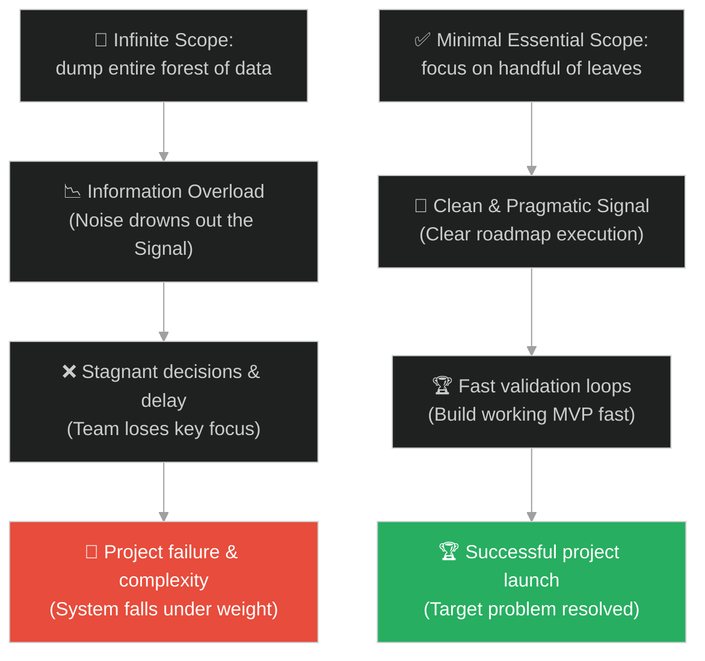
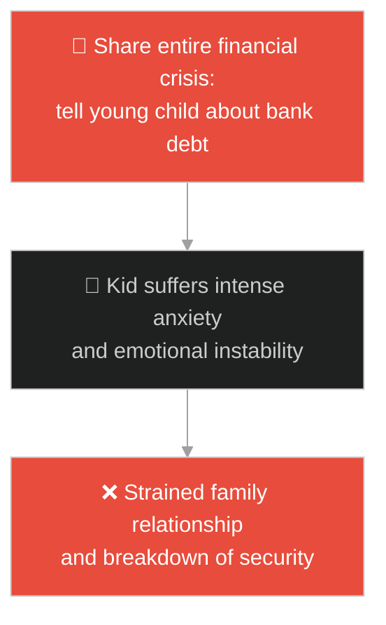
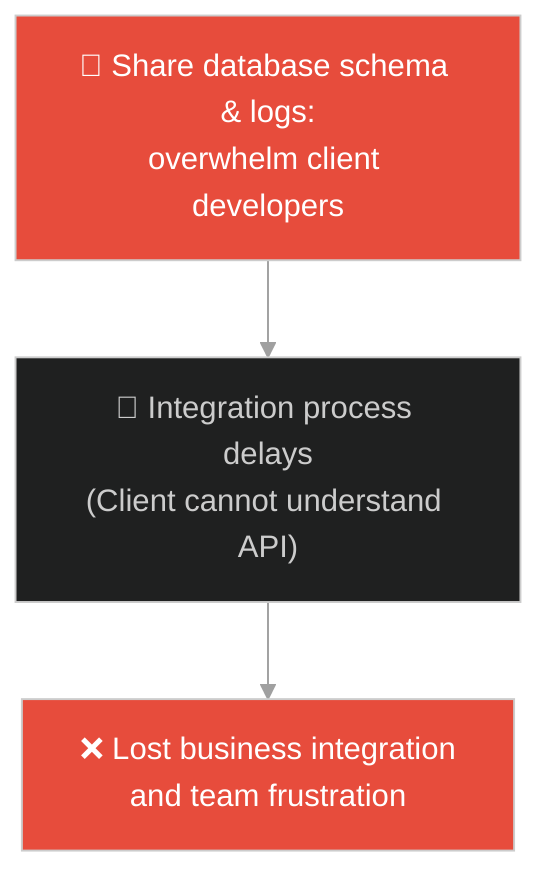
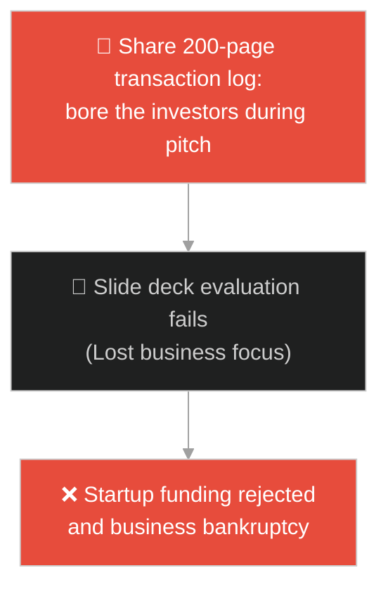
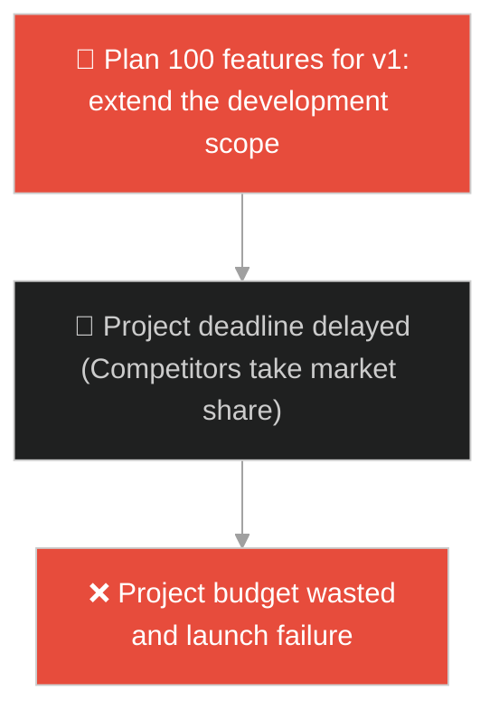
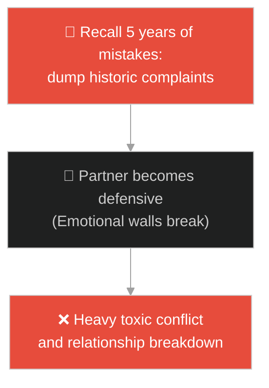
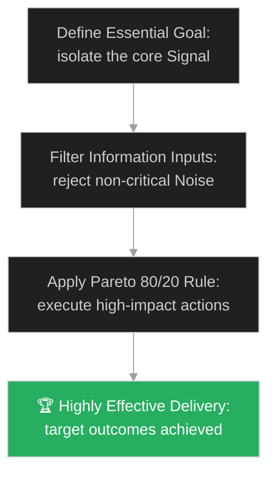

# Scope Management & Information Noise (ការគ្រប់គ្រងវិសាលភាព និងសំឡេងរំខានព័ត៌មាន)៖ ស្លឹកឈើមួយក្តាប់ដៃរបស់ព្រះពុទ្ធ (Scope Management & The Handful of Leaves)

**Author:** ichamrong  
**Date:** 2026-05-28  
**Tags:** #buddhism #essentialism #signal-vs-noise #mental-models #focus #parable  
**Category:** Concepts / Parables  
**Read Time:** ~15 min  

---

## 📌 មាតិកា (Table of Contents)
- [អន្ទាក់ផ្លូវចិត្ត (The Trap)](#0)
- [១. រឿងព្រេងព្រះពុទ្ធសាសនា៖ ស្លឹកឈើមួយក្តាប់ដៃ (The Legend of the Handful of Leaves)](#1)
  - [សំនួរអំពីស្លឹកឈើ និងយន្តការនៃសេចក្តីពិតចាំបាច់ (The Forest of Knowledge vs The Handful of Utility)](#1-1)
- [២. បញ្ហា៖ វិបត្តិព័ត៌មានហៀរហូរ និងការខូចខាតការផ្តោតអារម្មណ៍ (The Issue: Information Overload and Scope Creep)](#2)
- [៣. ឧទាហមណ៍ជាក់ស្តែងក្នុងពិភពពិត (Real World Examples)](#3)
  - [ឧទាហរណ៍ទី ១ — កម្រិតស្រាល (គ្រួសារ)៖ ការពន្យល់បញ្ហាហិរញ្ញវត្ថុដល់កូនតូច (Age-appropriate Family Communication)](#3-1)
  - [ឧទាហរណ៍ទី ២ — កម្រិតមធ្យម (បច្ចេកទេស)៖ ការចងក្រងឯកសារជំនួយសម្រាប់ការប្រើប្រាស់ API (Clean API Documentation vs Schema Dumping)](#3-2)
  - [ឧទាហរណ៍ទី ៣ — កម្រិតមធ្យម (ធុរកិច្ច)៖ ការរៀបចំឯកសារបង្ហាញវិនិយោគិន (Investor Pitch Decks vs Raw Ledger Sharing)](#3-3)
  - [ឧទាហរណ៍ទី ៤ — កម្រិតមធ្យម (សង្គម/គ្រប់គ្រង)៖ ការកំណត់វិសាលភាពនៃផលិតផល MVP (Defining Minimal Viable Product Scope)](#3-4)
  - [ឧទាហរណ៍ទី ៥ — កម្រិតធ្ងន់ (ទំនាក់ទំនង)៖ ការបញ្ចេញអារម្មណ៍ចំគោលដៅ (Direct Emotional Voicing vs History Dumping)](#3-5)
- [៤. ដំណោះស្រាយទូទៅ៖ ការចម្រោះព័ត៌មានសំឡេងរំខាន និងការអនុវត្តច្បាប់ Pareto (The General Solution: Filtering Information Noise and Enforcing Minimal Essential Scopes)](#4)
- [សេចក្តីសន្និដ្ឋាន (Conclusion)](#5)
- [ឯកសារយោង (References)](#6)
- [Related Posts](#7)

---

<a id="0"></a>
## អន្ទាក់ផ្លូវចិត្ត (The Trap)

តើអ្នកធ្លាប់ជួបបញ្ហាដែលត្រូវដោះស្រាយ ឬពន្យល់កិច្ចការងារអ្វីមួយ រួចអ្នកបែរជាប្រមូលព័ត៌មាន និងព័ត៌មានលម្អិតទាំងអស់ដែលទាក់ទងមកបង្ហាញ ធ្វើឱ្យអ្នកស្តាប់មានអារម្មណ៍ភាន់ច្រឡំ និងបាត់បង់ការផ្តោតលើគោលដៅពិតប្រាកដដែរឬទេ?

នៅក្នុងការគ្រប់គ្រងព័ត៌មាន៖
* **យើងងាយនឹងធ្លាក់ក្នុងអន្ទាក់** នៃការគិតថា "ការផ្តល់ទិន្នន័យកាន់តែច្រើន នាំឱ្យមានភាពច្បាស់លាស់កាន់តែខ្លាំង" (Information Dumping) ដែលនាំឱ្យមានសំឡេងរំខានព័ត៌មាន (Noise) កប់បាត់នូវព័ត៌មានសំខាន់ពិតប្រាកដ (Signal)។
* **យើងមើលរំលង** ការកំណត់វិសាលភាពចាំបាច់បំផុត (Scope Management) និងការលះបង់ព័ត៌មានមិនទាក់ទងនឹងការដោះស្រាយបញ្ហាដើម្បីកាត់បន្ថយភាពស្មុគស្មាញ។

ការបណ្តោយឱ្យព័ត៌មាន និងមុខងារមិនចាំបាច់ជាច្រើនមករំខានដល់ការសម្រេចគោលដៅ ហៅថា **អន្ទាក់សំឡេងរំខានព័ត៌មានហៀរហូរ (Information Overload & Scope Creep Trap)**។

ដើម្បីយល់ដឹងពីរបៀបគ្រប់គ្រងវិសាលភាពការងារឱ្យសាមញ្ញ និងមានប្រសិទ្ធភាព នេះជាផែនទីបង្ហាញផ្លូវ៖
1. **រឿងព្រេងនិទាន (The Legend)** — រឿងរ៉ាវរបស់ព្រះពុទ្ធដែលប្រៀបធៀបធម៌ដែលទ្រង់ដឹង (ស្លឹកឈើពេញព្រៃ) និងធម៌ដែលទ្រង់បង្រៀន (ស្លឹកឈើមួយក្តាប់ដៃ)។
2. **បញ្ហា (The Issue)** — ការវិភាគការបាត់បង់ការផ្តោតអារម្មណ៍ (Signal vs Noise) និងផលប៉ះពាល់លើការរចនាប្រព័ន្ធ (System Over-engineering)។
3. **ឧទាហមណ៍ជាក់ស្តែងក្នុងពិភពពិត (Real World Examples)** — ពិនិត្យមើលបញ្ហានេះក្នុងកម្រិតគ្រួសារ បច្ចេកវិទ្យា ធុរកិច្ច ការគ្រប់គ្រង និងទំនាក់ទំនង។
4. **ដំណោះស្រាយទូទៅ (The General Solution)** — ការអនុវត្តគោលការណ៍ Pareto (80/20 Rule) និងការកំណត់កម្រិត Signal-to-Noise Ratio (SNR)។



---

<a id="1"></a>
## ១. រឿងព្រេងព្រះពុទ្ធសាសនា៖ ស្លឹកឈើមួយក្តាប់ដៃ (The Legend of the Handful of Leaves)

សម័យមួយ ព្រះសម្មាសម្ពុទ្ធទ្រង់គង់ប្រថាប់នៅក្នុងព្រៃឈើឈ្មោះ **ស៊ិនសាប៉ា (Sinsapa Forest)** ក្បែរទីក្រុងកោសម្ពី ជាមួយភិក្ខុសង្ឃមួយក្រុមធំ។

នៅក្នុងដំណើរនោះ៖
* ព្រះអង្គទ្រង់បានឱនព្រះកាយចុះ រួចប្រើប្រាស់ព្រះហស្ថត្រួសប្រមូលយកស្លឹកឈើស៊ិនសាប៉ាមួយក្តាប់ដៃតូចបង្ហាញទៅកាន់ភិក្ខុសង្ឃទាំងឡាយ។
* ព្រះពុទ្ធទ្រង់មានបន្ទូលសួរថា៖ *"ម្នាលភិក្ខុទាំងឡាយ តើអ្នកយល់ឃើញយ៉ាងណា? តើស្លឹកឈើដែលនៅក្នុងដៃតថាគត និងស្លឹកឈើទាំងអស់ដែលនៅលើដើម និងលើដីទូទាំងព្រៃដ៏ធំនេះ មួយណាមានចំនួនច្រើនជាង?"*
* ភិក្ខុសង្ឃទាំងឡាយក្រាបទូលឆ្លើយតបវិញភ្លាមៗថា៖ *"បពិត្រព្រះអង្គដ៏ចម្រើន ស្លឹកឈើដែលនៅក្នុងព្រះហស្ថរបស់ព្រះអង្គមានចំនួនតិចតួចណាស់ ចំណែកឯស្លឹកឈើនៅក្នុងព្រៃធំទាំងមូលមានចំនួនច្រើនឥតគណនា មិនអាចយកមកប្រៀបធៀបគ្នាបានឡើយ។"*

---

<a id="1-1"></a>
### សំនួរអំពីស្លឹកឈើ និងយន្តការនៃសេចក្តីពិតចាំបាច់ (The Forest of Knowledge vs The Handful of Utility)

ព្រះពុទ្ធទ្រង់ក៏មានបន្ទូលពន្យល់អំពីអត្ថន័យជ្រាលជ្រៅនៃសកម្មភាពនោះថា៖
> «យ៉ាងណាមិញ ភិក្ខុទាំងឡាយ សេចក្តីពិត និងធម៌ដែលតថាគតបានត្រាស់ដឹង មានបរិមាណច្រើនរាប់មិនអស់ដូចស្លឹកឈើនៅក្នុងព្រៃធំអញ្ចឹង។ ប៉ុន្តែ អ្វីដែលតថាគតយកមកសម្តែង និងបង្រៀនអ្នកទាំងអស់គ្នា គឺមានបរិមាណតិចតួចដូចស្លឹកឈើនៅក្នុងក្តាប់ដៃនេះប៉ុណ្ណោះ។»

ព្រះអង្គបានពន្យល់ពីមូលហេតុថា៖
* *"ហេតុអ្វីបានជាតថាគតមិននាំយកសេចក្តីពិតដែលនៅសេសសល់ទាំងអស់នោះមកបង្រៀន?"*
* *"ព្រោះថាចំណេះដឹងទាំងនោះគ្មានប្រយោជន៍ មិននាំទៅរកការនឿយណាយ មិននាំទៅរកការរំលត់ទុក្ខ និងមិននាំទៅរកការសម្រេចធម៌ឡើយ។"*
* អ្វីដែលព្រះអង្គបង្រៀន (ស្លឹកឈើមួយក្តាប់ដៃ) គឺផ្តោតតែលើ **អរិយសច្ចៈទាំង ៤** (ទុក្ខ ហេតុនៃទុក្ខ ការរំលត់ទុក្ខ និងផ្លូវរំលត់ទុក្ខ) ដែលជាវិសាលភាពចាំបាច់បំផុតសម្រាប់ដោះស្រាយវិបត្តិសេចក្តីទុក្ខរបស់សត្វលោក។

---

<a id="2"></a>
## ២. បញ្ហា៖ វិបត្តិព័ត៌មានហៀរហូរ និងការខូចខាតការផ្តោតអារម្មណ៍ (The Issue: Information Overload and Scope Creep)

នៅក្នុងវិស្វកម្មប្រព័ន្ធ និងការអភិវឌ្ឍផលិតផល កង្វះការគ្រប់គ្រងវិសាលភាព (Scope Management) នាំឱ្យកើតមានការកើនឡើងនូវភាពស្មុគស្មាញ និងការពន្យារពេលបញ្ចេញគម្រោង (Timeline Slips)៖

```java
// ការព្យាយាមបន្ថែមមុខងារមិនចាំបាច់ជាច្រើន (Scope Creep) ធ្វើឱ្យប្រព័ន្ធទាំងមូលគាំង
public class ProjectScope {
    private List<String> essentialFeatures = new ArrayList<>();
    private List<String> nonEssentialFeatures = new ArrayList<>();

    public void buildMVP() {
        // ស្លឹកឈើមួយក្តាប់ដៃ៖ ផ្តោតតែលើមុខងារស្នូលដើម្បីដំណើរការ
        essentialFeatures.add("User Login");
        essentialFeatures.add("Payment Process");
        
        // អន្ទាក់ស្លឹកឈើពេញព្រៃ៖ បន្ថែមមុខងារមិនទាន់ចាំបាច់ជាច្រើន (Scope Creep)
        nonEssentialFeatures.add("AI Chatbot Recommendation");
        nonEssentialFeatures.add("Customizable Theme Builder");
        // លទ្ធផល៖ Timeline យឺតយ៉ាវ និងមិនអាចបញ្ចេញផលិតផលទាន់ពេល
    }
}
```

* **ការបាត់បង់ការផ្តោតលើមុខងារស្នូល (Core Value Stagnation)៖** ការចំណាយធនធានក្រុមការងារដើម្បីបង្កើតមុខងារបន្ទាប់បន្សំ ដែលអតិថិជនមិនធ្លាប់ប្រើប្រាស់ ជំនួសឱ្យការកែលម្អមុខងារស្នូលឱ្យមានស្ថិរភាព។
* **ការខូចខាតសមត្ថភាពអានឯកសារ (Documentation Noise)៖** ការសរសេរឯកសារណែនាំវែងពេក ពោរពេញដោយកូដលម្អិតមិនសំខាន់ ធ្វើឱ្យអ្នកអភិវឌ្ឍថ្មីៗមិនអាចស្វែងយល់ពីរបៀបប្រើប្រាស់ប្រព័ន្ធបានលឿន។

---

<a id="3"></a>
## ៣. ឧទាហមណ៍ជាក់ស្តែងក្នុងពិភពពិត

---

<a id="3-1"></a>
### ឧទាហរណ៍ទី ១ — កម្រិតស្រាល (គ្រួសារ)៖ ការពន្យល់បញ្ហាហិរញ្ញវត្ថុដល់កូនតូច (Age-appropriate Family Communication)

ឪពុកម្តាយជួបប្រទះបញ្ហាហិរញ្ញវត្ថុក្នុងគ្រួសារ។ ជំនួសឱ្យការប្រាប់កូនអាយុ ៦ ឆ្នាំនូវរាល់ព័ត៌មានលម្អិតអំពីបំណុលធនាគារ អត្រាការប្រាក់ និងការភ័យខ្លាចផ្ទាល់ខ្លួន (ស្លឹកឈើពេញព្រៃ) ដែលធ្វើឱ្យកូនតូចកើតស្ត្រេស និងភ័យខ្លាច ពួកគេគ្រាន់តែប្រាប់កូនសង្ខេបថា៖ *"ខែនេះយើងត្រូវសន្សំសំចៃមិនទាន់ទិញល្បែងថ្មីទេ"* (ស្លឹកឈើមួយក្តាប់ដៃ)។



---

<a id="3-2"></a>
### ឧទាហរណ៍ទី ២ — កម្រិតមធ្យម (បច្ចេកទេស)៖ ការចងក្រងឯកសារជំនួយសម្រាប់ការប្រើប្រាស់ API (Clean API Documentation vs Schema Dumping)

នៅពេលបង្កើត API សម្រាប់ដៃគូខាងក្រៅ ក្រុមការងារបានសរសេរឯកសារដោយពន្យល់ពីរបៀបដំណើរការ Database ខាងក្នុង តារាង SQL ទាំងអស់ និងកូដគណនាស្មុគស្មាញ (ស្លឹកឈើពេញព្រៃ)។ ដៃគូខាងក្រៅមានការភាន់ច្រឡំយ៉ាងខ្លាំង។ ដំណោះស្រាយគឺការលុបឯកសារទាំងនោះចោល រួចផ្តល់ជូនតែ URL មុខងារ និងប៉ារ៉ាម៉ែត្រស្នូល (ស្លឹកឈើមួយក្តាប់ដៃ) ដែលពួកគេត្រូវការដើម្បីបង្កើតការតភ្ជាប់បានលឿន។



---

<a id="3-3"></a>
### ឧទាហរណ៍ទី ៣ — កម្រិតមធ្យម (ធុរកិច្ច)៖ ការរៀបចំឯកសារបង្ហាញវិនិយោគិន (Investor Pitch Decks vs Raw Ledger Sharing)

ស្ថាបនិកម្នាក់ជួបវិនិយោគិនដើម្បីស្នើសុំទុន។ ជំនួសឱ្យការបង្ហាញស្លាយសង្ខេប ១០ ទំព័រអំពីបញ្ហា ដំណោះស្រាយ និងចំណូលស្នូល (ស្លឹកឈើមួយក្តាប់ដៃ) គាត់បាននាំយករបាយការណ៍គណនេយ្យ raw ledger ២០០ ទំព័រ និងរាល់កូដប្រព័ន្ធ (ស្លឹកឈើពេញព្រៃ) មកបង្ហាញ។ វិនិយោគិនមានអារម្មណ៍ធុញទ្រាន់ និងសម្រេចចិត្តមិនវិនិយោគដោយសារភាពស្មុគស្មាញ។



---

<a id="3-4"></a>
### ឧទាហរណ៍ទី ៤ — កម្រិតមធ្យម (សង្គម/គ្រប់គ្រង)៖ ការកំណត់វិសាលភាពនៃផលិតផល MVP (Defining Minimal Viable Product Scope)

ក្រុមការងារចង់បញ្ចេញកម្មវិធីដឹកជញ្ជូនថ្មីមួយ។ ជំនួសឱ្យការផ្តោតលើមុខងារស្នូលគឺ ហៅឡាន និងទូទាត់ប្រាក់ (ស្លឹកឈើមួយក្តាប់ដៃ) ដើម្បីទទួលបានមតិយោបល់ពិតប្រាកដពីទីផ្សារជាមុន ប្រធានគ្រប់គ្រងផលិតផលបានរុញច្រានគម្រោងឱ្យបន្ថែមមុខងារ AI, មុខងារសន្ទនាជាក្រុម និងគូប៉ុងស្មុគស្មាញ (ស្លឹកឈើពេញព្រៃ) ធ្វើឱ្យផលិតផលត្រូវពន្យារពេល Launch អស់រយៈពេល ២ ឆ្នាំ និងហួសសម័យ។



---

<a id="3-5"></a>
### ឧទាហរណ៍ទី ៥ — កម្រិតធ្ងន់ (ទំនាក់ទំនង)៖ ការបញ្ចេញអារម្មណ៍ចំគោលដៅ (Direct Emotional Voicing vs History Dumping)

គូស្នេហ៍មួយគូមានជម្លោះអំពីរឿងលាងចាន។ ជំនួសឱ្យការពិភាក្សាដោះស្រាយបញ្ហាចានកខ្វក់ចំពោះមុខ (ស្លឹកឈើមួយក្តាប់ដៃ) ភាគីម្ខាងចាប់ផ្តើមរំលឹករឿងរ៉ាវកំហុសចាស់ៗ តាំងពីជួបគ្នាដំបូង កំហុសគ្រួសារខាងប្តី និងរាល់ក្តីអាក់អន់ចិត្តកន្លងមក (ស្លឹកឈើពេញព្រៃ) ដែលធ្វើឱ្យជម្លោះតូចតាចក្លាយជាវិបត្តិបែកបាក់ទំនាក់ទំនងធំ។



---

<a id="4"></a>
## ៤. ដំណោះស្រាយទូទៅ៖ ការចម្រោះព័ត៌មានសំឡេងរំខាន និងការអនុវត្តច្បាប់ Pareto (The General Solution: Filtering Information Noise and Enforcing Minimal Essential Scopes)

เพื่อដោះស្រាយបញ្ហានៃសំឡេងរំខានព័ត៌មាន និងការហៀរហូរវិសាលភាព យើងត្រូវអនុវត្តប្រព័ន្ធគ្រប់គ្រងការផ្តោតអារម្មណ៍ និងការចម្រោះទិន្នន័យចាំបាច់៖



* **ការអនុវត្តគោលការណ៍ Pareto (80/20 Rule) ក្នុងការសម្រេចចិត្ត៖** ត្រូវកំណត់អត្តសញ្ញាណ ២០% នៃព័ត៌មាន ឬការងារ ដែលនឹងបង្កើតផលប៉ះពាល់ធំដំរហូតដល់ ៨០% នៃលទ្ធផលរួម រួចបោះបង់ចោលកិច្ចការដែលសេសសល់ដទៃទៀតបណ្តោះអាសន្ន។
* **យុទ្ធសាស្ត្ររចនាផលិតផល MVP ឱ្យតឹងរ៉ឹងបំផុត (Strict MVP Framework)៖** មុននឹងបន្ថែមមុខងារណាមួយចូលក្នុងប្រព័ន្ធការងារ ត្រូវចោទសួរសំណួរថា៖ *"តើបើគ្មានមុខងារនេះទេ តើកម្មវិធីអាចដោះស្រាយបញ្ហាស្នូលរបស់អតិថិជនបានដែរឬទេ?"* បើអាច ត្រូវកាត់វាចេញពីកាលវិភាគបញ្ចេញដំបូងបង្អស់។
* **ការអនុវត្តរបាំងការពារព័ត៌មានផ្ទាល់ខ្លួន (Information Diet)៖** កំណត់កាលវិភាគពិនិត្យមើលសារ និងព័ត៌មានផ្សេងៗ មិនឱ្យលើសពី ២ ដងក្នុងមួយថ្ងៃ ដើម្បីការពារខួរក្បាលពីការហៀរហូរព័ត៌មានដែលរារាំងដល់ការគិតច្នៃប្រឌិតវែងឆ្ងាយ។

---

## 🐇 ធ្លាក់ចូលក្នុងរន្ធទន្សាយ (Enter the Rabbit Hole)

ដើម្បីស្វែងយល់កាន់តែស៊ីជម្រៅអំពីរបៀបបោះបង់ចោលឧបករណ៍ ឬកូដចាស់ៗដែលលែងប្រើការ សូមចាប់ផ្តើមដំណើររុករករបស់អ្នកដោយចុចលើតំណភ្ជាប់ខាងក្រោម៖

* 🚀 **[ចាប់ផ្តើមដំណើររុករក (Start the Journey) ➔ ក្បូនឆ្លងទន្លេ (The Raft)](./116-buddha-and-the-raft.md)**

---

<a id="5"></a>
## សេចក្តីសន្និដ្ឋាន (Conclusion)

> **«ភាពជោគជ័យមិនមែនកើតឡើងពីការធ្វើកិច្ចការគ្រប់យ៉ាងនោះទេ គឺកើតចេញពីការជ្រើសរើសធ្វើតែកិច្ចការដែលសំខាន់បំផុត។»**

ធនធានពេលវេលា និងថាមពលរបស់មនុស្សមានកម្រិតកំណត់។ ការចេះជ្រើសរើសយកតែ "ស្លឹកឈើមួយក្តាប់ដៃ" ដែលមានប្រយោជន៍ពិតប្រាកដ និងបោះបង់ចោល "ស្លឹកឈើពេញព្រៃ" នៃក្តីរំខាន គឺជាគន្លឹះឆ្ពោះទៅរកការកសាងផលិតភាពការងារខ្ពស់ និងការរស់នៅប្រកបដោយក្តីស្ងប់សុខផ្លូវចិត្ត។

---

<a id="6"></a>
## ឯកសារយោង (References)

* **Simsapa Sutta (The Simsapa Leaves)** — Samyutta Nikaya 56.31, Buddhist Pali Canon.
* **Greg McKeown** — *Essentialism: The Disciplined Pursuit of Less* (2014). The core philosophy of focusing on the essential.
* **Herbert A. Simon** — *Designing Organizations for an Information-Rich World* (1971). Coining the concept of information overload and attention scarcity.

---

<a id="7"></a>
## Related Posts

* [Buddha and the Poisoned Arrow](./109-buddha-and-the-poisoned-arrow.md) — Overcoming over-analysis paralysis during urgent situations.
* [Steve Jobs and Feature Bloat](./51-the-four-quadrants.md) — Product management strategies focusing on saying 'No' to 100 good ideas.
