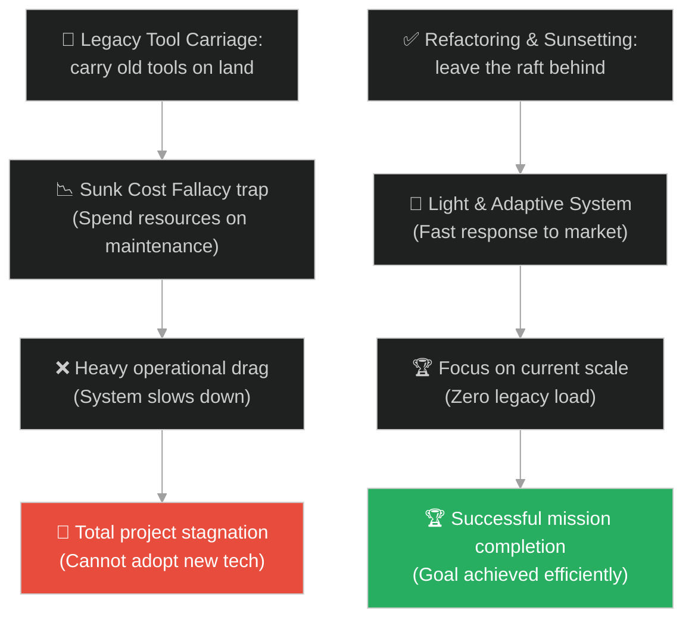
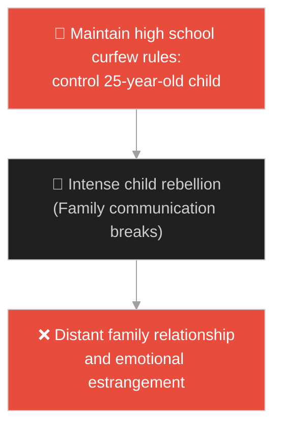
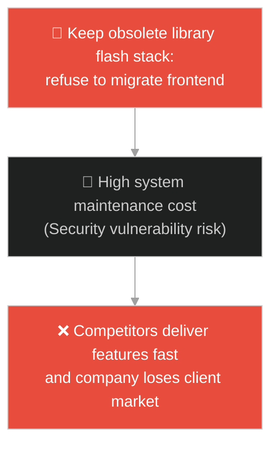
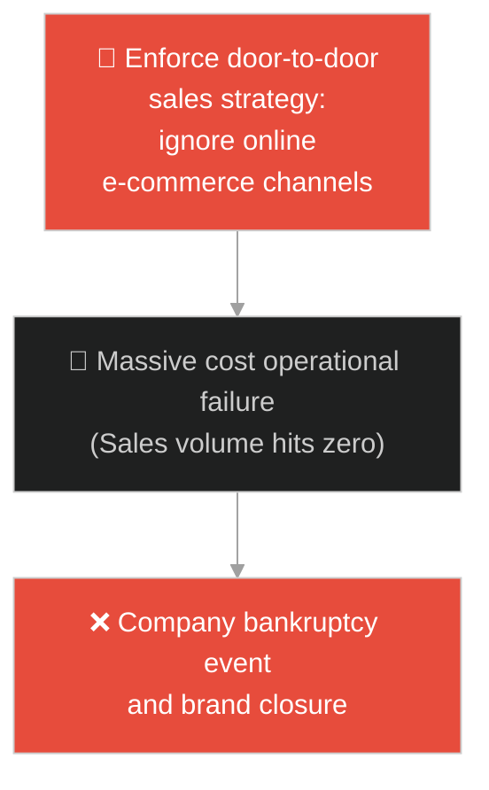
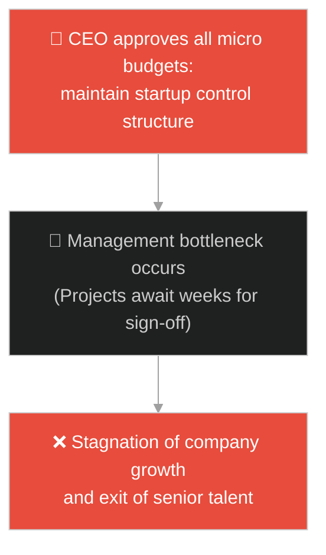
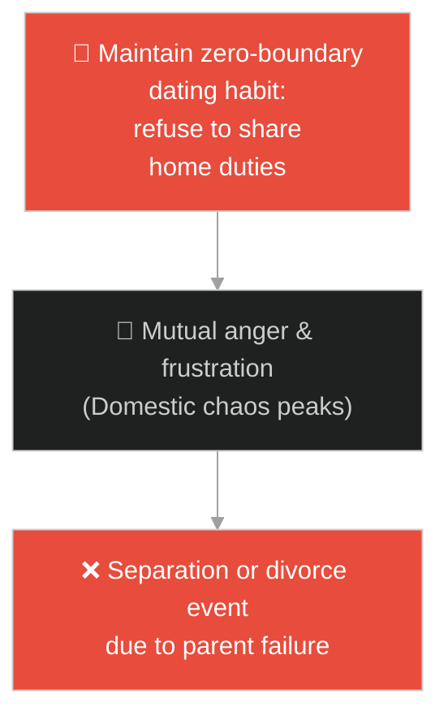
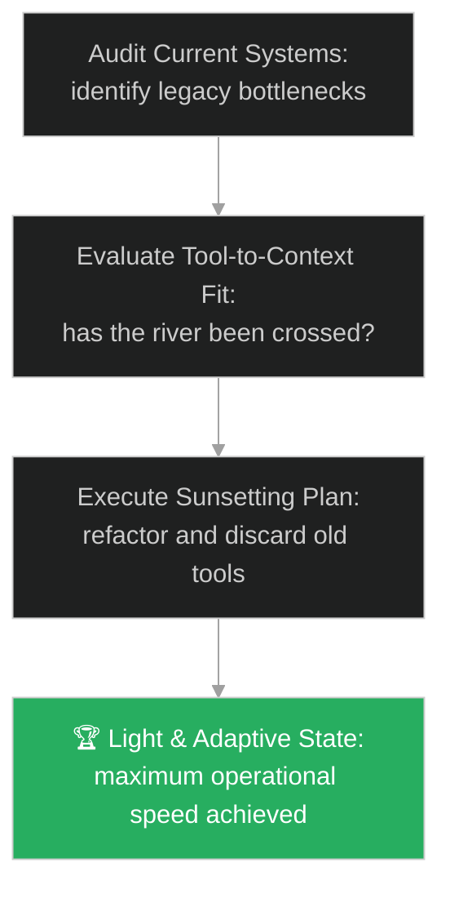

# Letting Go of Legacy & Dogmatism (ការលះបង់ចោលឧបករណ៍ចាស់ និងលទ្ធិងងឹតងងុល)៖ ក្បូនឆ្លងទន្លេ (Letting Go of Legacy & The Raft)

**Author:** ichamrong  
**Date:** 2026-05-28  
**Tags:** #buddhism #letting-go #sunk-cost-fallacy #dogmatism #mental-models #parable  
**Category:** Concepts / Parables  
**Read Time:** ~15 min  

---

## 📌 មាតិកា (Table of Contents)
- [អន្ទាក់ផ្លូវចិត្ត (The Trap)](#0)
- [១. រឿងព្រេងព្រះពុទ្ធសាសនា៖ ក្បូនឆ្លងទន្លេ (The Parable of the Raft)](#1)
  - [សេចក្តីស្រឡាញ់ចំពោះក្បូន និងយន្តការលីសែង (The Attachment to the Raft and Legacy Carriage)](#1-1)
- [２. បញ្ហា៖ វិបត្តិប្រកាន់ខ្ជាប់ឧបករណ៍ចាស់ និងអន្ទាក់ចំណាយដើមទុនបាត់បង់ (The Issue: Tool Fetishism and Sunk Cost Fallacy)](#2)
- [៣. ឧទាហមណ៍ជាក់ស្តែងក្នុងពិភពពិត (Real World Examples)](#3)
  - [ឧទាហរណ៍ទី ១ — កម្រិតស្រាល (គ្រួសារ)៖ ការរក្សាច្បាប់បម្រាមចំពោះកូនពេញវ័យ (Curfews and Rules for Adult Children)](#3-1)
  - [ឧទាហរណ៍ទី ២ — កម្រិតមធ្យម (បច្ចេកទេស)៖ ការរក្សាទុកបច្ចេកវិទ្យាហួសសម័យ (Holding Onto Obsolete Tech Stacks)](#3-2)
  - [ឧទាហរណ៍ទី ៣ — កម្រិតមធ្យម (ធុរកិច្ច)៖ ការប្រកាន់ខ្ជាប់វិធីសាស្ត្រលក់បែបបុរាណ (Door-to-door Sales in E-Commerce Era)](#3-3)
  - [ឧទាហរណ៍ទី ៤ — កម្រិតមធ្យម (សង្គម/គ្រប់គ្រង)៖ ដំណើរការការងារតឹងរ៉ឹងតាំងពីបង្កើតដំបូង (Rigid Startup Processes in Enterprise)](#3-4)
  - [ឧទាហរណ៍ទី ៥ — កម្រិតធ្ងន់ (ទំនាក់ទំនង)៖ ការប្រើប្រាស់វិធីសាស្ត្រទាក់ទងគ្នាដំបូងមកប្រើក្នុងអាពាហ៍ពិពាហ៍ (Outdated Dating Styles in Marriage)](#3-5)
- [៤. ដំណោះស្រាយទូទៅ៖ ការវាយតម្លៃឧបករណ៍ចរន្ត និងការអនុវត្តការលះបង់បច្ចេកវិទ្យាចាស់ (The General Solution: Adaptive Refactoring and Sunsetting Legacy Systems)](#4)
- [សេចក្តីសន្និដ្ឋាន (Conclusion)](#5)
- [ឯកសារយោង (References)](#6)
- [Related Posts](#7)

---

<a id="0"></a>
## អន្ទាក់ផ្លូវចិត្ត (The Trap)

តើអ្នកធ្លាប់ជួបបញ្ហាដែលប្រព័ន្ធការងារ ឬគម្រោងរបស់អ្នក បន្តប្រើប្រាស់ឧបករណ៍ ដំណើរការការងារ (Processes) ឬច្បាប់ចាស់ៗដែលហួសសម័យ គ្រាន់តែដោយសារតែ "ពីមុនវានាំមកនូវភាពជោគជ័យ" ឬ "យើងធ្លាប់ចំណាយពេលច្រើនដើម្បីបង្កើតវា" ដែរឬទេ?

នៅក្នុងការអភិវឌ្ឍប្រព័ន្ធ៖
* **យើងងាយនឹងធ្លាក់ក្នុងអន្ទាក់** នៃការស្រឡាញ់ និងរក្សាទុកឧបករណ៍ ឬច្បាប់ចាស់ៗដែលលែងត្រូវនឹងកាលៈទេសៈបច្ចុប្បន្ន (Tool Fetishism) ដែលនាំឱ្យវាប្រែក្លាយពីដំណោះស្រាយ (Solution) ទៅជាបន្ទុកធ្ងន់រារាំងការរីកចម្រើន (Burden)។
* **We មើលរំលង** ការពិតដែលថា ឧបករណ៍ និងទ្រឹស្តីទាំងអស់គ្រាន់តែជាមធ្យោបាយបណ្តោះអាសន្នសម្រាប់ដោះស្រាយបញ្ហា (Raft for Crossing) មិនមែនជារបស់ដែលត្រូវលីសែងជាប់ខ្លួនរហូតទៅនោះឡើយ។

ការប្រកាន់ខ្ជាប់នូវរបស់ចាស់ៗដែលលែងមានប្រយោជន៍ ហៅថា **អន្ទាក់លីក្បូននៅលើគោក (Legacy Raft Carriage Trap)**។

ដើម្បីយល់ដឹងពីរបៀប refractor និងលះបង់កូដឬដំណើរការចាស់ៗ នេះជាផែនទីបង្ហាញផ្លូវ៖
1. **រឿងព្រេងនិទាន (The Legend)** — រឿងរ៉ាវរបស់បុរសដែលឆ្លងទន្លេបានជោគជ័យ រួចសម្រេចចិត្តលីក្បូនបន្តដំណើរលើគោក។
2. **បញ្ហា (The Issue)** — ការវិភាគចិត្តវិទ្យានៃ Sunk Cost Fallacy និងការប្រកាន់ខ្ជាប់គំនិតចាស់ (Dogmatism)។
3. **ឧទាហមណ៍ជាក់ស្តែងក្នុងពិភពពិត (Real World Examples)** — ពិនិត្យមើលបញ្ហានេះក្នុងកម្រិតគ្រួសារ បច្ចេកវិទ្យា ធុរកិច្ច ការគ្រប់គ្រង និងទំនាក់ទំនង។
4. **ដំណោះស្រាយទូទៅ (The General Solution)** — ការអនុវត្តយុទ្ធសាស្ត្រ Sunsetting Legacy និងការបង្កើតស្ថាបត្យកម្មបែបបន្សាំ (Adaptive Architecture)។



---

<a id="1"></a>
## ១. រឿងព្រេងព្រះពុទ្ធសាសនា៖ ក្បូនឆ្លងទន្លេ (The Parable of the Raft)

សម័យមួយ ព្រះសម្មាសម្ពុទ្ធទ្រង់គង់ប្រថាប់នៅក្នុងវត្តជេតពន។ ព្រះអង្គទ្រង់បានលើកសម្តែងនូវធម៌ប្រៀបប្រដូចដ៏ល្បីល្បាញមួយអំពីក្បូន ដើម្បីដាស់តឿនភិក្ខុសង្ឃមិនឱ្យជាប់ជំពាក់នឹងគោលការណ៍ ឬច្បាប់ទាំងឡាយហួសកម្រិត។

នៅក្នុងរឿងនោះ៖
* មានបុរសម្នាក់កំពុងធ្វើដំណើរផ្លូវឆ្ងាយ រហូតដល់បានមកជួបនឹងទន្លេដ៏ធំទូលាយមួយ។ ទឹកទន្លេហូរខ្លាំង ហើយគ្មានស្ពាន ឬទូកចម្លងដើម្បីឱ្យគាត់ឆ្លងទៅត្រើយម្ខាងទៀតបានឡើយ។
* គាត់បានគិតក្នុងចិត្តថា៖ *"ទន្លេនេះមានគ្រោះថ្នាក់ណាស់ តែខ្ញុំត្រូវតែឆ្លងទៅ។ ចូរខ្ញុំប្រមូលកាប់មែកឈើ ដើមឫស្សី និងវល្លិ៍ទាំងឡាយ មកចងធ្វើជាក្បូនមួយចុះ។"*
* បុរសនោះបានចំណាយកម្លាំង និងពេលវេលាយ៉ាងច្រើនដើម្បីសាងសង់ក្បូននោះ រហូតបានរួចរាល់យ៉ាងមាំទាំ។ គាត់បានឡើងជិះក្បូន រួចចែវឆ្លងទឹកជំនន់ទន្លេដ៏គ្រោះថ្នាក់រហូតដល់ត្រើយម្ខាងទៀតដោយសុវត្ថិភាព។

---

<a id="1-1"></a>
### សេចក្តីស្រឡាញ់ចំពោះក្បូន និងយន្តការលីសែង (The Attachment to the Raft and Legacy Carriage)

នៅពេលដែលបានជាន់ដីគោកត្រើយម្ខាងរួច៖
* បុរសនោះមានអារម្មណ៍ដឹងគុណយ៉ាងខ្លាំងចំពោះក្បូននោះ។ គាត់គិតថា៖ *"ក្បូននេះមានគុណនឹងខ្ញុំខ្លាំងណាស់ ប្រសិនបើគ្មានវាទេ ខ្ញុំប្រាកដជាលង់ទឹកស្លាប់មិនខាន។ ខ្ញុំមិនអាចបោះបង់វាចោលឱ្យពុកផុយនៅទីនេះឡើយ។"*
* ដូច្នេះ គាត់ក៏សម្រេចចិត្តលើកក្បូនដ៏ធ្ងន់នោះដាក់លីសែងលើស្មា ហើយបន្តដើរលីវាទៅមុខទៀតនៅលើគោកស្ងួត ទោះបីជាគ្មានទន្លេត្រូវឆ្លងទៀតក៏ដោយ។
* ព្រះពុទ្ធទ្រង់បានសួរភិក្ខុសង្ឃទាំងឡាយថា៖ *"តើបុរសនោះកំពុងប្រព្រឹត្តរឿងត្រឹមត្រូវដែរឬទេ ចំពោះក្បូននោះ?"*
* ភិក្ខុសង្ឃក្រាបបង្គំទូលឆ្លើយ៖ *"បដិសេធ ព្រះអង្គ គាត់មិនបានធ្វើរឿងត្រឹមត្រូវឡើយ ព្រោះការលីក្បូនលើដីគោក គ្រាន់តែបង្កើតការលំបាក និងបន្ទុកធ្ងន់ដល់ខ្លួនឯងប៉ុណ្ណោះ។"*

ព្រះពុទ្ធទ្រង់មានបន្ទូលគាំទ្រ និងសន្និដ្ឋានថា៖
> «ត្រូវហើយ ភិក្ខុទាំងឡាយ។ ធម៌ទាំងឡាយ ឬក្បួនច្បាប់ទាំងឡាយដែលតថាគតបង្រៀន ក៏ដូចជាក្បូនអញ្ចឹង — គឺសម្រាប់ប្រើប្រាស់ដើម្បីឆ្លងកាត់ទុក្ខ (Crossing over) មិនមែនសម្រាប់ឱ្យអ្នកកាន់លីសែងជាប់ខ្លួនជាបន្ទុកនោះឡើយ។»

---

<a id="2"></a>
## ២. បញ្ហា៖ វិបត្តិប្រកាន់ខ្ជាប់ឧបករណ៍ចាស់ និងអន្ទាក់ចំណាយដើមទុនបាត់បង់ (The Issue: Tool Fetishism and Sunk Cost Fallacy)

នៅក្នុងការគ្រប់គ្រងស្ថាបត្យកម្មប្រព័ន្ធ (Software Architecture) និងការគ្រប់គ្រងក្រុមការងារ អន្ទាក់ក្បូនចាស់បង្ហាញខ្លួនតាមរយៈការចំណាយធនធានដើម្បីថែទាំកូដ ឬដំណើរការការងារដែលលែងត្រូវនឹងទំហំ (Scale) របស់ក្រុមហ៊ុន៖

```java
// ការព្យាយាមប្រើប្រាស់ Algorithm ចាស់ដែលមិនត្រូវនឹង Scale ថ្មី
public class SearchModule {
    public void performSearch(List<String> items) {
        if (items.size() > 1000000) {
            // អន្ទាក់ក្បូនចាស់៖ ធ្លាប់ប្រើ Bubble Sort កាលពីក្រុមហ៊ុននៅតូច ( worked in 2012 )
            // បដិសេធមិនព្រមប្តូរទៅ Merge Sort ឬ Database Index ព្រោះស្តាយកូដចាស់
            bubbleSort(items); // បង្កឱ្យប្រព័ន្ធគាំង ( O(N^2) memory bottleneck )
        }
    }
    
    private void bubbleSort(List<String> items) {
        System.out.println("Inefficient sorting operation running...");
    }
}
```

* **អន្ទាក់ Sunk Cost Fallacy ផ្នែកបច្ចេកវិទ្យា (Code Ownership Trap)៖** ការចំណាយពេលរាប់ខែដើម្បីជួសជុលកូដចាស់ដែលសរសេរបានអាក្រក់ ជំនួសឱ្យការសរសេរវាឡើងវិញឱ្យសាមញ្ញ (Rewrite/Refactor)។
* **ភាពតឹងរ៉ឹងនៃច្បាប់ (Dogmatic Process Maintenance)៖** ការបន្តរក្សាច្បាប់ការងារតឹងរ៉ឹង ដែលធ្លាប់ប្រើសម្រាប់ទប់ស្កាត់បញ្ហាកាលពីអតីតកាល ប៉ុន្តែច្បាប់នោះកំពុងរារាំងល្បឿនអភិវឌ្ឍន៍បច្ចុប្បន្នរបស់ក្រុម។

---

<a id="3"></a>
## ៣. ឧទាហមណ៍ជាក់ស្តែងក្នុងពិភពពិត

---

<a id="3-1"></a>
### ឧទាហរណ៍ទី ១ — កម្រិតស្រាល (គ្រួសារ)៖ ការរក្សាច្បាប់បម្រាមចំពោះកូនពេញវ័យ (Curfews and Rules for Adult Children)

ឪពុកម្តាយបានកំណត់ម៉ោង curfew មិនឱ្យកូនដើរលេងយប់ហួសម៉ោង ៨ (ក្បូនឆ្លងទន្លេ) កាលពីកូននៅរៀនថ្នាក់វិទ្យាល័យ ដើម្បីការពារសុវត្ថិភាព។ នៅពេលកូនពេញវ័យអាយុ ២៥ ឆ្នាំ មានការងារធ្វើ និងផ្ទះផ្ទាល់ខ្លួន ឪពុកម្តាយនៅតែព្យាយាមលីច្បាប់នោះមកគ្រប់គ្រង (លីក្បូនលើគោក) ដែលបង្កជាជម្លោះធ្ងន់ធ្ងរ និងការបែកបាក់ទំនាក់ទំនងគ្រួសារ។



---

<a id="3-2"></a>
### ឧទាហរណ៍ទី ២ — កម្រិតមធ្យម (បច្ចេកទេស)៖ ការរក្សាទុកបច្ចេកវិទ្យាហួសសម័យ (Holding Onto Obsolete Tech Stacks)

ក្រុមហ៊ុនបច្ចេកវិទ្យាមួយ បន្តប្រើប្រាស់បច្ចេកវិទ្យា jQuery ឬ Flash សម្រាប់ UI របស់ខ្លួន (ក្បូនចាស់) ព្រោះវាធ្លាប់ជួយឱ្យពួកគេបង្កើតគេហទំព័រដំបូងកាលពីឆ្នាំ ២០១២។ ពួកគេបដិសេធមិនព្រមប្តូរទៅ modern frameworks (លីក្បូនលើគោក) ធ្វើឱ្យគេហទំព័រដំណើរការយឺត ហើយគ្មានអ្នកសរសេរកូដជំនាន់ថ្មីចង់មកធ្វើការងារជាមួយឡើយ។



---

<a id="3-3"></a>
### ឧទាហរណ៍ទី ៣ — កម្រិតមធ្យម (ធុរកិច្ច)៖ ការប្រកាន់ខ្ជាប់វិធីសាស្ត្រលក់បែបបុរាណ (Door-to-door Sales in E-Commerce Era)

ក្រុមហ៊ុនលក់សៀវភៅមួយ ធ្លាប់ទទួលបានជោគជ័យខ្លាំងតាមរយៈការបញ្ជូនភ្នាក់ងារលក់ដើរគោះទ្វារផ្ទះអតិថិជន (ក្បូនចាស់)។ ទោះបីជាមានការមកដល់នៃ E-commerce និង Social media marketing ពួកគេនៅតែបង្ខំភ្នាក់ងារលក់ឱ្យបន្តដើរលក់តាមផ្ទះដដែល (លីក្បូនលើគោក) នាំឱ្យចំណាយការងារកើនឡើង តែលទ្ធផលលក់ធ្លាក់ចុះដល់សូន្យ។



---

<a id="3-4"></a>
### ឧទាហរណ៍ទី ៤ — កម្រិតមធ្យម (សង្គម/គ្រប់គ្រង)៖ ដំណើរការការងារតឹងរ៉ឹងតាំងពីបង្កើតដំបូង (Rigid Startup Processes in Enterprise)

ក្រុមហ៊ុនមួយបានពង្រីកខ្លួនពីសមាជិក ៥ នាក់ ទៅ ២០០ នាក់។ នាយកប្រតិបត្តិនៅតែបន្តរក្សាការអនុម័តរាល់ការចំណាយតូចតាចដោយខ្លួនឯង និងឱ្យក្រុមការងារទាំងមូលធ្វើការប្រជុំ Standup រួមគ្នា ១ម៉ោងរាល់ព្រឹក (ក្បូនចាស់) ដែលធ្លាប់ប្រើកាលពីនៅជា Startup តូច។ នេះធ្វើឱ្យដំណើរការការងាររបស់ក្រុមហ៊ុនជាប់គាំង និងយឺតយ៉ាវជាខ្លាំង។



---

<a id="3-5"></a>
### ឧទាហរណ៍ទី ៥ — កម្រិតធ្ងន់ (ទំនាក់ទំនង)៖ ការប្រើប្រាស់វិធីសាស្ត្រទាក់ទងគ្នាដំបូងមកប្រើក្នុងអាពាហ៍ពិពាហ៍ (Outdated Dating Styles in Marriage)

គូស្វាមីភរិយាមួយគូ បានរៀបការជាមួយគ្នាអស់រយៈពេល ១០ ឆ្នាំ និងមានកូន ២ នាក់។ ពួកគេនៅតែព្យាយាមរក្សាទម្លាប់ទំនាក់ទំនងដូចកាលទើបតែស្រឡាញ់គ្នាដំបូង (ក្បូនចាស់) ដោយចំណាយពេលដើរលេងច្រើន និងមិនព្រមទទួលបន្ទុករួមគ្នាក្នុងផ្ទះ ធ្វើឱ្យការគ្រប់គ្រងគ្រួសារមានភាពច្របូកច្របល់ និងឈ្លោះប្រកែកគ្នាឥតឈប់។



---

<a id="4"></a>
## ៤. ដំណោះស្រាយទូទៅ៖ ការវាយតម្លៃឧបករណ៍ចរន្ត និងការអនុវត្តការលះបង់បច្ចេកវិទ្យាចាស់ (The General Solution: Adaptive Refactoring and Sunsetting Legacy Systems)

ដើម្បីដោះស្រាយបញ្ហានៃការប្រកាន់ខ្ជាប់ឧបករណ៍ចាស់ៗ និង Sunk Cost Fallacy យើងត្រូវអនុវត្តប្រព័ន្ធវាយតម្លៃ និង Sunsetting ដំណើរការចាស់ៗ៖



* **ការអនុវត្តគោលការណ៍ "Sunsetting" គម្រោងចាស់ (Legacy Retirement)៖** កំណត់កាលវិភាគទៀងទាត់ (ដូចជារៀងរាល់ឆ្នាំ) ដើម្បីពិនិត្យមើល និងបិទចោលនូវរាល់ឧបករណ៍ បណ្ណាល័យកូដ ឬដំណើរការការងារដែលលែងបម្រើដល់ផលប្រយោជន៍ស្នូលរបស់ប្រព័ន្ធ។
* **ការលុបបំបាត់ Sunk Cost Bias តាមរយៈ Zero-based Thinking៖** នៅពេលសម្រេចចិត្តលើការផ្លាស់ប្តូរ ត្រូវសួរសំណួរថា៖ *"ប្រសិនបើយើងចាប់ផ្តើមសរសេរកូដ ឬសាងសង់ប្រព័ន្ធនេះឡើងវិញពីចំណុចសូន្យនៅថ្ងៃនេះ តើយើងនឹងជ្រើសរើសប្រើប្រាស់ឧបករណ៍ចាស់នេះដែរឬទេ?"* បើអត់ ត្រូវប្តូរវាចេញភ្លាមៗ។
* **ការអនុវត្តស្ថាបត្យកម្មប្រព័ន្ធដែលអាចផ្លាស់ប្តូរបាន (Plug-and-play Architecture)៖** រចនាកូដដោយប្រើប្រាស់ interfaces ឬ API contracts ច្បាស់លាស់ ដើម្បីឱ្យយើងអាចដកដូរ modules ខាងក្នុងចេញបានយ៉ាងងាយស្រួល នៅពេលវាហួសសម័យ ដោយមិនបាច់ប៉ះពាល់ដល់ប្រព័ន្ធទាំងមូល។

---

## 🐇 ធ្លាក់ចូលក្នុងរន្ធទន្សាយ (Enter the Rabbit Hole)

ដើម្បីស្វែងយល់កាន់តែស៊ីជម្រៅអំពីរបៀបគ្រប់គ្រងការផ្លាស់ប្តូរ និងការតម្រង់ទិសដៅអតិថិជនក្នុងស្ថានភាពវិបត្តិ សូមចាប់ផ្តើមដំណើររុករករបស់អ្នកដោយចុចលើតំណភ្ជាប់ខាងក្រោម៖

* 🚀 **[ចាប់ផ្តើមដំណើររុករក (Start the Journey) ➔ ផ្ទះភ្លើងឆេះ (The Burning House)](./117-buddha-and-the-burning-house.md)**

---

<a id="5"></a>
## សេចក្តីសន្និដ្ឋាន (Conclusion)

> **«ក្បូនមានតម្លៃបំផុតនៅកណ្តាលទឹកទន្លេ ប៉ុន្តែវាគ្មានតម្លៃឡើយនៅលើដីគោកស្ងួត។»**

ប្រាជ្ញាពិតប្រាកដគឺសមត្ថភាពក្នុងការដឹងថាពេលណាត្រូវកាន់ និងពេលណាត្រូវលែង។ ការយល់ដឹងថាឧបករណ៍ និងច្បាប់ទាំងអស់គ្រាន់តែជាមធ្យោបាយបណ្តោះអាសន្ន ជួយឱ្យយើងមិនធ្លាក់ក្នុងអន្ទាក់ប្រកាន់ខ្ជាប់គំនិតចាស់ និងអាច refractor ជីវិត ក៏ដូចជាប្រព័ន្ធការងារឱ្យស្រាល រហ័សរហួន និងត្រៀមខ្លួនសម្រាប់អនាគត។

---

<a id="6"></a>
## ឯកសារយោង (References)

* **Alagaddupama Sutta (The Water-Snake Simile)** — Majjhima Nikaya 22, Buddhist Pali Canon.
* **Richard Thaler** — *Misbehaving: The Making of Behavioral Economics* (2015). Outlining Sunk Cost Fallacy.
* **Robert Martin (Uncle Bob)** — *Clean Architecture: A Craftsman's Guide to Software Structure and Design* (2017). Explaining component decoupling and dependency management.

---

<a id="7"></a>
## Related Posts

* [The Handful of Leaves](./115-buddha-and-the-handful-of-leaves.md) — Scope management and focusing only on essential inputs.
* [The Bridge to Nowhere](./30-the-bridge-to-nowhere.md) — Managing sunk cost fallacies in project management and decision making.
