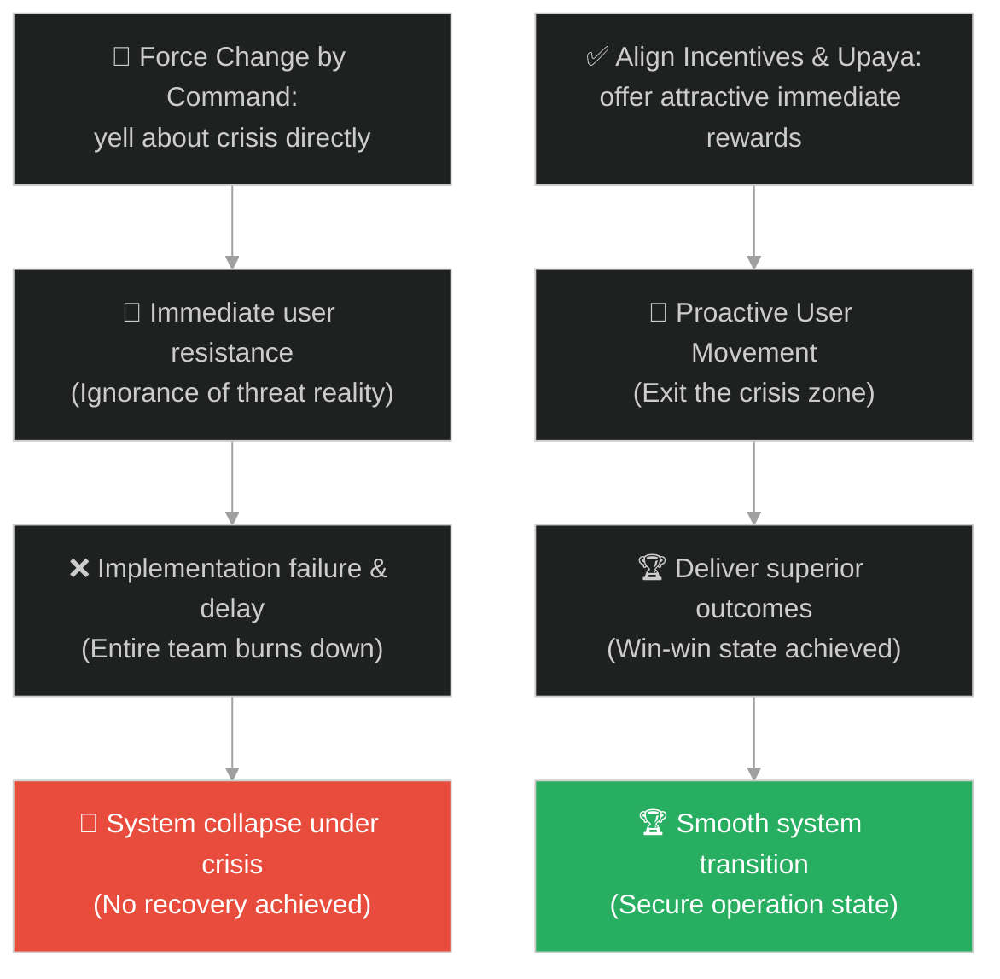
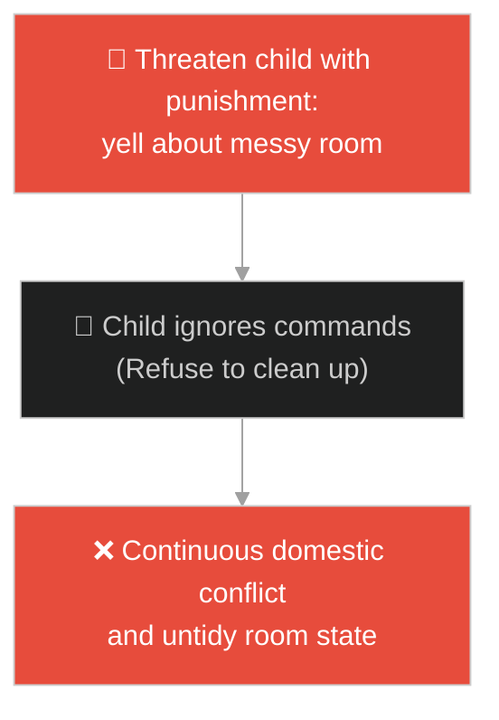
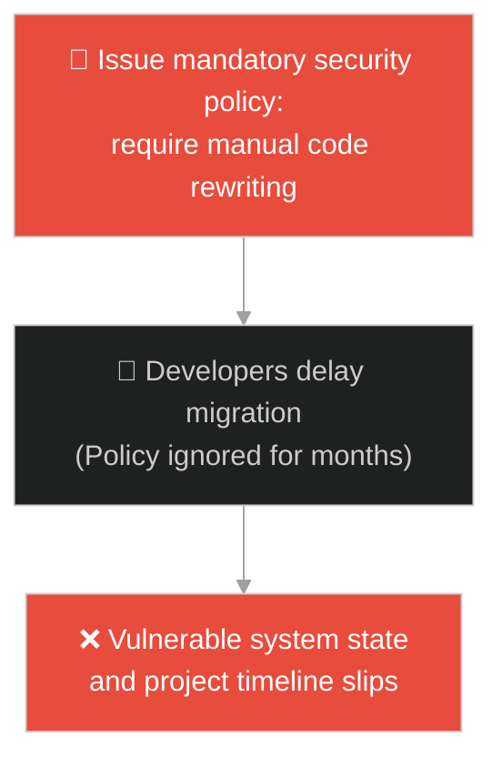
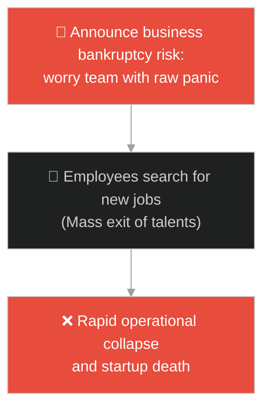
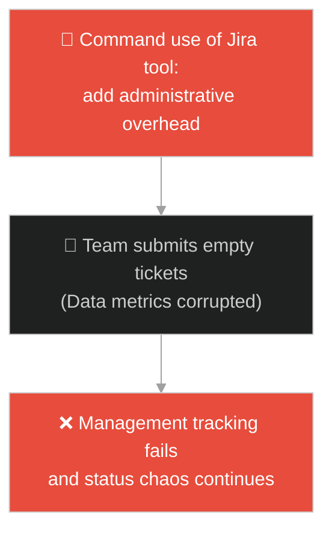
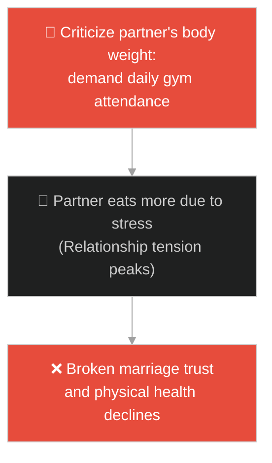
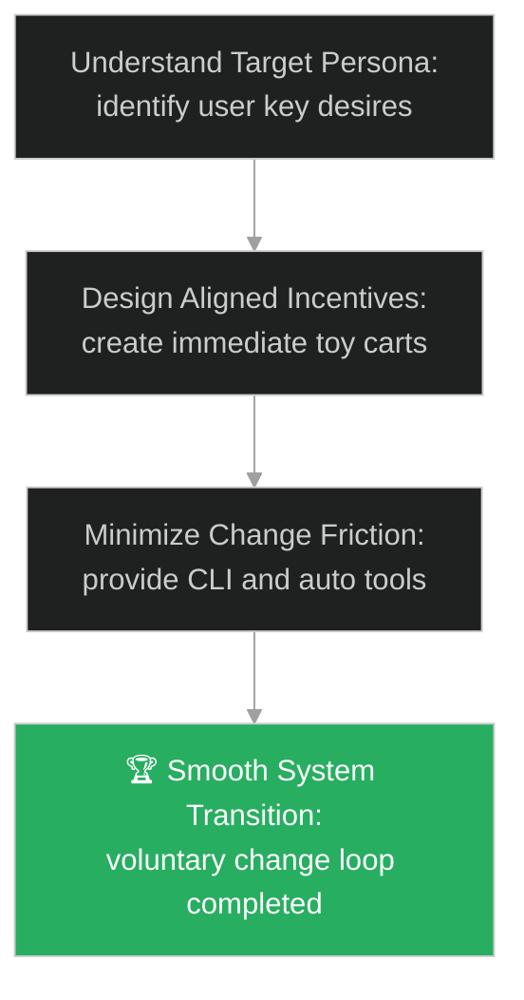

# Change Management & Incentive Alignment (ការគ្រប់គ្រងការផ្លាស់ប្តូរ និងការតម្រង់ទិសដៅលើកទឹកចិត្ត)៖ ផ្ទះភ្លើងឆេះ (Change Management & The Burning House)

**Author:** ichamrong  
**Date:** 2026-05-28  
**Tags:** #buddhism #skillful-means #upaya #pragmatism #leadership #change-management #parable  
**Category:** Concepts / Parables  
**Read Time:** ~15 min  

---

## 📌 មាតិកា (Table of Contents)
- [អន្ទាក់ផ្លូវចិត្ត (The Trap)](#0)
- [១. រឿងព្រេងព្រះពុទ្ធសាសនា៖ ផ្ទះដែលកំពុងឆេះ (The Legend of the Burning House and the Toy Carts)](#1)
  - [រទេះក្មេងលេងទាំងបី និងយន្តការសង្គ្រោះ (The Three Carts and the Rescue Mechanics)](#1-1)
- [២. បញ្ហា៖ វិបត្តិប្រឆាំងការផ្លាស់ប្តូរ និងការខ្វះការតម្រង់ទិសដៅលើកទឹកចិត្ត (The Issue: Resistance to Change and Misaligned Incentives)](#2)
- [៣. ឧទាហមណ៍ជាក់ស្តែងក្នុងពិភពពិត (Real World Examples)](#3)
  - [ឧទាហរណ៍ទី ១ — កម្រិតស្រាល (គ្រួសារ)៖ ការបញ្ចុះបញ្ចូលកូនឱ្យរៀបចំសម្ភារៈបន្ទប់ (Gamifying Child Room Cleaning)](#3-1)
  - [ឧទាហរណ៍ទី ២ — កម្រិតមធ្យម (បច្ចេកទេស)៖ ការផ្លាស់ប្តូរទៅប្រើប្រាស់ Framework សុវត្ថិភាពថ្មី (Secure Framework Migration)](#3-2)
  - [ឧទាហរណ៍ទី ៣ — កម្រិតមធ្យម (ធុរកិច្ច)៖ ការបង្វែរទិសដៅផលិតផលស្របពេលទីផ្សារធ្លាក់ចុះ (Business Product Pivot Pitch)](#3-3)
  - [ឧទាហរណ៍ទី ៤ — កម្រិតមធ្យម (សង្គម/គ្រប់គ្រង)៖ ការដាក់ឱ្យប្រើប្រាស់ប្រព័ន្ធគ្រប់គ្រងសំបុត្រការងារថ្មី (Adopting New Ticketing System)](#3-4)
  - [ឧទាហរណ៍ទី ៥ — កម្រិតធ្ងន់ (ទំនាក់ទំនង)៖ ការលើកទឹកចិត្តដៃគូឱ្យហាត់ប្រាណដើម្បីសុខភាព (Encouraging Healthy Lifestyle Changes)](#3-5)
- [៤. ដំណោះស្រាយទូទៅ៖ ការអនុវត្ត Skillful Means និងការតម្រង់ទិសដៅលើកទឹកចិត្ត (The General Solution: Applying Upaya Frameworks and Incentive Design)](#4)
- [សេចក្តីសន្និដ្ឋាន (Conclusion)](#5)
- [ឯកសារយោង (References)](#6)
- [Related Posts](#7)

---

<a id="0"></a>
## អន្ទាក់ផ្លូវចិត្ត (The Trap)

តើអ្នកធ្លាប់ជួបបញ្ហាដែលត្រូវដាក់ឱ្យអនុវត្តការផ្លាស់ប្តូរណាមួយនៅក្នុងក្រុមការងារ ឬជីវិត (Change Management) រួចអ្នកព្យាយាមពន្យល់ពីហេតុផលពិតប្រាកដ ឬច្បាប់បង្ខំ ប៉ុន្តែអ្នកដទៃនៅតែប្រឆាំង និងមិនព្រមសហការទាល់តែសោះដែរឬទេ?

នៅក្នុងការគ្រប់គ្រងការផ្លាស់ប្តូរ៖
* **យើងងាយនឹងធ្លាក់ក្នុងអន្ទាក់** នៃការគិតថា "ការនិយាយការពិតបច្ចេកទេស ឬការបញ្ជាច្បាប់តឹងរ៉ឹង គ្រប់គ្រាន់ដើម្បីឱ្យគេកែប្រែឥរិយាបថ" (Authoritarian Mandate Trap) ដោយមើលរំលងការយល់ឃើញ និងចំណាប់អារម្មណ៍ផ្ទាល់ខ្លួនរបស់ពួកគេ។
* **យើងមើលរំលង** យន្តការលើកទឹកចិត្ត (Incentive Design) ដែលទាមទារការបកស្រាយបញ្ហាដោយប្រើភាសា និងរបស់រង្វាន់ដែលពួកគេឱ្យតម្លៃពិតប្រាកដ (Skillful Means/Upaya) ដើម្បីឱ្យពួកគេផ្លាស់ប្តូរដោយក្តីស្ម័គ្រចិត្ត។

ការព្យាយាមរុញច្រានការផ្លាស់ប្តូរដោយគ្មានការតម្រង់ទិសដៅលើកទឹកចិត្ត ហៅថា **អន្ទាក់បង្ខំការផ្លាស់ប្តូរដែលគ្មានការលើកទឹកចិត្ត (Command-and-Control Change Trap)**។

ដើម្បីយល់ដឹងពីរបៀបដឹកនាំការផ្លាស់ប្តូរប្រកបដោយភាពរលូន នេះជាផែនទីបង្ហាញផ្លូវ៖
1. **រឿងព្រេងនិទាន (The Legend)** — រឿងរ៉ាវរបស់ឪពុកដែលបញ្ឆោតកូនៗឱ្យរត់ចេញពីផ្ទះកំពុងឆេះដោយសន្យាថានឹងផ្តល់រទេះរបស់លេង។
2. **បញ្ហា (The Issue)** — ការវិភាគការប្រឆាំងការផ្លាស់ប្តូរ (Status Quo Bias) និងសារៈសំខាន់នៃការតម្រង់ទិសដៅលើកទឹកចិត្ត (Incentive Alignment)។
3. **ឧទាហមណ៍ជាក់ស្តែងក្នុងពិភពពិត (Real World Examples)** — ពិនិត្យមើលបញ្ហានេះក្នុងកម្រិតគ្រួសារ បច្ចេកវិទ្យា ធុរកិច្ច ការគ្រប់គ្រង និងទំនាក់ទំនង។
4. **ដំណោះស្រាយទូទៅ (The General Solution)** — ការអនុវត្តយុទ្ធសាស្ត្រ Kotter's 8-Step Change Model និងការរៀបចំ Incentive Design។



---

<a id="1"></a>
## ១. រឿងព្រេងព្រះពុទ្ធសាសនា៖ ផ្ទះដែលកំពុងឆេះ (The Legend of the Burning House and the Toy Carts)

រឿងប្រៀបប្រដូចនេះមានប្រភពចេញពី **គម្ពីរសូត្រផ្កាឈូក (Saddharma Puṇḍarīka Sūtra)** នៃពុទ្ធសាសនាមហាយាន។

នៅក្នុងរឿងនោះ៖
* មានមហាសេដ្ឋីចាស់ម្នាក់ដែលជាម្ចាស់ផ្ទះដ៏ធំស្កឹមស្កៃមួយកន្លែង។ ផ្ទះនោះចាស់ទ្រុឌទ្រោមណាស់ មានច្រកចេញចូលតែមួយគត់ ហើយជញ្ជាំងនិងដំបូលធ្វើពីឈើ និងស្លឹកស្មៅស្ងួត។
* ថ្ងៃមួយ ខណៈពេលដែលកូនប្រុសតូចៗជាច្រើនរបស់គាត់កំពុងលេងសប្បាយនៅក្នុងផ្ទះ ស្រាប់តែមានភ្លើងឆាបឆេះឡើងយ៉ាងសន្ធោសន្ធៅពីគ្រប់ទិសទី។
* ឪពុកមានការភ័យខ្លាចយ៉ាងខ្លាំង រត់ទៅខាងក្រៅទ្វាររួចស្រែកហៅកូនៗថា៖ *"កូនៗអើយ! ផ្ទះកំពុងឆេះហើយ! ចូររត់ចេញក្រៅជាបន្ទាន់ បើមិនដូច្នេះទេកូននឹងត្រូវស្លាប់ក្នុងភ្នក្លើងមិនខាន!"*
* ក្មេងៗតូចៗទាំងនោះលង់លក់នឹងការលេងល្បែង ពួកគេមិនយល់ថាអ្វីទៅជា "សេចក្តីស្លាប់" អ្វីទៅជា "ភ្លើងឆេះ" ឡើយ។ ពួកគេនៅតែសើចសប្បាយ និងដេញលេងគ្នាក្នុងផ្ទះ ដោយមិនខ្វល់នឹងការស្រែកហៅរបស់ឪពុកទាល់តែសោះ។

---

<a id="1-1"></a>
### រទេះក្មេងលេងទាំងបី និងយន្តការសង្គ្រោះ (The Three Carts and the Rescue Mechanics)

ឪពុកដឹងច្បាស់ថាកូនៗរបស់ខ្លួនមិនអាចស្តាប់ហេតុផលវិបត្តិដោយផ្ទាល់បានឡើយ គាត់ក៏គិតរកវិធីសាស្ត្រដ៏ឈ្លាសវៃមួយ (Upaya/Skillful Means)៖
* គាត់ដឹងថាកូនៗចូលចិត្តរទេះក្មេងលេងជាខ្លាំង គាត់ក៏ស្រែកប្រកាសប្រាប់ថា៖
> «កូនៗអើយ! ពុកទើបតែបានទិញរទេះក្មេងលេងដ៏អស្ចារ្យចំនួន ៣ គ្រឿងមកទុកឱ្យ៖ រទេះទឹមដោយពពែ រទេះទឹមដោយក្តាន់ និងរទេះទឹមដោយគោស! ពួកវាស្ថិតនៅក្រៅផ្ទះនេះ! ចូររត់ចេញមកយកលឿនឡើង មុននឹងវាត្រូវគេយកអស់!»

ឮដូច្នោះភ្លាម ក្មេងៗទាំងអស់មានក្តីរំភើបយ៉ាងខ្លាំង ពួកគេនាំគ្នារត់ដណ្ដើមគ្នាជាន់គ្នាដើរចេញពីផ្ទះដែលកំពុងឆេះនោះយ៉ាងលឿនបំផុត។

នៅពេលពួកគេរត់ចេញមកដល់ទីធ្លាខាងក្រៅដោយសុវត្ថិភាព ឪពុកមិនបានឱ្យរទេះពពែ ឬរទេះក្តាន់តូចតាចដែលគាត់បានសន្យានោះឡើយ។ ផ្ទុយទៅវិញ គាត់បានប្រគល់ជូនកូនៗគ្រប់គ្នានូវ **រទេះសត្វគោសដ៏ធំស្កឹមស្កៃ** ធ្វើពីមាសប្រាក់ និងតុបតែងដោយត្បូងពេជ្រដ៏មានតម្លៃមហាសាល ដែលល្អជាងរបស់លេងសន្យាពីមុនរាប់រយដង។

ព្រះពុទ្ធទ្រង់សម្តែងថា ការបត់បែនមធ្យោបាយរបស់ឪពុកមិនមែនជាការកុហកបោកប្រាស់ឡើយ តែវាជា " Upaya - មធ្យោបាយឈ្លាសវៃ" ដើម្បីសង្គ្រោះជីវិតកូនៗ។

---

<a id="2"></a>
## ២. បញ្ហា៖ វិបត្តិប្រឆាំងការផ្លាស់ប្តូរ និងការខ្វះការតម្រង់ទិសដៅលើកទឹកចិត្ត (The Issue: Resistance to Change and Misaligned Incentives)

នៅក្នុងអាជីវកម្ម និងវិស្វកម្មប្រព័ន្ធ បញ្ហាធំបំផុតនៃការផ្លាស់ប្តូរដំណើរការការងារ (Process Changes) ឬការធ្វើ Refactoring គឺការរុញច្រានគម្រោងដោយប្រើការបញ្ជា (Top-down Command) ដែលបង្កឱ្យមានការប្រឆាំងពីសមាជិកក្រុម៖

```java
// ការព្យាយាមបង្ខំឱ្យប្រើប្រាស់ Framework ថ្មីដោយគ្មានប្រព័ន្ធលើកទឹកចិត្ត
public class PlatformMigration {
    public void migrate(boolean forcePolicyOnly) {
        if (forcePolicyOnly) {
            // អន្ទាក់បង្ខំ៖ គំរាមកាត់ប្រាក់រង្វាន់បើមិនព្រមប្តូរកូដ (Yell at developers)
            System.out.println("Migrate now or face penalty!");
            // លទ្ធផល៖ Developer ប្រឆាំងដោយលួចលាក់ និងសរសេរកូដគ្មានគុណភាព
        }
    }
}
```

* **បាតុភូតប្រឆាំងការផ្លាស់ប្តូរ (Status Quo Bias)៖** មនុស្សតែងតែមានអារម្មណ៍សុវត្ថិភាពជាមួយអ្វីដែលពួកគេធ្លាប់ធ្វើ (ទោះបីជាវាជាប្រព័ន្ធចាស់ដែលយឺតក៏ដោយ) និងភ័យខ្លាចភាពស្មុគស្មាញថ្មីៗ។
* **ភាពមិនស៊ីគ្នានៃគោលដៅ (Incentive Misalignment)៖** នៅពេលយើងចង់ឱ្យផ្នែកលក់ (Sales) ផ្តោតលើគុណភាពសេវាកម្ម ប៉ុន្តែប្រព័ន្ធប្រាក់រង្វាន់របស់ពួកគេនៅតែគិតលើចំនួនលក់ (Volume) ពួកគេនឹងមិនផ្លាស់ប្តូរឡើយ។

---

<a id="3"></a>
## ៣. ឧទាហមណ៍ជាក់ស្តែងក្នុងពិភពពិត

---

<a id="3-1"></a>
### ឧទាហរណ៍ទី ១ — កម្រិតស្រាល (គ្រួសារ)៖ ការបញ្ចុះបញ្ចូលកូនឱ្យរៀបចំសម្ភារៈបន្ទប់ (Gamifying Child Room Cleaning)

ម្តាយបង្ខំឱ្យកូនរៀបចំបន្ទប់គេងឱ្យស្អាតដោយស្រែកគំរាមថា៖ *"ផ្ទះកខ្វក់ជិតងាប់ហើយ រៀបចំភ្លាម!"* (កូនមិនខ្វល់ និងបន្តលេង)។ ដំណោះស្រាយគឺម្តាយបានបង្កើតល្បែងប្រណាំងគ្នា៖ *"អ្នកណាប្រមូលល្បែងដាក់ប្រអប់បានលឿនជាងគេក្នុងរយៈពេល ៥ នាទី នឹងទទួលបានការអនុញ្ញាតឱ្យមើលគំនូរជីវចល ១ ម៉ោង"* (កូនប្រជែងគ្នារៀបចំដោយរីករាយ)។



---

<a id="3-2"></a>
### ឧទាហរណ៍ទី ២ — កម្រិតមធ្យម (បច្ចេកទេស)៖ ការផ្លាស់ប្តូរទៅប្រើប្រាស់ Framework សុវត្ថិភាពថ្មី (Secure Framework Migration)

នាយកដ្ឋានសុវត្ថិភាពបញ្ជាឱ្យអ្នកសរសេរកូដទាំងអស់ ប្តូរទៅប្រើប្រាស់បណ្ណាល័យកូដ (Library) ថ្មីដើម្បីសុវត្ថិភាព (Security Mandate)។ អ្នកសរសេរកូដប្រឆាំងព្រោះវាស្មុគស្មាញ និងយឺតការងារ។ ដំណោះស្រាយគឺក្រុមបច្ចេកវិទ្យាបានបង្កើត tools ជំនួយស្វ័យប្រវត្តិ (CLI Generator) ដែលជួយកាត់បន្ថយការសរសេរកូដដដែលៗរបស់ Developer ចំនួន ៥០% (នុយលើកទឹកចិត្ត) ធ្វើឱ្យក្រុមការងារស្ម័គ្រចិត្តប្តូរទៅប្រើប្រាស់គ្រប់គ្នា។



---

<a id="3-3"></a>
### ឧទាហរណ៍ទី ៣ — កម្រិតមធ្យម (ធុរកិច្ច)៖ ការបង្វែរទិសដៅផលិតផលស្របពេលទីផ្សារធ្លាក់ចុះ (Business Product Pivot Pitch)

ក្រុមហ៊ុនជួបប្រទះវិបត្តិធ្លាក់ចុះការលក់ផលិតផលចាស់។ នាយកប្រតិបត្តិប្រជុំប្រាប់បុគ្គលិកថា៖ *"យើងជិតដួលរលំហើយ ត្រូវតែប្តូរទៅលក់ផលិតផល AI វិញ"* ធ្វើឱ្យបុគ្គលិកភ័យខ្លាច និងបាត់បង់ស្មារតីការងារ។ ដំណោះស្រាយគឺគាត់បានframing ការផ្លាស់ប្តូរនេះថាជាការសញ្ជ័យទីផ្សារថ្មី៖ *"យើងនឹងក្លាយជាអ្នកនាំមុខគេក្នុងបច្ចេកវិទ្យាទំនើប និងផ្តល់ឱកាសដំឡើងតួនាទីដល់អ្នកចូលរួមដំបូង"* ធ្វើឱ្យបុគ្គលិកខិតខំប្រឹងប្រែងខ្លាំង។



---

<a id="3-4"></a>
### ឧទាហរណ៍ទី ៤ — កម្រិតមធ្យម (សង្គម/គ្រប់គ្រង)៖ ការដាក់ឱ្យប្រើប្រាស់ប្រព័ន្ធគ្រប់គ្រងសំបុត្រការងារថ្មី (Adopting New Ticketing System)

ក្រុមហ៊ុនចង់ដាក់ឱ្យប្រើប្រាស់ប្រព័ន្ធ Jira ថ្មីជំនួសឱ្យការសរសេរសារលើ Slack។ បុគ្គលិកមិនព្រមប្រើព្រោះយល់ថាស្មុគស្មាញ។ ប្រធានក្រុមបានបង្ហាញដំណោះស្រាយ៖ *"អ្នកណាប្រើប្រាស់ប្រព័ន្ធថ្មីនេះ នឹងមិនបាច់ចូលរួមប្រជុំ Standup ពេលព្រឹកឡើយ ព្រោះខ្ញុំអាចមើលស្ថានភាពការងារលើ dashboard បាន"* (បុគ្គលិកប្រញាប់ប្រើប្រាស់ Jira គ្រប់គ្នាដើម្បីជៀសវាងការប្រជុំយូរ)។



---

<a id="3-5"></a>
### ឧទាហរណ៍ទី ៥ — កម្រិតធ្ងន់ (ទំនាក់ទំនង)៖ ការលើកទឹកចិត្តដៃគូឱ្យហាត់ប្រាណដើម្បីសុខភាព (Encouraging Healthy Lifestyle Changes)

ប្រពន្ធចង់ឱ្យប្តីដែលធាត់ និងមានជំងឺ ទៅហាត់ប្រាណ។ នាងតែងតែនិយាយរិះគន់រាល់ថ្ងៃ៖ *"ខ្លួនធាត់អាក្រក់មើលណាស់ ត្រូវទៅរត់ភ្លាម!"* (ប្តីខឹង និងមិនព្រមទៅ)។ ដំណោះស្រាយគឺនាងបានហៅប្តីទៅដើរកម្សាន្តនៅឧទ្យានធម្មជាតិដ៏ស្រស់ស្អាតរៀងរាល់ចុងសប្តាហ៍ រួចរៀបចំម្ហូបអាហារដែលគាត់ចូលចិត្តទៅញ៉ាំ (មធ្យោបាយ Upaya) ធ្វើឱ្យប្តីស្ម័គ្រចិត្តដើររាប់គីឡូម៉ែត្រដោយក្តីរីករាយ។



---

<a id="4"></a>
## ៤. ដំណោះស្រាយទូទៅ៖ ការអនុវត្ត Skillful Means និងការតម្រង់ទិសដៅលើកទឹកចិត្ត (The General Solution: Applying Upaya Frameworks and Incentive Design)

เพื่อដោះស្រាយបញ្ហានៃការប្រឆាំងការផ្លាស់ប្តូរ យើងត្រូវអនុវត្តប្រព័ន្ធតម្រង់ទិសដៅលើកទឹកចិត្ត និងការរចនាយុទ្ធសាស្ត្រផ្លាស់ប្តូរដោយរលូន៖



* **ការអនុវត្តវិទ្យាសាស្ត្រលើកទឹកចិត្ត (Incentive Alignment Design)៖** មុននឹងដាក់ចេញនូវយុទ្ធសាស្ត្រថ្មី ត្រូវប្រាកដថាប្រព័ន្ធផ្តល់រង្វាន់ (Rewards/KPIs) របស់បុគ្គលិកត្រូវបានកែសម្រួលឱ្យស្របគ្នាជាមួយការងារថ្មីនោះ។
* **ការប្រើប្រាស់វិធីសាស្ត្រ "Gamification" ក្នុងកិច្ចការធុញទ្រាន់៖** បំប្លែងដំណើរការការងារស្មុគស្មាញ (ដូចជាការសម្អាតទិន្នន័យចាស់ៗ) ឱ្យទៅជាការប្រកួតប្រជែង ឬការសន្សំពិន្ទុដើម្បីទទួលបានរង្វាន់តូចតាចក្នុងក្រុមការងារ។
* **ការអនុវត្តគំរូផ្លាស់ប្តូររបស់ Kotter (Kotter's 8-Step Change Model)៖** បង្កើតអារម្មណ៍បន្ទាន់ (Urgency) តាមរយៈការframing បញ្ហាឱ្យត្រូវនឹងផលប្រយោជន៍របស់ពួកគេ រួចកសាងការសហការ និងបង្កើតជ័យជម្នះរយៈពេលខ្លី (Short-term Wins) ដើម្បីលើកទឹកចិត្តក្រុមការងារ។

---

## 🐇 ធ្លាក់ចូលក្នុងរន្ធទន្សាយ (Enter the Rabbit Hole)

ដើម្បីស្វែងយល់កាន់តែស៊ីជម្រៅអំពីរបៀបពង្រីកសមត្ថភាពចិត្ត និងការ Reframing បញ្ហាប្រឈម សូមចាប់ផ្តើមដំណើររុករករបស់អ្នកដោយចុចលើតំណភ្ជាប់ខាងក្រោម៖

* 🚀 **[ចាប់ផ្តើមដំណើររុករក (Start the Journey) ➔ អំបិលមួយស្លាបព្រា (The Spoonful of Salt)](./118-buddha-and-the-salt.md)**

---

<a id="5"></a>
## សេចក្តីសន្និដ្ឋាន (Conclusion)

> **«ដើម្បីដឹកនាំមនុស្សឱ្យដើរចេញពីសេចក្តីវិនាស អ្នកត្រូវនិយាយតាមភាសានៃផលប្រយោជន៍ដែលពួកគេអាចយល់បាន។»**

ភាពឈ្លាសវៃក្នុងការដឹកនាំមិនមែនជាការបង្ខំឱ្យអ្នកដទៃទទួលយកសេចក្តីពិតដ៏ស្មុគស្មាញរបស់យើងឡើយ តែវាជាការប្រើប្រាស់ "Upaya - មធ្យោបាយបត់បែន" ដើម្បីតម្រង់ទិសដៅផលប្រយោជន៍របស់ពួកគេឱ្យស្របនឹងគោលដៅរួម។ នៅពេលដែលការលើកទឹកចិត្តត្រូវបានរៀបចំឡើងយ៉ាងត្រឹមត្រូវ ការផ្លាស់ប្តូរដ៏អស្ចារ្យនឹងកើតឡើងដោយក្តីស្ម័គ្រចិត្ត និងគ្មានការប្រឆាំងឡើយ។

---

<a id="6"></a>
## ឯកសារយោង (References)

* **The Lotus Sutra (Saddharma Puṇḍarīka Sūtra)** — Chapter 3: The Parable of the Burning House.
* **John P. Kotter** — *Leading Change* (1996). Establishing the 8-step framework for change management.
* **Charles Duhigg** — *The Power of Habit: Why We Do What We Do in Life and Business* (2012). Explaining loop cues, routines, and rewards.

---

<a id="7"></a>
## Related Posts

* [The Raft](./116-buddha-and-the-raft.md) — Letting go of legacy tools and old processes that are no longer useful.
* [The Gordian Knot](./44-the-gordian-knot.md) — Refactoring complex engineering problems through pragmatic slicing methods.
