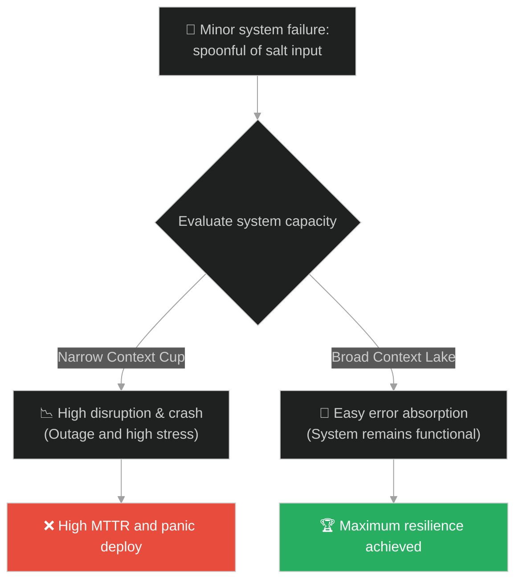
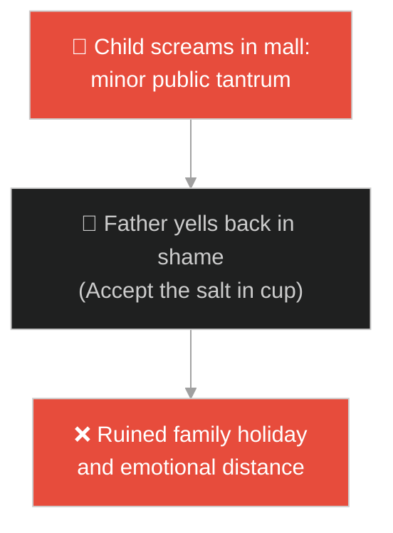
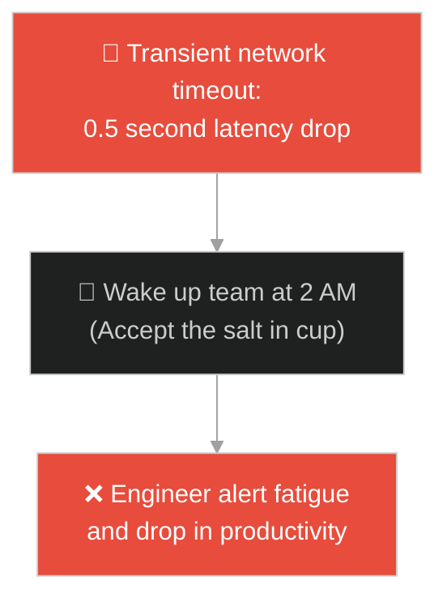
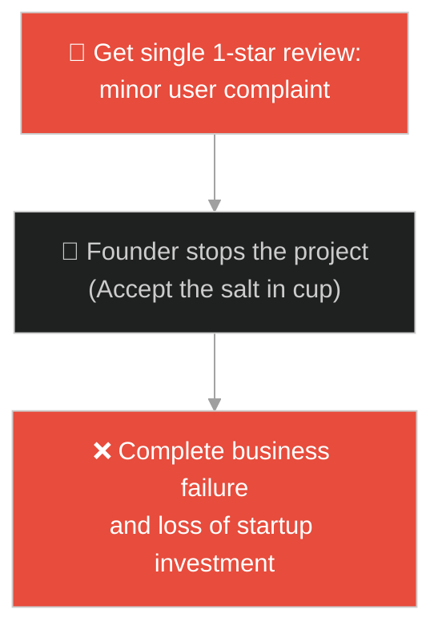
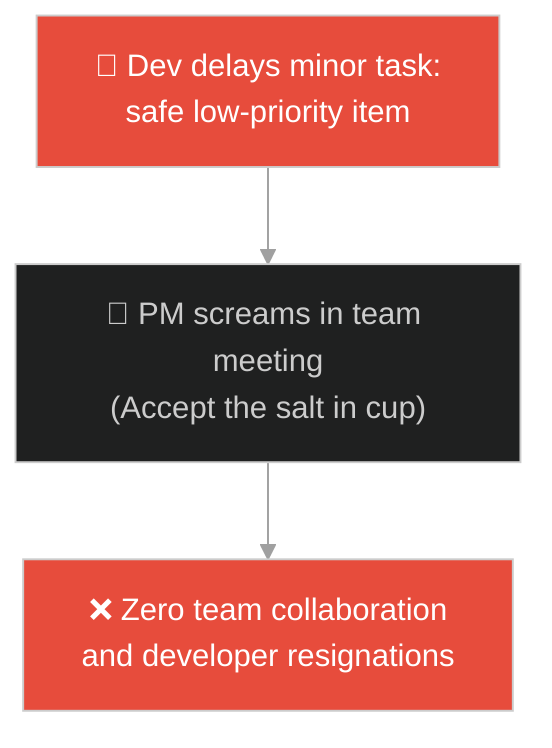
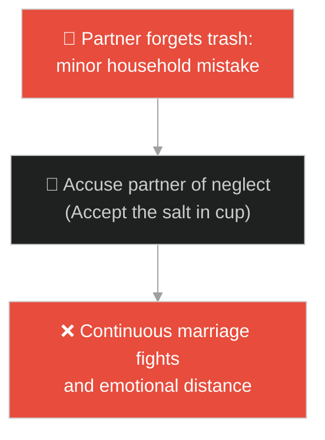
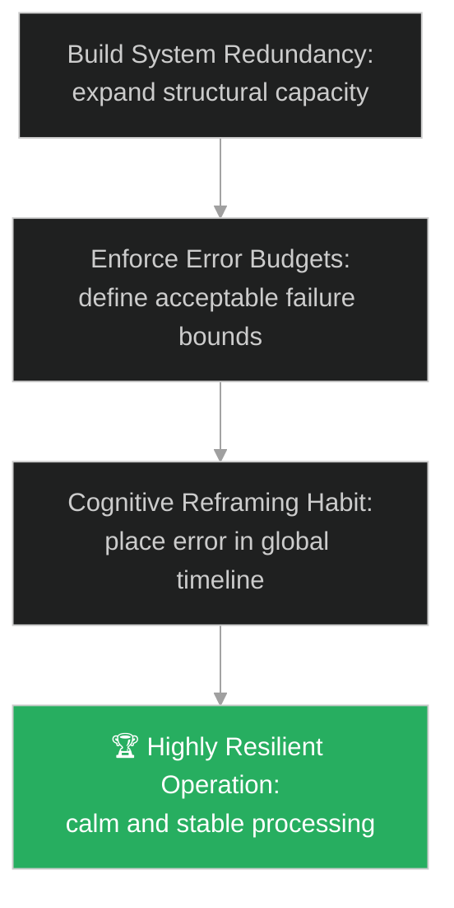

# Contextual Capacity & Resilience (សមត្ថភាពបរិបទ និងភាពធន់ផ្លូវចិត្ត)៖ អំបិលមួយស្លាបព្រា (Contextual Capacity & The Spoonful of Salt)

**Author:** ichamrong  
**Date:** 2026-05-28  
**Tags:** #buddhism #resilience #perspective #mental-models #capacity #parable  
**Category:** Concepts / Parables  
**Read Time:** ~15 min  

---

## 📌 មាតិកា (Table of Contents)
- [អន្ទាក់ផ្លូវចិត្ត (The Trap)](#0)
- [១. រឿងព្រេងព្រះពុទ្ធសាសនា៖ អំបិលមួយស្លាបព្រា (The Legend of the Spoonful of Salt)](#1)
  - [កែវទឹក និងបឹងទឹកសាប (The Small Cup vs The Open Lake)](#1-1)
- [២. បញ្ហា៖ វិបត្តិគិតចង្អៀត និងការបាត់បង់តុល្យភាពប្រព័ន្ធដោយសារកំហុសតូចតាច (The Issue: Narrow Context and Over-sensitivity to Minor Errors)](#2)
- [៣. ឧទាហមណ៍ជាក់ស្តែងក្នុងពិភពពិត (Real World Examples)](#3)
  - [ឧទាហរណ៍ទី ១ — កម្រិតស្រាល (គ្រួសារ)៖ ការទប់ទល់នឹងការស្រែកយំរបស់កូនតូច (Handling Child Tantrums with Perspective)](#3-1)
  - [ឧទាហរណ៍ទី ២ — កម្រិតមធ្យម (បច្ចេកទេស)៖ កំហុសដំណើរការ API ចៃដន្យក្នុងប្រព័ន្ធ (Handling Transient API Failures)](#3-2)
  - [ឧទាហរណ៍ទី ៣ — កម្រិតមធ្យម (ធុរកិច្ច)៖ មតិរិះគន់អវិជ្ជមានដំបូងពីអតិថិជន (Surviving the First Negative Product Review)](#3-3)
  - [ឧទាហរណ៍ទី ៤ — កម្រិតមធ្យម (សង្គម/គ្រប់គ្រង)៖ ភាពយឺតយ៉ាវនៃកិច្ចការតូចតាចក្នុងត្រីមាស (Delayed Non-critical Tasks)](#3-4)
  - [ឧទាហរណ៍ទី ៥ — កម្រិតធ្ងន់ (ទំនាក់ទំនង)៖ ការអត់ឱនចំពោះកំហុសឆ្គងប្រចាំថ្ងៃរបស់ដៃគូ (Forgiving Partner's Daily Mistakes)](#3-5)
- [៤. ដំណោះស្រាយទូទៅ៖ ការពង្រីកសមត្ថភាពបរិបទ និងការកសាងប្រព័ន្ធធន់ (The General Solution: Expanding Contextual Capacity and Building Resilient Systems)](#4)
- [សេចក្តីសន្និដ្ឋាន (Conclusion)](#5)
- [ឯកសារយោង (References)](#6)
- [Related Posts](#7)

---

<a id="0"></a>
## អន្ទាក់ផ្លូវចិត្ត (The Trap)

តើអ្នកធ្លាប់ជួបបញ្ហាដែលកំហុស ឬការរិះគន់តូចតាចមួយ បានធ្វើឱ្យប្រព័ន្ធការងាររបស់អ្នកជាប់គាំង ឬបំផ្លាញថ្ងៃដ៏រីករាយរបស់អ្នកទាំងស្រុង ដោយសារតែអ្នកផ្តោតតែលើវាខ្លាំងពេកដែរឬទេ?

នៅក្នុងការដោះស្រាយបញ្ហា៖
* **យើងងាយនឹងធ្លាក់ក្នុងអន្ទាក់** នៃការបណ្តោយឱ្យកំហុសតូចតាច (Minor Outages/Specific Complaints) មកគ្របដណ្តប់លើរូបភាពជោគជ័យរួមធំ (Uptime/Long-term Relationship) ដែលនាំឱ្យមានការសម្រេចចិត្តខុសឆ្គងដោយក្តីបារម្ភជ្រុល (Anxiety Loop)។
* **យើងមើលរំលង** សារៈសំខាន់នៃការកសាងសមត្ថភាពផ្ទុករបស់ប្រព័ន្ធ (Capacity) ដែលជួយស្រូបយកកំហុសឆ្គងបានដោយងាយស្រួល មិនឱ្យវាបំប្លែងទៅជាវិបត្តិធំដំ។

ការអនុញ្ញាតឱ្យបញ្ហាតូចតាចមកបង្កក្តីក្តៅក្រហាយដល់ជីវិត ឬប្រព័ន្ធទាំងមូល ហៅថា **អន្ទាក់កែវទឹកចង្អៀត (Narrow Cup Context Trap)**។

ដើម្បីយល់ដឹងពីរបៀបពង្រីកសមត្ថភាពចិត្ត និងប្រព័ន្ធឱ្យធំទូលាយដូចបឹង នេះជាផែនទីបង្ហាញផ្លូវ៖
1. **រឿងព្រេងនិទាន (The Legend)** — រឿងរ៉ាវរបស់សិស្សដែលផឹកទឹកអំបិលក្នុងកែវ (ប្រៃខ្លាំង) និងទឹកអំបិលក្នុងបឹង (ផ្អែមត្រជាក់)។
2. **បញ្ហា (The Issue)** — ការវិភាគចិត្តវិទ្យានៃភាពធន់ (Resilience) និងផលប៉ះពាល់លើសមត្ថភាពប្រព័ន្ធ (System Capacity/Throughput)។
3. **ឧទាហមណ៍ជាក់ស្តែងក្នុងពិភពពិត (Real World Examples)** — ពិនិត្យមើលបញ្ហានេះក្នុងកម្រិតគ្រួសារ បច្ចេកវិទ្យា ធុរកិច្ច ការគ្រប់គ្រង និងទំនាក់ទំនង។
4. **ដំណោះស្រាយទូទៅ (The General Solution)** — វិធីសាស្ត្រពង្រីកសមត្ថភាពបរិបទ (Contextual Capacity) និងការអនុវត្ត Cognitive Reframing។



---

<a id="1"></a>
## ១. រឿងព្រេងព្រះពុទ្ធសាសនា៖ អំបិលមួយស្លាបព្រា (The Legend of the Spoonful of Salt)

មានរឿងដំណាលមួយនៅក្នុងសម័យពុទ្ធកាល (គម្ពីរអង្គុត្តរនិកាយ) អំពីកូនសិស្សបួសថ្មីម្នាក់ដែលមានចិត្តចង្អៀត ងាយនឹងខឹងក្រោធ និងតែងតែត្អូញត្អែរអំពីការលំបាកតូចតាចក្នុងការបដិបត្តិធម៌ជារៀងរាល់ថ្ងៃ។

គ្រូរបស់លោកបានសង្កេតឃើញស្ថានភាពនេះ រួចចង់ផ្តល់មេរៀនមួយ៖
* ព្រះគ្រូបានប្រាប់សិស្សឱ្យទៅដងទឹកមួយកែវតូច រួចយកអំបិលមួយស្លាបព្រាពេញទៅចាក់ចូលក្នុងកែវនោះ។
* លោកគ្រូបង្គំឱ្យសិស្សកូរវាឱ្យសព្វ រួចផឹកទឹកនោះ។ ក្រោយពេលផឹកបានមួយក្អឹក សិស្សនោះបានខាកស្តោះទឹកចេញមកក្រៅវិញភ្លាមៗដោយទឹកមុខជូរចត់។
* គ្រូសួរថា៖ *"តើរសជាតិទឹកនោះយ៉ាងម៉េចដែរ?"*
* សិស្សឆ្លើយដោយការមិនពេញចិត្តថា៖ *"ប្រៃនិងល្វីងខ្លាំងណាស់លោកគ្រូ ខ្ញុំមិនអាចផឹកវាបានឡើយ!"*

---

<a id="1-1"></a>
### កែវទឹក និងបឹងទឹកសាប (The Small Cup vs The Open Lake)

ព្រះគ្រូញញឹម រួចមិនមានបន្ទូលអ្វីឡើយ លោកបាននាំសិស្សដើរទៅកាន់បឹងទឹកសាបដ៏ធំធេងមួយនៅក្បែរនោះ៖
* គ្រូបានប្រាប់សិស្សឱ្យយកអំបិលមួយស្លាបព្រា ប៉ុនគ្នាដដែលនោះ ទៅបោះចូលទៅក្នុងទឹកបឹង។
* គ្រូបង្គាប់ឱ្យសិស្សដងទឹកបឹងនោះយកមកផឹក រួចសួរថា៖ *"តើទឹកនេះមានរសជាតិប្រៃដូចទឹកកែវមុនដែរឬទេ?"*
* សិស្សឆ្លើយដោយសេចក្តីរីករាយថា៖ *"ទេ លោកគ្រូ ទឹកនេះផ្អែមត្រជាក់ និងស្រស់ស្រាយខ្លាំងណាស់ ខ្ញុំមិនទទួលបានរសជាតិប្រៃទាល់តែសោះ!"*

ព្រះគ្រូក៏បានដាក់ដៃលើស្មាជំនួយសិស្ស រួចមានបន្ទូលពន្យល់ថា៖
> «ទុក្ខលំបាក និងបញ្ហាដែលកើតឡើងក្នុងជីវិត គឺប្រៀបដូចជាអំបិលមួយស្លាបព្រានេះឯង បរិមាណវានៅថេរដដែល។ ប៉ុន្តែ កម្រិតនៃការឈឺចាប់ដែលអ្នកទទួលរង គឺវាអាស្រ័យទៅលើទំហំនៃចិត្តរបស់អ្នក។ តើចិត្តរបស់អ្នកជាកែវទឹកតូចចង្អៀត ឬក៏ជាបឹងទឹកសាបដ៏ធំធេង?»

សិស្សបានភ្ញាក់ខ្លួនយល់ដឹងពីរឿងនេះ រួចឈប់ត្អូញត្អែរ និងចាប់ផ្តើមហ្វឹកហាត់ពង្រីកសមត្ថភាពចិត្តរបស់ខ្លួនឱ្យធំទូលាយ។

---

<a id="2"></a>
## ២. បញ្ហា៖ វិបត្តិគិតចង្អៀត និងការបាត់បង់តុល្យភាពប្រព័ន្ធដោយសារកំហុសតូចតាច (The Issue: Narrow Context and Over-sensitivity to Minor Errors)

នៅក្នុងការគ្រប់គ្រងប្រព័ន្ធបច្ចេកវិទ្យា (System Engineering) ការខ្វះសមត្ថភាពបរិបទ (Contextual Capacity) នាំឱ្យប្រព័ន្ធមានប្រតិកម្មខ្លាំងពេកចំពោះបញ្ហាតូចតាច (Over-sensitivity to noise) ដែលធ្វើឱ្យខូចខាតដល់ស្ថិរភាពរួម៖

```java
// ការអនុញ្ញាតឱ្យកំហុស API តែមួយដង បង្កឱ្យប្រព័ន្ធទាំងមូលគាំង
public class ErrorHandler {
    public void processRequest(boolean isRequestFailed) {
        if (isRequestFailed) {
            // អន្ទាក់កែវទឹកចង្អៀត៖ ប្រតិកម្មខ្លាំងពេកចំពោះកំហុសតូចតាច (Narrow Context)
            // បិទដំណើរការ Server ទាំងមូលភ្លាមៗ (Overreaction)
            shutdownEntireServer();
            // លទ្ធផល៖ ប្រព័ន្ធយឺតយ៉ាវ និងបាត់បង់អតិថិជនជាច្រើន
        }
    }
    
    private void shutdownEntireServer() {
        System.out.println("System crash triggered by single transient error.");
    }
}
```

* **ការបាត់បង់ផលិតភាពការងារដោយសារការគ្រប់គ្រងតូចល្អិត (Micromanagement Outages)៖** ប្រធានក្រុមដែលខឹងនឹងការយឺតយ៉ាវការងារ ១ម៉ោងរបស់ Developer ធ្វើឱ្យ Developer មានអារម្មណ៍ភ័យខ្លាច លែងហ៊ានសម្រេចចិត្ត និងធ្វើការងារយឺតជាងមុន។
* **កង្វះភាពធន់ប្រព័ន្ធ (Brittle Architecture)៖** ប្រព័ន្ធដែលគ្មានយន្តការស្រូបយកកំហុស (Error Budget, Circuit Breakers) នឹងត្រូវគាំងទាំងស្រុងនៅពេលជួបបញ្ហា network down តែមួយវិនាទី។

---

<a id="3"></a>
## ៣. ឧទាហមណ៍ជាក់ស្តែងក្នុងពិភពពិត

---

<a id="3-1"></a>
### ឧទាហរណ៍ទី ១ — កម្រិតស្រាល (គ្រួសារ)៖ ការទប់ទល់នឹងការស្រែកយំរបស់កូនតូច (Handling Child Tantrums with Perspective)

កូនតូចស្រែកយំយ៉ាងខ្លាំងនៅក្នុងផ្សារទំនើបព្រោះចង់បានរបស់លេង (អំបិលមួយស្លាបព្រា)។ ឪពុកដែលមានចិត្តចង្អៀត (កែវទឹក) មានអារម្មណ៍ខ្មាស់គេ និងខឹងយ៉ាងខ្លាំង រួចស្រែកគំរាមកូន ធ្វើឱ្យថ្ងៃដើរលេងរបស់គ្រួសារត្រូវបំផ្លាញ។ ផ្ទុយទៅវិញ ឪពុកដែលមានចិត្តធំទូលាយ (បឹងទឹក) យល់ថានេះជាការអភិវឌ្ឍធម្មតារបស់កុមារ គាត់រក្សាភាពស្ងប់ស្ងាត់ ឱបកូន រួចនាំកូនត្រឡប់មកផ្ទះវិញដោយសន្តិវិធី។



---

<a id="3-2"></a>
### ឧទាហរណ៍ទី ២ — កម្រិតមធ្យម (បច្គេកទេស)៖ កំហុសដំណើរការ API ចៃដន្យក្នុងប្រព័ន្ធ (Handling Transient API Failures)

ប្រព័ន្ធ API របស់ក្រុមហ៊ុនជួបប្រទះបញ្ហាកំហុសបណ្តាញចៃដន្យ (Transient Network Error) រយៈពេល ០,៥ វិនាទី (អំបិលមួយស្លាបព្រា)។ ជំនួសឱ្យការប្រើប្រាស់ Retry algorithm ស្វ័យប្រវត្តិតែមួយផ្នែក (បឹងទឹក) ប្រព័ន្ធចាស់គ្មានភាពធន់ (កែវទឹក) បានបញ្ជូនសារ Alert ប្រកាសអាសន្នទៅកាន់ទូរស័ព្ទរបស់ក្រុមការងារទាំងមូលនៅម៉ោង ២ រំលងអធ្រាត្រ ធ្វើឱ្យគ្រប់គ្នាកើតស្ត្រេស និងអស់កម្លាំង។



---

<a id="3-3"></a>
### ឧទាហរណ៍ទី ៣ — កម្រិតមធ្យម (ធុរកិច្ច)៖ មតិរិះគន់អវិជ្ជមានដំបូងពីអតិថិជន (Surviving the First Negative Product Review)

Startup ថ្មីមួយទទួលបានមតិរិះគន់ផ្កាយ ១ ដំបូងបង្អស់ពីអតិថិជនម្នាក់នៅលើ App Store (អំបិលមួយស្លាបព្រា)។ ស្ថាបនិកដែលមានចិត្តចង្អៀត (កែវទឹក) មានអារម្មណ៍បាក់ទឹកចិត្ត និងចង់បិទគម្រោងចោលភ្លាមៗ។ ផ្ទុយទៅវិញ ស្ថាបនិកដែលមានបទពិសោធន៍ (បឹងទឹក) យល់ថានេះជាការងារធម្មតា គាត់បានឆ្លើយតបដោះស្រាយបញ្ហាឱ្យអតិថិជននោះ រួចបន្តអភិវឌ្ឍកម្មវិធីឱ្យល្អប្រសើរឡើង។



---

<a id="3-4"></a>
### ឧទាហរណ៍ទី ៤ — កម្រិតមធ្យម (សង្គម/គ្រប់គ្រង)៖ ភាពយឺតយ៉ាវនៃកិច្ចការតូចតាចក្នុងត្រីមាស (Delayed Non-critical Tasks)

ក្នុងអំឡុងពេលវាយតម្លៃលទ្ធផលការងារប្រចាំត្រីមាស Developer ម្នាក់បានពន្យារពេលបញ្ចប់ការងារតូចតាចមួយដែលមិនសូវសំខាន់ (អំបិលមួយស្លាបព្រា)។ អ្នកគ្រប់គ្រងគម្រោង (PM) ដែលមានចិត្តចង្អៀត (កែវទឹក) បានស្តីបន្ទោស Developer យ៉ាងខ្លាំងក្លាក្នុងការប្រជុំរួម ធ្វើឱ្យបាត់បង់ទំនុកចិត្ត និងសាមគ្គីភាពរបស់ក្រុមការងារទាំងមូល។



---

<a id="3-5"></a>
### ឧទាហរណ៍ទី ៥ — កម្រិតធ្ងន់ (ទំនាក់ទំនង)៖ ការអត់ឱនចំពោះកំហុសឆ្គងប្រចាំថ្ងៃរបស់ដៃគូ (Forgiving Partner's Daily Mistakes)

ប្តីបានភ្លេចចោលសំរាម ឬភ្លេចបិទទ្វារទូទឹកកក (អំបិលមួយស្លាបព្រា)។ ប្រពន្ធដែលមានចិត្តចង្អៀត (កែវទឹក) បានខឹងយ៉ាងខ្លាំង និងចោទថាប្តីមិនដែលខ្វល់ពីផ្ទះសម្បែង រហូតឈ្លោះគ្នាពេញមួយយប់។ ផ្ទុយទៅវិញ បើប្រពន្ធមានចិត្តធំទូលាយដូចបឹង នាងដឹងថានេះជាការភ្លេចភ្លាំងធម្មតា នាងរំលឹកប្តីដោយស្នាមញញឹម រួចរួមគ្នារក្សាភាពរីករាយក្នុងផ្ទះ។



---

<a id="4"></a>
## ៤. ដំណោះស្រាយទូទៅ៖ ការពង្រីកសមត្ថភាពបរិបទ និងការកសាងប្រព័ន្ធធន់ (The General Solution: Expanding Contextual Capacity and Building Resilient Systems)

เพื่อដោះស្រាយបញ្ហានៃចិត្តចង្អៀត និងការប្រតិកម្មខ្លាំងពេក យើងត្រូវអនុវត្តប្រព័ន្ធពង្រីកសមត្ថភាពបរិបទ និងការកសាងភាពធន់ប្រព័ន្ធ៖



* **ការអនុវត្ត Error Budgets ក្នុងស្ថាប័ន (SRE Best Practices)៖** កំណត់កម្រិតកំហុសដែលអាចទទួលយកបាន (ដូចជា ប្រព័ន្ធអាចធ្លាក់ចុះបាន ០,០១% ក្នុងមួយត្រីមាស) ដើម្បីឱ្យក្រុមការងារលែងមានអារម្មណ៍ភ័យខ្លាច និងខិតខំបង្កើតបច្ចេកវិទ្យាថ្មីៗ។
* **បច្ចេកទេសពង្រីកពេលវេលា (Temporal Framing)៖** នៅពេលជួបប្រទះកំហុស ឬវិបត្តិ ចូរចោទសួរសំណួរថា៖ *"តើបញ្ហានេះនឹងមានឥទ្ធិពលអ្វីខ្លះមកលើជីវិត ឬក្រុមហ៊ុនរបស់យើងនៅ ៥ ឆ្នាំក្រោយ?"* បើគ្មានទេ ត្រូវកាត់បន្ថយកម្រិតស្រ្តេស និងដោះស្រាយវាដោយស្ងប់ស្ងាត់។
* **ការអនុវត្តស្ថាបត្យកម្មប្រព័ន្ធបែបធន់ (Resilience Engineering)៖** ប្រើប្រាស់យន្តការ Circuit Breakers, Bulkheads, និង Rate Limiting ក្នុងប្រព័ន្ធបច្ចេកវិទ្យា ដើម្បីធានាថាកំហុសតូចតាចក្នុង module មួយ មិនអាចបំផ្លាញប្រព័ន្ធទាំងមូលបានឡើយ។

---

## 🐇 ធ្លាក់ចូលក្នុងរន្ធទន្សាយ (Enter the Rabbit Hole)

ដើម្បីស្វែងយល់កាន់តែស៊ីជម្រៅអំពីរបៀបគ្រប់គ្រងចិត្តក្នុងស្ថានភាពវិបត្តិ និងការអត់ធ្មត់ដោះស្រាយបញ្ហា សូមចាប់ផ្តើមដំណើររុករករបស់អ្នកដោយចុចលើតំណភ្ជាប់ខាងក្រោម៖

* 🚀 **[ចាប់ផ្តើមដំណើររុករក (Start the Journey) ➔ ទឹកល្អក់ (The Muddy Water)](./119-buddha-and-the-muddy-water.md)**

---

<a id="5"></a>
## សេចក្តីសន្និដ្ឋាន (Conclusion)

> **«កុំបន់ស្រន់សុំឱ្យជីវិតគ្មានការឈឺចាប់ តែត្រូវហ្វឹកហាត់ពង្រីកចិត្តឱ្យធំទូលាយដូចបឹងទឹកសាប។»**

បញ្ហា និងការឈឺចាប់ជាចំណែកដែលមិនអាចចៀសផុតនៃជីវិត។ គន្លឹះពិតប្រាកដនៃការរស់នៅប្រកបដោយសន្តិភាពផ្លូវចិត្តគឺការមិនអនុញ្ញាតឱ្យខ្លួនឯងធ្វើជាកែវទឹកតូចចង្អៀត។ នៅពេលយើងកសាងភាពធន់ និងពង្រីកសមត្ថភាពចិត្តឱ្យធំទូលាយ សូម្បីតែទុក្ខលំបាកប៉ុនណាក៏ដោយ ក៏មិនអាចបំផ្លាញភាពស្រស់ស្រាយនៃជីវិតយើងបានឡើយ។

---

<a id="6"></a>
## ឯកសារយោង (References)

* **Lonaphala Sutta (The Salt Crystal)** — Anguttara Nikaya 3.99, Buddhist Pali Canon.
* **Viktor Frankl** — *Man's Search for Meaning* (1946). Concepts of inner freedom and capacity expansion.
* **Google SRE Book** — *Embracing Risk & Error Budgets* (2016). Modern frameworks for managing system capacity.

---

<a id="7"></a>
## Related Posts

* [The Two Arrows](./112-buddha-and-the-two-arrows.md) — Overcoming emotional overreactions and secondary suffering loops.
* [The Magical Bookshelf](./88-magical-bookshelf.md) — Iteration and traversal patterns in complex structures.
