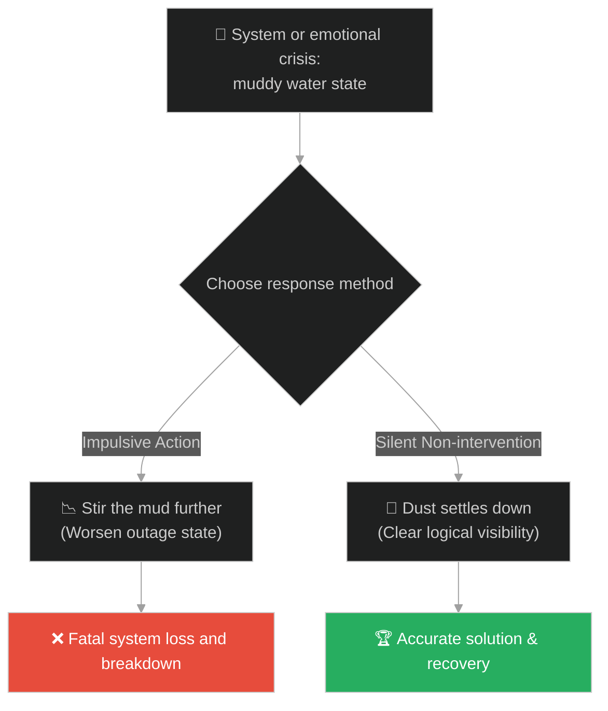
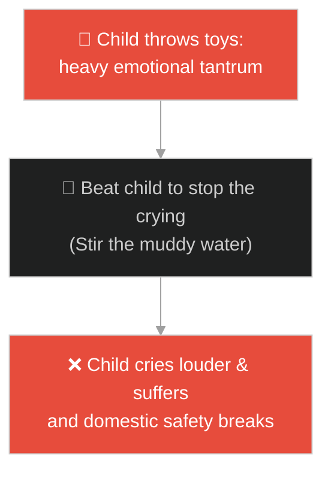
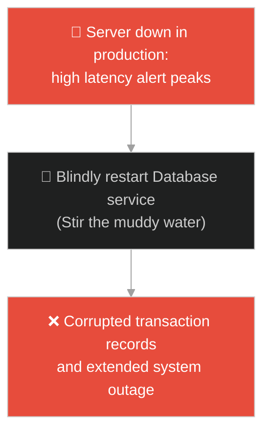
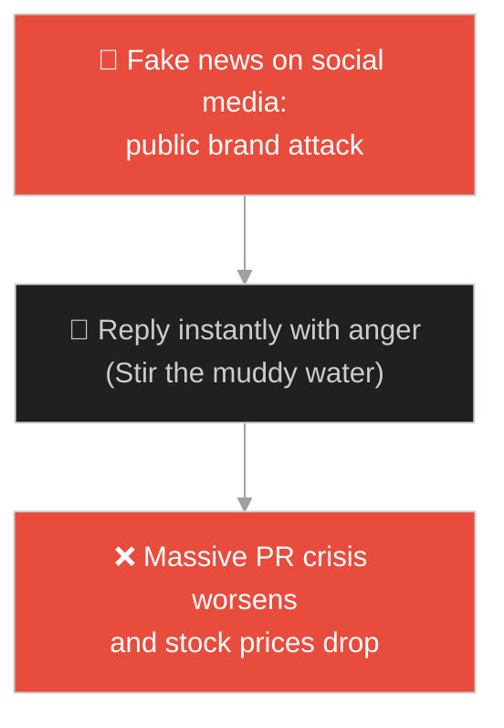
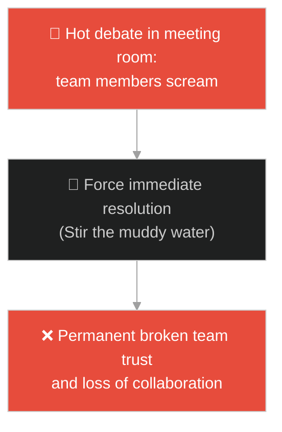
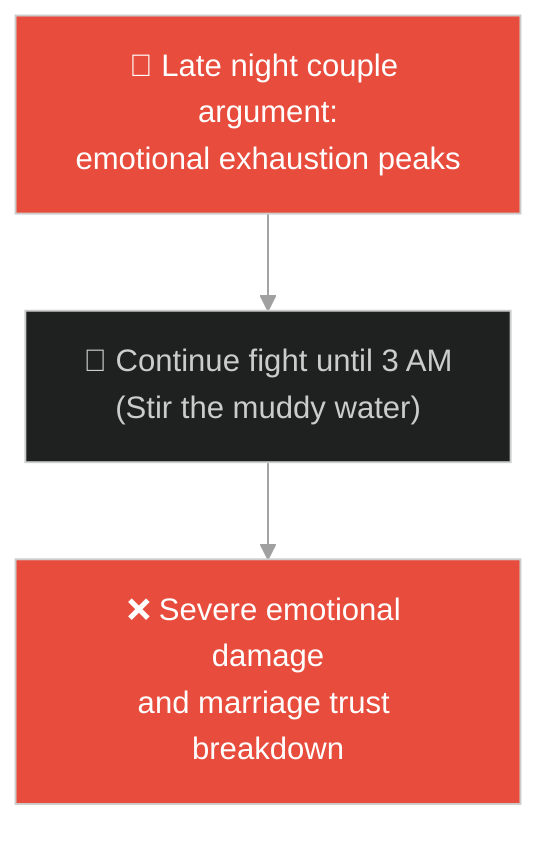
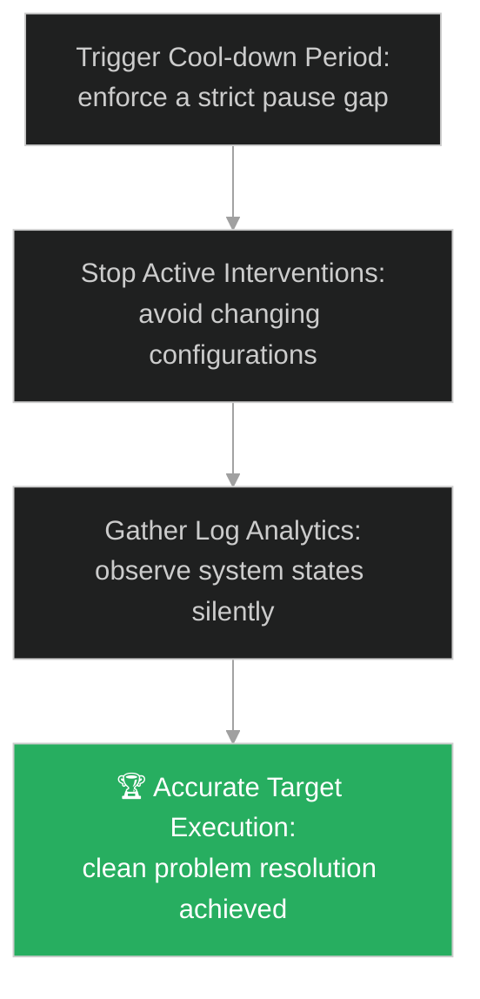

# Calm Under Stress & Incident Patience (ភាពស្ងប់ស្ងាត់ក្រោមសម្ពាធ និងសេចក្តីអត់ធ្មត់ក្នុងវិបត្តិ)៖ ទឹកល្អក់ក្នុងបឹង (Calm Under Stress & The Muddy Water)

**Author:** ichamrong  
**Date:** 2026-05-28  
**Tags:** #buddhism #mindfulness #patience #mental-models #clarity #incident-management #parable  
**Category:** Concepts / Parables  
**Read Time:** ~15 min  

---

## 📌 មាតិកា (Table of Contents)
- [អន្ទាក់ផ្លូវចិត្ត (The Trap)](#0)
- [១. រឿងព្រេងព្រះពុទ្ធសាសនា៖ ទឹកល្អក់ក្នុងបឹង (The Legend of the Muddy Water)](#1)
  - [សេចក្តីអត់ធ្មត់របស់ព្រះអានន្ទ និងដីភក់រងចុះ (Ananda's Patience and the Settled Sediment)](#1-1)
- [២. បញ្ហា៖ វិបត្តិប្រញាប់ប្រញាល់សម្រេចចិត្ត និងការកូរប្រព័ន្ធបន្ថែមក្នុងគ្រាអាសន្ន (The Issue: Impulsive Debugging and Aggravating Outages Under Stress)](#2)
- [៣. ឧទាហមណ៍ជាក់ស្តែងក្នុងពិភពពិត (Real World Examples)](#3)
  - [ឧទាហរណ៍ទី ១ — កម្រិតស្រាល (គ្រួសារ)៖ ការទុកចន្លោះពេលឱ្យកូនតូចបាត់ខឹង (Giving Tantrum Space to Chill)](#3-1)
  - [ឧទាហរណ៍ទី ២ — កម្រិតមធ្យម (បច្ចេកទេស)៖ ការគ្រប់គ្រងការដោះស្រាយប្រព័ន្ធគាំង (Production Outage Response Mechanics)](#3-2)
  - [ឧទាហរណ៍ទី ៣ — កម្រិតមធ្យម (ធុរកិច្ច)៖ ការឆ្លើយតបនឹងការវាយប្រហារព័ត៌មានពីទីផ្សារ (Handling Sudden PR Crisis and Media Panic)](#3-3)
  - [ឧទាហរណ៍ទី ៤ — កម្រិតមធ្យម (សង្គម/គ្រប់គ្រង)៖ ការសម្របសម្រួលជម្លោះក្តៅគគុកក្នុងក្រុមការងារ (Cooling Down Team Arguments Before Review)](#3-4)
  - [ឧទាហរណ៍ទី ៥ — កម្រិតធ្ងន់ (ទំនាក់ទំនង)៖ ការផ្អាកជម្លោះពេលយប់រហូតដល់ព្រឹក (Sleeping on Heated Couple Fights)](#3-5)
- [៤. ដំណោះស្រាយទូទៅ៖ ការពន្យារពេលប្រតិកម្ម និងការអនុវត្តច្បាប់រងដីភក់ (The General Solution: Non-intervention Frameworks and Cool-down Periods)](#4)
- [សេចក្តីសន្និដ្ឋាន (Conclusion)](#5)
- [ឯកសារយោង (References)](#6)
- [Related Posts](#7)

---

<a id="0"></a>
## អន្ទាក់ផ្លូវចិត្ត (The Trap)

តើអ្នកធ្លាប់ជួបបញ្ហាប្រព័ន្ធការងារគាំង (System Outage) ឬជម្លោះក្តៅក្រហាយ រួចអ្នកប្រញាប់ប្រញាល់វាយបញ្ជាកូដ ឬនិយាយតបតភ្លាមៗទាំងអារម្មណ៍តានតឹង ធ្វើឱ្យបញ្ហាកាន់តែរីករាលដាលខ្លាំងឡើងដែរឬទេ?

នៅក្នុងស្ថានភាពវិបត្តិ៖
* **យើងងាយនឹងធ្លាក់ក្នុងអន្ទាក់** នៃការប្រញាប់ប្រញាល់ធ្វើសកម្មភាពកែខៃភ្លាមៗដោយគ្មានទិន្នន័យច្បាស់លាស់ (Impulsive Action/Blind Fixing) ដែលប្រៀបដូចជាការយកដៃទៅកូរទឹកល្អក់ឱ្យកាន់តែកករខ្លាំងឡើង។
* **យើងមើលរំលង** យន្តការរង់ចាំដោយស្ងប់ស្ងាត់ (Non-intervention/Pause Gap) ដើម្បីទុកពេលឱ្យអារម្មណ៍តានតឹង និងប្រព័ន្ធទិន្នន័យបានរៀបរយឡើងវិញមុននឹងចាប់ផ្តើមសកម្មភាពដោះស្រាយ។

ការប្រញាប់ប្រញាល់ជ្រៀតជ្រែកដោះស្រាយប្រព័ន្ធទាំងអារម្មណ៍តានតឹង ហៅថា **អន្ទាក់កូរកករទឹកល្អក់ (Impulsive Intervention Trap)**។

ដើម្បីយល់ដឹងពីរបៀបរក្សាចិត្តឱ្យស្ងប់ និងដោះស្រាយបញ្ហាប្រកបដោយប្រសិទ្ធភាព នេះជាផែនទីបង្ហាញផ្លូវ៖
1. **រឿងព្រេងនិទាន (The Legend)** — រឿងរ៉ាវរបស់ព្រះអានន្ទដែលចង់បន្តដំណើរទៅមុខព្រោះទឹកល្អក់ តែព្រះពុទ្ធឱ្យរង់ចាំរហូតដល់ដីភក់រងចុះក្រោមបឹង។
2. **បញ្ហា (The Issue)** — ការវិភាគចិត្តវិទ្យានៃការប្រញាប់សម្រេចចិត្តក្រោមស្ត្រេស (Amygdala Hijack) និងផលប៉ះពាល់លើការគ្រប់គ្រងវិបត្តិ (Incident Management)។
3. **ឧទាហមណ៍ជាក់ស្តែងក្នុងពិភពពិត (Real World Examples)** — ពិនិត្យមើលបញ្ហានេះក្នុងកម្រិតគ្រួសារ បច្ចេកវិទ្យា ធុរកិច្ច ការគ្រប់គ្រង និងទំនាក់ទំនង។
4. **ដំណោះស្រាយទូទៅ (The General Solution)** — ការអនុវត្តនីតិវិធី "ដកថយមុនវាយប្រហារ" (Incident Cool-down Period) និងវិធីសាស្ត្ររៀបចំចិត្តស្ងប់។



---

<a id="1"></a>
## ១. រឿងព្រេងព្រះពុទ្ធសាសនា៖ ទឹកល្អក់ក្នុងបឹង (The Legend of the Muddy Water)

ថ្ងៃមួយ ព្រះសម្មាសម្ពុទ្ធ និងព្រះអានន្ទ ដែលជាសាវ័កជំនិត កំពុងធ្វើដំណើរឆ្លងកាត់ព្រៃមួយកន្លែងក្នុងអំឡុងពេលអាកាសធាតុក្តៅហួតហែង។

ដោយសារព្រះពុទ្ធមានព្រះហឫទ័យស្រេកទឹកខ្លាំង ព្រះអង្គទ្រង់បានគង់សម្រាកក្រោមម្លប់ឈើមួយ រួចមានបន្ទូលទៅព្រះអានន្ទថា៖
* *"ម្នាលអានន្ទ ចូរអ្នកទៅដងទឹកពីបឹងតូចមួយនៅក្បែរនោះ យកមកឱ្យតថាគតផឹកបន្សាបការស្រេកទឹកចុះ។"*
* ព្រះអានន្ទបានកាន់បាត្រដើរទៅកាន់បឹងទឹកនោះ។ ទោះជាយ៉ាងណា នៅពេលលោកទៅដល់មាត់បឹង ស្រាប់តែមានរទេះគោមួយក្បួនធំទើបតែឆ្លងកាត់ទឹកបឹងនោះ។
* កង់រទេះ និងជើងសត្វពាហនៈបានកូរបំបែកដីភក់នៅបាតបឹង ធ្វើឱ្យទឹកបឹងដែលធ្លាប់តែថ្លាឆ្វង់ ប្រែជាល្អក់កករក្រហមឆ្អៅ មើលមិនឃើញបាត។
* ព្រះអានន្ទឃើញសភាពទឹកដូច្នេះ ក៏ដើរត្រឡប់មកវិញទាំងដៃទទេ រួចទូលព្រះពុទ្ធថា៖ *"បពិត្រព្រះអង្គ ទឹកបឹងល្អក់កករអស់ហើយ មិនអាចសោយបានឡើយ។ យើងគួរតែបន្តដំណើរទៅមុខទៀត ដើម្បីស្វែងរកទន្លេធំដែលមានទឹកថ្លា។"*

---

<a id="1-1"></a>
### សេចក្តីអត់ធ្មត់របស់ព្រះអានន្ទ និងដីភក់រងចុះ (Ananda's Patience and the Settled Sediment)

ព្រះពុទ្ធទ្រង់មិនយល់ព្រមបន្តដំណើរឡើយ។ ព្រះអង្គទ្រង់មានបន្ទូលទៅកាន់ព្រះអានន្ទដោយព្រះសីលធម៌ស្ងប់ថា៖
> «ចូរអ្នកទៅអង្គុយរង់ចាំនៅក្បែរបឹងនោះមួយសន្ទុះសិនចុះ អានន្ទ។»

ព្រះអានន្ទមានការទាស់ចិត្ត ប៉ុន្តែដោយការគោរព លោកក៏បានត្រឡប់ទៅអង្គុយចាំនៅក្រោមដើមឈើក្បែរមាត់បឹងនោះ៖
* កន្លះម៉ោងក្រោយមក ព្រះពុទ្ធបានប្រាប់ព្រះអានន្ទឱ្យទៅពិនិត្យមើលទឹកបឹងម្តងទៀត។
* ពេលព្រះអានន្ទដើរទៅដល់ លោកមានការភ្ញាក់ផ្អើលយ៉ាងខ្លាំង ព្រោះទឹកបឹងដែលធ្លាប់តែកករល្អក់អម្បាញ់មិញ ឥឡូវនេះបានត្រឡប់ជាថ្លាស្អាតដូចកែវ ដោយសារតែដីភក់និងកំទេចកំទីទាំងឡាយបានរងធ្លាក់ទៅបាតបឹងអស់។
* ព្រះអានន្ទបានដងទឹកនោះយកមកថ្វាយព្រះពុទ្ធ។ ព្រះអង្គទ្រង់សោយទឹកនោះ រួចមានបន្ទូលទៅព្រះអានន្ទថា៖
> «ម្នាលអានន្ទ តើអ្នកបានធ្វើសកម្មភាពអ្វីខ្លះទើបទឹកនេះត្រឡប់ជាថ្លា? អ្នកមិនបានធ្វើអ្វីទាំងអស់។ អ្នកគ្រាន់តែទុកវាឱ្យនៅស្ងៀម និងផ្តល់ពេលវេលាឱ្យវា។ ចិត្តរបស់មនុស្សក៏ដូចគ្នាដែរ នៅពេលដែលវាកំពុងជួបភាពច្របូកច្របល់ និងកំហឹង ចូរទុកវាចោលមួយឡែកសិន វានឹងរងចុះស្ងប់ស្ងាត់ដោយខ្លួនឯង។»

---

<a id="2"></a>
## ២. បញ្ហា៖ វិបត្តិប្រញាប់ប្រញាល់សម្រេចចិត្ត និងការកូរប្រព័ន្ធបន្ថែមក្នុងគ្រាអាសន្ន (The Issue: Impulsive Debugging and Aggravating Outages Under Stress)

នៅក្នុងការដោះស្រាយវិបត្តិប្រព័ន្ធបច្ចេកវិទ្យា (Incident Management) បញ្ហាធំបំផុតគឺការភ័យស្លន់ស្លោ និងការប្រញាប់វាយបញ្ជាកូដដោះស្រាយ (Hot-fixing) ដោយគ្មានការវិភាគ logs ច្បាស់លាស់៖

```java
// ការព្យាយាម Reset Database ភ្លាមៗខណៈពេលកំពុងជួប Outage ធ្វើឱ្យទិន្នន័យខូច
public class CrisisResponse {
    public void onSystemDown(boolean hasPanic) {
        if (hasPanic) {
            // អន្ទាក់កូរកករទឹក៖ ប្រញាប់ Restart Server ទាំងគ្មានការវិភាគ logs
            rebootDatabaseImmediately(); // បង្កឱ្យខូចខាត Transaction states
        }
    }
    
    private void rebootDatabaseImmediately() {
        System.out.println("System state corrupted due to blind reboot during peak write load.");
    }
}
```

* **ការបន្ថែមទំហំនៃបញ្ហា (Compounding the Incident)៖** ការប្រញាប់ផ្លាស់ប្តូរ configuration របស់ Router ក្នុងអំឡុងពេល Network outage អាចធ្វើឱ្យឧបករណ៍ទាំងអស់របូតការតភ្ជាប់ជារៀងរហូត។
* **វិបត្តិ Amygdala Hijack ក្នុងការដឹកនាំ៖** នៅពេលនាយកប្រតិបត្តិខឹងសម្បារនឹងសាររិះគន់របស់សារព័ត៌មាន រួចប្រញាប់សរសេរសារឆ្លើយតបដ៏អាក្រក់មួយលើ Twitter ធ្វើឱ្យតម្លៃភាគហ៊ុនរបស់ក្រុមហ៊ុនធ្លាក់ចុះភ្លាមៗ។

---

<a id="3"></a>
## ៣. ឧទាហមណ៍ជាក់ស្តែងក្នុងពិភពពិត

---

<a id="3-1"></a>
### ឧទាហរណ៍ទី ១ — កម្រិតស្រាល (គ្រួសារ)៖ ការទុកចន្លោះពេលឱ្យកូនតូចបាត់ខឹង (Giving Tantrum Space to Chill)

កូនតូចម្នាក់ខឹងមិនព្រមញ៉ាំបាយ រួចស្រែកយំនិងគប់សម្ភារៈ (ទឹកល្អក់)។ ជំនួសឱ្យការស្រែកជេរ និងវាយកូនភ្លាមៗ ម្តាយបានរក្សាភាពស្ងប់ស្ងាត់ ទុកឱ្យកូនយំរហូតដល់អស់កម្លាំង និងស្ងប់ចិត្តដោយខ្លួនឯង (ទុកឱ្យដីភក់រងចុះ) ទើបដើរទៅជជែក និងបញ្ចុះបញ្ចូលកូនឱ្យញ៉ាំបាយតាមសម្រួល។



---

<a id="3-2"></a>
### ឧទាហរណ៍ទី ២ — កម្រិតមធ្យម (បច្ចេកទេស)៖ ការគ្រប់គ្រងការដោះស្រាយប្រព័ន្ធគាំង (Production Outage Response Mechanics)

ប្រព័ន្ធ Cloud Server គាំងជាបន្ទាន់ (ទឹកល្អក់)។ ជំនួសឱ្យការប្រញាប់Restart service ភ្លាមៗ (កូរកករទឹក) SRE Team Lead បានបង្គាប់ឱ្យក្រុមការងារដកដង្ហើមធំ រង់ចាំ ៣នាទីដើម្បីប្រមូលទិន្នន័យ logs និង tracing ឱ្យបានគ្រប់គ្រាន់ (រង់ចាំដីភក់រងចុះ)។ ភាពស្ងប់ស្ងាត់នេះជួយឱ្យពួកគេរកឃើញថា បញ្ហាមកពី DNS routing រួចដោះស្រាយវាបានជោគជ័យដោយគ្មានការបាត់បង់ទិន្នន័យ។



---

<a id="3-3"></a>
### ឧទាហរណ៍ទី ៣ — កម្រិតមធ្យម (ធុរកិច្ច)៖ ការឆ្លើយតបនឹងការវាយប្រហារព័ត៌មានពីទីផ្សារ (Handling Sudden PR Crisis and Media Panic)

ក្រុមហ៊ុនទទួលបានការចោទប្រកាន់ខុសឆ្គងមួយនៅលើបណ្តាញសង្គម ធ្វើឱ្យអតិថិជនជាច្រើនចូលមកសរសេរមតិរិះគន់អាក្រក់ៗ (ទឹកល្អក់)។ ជំនួសឱ្យការប្រញាប់សរសេរសារការពារខ្លួនឯងភ្លាមៗ នាយកប្រតិបត្តិបានរង់ចាំ ២៤ ម៉ោងដើម្បីស្រាវជ្រាវការពិត (រង់ចាំដីភក់រងចុះ) រួចចេញសេចក្តីថ្លែងការណ៍ផ្លូវការប្រកបដោយភស្តុតាងច្បាស់លាស់ ធ្វើឱ្យក្រុមហ៊ុនទទួលបានទំនុកចិត្តត្រឡប់មកវិញ។



---

<a id="3-4"></a>
### ឧទាហរណ៍ទី ៤ — កម្រិតមធ្យម (សង្គម/គ្រប់គ្រង)៖ ការសម្របសម្រួលជម្លោះក្តៅគគុកក្នុងក្រុមការងារ (Cooling Down Team Arguments Before Review)

ក្នុងអំឡុងពេលប្រជុំ សមាជិក ២ នាក់បានឈ្លោះប្រកែកគ្នាឡើងកំដៅយ៉ាងខ្លាំង (ទឹកល្អក់)។ ជំនួសឱ្យការបង្ខំឱ្យពួកគេសុំទោសគ្នា ឬធ្វើការសម្រេចចិត្តភ្លាមៗ ប្រធានក្រុមបានផ្អាកការប្រជុំរយៈពេល ១៥ នាទីឱ្យគ្រប់គ្នាដើរចេញទៅផឹកទឹក (រង់ចាំដីភក់រងចុះ)។ ពេលត្រឡប់មកវិញ ពួកគេបានរក្សាភាពត្រជាក់ចិត្ត និងបន្តការពិភាក្សាប្រកបដោយសន្តិវិធី។



---

<a id="3-5"></a>
### ឧទាហរណ៍ទី ៥ — កម្រិតធ្ងន់ (ទំនាក់ទំនង)៖ ការផ្អាកជម្លោះពេលយប់រហូតដល់ព្រឹក (Sleeping on Heated Couple Fights)

ប្តីប្រពន្ធមួយគូឈ្លោះគ្នាអំពីបញ្ហាថវិការហូតដល់ម៉ោង ១២ យប់។ ទាំងពីរនាក់មានអារម្មណ៍ហត់នឿយ និងខឹងសម្បារខ្លាំង (ទឹកល្អក់)។ ជំនួសឱ្យការបន្តឈ្លោះគ្នាពេញមួយយប់ដែលនាំឱ្យនិយាយពាក្យអាក្រក់បំផ្លាញចិត្តគ្នា ពួកគេបានសម្រេចចិត្តព្រមព្រៀងគ្នា៖ *"យប់នេះយើងឈប់និយាយ រួចទៅគេងសិន ចាំស្អែកភ្លឺយើងជជែកគ្នាឡើងវិញ"* (រង់ចាំដីភក់រងចុះ)។ ព្រឹកឡើង អារម្មណ៍របស់ពួកគេបានស្រឡះ និងដោះស្រាយបញ្ហាបានយ៉ាងងាយ។



---

<a id="4"></a>
## ៤. ដំណោះស្រាយទូទៅ៖ ការពន្យារពេលប្រតិកម្ម និងការអនុវត្តច្បាប់រងដីភក់ (The General Solution: Non-intervention Frameworks and Cool-down Periods)

เพื่อដោះស្រាយបញ្ហានៃការប្រញាប់សម្រេចចិត្តក្រោមស្ត្រេស យើងត្រូវអនុវត្តប្រព័ន្ធរង់ចាំដោយមានសតិ និងការបង្កើតចន្លោះពេល Cool-down៖



* **ការបង្កើតច្បាប់ "Cool-down" ក្នុង Incident Response (SRE Rules)៖** នៅពេលមាន outage កើតឡើង ត្រូវហាមឃាត់ការផ្លាស់ប្តូរ configuration ភ្លាមៗដោយគ្មានការយល់ព្រមពី Incident Commander។ ត្រូវប្រើពេល ២-៥ នាទីដំបូងសម្រាប់តែការសង្កេត និងប្រមូលទិន្នន័យ logs។
* **ការអនុវត្ត "ចន្លោះផ្អាកប្រតិកម្ម" (Stimulus-Response Space)៖** នៅពេលទទួលបានអ៊ីមែល ឬសារដែលធ្វើឱ្យអ្នកខឹងក្រោធ ចូរអនុវត្តច្បាប់ "Draft it, don't send it"។ សរសេរសារឆ្លើយតបទុកក្នុង draft រួចរង់ចាំយ៉ាងហោចណាស់ ២ម៉ោង ទើបចូលមកអាន និងកែសម្រួលវាឡើងវិញមុននឹងផ្ញើ។
* **យន្តការ "Non-intervention" ក្នុងការគ្រប់គ្រងក្រុម (Delegation and Space)៖** នៅពេលសមាជិកក្រុមជួបបញ្ហាប្រឈម ឬធ្វើការងារខុសឆ្គង កុំទាន់អាលចូលទៅដោះស្រាយជំនួសពួកគេភ្លាមៗ។ ទុកពេលឱ្យពួកគេសាកល្បងដោះស្រាយ និងរៀនសូត្រពីកំហុសដោយខ្លួនឯងជាមុនសិន។

---

## 🐇 ធ្លាក់ចូលក្នុងរន្ធទន្សាយ (Enter the Rabbit Hole)

ដើម្បីស្វែងយល់កាន់តែស៊ីជម្រៅអំពីរបៀបឆ្លងកាត់ការភាន់ច្រឡំ និងការមើលឃើញការពិតច្បាស់លាស់ សូមចាប់ផ្តើមដំណើររុករករបស់អ្នកដោយចុចលើតំណភ្ជាប់ខាងក្រោម៖

* 🚀 **[ចាប់ផ្តើមដំណើររុករក (Start the Journey) ➔ ម្រាមដៃចង្អុលព្រះច័ន្ទ (The Finger Pointing at the Moon)](./120-buddha-and-the-moon.md)**

---

<a id="5"></a>
## សេចក្តីសន្និដ្ឋាន (Conclusion)

> **«កុំព្យាយាមកូរទឹកល្អក់ឱ្យថ្លា គឺត្រូវរង់ចាំឱ្យវាស្ងប់ដោយខ្លួនឯង។»**

ភាពស្ងប់ស្ងាត់គឺជាអាវុធដ៏មានឥទ្ធិពលបំផុតនៅក្នុងស្ថានភាពច្របូកច្របល់។ នៅពេលយើងចេះគ្រប់គ្រងចិត្ត និងអត់ធ្មត់រង់ចាំឱ្យដីភក់នៃអារម្មណ៍ ឬកំហុសប្រព័ន្ធបានរងចុះក្រោម យើងនឹងមើលឃើញការពិតដ៏ច្បាស់លាស់ និងអាចធ្វើការសម្រេចចិត្តប្រកបដោយបញ្ញា ដើម្បីនាំមកនូវដំណោះស្រាយពិតប្រាកដ។

---

<a id="6"></a>
## ឯកសារយោង (References)

* **Buddhist Mindfulness Sutras** — Focus on observation without attachment or immediate reaction.
* **Daniel Kahneman** — *Thinking, Fast and Slow* (2011). Fast thinking (System 1) vs Slow logical thinking (System 2).
* **Google SRE Book** — *Incident Response & Managing Outages* (2016). Establishing calm structures under pressure.

---

<a id="7"></a>
## Related Posts

* [Buddha and the Poisoned Arrow](./109-buddha-and-the-poisoned-arrow.md) — Finding the pragmatism of taking direct action under crisis.
* [Solomon's Ring](./40-solomons-ring.md) — Finding emotional resilience and mantra structures under incident management stress.
