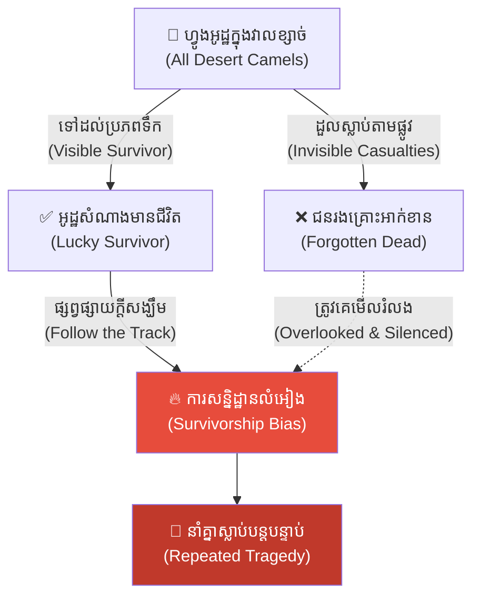
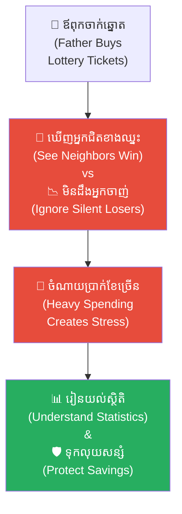
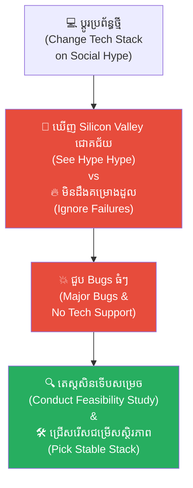
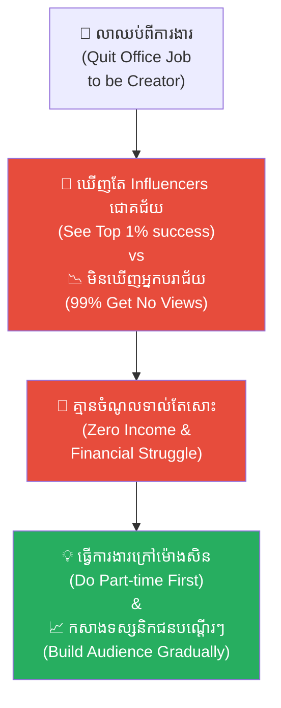
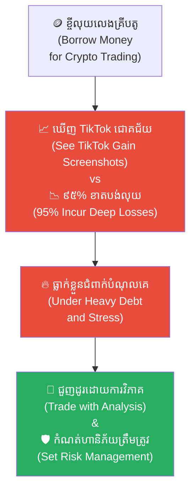
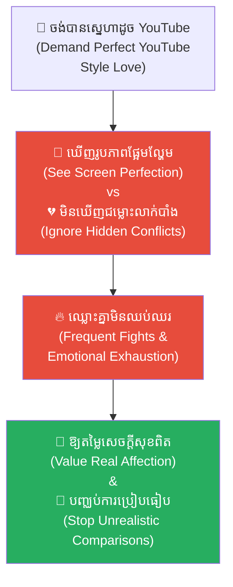
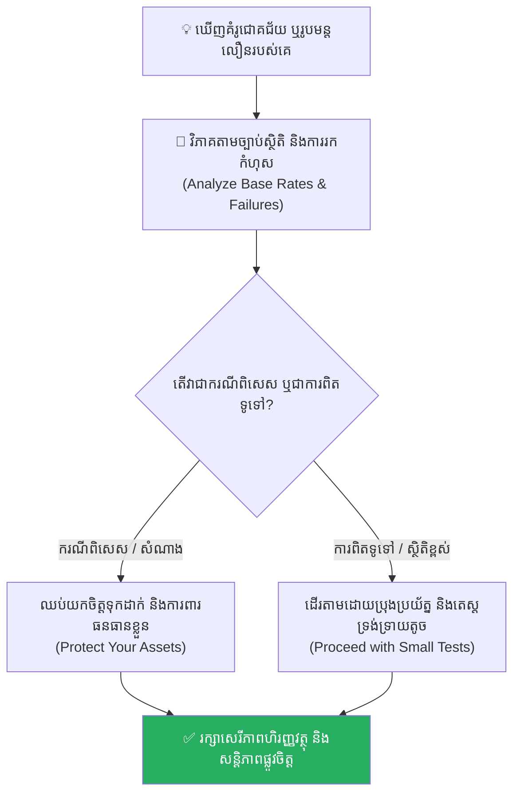

# The Camel in the Desert (អូដ្ឋ និងផ្លូវដែលយើងមើលមិនឃើញ)៖ គ្រោះថ្នាក់នៃលំអៀង Survivorship Bias និងសាកសពដែលស្ងប់ស្ងាត់ក្នុងវាលខ្សាច់

**Author:** ichamrong  
**Date:** 2026-05-17  
**Tags:** #survivorship-bias #psychology #critical-thinking #social-media #life-lessons  
**Category:** Concepts  
**Read Time:** ~15 min  

---

## 📌 មាតិកា (Table of Contents)
- [អន្ទាក់ផ្លូវចិត្ត (The Trap)](#អន្ទាក់ផ្លូវចិត្ត-the-trap)
- [១. រឿងអូដ្ឋក្នុងវាលខ្សាច់ (The Fable of the Camel in the Desert)](#1)
  - [គន្លងចាស់ និងសាកសពតាមដងផ្លូវ (The Fateful Track and Unseen Dead)](#1-1)
- [២. បញ្ហា៖ ការបោកប្រាស់នៃបណ្តាញសង្គម (The Issue: The Social Media Deception)](#2)
- [៣. ឧទាហរណ៍ជាក់ស្តែងក្នុងពិភពពិត (Real World Examples)](#3)
  - [ឧទាហរណ៍ទី ១ — កម្រិតស្រាល (គ្រួសារ)៖ ការជឿជាក់លើរឿងរ៉ាវជោគជ័យលែងល្បែង (The Lottery Winner Myth)](#3-1)
  - [ឧទាហរណ៍ទី ២ — កម្រិតមធ្យម (បច្ចេកទេស)៖ ការសម្រេចចិត្តជ្រើសរើស Tech Stack តាមបណ្តាញសង្គម (The Hype-Driven Architecture)](#3-2)
  - [ឧទាហរណ៍ទី ៣ — កម្រិតមធ្យម (ធុរកិច្ច)៖ ការលាឈប់ពីការងារដើម្បីធ្វើជា Content Creator (The Shiny Influencer Trap)](#3-3)
  - [ឧទាហរណ៍ទី ៤ — កម្រិតមធ្យម (សង្គម/គ្រប់គ្រង)៖ ការសន្មតថាការលេងគ្រីបតូជារឿងងាយស្រួល (The Crypto Millionaire Illusion)](#3-4)
  - [ឧទាហរណ៍ទី ៥ — កម្រិតធ្ងន់ (ទំនាក់ទំនង)៖ ការដេញតាមស្តង់ដារគូស្នេហ៍ល្បីៗលើ YouTube (The Perfect Relationship Vlogger)](#3-5)
- [៤. ដំណោះស្រាយទូទៅ៖ ស្ថិតិជាក់ស្តែង និងការគិតគ្រប់ជ្រុងជ្រោយ (The General Solution: Analytical completeness)](#4)
- [សេចក្តីសន្និដ្ឋាន (Conclusion)](#conclusion)
- [ឯកសារយោង (References)](#references)
- [Related Posts](#related-posts)

---

## អន្ទាក់ផ្លូវចិត្ត (The Trap)

តើអ្នកធ្លាប់មានអារម្មណ៍ថា ខ្លួនឯងកំពុងដើរយឺតជាងគេ ឬជាមនុស្សដែលបរាជ័យតែម្នាក់ឯងក្នុងសង្គម គ្រាន់តែបន្ទាប់ពីមើលឃើញមិត្តភក្តិ ឬយុវជនជោគជ័យបង្ហោះរូបភាពទិញឡាន ទិញវីឡា និងដើរលេងក្រៅប្រទេសរាល់ថ្ងៃនៅលើបណ្តាញសង្គមដែរឬទេ?

នេះគឺជា **Survivorship Bias (លំអៀងនៃការមើលឃើញតែអ្នករស់រានមានជីវិត)**។ 

ខួរក្បាលរបស់យើងងាយនឹងធ្លាក់ចូលទៅក្នុងអន្ទាក់ផ្លូវចិត្តម្យ៉ាង៖ យើងយកករណីជោគជ័យពិសេសមួយក្តាប់តូច (អូដ្ឋដែលរកឃើញទឹក) មកធ្វើជាស្តង់ដារទូទៅវាស់វែងជីវិតខ្លួនឯង ដោយមើលរំលងមនុស្សភាគច្រើនលើសលប់ (អូដ្ឋរាប់សិបក្បាលដែលដួលស្លាប់តាមផ្លូវ) ដែលបានដើរលើផ្លូវដូចគ្នា តែត្រូវបរាជ័យដោយស្ងៀមស្ងាត់។ ការយល់ច្រឡំនេះ បង្កើតជាក្តីបារម្ភ ស្រ្តេស និងការបំផ្លាញទំនុកចិត្តលើខ្លួនឯងយ៉ាងធ្ងន់ធ្ងរ។

ដើម្បីយល់ដឹងឱ្យបានគ្រប់ជ្រុងជ្រោយ នេះជាផែនទីបង្ហាញផ្លូវសម្រាប់អត្ថបទនេះ៖
1. **រឿងនិទានប្រៀបធៀប (The Allegory)** — រឿងរ៉ាវអូដ្ឋសំណាងមួយក្បាលដែលរកឃើញប្រភពទឹក និងសាកសពហ្វូងអូដ្ឋរួមដំណើរក្នុងវាលខ្សាច់។
2. **បញ្ហា (The Issue)** — យន្តការបោកប្រាស់ភ្នែករបស់បណ្តាញសង្គម និងការលាក់បាំងទិន្នន័យស្ងប់ស្ងាត់ (Silent Data)។
3. **ឧទាហរណ៍ជាក់ស្តែងក្នុងពិភពពិត (Real World Examples)** — ពិនិត្យមើលឥទ្ធិពលនេះក្នុងកម្រិតគ្រួសារ ការងារបច្ចេកទេស ធុរកិច្ច ការគ្រប់គ្រង និងទំនាក់ទំនងស្នេហា។
4. **ដំណោះស្រាយទូទៅ (The General Solution)** — ការអភិវឌ្ឍសមត្ថភាពវិភាគស្ថិតិជាក់ស្តែង និងការគិតគ្រប់ជ្រុងជ្រោយ។

---

## ១. រឿងអូដ្ឋក្នុងវាលខ្សាច់ (The Fable of the Camel in the Desert)

នៅកណ្តាលវាលខ្សាច់ដ៏ហួតហែង ក្រោមពន្លឺថ្ងៃក្តៅឆេះខ្លោច មានសត្វអូដ្ឋមួយក្បាលបានដាច់ទឹកអស់រយៈពេល ៧ ថ្ងៃពេញ។ វាបានបន្តដំណើរទៅមុខទាំងត្រដាបត្រដួស បំពង់កស្ងួតហែងចង់ប្រេះធ្លាយ ចំណែកបាតជើងវិញត្រូវដើរជាន់លើខ្សាច់ដ៏ក្តៅគគុកប្រៀបដូចជាដើរលើគំនរភ្នក់ភ្លើងចំហេះ។

នៅខណៈពេលដែលវាហៀបនឹងចុះចាញ់ និងត្រៀមបោះបង់ជីវិតទៅហើយនោះ ស្រាប់តែមានចរន្តខ្យល់មានសំណើមមួយបក់មកប៉ះរាងកាយវា ហើយបាននាំផ្លូវវាឲ្យទៅរកឃើញ **ថ្លុកទឹកតូចមួយ** ដែលលាក់ខ្លួននៅកណ្តាលអូអាស៊ីស (Oasis) ដ៏ស្ងប់ស្ងាត់។ វាបានរស់រានមានជីវិតយ៉ាងអស្ចារ្យ។

ដំណឹងនៃការរស់រានមានជីវិតនេះ បានរីករាលដាលយ៉ាងលឿនបំផុត។ ហ្វូងអូដ្ឋដទៃទៀតកាលបើបានឮរឿងនេះ ពួកវាក៏មានក្តីសង្ឃឹម និងរំភើបចិត្តជាខ្លាំង រួចនាំគ្នាដើរតាម **«គន្លងផ្លូវដែលអូដ្ឋសំណាងមួយនោះធ្លាប់បានដើរ»**។ ពួកវាជឿជាក់យ៉ាងមុតមាំថា ឲ្យតែពួកវាដើរតាមគន្លងចាស់នោះ ពួកវានឹងអាចរកឃើញប្រភពទឹកដីដ៏មានជីវិតជាក់ជាមិនខាន។

---

### គន្លងចាស់ និងសាកសពតាមដងផ្លូវ (The Fateful Track and Unseen Dead)

ប៉ុន្តែ អ្វីដែលសត្វអូដ្ឋទាំងនោះមិនធ្លាប់ដឹងសោះនោះគឺ មុនពេលដែលអូដ្ឋសំណាងមួយក្បាលនោះអាចទៅដល់ថ្លុកទឹក **សត្វអូដ្ឋរួមដំណើររាប់សិបក្បាលផ្សេងទៀត បានដួលស្លាប់ជាបន្តបន្ទាប់ដោយសារការស្រេកទឹកនៅតាមផ្លូវបាត់ទៅហើយ**។

មានតែវាដាច់គេមួយក្បាលគត់ ដែលបានរស់រានមានជីវិតមកដល់ទីនោះ ដោយសារតែកម្លាំងកាយមាំមួនជាងគេ ពេលវេលាចេញដំណើរល្អ និងសំណាងល្អអំណោយផល។ ផ្លូវដែលហ្វូងអូដ្ឋទាំងនោះកំពុងតែនាំគ្នាដើរតាម **គឺជាផ្លូវដែលត្រូវបានក្រាលគ្របដោយសាកសពរបស់អ្នករួមដំណើរមុនៗរួចទៅហើយ**។ ការដើរតាមគន្លងចាស់ដោយងងឹតងងល់ ជារឿយៗនាំពួកវាទៅរកសេចក្តីស្លាប់រង្គាលបន្ថែមទៀតប៉ុណ្ណោះ។

---

## ២. បញ្ហា៖ ការបោកប្រាស់នៃបណ្តាញសង្គម (The Issue: The Social Media Deception)

នៅក្នុងវិទ្យាសាស្ត្រចិត្តវិទ្យា បាតុភូតនេះត្រូវបានគេហៅថា **Survivorship Bias (លំអៀងនៃការមើលឃើញតែអ្នករស់រានមានជីវិត)**។

បណ្តាញសង្គមបច្ចុប្បន្នដើរតួជាកញ្ចក់ឆ្លុះដែលបំភ្លៃការពិត៖
* **ការលាក់បាំងទិន្នន័យស្ងប់ស្ងាត់ (Silent Data Selection)៖** មនុស្សរាប់លាននាក់ដែលខាតបង់លុយកាក់ បើកហាងដួលរលំ ឬធ្វើការងារត្រដររស់ គ្មានហេតុផលអ្វីត្រូវមកបង្ហោះរូបភាពបរាជ័យរបស់ពួកគេឡើយ។ ពួកគេស្ងប់ស្ងាត់ទាំងស្រុង។
* **ជំងឺ FOMO (Fear of Missing Out)៖** ការយល់ច្រឡំថា «គ្រប់គ្នាជោគជ័យ មានតែខ្ញុំដែលអន់ថយ» បង្កើតជាជំងឺបាក់ទឹកចិត្ត និងស្ត្រេសខ្លាំង។
* **ការជឿជាក់លើរូបមន្តជោគជ័យខុស៖** គិតថាការបោះបង់ការសិក្សា ឬការប្រថុយប្រថានគ្មានមូលដ្ឋាន គឺជាគន្លឹះនាំទៅរកភាពមានបាន។

---

## ៣. ឧទាហរណ៍ជាក់ស្តែងក្នុងពិភពពិត

ដើម្បីយល់ដឹងឱ្យកាន់តែស៊ីជម្រៅ ផ្លូវការសិក្សានឹងនាំអ្នកទៅពិនិត្យមើល **ឧទាហរណ៍ចំនួន ៥ កម្រិតខុសៗគ្នា** ក្នុងជីវិតរស់នៅប្រចាំថ្ងៃ៖

---

### ឧទាហរណ៍ទី ១ — កម្រិតស្រាល (គ្រួសារ)៖ ការជឿជាក់លើរឿងរ៉ាវជោគជ័យលែងល្បែង (The Lottery Winner Myth)

**ស្ថានភាព៖** ឪពុកម្នាក់ចាក់កន្ទុយលេខ ឬទិញឆ្នោតឡូតូរាល់សប្តាហ៍ ដោយចំណាយលុយកាក់មួយភាគធំនៃប្រាក់ខែ ព្រោះឃើញអ្នកជិតខាងម្នាក់ទើបតែត្រូវរង្វាន់ធំ ១ ម៉ឺនដុល្លារ។

* **ភាគី A (ឪពុក)៖** គិតថា «ឱ្យតែព្យាយាមទិញ ច្បាស់ជាត្រូវរង្វាន់ធំដូចគេដែរ» (អូដ្ឋដែលរកឃើញទឹក)។
* **ភាគី B (ការពិតស្ថិតិ)៖** មនុស្សរាប់លាននាក់ផ្សេងទៀតបានទិញឆ្នោតរាប់សិបឆ្នាំ និងខាតបង់ប្រាក់រាប់ពាន់ដុល្លារ ដោយគ្មានត្រូវរង្វាន់សូម្បីតែម្តង។ ពួកគេមិនដែលប្រកាសប្រាប់អ្នកឡើយ។

**ការពិតដ៏ជូរចត់៖**
ការដេញតាមសំណាងរបស់បុគ្គលម្នាក់ អាចនាំមកនូវវិបត្តិហិរញ្ញវត្ថុ និងភាពក្រីក្រដល់ក្រុមគ្រួសារទាំងមូល។

---

### ឧទាហរណ៍ទី ២ — កម្រិតមធ្យម (បច្ចេកទេស)៖ ការសម្រេចចិត្តជ្រើសរើស Tech Stack តាមបណ្តាញសង្គម (The Hype-Driven Architecture)

**ស្ថានភាព៖** Lead Developer ម្នាក់សម្រេចចិត្តប្តូរប្រព័ន្ធ Database របស់ក្រុមហ៊ុនទាំងមូលទៅប្រើប្រាស់បច្ចេកវិទ្យា Graph Database ឬ Blockchain ថ្មីស្រឡាង ព្រោះឃើញក្រុមហ៊ុន Tech Startup មួយនៅ Silicon Valley បង្ហោះអួតពីប្រសិទ្ធភាពជោគជ័យរបស់វា។

* **ភាគី A (Developer)៖** មើលឃើញតែករណីជោគជ័យល្បីៗ (The Survivors)។
* **ភាគី B (ការពិតគម្រោង)៖** ក្រុមហ៊ុនខាតបង់ពេលវេលារាប់ខែ ជួបប្រទះ Bugs ធំៗដែលគ្មានបច្ចេកទេសដោះស្រាយ និងគ្មានសហគមន៍គាំទ្រ ដែលធ្វើឱ្យ Project ទាំងមូលត្រូវបរាជ័យ។

**ការពិតដ៏ជូរចត់៖**
ការសម្រេចចិត្តផ្អែកលើ Hype និងព័ត៌មានមួយជ្រុង បំផ្លាញនូវស្ថិរភាពផលិតផល និងធនធានរបស់ក្រុមហ៊ុន។

---

### ឧទាហរណ៍ទី ៣ — កម្រិតមធ្យម (ធុរកិច្ច)៖ ការលាឈប់ពីការងារដើម្បីធ្វើជា Content Creator (The Shiny Influencer Trap)

**ស្ថានភាព៖** យុវជនម្នាក់សម្រេចចិត្តលាឈប់ពីការងារការិយាល័យដែលមានប្រាក់ខែសមរម្យ ដើម្បីទៅធ្វើជា Content Creator ឬ Travel Vlogger ពេញម៉ោង ព្រោះឃើញ Influencer ល្បីៗរកលុយបានរាប់ពាន់ដុល្លារ និងដើរលេងសប្បាយរាល់ថ្ងៃ។

* **ភាគី A (យុវជន)៖** មើលឃើញតែ Influencers ១% ដែលជោគជ័យឈរនៅលើកំពូល (The Oasis Camels)។
* **ភាគី B (អ្នកបរាជ័យ ៩៩%)៖** មនុស្សរាប់សែននាក់ផ្សេងទៀតបានធ្វើវីដេអូរាប់ឆ្នាំ តែគ្មានអ្នកមើល គ្មានចំណូល និងធ្លាក់ខ្លួនក្រីក្រ ដែលគ្មានព័ត៌មានណាចុះផ្សាយឡើយ។

**ការពិតដ៏ជូរចត់៖**
ការដេញតាមគន្លងផ្លូវរបស់មនុស្សពិសេសដោយគ្មានការរៀបចំផែនការជាក់ស្តែង ជារឿយៗនាំយើងទៅរកការខូចខាតអាជីពជីវិត។

---

### ឧទាហរណ៍ទី ៤ — កម្រិតមធ្យម (សង្គម/គ្រប់គ្រង)៖ ការសន្មតថាការលេងគ្រីបតូជារឿងងាយស្រួល (The Crypto Millionaire Illusion)

**ស្ថានភាព៖** និស្សិតម្នាក់ខ្ចីលុយសាលាមកជួញដូរគ្រីបតូ ឬលេងជម្រើសហិរញ្ញវត្ថុ (Forex Options) ព្រោះឃើញការបង្ហោះ Screenshot ពីចំណូល ១ ម៉ឺនដុល្លារក្នុងមួយថ្ងៃរបស់មិត្តភក្តិលើ Tik Tok។

* **ភាគី A (និស្សិត)៖** គិតថា «រឿងនេះងាយស្រួលរកលុយណាស់ មនុស្សគ្រប់គ្នាកំពុងមានបាន»។
* **ភាគី B (ការពិតទីផ្សារ)៖** អ្នកលេង ៩៥% បានបាត់បង់លុយកាក់ទាំងស្រុង និងជំពាក់បំណុលវណ្ឌក ដែលពួកគេមិនដែលយកមកបង្ហោះបង្អួតលើ Tik Tok ឡើយ។

**ការពិតដ៏ជូរចត់៖**
ការបំភាន់ភ្នែកនៃបណ្តាញសង្គម ជម្រុញឱ្យយុវជនប្រថុយប្រថាននឹងការបាត់បង់អនាគតហិរញ្ញវត្ថុផ្ទាល់ខ្លួន។

---

### ឧទាហរណ៍ទី ៥ — កម្រិតធ្ងន់ (ទំនាក់ទំនង)៖ ការដេញតាមស្តង់ដារគូស្នេហ៍ល្បីៗលើ YouTube (The Perfect Relationship Vlogger)

**ស្ថានភាព៖** ប្តីប្រពន្ធពីរនាក់មានជីវិតសាមញ្ញដ៏កក់ក្តៅ តែងតែឈ្លោះប្រកែកគ្នាព្រោះប្រពន្ធចង់ឱ្យប្តីរៀបចំ Surprise កាដូ និងទិញផ្កាឱ្យនាងរាល់សប្តាហ៍ ដូចគូស្នេហ៍ល្បីៗបង្ហោះលើ YouTube។

* **ភាគី A (ប្រពន្ធ)៖** យកជីវិតគូស្នេហ៍ YouTube មកធ្វើជាស្តង់ដារវាស់វែងសេចក្តីសុខរបស់ខ្លួន (The Survivor Illusion)។
* **ភាគី B (ប្តី)៖** មានអារម្មណ៍ហត់នឿយ និងគិតថាការខំប្រឹងប្រែងធ្វើការងាររបស់ខ្លួនគ្មានតម្លៃសោះ។ ពួកគេសម្រេចចិត្តលែងលះគ្នាភ្លាមៗ។

**ការពិតដ៏ជូរចត់៖**
គូស្នេហ៍ YouTube ទាំងនោះជារឿយៗលែងលះគ្នា ឬឈ្លោះគ្នាពេញផ្ទះ តែលាក់បាំងពីក្រោយកាមេរ៉ា។ ការដេញតាមចេកជ័រ បានបំផ្លាញស្នេហាពិតក្នុងផ្ទះរបស់ខ្លួនឯង។

---

## ៤. ដំណោះស្រាយទូទៅ៖ ស្ថិតិជាក់ស្តែង និងការគិតគ្រប់ជ្រុងជ្រោយ (The General Solution: Analytical completeness)

ដើម្បីការពារខ្លួនពីវិបត្តិ Survivorship Bias ចូរអនុវត្តក្បួនវិភាគខាងក្រោម៖

### ១. សួរសំណួរ «តើអត្រាបរាជ័យជាក់ស្តែងមានកម្រិតណា?» (Calculate Base Rates)
មុននឹងចាប់ផ្តើមគម្រោង ឬដើរតាមនរណាម្នាក់ ចូរស្វែងរក «អត្រាជោគជ័យជាមធ្យម» (Base Rate) នៅក្នុងវិស័យនោះ៖
* *តើមានហាងកាហ្វេប៉ុន្មានភាគរយដែលត្រូវបិទទ្វារក្នុងរយៈពេល ១ ឆ្នាំដំបូង? (ស្ថិតិបង្ហាញថាជាង ៨០% ត្រូវបរាជ័យ)*
* *តើមានមនុស្សប៉ុន្មាននាក់ដែលជោគជ័យតាមផ្លូវនេះពិតប្រាកដ?*

### ២. ស្វែងរក «សាកសពអូដ្ឋដែលដេកស្លាប់» (Study the Failures)
រៀនសូត្រពីកំហុសរបស់អ្នកដែលបានបរាជ័យលើផ្លូវចាស់។ ការដឹងពីកន្លែងដែលអ្នកដទៃធ្លាប់លង់ទឹក ឬដាច់ស្បៀង មានតម្លៃជាងការដឹងពីកន្លែងដែលគេទទួលបានរង្វាន់។

### ៣. អនុវត្តច្បាប់ Stoic Focus (ការស្កប់ស្កល់នឹងរបស់ខ្លួន)
ឈប់ប្រៀបធៀបជីវិតពិតប្រចាំថ្ងៃរបស់អ្នក ទៅនឹង Highlight Reel របស់គេនៅលើអ៊ីនធឺណិត។ វត្តមាន និងរបស់សាមញ្ញដែលអ្នកមាននៅក្នុងដៃ គឺជាប្រភពទឹកដ៏មានជីវជាតិបំផុតសម្រាប់ព្រលឹងរបស់អ្នក។

---

## សេចក្តីសន្និដ្ឋាន (Conclusion)

> **«ការដើរតាមគន្លងផ្លូវរបស់អូដ្ឋសំណាងដោយគ្មានការវិភាគ មិនមែនជាក្តីសង្ឃឹមឡើយ ប៉ុន្តែវាគឺជាការដើរជាន់លើគំនរសាកសពរបស់អ្នករួមដំណើរមុនៗ ដើម្បីទៅរកសេចក្តីស្លាប់ដោយខ្លួនឯង។ ចូររៀនសម្លឹងមើលវាលខ្សាច់ទាំងមូល មិនមែនមើលតែថ្លុកទឹកតូចមួយដែលគេបង្ហាញបង្អួតនោះឡើយ។»**

អូដ្ឋសំណាងរកឃើញទឹក ព្រោះតែកម្លាំង និងសំណាងពិសេស។ ចូរកុំទុកឱ្យការបំភាន់ភ្នែក Survivorship Bias មកដុតបំផ្លាញ និងចងជើងជីវិតរបស់អ្នកឡើយ។

ចូរសម្លឹងមើលសាកសពស្ងប់ស្ងាត់ក្នុងវាលខ្សាច់។

---

## ឯកសារយោង (References)

* **Taleb, N. N.** — *The Black Swan: The Impact of the Highly Improbable* (2007). ការពន្យល់ពីតួនាទីនៃភាពចៃដន្យ និងការបំភាន់នៃលំអៀងនៃការរស់រានក្នុងសង្គម។
* **Shermer, M.** — *How We Believe* (2000). យន្តការយល់ឃើញលំអៀង និងការស្វែងរកគំរូជោគជ័យរបស់ខួរក្បាលមនុស្ស។
* **World Health Organization (WHO)** — *Global Tobacco Epidemic Reports*. ស្ថិតិពិភពលោកអំពីអត្រាគ្រោះថ្នាក់ជាក់ស្តែងនៃការជក់បារី។

---

## Related Posts

* **[Survivorship Bias (លំអៀងនៃការរស់រាន)៖ គ្រោះថ្នាក់នៃជំនឿលើសត្វលោកដែលឈ្នះ និងសោកនាដកម្មនៃកងទ័ពដែលបាត់ខ្លួន](./07-survivorship-bias.md)** — Detailed WWII Aircraft analysis.
* **[The Illusion of Ease (អ្នកថាមិនដែលធ្វើ អ្នកធ្វើមិនដែលថា)៖ គ្រោះថ្នាក់នៃជំនឿ Dunning-Kruger និងភាពងាយស្រួលសិប្បនិម្មិត](./06-the-illusion-of-ease.md)** — Assumptions versus execution.
* **[The wooden tent and the palace of stone (តង់ឈើ និងប្រាសាទថ្ម)៖ គ្រោះថ្នាក់នៃការសាងសង់ប្រព័ន្ធប្រញាប់ប្រញាល់ និងមេរៀននៃការកសាងគ្រឹះរឹងមាំ](./19-the-wooden-tent-and-the-palace-of-stone.md)** — Architectural foundations.
