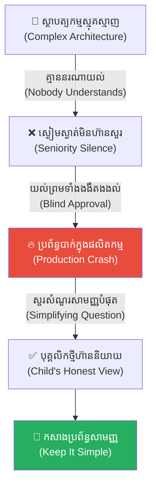
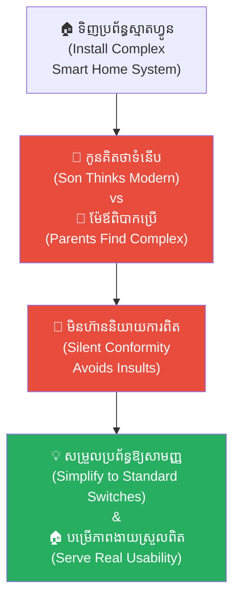
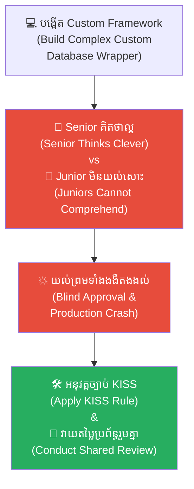
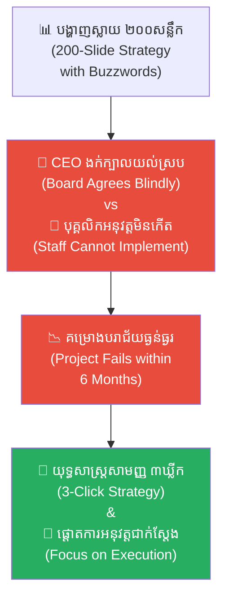
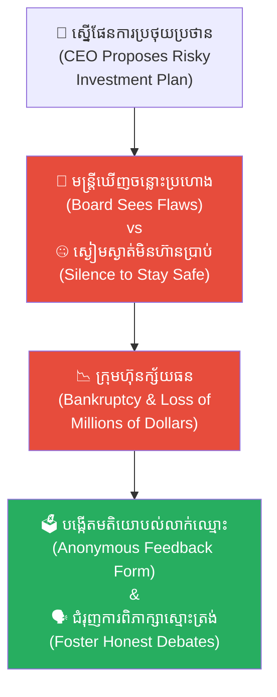
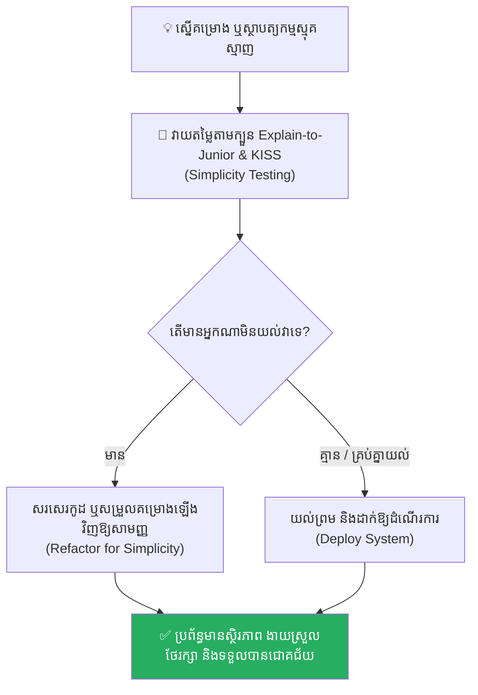

# The Emperor's New Code (អាវធំថ្មីព្រះរាជា និងកូដសិប្បនិម្មិត)៖ គ្រោះថ្នាក់នៃ Overengineering និងការស្ងៀមស្ងាត់ក្នុងក្រុមការងារ

**Author:** ichamrong  
**Date:** 2026-05-17  
**Tags:** #cargo-cult #overengineering #code-review #software-architecture #life-lessons #critical-thinking  
**Category:** Concepts  
**Read Time:** ~15 min  

---

## 📌 មាតិកា (Table of Contents)
- [អន្ទាក់ផ្លូវចិត្ត (The Trap)](#អន្ទាក់ផ្លូវចិត្ត-the-trap)
- [១. រឿងព្រេងនិទាន៖ អាវធំថ្មីរបស់ព្រះរាជា (The Classic Fable of the Emperor's New Clothes)](#1)
  - [ក្មេងប្រុសម្នាក់ក្នុងហ្វូងមនុស្ស (The Honest Child in the Crowd)](#1-1)
- [២. បញ្ហា៖ កូដថ្មីរបស់ព្រះរាជា (The Issue: The Engineering Parallel)](#2)
- [៣. ឧទាហរណ៍ជាក់ស្តែងក្នុងពិភពពិត (Real World Examples)](#3)
  - [ឧទាហរណ៍ទី ១ — កម្រិតស្រាល (គ្រួសារ)៖ ការទិញឧបករណ៍ស្មុគស្មាញដែលគ្មានអ្នកចេះប្រើ (The Over-complicated Smart Home)](#3-1)
  - [ឧទាហរណ៍ទី ២ — កម្រិតមធ្យម (បច្ចេកទេស)៖ Custom Event-Sourcing Framework របស់ Senior Dev (The In-House Framework Trap)](#3-2)
  - [ឧទាហរណ៍ទី ៣ — កម្រិតមធ្យម (ធុរកិច្ច)៖ ការបង្កើតយុទ្ធសាស្ត្រធុរកិច្ចស្មុគស្មាញរបស់ដទៃ (The McKinsey Slideshow Trap)](#3-3)
  - [ឧទាហរណ៍ទី ៤ — កម្រិតមធ្យម (សង្គម/គ្រប់គ្រង)៖ កិច្ចប្រជុំដែលគ្មានអ្នកហ៊ានសួរសំណួរ (The Silent Boardroom)](#3-4)
  - [ឧទាហរណ៍ទី ៥ — កម្រិតធ្ងន់ (ទំនាក់ទំនង)៖ ការលាក់បាំងភាពមិនចុះសម្រុងដោយសារសម្ពាធសង្គម (The Picture-Perfect Marriage)](#3-5)
- [៤. ដំណោះស្រាយទូទៅ៖ វប្បធម៌សាមញ្ញ និងការលុបបំបាត់ការសន្មត (The General Solution: KISS Principle)](#4)
- [សេចក្តីសន្និដ្ឋាន (Conclusion)](#conclusion)
- [ឯកសារយោង (References)](#references)
- [Related Posts](#related-posts)

---

## អន្ទាក់ផ្លូវចិត្ត (The Trap)

តើអ្នកធ្លាប់ធ្លាក់ចូលទៅក្នុងស្ថានភាពដែលអ្នកគ្រប់គ្នានៅក្នុងបន្ទាយការងារ សុទ្ធតែបង្ហាញការយល់ស្រប និងកោតសរសើរចំពោះគម្រោង ឬគំនិតស្មុគស្មាញមួយ ដែលការពិតទៅគ្មាននរណាម្នាក់យល់សូម្បីតែបន្តិចដែរឬទេ?

នេះគឺជា **The Emperor's New Code (អាវធំថ្មីរបស់ព្រះរាជា ឬកូដសិប្បនិម្មិត)**។ 

នៅក្នុងវប្បធម៌ការងារ និងសង្គម ជារឿយៗយើងតែងតែរងសម្ពាធពី «ឋានានុក្រម» និង «កេរ្តិ៍ឈ្មោះ»។ ពេលដែលអ្នកមានសមត្ថភាពខ្ពស់ម្នាក់បង្កើតប្រព័ន្ធដ៏ស្មុគស្មាញ និងពោរពេញដោយភាពចម្លែក (Overengineering) យើងតែងតែគិតស្មានថា « confusion របស់យើង គឺជាសញ្ញានៃភាពល្ងង់ខ្លៅផ្ទាល់ខ្លួន»។ យើងឈប់សួរ ឈប់ជំទាស់ និងបណ្តោយឱ្យប្រព័ន្ធនោះដំណើរការទៅមុខ រហូតដល់វាបុកធ្លាក់ក្នុងផលិតកម្ម (Production Crash) ទើបយើងភ្ញាក់ខ្លួនថា គ្មាននរណាម្នាក់យល់វាសូម្បីតែម្នាក់ឡើយ។

ដើម្បីយល់ដឹងឱ្យបានគ្រប់ជ្រុងជ្រោយ នេះជាផែនទីបង្ហាញផ្លូវសម្រាប់អត្ថបទនេះ៖
1. **រឿងព្រេងអឺរ៉ុបបុរាណ (The Classic Fable)** — រឿងរ៉ាវជាងកាត់ដេរល្បិចខ្ពស់ អាវធំមើលមិនឃើញ និងភាពស្មោះត្រង់របស់កុមារម្នាក់។
2. **បញ្ហា (The Issue)** — ការវិភាគការសម្រេចចិត្តក្នុងបច្ចេកវិទ្យា និងការស្ងៀមស្ងាត់ក្នុងក្រុមការងារ (Cargo Cult Engineering)។
3. **ឧទាហរណ៍ជាក់ស្តែងក្នុងពិភពពិត (Real World Examples)** — ពិនិត្យមើលឥទ្ធិពលនេះក្នុងកម្រិតគ្រួសារ ការងារបច្ចេកទេស ធុរកិច្ច ការគ្រប់គ្រង និងទំនាក់ទំនងស្នេហា។
4. **ដំណោះស្រាយទូទៅ (The General Solution)** — ការអនុវត្តយន្តការ KISS (Keep It Simple, Stupid) និងការបង្កើតការវាយតម្លៃអនាមិក។

---

## ១. រឿងព្រេងនិទាន៖ អាវធំថ្មីរបស់ព្រះរាជា (The Classic Fable of the Emperor's New Clothes)

កាលពីព្រេងនាយ មានជាងកាត់ដេរពីរនាក់បានមកដល់ព្រះរាជវាំង ហើយបានប្រកាសក្តែងៗថា ពួកគេមានសមត្ថភាពត្បាញក្រណាត់ដ៏វិសេសវិសាលបំផុតមួយ ដែលមានគុណភាពស្រាលដូចខ្យល់។ អ្វីដែលពិសេសបំផុតនោះគឺ ក្រណាត់នេះនឹង «មើលមិនឃើញ» ចំពោះបុគ្គលណាដែលគ្មានសមត្ថភាព ឬមិនសក្តិសមនឹងតំណែងរបស់ខ្លួនឡើយ។

ព្រះរាជាបានបញ្ជូនមន្ត្រីអាមាត្យជាន់ខ្ពស់ទៅពិនិត្យមើលដំណើរការត្បាញ។ មន្ត្រីគ្រប់រូបនៅពេលទៅដល់ បានឃើញតែចង្កឹងត្បាញទទេស្អាត គ្មានសរសៃអំបោះអ្វីសូម្បីតែមួយសរសៃ។ ប៉ុន្តែ គ្មាននរណាម្នាក់ហ៊ាននិយាយការពិតឡើយ ព្រោះការប្រកាសថាខ្លួនមើលមិនឃើញ ស្មើនឹងការសារភាពថាខ្លួនជាមនុស្ស «ល្ងង់ខ្លៅ និងគ្មានសមត្ថភាព»។ ពួកគេក៏បានត្រឡប់មកក្រាបទូលសរសើរក្រណាត់នោះយ៉ាងឡូយឆាយ។

ព្រះរាជាផ្ទាល់ទ្រង់យាងទៅទត ក៏ឃើញតែចង្កឹងទទេដូចគ្នា។ តែទ្រង់បានប្រកាសថាវាជាក្រណាត់ដ៏ស្រស់ស្អាតបំផុត។ លុះដល់ថ្ងៃ «កាត់រួច» ព្រះអង្គបានដោះសម្លៀកបំពាក់ទាំងអស់ និងពាក់ «អាវធំសិប្បនិម្មិត» នោះយាងក្បួនព្យហយាត្រាតាមដងផ្លូវ។

---

### ក្មេងប្រុសម្នាក់ក្នុងហ្វូងមនុស្ស (The Honest Child in the Crowd)

ប្រជាជនរាប់ពាន់នាក់ឈរមើលតាមដងផ្លូវ សុទ្ធតែយល់ស្របគ្នា និងសរសើរពីសោភ័ណភាពអាវធំរបស់ព្រះរាជា ព្រោះគ្មាននរណាចង់ឱ្យគេចោទថាខ្លួនជាមនុស្សល្ងង់ខ្លៅឡើយ។

រហូតដល់មានក្មេងប្រុសម្នាក់ — ដែលគ្មានតំណែងអ្វីត្រូវការពារ និងគ្មានគំនិតភ័យខ្លាចការកាត់ទោស — បានស្រែកខ្លាំងៗថា៖ 

> **«ប៉ុន្តែ ព្រះរាជាគ្មានពាក់អ្វីសូម្បីតែមួយដុំសោះហ្នឹង!»**

ពាក្យសម្តីដ៏សាមញ្ញរបស់កុមារម្នាក់នេះ បានធ្វើឱ្យមនុស្សគ្រប់គ្នាភ្ញាក់ខ្លួន រួចចាប់ផ្តើមខ្សឹបប្រាប់គ្នាទៅវិញទៅមក រហូតដល់ផ្ទុះជាការសើចចំអកពេញទីក្រុង។ ព្រះរាជាទ្រង់ខ្ញាល់យ៉ាងខ្លាំង តែត្រូវបង្ខំចិត្តដើរតាមក្បួនព្យហយាត្រាទាំងខ្លួនននគោកបន្តទៀត។

---

## ២. បញ្ហា៖ កូដថ្មីរបស់ព្រះរាជា (The Issue: The Engineering Parallel)

នៅក្នុងពិភពសរសេរកូដ និងបង្កើតប្រព័ន្ធ (Software Engineering) បាតុភូតនេះត្រូវបានគេហៅថា **The Emperor's New Code (កូដថ្មីរបស់ព្រះរាជា)** ឬ **Cargo Cult Engineering**។

វាកើតឡើងនៅពេល៖
* **ការរចនាប្រព័ន្ធស្មុគស្មាញហួសហេតុ (Overengineering)៖** Senior Engineer បង្កើតប្រព័ន្ធដ៏រញ៉េរញ៉ៃ (ដូចជា Custom Event-Sourcing System, Distributed Saga Pattern coordination) ព្រោះចង់បង្ហាញសមត្ថភាពដ៏ឡូយឆាយរបស់ខ្លួន។
* **សម្ពាធសង្គមក្នុង Code Review៖** Junior និង Mid-level Engineers មិនយល់កូដនោះទេ ប៉ុន្តែមិនហ៊ានសួរ ឬជំទាស់ឡើយ ព្រោះខ្លាចគេគិតថាខ្លួនអន់សមត្ថភាព។ ពួកគេសម្រេចចិត្តសម្រាលខ្លួនដោយការចុច Approve ទាំងងងឹតងងល់។
* **វប្បធម៌ស្ងៀមស្ងាត់ (Silent Review Culture)៖** ការយល់ច្រឡំថាភាពស្មុគស្មាញគឺជាភាពទំនើបទំនោរ។

---

## ៣. ឧទាហរណ៍ជាក់ស្តែងក្នុងពិភពពិត

ដើម្បីយល់ដឹងឱ្យកាន់តែស៊ីជម្រៅ ផ្លូវការសិក្សានឹងនាំអ្នកទៅពិនិត្យមើល **ឧទាហរណ៍ចំនួន ៥ កម្រិតខុសៗគ្នា** ក្នុងជីវិតរស់នៅប្រចាំថ្ងៃ៖

---

### ឧទាហរណ៍ទី ១ — កម្រិតស្រាល (គ្រួសារ)៖ ការទិញឧបករណ៍ស្មុគស្មាញដែលគ្មានអ្នកចេះប្រើ (The Over-complicated Smart Home)

**ស្ថានភាព៖** កូនប្រុសពូកែបច្ចេកវិទ្យាម្នាក់ បានដំឡើងប្រព័ន្ធស្មាតហ្វូន (Smart Home) ដ៏ស្មុគស្មាញពេញផ្ទះ ដែលតម្រូវឱ្យចុចបញ្ជា App ៣ ដំណាក់កាលទើបបើកអំពូលភ្លើងបាន។

* **ភាគី A (កូនប្រុស)៖** គិតថាប្រព័ន្ធនេះទំនើប និងមានសុវត្ថិភាពខ្ពស់បំផុត (អាវព្រះរាជា)។
* **ភាគី B (ឪពុកម្តាយចាស់ៗ)៖** មិនហ៊ាននិយាយការពិតថាពិបាកប្រើពេក ព្រោះខ្លាចកូនប្រុសបន្ទោសថា «មិនចេះអភិវឌ្ឍតាមសម័យថ្មី»។ ពួកគេសុខចិត្តរស់នៅក្នុងភាពងងឹត ឬប្រើចង្កៀងជំនួសវិញ។

**ការពិតដ៏ជូរចត់៖**
ប្រព័ន្ធដែលមិនបម្រើភាពសាមញ្ញរបស់មនុស្ស គឺជាប្រព័ន្ធដែលគ្មានតម្លៃប្រើប្រាស់ពិតប្រាកដឡើយ។

---

### ឧទាហរណ៍ទី ២ — កម្រិតមធ្យម (បច្ចេកទេស)៖ Custom Event-Sourcing Framework របស់ Senior Dev (The In-House Framework Trap)

**ស្ថានភាព៖** Lead Developer ចំណាយពេល ៦ ខែសរសេរ Custom Database Wrapper ផ្ទាល់ខ្លួនដ៏ស្មុគស្មាញ។ គ្មាននរណាម្នាក់ក្នុងក្រុមយល់វាឡើយ។

* **ភាគី A (Lead Dev)៖** គិតថាវាល្អឥតខ្ចោះ និងស័ក្តិសមសម្រាប់ក្រុមហ៊ុន។
* **ភាគី B (Junior Devs)៖** ចុច Approve ក្នុង GitHub PR ទាំងបារម្ភ។ ពេល Lead Dev លាឈប់ពីការងារ ប្រព័ន្ធជួបប្រទះការដួលរលំ ហើយគ្មានសមាជិកណាម្នាក់ក្នុងក្រុមមានសមត្ថភាពជួសជុលបានឡើយ បណ្តាលឱ្យគម្រោងត្រូវបោះបង់ចោល។

**ការពិតដ៏ជូរចត់៖**
កូដដែលល្អបំផុត មិនមែនជាកូដដែលឆ្លាតវៃបំផុតនោះទេ ប៉ុន្តែវាជាកូដដែលងាយស្រួលយល់ និងងាយស្រួលថែរក្សាបំផុត (Maintainable Code)។

---

### ឧទាហរណ៍ទី ៣ — កម្រិតមធ្យម (ធុរកិច្ច)៖ ការបង្កើតយុទ្ធសាស្ត្រធុរកិច្ចស្មុគស្មាញរបស់ដទៃ (The McKinsey Slideshow Trap)

**ស្ថានភាព៖** ក្រុមហ៊ុនប្រឹក្សាយោបល់ធំមួយ បានបង្ហាញស្លាយយុទ្ធសាស្ត្រ (Slideshow) ចំនួន ២០០ សន្លឹក ដែលពោរពេញដោយពាក្យបច្ចេកទេសស្មុគស្មាញ (Buzzwords) និងក្រាហ្វិកញ៉ីញ៉ៃដល់ក្រុមប្រឹក្សាភិបាល។

* **ភាគី A (Board of Directors)៖** គ្មាននរណាម្នាក់យល់ពីយុទ្ធសាស្ត្រជាក់ស្តែងឡើយ តែគ្រប់គ្នាងក់ក្បាលយល់ស្របព្រោះតម្លៃប្រឹក្សាយោបល់រាប់សែនដុល្លារ។
* **ភាគី B (ការពិតអាជីវកម្ម)៖** គម្រោងការងារត្រូវបរាជ័យក្នុងរយៈពេល ៦ ខែ ព្រោះបុគ្គលិកថ្នាក់ក្រោមមិនអាចយកទៅអនុវត្តបាន។

**ការពិតដ៏ជូរចត់៖**
យុទ្ធសាស្ត្រដែលមិនអាចពន្យល់ឱ្យយល់បានក្នុងប្រយោគសាមញ្ញ ៣ ឃ្លីក គឺជាយុទ្ធសាស្ត្រដែលគ្មានប្រយោជន៍។

---

### ឧទាហរណ៍ទី ៤ — កម្រិតមធ្យម (សង្គម/គ្រប់គ្រង)៖ កិច្ចប្រជុំដែលគ្មានអ្នកហ៊ានសួរសំណួរ (The Silent Boardroom)

**ស្ថានភាព៖** CEO បង្ហាញផែនការបោះទុនថ្មីដ៏ប្រថុយប្រថានខ្លាំងនៅក្នុងកិច្ចប្រជុំ។ មន្ត្រីជាន់ខ្ពស់ទាំងអស់មើលឃើញចន្លោះប្រហោងធំ តែរក្សាភាពស្ងៀមស្ងាត់ ព្រោះគ្មាននរណាចង់ក្លាយជា «អ្នកបំផ្លាញទឹកចិត្តប្រធាន»។

* **ភាគី A (CEO)៖** គិតថាការស្ងៀមស្ងាត់គឺជាការគាំទ្រ ១០០% ពីគ្រប់គ្នា។
* **ភាគី B (ក្រុមហ៊ុន)៖** គម្រោងត្រូវក្ស័យធន និងខាតបង់លុយរាប់លានដុល្លារ។

**ការពិតដ៏ជូរចត់៖**
ភាពស្ងៀមស្ងាត់ដើម្បីការពារសុវត្ថិភាពផ្ទាល់ខ្លួន គឺជាការសម្លាប់ស្ថាប័នរួមដោយប្រយោល។

---

### ឧទាហរណ៍ទី ៥ — កម្រិតធ្ងន់ (ទំនាក់ទំនង)៖ ការលាក់បាំងភាពមិនចុះសម្រុងដោយសារសម្ពាធសង្គម (The Picture-Perfect Marriage)

**ស្ថានភាព៖** ប្តីប្រពន្ធពីរបីនាក់មានជម្លោះរកាំរកូសជិតលែងលះគ្នា តែព្យាយាមបង្ហោះរូបភាពផ្អែមល្ហែម និងក្តីសុខរាល់ថ្ងៃលើ Facebook ព្រោះចង់ឱ្យសាច់ញាតិ និងសង្គមយល់ថាអាពាហ៍ពិពាហ៍របស់ពួកគេឥតខ្ចោះ។

* **ភាគី A (ប្តីប្រពន្ធ)៖** រស់នៅក្រោមសម្ពាធ «អាវធំរបស់ព្រះរាជា»។
* **ភាគី B (សុខភាពផ្លូវចិត្ត)៖** ពួកគេកើតមានជំងឺបាក់ទឹកចិត្ត និងស្ត្រេសខ្លាំង រហូតដល់ថ្ងៃមួយដែលទំនាក់ទំនងផ្ទុះឡើងជាជម្លោះដ៏កាចសាហាវ និងការលែងលះគ្នាដោយភាពជូរចត់បំផុត។

**ការពិតដ៏ជូរចត់៖**
ការដេញតាមការវាយតម្លៃរបស់សង្គម ដោយបដិសេធមិនព្រមដោះស្រាយបញ្ហាពិតប្រាកដ បំផ្លាញនូវសេចក្តីសុខក្នុងជីវិតរស់នៅ។

---

## ៤. ដំណោះស្រាយទូទៅ៖ វប្បធម៌សាមញ្ញ និងការលុបបំបាត់ការសន្មត (The General Solution: KISS Principle)

ដើម្បីការពារក្រុមការងារ ឬខ្លួនឯងពីការធ្លាក់ចូលទៅក្នុងអន្ទាក់ The Emperor's New Code ចូរអនុវត្តជំហានគន្លឹះទាំងនេះ៖

### ១. អនុវត្តច្បាប់ KISS (Keep It Simple, Stupid)
ចងចាំថា ភាពសាមញ្ញគឺជាកម្រិតខ្ពស់បំផុតនៃភាពទំនើប (Simplicity is the ultimate sophistication)។ ប្រសិនបើប្រព័ន្ធ ឬគំនិតណាមួយស្មុគស្មាញពេក ត្រូវសួរសំណួរថា៖ *«តើមានវិធីណាដែលអាចធ្វើវាឱ្យសាមញ្ញជាងនេះដែរឬទេ?»*។

### ២. បង្កើតវប្បធម៌ "Explain to a Junior"
មុននឹងយល់ព្រមលើគម្រោង ឬស្ថាបត្យកម្មធំ ត្រូវឱ្យអ្នករចនាប្រព័ន្ធពន្យល់វាឱ្យ Junior Engineer ឬអ្នកក្រៅយល់ដឹងច្បាស់។ ប្រសិនបើ Junior មិនយល់ មានន័យថាប្រព័ន្ធនោះមានភាពស្មុគស្មាញហួសហេតុ និងត្រូវតែកែលម្អឡើងវិញ។

### ៣. បង្កើតការវាយតម្លៃអនាមិក (Anonymous Architecture Review)
ដើម្បីកម្ចាត់សម្ពាធឋានានុក្រម ត្រូវអនុញ្ញាតឱ្យសមាជិកដាក់បញ្ជូនសំណួរ ទុកកង្វល់ ឬការរិះគន់ដោយលាក់ឈ្មោះ (Anonymous Feedback Form) មុនពេលបើកកិច្ចប្រជុំសម្រេចចិត្តធំៗ។

---

## សេចក្តីសន្និដ្ឋាន (Conclusion)

> **«ក្មេងប្រុសនៅក្នុងហ្វូងមនុស្ស មិនមែនជាអ្នកដែលល្ងង់ខ្លៅនោះឡើយ។ ប៉ុន្តែគាត់គឺជាបុគ្គលតែម្នាក់គត់ដែលមានសតិរឹងមាំ និងមានភាពក្លាហានក្នុងការនិយាយការពិតសាមញ្ញបំផុត។ ភាពជាអ្នកដឹកនាំដ៏ឆ្លាតវៃ គឺការកសាងក្រុមការងារដែលមនុស្សគ្រប់គ្នាមានសិទ្ធិក្លាយជាក្មេងប្រុសម្នាក់នោះ។»**

ព្រះរាជាត្រូវដើរននគោក ព្រោះតែការស្ងៀមស្ងាត់របស់សេនាអាមាត្យ។ ចូរកុំទុកឱ្យប្រព័ន្ធ និងការងាររបស់អ្នកត្រូវដួលរលំដោយសារតែកូដសិប្បនិម្មិត និងសម្ពាធសង្គមឡើយ។

ចូររក្សាភាពសាមញ្ញ និងភាពស្មោះត្រង់ក្នុងការងាររបស់អ្នក។

---

## ឯកសារយោង (References)

* **Andersen, H. C.** — *The Emperor's New Clothes* (1837). រឿងនិទានអក្សរសិល្ប៍ដំបូងបង្អស់។
* **Fowler, M.** — *Refactoring: Improving the Design of Existing Code* (1999). មូលដ្ឋានគ្រឹះនៃការលុបបំបាត់ Code Smells និងភាពស្មុគស្មាញហួសហេតុ។
* **Brooks, F. P.** — *The Mythical Man-Month* (1975). ការវិភាគលើស្ថាបត្យកម្ម និងបញ្ហាទំនាក់ទំនងក្នុងវិស្វកម្មសូហ្វវែរ។

---

## Related Posts

* **[Survivorship Bias (លំអៀងនៃការរស់រាន)៖ គ្រោះថ្នាក់នៃជំនឿលើសត្វលោកដែលឈ្នះ និងសោកនាដកម្មនៃកងទ័ពដែលបាត់ខ្លួន](./07-survivorship-bias.md)** — Analysis of false statistical metrics.
* **[The Illusion of Ease (អ្នកថាមិនដែលធ្វើ អ្នកធ្វើមិនដែលថា)៖ គ្រោះថ្នាក់នៃជំនឿ Dunning-Kruger និងភាពងាយស្រួលសិប្បនិម្មិត](./06-the-illusion-of-ease.md)** — Overconfidence and paper strategy.
* **[The wooden tent and the palace of stone (តង់ឈើ និងប្រាសាទថ្ម)៖ គ្រោះថ្នាក់នៃការសាងសង់ប្រព័ន្ធប្រញាប់ប្រញាល់ និងមេរៀននៃការកសាងគ្រឹះរឹងមាំ](./19-the-wooden-tent-and-the-palace-of-stone.md)** — Structural foundations versus rapid illusions.
