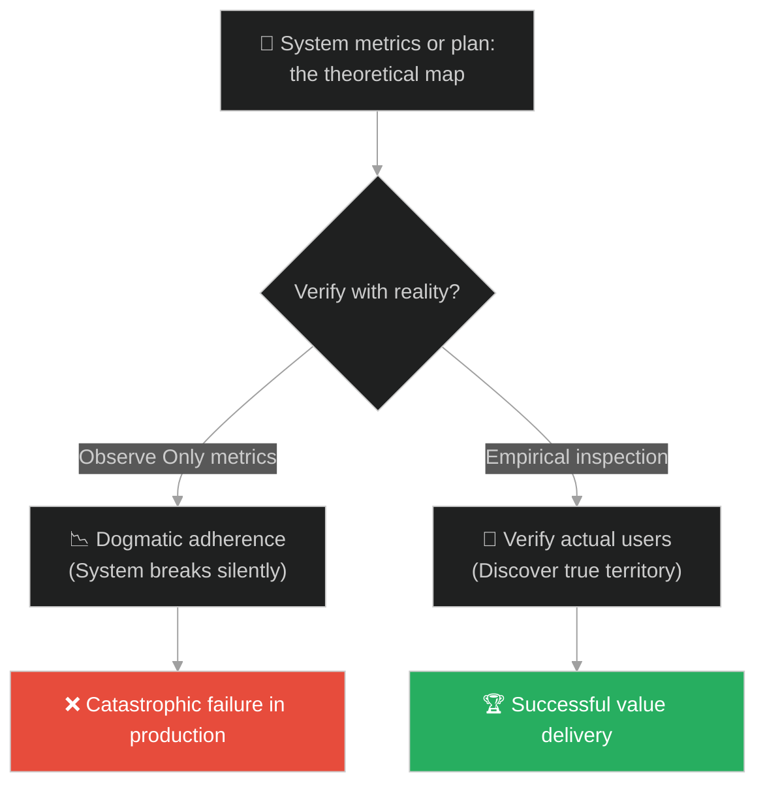
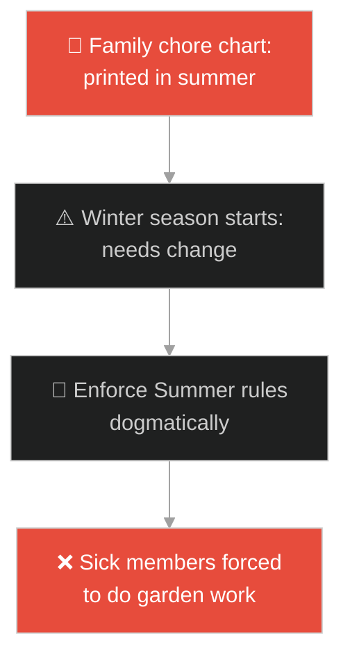
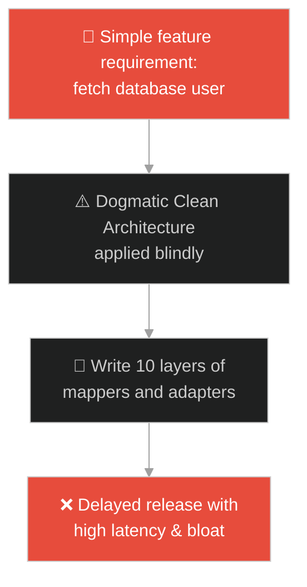
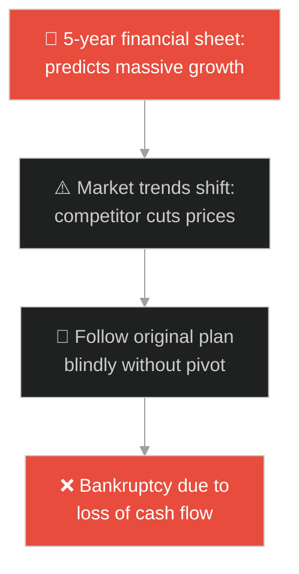
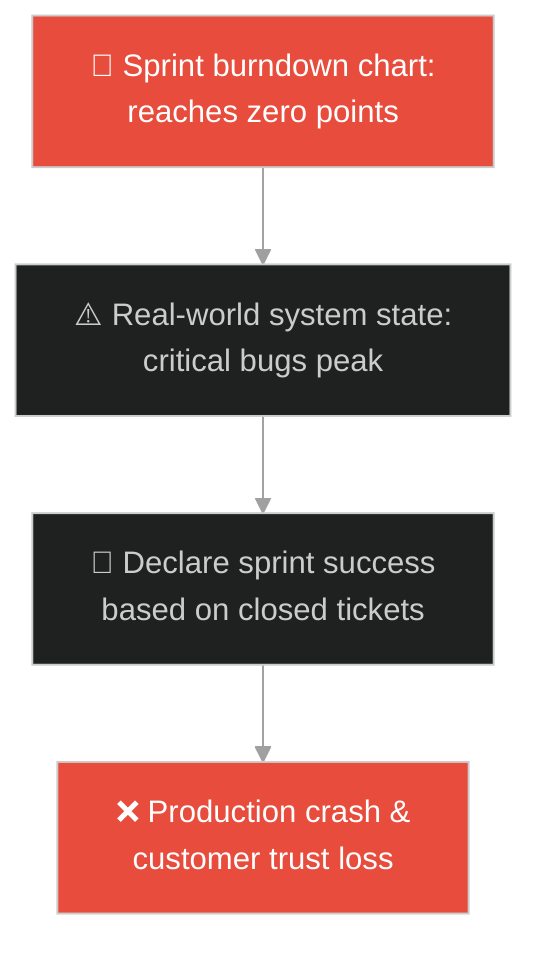
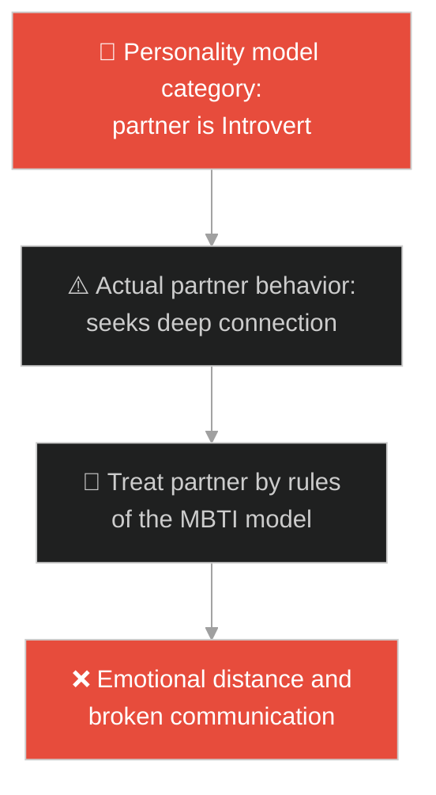
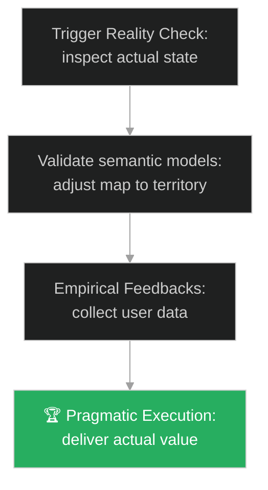

# Map vs Territory (ផែនទី និងទឹកដីជាក់ស្តែង)៖ ម្រាមដៃចង្អុលព្រះច័ន្ទ (Map vs Territory & The Finger Pointing at the Moon)

**Author:** ichamrong  
**Date:** 2026-05-28  
**Tags:** #buddhism #map-vs-territory #semantics #mental-models #dogmatism  
**Category:** Concepts / Parables  
**Read Time:** ~15 min  

---

## 📌 មាតិកា (Table of Contents)
- [អន្ទាក់ផ្លូវចិត្ត (The Trap)](#0)
- [១. រឿងព្រេងព្រះពុទ្ធសាសនា៖ ម្រាមដៃចង្អុលព្រះច័ន្ទ (The Legend of the Finger and the Moon)](#1)
  - [ការយល់ច្រឡំរវាងម្រាមដៃ និងព្រះច័ន្ទ (Confusing the Pointer with the Destination)](#1-1)
- [២. បញ្ហា៖ ការប្រកាន់ខ្ជាប់គំរូទ្រឹស្តី និងការមើលរំលងទឹកដីពិត (The Issue: Reification Fallacy and Dogmatic Adherence to Semantic Models)](#2)
- [៣. ឧទាហមណ៍ជាក់ស្តែងក្នុងពិភពពិត (Real World Examples)](#3)
  - [ឧទាហរណ៍ទី ១ — កម្រិតស្រាល (គ្រួសារ)៖ ការអនុវត្តតារាងការងារផ្ទះយ៉ាងតឹងរ៉ឹង (Rigid House Rules Chore Chart)](#3-1)
  - [ឧទាហរណ៍ទី ២ — កម្រិតមធ្យម (បច្ចេកទេស)៖ ការបង្កើតកូដតាមលំនាំស្ថាបត្យកម្មហួសហេតុ (Over-Engineering Architectural Boilerplate)](#3-2)
  - [ឧទាហរណ៍ទី ៣ — កម្រិតមធ្យម (ធុរកិច្ច)៖ ការប្រកាន់យកផែនការហិរញ្ញវត្ថុជាការពិត (Treating Financial Projections as Cash Reality)](#3-3)
  - [ឧទាហរណ៍ទី ៤ — កម្រិតមធ្យម (សង្គម/គ្រប់គ្រង)៖ ការគ្រប់គ្រងតាមរយៈសូចនាករល្បឿនសំបុត្រ (Agile Velocity Metrics vs Value Delivery)](#3-4)
  - [ឧទាហរណ៍ទី ៥ — កម្រិតធ្ងន់ (ទំនាក់ទំនង)៖ ការវាយតម្លៃដៃគូតាមប្រភេទអត្តចរិត MBTI (Categorizing Partners by Personality Models)](#3-5)
- [៤. ដំណោះស្រាយទូទៅ៖ ការបំបែកគំរូចេញពីសេចក្តីពិតជាក់ស្តែង (The General Solution: Semantic Debugging and Empirical Verification Loops)](#4)
- [សេចក្តីសន្និដ្ឋាន (Conclusion)](#5)
- [ឯកសារយោង (References)](#6)
- [Related Posts](#7)

---

<a id="0"></a>
## អន្ទាក់ផ្លូវចិត្ត (The Trap)

តើអ្នកធ្លាប់ជួបស្ថានភាពដែលក្រុមការងារ ឬខ្លួនអ្នកផ្ទាល់ ផ្តោតអារម្មណ៍តែលើការវាស់វែងតាមរយៈរបាយការណ៍ គំនូសប្លង់ ផែនការការងារ ឬសន្ទស្សន៍ល្បឿន (Metrics) រហូតមើលរំលងសេចក្តីពិតជាក់ស្តែងដែលកំពុងកើតមានចំពោះមុខដែរឬទេ?

នៅក្នុងស្ថានភាពស្មុគស្មាញ៖
* **យើងងាយនឹងធ្លាក់ក្នុងអន្ទាក់** នៃការយកគំរូសន្មត ឬ "ផែនទី" (The Map) ទៅជំនួសឱ្យ "ទឹកដីពិត" (The Territory) ដោយជឿថា ប្រសិនបើផែនទីបង្ហាញថាត្រឹមត្រូវ នោះអ្វីៗគឺល្អប្រសើរហើយ ទោះបីជាការពិតកំពុងដួលរលំក៏ដោយ (Reification Fallacy)។
* **យើងមើលរំលង** ការសង្កេត និងការវាស់វែងដោយផ្ទាល់លើលទ្ធផលជាក់ស្តែង ព្រោះយើងជាប់ជំពាក់នឹងការរៀបចំ និងការរាំតាមការណែនាំរបស់គំរូទ្រឹស្តី ឬច្បាប់ក្រមនីតិវិធី។

ការយល់ច្រឡំរវាងឧបករណ៍ចង្អុលបង្ហាញ និងសេចក្តីពិតជាក់ស្តែង ហៅថា **អន្ទាក់ម្រាមដៃចង្អុលព្រះច័ន្ទ (The Pointer-Reality Confused Trap)**។

ដើម្បីយល់ដឹងពីរបៀបញែកគំរូសន្មតចេញពីការពិត នេះជាផែនទីបង្ហាញផ្លូវ៖
1. **រឿងព្រេងនិទាន (The Legend)** — រឿងរ៉ាវរបស់ព្រះពុទ្ធដែលចង្អុលទៅកាន់ព្រះច័ន្ទ ដើម្បីដាស់តឿនភិក្ខុសង្ឃកុំឱ្យជាប់ជំពាក់នឹងម្រាមដៃរបស់ព្រះអង្គ។
2. **បញ្ហា (The Issue)** — ការវិភាគទស្សនវិជ្ជានៃគំនិត "The Map is Not the Territory" និងផលប៉ះពាល់នៃការប្រកាន់ខ្ជាប់គំរូក្នុងវិស្វកម្ម។
3. **ឧទាហមណ៍ជាក់ស្តែងក្នុងពិភពពិត (Real World Examples)** — ពិនិត្យមើលបញ្ហានេះក្នុងកម្រិតគ្រួសារ បច្ចេកវិទ្យា ធុរកិច្ច ការគ្រប់គ្រង និងទំនាក់ទំនង។
4. **ដំណោះស្រាយទូទៅ (The General Solution)** — ការអនុវត្តយន្តការត្រួតពិនិត្យដោយផ្អែកលើទិន្នន័យពិត (Empirical Feedback Loops) និងការបន្ទន់ខ្លួនតាមស្ថានភាព។



---

<a id="1"></a>
## ១. រឿងព្រេងព្រះពុទ្ធសាសនា៖ ម្រាមដៃចង្អុលព្រះច័ន្ទ (The Legend of the Finger and the Moon)

មានយប់មួយ ព្រះសម្មាសម្ពុទ្ធបានគង់អង្គុយនៅក្រោមពន្លឺព្រះច័ន្ទដ៏ថ្លាឆ្វង់ជាមួយភិក្ខុសង្ឃទាំងឡាយ។ ព្រះអង្គទ្រង់បានលើកម្រាមដៃចង្អុលទៅកាន់ព្រះច័ន្ទដ៏ភ្លឺស្វាងនៅលើមេឃ ហើយមានបន្ទូលថា៖

> *«ម្នាលភិក្ខុទាំងឡាយ ធម៌ និងការប្រដៅរបស់តថាគត គឺប្រៀបដូចជាម្រាមដៃនេះឯង ដែលកំពុងចង្អុលបង្ហាញផ្លូវទៅកាន់ព្រះច័ន្ទ (សេចក្តីពិតនៃការត្រាស់ដឹង)។»*

---

<a id="1-1"></a>
### ការយល់ច្រឡំរវាងម្រាមដៃ និងព្រះច័ន្ទ (Confusing the Pointer with the Destination)

ព្រះពុទ្ធបានពន្យល់ដាស់តឿនបន្ថែមទៀតថា៖
* *«ប៉ុន្តែ អ្នកត្រូវដឹងថា ម្រាមដៃនេះមិនមែនជាព្រះច័ន្ទឡើយ។ ប្រសិនបើអ្នកគ្រាន់តែសម្លឹងមើលម្រាមដៃរបស់តថាគត នោះអ្នកនឹងមិនអាចមើលឃើញភាពស្រស់ស្អាត និងពន្លឺដ៏ត្រចះត្រចង់នៃព្រះច័ន្ទនោះឡើយ។»*
* *«មនុស្សខ្លះ ភ្លេចមើលព្រះច័ន្ទ តែបែរជាយកម្រាមដៃរបស់តថាគតទៅសូត្រធម៌ ទៅគោរពបូជា និងយកទៅឈ្លោះប្រកែកគ្នា ថាតើម្រាមដៃនេះមានរាងបែបណា វែងឬខ្លី មានពណ៌អ្វី ទៅវិញ។»*
* ការប្រកាន់ខ្ជាប់តែលើពាក្យពេចន៍ ទ្រឹស្តី ឬអក្សរសាស្ត្រ (Dogma) ធ្វើឱ្យយើងបាត់បង់សេចក្តីពិតជាក់ស្តែងដែលទ្រឹស្តីនោះចង់ចង្អុលបង្ហាញ។

---

<a id="2"></a>
## ២. បញ្ហា៖ ការប្រកាន់ខ្ជាប់គំរូទ្រឹស្តី និងការមើលរំលងទឹកដីពិត (The Issue: Reification Fallacy and Dogmatic Adherence to Semantic Models)

នៅក្នុងវិស្វកម្មកម្មវិធី បញ្ហាដ៏ធំបំផុតគឺការយក "គំរូស្ថាបត្យកម្ម" ឬ "សៀវភៅគោលការណ៍" មកសម្រេចជំនួសឱ្យការពិនិត្យមើលភាពចាំបាច់ជាក់ស្តែង។ ឧទាហរណ៍ ការសរសេរកូដរញ៉េរញ៉ៃ បង្កើត Interface និង Mapper រាប់សិបស្រទាប់ គ្រាន់តែដើម្បីដំណើរការ Query ទិន្នន័យ ៥ បន្ទាត់៖

```java
// ការបង្កើតស្រទាប់កូដស្មុគស្មាញហួសហេតុដោយសារការប្រកាន់ស្ថាបត្យកម្ម dogmatically
public class UserArchitectureMap {
    public interface UserPresenter { String show(); }
    public interface UserUseCase { String execute(); }
    public interface UserRepository { String fetch(); }

    public class ConfusedManager implements UserPresenter {
        private final UserUseCase useCase;
        public ConfusedManager(UserUseCase uc) { this.useCase = uc; }
        public String show() { return useCase.execute(); }
    }
    
    // បង្កើត Class និង Interface រាប់សិបដើម្បីគ្រាន់តែបង្ហាញអក្សរ "Hello" 
    public String getUsername() {
        return "Confused by the map instead of just returning the string.";
    }
}
```

* **ការធ្លាក់ក្នុងអន្ទាក់រង្វាស់ (Goodhart's Law)៖** នៅពេលរង្វាស់មួយក្លាយជាគោលដៅ វានឹងឈប់ជារង្វាស់ដ៏ល្អទៀតហើយ។ ឧទាហរណ៍ ក្រុមការងារផ្តោតលើការសរសេរ Unit Test Coverage ឱ្យបាន ១០០% (ម្រាមដៃ) ដោយការសរសេរ test គ្មានប្រយោជន៍ រហូតធ្វើឱ្យ Logic ពិតប្រាកដក្នុង Production មាន bug ធ្ងន់ធ្ងរ (ព្រះច័ន្ទ)។
* **ភាពលម្អៀងខាងទ្រឹស្តី (Dogmatic Template Fetishism)៖** ការអនុវត្ត Agile/Scrum យ៉ាងតឹងរ៉ឹងតាមសៀវភៅ តែប្រព័ន្ធមិនដំណើរការ និងមិនអាចបញ្ចេញផលិតផលជូនអតិថិជនបាន។

---

<a id="3"></a>
## ៣. ឧទាហមណ៍ជាក់ស្តែងក្នុងពិភពពិត

---

<a id="3-1"></a>
### ឧទាហរណ៍ទី ១ — កម្រិតស្រាល (គ្រួសារ)៖ ការអនុវត្តតារាងការងារផ្ទះយ៉ាងតឹងរ៉ឹង (Rigid House Rules Chore Chart)

គ្រួសារមួយបានបង្កើតតារាងការងារផ្ទះយ៉ាងលម្អិតបិទលើទូទឹកកក (ផែនទី)។ ទោះជាយ៉ាងណា នៅពេលសមាជិកម្នាក់ធ្លាក់ខ្លួនឈឺធ្ងន់ ម្តាយនៅតែបង្ខំឱ្យកូននោះក្រោកមកជូតផ្ទះតាមតារាងការងារដដែល (ប្រកាន់ខ្ជាប់ម្រាមដៃ) ដែលនាំឱ្យមានជម្លោះ និងភាពរកាំរកូសក្នុងផ្ទះ ជំនួសឱ្យការបត់បែនតាមស្ថានភាពជាក់ស្តែង។



---

<a id="3-2"></a>
### ឧទាហរណ៍ទី ២ — កម្រិតមធ្យម (បច្ចេកទេស)៖ ការបង្កើតកូដតាមលំនាំស្ថាបត្យកម្មហួសហេតុ (Over-Engineering Architectural Boilerplate)

អ្នកអភិវឌ្ឍន៍ម្នាក់ចង់សរសេរមុខងារសម្រាប់តែបញ្ជូនទិន្នន័យអក្សរធម្មតា។ ប៉ុន្តែដោយសារប្រកាន់ខ្ជាប់គំរូ "Clean Architecture" ហួសហេតុ គាត់បានបង្កើតកូដដល់ទៅ ១០ ស្រទាប់ (DTO, Mapper, Use Case, Presenter, Controller, Domain Model) (ផែនទី) ដែលធ្វើឱ្យកូដពិបាកកែសម្រួល បង្កើតភាពយឺតយ៉ាវ និងពិបាកយល់សម្រាប់អ្នករួមក្រុមដទៃ។



---

<a id="3-3"></a>
### ឧទាហរណ៍ទី ៣ — កម្រិតមធ្យម (ធុរកិច្ច)៖ ការប្រកាន់យកផែនការហិរញ្ញវត្ថុជាការពិត (Treating Financial Projections as Cash Reality)

ស្ថាបនិកក្រុមហ៊ុនមួយបានបង្កើតគំរូហិរញ្ញវត្ថុលើ Excel ដ៏ល្អឥតខ្ចោះ ដែលបង្ហាញថាក្រុមហ៊ុននឹងទទួលបានចំណេញខ្ពស់នៅខែទី ៦ (ផែនទី)។ ផ្អែកលើតួលេខស្មាននេះ ពួកគេបានជួលបុគ្គលិកបន្ថែមជាច្រើន ទោះបីជាសាច់ប្រាក់ពិតប្រាកដក្នុងធនាគារកំពុងធ្លាក់ចុះ និងគ្មានអតិថិជនទិញក៏ដោយ ដែលបណ្តាលឱ្យក្រុមហ៊ុនក្ស័យធនមុនខែទី ៦ ចូលមកដល់។



---

<a id="3-4"></a>
### ឧទាហរណ៍ទី ៤ — កម្រិតមធ្យម (សង្គម/គ្រប់គ្រង)៖ ការគ្រប់គ្រងតាមរយៈសូចនាករល្បឿនសំបុត្រ (Agile Velocity Metrics vs Value Delivery)

ប្រធានគម្រោងម្នាក់រីករាយយ៉ាងខ្លាំង ព្រោះតារាង Burndown Chart បង្ហាញថាក្រុមការងារដោះស្រាយសំបុត្រការងារ (Jira Tickets) បានទាំងស្រុង ១០០% តាមផែនការ (ផែនទី)។ ទោះជាយ៉ាងណា នៅក្នុងពិភពពិត អតិថិជនកំពុងខឹងសម្បារ និងទូរស័ព្ទមកជេរព្រោះផលិតផលគាំងប្រើមិនកើត ដោយសារតែក្រុមការងារប្រញាប់បិទសំបុត្រទាំងគ្មានគុណភាព ដើម្បីតែបំពេញសូចនាករល្បឿនរបស់ប្រធាន។



---

<a id="3-5"></a>
### ឧទាហរណ៍ទី ៥ — កម្រិតធ្ងន់ (ទំនាក់ទំនង)៖ ការវាយតម្លៃដៃគូតាមប្រភេទអត្តចរិត MBTI (Categorizing Partners by Personality Models)

មនុស្សម្នាក់បានប្រើប្រាស់ប្រព័ន្ធវាស់អត្តចរិត MBTI ដើម្បីវិភាគគូស្នេហ៍របស់ខ្លួន។ គាត់បានសន្និដ្ឋានថា ដៃគូរបស់គាត់ជាប្រភេទ "Introvert" ដែលមិនចង់និយាយច្រើន (ផែនទី)។ នៅពេលដៃគូព្យាយាមចង់ជជែកបញ្ហាផ្លូវចិត្តយ៉ាងស៊ីជម្រៅ គាត់បានច្រានចោល និងប្រាប់ឱ្យទៅសម្រាក ព្រោះជឿតាមសៀវភៅ MBTI ថាដៃគូត្រូវការភាពឯកោ ដែលនាំឱ្យទំនាក់ទំនងនោះត្រូវកាត់ផ្តាច់ និងបែកបាក់។



---

<a id="4"></a>
## ៤. ដំណោះស្រាយទូទៅ៖ ការបំបែកគំរូចេញពីសេចក្តីពិតជាក់ស្តែង (The General Solution: Semantic Debugging and Empirical Verification Loops)

ដើម្បីដោះស្រាយបញ្ហានៃការជាប់ជំពាក់នឹងផែនទី យើងត្រូវអនុវត្តប្រព័ន្ធផ្ទៀងផ្ទាត់ដោយផ្អែកលើទិន្នន័យជាក់ស្តែង និងការបន្ទន់ខ្លួន៖



* **ការអនុវត្តគោលការណ៍ "Working Software over Comprehensive Documentation"៖** កុំចំណាយពេលរៀបចំឯកសារ ឬការសរសេរ spec ឱ្យល្អឥតខ្ចោះមុននឹងចាប់ផ្តើម។ ត្រូវបង្កើត Minimum Viable Product (MVP) រួចបញ្ជូនវាទៅឱ្យអតិថិជនពិតប្រាកដសាកល្បងប្រើ ដើម្បីទទួលបានមតិត្រឡប់មកវិញភ្លាមៗ។
* **ការបង្កើត "Reality Testing" ក្នុងគ្រប់ការសម្រេចចិត្ត៖** រាល់ពេលដែលអ្នកមើលតួលេខរបាយការណ៍ ឬ Dashboard ចូរចុះទៅពិនិត្យដោយផ្ទាល់ភ្នែកជាមួយអ្នកប្រើប្រាស់ ឬវិស្វករដែលកំពុងធ្វើការងារនោះ (Genchi Genbutsu របស់តូយ៉ូតា)។
* **ការបន្ទន់ខ្លួនតាមស្ថានភាពជាក់ស្តែង (Adaptive Modeling)៖** ចូរចងចាំថា គ្រប់គំរូទាំងអស់គឺខុស (All models are wrong) ប៉ុន្តែមានគំរូខ្លះមានប្រយោជន៍។ កុំយកគំរូទ្រឹស្តីមកធ្វើជាគុកឃុំឃាំងសេរីភាពនៃការគិត និងការសម្រេចចិត្តរបស់អ្នកឡើយ។

---

## 🐇 ធ្លាក់ចូលក្នុងរន្ធទន្សាយ (Enter the Rabbit Hole)

ដើម្បីស្វែងយល់កាន់តែស៊ីជម្រៅអំពីរបៀបឆ្លងកាត់ការភាន់ច្រឡំ និងការមើលឃើញការពិតច្បាស់លាស់ សូមចាប់ផ្តើមដំណើររុករករបស់អ្នកដោយចុចលើតំណភ្ជាប់ខាងក្រោម៖

* 🚀 **[ចាប់ផ្តើមដំណើររុករក (Start the Journey) ➔ ខ្លា និងផ្លែស្ត្របឺរី (The Tiger and the Strawberry)](./121-buddha-and-the-strawberry.md)**

---

<a id="5"></a>
## សេចក្តីសន្និដ្ឋាន (Conclusion)

> **«ផែនទីគ្រាន់តែជាគំនូសព្រាង ទឹកដីទើបជាសេចក្តីពិត។»**

ពាក្យសម្តី ទ្រឹស្តី គំនូសប្លង់ ឬម៉ូដែលចិត្តវិទ្យា គឺជាឧបករណ៍ចង្អុលបង្ហាញផ្លូវដ៏មានសារៈប្រយោជន៍ ប៉ុន្តែវាមិនអាចជំនួសឱ្យពិភពពិតជាក់ស្តែងបានឡើយ។ នៅពេលយើងរៀនដកខ្លួនចេញពីភាពដាច់ខាតនៃទ្រឹស្តី និងចេះសម្លឹងមើលទៅ "ព្រះច័ន្ទ" ដោយផ្ទាល់ យើងនឹងលែងដើរវង្វេងផ្លូវ និងអាចធ្វើការសម្រេចចិត្តដ៏ត្រឹមត្រូវ ដើម្បីដោះស្រាយបញ្ហាពិតប្រាកដ។

---

<a id="6"></a>
## ឯកសារយោង (References)

* **Alfred Korzybski** — *Science and Sanity* (1933). Coined the principle "The map is not the territory."
* **Lankavatara Sutra** — Emphasizing the division between words (pointers) and their ultimate destination.
* **Agile Manifesto** — *Individuals and interactions over processes and tools; working software over comprehensive documentation.*

---

<a id="7"></a>
## Related Posts

* [Buddha and the Poisoned Arrow](./109-buddha-and-the-poisoned-arrow.md) — Finding the pragmatism of taking direct action over speculation.
* [The Labyrinth and Ariadne's Thread](./34-the-labyrinth-and-the-thread.md) — Navigating messy systems with concrete, real-world tests.
