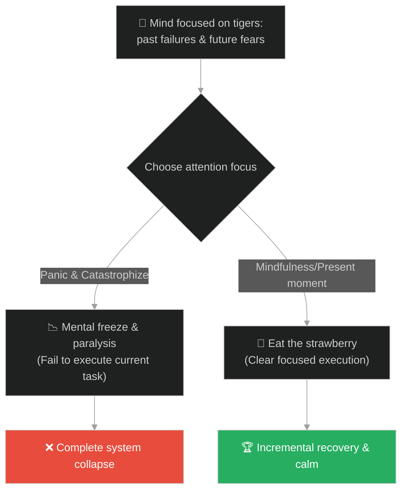
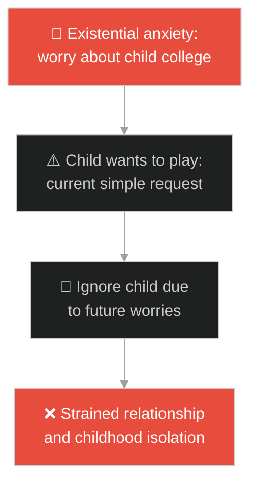
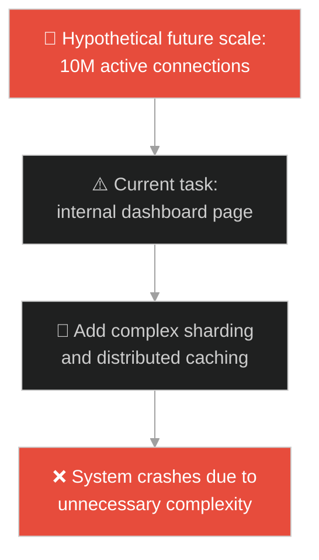
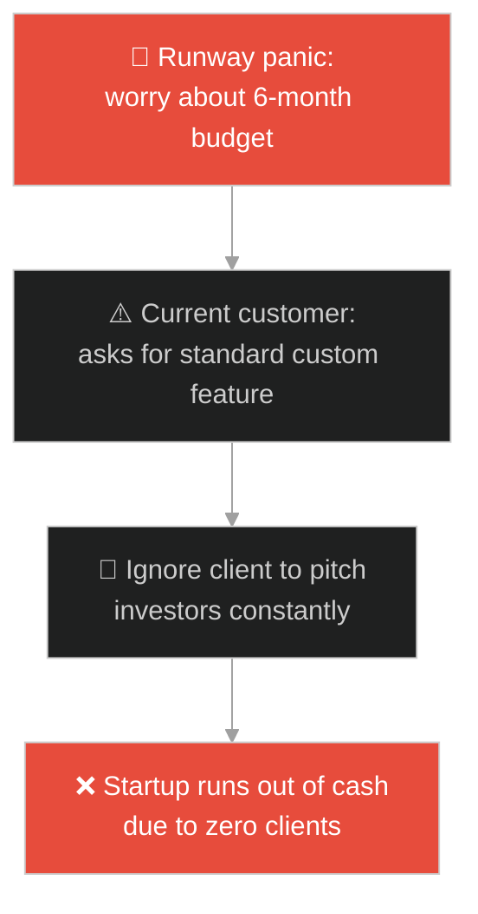
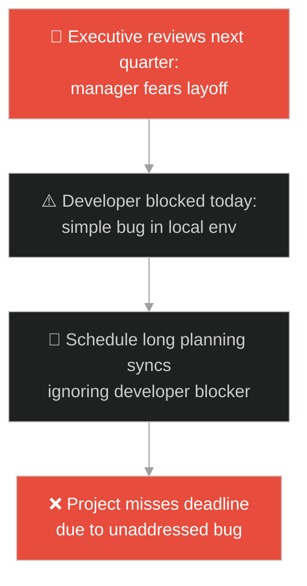
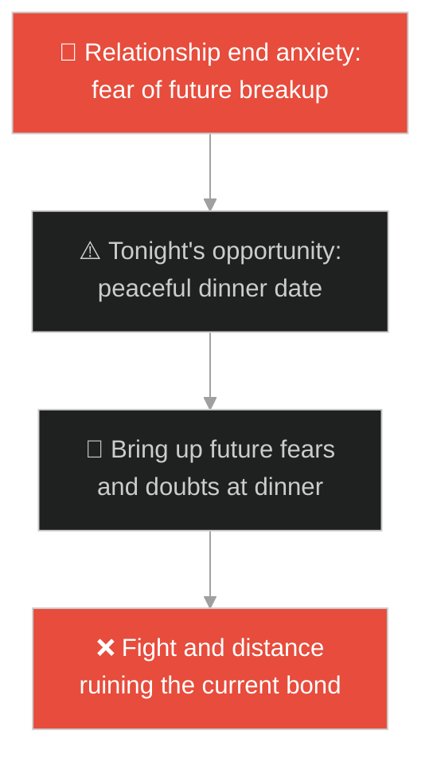
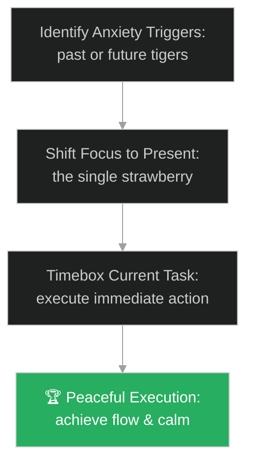

# Mindfulness & Present Moment (សតិ និងបច្ចុប្បន្នកាល)៖ ខ្លា និងផ្លែស្ត្របឺរី (Mindfulness & The Tiger and the Strawberry)

**Author:** ichamrong  
**Date:** 2026-05-28  
**Tags:** #buddhism #zen #mindfulness #present-moment #mental-models  
**Category:** Concepts / Parables  
**Read Time:** ~15 min  

---

## 📌 មាតិកា (Table of Contents)
- [អន្ទាក់ផ្លូវចិត្ត (The Trap)](#0)
- [១. រឿងព្រេងសេន៖ ខ្លា និងផ្លែស្ត្របឺរី (The Legend of the Tiger and the Strawberry)](#1)
  - [រសជាតិដ៏ផ្អែមឆ្ងាញ់ក្នុងគ្រាអាសន្ន (The Sweetest Taste Under Extreme Threat)](#1-1)
- [២. បញ្ហា៖ វិបត្តិការភ័យខ្លាចអនាគត និងការរារាំងការដោះស្រាយបច្ចុប្បន្ន (The Issue: Anticipatory Anxiety and Future-Proofing Paralysis)](#2)
- [៣. ឧទាហមណ៍ជាក់ស្តែងក្នុងពិភពពិត (Real World Examples)](#3)
  - [ឧទាហរណ៍ទី ១ — កម្រិតស្រាល (គ្រួសារ)៖ ការព្រួយបារម្ភពីការសិក្សារបស់កូននាពេលអនាគត (Existential College Anxiety vs Playtime)](#3-1)
  - [ឧទាហរណ៍ទី ២ — កម្រិតមធ្យម (បច្ចេកទេស)៖ ការរចនាប្រព័ន្ធសម្រាប់ទំហំដប់លានអ្នកប្រើប្រាស់ជាមុន (Over-Engineering for Future Scale)](#3-2)
  - [ឧទាហរណ៍ទី ៣ — កម្រិតមធ្យម (ធុរកិច្ច)៖ ការភ័យស្លន់ស្លោនឹងថវិកាដំណើរការក្រុមហ៊ុន (Runway Panic vs Current Sales Leads)](#3-3)
  - [ឧទាហរណ៍ទី ៤ — កម្រិតមធ្យម (សង្គម/គ្រប់គ្រង)៖ ការខ្វល់ខ្វាយពីការវាយតម្លៃរបស់ថ្នាក់ដឹកនាំ (Executive Review Anxiety vs Developer Blockers)](#3-4)
  - [ឧទាហរណ៍ទី ៥ — កម្រិតធ្ងន់ (ទំនាក់ទំនង)៖ ការភ័យខ្លាចការបែកបាក់នាពេលអនាគត (Fear of Separation vs Date Night Connection)](#3-5)
- [៤. ដំណោះស្រាយទូទៅ៖ ការផ្តោតលើភារកិច្ចចំពោះមុខ និងការកាត់បន្ថយកិច្ចការមិនទាន់ដល់ (The General Solution: Narrowing Scope and Present-Moment Execution)](#4)
- [សេចក្តីសន្និដ្ឋាន (Conclusion)](#5)
- [ឯកសារយោង (References)](#6)
- [Related Posts](#7)

---

<a id="0"></a>
## អន្ទាក់ផ្លូវចិត្ត (The Trap)

តើអ្នកធ្លាប់ជួបបញ្ហាដែលអ្នក ឬក្រុមការងារ មិនអាចបំពេញការងារតូចមួយនៅចំពោះមុខបានដោយជោគជ័យ ដោយសារតែអ្នករវល់តែបារម្ភពីគ្រោះមហន្តរាយពីអតីតកាល ឬការព្រួយបារម្ភពីបញ្ហាធំៗនាពេលអនាគតដែរឬទេ?

នៅក្នុងស្ថានភាពស្ត្រេស៖
* **យើងងាយនឹងធ្លាក់ក្នុងអន្ទាក់** នៃការគិតស្រមៃហួសហេតុទៅលើហានិភ័យនាពេលអនាគត (Anticipatory Anxiety / Catastrophizing) ដែលប្រៀបដូចជាការសម្លឹងមើលខ្លាពីរខ្ទប់ ធ្វើឱ្យយើងកកស្ទះ និងមិនអាចធ្វើការសម្រេចចិត្តដ៏សាមញ្ញបាន។
* **យើងមើលរំលង** តម្លៃ និងដំណោះស្រាយសាមញ្ញដែលមាននៅចំពោះមុខ ដែលអាចជួយរំដោះអារម្មណ៍ស្ត្រេស និងនាំមកនូវភាពច្បាស់លាស់ក្នុងការដោះស្រាយបញ្ហាបោះជំហានម្តងមួយៗ។

ការបាត់បង់ការយកចិត្តទុកដាក់លើការងារបច្ចុប្បន្ន ហៅថា **អន្ទាក់ខ្លាដេញនិងការភ្លេចបេះស្ត្របឺរី (Existential Paralysis Trap)**។

ដើម្បីយល់ដឹងពីរបៀបផ្តោតលើបច្ចុប្បន្នកាល នេះជាផែនទីបង្ហាញផ្លូវ៖
1. **រឿងព្រេងនិទាន (The Legend)** — រឿងរ៉ាវរបស់បុរសតោងវល្លិ៍រត់គេចពីខ្លា តែឆ្លៀតបេះផ្លែស្ត្របឺរីដាក់មាត់ទាំងញញឹម។
2. **បញ្ហា (The Issue)** — ការវិភាគចិត្តវិទ្យានៃការភ័យខ្លាចអនាគត និងផលប៉ះពាល់លើការបង្កើតផលិតផលបច្ចេកវិទ្យា (Over-engineering)។
3. **ឧទាហមណ៍ជាក់ស្តែងក្នុងពិភពពិត (Real World Examples)** — ពិនិត្យមើលបញ្ហានេះក្នុងកម្រិតគ្រួសារ បច្ចេកវិទ្យា ធុរកិច្ច ការគ្រប់គ្រង និងទំនាក់ទំនង។
4. **ដំណោះស្រាយទូទៅ (The General Solution)** — ការអនុវត្តយន្តការបែងចែកកិច្ចការតូចៗ (Micro-task focus) និងបច្ចេកទេសគ្រប់គ្រងស្ត្រេស (Mindfulness)។



---

<a id="1"></a>
## ១. រឿងព្រេងសេន៖ ខ្លា និងផ្លែស្ត្របឺរី (The Legend of the Tiger and the Strawberry)

នេះជារឿងព្រេងបែបពុទ្ធសាសនាសេន (Zen Buddhism) ដ៏ល្បីល្បាញបំផុតមួយ៖

មានបុរសម្នាក់កំពុងដើរក្នុងព្រៃ ស្រាប់តែលេចមុខខ្លាដ៏កាចសាហាវមួយក្បាលដេញខាំគាត់។ បុរសនោះបានរត់រហូតដល់មាត់ជ្រោះ ហើយដោយគ្មានជម្រើស គាត់ក៏សម្រេចចិត្តតោងវល្លិ៍មួយសរសៃដើម្បីយោលទម្លាក់ខ្លួនចុះទៅក្នុងជ្រោះនោះ។

ពេលកំពុងតោងវល្លិ៍៖
* ខ្លាដែលដេញគាត់នៅតែឈរចាំខាំនៅមាត់ជ្រោះខាងលើ។
* នៅពេលគាត់សម្លឹងមើលចុះទៅបាតជ្រោះខាងក្រោម គាត់ឃើញមានខ្លាមួយក្បាលទៀតកំពុងតែហាមាត់រង់ចាំគាត់ធ្លាក់ចុះទៅ។
* អ្វីដែលកាន់តែអាក្រក់នោះគឺ មានសត្វកណ្តុរពីរក្បាល (មួយស មួយខ្មៅ) លេចមុខមក ហើយចាប់ផ្តើមខាំកាត់សរសៃវល្លិ៍ដែលគាត់កំពុងតោងនោះបន្តិចម្តងៗ។

---

<a id="1-1"></a>
### រសជាតិដ៏ផ្អែមឆ្ងាញ់ក្នុងគ្រាអាសន្ន (The Sweetest Taste Under Extreme Threat)

ក្នុងស្ថានភាពដែលសេចក្តីស្លាប់រង់ចាំទាំងលើ ទាំងក្រោម ហើយខ្សែជីវិតកំពុងតែដាច់ បុរសនោះស្រាប់តែក្រឡេកភ្នែកទៅឃើញមានផ្លែស្ត្របឺរីព្រៃ (Strawberry) មួយផ្លែដុះចេញពីក្រហែងថ្មក្បែរដៃរបស់គាត់។

គាត់មិនបានស្រែកយំ ភ័យខ្លាច ឬស្តាយក្រោយឡើយ។ គាត់បានសម្រេចចិត្ត៖
* ប្រើដៃម្ខាងតោងវល្លិ៍យ៉ាងណែន។
* ប្រើដៃម្ខាងទៀតបេះផ្លែស្ត្របឺរីនោះមកដាក់ក្នុងមាត់រួចទំពារ។
* ពេលកំពុងទំពារ គាត់ញញឹមយ៉ាងស្រស់ស្រាយ រួចលាន់មាត់ថា៖
> «អូហ៍! ផ្លែស្ត្របឺរីនេះពិតជាមានរសជាតិផ្អែមឆ្ងាញ់អស្ចារ្យណាស់!»

---

<a id="2"></a>
## ២. បញ្ហា៖ វិបត្តិការភ័យខ្លាចអនាគត និងការរារាំងការដោះស្រាយបច្ចុប្បន្ន (The Issue: Anticipatory Anxiety and Future-Proofing Paralysis)

នៅក្នុងវិស្វកម្មប្រព័ន្ធ បញ្ហាធំបំផុតគឺការចំណាយពេលរៀបចំប្រព័ន្ធការពារកម្រិតយក្ស (Over-engineering for future-proofing) ខណៈពេលផលិតផលនៅមិនទាន់មានអ្នកប្រើប្រាស់ម្នាក់នៅឡើយ។ ការភ័យខ្លាចថាប្រព័ន្ធនឹងគាំងពេលមានអ្នកប្រើប្រាស់ ១០លាននាក់ (ខ្លាខាងក្រោម) ធ្វើឱ្យវិស្វករសរសេរកូដស្មុគស្មាញហួសហេតុ រហូតបង្កើត bug គាំងសូម្បីតែអ្នកប្រើប្រាស់ម្នាក់៖

```go
// ឧទាហរណ៍នៃការបង្កើតប្រព័ន្ធ Cache និង Sharding ស្មុគស្មាញហួសហេតុសម្រាប់ទិន្នន័យសាមញ្ញ
package main

import "fmt"

type OverEngineeredSystem struct {
	hasPanicAboutScale bool
}

func (o *OverEngineeredSystem) SaveData(data string) {
	if o.hasPanicAboutScale {
		// អន្ទាក់ខ្លា៖ បង្កើត Distributed Lock និង Sharding ទាំងដែល data មានត្រឹម ១០ បន្ទាត់
		fmt.Println("Distributed transaction lock initialized across 12 zones.")
		fmt.Println("Error: Network timeout due to unnecessary latency.")
	} else {
		// ផ្លែស្ត្របឺរី៖ សរសេរចូល Memory ធម្មតា ដំណើរការបានលឿន
		fmt.Println("Data written to simple memory map instantly.")
	}
}
```

* **វិបត្តិនៃការរៀបចំផែនការមិនចេះចប់ (Analysis Paralysis)៖** ការចំណាយពេលគិតគូរពីគម្រោង ៦ខែខាងមុខ ធ្វើឱ្យការងារដែលត្រូវបញ្ចេញនៅថ្ងៃនេះត្រូវបានពន្យារពេលម្តងហើយម្តងទៀត។
* **ការបាត់បង់ការផ្តោតអារម្មណ៍ (Fragmented Mind)៖** ភ័យខ្លាចថាកំហុសកូដពីម្សិលមិញ (ខ្លាខាងលើ) នឹងនាំឱ្យបាត់បង់ការងារ ធ្វើឱ្យសរសេរកូដថ្មីនៅថ្ងៃនេះមានកំហុសកាន់តែច្រើន។

---

<a id="3"></a>
## ៣. ឧទាហមណ៍ជាក់ស្តែងក្នុងពិភពពិត

---

<a id="3-1"></a>
### ឧទាហរណ៍ទី ១ — កម្រិតស្រាល (គ្រួសារ)៖ ការព្រួយបារម្ភពីការសិក្សារបស់កូននាពេលអនាគត (Existential College Anxiety vs Playtime)

ឪពុកម្តាយខ្លះចំណាយពេលរាល់ថ្ងៃខ្វល់ខ្វាយថា តើកូនអាយុ ៣ឆ្នាំរបស់ខ្លួននឹងអាចចូលរៀនសាកលវិទ្យាល័យល្បីៗបានដែរឬទេ (ខ្លាខាងក្រោម)។ ដោយសារតែការភ័យខ្លាចនេះ ពួកគេបង្ខំឱ្យកូនរៀនច្រើនម៉ោង រហូតគ្មានពេលលេងជាមួយកូន និងបាត់បង់ភាពស្និទ្ធស្នាលក្នុងគ្រួសារ (ភ្លេចរសជាតិផ្លែស្ត្របឺរីនៃការលេងជាមួយកូននៅថ្ងៃនេះ)។



---

<a id="3-2"></a>
### ឧទាហរណ៍ទី ២ — កម្រិតមធ្យម (បច្ចេកទេស)៖ ការរចនាប្រព័ន្ធសម្រាប់ទំហំដប់លានអ្នកប្រើប្រាស់ជាមុន (Over-Engineering for Future Scale)

ក្រុមបច្ចេកទេសមួយទើបតែបង្កើត startup ថ្មីដែលមានអ្នកប្រើប្រាស់ ១០ នាក់។ ប៉ុន្តែពួកគេភ័យស្លន់ស្លោខ្លាចប្រព័ន្ធមិនអាចទ្រទ្រង់ការទាក់ទាញធំៗបាន (ខ្លាខាងក្រោម) ក៏សម្រេចចិត្តបង្កើត Kubernetes Cluster, Multi-region databases, and complex microservices ( over-engineering)។ ជាលទ្ធផល ពួកគេចំណាយថវិកាអស់ពីធនាគារ និងគ្មានផលិតផលដំណើរការដើម្បីទាក់ទាញអតិថិជនដំបូងឡើយ។



---

<a id="3-3"></a>
### ឧទាហរណ៍ទី ៣ — កម្រិតមធ្យម (ធុរកិច្ច)៖ ការភ័យស្លន់ស្លោនឹងថវិកាដំណើរការក្រុមហ៊ុន (Runway Panic vs Current Sales Leads)

ស្ថាបនិកក្រុមហ៊ុនមួយបានចំណាយពេលពេញមួយថ្ងៃភ័យស្លន់ស្លោនឹងថវិកាដែលនៅសល់សម្រាប់ដំណើរការក្រុមហ៊ុនរយៈពេល ៦ខែទៀត (ខ្លាខាងក្រោម)។ ដោយសារតែការភ័យខ្លាចនេះ ពួកគេមិនបានផ្តោតលើការលក់ ឬការឆ្លើយតបនឹងការសាកសួររបស់អតិថិជនបច្ចុប្បន្នឡើយ (ភ្លេចបេះស្ត្របឺរី) ធ្វើឱ្យអតិថិជនដកខ្លួនចេញអស់ និងបង្កើនល្បឿនក្ស័យធនលឿនជាងមុន។



---

<a id="3-4"></a>
### ឧទាហរណ៍ទី ៤ — កម្រិតមធ្យម (សង្គម/គ្រប់គ្រង)៖ ការខ្វល់ខ្វាយពីការវាយតម្លៃរបស់ថ្នាក់ដឹកនាំ (Executive Review Anxiety vs Developer Blockers)

ប្រធានក្រុមការងារម្នាក់ភ័យខ្លាចការវាយតម្លៃការងារប្រចាំត្រីមាសពីនាយកក្រុមហ៊ុន (ខ្លាខាងក្រោម) រហូតចំណាយពេលបង្កើតតែ slide បង្ហាញ និងរៀបចំផែនការមិនចេះចប់។ គាត់បានមើលរំលងការជួយដោះស្រាយបញ្ហាគាំងកូដរបស់សមាជិកម្នាក់នៅថ្ងៃនេះ (ភ្លេចបេះស្ត្របឺរី) ដែលជាហេតុធ្វើឱ្យគម្រោងពិតប្រាកដត្រូវពន្យារពេល និងធ្លាក់ការវាយតម្លៃមែនទែន។



---

<a id="3-5"></a>
### ឧទាហរណ៍ទី ៥ — កម្រិតធ្ងន់ (ទំនាក់ទំនង)៖ ការភ័យខ្លាចការបែកបាក់នាពេលអនាគត (Fear of Separation vs Date Night Connection)

ប្តីប្រពន្ធមួយគូតែងតែឈ្លោះប្រកែកគ្នា ព្រោះតែការបារម្ភថាពួកគេនឹងត្រូវលែងលះគ្នានៅថ្ងៃណាមួយ ឬតើពួកគេនឹងបាត់បង់ការស្រឡាញ់គ្នានៅពេលចាស់ទៅឬយ៉ាងណា (ខ្លាខាងក្រោម)។ ដោយសារតែការភ័យខ្លាចនេះ ពួកគេចំណាយពេលញ៉ាំអាហារពេលល្ងាចជជែកតែពីរឿងព្រួយបារម្ភ ជំនួសឱ្យការរីករាយនឹងពេលវេលាស្ងប់ស្ងាត់ និងការលេងសើចដ៏ផ្អែមល្ហែមជាមួយគ្នានៅថ្ងៃនេះ (ផ្លែស្ត្របឺរី)។



---

<a id="4"></a>
## ៤. ដំណោះស្រាយទូទៅ៖ ការផ្តោតលើភារកិច្ចចំពោះមុខ និងការកាត់បន្ថយកិច្ចការមិនទាន់ដល់ (The General Solution: Narrowing Scope and Present-Moment Execution)

ដើម្បីដោះស្រាយការភ័យស្លន់ស្លោ និងការគិតហួសហេតុ យើងត្រូវអនុវត្តប្រព័ន្ធបច្ចុប្បន្នកាល និងការកំណត់ព្រំដែនពេលវេលា៖



* **ការប្រើប្រាស់វិធីសាស្ត្រ Timeboxing និងការផ្តោតលើ Sprint ខ្លីៗ៖** កុំព្យាយាមសរសេរផែនការការងាររយៈពេលវែងហួសហេតុ។ ផ្តោតលើការងារដែលត្រូវបញ្ចប់ក្នុងរយៈពេល ២សប្តាហ៍ខាងមុខ (Sprint) ឱ្យបានត្រឹមត្រូវ និងទាត់ជម្រះបញ្ហាចំពោះមុខជាមុនសិន។
* **យន្តការ "Just-in-Time" Design ក្នុងការអភិវឌ្ឍប្រព័ន្ធ៖** កុំបង្កើតស្ថាបត្យកម្មប្រព័ន្ធសម្រាប់ scale ធំពេក ប្រសិនបើវាមិនទាន់ឆ្លងកាត់ការប្រើប្រាស់ពិត។ ត្រូវសរសេរកូដឱ្យស្អាត ងាយស្រួលយល់ និងបត់បែន ដើម្បីងាយស្រួល refactor នៅពេលមាន scale ពិតប្រាកដចូលមកដល់។
* **ការអនុវត្តការរស់នៅដោយមានសតិ (Mindful Stress Reduction)៖** រៀងរាល់ថ្ងៃ ទុកពេល ១០ នាទីដកខ្លួនចេញពីទូរស័ព្ទ អ៊ីមែល និង dashboards។ ផ្តោតអារម្មណ៍លើអារម្មណ៍ដកដង្ហើម និងការរីករាយនឹងសេចក្តីសុខតូចៗ (កាហ្វេក្តៅឧណ្ហៗ ការសន្ទនាជាមួយមិត្តរួមការងារ)។

---

## 🐇 ធ្លាក់ចូលក្នុងរន្ធទន្សាយ (Enter the Rabbit Hole)

ដើម្បីស្វែងយល់កាន់តែស៊ីជម្រៅអំពីរបៀបឆ្លងកាត់ការភាន់ច្រឡំ និងការមើលឃើញការពិតច្បាស់លាស់ សូមចាប់ផ្តើមដំណើររុករករបស់អ្នកដោយចុចលើតំណភ្ជាប់ខាងក្រោម៖

* 🚀 **[ចាប់ផ្តើមដំណើររុករក (Start the Journey) ➔ កែវទទេ (The Empty Cup)](./122-buddha-and-the-empty-cup.md)**

---

<a id="5"></a>
## សេចក្តីសន្និដ្ឋាន (Conclusion)

> **«ខ្លាកំពុងដេញតាម កណ្តុរកំពុងខាំខ្សែ តែរសជាតិស្ត្របឺរីនៅតែផ្អែមឆ្ងាញ់។»**

អតីតកាលត្រូវបានកន្លងផុតទៅ អនាគតគឺគ្រាន់តែជាការស្មាន។ ពេលវេលាតែមួយគត់ដែលយើងមាន និងអាចធ្វើសកម្មភាពបានគឺ "ពេលបច្ចុប្បន្ន"។ ការចេះរក្សាភាពស្ងប់ស្ងាត់ និងរីករាយនឹងការងារ ឬសេចក្តីសុខតូចៗដែលនៅចំពោះមុខ គឺជាគន្លឹះដ៏សំខាន់បំផុតដើម្បីរំដោះខ្លួនចេញពីភាពភ័យស្លន់ស្លោ និងនាំមកនូវភាពជោគជ័យដ៏ពិតប្រាកដ។

---

<a id="6"></a>
## ឯកសារយោង (References)

* **Paul Reps** — *Zen Flesh, Zen Bones* (1957). Contains the classic Zen story of the tiger and the strawberry.
* **Jon Kabat-Zinn** — *Full Catastrophe Living* (1990). Using mindfulness (present-moment awareness) to handle chronic stress and panic.
* **Martin Fowler** — *Sacrificial Architecture* (2014). Building systems that work for today's scale, knowing they will be replaced later.

---

<a id="7"></a>
## Related Posts

* [Buddha and the Poisoned Arrow](./109-buddha-and-the-poisoned-arrow.md) — Finding the pragmatism of taking direct action under crisis.
* [Solomon's Ring](./40-solomons-ring.md) — Finding emotional resilience and mantra structures under incident management stress.
