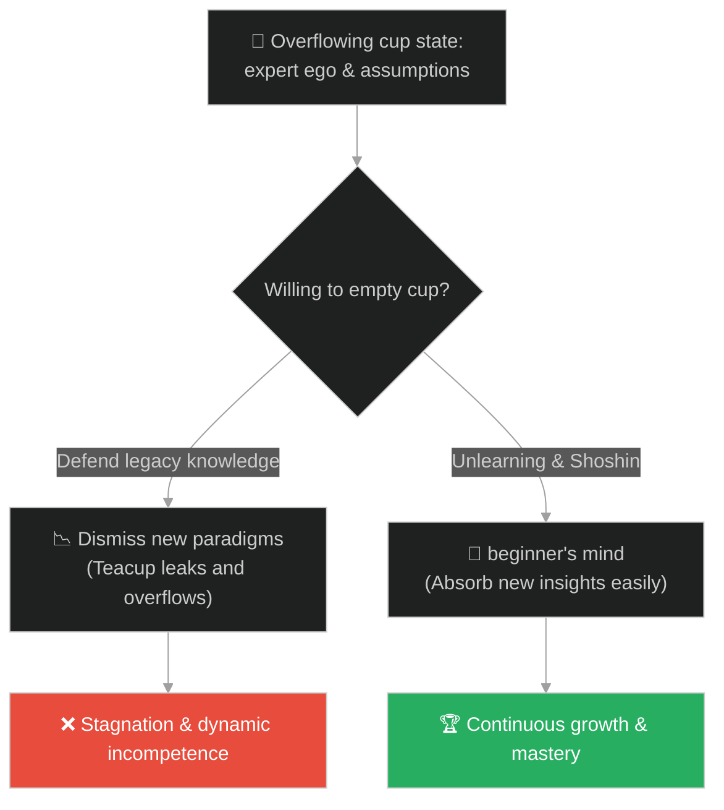
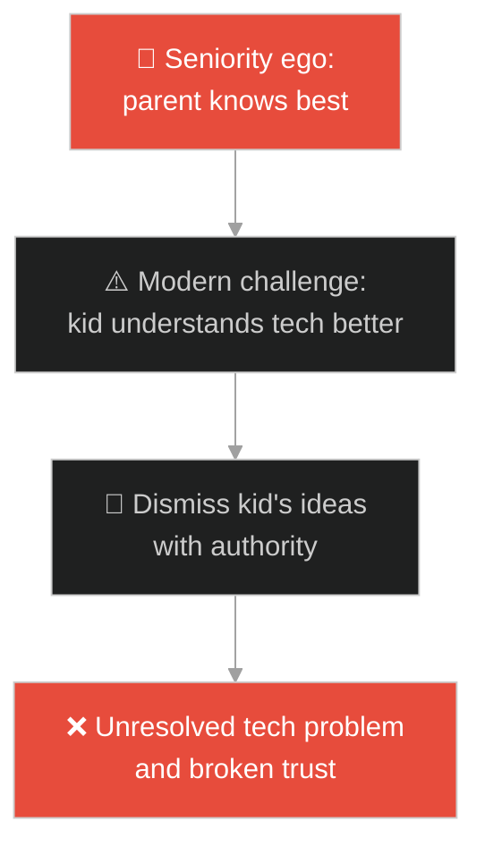
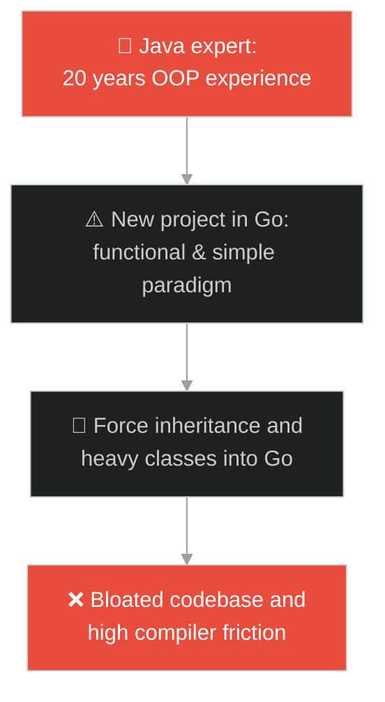
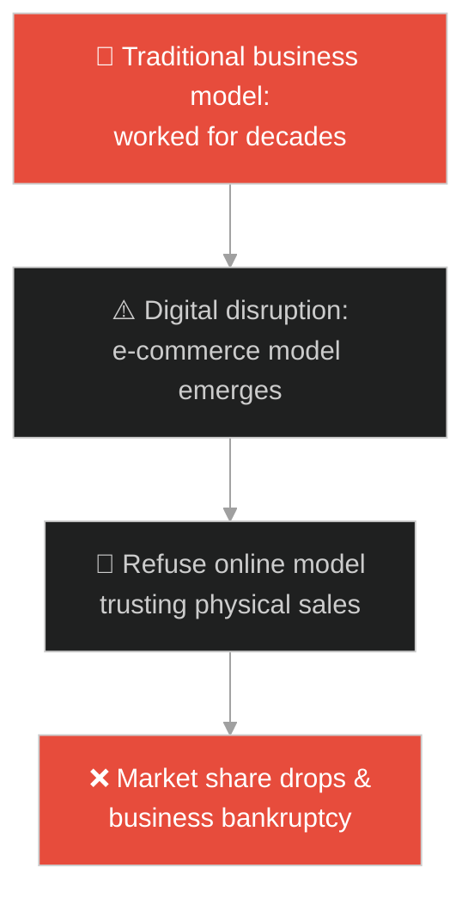
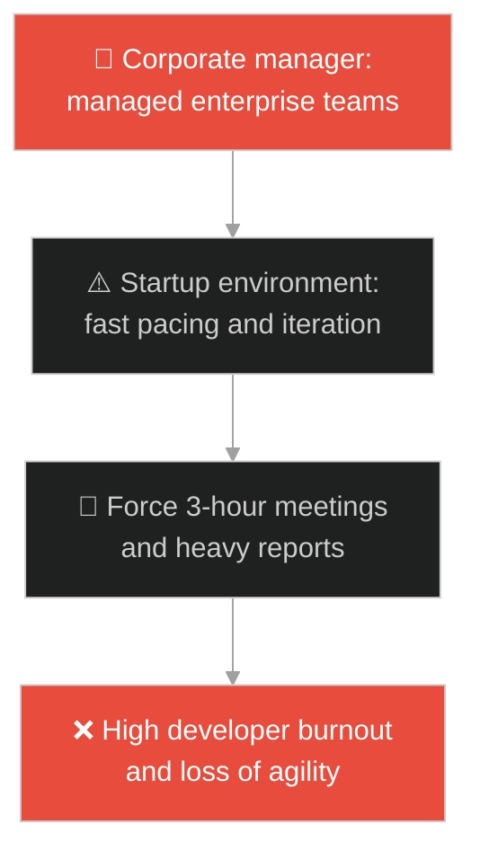
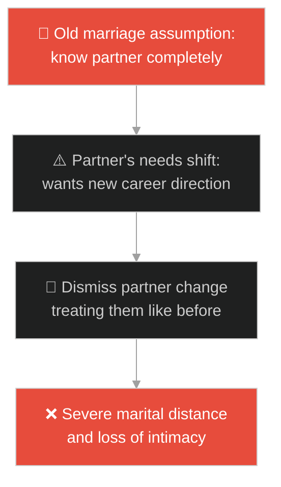
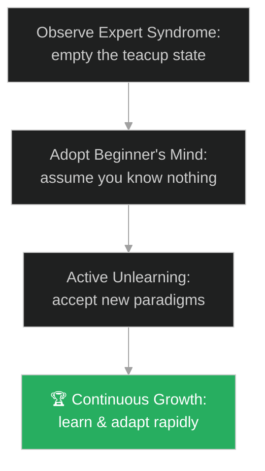

# Beginner's Mind & Unlearning (ចិត្តអ្នកចាប់ផ្តើមថ្មី និងការលុបចំណេះចាស់)៖ កែវទទេ (Beginner's Mind & The Empty Cup)

**Author:** ichamrong  
**Date:** 2026-05-28  
**Tags:** #buddhism #zen #beginners-mind #shoshin #unlearning #mental-models  
**Category:** Concepts / Parables  
**Read Time:** ~15 min  

---

## 📌 មាតិកា (Table of Contents)
- [អន្ទាក់ផ្លូវចិត្ត (The Trap)](#0)
- [១. រឿងព្រេងសេន៖ កែវទឹកដែលពេញហៀរ (The Legend of the Overflowing Cup)](#1)
  - [សេចក្តីពិតនៃកែវទឹករបស់ព្រះសង្ឃណាន់អ៊ីន (Nan-in's Lesson on Emptying the Mind)](#1-1)
- [២. បញ្ហា៖ វិបត្តិអ្នកជំនាញរឹងត្អឹង និងភាពលំបាកក្នុងការលុបចំណេះចាស់ (The Issue: Expert Syndrome and Cognitive Inertia in Technology)](#2)
- [៣. ឧទាហមណ៍ជាក់ស្តែងក្នុងពិភពពិត (Real World Examples)](#3)
  - [ឧទាហរណ៍ទី ១ — កម្រិតស្រាល (គ្រួសារ)៖ អំនួតនៃអាយុរបស់ឪពុកម្តាយ (Older Generation Dismissing Youth Tech Advice)](#3-1)
  - [ឧទាហរណ៍ទី ២ — កម្រិតមធ្យម (បច្ចេកទេស)៖ ការបង្ខំប្រើគំរូ OOP លើភាសាកូដទម្រង់ថ្មី (Forcing Java OOP Design in Go/Rust)](#3-2)
  - [ឧទាហរណ៍ទី ៣ — កម្រិតមធ្យម (ធុរកិច្ច)៖ ភាពជោគជ័យពីមុនរបស់អាជីវកម្មលក់រាយ (Traditional Retail Resisting E-Commerce Disruption)](#3-3)
  - [ឧទាហរណ៍ទី ៤ — កម្រិតមធ្យម (សង្គម/គ្រប់គ្រង)៖ ការគ្រប់គ្រងរបស់ប្រធានមកពីសាជីវកម្មធំ (Corporate Processes Imposed on Agile Startups)](#3-4)
  - [ឧទាហរណ៍ទី ៥ — កម្រិតធ្ងន់ (ទំនាក់ទំនង)៖ ការសន្មតថាស្គាល់ចិត្តដៃគូទាំងអស់ (Assuming Total Knowledge of Partner's Dynamic Needs)](#3-5)
- [៤. ដំណោះស្រាយទូទៅ៖ ការអនុវត្តចិត្តអ្នកចាប់ផ្តើម និងការលុបចោលចំណេះដឹងចាស់ (The General Solution: Active Unlearning Frameworks and Shoshin Practice)](#4)
- [សេចក្តីសន្និដ្ឋាន (Conclusion)](#5)
- [ឯកសារយោង (References)](#6)
- [Related Posts](#7)

---

<a id="0"></a>
## អន្ទាក់ផ្លូវចិត្ត (The Trap)

តើអ្នកធ្លាប់ជួបមនុស្សដែលពោរពេញដោយបទពិសោធន៍ តែមិនព្រមស្តាប់ ឬរៀនបច្ចេកវិទ្យាថ្មីៗ ដោយជឿថាចំណេះដឹងដែលគេមានកាលពី ១០ ឆ្នាំមុន គឺគ្រប់គ្រាន់ និងល្អជាងអ្វីៗទាំងអស់នាពេលបច្ចុប្បន្នដែរឬទេ?

នៅក្នុងយុគសម័យនៃការផ្លាស់ប្តូរយ៉ាងលឿន៖
* **យើងងាយនឹងធ្លាក់ក្នុងអន្ទាក់** នៃអំនួតអ្នកជំនាញ (Expert Syndrome / Cognitive Rigidity) ដែលប្រៀបដូចជាកែវទឹកតែដែលពេញហៀរ មិនអាចទទួលទឹកថ្មីបានទៀតឡើយ។
* **យើងមើលរំលង** សារៈសំខាន់នៃការលុបចំណេះចាស់ (Unlearning) ដើម្បីទុកចន្លោះទំនេរឱ្យគំនិត និងវិធីសាស្ត្រទំនើបៗចូលមកជំនួសវិញ។

ការរារាំងចំណេះដឹងថ្មីដោយសារបទពិសោធន៍ចាស់ ហៅថា **អន្ទាក់កែវតែពេញហៀរ (The Overflowing Cup Trap)**។

ដើម្បីយល់ដឹងពីរបៀបបើកចិត្តរៀនសូត្រឡើងវិញ នេះជាផែនទីបង្ហាញផ្លូវ៖
1. **រឿងព្រេងនិទាន (The Legend)** — រឿងរ៉ាវរបស់សាស្ត្រាចារ្យសាកលវិទ្យាល័យដែលអួតពីចំណេះដឹងខ្លួនឯង រហូតព្រះសង្ឃណាន់អ៊ីនចាក់តែហៀរពេញតុ។
2. **បញ្ហា (The Issue)** — ការវិភាគចិត្តវិទ្យានៃ Dunning-Kruger Effect និងការកកស្ទះគំនិតអ្នកជំនាញបច្ចេកទេស (Cognitive Inertia)។
3. **ឧទាហមណ៍ជាក់ស្តែងក្នុងពិភពពិត (Real World Examples)** — ពិនិត្យមើលបញ្ហានេះក្នុងកម្រិតគ្រួសារ បច្ចេកវិទ្យា ធុរកិច្ច ការគ្រប់គ្រង និងទំនាក់ទំនង។
4. **ដំណោះស្រាយទូទៅ (The General Solution)** — ការអនុវត្តក្របខ័ណ្ឌ "លុបចំណេះចាស់ដើម្បីរៀនថ្មី" (Active Unlearning) និងការបណ្តុះចិត្ត Shoshin។



---

<a id="1"></a>
## ១. រឿងព្រេងសេន៖ កែវទឹកដែលពេញហៀរ (The Legend of the Overflowing Cup)

ក្នុងរឿងព្រេងព្រះពុទ្ធសាសនាសេនដ៏ល្បីល្បាញ៖

មានសាស្រ្តាចារ្យសាកលវិទ្យាល័យដ៏ឆ្នើមម្នាក់ ដែលទទួលបានការអប់រំខ្ពង់ខ្ពស់ និងមានការកោតសរសើរពីមនុស្សជាច្រើន។ ថ្ងៃមួយ គាត់បានធ្វើដំណើរទៅជួបព្រះសង្ឃសេនាមួយអង្គព្រះនាម **ណាន់អ៊ីន (Nan-in)** ដើម្បីសាកសួរអំពីខ្លឹមសារនៃធម៌សេន។

ពេលមកដល់៖
* សាស្ត្រាចារ្យនោះមិនបានសួរដេញដោល ឬស្តាប់ឡើយ។
* ផ្ទុយទៅវិញ គាត់បាននិយាយរៀបរាប់អួតអំពីចំណេះដឹង បទពិសោធន៍ ទ្រឹស្តី និងទស្សនៈផ្ទាល់ខ្លួនឥតឈប់ឈរ ដើម្បីបង្ហាញប្រាប់ព្រះសង្ឃពីភាពឆ្លាតវៃរបស់គាត់។
* ព្រះសង្ឃ ណាន់អ៊ីន បានស្តាប់ដោយស្ងប់ស្ងាត់ រួចទ្រង់បានរៀបចំឆុងតែទទួលភ្ញៀវ។

---

<a id="1-1"></a>
### សេចក្តីពិតនៃកែវទឹករបស់ព្រះសង្ឃណាន់អ៊ីន (Nan-in's Lesson on Emptying the Mind)

ព្រះសង្ឃ ណាន់អ៊ីន បានចាក់តែចូលក្នុងកែវរបស់សាស្រ្តាចារ្យ៖
* ទឹកតែបានពេញស្មើនឹងមាត់កែវ ប៉ុន្តែលោកនៅតែបន្តចាក់ថែមទៀតដោយគ្មានការស្ទាក់ស្ទើរ។
* ទឹកតែបានហៀរចេញពីកែវ ហូរពេញតុ និងធ្លាក់ចុះដល់ឥដ្ឋ។
* សាស្ត្រាចារ្យសម្លឹងមើលទឹកតែដែលកំពុងហូរហៀរនោះ រហូតទ្រាំលែងបានក៏ស្រែកឃាត់ថា៖
> «លោកគ្រូ! កែវនេះពេញហៀរអស់ហើយ លែងអាចចាក់ទឹកចូលបានទៀតហើយ!»

ព្រះសង្ឃ ណាន់អ៊ីន បានដាក់ប៉ាន់តែចុះយឺតៗ រួចមានបន្ទូលយ៉ាងត្រជាក់ស្ងប់ថា៖
> «ត្រូវហើយ ឧបាសក។ អ្នកក៏ដូចជាកែវទឹកតែនេះដែរ។ ខួរក្បាលរបស់អ្នកកំពុងតែពេញហៀរទៅដោយគំនិត ជំនឿ និងបទពិសោធន៍ផ្ទាល់ខ្លួន។ តើអាត្មាអាចពន្យល់អ្នកអំពីធម៌សេនបានដោយរបៀបណា ប្រសិនបើអ្នកមិនព្រមចាក់ទឹកចេញពីកែវរបស់អ្នកខ្លះសិននោះ?»

---

<a id="2"></a>
## ២. បញ្ហា៖ វិបត្តិអ្នកជំនាញរឹងត្អឹង និងភាពលំបាកក្នុងការលុបចំណេះចាស់ (The Issue: Expert Syndrome and Cognitive Inertia in Technology)

នៅក្នុងការអភិវឌ្ឍកម្មវិធី វិបត្តិធំបំផុតកើតឡើងនៅពេលអ្នកសរសេរកម្មវិធីកម្រិត Senior ដែលមានបទពិសោធន៍ Java ឬ C++ រាប់សិបឆ្នាំ ត្រូវប្តូរមកសរសេរភាសាទំនើបៗដូចជា Go, Rust ឬ Python។ ដោយសារមិនព្រមលុបគំនិតចាស់ (OOP patterns) ចេញ ពួកគេព្យាយាមបង្កើត Interface, Abstract Factory, និង Class ស្មុគស្មាញជាច្រើន ដែលភាសាថ្មីមិនត្រូវការ ធ្វើឱ្យប្រព័ន្ធដើរយឺត និងពិបាកថែទាំ៖

```go
// ឧទាហរណ៍នៃការបង្ខំបង្កើត Object-Oriented Boilerplate ក្នុងភាសា Go ទាំងដែលមិនចាំបាច់
package main

import "fmt"

// អ្នកសរសេរកម្មវិធីរឹងត្អឹង Refuse to use simple struct methods
type UserEntity struct {
	ID   int
	Name string
}

type UserInterface interface {
	GetUserName() string
}

// បង្កើត Object layers ច្រើនជាន់ដូចជា Java
type UserServiceImpl struct {
	Entity *UserEntity
}

func (u *UserServiceImpl) GetUserName() string {
	return u.Entity.Name
}

func main() {
	// ជំនួសឱ្យការ print entity directly ពួកគេប្រើ interface flow ស្មុគស្មាញ
	var service UserInterface = &UserServiceImpl{Entity: &UserEntity{ID: 1, Name: "Ego"}}
	fmt.Println("Boilerplate OOP execution in Go:", service.GetUserName())
}
```

* **អន្ទាក់ "បទពិសោធន៍ ២០ ឆ្នាំ"៖** មនុស្សខ្លះមានបទពិសោធន៍ ១ ឆ្នាំ តែធ្វើដដែលៗចំនួន ២០ ដង ប៉ុន្តែជឿថាខ្លួនជាអ្នកជំនាញដែលចេះគ្រប់យ៉ាង។
* **ភាពធន់នឹងការផ្លាស់ប្តូរ (Cognitive Inertia)៖** ការបដិសេធមិនព្រមប្រើប្រាស់បច្ចេកវិទ្យាទំនើបៗ (ដូចជា AI, Cloud, platform tooling) ព្រោះមិនចង់ក្លាយជា "អ្នកចាប់ផ្តើមថ្មី" ដែលត្រូវសួរនាំគេម្តងទៀត។

---

<a id="3"></a>
## ៣. ឧទាហមណ៍ជាក់ស្តែងក្នុងពិភពពិត

---

<a id="3-1"></a>
### ឧទាហរណ៍ទី ១ — កម្រិតស្រាល (គ្រួសារ)៖ អំនួតនៃអាយុរបស់ឪពុកម្តាយ (Older Generation Dismissing Youth Tech Advice)

ឪពុកម្នាក់ចង់ភ្ជាប់ទូរទស្សន៍ស្មាតវីទៅនឹងបណ្តាញអ៊ីនធឺណិត ប៉ុន្តែមិនអាចធ្វើបានឡើយ។ កូនប្រុសរបស់គាត់បានព្យាយាមណែនាំឱ្យចុចប៊ូតុង Reset router (កូនយល់ដឹងពីបច្ចេកវិទ្យា)។ ឪពុកខឹងនិងស្រែកគំហកថា៖ *"កុំមកប្រដៅអញ! អញរស់នៅមុនឯងកើត ២០ ឆ្នាំ អញចេះជាងឯង"* (កែវទឹកពេញ)។ ជាលទ្ធផល ទូរទស្សន៍នៅតែមិនអាចប្រើបាន និងបង្កើតជម្លោះក្នុងគ្រួសារ។



---

<a id="3-2"></a>
### ឧទាហរណ៍ទី ២ — កម្រិតមធ្យម (បច្ចេកទេស)៖ ការបង្ខំប្រើគំរូ OOP លើភាសាកូដទម្រង់ថ្មី (Forcing Java OOP Design in Go/Rust)

វិស្វករ Senior ជនជាតិអាមេរិកម្នាក់មានបទពិសោធន៍សរសេរ Java រាប់សិបឆ្នាំ។ ពេលក្រុមហ៊ុនប្តូរមកប្រើប្រាស់ Go គាត់បានបដិសេធមិនព្រមរៀនបច្ចេកទេសសរសេរបែប Go-idiomatic ឡើយ (មិនព្រមចាក់ទឹកចេញ)។ គាត់បានបង្កើត class hierarchies ស្មុគស្មាញ និង interfaces រាប់សិបជាន់ ធ្វើឱ្យល្បឿន compiler របស់ Go យឺតយ៉ាវ និងពិបាកឱ្យអ្នកដទៃចូលរួមជួយកូដរបស់គាត់។



---

<a id="3-3"></a>
### ឧទាហរណ៍ទី ៣ — កម្រិតមធ្យម (ធុរកិច្ច)៖ ភាពជោគជ័យពីមុនរបស់អាជីវកម្មលក់រាយ (Traditional Retail Resisting E-Commerce Disruption)

ហាងលក់ទំនិញដ៏ធំមួយទទួលបានចំណូលរាប់លានដុល្លារតាមរយៈសាខារាងកាយរបស់ពួកគេ។ ពេលទីផ្សារអនឡាញ (E-Commerce) កើតឡើង នាយកប្រតិបត្តិបានសើចចំអកនិងនិយាយថា៖ *"មនុស្សត្រូវការមកហាងពិតប្រាកដ ចំណេះដឹងទីផ្សារអនឡាញគ្មានថ្ងៃឈ្នះទីតាំងហាងយើងទេ"* (កែវពេញ)។ ៥ ឆ្នាំក្រោយមក ក្រុមហ៊ុនត្រូវក្ស័យធនព្រោះអតិថិជនបានប្តូរទៅទិញអនឡាញអស់។



---

<a id="3-4"></a>
### ឧទាហរណ៍ទី ៤ — កម្រិតមធ្យម (សង្គម/គ្រប់គ្រង)៖ ការគ្រប់គ្រងរបស់ប្រធានមកពីសាជីវកម្មធំ (Corporate Processes Imposed on Agile Startups)

ប្រធានគ្រប់គ្រងម្នាក់ទើបតែផ្លាស់ប្តូរការងារពីសាជីវកម្មយក្សដែលមានបុគ្គលិក ១ម៉ឺននាក់ មកដឹកនាំក្រុមការងារ Startup ដែលមានបុគ្គលិក ១០នាក់។ គាត់បានបង្ខំឱ្យក្រុមការងារសរសេររបាយការណ៍ PDF ៣០ ទំព័រ និងរៀបចំការប្រជុំរាល់ថ្ងៃតាមលំនាំសាជីវកម្មចាស់របស់គាត់ (មិនព្រមរៀនបរិបទថ្មី)។ ជាលទ្ធផល សមាជិកក្រុមទាំងអស់លែងមានពេលសរសេរកូដ និងសម្រេចចិត្តលាលែងពីការងារទាំងអស់។



---

<a id="3-5"></a>
### ឧទាហរណ៍ទី ៥ — កម្រិតធ្ងន់ (ទំនាក់ទំនង)៖ ការសន្មតថាស្គាល់ចិត្តដៃគូទាំងអស់ (Assuming Total Knowledge of Partner's Dynamic Needs)

ប្តីប្រពន្ធមួយគូរស់នៅជាមួយគ្នា ១៥ ឆ្នាំ។ ប្តីតែងតែគិតថាខ្លួនស្គាល់ប្រពន្ធគ្រប់ជ្រុងជ្រោយ (កែវពេញ) រហូតឈប់សួរនាំ ឬលែងស្តាប់ការចង់បានថ្មីៗរបស់ប្រពន្ធ។ ពេលប្រពន្ធសម្រេចចិត្តចង់ប្តូរការងារ ឬចង់រៀនសូត្រអ្វីថ្មី ប្តីតែងតែច្រានចោលនិងនិយាយថា៖ *"ខ្ញុំដឹងថាអ្នកមិនចូលចិត្តរបស់ទាំងនេះទេ"*។ ទីបំផុត ភាពឆ្ងាយគ្នានៃចិត្តនាំទៅរកការលែងលះ ព្រោះប្តីរស់នៅជាមួយ "រូបភាពចាស់របស់ប្រពន្ធ" មិនមែនមនុស្សពិតនាពេលបច្ចុប្បន្នឡើយ។



---

<a id="4"></a>
## ៤. ដំណោះស្រាយទូទៅ៖ ការអនុវត្តចិត្តអ្នកចាប់ផ្តើម និងការលុបចោលចំណេះដឹងចាស់ (The General Solution: Active Unlearning Frameworks and Shoshin Practice)

ដើម្បីរក្សាខួរក្បាលឱ្យងាយស្រួលរៀនសូត្រ យើងត្រូវអនុវត្តក្របខ័ណ្ឌចាក់ទឹកចេញពីកែវ និង Shoshin៖



* **ការអនុវត្តគោលការណ៍ "ចិត្តជាអ្នករៀនថ្មី" (Beginner's Mind / Shoshin)៖** រាល់ពេលដែលចូលរួមប្រជុំ ឬសិក្សាភាសាកូដថ្មី ចូរដាក់ការយល់ដឹងចាស់មួយឡែក។ ចោលពាក្យថា *"ខ្ញុំដឹងហើយ"* ឬ *"យើងធ្លាប់ធ្វើបែបនេះកាលពីមុន"*។ សួរសំណួរបែបសាមញ្ញ (Socratic questioning) ដូចជាក្មេងតូច។
* **ការបង្កើតទម្លាប់ "Active Unlearning"៖** កំណត់ចំណេះដឹងដែលលែងប្រើការបាន (ឧទាហរណ៍ របៀប configure server ដោយផ្ទាល់ដៃ ជំនួសដោយ Terraform/IaC) រួចលុបវាចោលពីរបៀបធ្វើការងាររបស់អ្នក។ កុំខ្លាចក្នុងការក្លាយជាមនុស្ស "មិនចេះ" ក្នុងបរិបទថ្មី។
* **ការរៀនសូត្រពីក្មេងជំនាន់ក្រោយ (Reverse Mentoring)៖** បង្កើតកម្មវិធីដែលបុគ្គលិកកម្រិត Senior ជួប និងរៀនសូត្រអំពីនិន្នាការបច្ចេកវិទ្យាថ្មីៗពីបុគ្គលិកកម្រិត Junior ឬអ្នកទើបតែចូលរួមការងារថ្មី ដើម្បីចាក់ទឹកចេញពីកែវ។

---

## 🐇 ធ្លាក់ចូលក្នុងរន្ធទន្សាយ (Enter the Rabbit Hole)

ដើម្បីស្វែងយល់កាន់តែស៊ីជម្រៅអំពីរបៀបឆ្លងកាត់ការភាន់ច្រឡំ និងការមើលឃើញការពិតច្បាស់លាស់ សូមចាប់ផ្តើមដំណើររុករករបស់អ្នកដោយចុចលើតំណភ្ជាប់ខាងក្រោម៖

* 🚀 **[ចាប់ផ្តើមដំណើររុករក (Start the Journey) ➔ កសិករ និងគោដែលបាត់ (The Farmer and the Lost Cows)](./123-buddha-and-the-cow.md)**

---

<a id="5"></a>
## សេចក្តីសន្និដ្ឋាន (Conclusion)

> **«នៅក្នុងចិត្តរបស់អ្នកចាប់ផ្តើម មានជម្រើសរាប់មិនអស់ ប៉ុន្តែនៅក្នុងចិត្តរបស់អ្នកជំនាញ មានជម្រើសតែបន្តិចបន្តួចប៉ុណ្ណោះ។»**

សត្រូវដ៏ធំបំផុតនៃចំណេះដឹង មិនមែនជាភាពអវិជ្ជាឡើយ ប៉ុន្តែជាការភាន់ច្រឡំនៃចំណេះដឹងដែលយើងធ្លាប់មាន។ ការចេះចាក់ទឹកតែដែលកករល្អក់ចាស់ៗចេញ ដើម្បីទទួលពន្លឺ និងរសជាតិនៃទឹកតែថ្មីៗ គឺជាគន្លឹះតែមួយគត់ដើម្បីជៀសវាងភាពរឹងត្អឹងផ្លូវចិត្ត និងរក្សាបាននូវសមត្ថភាពលូតលាស់ជារៀងរហូត។

---

<a id="6"></a>
## ឯកសារយោង (References)

* **Shunryu Suzuki** — *Zen Mind, Beginner's Mind* (1970). The foundational text on Shoshin and the power of starting with an empty slate.
* **Dunning-Kruger Effect** — *Journal of Personality and Social Psychology* (1999). Overestimating capability due to lack of deep context.
* **Alvin Toffler** — *Future Shock* (1970). *"The illiterate of the 21st century will not be those who cannot read and write, but those who cannot learn, unlearn, and relearn."*

---

<a id="7"></a>
## Related Posts

* [Letting Go of Legacy & Dogmatism](./116-buddha-and-the-raft.md) — Understanding when the tools that carried you must be left behind.
* [Solomon's Paradox](./38-solomons-paradox.md) — Overcoming self-blind spots and expert limits through Socratic distances.
