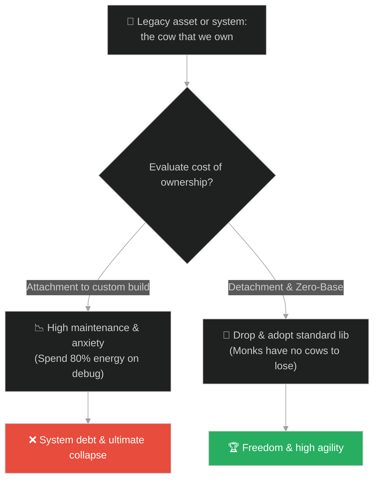
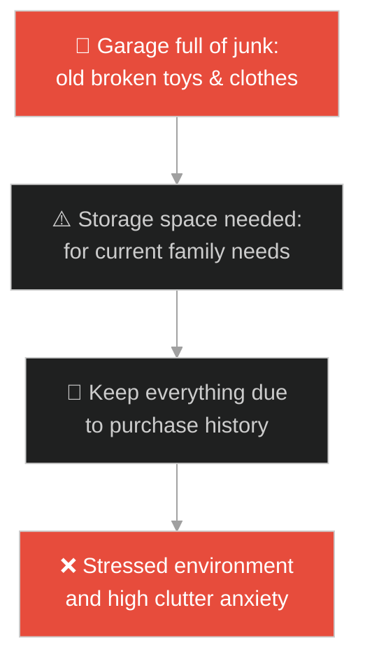
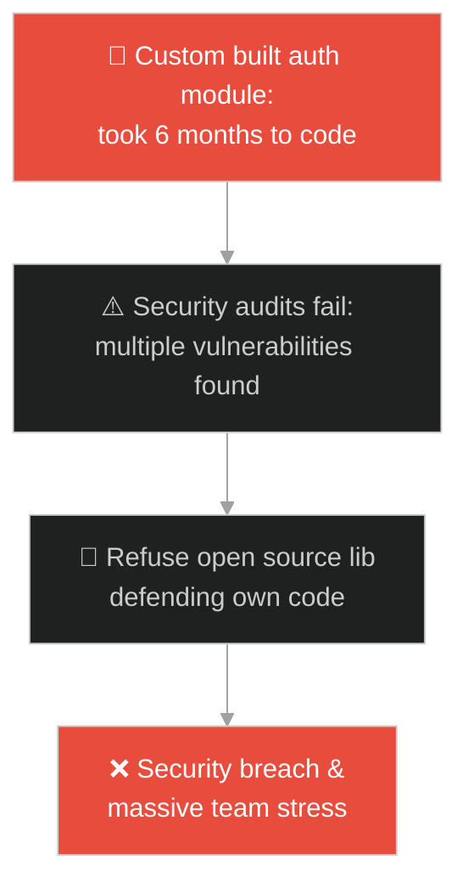
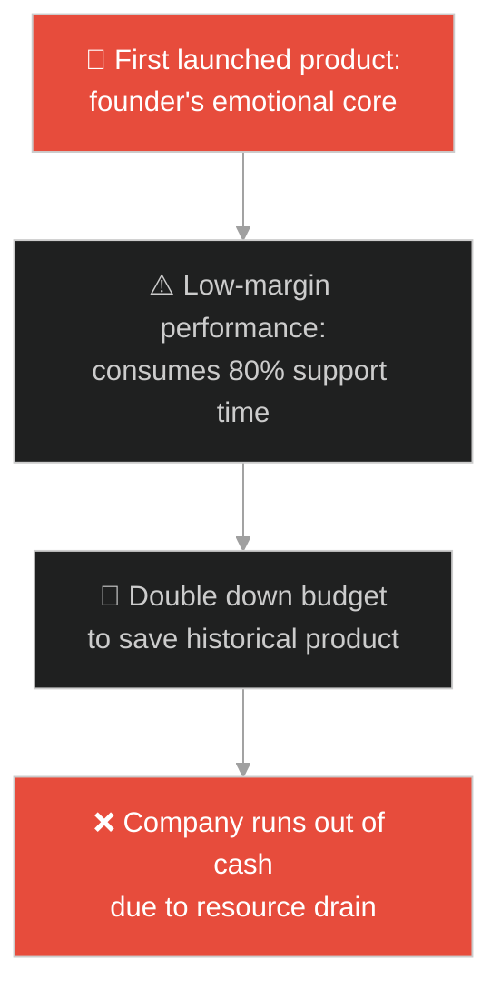
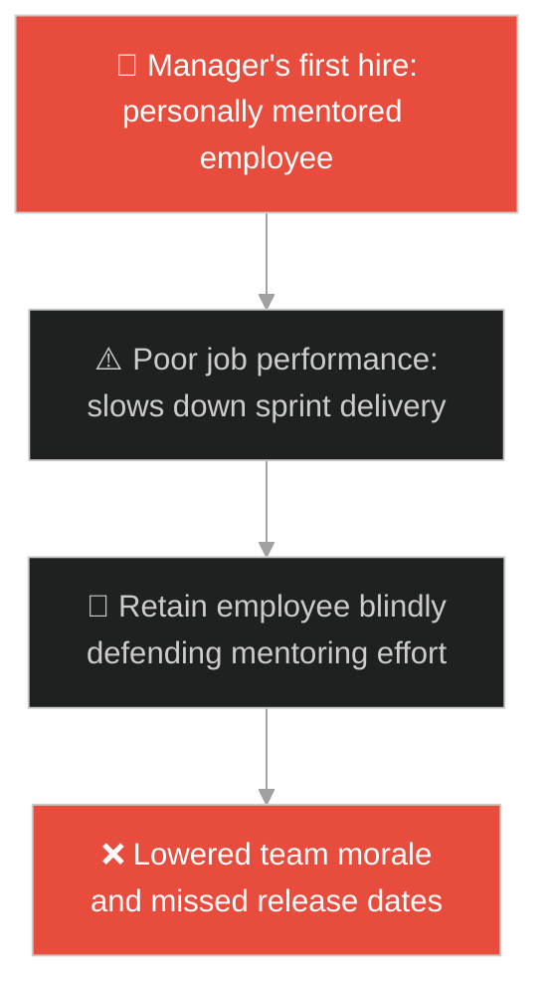
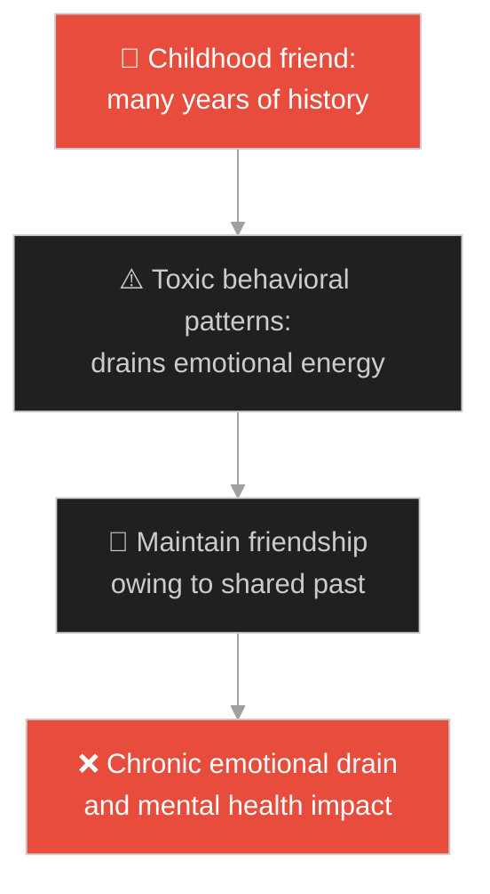
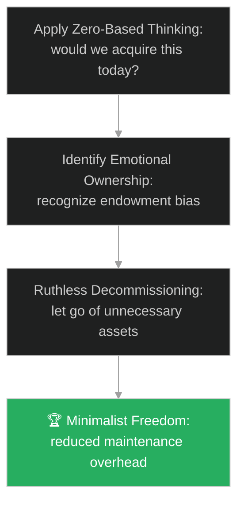

# Attachment & Endowment Effect (ការប្រកាន់ខ្ជាប់ និងលំអៀងនៃការកាន់កាប់)៖ កសិករ និងគោដែលបាត់ (Attachment & The Endowment Effect & The Farmer and the Lost Cows)

**Author:** ichamrong  
**Date:** 2026-05-28  
**Tags:** #buddhism #attachment #endowment-effect #minimalism #mental-models  
**Category:** Concepts / Parables  
**Read Time:** ~15 min  

---

## 📌 មាតិកា (Table of Contents)
- [អន្ទាក់ផ្លូវចិត្ត (The Trap)](#0)
- [១. រឿងព្រេងព្រះពុទ្ធសាសនា៖ កសិករដែលបាត់គោ (The Legend of the Farmer and the Lost Cows)](#1)
  - [សេចក្តីទុក្ខនៃការមាន និងសេរីភាពនៃការគ្មានគោ (The Suffering of Having and the Freedom of the Monks)](#1-1)
- [២. បញ្ហា៖ ការជាប់ជំពាក់នឹងប្រព័ន្ធចាស់ដែលបង្កើតដោយខ្លួនឯង (The Issue: The Endowment Effect and Attachment to Legacy Code)](#2)
- [៣. ឧទាហមណ៍ជាក់ស្តែងក្នុងពិភពពិត (Real World Examples)](#3)
  - [ឧទាហរណ៍ទី ១ — កម្រិតស្រាល (គ្រួសារ)៖ ការសន្សំសំរាម និងរបស់ចាស់ៗក្នុងផ្ទះ (Garage Clutter and Historical Purchase Attachment)](#3-1)
  - [ឧទាហរណ៍ទី ២ — កម្រិតមធ្យម (បច្ចេកទេស)៖ ការរក្សាទុកប្រព័ន្ធសុវត្ថិភាពដែលសរសេរដោយខ្លួនឯង (Refusing Third-Party Libraries for Insecure Custom Code)](#3-2)
  - [ឧទាហរណ៍ទី ៣ — កម្រិតមធ្យម (ធុរកិច្ច)៖ ការការពារផលិតផលដំបូងរបស់ក្រុមហ៊ុន (Doubling Down on the Founder's First Unprofitable Product)](#3-3)
  - [ឧទាហរណ៍ទី ៤ — កម្រិតមធ្យម (សង្គម/គ្រប់គ្រង)៖ ការការពារបុគ្គលិកដែលខ្លួនធ្លាប់ជ្រើសរើស (Retaining Poor Performers Due to Mentor Attachment)](#3-4)
  - [ឧទាហរណ៍ទី ៥ — កម្រិតធ្ងន់ (ទំនាក់ទំនង)៖ ការរក្សាមិត្តភាពពុលព្រោះតែប្រវត្តិសាស្ត្រយូរអង្វែង (Maintaining Toxic Friendships Due to Shared History)](#3-5)
- [៤. ដំណោះស្រាយទូទៅ៖ ការគិតដោយគ្មានការសន្មតជាមុន និងការលុបបំបាត់ទ្រព្យសម្បត្តិដែលជាបន្ទុក (The General Solution: Zero-Based Thinking and Ruthless Decommissioning)](#4)
- [សេចក្តីសន្និដ្ឋាន (Conclusion)](#5)
- [ឯកសារយោង (References)](#6)
- [Related Posts](#7)

---

<a id="0"></a>
## អន្ទាក់ផ្លូវចិត្ត (The Trap)

តើអ្នកធ្លាប់ជួបស្ថានភាពដែលអ្នក ឬក្រុមការងារ ចំណាយពេលវេលា និងថវិការាប់ពាន់ម៉ោង ដើម្បីជួសជុល និងថែទាំប្រព័ន្ធការងារចាស់មួយដែលដុះស្លែ គ្រាន់តែដោយសារតែ "យើងជាអ្នកសរសេរវាឡើងមកដោយផ្ទាល់ដៃ" ដែរឬទេ?

នៅក្នុងការគ្រប់គ្រងធនធាន និងគម្រោង៖
* **យើងងាយនឹងធ្លាក់ក្នុងអន្ទាក់** នៃការឱ្យតម្លៃរបស់ដែលយើងមានខ្ពស់ហួសពីការពិត (The Endowment Effect / Loss Aversion) ដែលប្រៀបដូចជាកសិករស្រឡាញ់គោ រហូតចង់សម្លាប់ខ្លួនពេលគោរត់បាត់។
* **យើងមើលរំលង** យន្តការលះបង់ចោល (Minimalism/Decommissioning) ដើម្បីរំដោះខ្លួន និងពេលវេលាដ៏មានតម្លៃឱ្យមានសេរីភាពពីបន្ទុកនៃការថែទាំប្រព័ន្ធដែលលែងមានប្រយោជន៍។

ការរងទុក្ខដោយសារការជាប់ជំពាក់នឹងកម្មសិទ្ធិ ហៅថា **អន្ទាក់បាត់គោរបស់កសិករ (The Cow-Ownership Stress Trap)**។

ដើម្បីយល់ដឹងពីរបៀបលះបង់បន្ទុកដើម្បីភាពសេរី នេះជាផែនទីបង្ហាញផ្លូវ៖
1. **រឿងព្រេងនិទាន (The Legend)** — រឿងរ៉ាវរបស់កសិករដែលបាត់គោរត់រកព្រះពុទ្ធទាំងភ័យស្លន់ស្លោ និងការលាន់មាត់របស់ព្រះអង្គអំពីសេរីភាពរបស់ភិក្ខុ។
2. **បញ្ហា (The Issue)** — ការវិភាគសេដ្ឋកិច្ចអាកប្បកិរិយាអំពីការខ្លាចបាត់បង់ និងការប្រកាន់ខ្ជាប់កូដចាស់ (Legacy code attachment)។
3. **ឧទាហមណ៍ជាក់ស្តែងក្នុងពិភពពិត (Real World Examples)** — ពិនិត្យមើលបញ្ហានេះក្នុងកម្រិតគ្រួសារ បច្ចេកវិទ្យា ធុរកិច្ច ការគ្រប់គ្រង និងទំនាក់ទំនង។
4. **ដំណោះស្រាយទូទៅ (The General Solution)** — ការអនុវត្តយុទ្ធសាស្ត្រគិតពីចំណុចសូន្យ (Zero-Based Thinking) និងការលុបកូដដែលគ្មានប្រយោជន៍ចោល។



---

<a id="1"></a>
## ១. រឿងព្រេងព្រះពុទ្ធសាសនា៖ កសិករដែលបាត់គោ (The Legend of the Farmer and the Lost Cows)

ថ្ងៃមួយ ព្រះសម្មាសម្ពុទ្ធ និងភិក្ខុសង្ឃជាច្រើនអង្គ កំពុងគង់សម្រាក និងធ្វើសមាធិយ៉ាងស្ងប់ស្ងាត់នៅក្រោមម្លប់ឈើត្រជាក់ក្នុងព្រៃមួយកន្លែង។ ស្រាប់តែមានកសិករម្នាក់រត់ដង្ហក់ ទឹកមុខស្លេកស្លាំង ញើសជោកខ្លួន ចូលមកទូលសួរព្រះពុទ្ធទាំងអន្ទះសារថា៖

> *«បពិត្រព្រះអង្គ! តើព្រះអង្គមានឃើញហ្វូងគោ ១២ក្បាល របស់ទូលបង្គំរត់កាត់តាមផ្លូវនេះដែរឬទេ? ទូលបង្គំកំពុងស្វែងរកពួកវាពេញមួយព្រឹកហើយ បើរកមិនឃើញទេ ជីវិតទូលបង្គំនឹងត្រូវវិនាសអស់ ព្រោះស្រែចម្ការរបស់ទូលបង្គំក៏ត្រូវសត្វល្អិតបំផ្លាញអស់ដែរ។ ទូលបង្គំចង់តែស្លាប់ទេ!»*

ព្រះពុទ្ធទ្រង់ស្តាប់ហើយ ក៏មានបន្ទូលដោយព្រះសីលធម៌ស្ងប់ថា៖
* *«ម្នាលឧបាសក តថាគត និងភិក្ខុសង្ឃមិនបានឃើញគោរបស់ព្រះតេជគុណរត់កាត់តាមនេះឡើយ។ ចូរអ្នកបន្តដំណើរទៅរកតាមទិសខាងកើតនោះចុះ។»*
* កសិករនោះស្តាប់ហើយ ក៏ប្រញាប់រត់ចេញទៅស្វែងរកគោរបស់គាត់បន្តទាំងភ័យស្លន់ស្លោ។

---

<a id="1-1"></a>
### សេចក្តីទុក្ខនៃការមាន និងសេរីភាពនៃការគ្មានគោ (The Suffering of Having and the Freedom of the Monks)

បន្ទាប់ពីកសិករនោះរត់ចាកចេញទៅបាត់ ព្រះសម្មាសម្ពុទ្ធទ្រង់បានងាកមកមានបន្ទូលទៅកាន់ភិក្ខុសង្ឃទាំងឡាយទាំងព្រះភក្ត្រញញឹមស្រស់ស្រាយថា៖
> «ម្នាលភិក្ខុទាំងឡាយ តើអ្នកទាំងអស់គ្នាដឹងទេថា អ្នកជាមនុស្សដែលមានសំណាង និងសេចក្តីសុខបំផុតនៅក្នុងព្រៃនេះ?»

ភិក្ខុសង្ឃទាំងឡាយមានសេចក្តីងឿងឆ្ងល់ជាខ្លាំង ទើបសួរទៅព្រះពុទ្ធវិញថា៖
* *«បពិត្រព្រះអង្គ! តើយើងសំណាងយ៉ាងដូចម្តេចទៅ បើយើងគ្មានផ្ទះសម្បែង គ្មានស្រែចម្ការ និងគ្មានប្រាក់កាសជាប់ខ្លួនសូម្បីតែបន្តិចនោះ?»*

ព្រះសម្មាសម្ពុទ្ធទ្រង់ឆ្លើយតបវិញយ៉ាងជ្រាលជ្រៅថា៖
> «សំណាងត្រង់ថា អ្នកទាំងអស់គ្នា **គ្មានគោសូម្បីតែមួយក្បាលសម្រាប់ឱ្យបាត់បង់** នោះអី។ ការមានទ្រព្យសម្បត្តិ គឺមានសេចក្តីព្រួយបារម្ភ និងការយាមការពារ។ របស់ដែលអ្នកគិតថាខ្លួនឯងជាម្ចាស់ ទីបំផុតវានឹងត្រឡប់មកធ្វើជាម្ចាស់គ្រប់គ្រងសេចក្តីសុខក្នុងចិត្តរបស់អ្នកវិញ។»

---

<a id="2"></a>
## ២. បញ្ហា៖ ការជាប់ជំពាក់នឹងប្រព័ន្ធចាស់ដែលបង្កើតដោយខ្លួនឯង (The Issue: The Endowment Effect and Attachment to Legacy Code)

នៅក្នុងវិស្វកម្មកម្មវិធី បញ្ហាដែលជួបញឹកញាប់បំផុតគឺការដែលក្រុមការងារបដិសេធមិនព្រមប្តូរទៅប្រើប្រាស់ប្រព័ន្ធ Cloud ឬបណ្ណាល័យ Open-Source ដែលមានស្តង់ដារ ដោយសារតែពួកគេធ្លាប់បានចំណាយពេល ៦ខែសរសេរប្រព័ន្ធចាស់នោះដោយខ្លួនឯង (Custom-built Authentication or Database Sync Tools)។ ពួកគេឱ្យតម្លៃកូដរបស់ពួកគេខ្ពស់ពេក (Endowment Effect) ទោះបីជាកូដនោះពោរពេញដោយចន្លោះប្រហោងសុវត្ថិភាព និងបង្កើតបន្ទុកការងារយ៉ាងធ្ងន់ធ្ងរ៖

```java
// ប្រព័ន្ធសុវត្ថិភាពសរសេរដោយផ្ទាល់ដៃដែលក្រុមការងារបដិសេធមិនព្រមលុបចោល
public class CustomSecurityFramework {
    private final boolean isBuiltByUs = true;

    public void authenticate(String user) {
        if (isBuiltByUs) {
            // អន្ទាក់៖ ការពារកូដចាស់ទាំងដែលមិនមាន encryption ត្រឹមត្រូវ
            System.out.println("Executing custom insecure hashing algorithm built in 2018.");
            System.out.println("Anxiety: Spending 20 hours a week patching bugs manually.");
        } else {
            // ដំណោះស្រាយ៖ ប្តូរទៅប្រើ Auth0/Okta ដែលមានស្តង់ដារ និងគ្មានបន្ទុកថែទាំ
            System.out.println("Standard secure OAuth validation completed instantly.");
        }
    }
}
```

* **វិបត្តិនៃការខ្លាចបាត់បង់ (Loss Aversion)៖** ការយល់ឃើញថា ការលុបកូដចាស់ចោលគឺជាការខ្ជះខ្ជាយការខិតខំប្រឹងប្រែងពីមុន នាំឱ្យរក្សាទុកកូដរញ៉េរញ៉ៃចោលក្នុងប្រព័ន្ធ (Dead Code)។
* **ភាពជាទាសករនៃបច្ចេកវិទ្យា (Tool Fetishism)៖** ការចំណាយពេលយាមការពារ និងគ្រប់គ្រង microservices រាប់រយ ជំនួសឱ្យការផ្តោតលើមុខងារពិតប្រាកដដែលអតិថិជនត្រូវការ។

---

<a id="3"></a>
## ៣. ឧទាហមណ៍ជាក់ស្តែងក្នុងពិភពពិត

---

<a id="3-1"></a>
### ឧទាហរណ៍ទី ១ — កម្រិតស្រាល (គ្រួសារ)៖ ការសន្សំសំរាម និងរបស់ចាស់ៗក្នុងផ្ទះ (Garage Clutter and Historical Purchase Attachment)

គ្រួសារមួយសន្សំរបស់របរចាស់ៗដែលខូច និងសម្លៀកបំពាក់លែងពាក់ពេញក្នុងឃ្លាំងផ្ទុកឡាន (ផែនទី)។ ពួកគេមិនព្រមបោះចោល ឬបរិច្ចាគឡើយ ព្រោះគិតថា *"យើងធ្លាប់ទិញវាកាលពីមុនក្នុងតម្លៃថ្លៃ"* (លំអៀងនៃការកាន់កាប់)។ ជាលទ្ធផល ផ្ទះទាំងមូលគ្មានកន្លែងដើរ ពោរពេញដោយធូលី និងបង្កើតអារម្មណ៍តប់ប្រមល់រាល់ថ្ងៃ។



---

<a id="3-2"></a>
### ឧទាហរណ៍ទី ២ — កម្រិតមធ្យម (បច្ចេកទេស)៖ ការរក្សាទុកប្រព័ន្ធសុវត្ថិភាពដែលសរសេរដោយខ្លួនឯង (Refusing Third-Party Libraries for Insecure Custom Code)

អ្នកដឹកនាំបច្ចេកទេសម្នាក់បានបដិសេធមិនព្រមប្តូរទៅប្រើប្រាស់បណ្ណាល័យសុវត្ថិភាពស្តង់ដារ (ដូចជា OAuth/Keycloak) ឡើយ ព្រោះតែគាត់ជាអ្នកសរសេរប្រព័ន្ធ Login របស់ក្រុមហ៊ុនតាំងពីថ្ងៃដំបូង (គោរបស់គាត់)។ ទោះបីជាប្រព័ន្ធនោះរងការវាយប្រហារ និងមាន bug ជាញឹកញាប់ក៏ដោយ គាត់នៅតែចំណាយពេលចុងសប្តាហ៍ដើម្បី patch វា ជំនួសឱ្យការលុបវាចោល។



---

<a id="3-3"></a>
### ឧទាហរណ៍ទី ៣ — កម្រិតមធ្យម (ធុរកិច្ច)៖ ការការពារផលិតផលដំបូងរបស់ក្រុមហ៊ុន (Doubling Down on the Founder's First Unprofitable Product)

ក្រុមហ៊ុនមួយបានបង្កើតផលិតផលសូហ្វវែរដំបូងបង្អស់របស់ពួកគេកាលពី ៥ ឆ្នាំមុន។ ឥឡូវនេះ ផលិតផលនោះទទួលបានចំណូលត្រឹមតែ ១% នៃចំណូលសរុប ប៉ុន្តែប្រើប្រាស់ធនធានវិស្វករដល់ទៅ ៨០% សម្រាប់ការថែទាំ និងឆ្លើយតបនឹងការគាំង (គោចាស់)។ ស្ថាបនិកមិនព្រមបិទវាចោលឡើយ ព្រោះតែភាពរំជើបរំជួល និងប្រវត្តិសាស្ត្ររបស់វា ធ្វើឱ្យក្រុមហ៊ុនបាត់បង់ឱកាសបង្កើតផលិតផលថ្មីៗ។



---

<a id="3-4"></a>
### ឧទាហរណ៍ទី ៤ — កម្រិតមធ្យម (សង្គម/គ្រប់គ្រង)៖ ការការពារបុគ្គលិកដែលខ្លួនធ្លាប់ជ្រើសរើស (Retaining Poor Performers Due to Mentor Attachment)

អ្នកគ្រប់គ្រងម្នាក់បានជ្រើសរើស និងបណ្តុះបណ្តាលបុគ្គលិកម្នាក់ដោយផ្ទាល់ដៃ តាំងពីបុគ្គលិកនោះមិនទាន់ចេះអ្វីសោះ (គោរបស់គាត់)។ ឥឡូវនេះ បុគ្គលិកនោះធ្វើការងារយឺតយ៉ាវ និងមិនអាចដើរទាន់ល្បឿនរបស់ក្រុមឡើយ។ អ្នកគ្រប់គ្រងមិនព្រមចាត់វិធានការ ឬផ្លាស់ប្តូរតួនាទីរបស់គាត់ទេ ព្រោះតែការជាប់ជំពាក់នឹងការខិតខំប្រឹងប្រែង mentoring របស់ខ្លួនពីមុន។



---

<a id="3-5"></a>
### ឧទាហរណ៍ទី ៥ — កម្រិតធ្ងន់ (ទំនាក់ទំនង)៖ ការរក្សាមិត្តភាពពុលព្រោះតែប្រវត្តិសាស្ត្រយូរអង្វែង (Maintaining Toxic Friendships Due to Shared History)

មនុស្សម្នាក់មានមិត្តភក្តិម្នាក់ដែលតែងតែនិយាយដើម បង្អាប់ និងកេងប្រវ័ញ្ចលើរូបគាត់រាល់ពេលជួបគ្នា (មិត្តភាពពុល)។ ទោះជាយ៉ាងណា គាត់មិនព្រមដើរចេញពីមិត្តភាពនេះឡើយ ដោយគិតថា *"យើងធ្លាប់ជាមិត្តរួមថ្នាក់គ្នាតាំងពីតូច និងមានប្រវត្តិសាស្ត្រជាមួយគ្នា ២០ ឆ្នាំ"* (ការជាប់ជំពាក់នឹងអតីតកាល)។ គាត់សុខចិត្តទ្រាំរងសម្ពាធផ្លូវចិត្តរាល់ថ្ងៃ ជំនួសឱ្យការលះបង់មិត្តភាពនោះចោល។



---

<a id="4"></a>
## ៤. ដំណោះស្រាយទូទៅ៖ ការគិតដោយគ្មានការសន្មតជាមុន និងការលុបបំបាត់ទ្រព្យសម្បត្តិដែលជាបន្ទុក (The General Solution: Zero-Based Thinking and Ruthless Decommissioning)

ដើម្បីដោះស្រាយការប្រកាន់ខ្ជាប់ និងអន្ទាក់នៃការកាន់កាប់ យើងត្រូវអនុវត្តប្រព័ន្ធគិតពីចំណុចសូន្យ៖



* **ការអនុវត្តការគិតពីចំណុចសូន្យ (Zero-Based Thinking)៖** រាល់ពេលវិភាគប្រព័ន្ធការងារ ចូរសួរសំណួរថា៖ *"ប្រសិនបើយើងមិនទាន់បានបង្កើតកូដនេះ ឬទិញឧបករណ៍នេះពីមុនមកទេ តើយើងនឹងព្រមចំណាយប្រាក់ និងពេលវេលាដើម្បីបង្កើត ឬទិញវានៅថ្ងៃនេះដែរឬទេ?"* ប្រសិនបើចម្លើយគឺ "ទេ" នោះអ្នកត្រូវលុបវាចោលភ្លាមៗដោយគ្មានការស្តាយស្រណោះ។
* **ការលុបកូដដែលលែងប្រើប្រាស់ចោលជាប្រចាំ (Ruthless Code Deletion)៖** លើកទឹកចិត្តក្រុមការងារឱ្យសប្បាយរីករាយនឹងការលុបកូដ (Delete lines of code) ច្រើនជាងការសរសេរបន្ថែម។ កូដដែលល្អបំផុតគឺគ្មានកូដ ព្រោះវាគ្មានបន្ទុកថែទាំ និងគ្មានថ្ងៃបង្កើត bug ឡើយ។
* **ការអនុវត្តជីវិតបែបចាកចេញ (Detached Stewardship)៖** ចាត់ទុកខ្លួនឯងត្រឹមតែជាអ្នកថែរក្សា (Steward) របស់របរ ឬប្រព័ន្ធការងារក្នុងរយៈពេលបណ្តោះអាសន្ន ប៉ុណ្ណោះ មិនមែនជាម្ចាស់ផ្តាច់មុខឡើយ។ ការគិតបែបនេះជួយឱ្យអ្នកងាយស្រួលផ្ទេរការងារ ឬបិទប្រព័ន្ធចាស់ចោលនៅពេលអស់ប្រយោជន៍។

---

## 🐇 ធ្លាក់ចូលក្នុងរន្ធទន្សាយ (Enter the Rabbit Hole)

ដើម្បីស្វែងយល់កាន់តែស៊ីជម្រៅអំពីរបៀបឆ្លងកាត់ការភាន់ច្រឡំ និងការមើលឃើញការពិតច្បាស់លាស់ សូមចាប់ផ្តើមដំណើររុករករបស់អ្នកដោយចុចលើតំណភ្ជាប់ខាងក្រោម៖

* 🚀 **[ចាប់ផ្តើមដំណើររុករក (Start the Journey) ➔ ពែងថ្នាំពុល (The Poisoned Cup)](./124-buddha-and-the-poisoned-cup.md)**

---

<a id="5"></a>
## សេចក្តីសន្និដ្ឋាន (Conclusion)

> **«របស់ដែលអ្នកជាម្ចាស់ ទីបំផុតវានឹងត្រឡប់មកធ្វើជាម្ចាស់របស់អ្នកវិញ។»**

សេចក្តីសុខមិនមែនកើតឡើងដោយសារការប្រមូលផ្តុំទ្រព្យសម្បត្តិ ឬការប្រមូលកូដឱ្យបានច្រើននោះទេ ប៉ុន្តែវាសម្រេចបានដោយសារការចេះលះបង់ចោលនូវអ្វីដែលជាបន្ទុក។ នៅពេលយើងលែងមាន "គោសម្រាប់ឱ្យបាត់បង់" នៅក្នុងចិត្ត យើងនឹងទទួលបាននូវសេរីភាពផ្លូវចិត្ត និងថាមពលពេញលេញដើម្បីបង្កើតដំណោះស្រាយថ្មីៗប្រកបដោយការច្នៃប្រឌិត។

---

<a id="6"></a>
## ឯកសារយោង (References)

* **Daniel Kahneman & Amos Tversky** — *Prospect Theory: An Analysis of Decision under Risk* (1979). Discovery of Loss Aversion and the Endowment Effect.
* **Dhammapada** — Verse 62: *"The fool worries: 'These sons are mine, this wealth is mine.' He himself is not his own; how then sons, how then wealth?"*
* **Marie Kondo** — *The Life-Changing Magic of Tidying Up* (2011). Organizing through active detachment and letting go of historical clutter.

---

<a id="7"></a>
## Related Posts

* [Letting Go of Legacy & Dogmatism](./116-buddha-and-the-raft.md) — The raft is a tool to cross, not to carry on your shoulders.
* [Solomon's Judgment and True Ownership](./37-king-solomon-and-the-divided-child.md) — Understanding the difference between renter ego and true owner selflessness.
