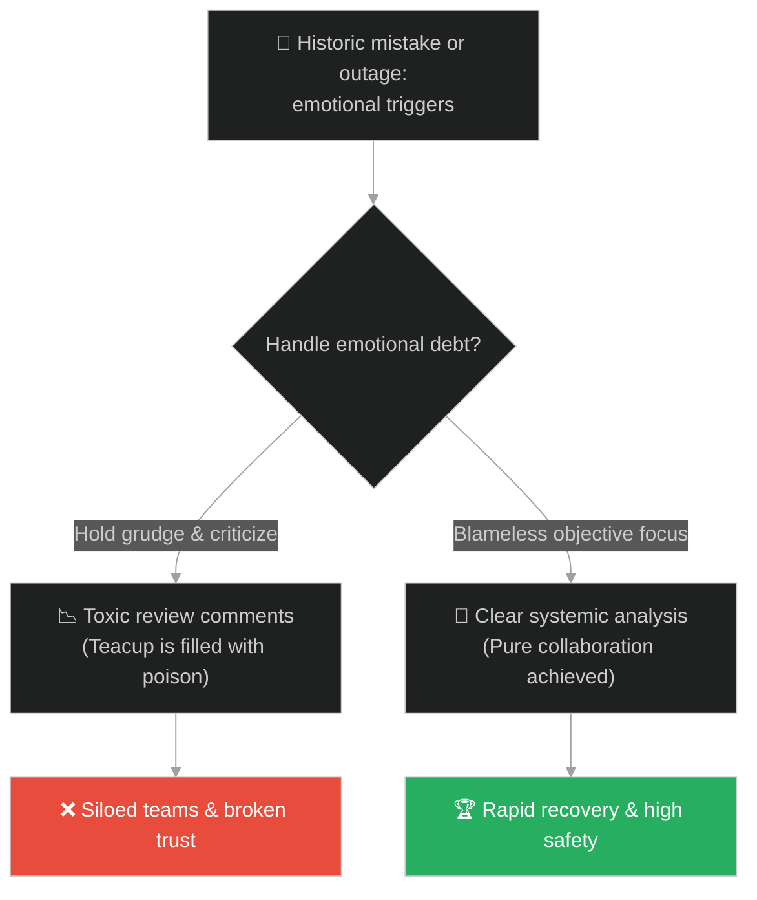
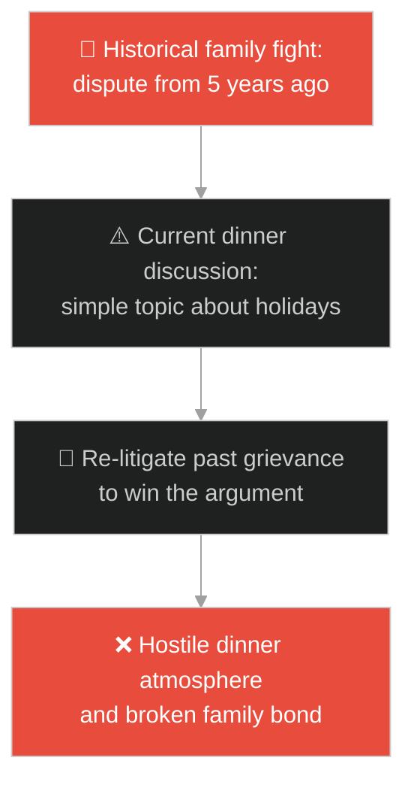
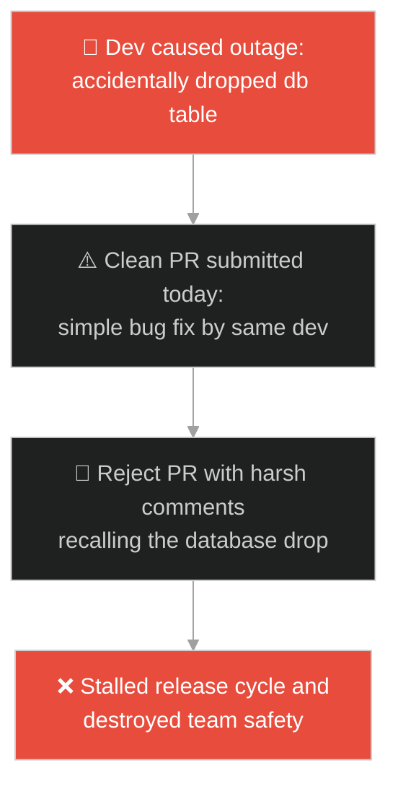
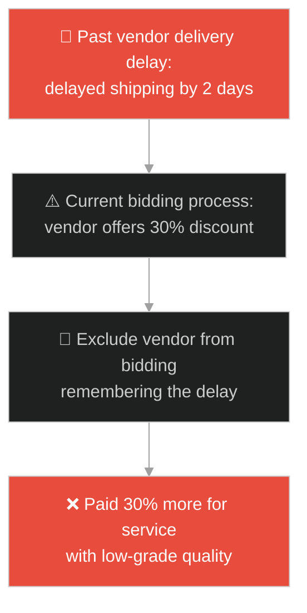
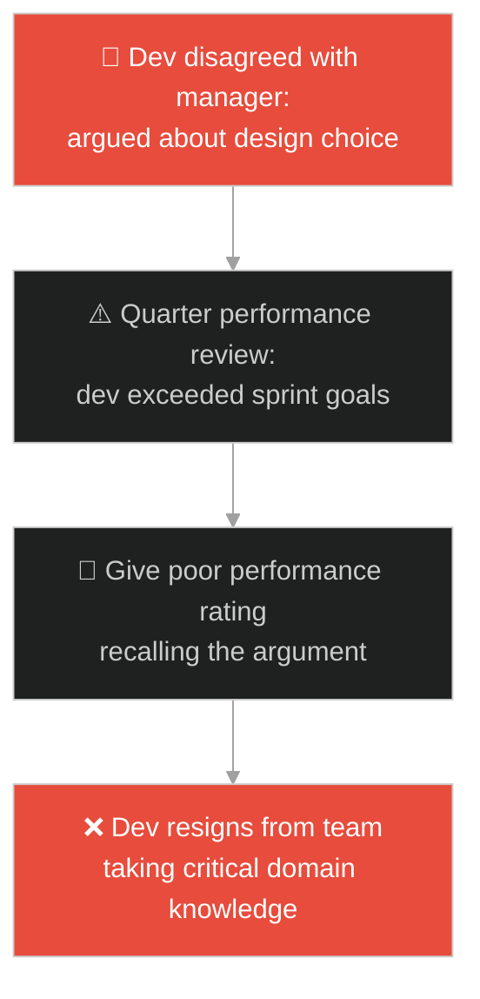
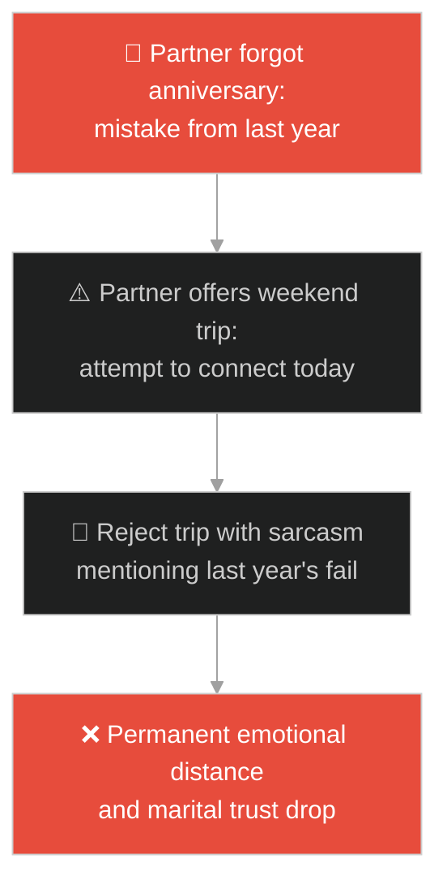
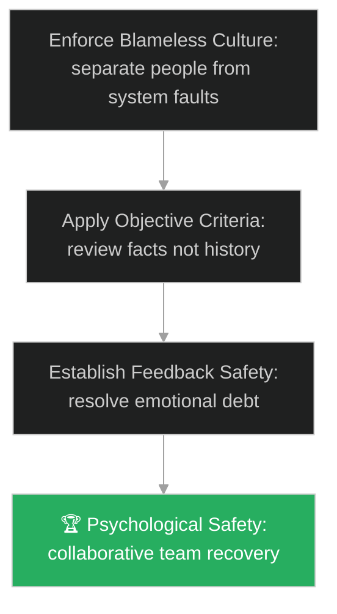

# Forgiveness & Resentment (ការអភ័យទោស និងការគុំកួន)៖ ពែងថ្នាំពុល (Forgiveness & Resentment & The Poisoned Cup)

**Author:** ichamrong  
**Date:** 2026-05-28  
**Tags:** #buddhism #forgiveness #resentment #mental-models #emotional-intelligence  
**Category:** Concepts / Parables  
**Read Time:** ~15 min  

---

## 📌 មាតិកា (Table of Contents)
- [អន្ទាក់ផ្លូវចិត្ត (The Trap)](#0)
- [១. រឿងព្រេងព្រះពុទ្ធសាសនា៖ ការផឹកថ្នាំពុល (The Legend of Drinking the Poison)](#1)
  - [អណ្តាតភ្លើងនៃដុំធ្យូងក្តៅក្នុងដៃ (The Analogy of the Hot Coal)](#1-1)
- [២. បញ្ហា៖ ការចងគំនុំបច្ចេកទេស និងការបំផ្លាញសុវត្ថិភាពផ្លូវចិត្តក្នុងក្រុម (The Issue: Technical Grudges and the Destruction of Psychological Safety)](#2)
- [៣. ឧទាហមណ៍ជាក់ស្តែងក្នុងពិភពពិត (Real World Examples)](#3)
  - [ឧទាហរណ៍ទី ១ — កម្រិតស្រាល (គ្រួសារ)៖ ការគាស់កកាយរឿងជម្លោះចាស់មកនិយាយឡើងវិញ (Bringing Up Past Family Grudges at Dinner)](#3-1)
  - [ឧទាហរណ៍ទី ២ — កម្រិតមធ្យម (បច្ចេកទេស)៖ ការបដិសេធកូដរបស់សមាជិកដែលធ្លាប់បង្កកំហុស (Rejecting PRs due to Past Incidents)](#3-2)
  - [ឧទាហរណ៍ទី ៣ — កម្រិតមធ្យម (ធុរកិច្ច)៖ ការបដិសេធមិនធ្វើការជាមួយដៃគូដែលធ្លាប់យឺតយ៉ាវ (Blacklisting Vendors for Minor Historic Delivery Lapses)](#3-3)
  - [ឧទាហរណ៍ទី ៤ — កម្រិតមធ្យម (សង្គម/គ្រប់គ្រង)៖ ការវាយតម្លៃទាបដោយសារការខ្វែងគំនិតគ្នាក្នុងការប្រជុំ (Manager Grade Penalties for Architecture Disagreement)](#3-4)
  - [ឧទាហរណ៍ទី ៥ — កម្រិតធ្ងន់ (ទំនាក់ទំនង)៖ ការកត់ត្រាកំហុសរបស់ដៃគូទុកក្នុងចិត្ត (Keeping an Emotional Scorecard in Relationships)](#3-5)
- [៤. ដំណោះស្រាយទូទៅ៖ ការវិភាគបែបគ្មានការស្តីបន្ទោស និងការវាយតម្លៃដោយវត្ថុបំណង (The General Solution: Blameless Post-Mortems and Objective Metrics)](#4)
- [សេចក្តីសន្និដ្ឋាន (Conclusion)](#5)
- [ឯកសារយោង (References)](#6)
- [Related Posts](#7)

---

<a id="0"></a>
## អន្ទាក់ផ្លូវចិត្ត (The Trap)

តើអ្នកធ្លាប់ជួបស្ថានភាពដែលសមាជិកក្នុងក្រុម បដិសេធមិនព្រមសហការ ឬរិះគន់កូដរបស់មិត្តរួមការងារម្នាក់យ៉ាងខ្លាំងក្លា គ្រាន់តែដោយសារតែបុគ្គលនោះធ្លាប់បានធ្វើឱ្យប្រព័ន្ធ Cloud គាំងកាលពី ២ ខែមុនដែរឬទេ?

នៅក្នុងវប្បធម៌ការងារ និងកិច្ចសហការ៖
* **យើងងាយនឹងធ្លាក់ក្នុងអន្ទាក់** នៃការរក្សាទុកកំហឹង និងការគុំកួន (Resentment/Grudge-Holding) ដែលប្រៀបដូចជាការផឹកថ្នាំពុលដោយខ្លួនឯង តែរំពឹងថាអ្នកដទៃនឹងរងទុក្ខជំនួស។
* **យើងមើលរំលង** យន្តការយល់ដឹងពីប្រព័ន្ធ (Systemic Blamelessness) ដោយផ្តោតលើការស្តីបន្ទោស និងការដាក់ទណ្ឌកម្មអារម្មណ៍បុគ្គល ដែលបំផ្លាញសុវត្ថិភាពផ្លូវចិត្តរបស់ក្រុមទាំងស្រុង។

ការបំផ្លាញកិច្ចសហការដោយសារកំហឹងអតីតកាល ហៅថា **អន្ទាក់ផឹកថ្នាំពុលគុំកួន (The Grudge-Holding Poison Trap)**។

ដើម្បីយល់ដឹងពីរបៀបបង្កើតបរិយាកាសការងារគ្មានការស្តីបន្ទោស នេះជាផែនទីបង្ហាញផ្លូវ៖
1. **រឿងព្រេងនិទាន (The Legend)** — រឿងរ៉ាវរបស់ព្រះពុទ្ធពន្យល់ពីទោសនៃការចងគំនុំ ដូចជាការផឹកថ្នាំពុល និងការកាន់ដុំធ្យូងក្តៅគប់គេ។
2. **បញ្ហា (The Issue)** — ការវិភាគចិត្តវិទ្យានៃ Rumination និងផលប៉ះពាល់នៃការចងគំនុំបច្ចេកទេស (Toxic Code Reviews)។
3. **ឧទាហមណ៍ជាក់ស្តែងក្នុងពិភពពិត (Real World Examples)** — ពិនិត្យមើលបញ្ហានេះក្នុងកម្រិតគ្រួសារ បច្ចេកវិទ្យា ធុរកិច្ច ការគ្រប់គ្រង និងទំនាក់ទំនង។
4. **ដំណោះស្រាយទូទៅ (The General Solution)** — ការអនុវត្តយន្តការវិភាគកំហុសដោយគ្មានការស្តីបន្ទោស (Blameless Post-Mortems)។



---

<a id="1"></a>
## ១. រឿងព្រេងព្រះពុទ្ធសាសនា៖ ការផឹកថ្នាំពុល (The Legend of Drinking the Poison)

នេះគឺជាទស្សនវិជ្ជាព្រះពុទ្ធសាសនាដ៏មានតម្លៃបំផុតមួយ៖

មានបុរសម្នាក់បានធ្វើដំណើរមកជួបព្រះសម្មាសម្ពុទ្ធដោយទឹកមុខស្រពោន។ គាត់បានក្រាបទូលសួរព្រះអង្គដោយចិត្តក្តៅក្រហាយថា៖
* *«បពិត្រព្រះអង្គ! តើហេតុអ្វីបានជាទូលបង្គំមិនអាចរកសេចក្តីសុខឃើញសោះ? ទូលបង្គំតែងតែនឹកឃើញដល់មនុស្សដែលធ្លាប់បានក្បត់ បង្កាច់បង្ខូច និងធ្វើបាបទូលបង្គំកាលពីអតីតកាល។ រាល់ពេលនឹកឃើញ ទូលបង្គំខឹងខ្លាំងណាស់!»*

ព្រះពុទ្ធទ្រង់បានសម្តែងព្រះពុទ្ធដីកាយ៉ាងត្រជាក់ស្ងប់ថា៖
> «ម្នាលឧបាសក ការខឹងសម្បារ និងការគុំកួនអ្នកដទៃ (Resentment) គឺប្រៀបដូចជាអ្នកកំពុងផឹកថ្នាំពុលដោយខ្លួនឯង ប៉ុន្តែបែរជារំពឹងថាមនុស្សដែលអ្នកខឹងនោះនឹងស្លាប់ជំនួសអ្នកទៅវិញ។»

---

<a id="1-1"></a>
### អណ្តាតភ្លើងនៃដុំធ្យូងក្តៅក្នុងដៃ (The Analogy of the Hot Coal)

ព្រះពុទ្ធទ្រង់បានបន្តបន្ទូលទៀតថា៖
* *«នៅពេលដែលអ្នកខឹងនរណាម្នាក់ អ្នកប្រៀបដូចជាកំពុងចាប់កាន់ដុំធ្យូងភ្លើងដ៏ក្តៅគគុកនៅក្នុងបាតដៃ ដោយមានបំណងចង់គប់វាទៅលើសត្រូវរបស់អ្នក។»*
* *«ប៉ុន្តែមុននឹងដុំធ្យូងនោះហោះទៅត្រូវគេ អ្នកដែលត្រូវរលាកពងបែក និងឈឺចាប់ខ្លាំងជាងគេ គឺបាតដៃរបស់អ្នកផ្ទាល់។ សត្រូវរបស់អ្នកប្រហែលជាកំពុងសើចសប្បាយយ៉ាងមានសេរីភាព តែអ្នកកំពុងរស់នៅក្នុងគុកងងឹតនៃកំហឹងខ្លួនឯង។»*
* បុរសនោះស្តាប់ហើយ ក៏យល់ច្បាស់ពីបន្ទុកផ្លូវចិត្តដែលគាត់បានពពាក់ពពូនអស់ជាច្រើនឆ្នាំ រួចសម្រេចចិត្តទម្លាក់ដុំធ្យូងនោះចោលភ្លាមៗ។

---

<a id="2"></a>
## ២. បញ្ហា៖ ការចងគំនុំបច្ចេកទេស និងការបំផ្លាញសុវត្ថិភាពផ្លូវចិត្តក្នុងក្រុម (The Issue: Technical Grudges and the Destruction of Psychological Safety)

នៅក្នុងបរិយាកាសអភិវឌ្ឍន៍សូហ្វវែរ ការចងគំនុំបច្ចេកទេស (Technical Grudges) កើតឡើងនៅពេលដែលវិស្សករ Senior មិនព្រមអនុម័តកូដ (Reject Pull Request) របស់សមាជិកម្នាក់ គ្រាន់តែដោយសារបុគ្គលនោះធ្លាប់បានបណ្តាលឱ្យមាន Network incident កាលពីខែមុន។ ពួកគេសរសេរមតិរិះគន់បែបឌឺដង និងគ្មានស្ថាបនា ដែលធ្វើឱ្យខូចដំណើរការគម្រោង៖

```java
// ការត្រួតពិនិត្យកូដបែបពុលដោយសារការចងកំហុសអតីតកាល
public class ToxicReviewWorkflow {
    private final boolean hasPersonalGrudge = true;

    public void reviewPullRequest(String author, String codeChange) {
        if (hasPersonalGrudge && author.equals("JuniorDeveloper")) {
            // អន្ទាក់៖ បដិសេធកូដព្រោះតែធ្លាប់មានបញ្ហាពីមុន ទោះបីជាកូដថ្ងៃនេះល្អក៏ដោយ
            System.out.println("Review: Rejected! Remember when you dropped the DB last month?");
            System.out.println("Action: Intentionally delaying merge to show authority.");
        } else {
            // ដំណោះស្រាយ៖ វាយតម្លៃកូដដោយផ្អែកលើបច្ចុប្បន្ន និងវត្ថុបំណង
            System.out.println("Review: Passed! The current code changes meet coding standards.");
        }
    }
}
```

* **ការបាត់បង់សុវត្ថិភាពផ្លូវចិត្ត (Psychological Safety Breakdown)៖** សមាជិកក្រុមចាប់ផ្តើមលាក់បាំងកំហុស និងមិនហ៊ានសួរនាំសួរសំណួរព្រោះខ្លាចត្រូវបានគេចងចាំ និងដាក់ទណ្ឌកម្មនាពេលក្រោយ។
* **វិបត្តិអត្តនោម័តនិយម (Subjective Reviews)៖** ការយករឿងបុគ្គលមកលាយឡំនឹងការសម្រេចចិត្តបច្ចេកវិទ្យា ធ្វើឱ្យស្ថាបត្យកម្មប្រព័ន្ធចុះខ្សោយ។

---

<a id="3"></a>
## ៣. ឧទាហមណ៍ជាក់ស្តែងក្នុងពិភពពិត

---

<a id="3-1"></a>
### ឧទាហរណ៍ទី ១ — កម្រិតស្រាល (គ្រួសារ)៖ ការគាស់កកាយរឿងជម្លោះចាស់មកនិយាយឡើងវិញ (Bringing Up Past Family Grudges at Dinner)

ក្នុងពេលទទួលទានអាហារជួបជុំគ្រួសារ ប្អូនប្រុសបានធ្វើឱ្យកំពប់ទឹកកែវធម្មតា (កំហុសបច្ចុប្បន្ន)។ បងស្រីដែលនៅខឹងរឿងប្អូនខ្ចីសៀវភៅមិនសងកាលពី ៥ ឆ្នាំមុន បានចាប់ផ្តើមជេរប្រមាថ និងគាស់កកាយរឿងចាស់មកនិយាយ (ផឹកថ្នាំពុល) ធ្វើឱ្យបរិយាកាសអាហារល្ងាចទាំងមូលត្រូវខូចខាត និងបង្កើតការឈឺចាប់ដល់ឪពុកម្តាយ។



---

<a id="3-2"></a>
### ឧទាហរណ៍ទី ២ — កម្រិតមធ្យម (បច្ចេកទេស)៖ ការបដិសេធកូដរបស់សមាជិកដែលធ្លាប់បង្កកំហុស (Rejecting PRs due to Past Incidents)

អ្នកអភិវឌ្ឍន៍ម្នាក់បានសរសេរកូដកែសម្រួល bug មួយដ៏ល្អត្រឹមត្រូវ (ផ្លែស្ត្របឺរី)។ ទោះជាយ៉ាងណា SRE Lead ដែលនៅខឹងព្រោះអ្នកនោះធ្លាប់ធ្វើឱ្យ Database ធ្លាក់ចុះកាលពីខែមុន បានសរសេរមតិច្រានចោល PR នោះដោយគ្មានការវិភាគកូដបច្ចុប្បន្ន (កាន់ធ្យូងក្តៅ) ដែលធ្វើឱ្យការព្យាបាលប្រព័ន្ធពិតប្រាកដត្រូវអូសបន្លាយពេលយូរ។



---

<a id="3-3"></a>
### ឧទាហរណ៍ទី ៣ — កម្រិតមធ្យម (ធុរកិច្ច)៖ ការបដិសេធមិនធ្វើការជាមួយដៃគូដែលធ្លាប់យឺតយ៉ាវ (Blacklisting Vendors for Minor Historic Delivery Lapses)

ក្រុមហ៊ុនមួយបានបដិសេធដាច់ខាតមិនទិញវត្ថុធាតុដើមពីអ្នកផ្គត់ផ្គង់ម្នាក់ ទោះបីជាអ្នកនោះផ្តល់តម្លៃបញ្ចុះតម្លៃរហូតដល់ ៣០% នៅថ្ងៃនេះក៏ដោយ។ មូលហេតុគឺដោយសារតែអ្នកផ្គត់ផ្គង់នោះធ្លាប់បានដឹកជញ្ជូនយឺតយ៉ាវ ២ ថ្ងៃកាលពី ៣ ឆ្នាំមុន (គុំកួន)។ ជាលទ្ធផល ក្រុមហ៊ុនត្រូវចំណាយប្រាក់ទិញពីប្រភពផ្សេងដែលថ្លៃជាង និងមានគុណភាពទាបជាង។



---

<a id="3-4"></a>
### ឧទាហរណ៍ទី ៤ — កម្រិតមធ្យម (សង្គម/គ្រប់គ្រង)៖ ការវាយតម្លៃទាបដោយសារការខ្វែងគំនិតគ្នាក្នុងការប្រជុំ (Manager Grade Penalties for Architecture Disagreement)

វិស្វករម្នាក់ធ្លាប់បានប្រកែកយ៉ាងខ្លាំងខ្លាជាមួយប្រធានគ្រប់គ្រង អំពីការរចនាប្រព័ន្ធព័ត៌មានកាលពីដើមឆ្នាំ។ នៅក្នុងការវាយតម្លៃលទ្ធផលការងារចុងឆ្នាំ ទោះបីជាវិស្វករនោះសម្រេចការងារបានលើសផែនការក៏ដោយ ប្រធាននៅតែដាក់ពិន្ទុទាប និងមិនដំឡើងប្រាក់ខែឱ្យគាត់ ព្រោះនៅគុំកួននឹងការប្រកែកគ្នាពីមុន ដែលបណ្តាលឱ្យវិស្វករនោះសម្រេចចិត្តលាលែងពីការងារ។



---

<a id="3-5"></a>
### ឧទាហរណ៍ទី ៥ — កម្រិតធ្ងន់ (ទំនាក់ទំនង)៖ ការកត់ត្រាកំហុសរបស់ដៃគូទុកក្នុងចិត្ត (Keeping an Emotional Scorecard in Relationships)

ប្តីបានភ្លេចទិញកាដូខួបអាពាហ៍ពិពាហ៍កាលពីឆ្នាំមុន។ ឆ្នាំនេះ ប្តីបានរៀបចំដំណើរការកម្សាន្តចុងសប្តាហ៍យ៉ាងពិសេស (ផ្លែស្ត្របឺរី) ដើម្បីសុំទោស។ ប៉ុន្តែប្រពន្ធបដិសេធមិនព្រមទៅ និងនិយាយឌឺដងដាក់ប្តីរាល់ថ្ងៃដោយរំលឹកកំហុសចាស់ (ចងគំនុំ) ដែលនាំឱ្យប្តីមានអារម្មណ៍ធុញទ្រាន់ និងដើរឆ្ងាយចេញពីទំនាក់ទំនងបន្តិចម្តងៗ។



---

<a id="4"></a>
## ៤. ដំណោះស្រាយទូទៅ៖ ការវិភាគបែបគ្មានការស្តីបន្ទោស និងការវាយតម្លៃដោយវត្ថុបំណង (The General Solution: Blameless Post-Mortems and Objective Metrics)

ដើម្បីជម្រះការគុំកួន និងកំហឹងក្នុងក្រុមការងារ យើងត្រូវអនុវត្តប្រព័ន្ធវាយតម្លៃដោយគ្មានការស្តីបន្ទោស៖



* **ការបង្កើតទម្លាប់វិភាគកំហុសដោយគ្មានការស្តីបន្ទោស (Blameless Post-Mortems)៖** នៅពេលមានបញ្ហាប្រព័ន្ធគាំង មិនត្រូវសួររកមុខអ្នកបង្កដើម្បីស្តីបន្ទោសឡើយ។ ត្រូវចោទសួរថា៖ *"តើប្រព័ន្ធខ្វះយន្តការការពារអ្វីខ្លះ ទើបអនុញ្ញាតឱ្យកំហុសរបស់មនុស្សម្នាក់អាចបំផ្លាញទិន្នន័យបាន?"* ភាពស្មោះត្រង់នេះជួយឱ្យក្រុមហ៊ានសារភាព និងកែសម្រួលប្រព័ន្ធរួមគ្នា។
* **ការកំណត់គោលការណ៍ត្រួតពិនិត្យកូដច្បាស់លាស់ (Objective Review Guidelines)៖** បង្កើតច្បាប់ត្រួតពិនិត្យកូដដែលផ្តោតលើគុណភាព បច្ចេកវិទ្យា និងសុវត្ថិភាពជាក់ស្តែង។ ហាមឃាត់ការប្រើប្រាស់ពាក្យពេចន៍រិះគន់បុគ្គល ឬការរំលឹកកំហុសអតីតកាលក្នុងប្រព័ន្ធ Git comments។
* **ការអនុវត្ត "ការលុបបំណុលអារម្មណ៍" (Resolving Emotional Debt)៖** ប្រសិនបើមានជម្លោះកើតឡើង ត្រូវដោះស្រាយវាភ្លាមៗក្នុងរយៈពេល ២៤ ម៉ោង។ ជៀសវាងការទុកគំនុំឱ្យកកកុញរ៉ាំរ៉ៃក្នុងចិត្ត ដែលនឹងប្រែទៅជាជាតិពុលបំផ្លាញកិច្ចសហការ។

---

## 🐇 ធ្លាក់ចូលក្នុងរន្ធទន្សាយ (Enter the Rabbit Hole)

ដើម្បីស្វែងយល់កាន់តែស៊ីជម្រៅអំពីរបៀបឆ្លងកាត់ការភាន់ច្រឡំ និងការមើលឃើញការពិតច្បាស់លាស់ សូមចាប់ផ្តើមដំណើររុករករបស់អ្នកដោយចុចលើតំណភ្ជាប់ខាងក្រោម៖

* 🚀 **[ចាប់ផ្តើមដំណើររុករក (Start the Journey) ➔ ចិត្តស្វា (The Monkey Mind)](./125-buddha-and-the-monkey-mind.md)**

---

<a id="5"></a>
## សេចក្តីសន្និដ្ឋាន (Conclusion)

> **«កុំបន្តចំណាយថ្ងៃនេះរបស់អ្នក ដើម្បីបង់ថ្លៃឱ្យកំហុសរបស់អ្នកដទៃកាលពីម្សិលមិញ។»**

ការអភ័យទោស និងការលះបង់កំហឹង មិនមែនធ្វើឡើងដើម្បីសម្របសម្រួលនឹងទង្វើខុសឆ្គងឡើយ ប៉ុន្តែវាធ្វើឡើងដើម្បីដោះលែងខ្លួនយើងឱ្យមានសេរីភាព។ នៅពេលយើងយល់ព្រមទម្លាក់ដុំធ្យូងក្តៅនៃសេចក្តីគុំកួនចោល យើងនឹងទទួលបាននូវថាមពល និងចិត្តស្ងប់ដើម្បីដឹកនាំក្រុមការងារឆ្ពោះទៅរកភាពរីកចម្រើនពិតប្រាកដ។

---

<a id="6"></a>
## ឯកសារយោង (References)

* **Buddhaghosa** — *Visuddhimagga (The Path of Purification)* (5th century). Source of the hot coal and poisoned cup analogies for anger.
* **Robert Enright** — *Forgiveness Is a Choice* (2001). Clinical research on how practicing forgiveness resolves chronic depression and anger in teams.
* **John Allspaw** — *Blameless Post-Mortems and a Just Culture* (2012). Essential SRE methodology for decoupling human error from system improvements.

---

<a id="7"></a>
## Related Posts

* [Incident Response & Blameless Post-Mortems](./46-the-successful-failure.md) — How Apollo 13 incident management teaches blameless execution.
* [Solomon's Ring](./40-solomons-ring.md) — Finding resilience to remain calm and neutral under personal attacks.
