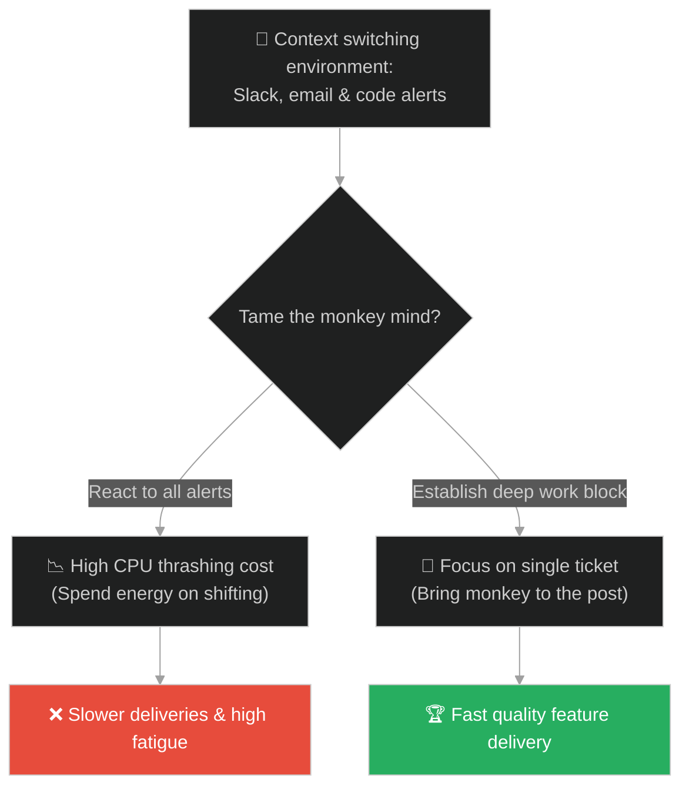
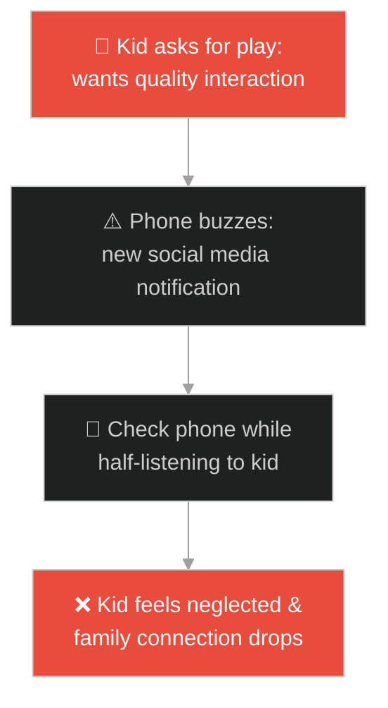
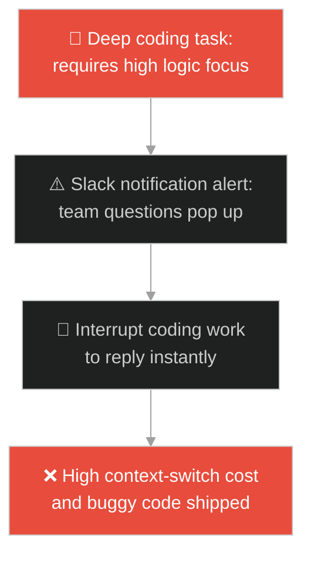
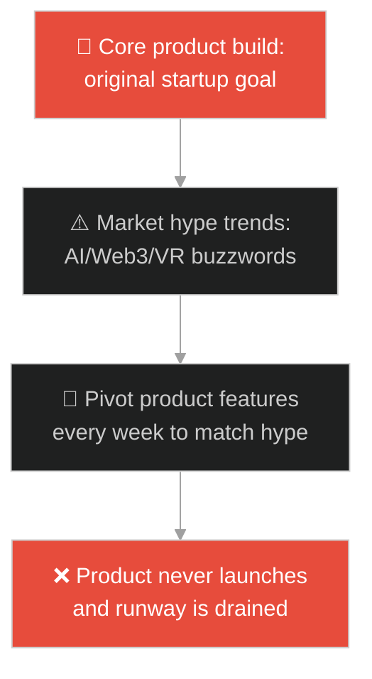
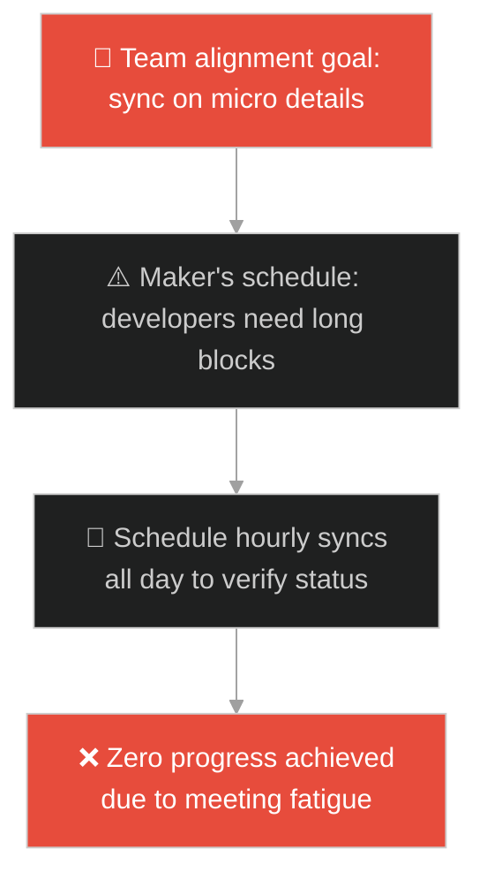
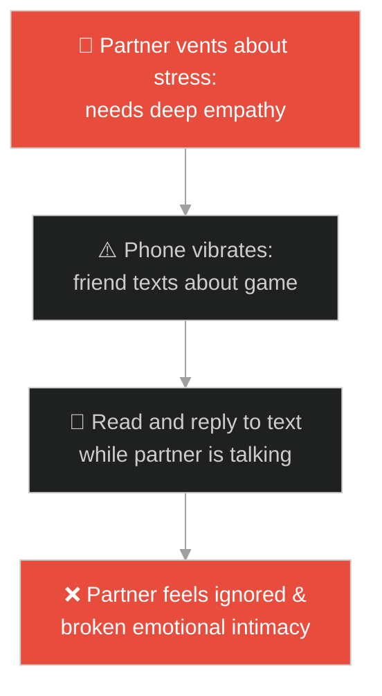
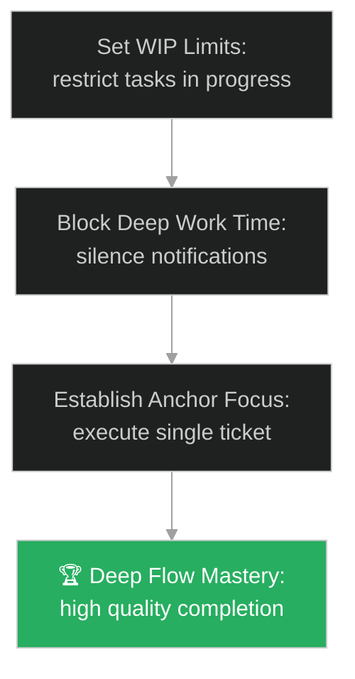

# Focus & Context Switching (ការផ្តោតអារម្មណ៍ និងការផ្លាស់ប្តូរបរិបទ)៖ ចិត្តស្វា (Focus & Context Switching & The Monkey Mind)

**Author:** ichamrong  
**Date:** 2026-05-28  
**Tags:** #buddhism #mindfulness #monkey-mind #focus #mental-models  
**Category:** Concepts / Parables  
**Read Time:** ~15 min  

---

## 📌 មាតិកា (Table of Contents)
- [អន្ទាក់ផ្លូវចិត្ត (The Trap)](#0)
- [១. រឿងព្រេងព្រះពុទ្ធសាសនា៖ ចិត្តដូចសត្វស្វា (The Legend of Kapicitta)](#1)
  - [ការចងសត្វស្វាឱ្យនៅនឹងបង្គោល (Taming the Leaping Monkey)](#1-1)
- [២. បញ្ហា៖ ការផ្លាស់ប្តូរបរិបទញឹកញាប់ និងការបំផ្លាញពេលវេលាផ្តោតអារម្មណ៍ (The Issue: High Context-Switching and the Thrashing CPU Trap)](#2)
- [៣. ឧទាហមណ៍ជាក់ស្តែងក្នុងពិភពពិត (Real World Examples)](#3)
  - [ឧទាហរណ៍ទី ១ — កម្រិតស្រាល (គ្រួសារ)៖ ការលេងជាមួយកូនខណៈពេលមើលទូរស័ព្ទ (Checking Notifications During Kid Playtime)](#3-1)
  - [ឧទាហរណ៍ទី ២ — កម្រិតមធ្យម (បច្ចេកទេស)៖ ការសរសេរកូដបណ្តើរឆ្លើយតប Slack បណ្តើរ (Coding Interrupted by Constantly Replying to Chat Alerts)](#3-2)
  - [ឧទាហរណ៍ទី ៣ — កម្រិតមធ្យម (ធុរកិច្ច)៖ ការផ្លាស់ប្តូរយុទ្ធសាស្ត្រផលិតផលតាមរលកព័ត៌មាន (Startup Pivoting Strategies Based on Tech Hype)](#3-3)
  - [ឧទាហរណ៍ទី ៤ — កម្រិតមធ្យម (សង្គម/គ្រប់គ្រង)៖ ការបង្កើតការប្រជុំខ្លីៗពេញមួយថ្ងៃ (Managers Scheduling Back-to-Back Sync Meetings)](#3-4)
  - [ឧទាហរណ៍ទី ៥ — កម្រិតធ្ងន់ (ទំនាក់ទំនង)៖ ការលេងទូរស័ព្ទក្នុងពេលជជែកគ្នាជាមួយដៃគូ (Reading Feeds While Partner is Sharing Work Stress)](#3-5)
- [៤. ដំណោះស្រាយទូទៅ៖ ការកំណត់ដែនការងារកំពុងធ្វើ និងការសន្សំសំចៃពេលវេលាផ្តោត (The General Solution: Establishing WIP Limits and Timeblocked Deep Work)](#4)
- [សេចក្តីសន្និដ្ឋាន (Conclusion)](#5)
- [ឯកសារយោង (References)](#6)
- [Related Posts](#7)

---

<a id="0"></a>
## អន្ទាក់ផ្លូវចិត្ត (The Trap)

តើអ្នកធ្លាប់ជួបបញ្ហាដែលអ្នកចំណាយពេលពេញមួយថ្ងៃរត់ចុះរត់ឡើង ឆ្លើយតបសារ សរសេរអ៊ីមែល និងចូលប្រជុំជាច្រើន ប៉ុន្តែនៅចុងបញ្ចប់នៃថ្ងៃការងារ អ្នករកឃើញថាកូដ ឬគម្រោងសំខាន់របស់ខ្លួនមិនទាន់បានចាប់ផ្តើមសូម្បីតែមួយបន្ទាត់ដែរឬទេ?

នៅក្នុងយុគសម័យសេដ្ឋកិច្ចនៃការទាក់ទាញចំណាប់អារម្មណ៍ (Attention Economy)៖
* **យើងងាយនឹងធ្លាក់ក្នុងអន្ទាក់** នៃការផ្លាស់ប្តូរបរិបទការងារញឹកញាប់ (Context Switching / Multitasking Illusion) ដែលធ្វើឱ្យខួរក្បាលហត់នឿយខ្លាំង និងបាត់បង់ផលិតភាពពិតប្រាកដ ដោយសារតែការរត់តាមការរំខាននៃសញ្ញាប្រកាសអាសន្ន (Alert Noise)។
* **យើងមើលរំលង** ការបង្កើតពេលវេលាផ្តោតអារម្មណ៍ស៊ីជម្រៅ (Deep Work) ដោយបណ្តោយឱ្យគំនិត និងចិត្តលោតចុះលោតឡើងដូចសត្វស្វាឥតឈប់ឈរ។

ការបាត់បង់ការផ្តោតអារម្មណ៍ដោយសារការផ្លាស់ប្តូរបរិបទ ហៅថា **អន្ទាក់ចិត្តស្វាលោតតោងមែកឈើ (The Context-Switching Thrashing Trap)**។

ដើម្បីយល់ដឹងពីរបៀបហ្វឹកហាត់ចិត្តឱ្យមានការផ្តោតអារម្មណ៍ខ្ពស់ នេះជាផែនទីបង្ហាញផ្លូវ៖
1. **រឿងព្រេងនិទាន (The Legend)** — រឿងរ៉ាវរបស់ព្រះពុទ្ធប្រៀបធៀបចិត្តមនុស្សទៅនឹងសត្វស្វា Kapicitta និងការចងវាឱ្យនៅនឹងបង្គោលដង្ហើម។
2. **បញ្ហា (The Issue)** — ការវិភាគការខូចខាត CPU របស់កុំព្យូទ័រ (CPU Thrashing) និងការបាត់បង់ពេលវេលាសរសេរកូដរបស់វិស្វករ។
3. **ឧទាហមណ៍ជាក់ស្តែងក្នុងពិភពពិត (Real World Examples)** — ពិនិត្យមើលបញ្ហានេះក្នុងកម្រិតគ្រួសារ បច្ចេកវិទ្យា ធុរកិច្ច ការគ្រប់គ្រង និងទំនាក់ទំនង។
4. **ដំណោះស្រាយទូទៅ (The General Solution)** — ការកំណត់ដែនការងារកំពុងធ្វើ (WIP Limits) និងការបង្កើត Focus Blocks។



---

<a id="1"></a>
## ១. រឿងព្រេងព្រះពុទ្ធសាសនា៖ ចិត្តដូចសត្វស្វា (The Legend of Kapicitta)

ព្រះសម្មាសម្ពុទ្ធទ្រង់បានសង្កេតឃើញថា ចិត្តរបស់មនុស្ស (Human Mind) មិនដែលនៅស្ងៀមមួយកន្លែងនោះឡើយ។ វាលោតចុះលោតឡើងពីគំនិតមួយទៅគំនិតមួយទៀត ពីភាពសោកសៅទៅភាពសប្បាយរីករាយ ពីការចងចាំក្នុងអតីតកាលទៅការស្រមើស្រមៃក្នុងអនាគត។

ព្រះអង្គទ្រង់បានប្រៀបធៀបចិត្តមនុស្សទៅនឹង៖
* **សត្វស្វា (Kapicitta - "The Monkey Mind")** ដែលរស់នៅក្នុងព្រៃដ៏ធំល្វឹងល្វើយ។
* សត្វស្វានេះ តែងតែលោតតោងពីមែកឈើមួយ ទៅមែកឈើមួយទៀតឥតឈប់ឈរ។ នៅពេលវាលែងដៃពីមែកមួយ វានឹងលោតទៅចាប់យកមែកមួយទៀតភ្លាមៗ ដោយមិនដែលអង្គុយស្ងៀមសូម្បីតែមួយវិនាទី។
* ការលោតឥតឈប់ឈរនេះ ធ្វើឱ្យស្វាហត់នឿយ និងងាយនឹងធ្លាក់ចូលទៅក្នុងអន្ទាក់របស់ព្រានព្រៃដែលដាក់ទាក់ទុក។

---

<a id="1-1"></a>
### ការចងសត្វស្វាឱ្យនៅនឹងបង្គោល (Taming the Leaping Monkey)

ព្រះពុទ្ធបានបង្រៀនភិក្ខុសង្ឃទាំងឡាយថា៖
* *«យើងមិនអាចសម្លាប់សត្វស្វានេះចោលបានឡើយ ហើយយើងក៏មិនគួរបណ្តោយឱ្យវានាំយើងរត់ជុំវិញព្រៃរហូតអស់កម្លាំងស្លាប់នោះដែរ។»*
* *«អ្វីដែលយើងត្រូវធ្វើ គឺសង់ **បង្គោលឈើដ៏រឹងមាំមួយ (សតិ/Mindfulness)** និងផ្តល់ **ខ្សែចំណងដ៏វែងមួយ (ដង្ហើមចេញចូល/Breath)** រួចចងសត្វស្វានោះឱ្យជាប់នឹងបង្គោល។»*
* នៅពេលដំបូង ស្វានឹងព្យាយាមលោតចេញទៅក្រៅយ៉ាងខ្លាំង។ ប៉ុន្តែរាល់ពេលដែលវាលោតចេញ ភារកិច្ចរបស់យើងគឺគ្រាន់តែទាញខ្សែចំណងនោះថ្នមៗ (ដឹងខ្លួន) នាំវាមកអង្គុយនៅក្បែរបង្គោលវិញ។
* ធ្វើបែបនេះម្តងហើយម្តងទៀត យូរៗទៅសត្វស្វានឹងលែងរើបំរះ ហើយព្រមអង្គុយស្ងប់ស្ងាត់នៅក្បែរបង្គោលដោយក្តីសុខ។

---

<a id="2"></a>
## ២. បញ្ហា៖ ការផ្លាស់ប្តូរបរិបទញឹកញាប់ និងការបំផ្លាញពេលវេលាផ្តោតអារម្មណ៍ (The Issue: High Context-Switching and the Thrashing CPU Trap)

នៅក្នុងប្រព័ន្ធកុំព្យូទ័រ និងការសរសេរកម្មវិធី នៅពេលដែលប្រព័ន្ធប្រតិបត្តិការ (OS) ព្យាយាមដំណើរការ Task ច្រើនពេកក្នុងពេលតែមួយ វានឹងត្រូវប្តូរបរិបទ (Context Switching) ញឹកញាប់ពេក រហូតដល់កម្លាំង CPU ទាំងអស់ត្រូវប្រើសម្រាប់តែការរក្សាទុក និងទាញយក state របស់ Task (Thrashing) ធ្វើឱ្យការងារពិតប្រាកដដំណើរការបានស្មើនឹងសូន្យ៖

```go
// ឧទាហរណ៍នៃការដំណើរការកូដប្តូរបរិបទលឿនពេក ធ្វើឱ្យ CPU គាំង
package main

import (
	"fmt"
	"time"
)

func runDistractedDeveloper() {
	tasks := []string{"Coding", "Slack Alert", "Email check", "Jira Update", "Meeting"}
	for i := 0; i < 100; i++ {
		// ចិត្តស្វាលោតពី Task មួយទៅ Task មួយរៀងរាល់ ១ មីលីវិនាទី
		currentTask := tasks[i%len(tasks)]
		fmt.Printf("Context switched to: %s. Saving previous logic state...\n", currentTask)
		time.Sleep(1 * time.Millisecond) // ការខ្ជះខ្ជាយពេលសម្រាប់ប្តូរអារម្មណ៍
	}
	fmt.Println("Result: 100 context switches done. 0 features successfully implemented.")
}
```

* **ការបាត់បង់ Deep Work (Maker's Schedule)៖** វិស្វករត្រូវការពេលវេលាផ្តោតយ៉ាងហោចណាស់ ៤៥នាទីជាប់គ្នា ដើម្បីយល់ដឹងពី logical flow ស្មុគស្មាញ។ ការកាត់ផ្តាច់ដោយសារសារ Slack តែម្តង អាចបំផ្លាញការផ្តោតអារម្មណ៍ និងបង្ខំឱ្យចាប់ផ្តើមគិតឡើងវិញតាំងពីចំណុចដំបូង។
* **ភាពហត់នឿយផ្លូវចិត្ត (Cognitive Fatigue)៖** ការព្យាយាមធ្វើការងារ ៣ ក្នុងពេលតែមួយ (Multitasking) មិនមែនជួយសន្សំពេលវេលាទេ តែវាបង្កើនកំហុសកូដ និងធ្វើឱ្យអ្នកមានអារម្មណ៍អស់កម្លាំងនៅចុងបញ្ចប់នៃថ្ងៃ។

---

<a id="3"></a>
## ៣. ឧទាហមណ៍ជាក់ស្តែងក្នុងពិភពពិត

---

<a id="3-1"></a>
### ឧទាហរណ៍ទី ១ — កម្រិតស្រាល (គ្រួសារ)៖ ការលេងជាមួយកូនខណៈពេលមើលទូរស័ព្ទ (Checking Notifications During Kid Playtime)

ម្តាយម្នាក់ចង់ចំណាយពេលលេងសង់ប្រាសាទជ័រជាមួយកូន (ផ្លែស្ត្របឺរី)។ ទោះជាយ៉ាងណា រៀងរាល់ ២នាទី ទូរស័ព្ទរបស់គាត់លោតសារបណ្តាញសង្គមរហូត (មែកឈើ) ធ្វើឱ្យគាត់ត្រូវឈប់លេងមកឆ្លើយសារ។ ជាលទ្ធផល កូនមានអារម្មណ៍ថាម្តាយមិននៅជាមួយខ្លួនពិតប្រាកដ ក៏ចាប់ផ្តើមយំ និងបំផ្លាញប្រាសាទចោល។



---

<a id="3-2"></a>
### ឧទាហរណ៍ទី ២ — កម្រិតមធ្យម (បច្ចេកទេស)៖ ការសរសេរកូដបណ្តើរឆ្លើយតប Slack បណ្តើរ (Coding Interrupted by Constantly Replying to Chat Alerts)

អ្នកអភិវឌ្ឍន៍ម្នាក់កំពុងព្យាយាមសរសេរ logic ដោះស្រាយ algorithm សុវត្ថិភាពដ៏ស្មុគស្មាញ ( deep work)។ ប៉ុន្តែគាត់បានបើកប្រព័ន្ធជូនដំណឹង Slack ឱ្យលាន់រាល់ពេលមានសារ (ចិត្តស្វា)។ គាត់បានប្តូរទៅឆ្លើយសាររៀងរាល់ ៥នាទីម្តង ធ្វើឱ្យគាត់ចំណាយពេលពេញមួយថ្ងៃសរសេរកូដ តែ ship ទៅមាន bug ធ្ងន់ធ្ងរក្នុង production ព្រោះបាត់បង់ការផ្ចង់គំនិត។



---

<a id="3-3"></a>
### ឧទាហរណ៍ទី ៣ — កម្រិតមធ្យម (ធុរកិច្ច)៖ ការផ្លាស់ប្តូរយុទ្ធសាស្ត្រផលិតផលតាមរលកព័ត៌មាន (Startup Pivoting Strategies Based on Tech Hype)

ក្រុមហ៊ុន Startup មួយមានទិសដៅច្បាស់លាស់ក្នុងការកសាងប្រព័ន្ធគ្រប់គ្រងសាលារៀន។ ប៉ុន្តែរាល់ខែ នាយកប្រតិបត្តិមើលឃើញព័ត៌មានល្បីៗពី AI, Web3, និង VR (មែកឈើ) ក៏បង្គាប់ឱ្យក្រុមការងារប្តូរទិសដៅអភិវឌ្ឍន៍ផលិតផលរៀងរាល់ ២សប្តាហ៍ម្តង។ ជាលទ្ធផល គម្រោងដើមមិនអាចបញ្ចប់បាន និងក្ស័យធនព្រោះគ្មានផលិតផលណាមួយលក់ចេញបានមែនទែន។



---

<a id="3-4"></a>
### ឧទាហរណ៍ទី ៤ — កម្រិតមធ្យម (សង្គម/គ្រប់គ្រង)៖ ការបង្កើតការប្រជុំខ្លីៗពេញមួយថ្ងៃ (Managers Scheduling Back-to-Back Sync Meetings)

ប្រធានគ្រប់គ្រងម្នាក់ចូលចិត្តការតាមដានការងារខ្លីៗ (Sync) ជាខ្លាំង ក៏បានកំណត់ការប្រជុំ ១៥នាទី ចំនួន ៦ដងពេញមួយថ្ងៃ ក្នុងម៉ោងធ្វើការរបស់ developers (ចិត្តស្វាលោត)។ developers មិនអាចស្វែងរក Focus Block ធំធេងដើម្បីសរសេរ logic ស្មុគស្មាញបានឡើយ ធ្វើឱ្យផលិតភាពរួមរបស់ក្រុមធ្លាក់ចុះ និងបង្កើតភាពធុញទ្រាន់ក្នុងក្រុម។



---

<a id="3-5"></a>
### ឧទាហរណ៍ទី ៥ — កម្រិតធ្ងន់ (ទំនាក់ទំនង)៖ ការលេងទូរស័ព្ទក្នុងពេលជជែកគ្នាជាមួយដៃគូ (Reading Feeds While Partner is Sharing Work Stress)

ភរិយាត្រឡប់មកពីធ្វើការងារវិញទាំងអារម្មណ៍តានតឹង និងចង់ជជែកពិគ្រោះជាមួយស្វាមី។ ស្វាមីអង្គុយស្តាប់បណ្តើរ ដៃចុចអូសអានព័ត៌មានលើ TikTok បណ្តើរ (ចិត្តស្វារបស់ស្វាមី)។ ភរិយាឃើញសកម្មភាពខ្វះការយកចិត្តទុកដាក់នេះ ក៏ឈប់និយាយ និងមានអារម្មណ៍ឯកោក្នុងគ្រួសារ ដែលយូរៗទៅនាំឱ្យមានការប្រេះស្រាំទំនាក់ទំនងធ្ងន់ធ្ងរ។



---

<a id="4"></a>
## ៤. ដំណោះស្រាយទូទៅ៖ ការកំណត់ដែនការងារកំពុងធ្វើ និងការសន្សំសំចៃពេលវេលាផ្តោត (The General Solution: Establishing WIP Limits and Timeblocked Deep Work)

ដើម្បីគ្រប់គ្រងចិត្តស្វា និងដំឡើងផលិតភាពការងារ យើងត្រូវអនុវត្តប្រព័ន្ធកម្រិត WIP និង Focus Blocks៖



* **ការអនុវត្តដែនកំណត់ការងារកំពុងធ្វើ (Kanban WIP Limits)៖** កំណត់ថាវិស្វករម្នាក់អាចមានសំបុត្រការងារកំពុងធ្វើ (In Progress) យ៉ាងច្រើនបំផុតត្រឹមតែ ១ ឬ ២ ប៉ុណ្ណោះក្នុងពេលតែមួយ។ បង្ខំឱ្យបញ្ចប់ការងារចាស់មុននឹងចាប់ផ្តើមការងារថ្មី (Stop starting, start finishing)។
* **ការបង្កើតFocus Blocks និងការបិទសញ្ញារំខាន (No-Meeting Blocks)៖** កំណត់ពេលវេលា ៣ ម៉ោងរៀងរាល់ព្រឹកជា "ម៉ោងស្ងប់ស្ងាត់"។ បិទ Slack, អ៊ីមែល និងដាក់ទូរស័ព្ទក្នុងរបៀប Do Not Disturb ដើម្បីអនុញ្ញាតឱ្យខួរក្បាលចូលក្នុងស្ថានភាព Flow State។
* **ការអនុវត្ត "ដង្ហើមស្វា" ក្នុងការដោះស្រាយបញ្ហា (Pomodoro & Pause)៖** ប្រើប្រាស់បច្ចេកទេស Pomodoro (ផ្តោត ២៥នាទី សម្រាក ៥នាទី)។ ក្នុងអំឡុងពេល ២៥នាទី បដិសេធដាច់ខាតរាល់ការប្តូរបរិបទការងារ។ ពេលសម្រាក ៥នាទី ទុកពេលឱ្យចិត្តស្វាបានរត់លេង រួចទាញវាត្រឡប់មកវិញ។

---

## 🐇 ធ្លាក់ចូលក្នុងរន្ធទន្សាយ (Enter the Rabbit Hole)

ដើម្បីស្វែងយល់កាន់តែស៊ីជម្រៅអំពីរបៀបឆ្លងកាត់ការភាន់ច្រឡំ និងការមើលឃើញការពិតច្បាស់លាស់ សូមចាប់ផ្តើមដំណើររុករករបស់អ្នកដោយចុចលើតំណភ្ជាប់ខាងក្រោម៖

* 🚀 **[ចាប់ផ្តើមដំណើររុករក (Start the Journey) ➔ ព្រះសង្ឃពីរអង្គ និងស្ត្រីម្នាក់ (The Two Monks and the Woman)](./126-buddha-and-the-two-monks.md)**

---

<a id="5"></a>
## សេចក្តីសន្និដ្ឋាន (Conclusion)

> **«កុំព្យាយាមសម្លាប់សត្វស្វា គឺត្រូវចងវាឱ្យនៅនឹងបង្គោល។»**

ការគិតច្រើន និងការងាយរំខានគឺជាសភាវគតិធម្មជាតិរបស់ខួរក្បាលមនុស្ស។ ការគ្រប់គ្រងចិត្តមិនមែនជាការបង្ខំឱ្យខួរក្បាលឈប់គិតទាំងស្រុងនោះទេ ប៉ុន្តែជាការចេះប្រើប្រាស់ "សតិ" ដើម្បីចងវានឹង "បច្ចុប្បន្នកាល" ធ្វើឱ្យយើងអាចគ្រប់គ្រងការយកចិត្តទុកដាក់ និងបង្កើតលទ្ធផលការងារដ៏អស្ចារ្យ។

---

<a id="6"></a>
## ឯកសារយោង (References)

* **Bhante Henepola Gunaratana** — *Mindfulness in Plain English* (1992). Exceptional modern explanation of Vipassana and taming the monkey mind.
* **Cal Newport** — *Deep Work: Rules for Focused Success in a Distracted World* (2016). Scientific proof of how eliminating context switching leads to high-value intellectual output.
* **David Anderson** — *Kanban: Successful Evolutionary Change for Your Technology Business* (2010). Introducing WIP limits to eliminate task thrashing.

---

<a id="7"></a>
## Related Posts

* [The Overwhelmed Sandwich Shop](./76-the-overwhelmed-sandwich-shop.md) — How the Builder pattern prevents constructor parameter switching fatigue.
* [Steve Jobs and the Four Quadrants](./51-the-four-quadrants.md) — Overcoming scope creep and focus dilution through product timeboxing.
