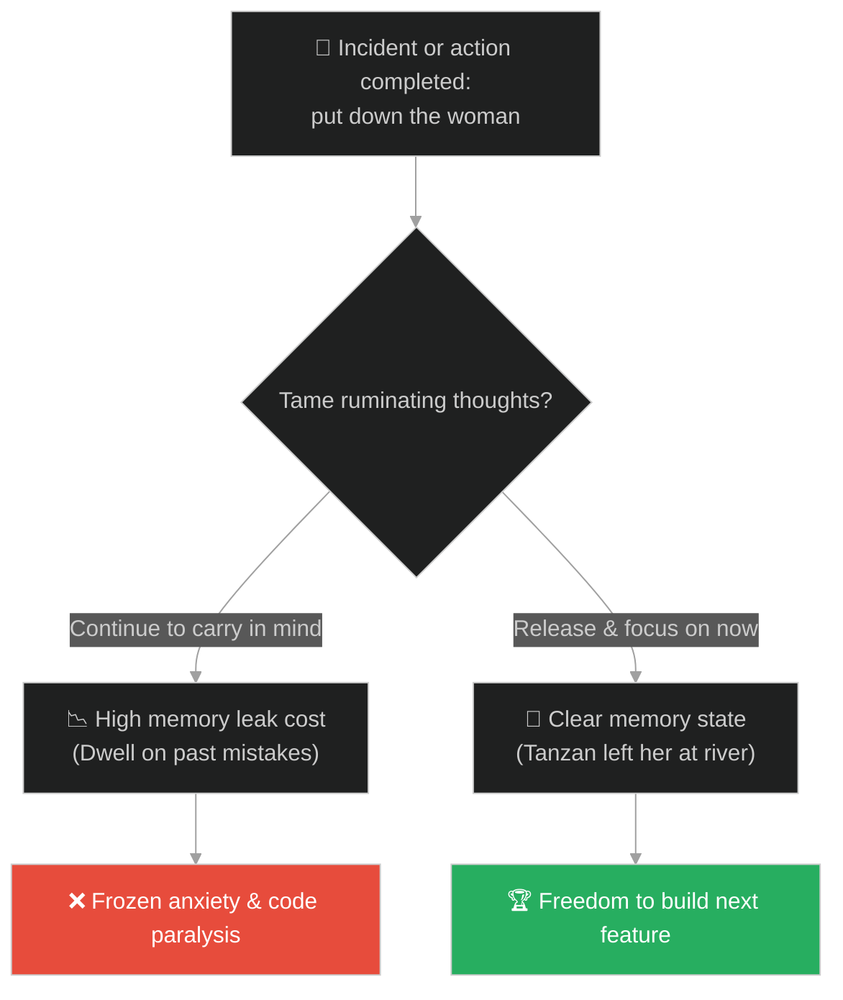
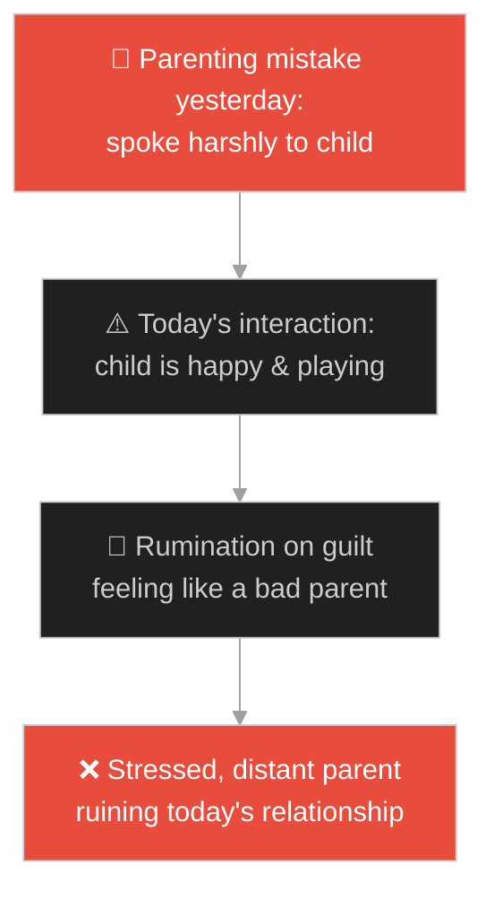
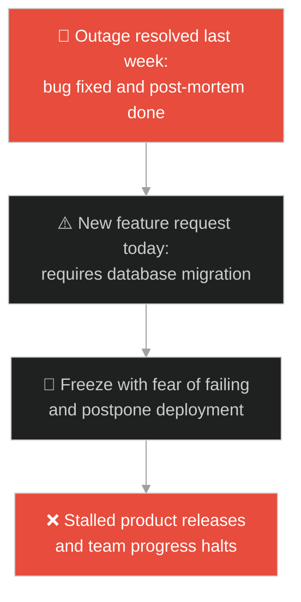
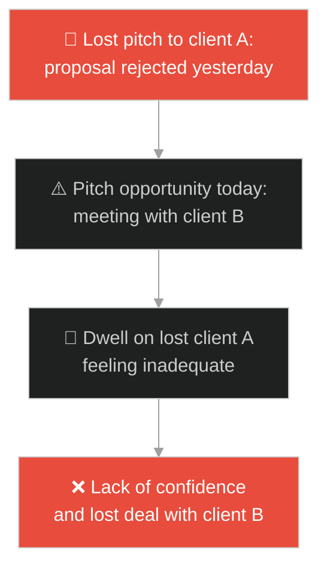
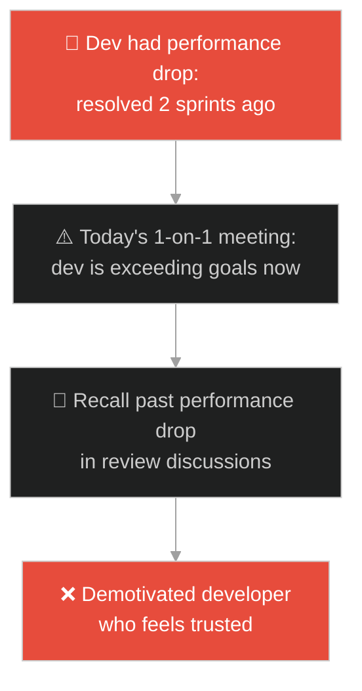
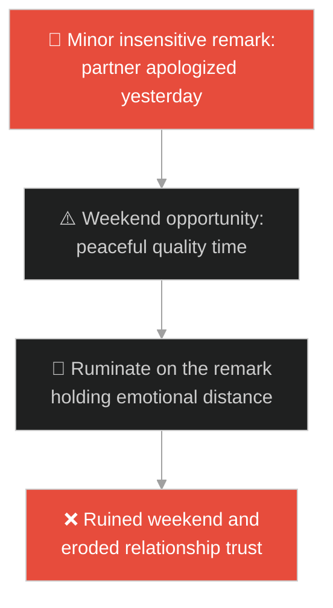
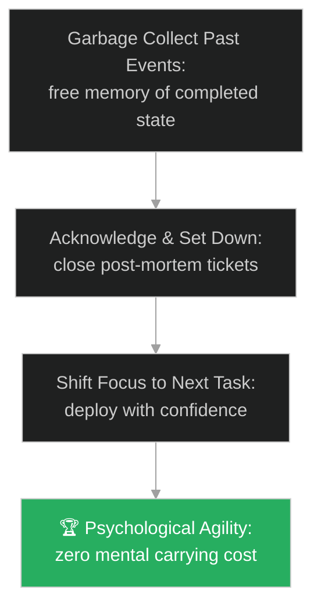

# Letting Go & Rumination (ការលះលែង និងការទំពារគំនិត)៖ ព្រះសង្ឃពីរអង្គ និងស្ត្រីម្នាក់ (Letting Go & Rumination & The Two Monks and the Woman)

**Author:** ichamrong  
**Date:** 2026-05-28  
**Tags:** #buddhism #zen #letting-go #rumination #mental-models  
**Category:** Concepts / Parables  
**Read Time:** ~15 min  

---

## 📌 មាតិកា (Table of Contents)
- [អន្ទាក់ផ្លូវចិត្ត (The Trap)](#0)
- [១. រឿងព្រេងសេន៖ ព្រះសង្ឃពីរអង្គ (The Legend of the Two Monks)](#1)
  - [បន្ទុកនៃការគិតដែលមិនព្រមដាក់ចុះ (The Burden Carried in the Mind)](#1-1)
- [២. បញ្ហា៖ វិបត្តិការភ័យខ្លាចក្រោយវិបត្តិ និងបន្ទុកចងចាំដែលបំផ្លាញផលិតភាព (The Issue: Post-Incident Rumination and Memory Leak in Human Resources)](#2)
- [៣. ឧទាហមណ៍ជាក់ស្តែងក្នុងពិភពពិត (Real World Examples)](#3)
  - [ឧទាហរណ៍ទី ១ — កម្រិតស្រាល (គ្រួសារ)៖ ការស្តាយក្រោយនឹងកំហុសអប់រំកូនកាលពីម្សិលមិញ (Parenting Guilt Dwellers)](#3-1)
  - [ឧទាហរណ៍ទី ២ — កម្រិតមធ្យម (បច្ចេកទេស)៖ ការភ័យខ្លាចការបញ្ចេញកូដថ្មីដោយសារធ្លាប់បង្ក Bug (Fear of Deploying Code After a Past Outage)](#3-2)
  - [ឧទាហរណ៍ទី ៣ — កម្រិតមធ្យម (ធុរកិច្ច)៖ ការផ្តោតអារម្មណ៍លើការបាត់បង់អតិថិជនចាស់ (Dwelling on Lost Sales Deals)](#3-3)
  - [ឧទាហរណ៍ទី ៤ — កម្រិតមធ្យម (សង្គម/គ្រប់គ្រង)៖ ការរំលឹកកំហុសចាស់របស់បុគ្គលិកក្នុងរាល់ការជួបជុំ (Managers Bringing Up Past Performance Drops)](#3-4)
  - [ឧទាហរណ៍ទី ៥ — កម្រិតធ្ងន់ (ទំនាក់ទំនង)៖ ការឈឺចាប់នឹងសម្តីអចេតនារបស់ដៃគូ (Ruminating on Insensitive Remarks After Apologies)](#3-5)
- [៤. ដំណោះស្រាយទូទៅ៖ យន្តការសំរាមស្វ័យប្រវត្តិ និងការបិទសំបុត្រការងារជាផ្លូវការ (The General Solution: Garbage Collecting Emotional Memory and Official Incident Closure Loops)](#4)
- [សេចក្តីសន្និដ្ឋាន (Conclusion)](#5)
- [ឯកសារយោង (References)](#6)
- [Related Posts](#7)

---

<a id="0"></a>
## អន្ទាក់ផ្លូវចិត្ត (The Trap)

តើអ្នកធ្លាប់ជួបស្ថានភាពដែលអ្នក ឬសមាជិកក្រុម មិនហ៊ានសរសេរ ឬបញ្ចេញកូដថ្មី (Deploy) ទៅកាន់ប្រព័ន្ធ Production ព្រោះតែនៅភ័យខ្លាច និងបារម្ភពីកំហុសបច្ចេកទេសដែលបានដោះស្រាយរួចរាល់កាលពីសប្តាហ៍មុនដែរឬទេ?

នៅក្នុងចិត្តវិទ្យា និងការគ្រប់គ្រងបន្ទុកការងារ៖
* **យើងងាយនឹងធ្លាក់ក្នុងអន្ទាក់** នៃការទំពារអតីតកាល និងការសោកស្តាយមិនចេះចប់ (Rumination / Post-Event Anxiety) ដែលប្រៀបដូចជាការសែងបន្ទុករបស់មនុស្សស្រីពេញមួយផ្លូវ ទោះបីជាដៃគូបានដាក់នាងចុះនៅត្រើយម្ខាងយូរណាស់មកហើយក្តី។
* **យើងមើលរំលង** យន្តការលះលែង និងការសម្អាតខួរក្បាល (Garbage Collection / Emotional Letting Go) ដើម្បីរំដោះធនធានខួរក្បាលសម្រាប់ការងារច្នៃប្រឌិតថ្មីៗ។

ការរក្សាទុកបន្ទុកផ្លូវចិត្តបន្ទាប់ពីបញ្ហាបានបញ្ចប់ ហៅថា **អន្ទាក់បីមនុស្សស្រីឆ្លងស្ទឹង (The Ruminative Burden Trap)**។

ដើម្បីយល់ដឹងពីរបៀបលះបង់បន្ទុកចាស់ ដើម្បីឆ្ពោះទៅមុខ នេះជាផែនទីបង្ហាញផ្លូវ៖
1. **រឿងព្រេងនិទាន (The Legend)** — រឿងរ៉ាវរបស់ព្រះសង្ឃ Tanzan និង Ekido ជួបស្រ្តីនៅមាត់ស្ទឹង និងការសួរដេញដោលនៅពេលទៅដល់វត្ត។
2. **បញ្ហា (The Issue)** — ការវិភាគការលេចធ្លាយមេម៉ូរីរបស់កុំព្យូទ័រ (Memory Leak) និងបន្ទុកចងចាំរបស់វិស្វករ (Cognitive Carrying Cost)។
3. **ឧទាហមណ៍ជាក់ស្តែងក្នុងពិភពពិត (Real World Examples)** — ពិនិត្យមើលបញ្ហានេះក្នុងកម្រិតគ្រួសារ បច្ចេកវិទ្យា ធុរកិច្ច ការគ្រប់គ្រង និងទំនាក់ទំនង។
4. **ដំណោះស្រាយទូទៅ (The General Solution)** — ការអនុវត្តយន្តការ Garbage Collection ផ្លូវចិត្ត និងការបិទបញ្ចប់ Incident ទាំងស្រុង។



---

<a id="1"></a>
## ១. រឿងព្រេងសេន៖ ព្រះសង្ឃពីរអង្គ (The Legend of the Two Monks)

មានព្រះសង្ឃសេនពីរអង្គ មួយអង្គចាស់ព្រះនាម **តាន់ហ្សាន់ (Tanzan)** និងមួយអង្គក្មេងព្រះនាម **អេសគីដូ (Ekido)** កំពុងធ្វើដំណើរត្រឡប់ទៅវត្តវិញ ក្រោយពីមានភ្លៀងធ្លាក់យ៉ាងខ្លាំង។ ផ្លូវធ្វើដំណើរពោរពេញដោយភក់ និងមានទឹកហូររាក់ៗកាត់ផ្លូវ។

នៅតាមផ្លូវ ពួកគេបានជួបស្រ្តីដ៏ស្រស់ស្អាតម្នាក់ ស្លៀកសម្លៀកបំពាក់សូត្រយ៉ាងល្អប្រណីត កំពុងឈរស្ទាក់ស្ទើរមិនហ៊ានឆ្លងកាត់ផ្លូវដែលមានភក់ ព្រោះខ្លាចប្រឡាក់សម្លៀកបំពាក់របស់នាង៖
* ដោយមិនបាននិយាយអ្វីច្រើន ព្រះសង្ឃចាស់ តាន់ហ្សាន់ បានដើរចូលទៅជិត លើកបីស្រ្តីនោះ រួចដើរឆ្លងកាត់ផ្លូវភក់នោះទៅត្រើយម្ខាង។
* លោកបានដាក់នាងចុះដោយសុវត្ថិភាព រួចក៏បន្តដំណើរទៅមុខទៀត។

---

<a id="1-1"></a>
### បន្ទុកនៃការគិតដែលមិនព្រមដាក់ចុះ (The Burden Carried in the Mind)

ព្រះសង្ឃក្មេង អេសគីដូ មានការតក់ស្លុត និងខឹងសម្បារយ៉ាងខ្លាំង ព្រោះវិន័យសង្ឃមិនអនុញ្ញាតឱ្យប៉ះពាល់មនុស្សស្រីឡើយ។ គាត់ដើរតាមពីក្រោយទាំងមុខក្រៀមក្រំ និងមិននិយាយស្តីអ្វីទាំងអស់ពេញមួយផ្លូវ៖
* បីម៉ោងក្រោយមក ពេលធ្វើដំណើរជិតទៅដល់ខ្លោងទ្វារវត្ត ព្រះសង្ឃក្មេងទ្រាំលែងបាន ក៏សួរទៅព្រះសង្ឃចាស់ដោយសំឡេងខឹងថា៖
> «លោកបង! យើងជាអ្នកបួស មិនត្រូវជិតស្និទ្ធ ឬប៉ះពាល់ស្រ្តីភេទឡើយ វាខុសវិន័យយ៉ាងធ្ងន់ធ្ងរ! ហេតុអ្វីបានជាលោកបងហ៊ានបីនាងបែបនេះ?»

ព្រះសង្ឃចាស់ តាន់ហ្សាន់ ងាកមកមើលរួចញញឹម និងមានបន្ទូលតបយ៉ាងស្រាលថា៖
> «ប្អូនប្រុស ខ្ញុំបានដាក់ស្រ្តីម្នាក់នោះចុះនៅឯមាត់ស្ទឹងនោះតាំងពីបីម៉ោងមុនម្ល៉េះ។ តើហេតុអ្វីបានជាប្អូននៅតែបីនាងនៅក្នុងចិត្តរហូតមកដល់ពេលនេះទៀត?»

---

<a id="2"></a>
## ២. បញ្ហា៖ វិបត្តិការភ័យខ្លាចក្រោយវិបត្តិ និងបន្ទុកចងចាំដែលបំផ្លាញផលិតភាព (The Issue: Post-Incident Rumination and Memory Leak in Human Resources)

នៅក្នុងវិស្វកម្មកុំព្យូទ័រ កំហុស "Memory Leak" កើតឡើងនៅពេលដែលកម្មវិធីដំណើរការបញ្ជូនទិន្នន័យ (Request) ចប់សព្វគ្រប់ ប៉ុន្តែមិនព្រមបោសសម្អាត ឬរំដោះ RAM មកវិញ។ នៅក្នុងធនធានមនុស្ស វិស្វករដែលរងគ្រោះដោយសារការរំលឹកអតីតកាល (Rumination) នឹងរក្សាទុកកំហុសចាស់ក្នុងខួរក្បាល ដែលនាំឱ្យខួរក្បាលគ្មានកន្លែងទំនេរសម្រាប់គិត logic ថ្មីៗ៖

```go
// ឧទាហរណ៍នៃការលេចធ្លាយមេម៉ូរីនៅក្នុងខួរក្បាលរបស់វិស្វករដែលមិនព្រមលែងចោល
package main

import "fmt"

type BrainMemory struct {
	allocatedGrudges []string
}

func (b *BrainMemory) CarryIncidents(incident string) {
	// អន្ទាក់៖ បន្តសែងបញ្ហាដែលដោះស្រាយរួចហើយ ធ្វើឱ្យមេម៉ូរីពេញ
	b.allocatedGrudges = append(b.allocatedGrudges, incident)
	fmt.Printf("Memory Leak: Currently carrying '%s' in active mind space.\n", incident)
}

func main() {
	brain := &BrainMemory{}
	// បញ្ហាបានដោះស្រាយរួចហើយ តែខួរក្បាលនៅតែបន្តផ្ទុកវា
	brain.CarryIncidents("Database outage of last Tuesday")
	brain.CarryIncidents("Bug in authorization route from last month")
	fmt.Println("Warning: High cognitive carrying cost. System runs out of memory.")
}
```

* **វិបត្តិការភ័យខ្លាចការបញ្ចេញកូដ (Deploy Paralysis)៖** បន្ទាប់ពីធ្លាប់បង្កកំហុសធ្វើឱ្យ server គាំង វិស្វករចាប់ផ្តើមត្រួតពិនិត្យកូដដដែលៗ និងពន្យារពេលបញ្ចេញមុខងារថ្មីៗ ព្រោះខ្លាចជួបវិបត្តិដដែល។
* **ការបាត់បង់ថាមពលការងារ (Mental Overhead)៖** ការចំណាយពេលគិតពីរឿងដែលបានកើតឡើងរួចហើយ ធ្វើឱ្យបាត់បង់សមត្ថភាពដោះស្រាយបញ្ហាបច្ចុប្បន្ន។

---

<a id="3"></a>
## ៣. ឧទាហមណ៍ជាក់ស្តែងក្នុងពិភពពិត

---

<a id="3-1"></a>
### ឧទាហរណ៍ទី ១ — កម្រិតស្រាល (គ្រួសារ)៖ ការស្តាយក្រោយនឹងកំហុសអប់រំកូនកាលពីម្សិលមិញ (Parenting Guilt Dwellers)

ម្តាយម្នាក់បានស្រែកគំហកដាក់កូនព្រោះតែអស់កម្លាំងពីការងារកាលពីល្ងាចម្សិលមិញ។ ព្រឹកនេះ កូនបានបំភ្លេចវាចោល និងកំពុងលេងសើចធម្មតា។ ប៉ុន្តែម្តាយនៅតែមានអារម្មណ៍វិប្បដិសារី និងអង្គុយស្តាយក្រោយពេញមួយថ្ងៃ (នៅតែបីកំហុសចាស់) ធ្វើឱ្យគាត់គ្មានអារម្មណ៍រីករាយនឹងការលេងជាមួយកូននៅថ្ងៃនេះ។



---

<a id="3-2"></a>
### ឧទាហរណ៍ទី ២ — កម្រិតមធ្យម (បច្ចេកទេស)៖ ការភ័យខ្លាចការបញ្ចេញកូដថ្មីដោយសារធ្លាប់បង្ក Bug (Fear of Deploying Code After a Past Outage)

អ្នកអភិវឌ្ឍន៍ម្នាក់បានធ្វើឱ្យប្រព័ន្ធទូទាត់ប្រាក់គាំងកាលពីសប្តាហ៍មុន ដោយសារតែកំហុស syntax មួយ (ឆ្លងស្ទឹង)។ បញ្ហាត្រូវបានដោះស្រាយ និងសរសេរ unit test ការពាររួចរាល់ហើយ។ ប៉ុន្តែនៅសប្តាហ៍នេះ គាត់មិនហ៊ានចុចប៊ូតុង deploy មុខងារថ្មីឡើយ ដោយសារបារម្ភនិងរង់ចាំរហូតដល់យប់ជ្រៅ (នៅតែបីស្រ្តីម្នាក់នោះ) ធ្វើឱ្យគម្រោងយឺតយ៉ាវ។



---

<a id="3-3"></a>
### ឧទាហរណ៍ទី ៣ — កម្រិតមធ្យម (ធុរកិច្ច)៖ ការផ្តោតអារម្មណ៍លើការបាត់បង់អតិថិជនចាស់ (Dwelling on Lost Sales Deals)

ស្ថាបនិកក្រុមហ៊ុនម្នាក់បានចាញ់ការដេញថ្លៃគម្រោងធំមួយកាលពីសប្តាហ៍មុន (កំហុសចាស់)។ នៅសប្តាហ៍នេះ គាត់មានឱកាសជួបពិភាក្សាដេញថ្លៃជាមួយអតិថិជនថ្មីម្នាក់ទៀត។ ប៉ុន្តែគាត់នៅតែមានអារម្មណ៍ស្តាយក្រោយ និងចំណាយពេលគិតពីរឿងចាស់ ធ្វើឱ្យការបង្ហាញខ្លួនជូនអតិថិជនថ្មីគ្មានភាពជឿជាក់ និងបាត់បង់គម្រោងទី២ បន្ថែមទៀត។



---

<a id="3-4"></a>
### ឧទាហរណ៍ទី ៤ — កម្រិតមធ្យម (សង្គម/គ្រប់គ្រង)៖ ការរំលឹកកំហុសចាស់របស់បុគ្គលិកក្នុងរាល់ការជួបជុំ (Managers Bringing Up Past Performance Drops)

បុគ្គលិកម្នាក់ធ្លាប់មានបញ្ហាសុខភាពធ្វើឱ្យខកខានការងារខ្លះកាលពីឆ្នាំមុន។ ឆ្នាំនេះ គាត់មានសុខភាពល្អ និងធ្វើការងារបានយ៉ាងល្អឥតខ្ចោះ។ ប៉ុន្តែនៅក្នុងការប្រជុំ 1-on-1 រៀងរាល់ខែ ប្រធាននៅតែបន្តនិយាយរំលឹកថា៖ *"កាលពីឆ្នាំមុន អ្នកធ្លាប់យឺតយ៉ាវ ត្រូវប្រុងប្រយ័ត្ន"* (ប្រធាននៅតែបីស្រ្តីភេទ) ធ្វើឱ្យបុគ្គលិកនោះអស់ទឹកចិត្ត និងសម្រេចចិត្តលាលែង។



---

<a id="3-5"></a>
### ឧទាហរណ៍ទី ៥ — កម្រិតធ្ងន់ (ទំនាក់ទំនង)៖ ការឈឺចាប់នឹងសម្តីអចេតនារបស់ដៃគូ (Ruminating on Insensitive Remarks After Apologies)

ប្តីបាននិយាយសម្តីអចេតនាមួយខុសក្នុងអំឡុងពេលប្រជុំការងារស្ត្រេស។ គាត់បានសុំទោសប្រពន្ធ និងពន្យល់រួចរាល់ហើយនៅល្ងាចនោះ (ដាក់នាងចុះ)។ ប៉ុន្តែ ៣ ថ្ងៃក្រោយមក ប្រពន្ធនៅតែអង្គុយស្ងៀម មិនព្រមញ៉ាំបាយ និងរំលឹកពាក្យពេចន៍នោះម្តងហើយម្តងទៀត ធ្វើឱ្យទំនាក់ទំនងទាំងមូលប្រែជាត្រជាក់ស្រជុំ។



---

<a id="4"></a>
## ៤. ដំណោះស្រាយទូទៅ៖ យន្តការសំរាមស្វ័យប្រវត្តិ និងការបិទសំបុត្រការងារជាផ្លូវការ (The General Solution: Garbage Collecting Emotional Memory and Official Incident Closure Loops)

ដើម្បីសម្អាតបន្ទុកចងចាំ និងជួយឱ្យក្រុមការងារបន្តដំណើរទៅមុខបានលឿន យើងត្រូវអនុវត្តប្រព័ន្ធបិទបញ្ចប់កំហុសជាផ្លូវការ៖



* **ការអនុវត្តពិធី "បិទបញ្ចប់កំហុសជាផ្លូវការ" (Official Incident Closure)៖** នៅពេលដែលកំហុស ឬ outage ត្រូវបានវិភាគរួចរាល់ និងដាក់ចេញនូវសកម្មភាពការពារ (Action Items) រួចរាល់ហើយ ចូរធ្វើការបិទសំបុត្រការងារ (Jira/GitHub issue) ជាផ្លូវការ។ ប្រាប់សមាជិកក្រុមទាំងអស់ថា៖ *"បញ្ហានេះបានបញ្ចប់ហើយ យើងបានរៀនសូត្រពីវាហើយ ឥឡូវនេះវាជារឿងអតីតកាល។"*
* **ការរំដោះ RAM ផ្លូវចិត្ត (Mental Garbage Collection)៖** បណ្តុះទម្លាប់សរសេររាល់ការបារម្ភទុកក្នុងសៀវភៅ ឬឯកសារ (Write it down to set it free)។ នៅពេលដែលគំនិតត្រូវបានកត់ត្រាទុក ខួរក្បាលនឹងយល់ថាវាលែងត្រូវការចាំបាច់ចាំទៀតហើយ រួចរំដោះទំហំចងចាំមកវិញ។
* **ការផ្តោតលើ "បច្ចុប្បន្នភាព និងជំហានបន្ទាប់" (Next-Action focus)៖** រាល់ពេលដែលចាប់ផ្តើមគិតសោកស្តាយរឿងចាស់ ចូរសួរសំណួរថា៖ *"តើខ្ញុំអាចធ្វើអ្វីខ្លះនៅវិនាទីនេះដើម្បីកែខៃ ឬឆ្ពោះទៅមុខ?"* ប្រសិនបើគ្មានអ្វីអាចធ្វើបានទេ ចូរដកដង្ហើមចេញ និងដាក់វានៅទីនោះចុះ។

---

## 🐇 ធ្លាក់ចូលក្នុងរន្ធទន្សាយ (Enter the Rabbit Hole)

ដើម្បីស្វែងយល់កាន់តែស៊ីជម្រៅអំពីរបៀបឆ្លងកាត់ការភាន់ច្រឡំ និងការមើលឃើញការពិតច្បាស់លាស់ សូមចាប់ផ្តើមដំណើររុករករបស់អ្នកដោយចុចលើតំណភ្ជាប់ខាងក្រោម៖

* 🚀 **[ចាប់ផ្តើមដំណើររុករក (Start the Journey) ➔ ផ្កាឈូកក្នុងភក់ (The Lotus Flower)](./127-buddha-and-the-lotus.md)**

---

<a id="5"></a>
## សេចក្តីសន្និដ្ឋាន (Conclusion)

> **«ខ្ញុំបានដាក់នាងចុះតាំងពីនៅឯមាត់ស្ទឹងម្ល៉េះ។ ហេតុអ្វីបានជាអ្នកនៅតែបីនាងមកដល់វត្តទៀត?»**

ការព្រួយបារម្ភ និងសោកស្តាយរឿងអតីតកាល មិនអាចកែប្រែអ្វីដែលបានកើតឡើងរួចហើយបានឡើយ។ ការចេះដាក់បន្ទុកចាស់ចុះនៅពេលឆ្លងស្ទឹងផុត គឺជាគន្លឹះតែមួយគត់ដើម្បីរក្សាមេម៉ូរីខួរក្បាលឱ្យស្អាតស្អំ មានសេរីភាពផ្លូវចិត្ត និងត្រៀមខ្លួនរួចរាល់សម្រាប់កសាងអនាគតដ៏រុងរឿង។

---

<a id="6"></a>
## ឯកសារយោង (References)

* **Zen Koans** — Tanzan and Ekido story, emphasizing the power of letting go of rules when direct compassion is required, and letting go of events.
* **Cognitive Load Theory** — John Sweller (1988). The impact of unnecessary mental information retention on problem-solving speed.
* **Susan Nolen-Hoeksema** — *Women Who Think Too Much: How to Break Free of Overthinking and Reclaim Your Life* (2003). Clinical details on breaking the rumination loop.

---

<a id="7"></a>
## Related Posts

* [Calm Under Stress & Incident Patience](./119-buddha-and-the-muddy-water.md) — How letting the mud settle clears the water without active intervention.
* [Solomon's Ring](./40-solomons-ring.md) — Finding emotional resilience through the mantra "This too shall pass."
