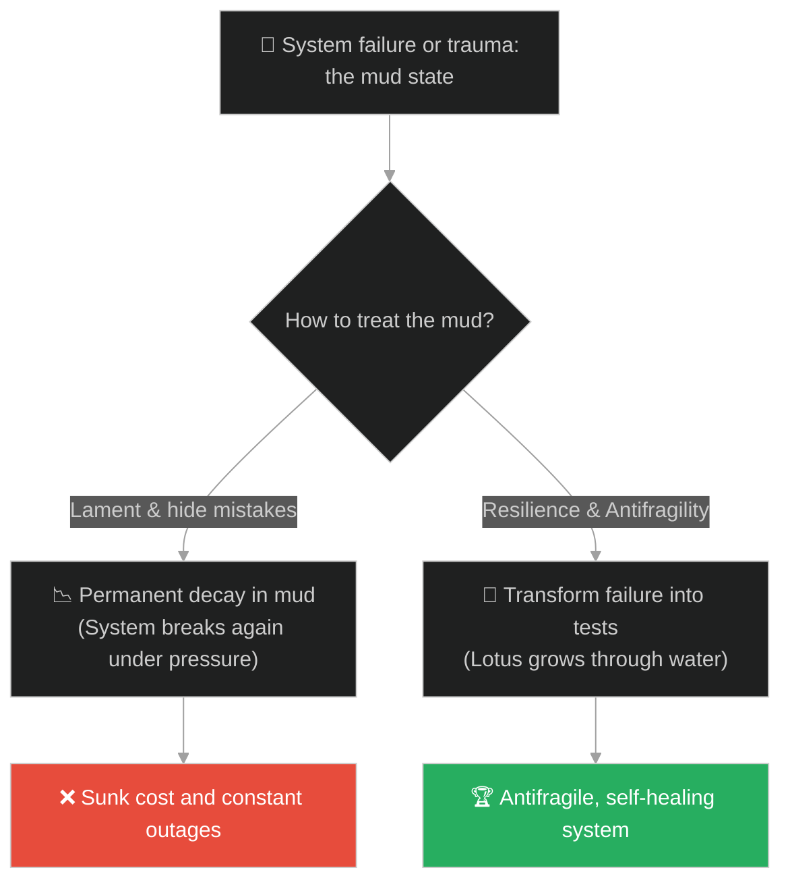
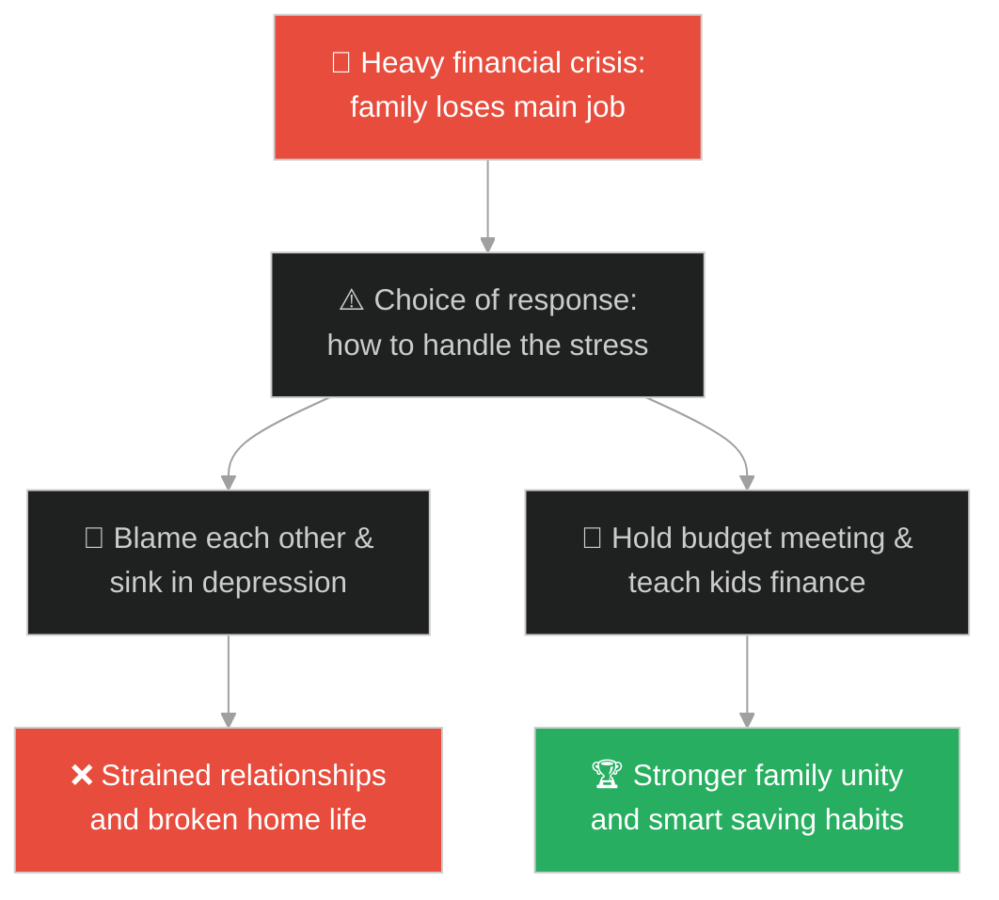
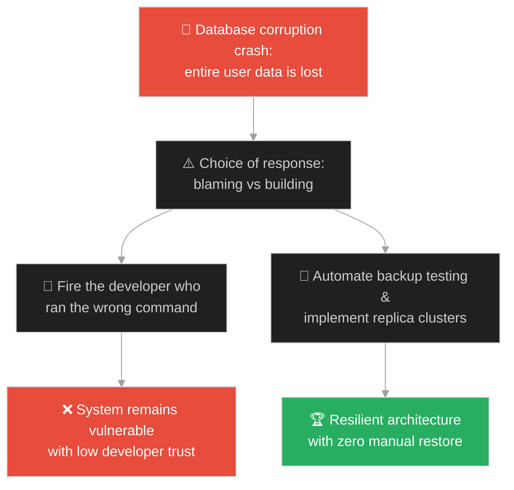
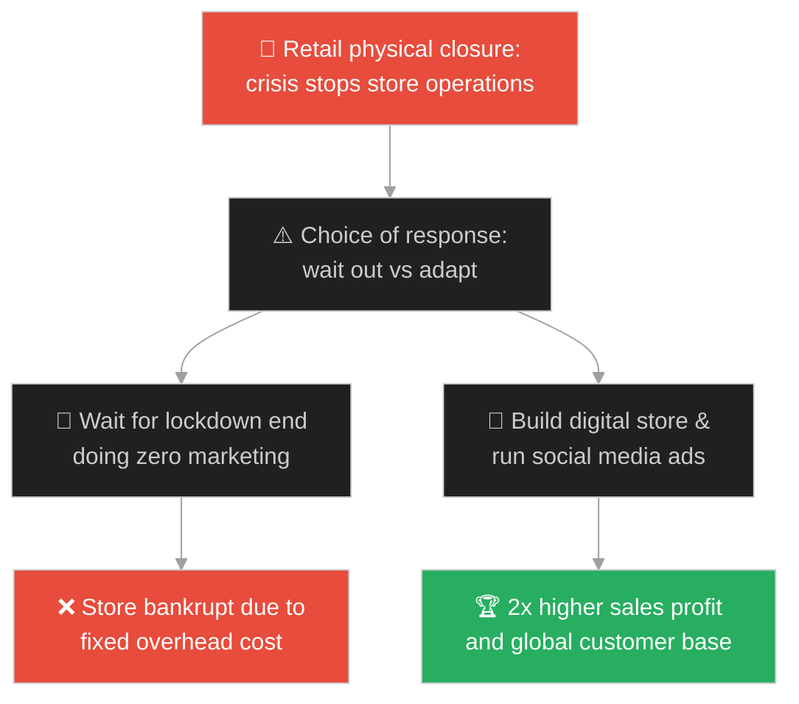
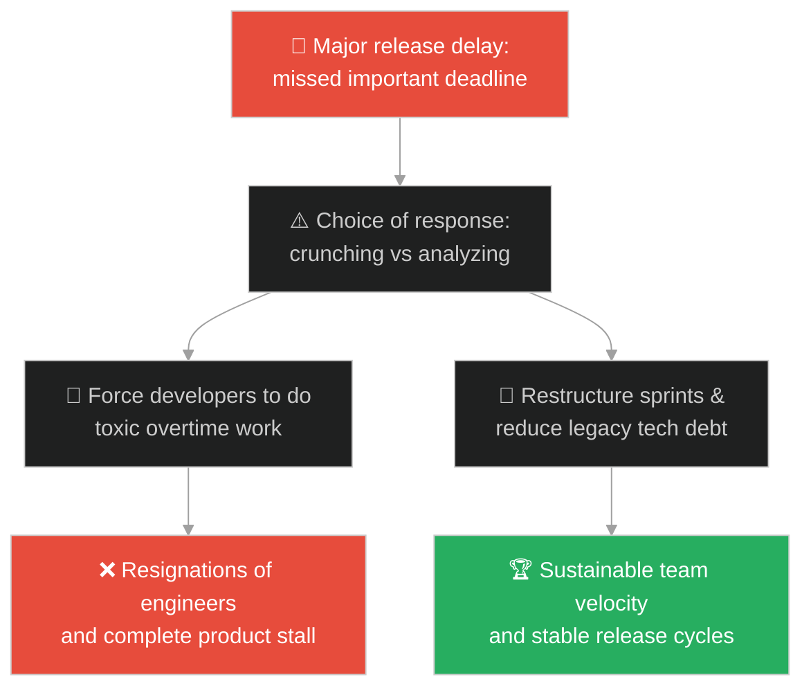
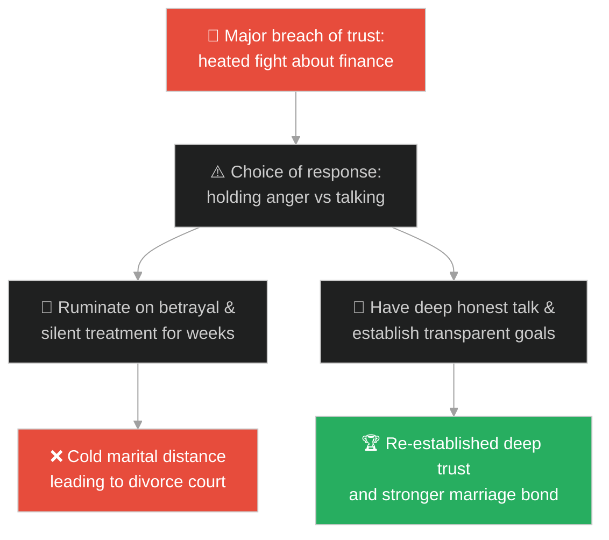
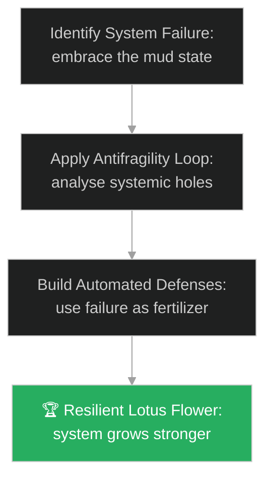

# Post-Traumatic Growth & Resilience (ការលូតលាស់ក្រោយវិបត្តិ និងភាពធន់)៖ ផ្កាឈូកក្នុងភក់ (Post-Traumatic Growth & Resilience & The Lotus Flower in the Mud)

**Author:** ichamrong  
**Date:** 2026-05-28  
**Tags:** #buddhism #post-traumatic-growth #resilience #mental-models #meaning  
**Category:** Concepts / Parables  
**Read Time:** ~15 min  

---

## 📌 មាតិកា (Table of Contents)
- [អន្ទាក់ផ្លូវចិត្ត (The Trap)](#0)
- [១. និមិត្តសញ្ញាព្រះពុទ្ធសាសនា៖ ផ្កាឈូក (The Symbol of the Lotus Flower)](#1)
  - [គ្មានភក់ គ្មានឈូក របស់ព្រះសង្ឃធិច ញ៉ាត់ហាញ់ (Thich Nhat Hanh's Lesson: No Mud, No Lotus)](#1-1)
- [២. បញ្ហា៖ វិបត្តិការភ័យខ្លាចការបរាជ័យ និងការខ្ជះខ្ជាយជីជាតិវិបត្តិ (The Issue: Incident Shame and the Sunk Cost of Wasted Failures)](#2)
- [៣. ឧទាហមណ៍ជាក់ស្តែងក្នុងពិភពពិត (Real World Examples)](#3)
  - [ឧទាហរណ៍ទី ១ — កម្រិតស្រាល (គ្រួសារ)៖ ការជំនះវិបត្តិហិរញ្ញវត្ថុក្នុងគ្រួសារ (Family Financial Crisis Leading to Budget Unity)](#3-1)
  - [ឧទាហរណ៍ទី ២ — កម្រិតមធ្យម (បច្ចេកទេស)៖ ការកសាងប្រព័ន្ធស្វ័យប្រវត្តាក្រោយ DB គាំង (Automating DB Backups After Data Corruption)](#3-2)
  - [ឧទាហរណ៍ទី ៣ — កម្រិតមធ្យម (ធុរកិច្ច)៖ ការផ្លាស់ប្តូរអាជីវកម្មទៅកាន់ឌីជីថល (Pivoting Traditional Retail During Physical Lockdowns)](#3-3)
  - [ឧទាហរណ៍ទី ៤ — កម្រិតមធ្យម (សង្គម/គ្រប់គ្រង)៖ ការកែសម្រួលដំណើរការក្រុមក្រោយពន្យារពេល (Restructuring Sprint Schedulings After Missed Deadlines)](#3-4)
  - [ឧទាហរណ៍ទី ៥ — កម្រិតធ្ងន់ (ទំនាក់ទំនង)៖ ការពង្រឹងចំណងអាពាហ៍ពិពាហ៍ក្រោយជម្លោះធំ (Re-establishing Marital Trust After Heated Fights)](#3-5)
- [៤. ដំណោះស្រាយទូទៅ៖ ក្របខ័ណ្ឌប្រព័ន្ធមិនងាយបាក់បែក និងការទាញយកផលពីវិបត្តិ (The General Solution: Antifragility Frameworks and Transforming Incident Mud into Systemic Flowers)](#4)
- [សេចក្តីសន្និដ្ឋាន (Conclusion)](#5)
- [ឯកសារយោង (References)](#6)
- [Related Posts](#7)

---

<a id="0"></a>
## អន្ទាក់ផ្លូវចិត្ត (The Trap)

តើអ្នកធ្លាប់ជួបស្ថានភាពដែលក្រុមហ៊ុនជួបប្រទះបញ្ហាប្រព័ន្ធគាំង (System Crash) ឬបែកធ្លាយទិន្នន័យ (Security Breach) រួចថ្នាក់ដឹកនាំចាប់ផ្តើមស្វែងរកមុខអ្នកខុសដើម្បីស្តីបន្ទោស និងដាក់ពិន័យ ដែលធ្វើឱ្យសមាជិកទាំងអស់មានអារម្មណ៍ភ័យខ្លាច និងបាក់ទឹកចិត្តដែរឬទេ?

នៅក្នុងស្ថានភាពបរាជ័យ៖
* **យើងងាយនឹងធ្លាក់ក្នុងអន្ទាក់** នៃការភ័យខ្លាចការរងទុក្ខ និងការបន្ទាបតម្លៃខ្លួនឯង (Trauma/Grudge Cycle) ដែលប្រៀបដូចជាការស្អប់ដីភក់ល្បាប់ ធ្វើឱ្យយើងលិចលង់នៅបាតបឹង និងមិនអាចងើបឡើងវិញបាន។
* **យើងមើលរំលង** សក្តានុពលនៃបរាជ័យ ដែលជា "ជីជាតិ" (Fertilizer) ដ៏មានតម្លៃបំផុត ដើម្បីកសាងប្រព័ន្ធឱ្យកាន់តែរឹងមាំ និងមានសមត្ថភាពការពារកំហុសដដែលៗនាពេលអនាគត។

ការបាក់ទឹកចិត្ត និងមិនព្រមទាញមេរៀនពីវិបត្តិ ហៅថា **អន្ទាក់ខ្លាចដីភក់និងការលិចលង់បាតបឹង (The Incident Shame Trap)**។

ដើម្បីយល់ដឹងពីរបៀបប្រើប្រាស់បរាជ័យជាកម្លាំងរុញច្រាន នេះជាផែនទីបង្ហាញផ្លូវ៖
1. **រឿងព្រេងនិទាន (The Legend)** — និមិត្តសញ្ញានៃផ្កាឈូកដែលលូតលាស់ចេញពីដីភក់ល្បាប់ស្អុយកខ្វក់ តែរីកផ្កាស្អាតបរិសុទ្ធ។
2. **បញ្ហា (The Issue)** — ការវិភាគចិត្តវិទ្យានៃ Post-Traumatic Growth និងទ្រឹស្តីប្រព័ន្ធមិនងាយបាក់បែក (Antifragility) របស់លោក Nassim Taleb។
3. **ឧទាហមណ៍ជាក់ស្តែងក្នុងពិភពពិត (Real World Examples)** — ពិនិត្យមើលបញ្ហានេះក្នុងកម្រិតគ្រួសារ បច្ចេកវិទ្យា ធុរកិច្ច ការគ្រប់គ្រង និងទំនាក់ទំនង។
4. **ដំណោះស្រាយទូទៅ (The General Solution)** — ការអនុវត្តយន្តការបង្វែរវិបត្តិទៅជាការកែលម្អប្រព័ន្ធ (Antifragile Feedback Loops)។



---

<a id="1"></a>
## ១. និមិត្តសញ្ញាព្រះពុទ្ធសាសនា៖ ផ្កាឈូក (The Symbol of the Lotus Flower)

ផ្កាឈូក (Lotus Flower) គឺជានិមិត្តសញ្ញាដ៏មានអត្ថន័យជ្រាលជ្រៅបំផុតមួយនៅក្នុងព្រះពុទ្ធសាសនា ដែលតំណាងឱ្យភាពបរិសុទ្ធ ការត្រាស់ដឹង និងការកម្ចាត់កិលេស។

ទោះជាយ៉ាងណា អ្វីដែលធ្វើឱ្យផ្កាឈូកមានអត្ថន័យដ៏អស្ចារ្យនោះ មិនមែនដោយសារតែពន្លឺ ឬសម្រស់របស់វាទេ គឺដោយសារតែ៖
* **«ទីកន្លែងដែលវាចាប់កំណើត»**។
* ផ្កាឈូកមិនដុះនៅលើផ្ទាំងថ្មម៉ាបដ៏ស្អាតបាត ឬនៅលើកំពូលភ្នំដែលស្អាតស្អំគ្មានធូលីនោះឡើយ។
* វាចាប់កំណើតចេញពីបាតបឹង ដែលពោរពេញទៅដោយភក់ល្បាប់ស្អុយរលួយ និងទឹកល្អក់កករកខ្វក់បំផុត។

---

<a id="1-1"></a>
### គ្មានភក់ គ្មានឈូក របស់ព្រះសង្ឃធិច ញ៉ាត់ហាញ់ (Thich Nhat Hanh's Lesson: No Mud, No Lotus)

ឫសរបស់ផ្កាឈូកលិចជ្រៅទៅក្នុងភក់ស្អុយ៖
* ភក់ល្បាប់នោះហើយ ដែលផ្តល់នូវសារធាតុចិញ្ចឹម និងជីជាតិដ៏សំខាន់បំផុត ដើម្បីឱ្យទងឈូកមានកម្លាំងលូតលាស់ឆ្លងកាត់ទឹកល្អក់។
* នៅពេលវាឡើងផុតផ្ទៃទឹក វារីកចេញជាផ្កាដ៏ស្រស់បំព្រង មានក្លិនក្រអូបឈ្ងុយឈ្ងប់ និងមិនប្រឡាក់ដោយដីភក់សូម្បីតែបន្តិច។
* ព្រះសង្ឃសេនដ៏ល្បីល្បាញលោក **ធិច ញ៉ាត់ហាញ់ (Thich Nhat Hanh)** តែងតែមានបន្ទូលរំលឹកថា៖
> «No Mud, No Lotus (បើគ្មានភក់ ក៏គ្មានផ្កាឈូកដែរ)។ សេចក្តីទុក្ខ និងការឈឺចាប់ (ភក់) គឺជាជីជាតិដ៏សំខាន់បំផុត ដែលជួយចិញ្ចឹមសេចក្តីសុខ និងការយល់ដឹង (ផ្កាឈូក) ឱ្យរីកលូតលាស់បាន។»

---

<a id="2"></a>
## ២. បញ្ហា៖ វិបត្តិការភ័យខ្លាចការបរាជ័យ និងការខ្ជះខ្ជាយជីជាតិវិបត្តិ (The Issue: Incident Shame and the Sunk Cost of Wasted Failures)

នៅក្នុងវិស្វកម្មប្រព័ន្ធ (Systems Engineering) នៅពេលដែលប្រព័ន្ធ Database គាំង និងបាត់បង់ទិន្នន័យ (ភក់) ក្រុមហ៊ុនភាគច្រើនខ្ជះខ្ជាយឱកាសនេះដោយការរិះគន់វិស្វករ។ ផ្ទុយទៅវិញ ក្រុមហ៊ុនដែលយល់ដឹងពីប្រព័ន្ធ ប្រើប្រាស់មេរៀននោះដើម្បីបង្កើតយន្តការបម្រុងទិន្នន័យស្វ័យប្រវត្ត (Automated Failover) និង tests ការពារ ដែលធ្វើឱ្យប្រព័ន្ធមិនអាចគាំងដោយសារមូលហេតដដែលបានទៀតឡើយ (ផ្កាឈូក)៖

```go
// ឧទាហរណ៍នៃប្រព័ន្ធ Antifragile ដែលប្រើប្រាស់កំហុសដើម្បីដំឡើងសមត្ថភាពស្វ័យប្រវត្តិ
package main

import "fmt"

type AntifragileSystem struct {
	failureCount int
	isReplicaActive bool
}

func (a *AntifragileSystem) HandleDatabaseFailure() {
	a.failureCount++
	fmt.Println("Warning: Primary database connection failed (The Mud state).")
	// ប្រើប្រាស់កំហុសដើម្បី trigger យន្តការការពារខ្លួនស្វ័យប្រវត្តិ
	if a.failureCount > 0 {
		a.isReplicaActive = true
		fmt.Println("🏆 Antifragility activated: Failover replica cluster promoted to primary (The Lotus state).")
	}
}

func main() {
	sys := &AntifragileSystem{}
	sys.HandleDatabaseFailure()
}
```

* **ការខ្ជះខ្ជាយវិបត្តិ (Wasting the Crisis)៖** ការជួសជុលបញ្ហាត្រឹមតែលើផ្ទៃសំបក (Hot-fix) ដោយមិនព្រមសរសេរ tests ការពារ ធ្វើឱ្យប្រព័ន្ធរង់ចាំតែថ្ងៃជួបគ្រោះមហន្តរាយដដែលនាពេលក្រោយ។
* **វប្បធម៌ស្តីបន្ទោស (Blame Culture)៖** បំផ្លាញភាពច្នៃប្រឌិតរបស់ក្រុមការងារ ព្រោះគ្មាននរណាម្នាក់ហ៊ានសាកល្បងគំនិតថ្មីៗ ដោយខ្លាចជួបការបរាជ័យ។

---

<a id="3"></a>
## ៣. ឧទាហមណ៍ជាក់ស្តែងក្នុងពិភពពិត

---

<a id="3-1"></a>
### ឧទាហរណ៍ទី ១ — កម្រិតស្រាល (គ្រួសារ)៖ ការជំនះវិបត្តិហិរញ្ញវត្ថុក្នុងគ្រួសារ (Family Financial Crisis Leading to Budget Unity)

គ្រួសារមួយបានធ្លាក់ក្នុងវិបត្តិហិរញ្ញវត្ថុធ្ងន់ធ្ងរដោយសារឪពុកបាត់បង់ការងារ (ដីភក់)។ ជំនួសឱ្យការស្រែកជេរប្រមាថ និងបន្ទោសគ្នាទៅវិញទៅមក ពួកគេបានប្រជុំគ្នា បង្រៀនកូនៗពីការសន្សំសំចៃ និងរៀបចំកញ្ចប់ថវិកាច្បាស់លាស់។ វិបត្តិនេះបានក្លាយជាជីជាតិជួយឱ្យសមាជិកគ្រួសារមានសាមគ្គីភាព និងចេះសន្សំសំចៃខ្លាំងជាងពេលធម្មតា (រីកជាផ្កាឈូក)។



---

<a id="3-2"></a>
### ឧទាហរណ៍ទី ២ — កម្រិតមធ្យម (បច្ចេកទេស)៖ ការកសាងប្រព័ន្ធស្វ័យប្រវត្តាក្រោយ DB គាំង (Automating DB Backups After Data Corruption)

ក្រុមហ៊ុនមួយបានរងការខូចខាតទិន្នន័យ (Data corruption) យ៉ាងធ្ងន់ធ្ងរ ធ្វើឱ្យប្រព័ន្ធគាំង ២ ថ្ងៃ (ដីភក់)។ ជំនួសឱ្យការបណ្តេញវិស្វករដែលធ្វើការងារនោះចេញ ពួកគេបានរួមគ្នាបង្កើតយន្តការបម្រុងទិន្នន័យស្វ័យប្រវត្ត (Automated backups) និងការធ្វើតេស្តសង្គ្រោះប្រចាំសប្តាហ៍។ ចាប់ពីពេលនោះមក ក្រុមហ៊ុនមិនដែលបាត់បង់ទិន្នន័យម្តងណាទៀតឡើយ (រីកជាផ្កាឈូក)។



---

<a id="3-3"></a>
### ឧទាហរណ៍ទី ៣ — កម្រិតមធ្យម (ធុរកិច្ច)៖ ការផ្លាស់ប្តូរអាជីវកម្មទៅកាន់ឌីជីថល (Pivoting Traditional Retail During Physical Lockdowns)

ហាងលក់សម្លៀកបំពាក់មួយកន្លែងត្រូវបានបង្ខំឱ្យបិទទ្វារទាំងស្រុងអំឡុងពេលវិបត្តិជំងឺរាតត្បាត (ដីភក់)។ ជំនួសឱ្យការអង្គុយរង់ចាំការបើកទ្វារឡើងវិញ ម្ចាស់ហាងបានប្រើប្រាស់ពេលវេលានោះដើម្បីរៀនសរសេរកូដវេបសាយ និងបង្កើតការលក់តាមអនឡាញ។ ក្រោយមក ចំណូលអនឡាញរបស់ពួកគេបានកើនឡើងទ្វេដង លើសពីចំណូលហាងពិតប្រាកដពីមុនទៅទៀត (រីកជាផ្កាឈូក)។



---

<a id="3-4"></a>
### ឧទាហរណ៍ទី ៤ — កម្រិតមធ្យម (សង្គម/គ្រប់គ្រង)៖ ការកែសម្រួលដំណើរការក្រុមក្រោយពន្យារពេល (Restructuring Sprint Schedulings After Missed Deadlines)

គម្រោងការងារមួយបានខកខានកាលបរិច្ឆេទបញ្ចេញផលិតផលយ៉ាងធ្ងន់ធ្ងរ ដោយសារការកត់ត្រាតម្រូវការមិនច្បាស់លាស់ (ដីភក់)។ ជំនួសឱ្យការបង្ខំឱ្យ developers ធ្វើការងារថែមម៉ោងយ៉ាងតានតឹង ក្រុមការងារបានវិភាគរកឃើញថា បញ្ហាមកពី Feature Creep រួចបានបង្កើតច្បាប់ DoD (Definition of Done) យ៉ាងច្បាស់លាស់ ដែលជួយឱ្យ sprint ក្រោយៗដំណើរការបានលឿន និងទាន់ពេល (រីកជាផ្កាឈូក)។



---

<a id="3-5"></a>
### ឧទាហរណ៍ទី ៥ — កម្រិតធ្ងន់ (ទំនាក់ទំនង)៖ ការពង្រឹងចំណងអាពាហ៍ពិពាហ៍ក្រោយជម្លោះធំ (Re-establishing Marital Trust After Heated Fights)

ប្តីប្រពន្ធមួយគូបានឈ្លោះប្រកែកគ្នាឡើងកំដៅយ៉ាងខ្លាំងរហូតដល់សឹងតែលែងលះគ្នា ដោយសារកង្វះភាពស្មោះត្រង់ផ្នែកហិរញ្ញវត្ថុ (ដីភក់)។ ជំនួសឱ្យការលែងលះ ពួកគេបានសម្រេចចិត្តជួបពិភាក្សាជាមួយគ្រូពេទ្យចិត្តវិទ្យា បើកចំហគណនីធនាគាររួមគ្នា និងបង្កើតគោលដៅហិរញ្ញវត្ថុច្បាស់លាស់។ ៣ ឆ្នាំក្រោយមក ចំណងអាពាហ៍ពិពាហ៍របស់ពួកគេមានភាពជឿជាក់ និងរឹងមាំជាងមុនឆ្ងាយណាស់ (រីកជាផ្កាឈូក)។



---

<a id="4"></a>
## ៤. ដំណោះស្រាយទូទៅ៖ ក្របខ័ណ្ឌប្រព័ន្ធមិនងាយបាក់បែក និងការទាញយកផលពីវិបត្តិ (The General Solution: Antifragility Frameworks and Transforming Incident Mud into Systemic Flowers)

ដើម្បីបង្កើតភាពធន់ និងការរីកលូតលាស់ពីការឈឺចាប់ យើងត្រូវអនុវត្តប្រព័ន្ធមិនងាយបាក់បែក៖



* **ការអនុវត្តគោលការណ៍ "Antifragility" (ភាពមិនងាយបាក់បែក)៖** មិនត្រូវចង់បានត្រឹមតែប្រព័ន្ធដែលធន់ទ្រាំនឹងការប៉ះទង្គិច (Robust) នោះឡើយ។ ត្រូវបង្កើតប្រព័ន្ធដែល **លូតលាស់ និងរឹងមាំជាងមុននៅពេលមានសម្ពាធ ឬវិបត្តិ** (ដូចជាការចាក់ថ្នាំបង្ការជំងឺ ឬការធ្វើ Chaos Engineering ដើម្បីបំផ្លាញ server ខ្លួនឯង និងដំឡើងសមត្ថភាពស្វ័យប្រវត្ត)។
* **ការសរសេរ Post-Mortem ផ្តោតលើសកម្មភាពកែខៃ (Action-Oriented RCAs)៖** រាល់ពេលដែលជួបការបរាជ័យ កំណត់ការបង្កើតសកម្មភាពកែលម្អប្រព័ន្ធយ៉ាងហោចណាស់ ៣ (Action items)។ ចាត់ទុកការបរាជ័យជាឱកាសស្វែងរកចន្លោះប្រហោងដែលលាក់ខ្លួន និងទាញយកប្រយោជន៍ពីវាជាជីជាតិសម្រាប់ប្រព័ន្ធ។
* **ការបណ្តុះផ្នត់គំនិតរីកចម្រើន (Growth Mindset)៖** ចាត់ទុកកំហុស និងការឈឺចាប់ជាផ្នែកមួយនៃការរៀនសូត្រ។ គ្មាននរណាម្នាក់អាចសរសេរកូដល្អឥតខ្ចោះដោយគ្មានធ្លាប់សរសេរកូដខុសនោះឡើយ។ ដីភក់នៃកំហុសនៅថ្ងៃនេះ គឺជាគ្រឹះនៃបញ្ញារបស់អ្នកនៅថ្ងៃស្អែក។

---

## 🐇 ធ្លាក់ចូលក្នុងរន្ធទន្សាយ (Enter the Rabbit Hole)

ដើម្បីស្វែងយល់កាន់តែស៊ីជម្រៅអំពីរបៀបឆ្លងកាត់ការភាន់ច្រឡំ និងការមើលឃើញការពិតច្បាស់លាស់ សូមចាប់ផ្តើមដំណើររុករករបស់អ្នកដោយចុចលើតំណភ្ជាប់ខាងក្រោម៖

* 🚀 **[ចាប់ផ្តើមដំណើររុករក (Start the Journey) ➔ ព្រះពុទ្ធបដិមាមាស (The Golden Buddha)](./128-buddha-and-the-golden-statue.md)**

---

<a id="5"></a>
## សេចក្តីសន្និដ្ឋាន (Conclusion)

> **«បើគ្មានភក់ ក៏គ្មានផ្កាឈូកដែរ។»**

សេចក្តីទុក្ខ និងការបរាជ័យ មិនមែនជាឧបសគ្គរារាំងភាពជោគជ័យឡើយ តែវាជាវត្ថុធាតុដើមដ៏សំខាន់បំផុតសម្រាប់ភាពជោគជ័យ។ នៅពេលយើងចេះទទួលយក និងប្រើប្រាស់ "ដីភក់" នៃវិបត្តិ និងការឈឺចាប់ជាកម្លាំងរុញច្រាន យើងនឹងអាចលូតលាស់ឆ្លងកាត់ទឹកល្អក់ និងរីកស្គុះស្គាយជាផ្កាឈូកដ៏ស្រស់បំព្រងដែលពោរពេញដោយសមត្ថភាព និងតម្លៃពិតប្រាកដ។

---

<a id="6"></a>
## ឯកសារយោង (References)

* **Thich Nhat Hanh** — *No Mud, No Lotus: The Art of Transforming Suffering* (2014). The classical Buddhist explanation of using suffering to cultivate happiness.
* **Nassim Nicholas Taleb** — *Antifragile: Things That Gain from Disorder* (2012). Explaining how systems and organizations grow stronger from stressors and volatility.
* **Richard Tedeschi & Lawrence Calhoun** — *Post-Traumatic Growth: Conceptual Foundations and Empirical Evidence* (2004). The clinical psychology behind growth from trauma.

---

<a id="7"></a>
## Related Posts

* [Chaos Engineering and Production Drills](./48-the-book-of-five-rings.md) — How Miyamoto Musashi's sword fighting philosophy teaches chaos testing.
* [Incident Response and Blameless Post-Mortems](./46-the-successful-failure.md) — Transforming catastrophic failure into successful recoveries.
