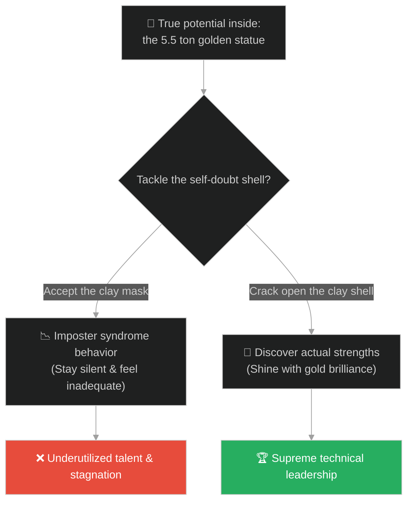
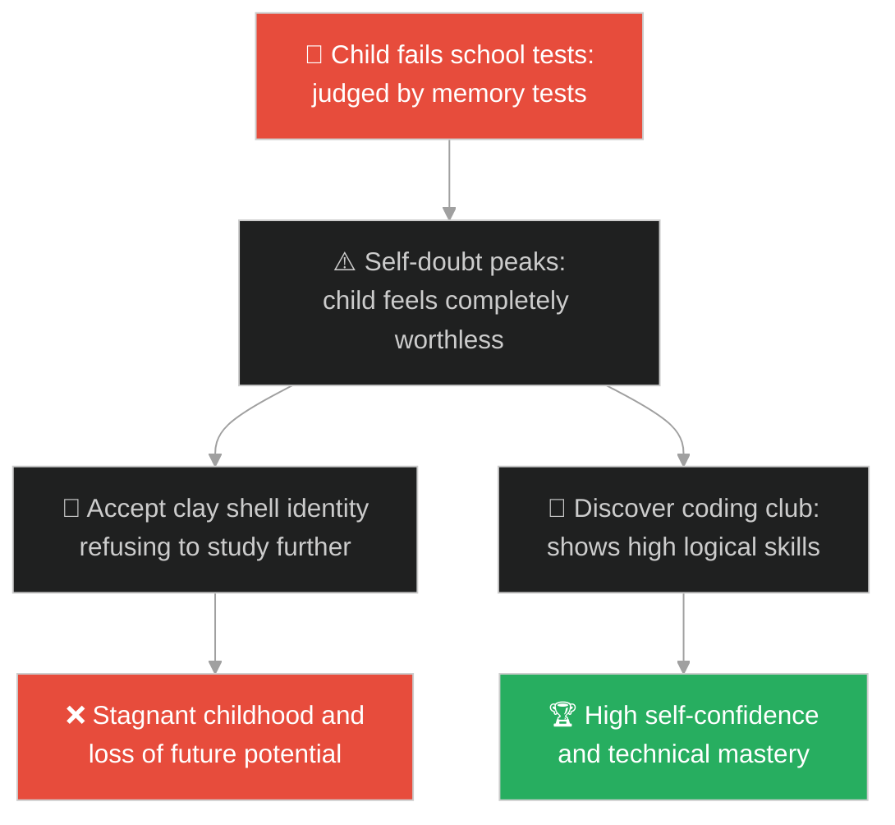
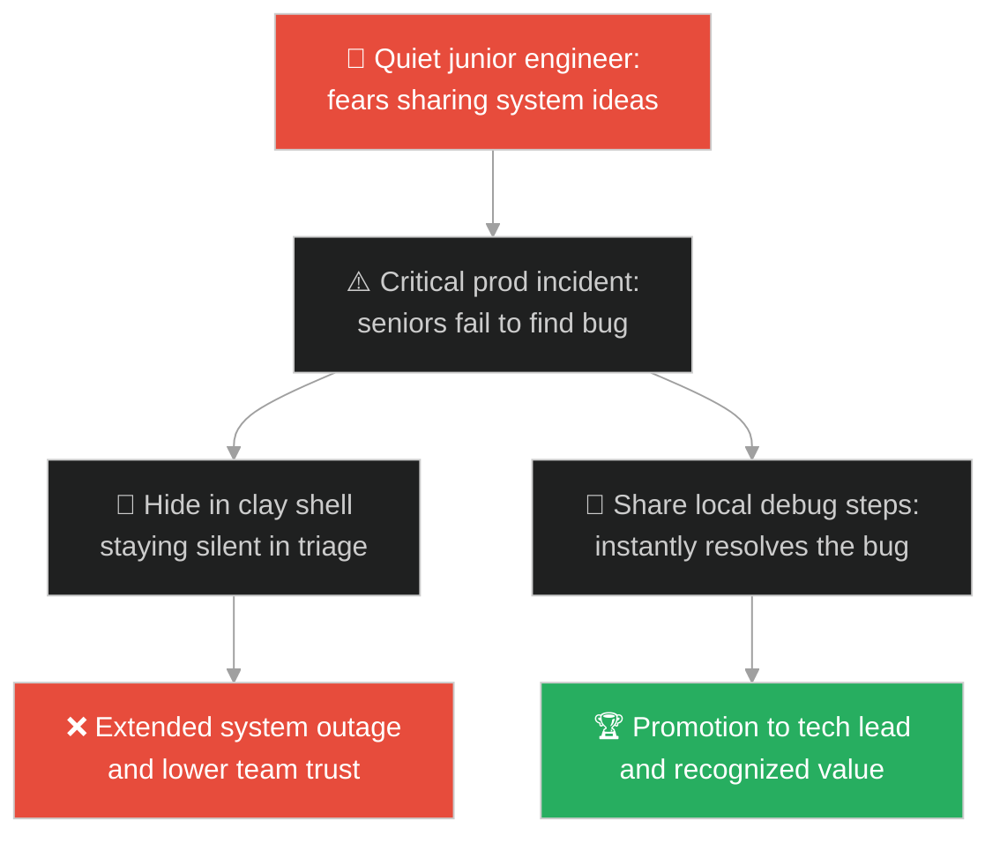
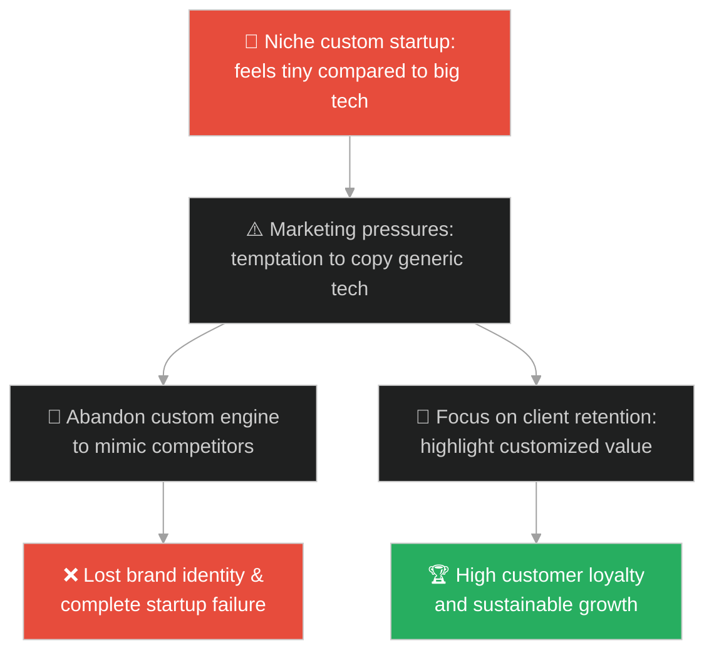
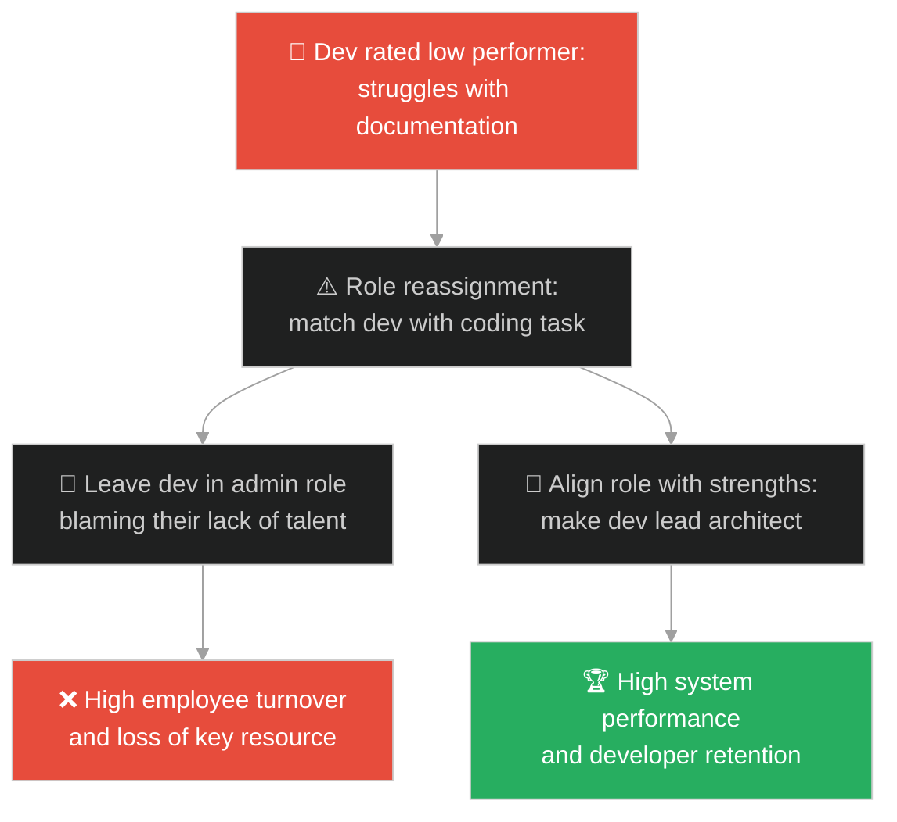
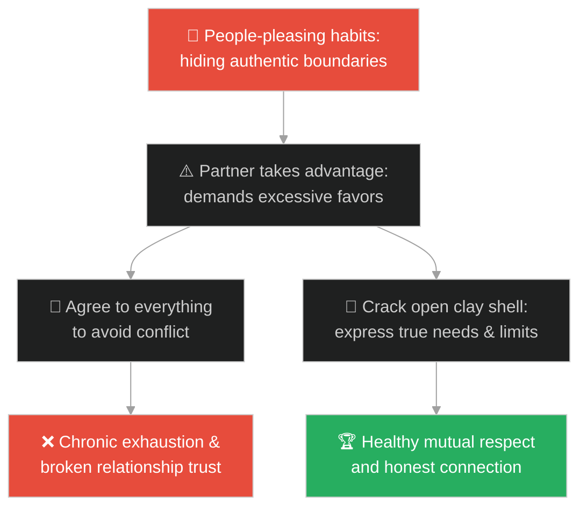
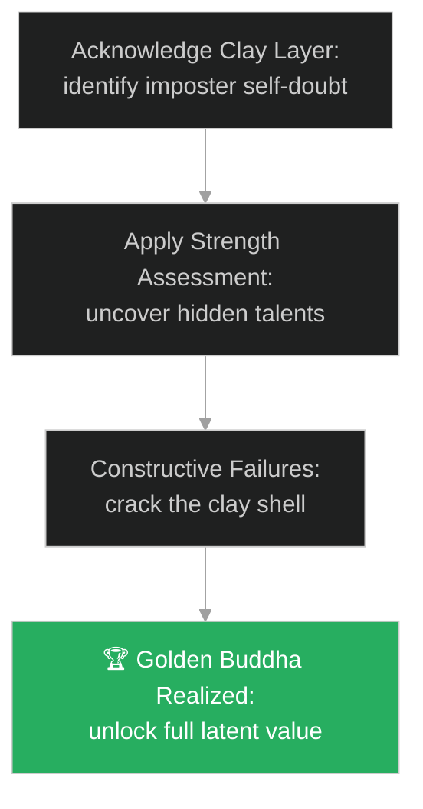

# Imposter Syndrome & Latent Value (វិបត្តិបោកប្រាស់ខ្លួនឯង និងតម្លៃលាក់កំបាំង)៖ ព្រះពុទ្ធបដិមាមាស (Imposter Syndrome & Latent Value & The Golden Buddha)

**Author:** ichamrong  
**Date:** 2026-05-28  
**Tags:** #buddhism #imposter-syndrome #self-worth #mental-models #potential  
**Category:** Concepts / Parables  
**Read Time:** ~15 min  

---

## 📌 មាតិកា (Table of Contents)
- [អន្ទាក់ផ្លូវចិត្ត (The Trap)](#0)
- [១. រឿងព្រេងប្រវត្តិសាស្ត្រ៖ ព្រះពុទ្ធបដិមាមាស (The History of the Golden Buddha)](#1)
  - [ការបែកធ្លាយនៃសំបកដីឥដ្ឋនៅវត្តត្រៃមិត្ត (The Cracking of the Clay Shell at Wat Traimit)](#1-1)
- [២. បញ្ហា៖ វិបត្តិបោកប្រាស់ខ្លួនឯង និងការមើលរំលងវិស្វករលាក់សមត្ថភាព (The Issue: Imposter Syndrome and Underutilizing Latent Engineering Talents)](#2)
- [៣. ឧទាហមណ៍ជាក់ស្តែងក្នុងពិភពពិត (Real World Examples)](#3)
  - [ឧទាហរណ៍ទី ១ — កម្រិតស្រាល (គ្រួសារ)៖ កុមារដែលរៀនខ្សោយតែពូកែខាងបច្ចេកវិទ្យា (The Underachieving Child with Hidden Logical Genius)](#3-1)
  - [ឧទាហរណ៍ទី ២ — កម្រិតមធ្យម (បច្ចេកទេស)៖ វិស្វករស្ងប់ស្ងាត់ដែលរកឃើញដំណោះស្រាយក្នុងវិបត្តិ (The Quiet Engineer Saving Production Triage)](#3-2)
  - [ឧទាហរណ៍ទី ៣ — កម្រិតមធ្យម (ធុរកិច្ច)៖ ក្រុមហ៊ុន Startup ផ្តោតលើទីផ្សារពិសេស (Niche Custom Startups Battling Tech Giants)](#3-3)
  - [ឧទាហរណ៍ទី ៤ — កម្រិតមធ្យម (សង្គម/គ្រប់គ្រង)៖ ការដាក់តួនាទីបុគ្គលិកខុសជំនាញ (Misaligned Job Roles masking Engineering Excellence)](#3-4)
  - [ឧទាហរណ៍ទី ៥ — កម្រិតធ្ងន់ (ទំនាក់ទំនង)៖ ការបាត់បង់ភាពពិតប្រាកដដោយសារការផ្គាប់ចិត្តគេ (People-Pleasing Masking Authentic Boundaries)](#3-5)
- [៤. ដំណោះស្រាយទូទៅ៖ ក្របខ័ណ្ឌវាយតម្លៃសមត្ថភាព និងការគោះបំបែកភាពភ័យខ្លាច (The General Solution: CliftonStrengths Alignment and Cracking the Self-Doubt Shell)](#4)
- [សេចក្តីសន្និដ្ឋាន (Conclusion)](#5)
- [ឯកសារយោង (References)](#6)
- [Related Posts](#7)

---

<a id="0"></a>
## អន្ទាក់ផ្លូវចិត្ត (The Trap)

តើអ្នកធ្លាប់ជួបសមាជិកក្រុមការងារ ឬខ្លួនអ្នកផ្ទាល់ ដែលមានចំណេះដឹង និងសមត្ថភាពបច្ចេកវិទ្យាខ្ពស់ តែតែងតែរក្សាភាពស្ងប់ស្ងាត់ មិនហ៊ានបញ្ចេញមតិ និងជឿជាក់ថាខ្លួនឯង "គ្មានសមត្ថភាពគ្រប់គ្រាន់" នៅក្នុងការប្រជុំធំៗដែរឬទេ?

នៅក្នុងការគ្រប់គ្រងធនធានមនុស្ស និងសក្តានុពល៖
* **យើងងាយនឹងធ្លាក់ក្នុងអន្ទាក់** នៃការបោកប្រាស់ខ្លួនឯង (Imposter Syndrome / Self-Doubt) ដែលប្រៀបដូចជាការស្រោបខ្លួនដោយដីឥដ្ឋក្រាស់ក្រឹត ដើម្បីលាក់បាំងតម្លៃពិតប្រាកដ (មាស) ព្រោះតែខ្លាចការបរាជ័យ។
* **We overlook** យន្តការគោះបំបែកសំបក (Strength Discovery) ដើម្បីរំដោះសក្តានុពល និងទេពកោសល្យដែលលាក់ខ្លួនរបស់សមាជិកក្រុម មកបម្រើផលប្រយោជន៍រួម។

ការលាក់បាំងសមត្ថភាពពិតដោយសារការសង្ស័យខ្លួនឯង ហៅថា **អន្ទាក់ព្រះពុទ្ធមាសស្រោបដីឥដ្ឋ (The Imposter Clay Shell Trap)**។

ដើម្បីយល់ដឹងពីរបៀបគោះបំបែកសំបកដីឥដ្ឋ នេះជាផែនទីបង្ហាញផ្លូវ៖
1. **រឿងព្រេងនិទាន (The Legend)** — រឿងរ៉ាវពិតប្រវត្តិសាស្ត្រនៃព្រះពុទ្ធមាស ៥.៥ តោន លាក់ខ្លួនក្រោមសំបកដីឥដ្ឋរាប់រយឆ្នាំនៅវត្តត្រៃមិត្ត។
2. **បញ្ហា (The Issue)** — ការវិភាគចិត្តវិទ្យានៃ Imposter Syndrome និងការលាក់ខ្លួននៃកូដស្អាតស្អំ (Clean Core) ក្រោម Legacy code។
3. **ឧទាហមណ៍ជាក់ស្តែងក្នុងពិភពពិត (Real World Examples)** — ពិនិត្យមើលបញ្ហានេះក្នុងកម្រិតគ្រួសារ បច្ចេកវិទ្យា ធុរកិច្ច ការគ្រប់គ្រង និងទំនាក់ទំនង។
4. **ដំណោះស្រាយទូទៅ (The General Solution)** — ការអនុវត្តការដឹកនាំផ្អែកលើចំណុចខ្លាំង (Strengths-Based Leadership) និងវប្បធម៌ស្វែងរកតម្លៃ។



---

<a id="1"></a>
## ១. រឿងព្រេងប្រវត្តិសាស្ត្រ៖ ព្រះពុទ្ធបដិមាមាស (The History of the Golden Buddha)

នេះមិនមែនជារឿងប្រឌិតឡើយ ប៉ុន្តែវាជារឿងពិតប្រវត្តិសាស្ត្រដែលបានកើតឡើងនៅ **វត្តត្រៃមិត្ត (Wat Traimit)** នាទីក្រុងបាងកក ប្រទេសថៃ៖

អស់រយៈពេលជាច្រើនសតវត្សមកហើយ វត្តនេះមានរូបសំណាកព្រះពុទ្ធមួយអង្គធ្វើពីដីឥដ្ឋដ៏ធំសម្បើម ដែលមើលទៅអាប់អួរ គ្មានតម្លៃ និងគ្មានការចាប់អារម្មណ៍ពីអ្នកទេសចរឡើយ។ អ្នកស្រុកបានគោរពបូជារូបសំណាកនេះជារូបសំណាកធម្មតា។

នៅឆ្នាំ ១៩៥៥ ព្រះសង្ឃបានសម្រេចចិត្តផ្លាស់ប្តូរទីតាំងរូបសំណាកដីឥដ្ឋនេះ៖
* ដោយសាររូបសំណាកនេះមានទម្ងន់ធ្ងន់ខ្លាំង ខ្សែពួរលើកក៏បានដាច់ ធ្វើឱ្យរូបសំណាកនេះធ្លាក់បោកទៅនឹងដី និងប្រេះស្រាំ។
* ដោយសារមេឃកំពុងភ្លៀង និងយប់ងងឹត ព្រះសង្ឃក៏យកតង់មកគ្របទុកសិន ដោយគិតថារូបសំណាកដីឥដ្ឋនេះប្រហែលជាបែកបាក់ខូចខាតខ្លះហើយ។

---

<a id="1-1"></a>
### ការបែកធ្លាយនៃសំបកដីឥដ្ឋនៅវត្តត្រៃមិត្ត (The Cracking of the Clay Shell at Wat Traimit)

នៅកណ្តាលអធ្រាត្រ ព្រះចៅអធិការវត្តបានកាន់ពិលដើរមកពិនិត្យមើលស្នាមប្រេះនៃដីឥដ្ឋ៖
* ពេលឆ្លុះពិលចំស្នាមប្រេះ លោកមានការភ្ញាក់ផ្អើលយ៉ាងខ្លាំង ព្រោះសង្កេតឃើញពន្លឺចាំងផ្លេកៗពណ៌លឿងមាស ចេញពីខាងក្នុងស្នាមប្រេះ។
* ដោយក្តីសង្ស័យ លោកបានយកញញួរ និងដែកចាស់ៗមកគោះបំបែកសំបកដីឥដ្ឋនោះចេញបន្តិចម្តងៗ។
* អ្វីដែលបានលាក់ខ្លួននៅខាងក្នុងអស់រយៈពេលរាប់រយឆ្នាំ មិនមែនជាដីឥដ្ឋទេ ប៉ុន្តែវាគឺជា **រូបសំណាកព្រះពុទ្ធដែលធ្វើពីមាសសុទ្ធសឹង ១០០% (ទម្ងន់ ៥.៥ តោន)**។
* គេបានស្រាវជ្រាវដឹងថា កាលពីសតវត្សមុន នៅពេលមានការឈ្លានពានរបស់សត្រូវ ព្រះសង្ឃជំនាន់នោះបានយកដីឥដ្ឋមកបូកស្រោបរូបសំណាកមាសនេះ ដើម្បីការពារវាពីការលួចប្លន់។ ព្រះសង្ឃទាំងនោះត្រូវបានសម្លាប់អស់ ធ្វើឱ្យអាថ៌កំបាំងនៃព្រះពុទ្ធមាសនេះត្រូវបានកប់បាត់ជារៀងរហូត។

---

<a id="2"></a>
## ២. បញ្ហា៖ វិបត្តិបោកប្រាស់ខ្លួនឯង និងការមើលរំលងវិស្វករលាក់សមត្ថភាព (The Issue: Imposter Syndrome and Underutilizing Latent Engineering Talents)

នៅក្នុងវិស្វកម្មសូហ្វវែរ វិបត្តិ "Imposter Syndrome" កើតឡើងញឹកញាប់បំផុតចំពោះវិស្វករកម្រិត Junior ឬសមាជិកក្រុមដែលស្ងៀមស្ងាត់។ ពួកគេមានគំនិតដោះស្រាយប្រព័ន្ធដ៏ល្អឥតខ្ចោះ តែពួកគេសន្មតថាគំនិតរបស់ពួកគេ "ល្ងង់ខ្លៅ" និងមិនហ៊ាននិយាយក្នុងការប្រជុំ។ ពួកគេលាក់ខ្លួននៅក្រោមសំបកដីឥដ្ឋនៃការសង្ស័យខ្លួនឯង ធ្វើឱ្យគម្រោងត្រូវខកខានឱកាសដោះស្រាយលឿន៖

```java
// ការលាក់ទុកក្បួនដោះស្រាយដ៏មានតម្លៃនៅក្រោមស្រទាប់កូដចាស់
public class LegacyClayMonolith {
    public class GoldenAlgorithmEngine {
        // តម្លៃពិតប្រាកដ៖ ក្បួនដោះស្រាយល្បឿនលឿន O(1)
        public String executeFastQuery() {
            return "Golden result achieved in constant time!";
        }
    }

    // អន្ទាក់៖ បិទបាំងកូដមាសដោយសារការភ័យខ្លាច និង boilerplate code
    public String getLegacyOutput() {
        GoldenAlgorithmEngine goldenEngine = new GoldenAlgorithmEngine();
        // សំបកដីឥដ្ឋ៖ បន្ថែមការ verify និង mapping ច្រើនជាន់ហួសហេតុ
        return "Clay Wrapper: " + goldenEngine.executeFastQuery();
    }
}
```

* **ការបាត់បង់សក្តានុពលក្រុម (Wasted Human Capital)៖** ការបណ្តោយឱ្យសមាជិកពូកែៗលាក់ខ្លួនក្នុងភាពស្ងប់ស្ងាត់ ធ្វើឱ្យក្រុមត្រូវពឹងផ្អែកតែលើមតិរបស់មនុស្សខ្លះដែលនិយាយខ្លាំងៗ តែគ្មានដំណោះស្រាយច្បាស់លាស់។
* **កូដស្អាតលាក់ក្នុង Legacy (Clean Core wrapped in Clay)៖** ជារឿយៗ ប្រព័ន្ធស្មុគស្មាញចាស់ៗមាន logic ដ៏ល្អមួយដុះស្លែនៅខាងក្នុង។ ការ refactor គឺដូចជាការគោះដីឥដ្ឋដើម្បីរកស្នូលមាស។

---

<a id="3"></a>
## ៣. ឧទាហមណ៍ជាក់ស្តែងក្នុងពិភពពិត

---

<a id="3-1"></a>
### ឧទាហរណ៍ទី ១ — កម្រិតស្រាល (គ្រួសារ)៖ កុមារដែលរៀនខ្សោយតែពូកែខាងបច្ចេកវិទ្យា (The Underachieving Child with Hidden Logical Genius)

កុមារម្នាក់រៀនមុខវិជ្ជាទូទៅបានពិន្ទុទាបនៅសាលា (សំបកដីឥដ្ឋ)។ ឪពុកម្តាយជឿជាក់ថាកូននេះគ្មានសមត្ថភាព និងអនាគតឡើយ។ ទោះជាយ៉ាងណា ពេលកុមារនោះចូលរួមក្នុងក្លឹបសរសេរកូដ គាត់បានរចនាហ្គេមដ៏ឆ្លាតវៃមួយយ៉ាងលឿន (ពន្លឺមាសប្រេះចេញ) ដែលបង្ហាញថាគាត់មានសមត្ថភាព logical thinking ខ្ពស់បំផុត។



---

<a id="3-2"></a>
### ឧទាហរណ៍ទី ២ — កម្រិតមធ្យម (បច្ចេកទេស)៖ វិស្វករស្ងប់ស្ងាត់ដែលរកឃើញដំណោះស្រាយក្នុងវិបត្តិ (The Quiet Engineer Saving Production Triage)

ក្នុងអំឡុងពេលប្រព័ន្ធ Cloud គាំងធ្ងន់ធ្ងរ វិស្វករ Senior ទាំងអស់កំពុងឈ្លោះប្រកែកគ្នាខ្លាំងៗក្នុងការប្រជុំ។ វិស្វករ Junior ស្ងៀមស្ងាត់ម្នាក់ (សំបកដីឥដ្ឋ) ដឹងពីបញ្ហានេះ តែមិនហ៊ាននិយាយព្រោះគិតថាខ្លួនឯងជាកូនពៅ។ ពេលប្រធានសង្កេតឃើញស្នាមប្រេះ និងលើកទឹកចិត្តឱ្យគាត់សាកល្បង គាត់បានដំណើរការ command តែមួយបន្ទាត់ដោះស្រាយបញ្ហាភ្លាមៗ (រូបមាសបង្ហាញខ្លួន)។



---

<a id="3-3"></a>
### ឧទាហរណ៍ទី ៣ — កម្រិតមធ្យម (ធុរកិច្ច)៖ ក្រុមហ៊ុន Startup ផ្តោតលើទីផ្សារពិសេស (Niche Custom Startups Battling Tech Giants)

ក្រុមហ៊ុន Startup តូចមួយមានអារម្មណ៍ភ័យខ្លាច និងចង់បិទអាជីវកម្មចោល ព្រោះមើលឃើញក្រុមហ៊ុនយក្ស Google ឬ Microsoft បញ្ចេញផលិតផលស្រដៀងគ្នា (សង្ស័យខ្លួនឯង)។ ទោះជាយ៉ាងណា ពេលពួកគេគោះសំបកដីឥដ្ឋចេញ ពួកគេរកឃើញថា តម្លៃពិតប្រាកដរបស់ពួកគេគឺ "ភាពស្និទ្ធស្នាល និងល្បឿនបម្រើអតិថិជនពិសេស" (មាស) ដែលក្រុមហ៊ុនយក្សគ្មានថ្ងៃធ្វើតាមបាន។



---

<a id="3-4"></a>
### ឧទាហរណ៍ទី ៤ — កម្រិតមធ្យម (សង្គម/គ្រប់គ្រង)៖ ការដាក់តួនាទីបុគ្គលិកខុសជំនាញ (Misaligned Job Roles masking Engineering Excellence)

បុគ្គលិកម្នាក់ត្រូវបានគេដាក់ឱ្យធ្វើការងាររៀបចំរបាយការណ៍ PDF និងការងាររដ្ឋបាលយឺតយ៉ាវ ធ្វើឱ្យគាត់ទទួលបានការវាយតម្លៃអន់បំផុត (សំបកដីឥដ្ឋ)។ ប្រធានគ្រប់គ្រងថ្មីបានសង្កេតឃើញស្នាមប្រេះ ក៏សម្រេចចិត្តប្តូរគាត់មកធ្វើជា System Architect។ គាត់បានរចនាប្រព័ន្ធ Cloud របស់ក្រុមហ៊ុនឡើងវិញយ៉ាងស្អាត និងសន្សំសំចៃថវិការាប់ម៉ឺនដុល្លារ (រូបមាសបង្ហាញខ្លួន)។



---

<a id="3-5"></a>
### ឧទាហរណ៍ទី ៥ — កម្រិតធ្ងន់ (ទំនាក់ទំនង)៖ ការបាត់បង់ភាពពិតប្រាកដដោយសារការផ្គាប់ចិត្តគេ (People-Pleasing Masking Authentic Boundaries)

មនុស្សម្នាក់ព្យាយាមផ្គាប់ចិត្តមិត្តភក្តិ និងដៃគូរាល់ថ្ងៃដោយមិនហ៊ាននិយាយបដិសេធ (សំបកដីឥដ្ឋការពារការឈឺចាប់)។ គាត់មានអារម្មណ៍ថាខ្លួនឯងគ្មានតម្លៃ និងអស់កម្លាំងផ្លូវចិត្តជាខ្លាំង។ ក្រោយពីសម្រេចចិត្តគោះសំបកដីឥដ្ឋចេញ បង្ហាញពីព្រំដែនផ្ទាល់ខ្លួន និងតម្រូវការច្បាស់លាស់ គាត់ទទួលបានការគោរព និងកោតសរសើរពិតប្រាកដពីមនុស្សជុំវិញខ្លួន (មាសសុទ្ធនៃតម្លៃខ្លួនឯង)។



---

<a id="4"></a>
## ៤. ដំណោះស្រាយទូទៅ៖ ក្របខ័ណ្ឌវាយតម្លៃសមត្ថភាព និងការគោះបំបែកភាពភ័យខ្លាច (The General Solution: CliftonStrengths Alignment and Cracking the Self-Doubt Shell)

ដើម្បីគោះបំបែកសំបកដីឥដ្ឋនៃការសង្ស័យខ្លួនឯង និងបញ្ចេញសមត្ថភាពមាស ចូរអនុវត្តយន្តការដូចខាងក្រោម៖



* **ការដឹកនាំផ្អែកលើចំណុចខ្លាំង (Strengths-Based Management)៖** ឈប់ព្យាយាមកែប្រែចំណុចខ្សោយរបស់បុគ្គលិកដែលមិនត្រូវនឹងធម្មជាតិរបស់គេទៀតទៅ។ ត្រូវប្រើប្រាស់ឧបករណ៍វាស់ស្ទង់ (ដូចជា CliftonStrengths) ដើម្បីស្វែងរក "មាស" ឬទេពកោសល្យពីកំណើតរបស់សមាជិកម្នាក់ៗ រួចតម្រង់ការងារឱ្យត្រូវនឹងទេពកោសល្យនោះ។
* **ការបង្កើតយន្តការ "លើកទឹកចិត្តសួរនាំ" (Psychological Safety and Mentorship)៖** ថ្នាក់ដឹកនាំក្រុមត្រូវដាស់តឿន និងបង្កើតឱកាសឱ្យសមាជិកស្ងប់ស្ងាត់បានបញ្ចេញមតិដំបូងគេក្នុងការប្រជុំ។ ជួយគោះសំបកដីឥដ្ឋរបស់ពួកគេថ្នមៗដោយការឱ្យតម្លៃរាល់សំណួរ និងគំនិតច្នៃប្រឌិត។
* **ការទទួលយកការប្រេះស្រាំជាឱកាស (Embracing Cracks)៖** ចងចាំថាស្នាមប្រេះក្នុងជីវិត (ការបរាជ័យ វិបត្តិ ឬការផ្លាស់ប្តូរការងារ) មិនមែនមកដើម្បីបំផ្លាញរូបសំណាកដីឥដ្ឋរបស់អ្នកឡើយ ប៉ុន្តែវាជាពន្លឺឆ្លុះបង្ហាញពីសក្តានុពលមាសដែលលាក់ទុកខាងក្នុង ដើម្បីឱ្យអ្នកហ៊ានគោះវាចេញ។

---

## 🐇 ធ្លាក់ចូលក្នុងរន្ធទន្សាយ (Enter the Rabbit Hole)

ដើម្បីស្វែងយល់កាន់តែស៊ីជម្រៅអំពីរបៀបឆ្លងកាត់ការភាន់ច្រឡំ និងការមើលឃើញការពិតច្បាស់លាស់ សូមចាប់ផ្តើមដំណើររុករករបស់អ្នកដោយចុចលើតំណភ្ជាប់ខាងក្រោម៖

* 🚀 **[ចាប់ផ្តើមដំណើររុករក (Start the Journey) ➔ ទ្វារទាំងបីនៃពាក្យសម្តី (The Three Gates of Speech)](./129-buddha-and-the-three-gates-of-speech.md)**

---

<a id="5"></a>
## សេចក្តីសន្និដ្ឋាន (Conclusion)

> **«ដីឥដ្ឋគ្រាន់តែជាសំបកការពារបណ្តោះអាសន្ន មាសសុទ្ធទើបជាអត្តសញ្ញាណពិតប្រាកដរបស់អ្នក។»**

ភាពសង្ស័យខ្លួនឯង (Imposter Syndrome) គឺជាសំបកដីឥដ្ឋដែលយើងសង់ឡើងដើម្បីការពារខ្លួនពីការរិះគន់របស់ពិភពខាងក្រៅ។ នៅពេលយើងរកឃើញភាពក្លាហានគោះបំបែកសំបកដីឥដ្ឋនោះចោល យើងនឹងបញ្ចេញពន្លឺ និងតម្លៃដ៏ពិតប្រាកដរបស់យើង ជួយសង្គ្រោះប្រព័ន្ធការងារ និងដឹកនាំក្រុមការងារទៅរកភាពត្រចះត្រចង់។

---

<a id="6"></a>
## ឯកសារយោង (References)

* **Wat Traimit Golden Buddha History** — Bangkok, Thailand. Historical discovery of the hidden 5.5-ton gold statue in 1955.
* **Pauline Clance & Suzanne Imes** — *The Impostor Phenomenon in High Achieving Women: Dynamics and Therapeutic Intervention* (1978). First clinical description of Imposter Syndrome.
* **Donald O. Clifton** — *Strengths-Based Leadership* (2008). Methodology on identifying latent talents and placing them in correct execution roles.

---

<a id="7"></a>
## Related Posts

* [The Wooden Tent and the Palace of Stone](./19-the-wooden-tent-and-the-palace-of-stone.md) — How refactoring legacy systems (clay) reveals pure domain structures (gold).
* [Steve Jobs and the Power of Saying No](./51-the-four-quadrants.md) — Focusing on core golden features by shedding clay scope creep.
