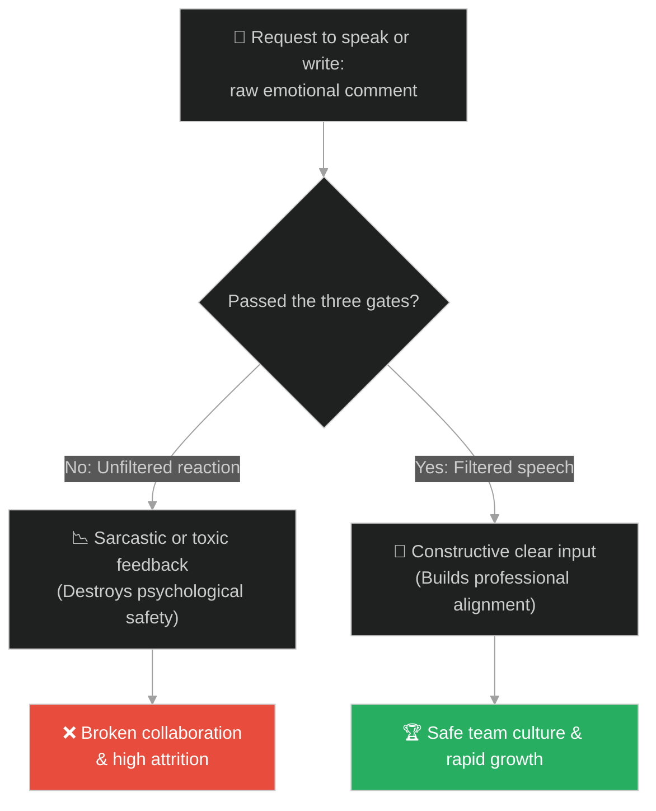
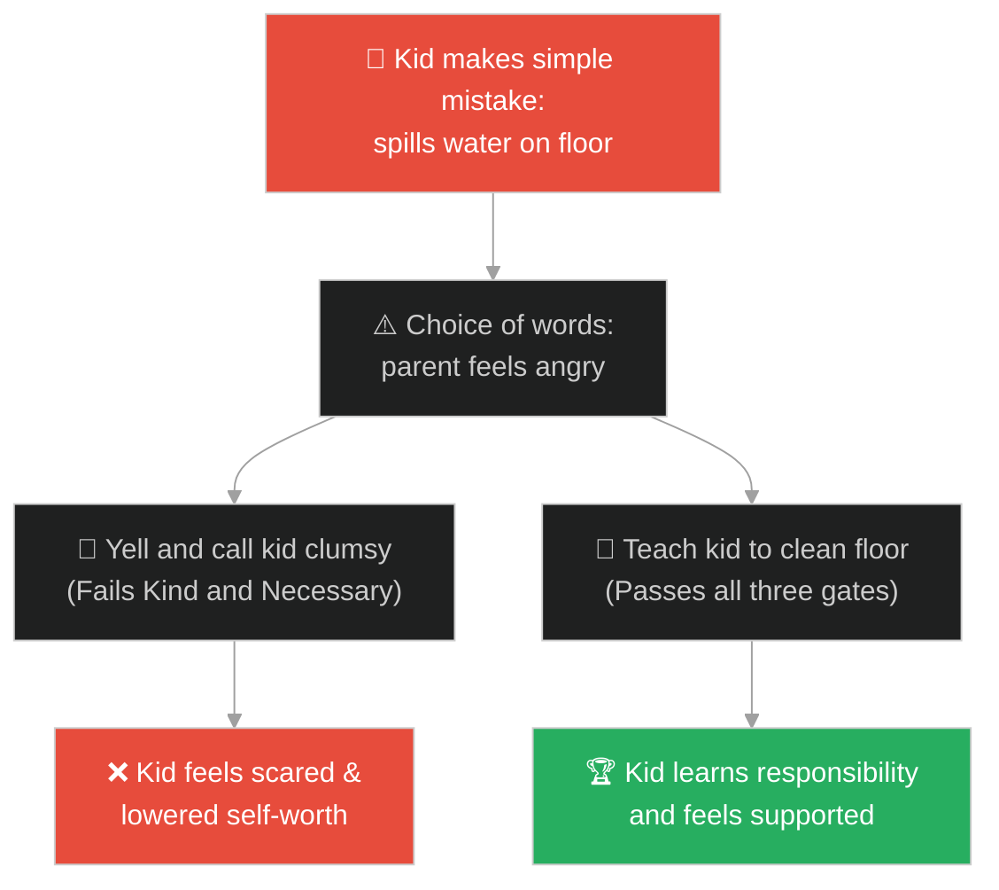
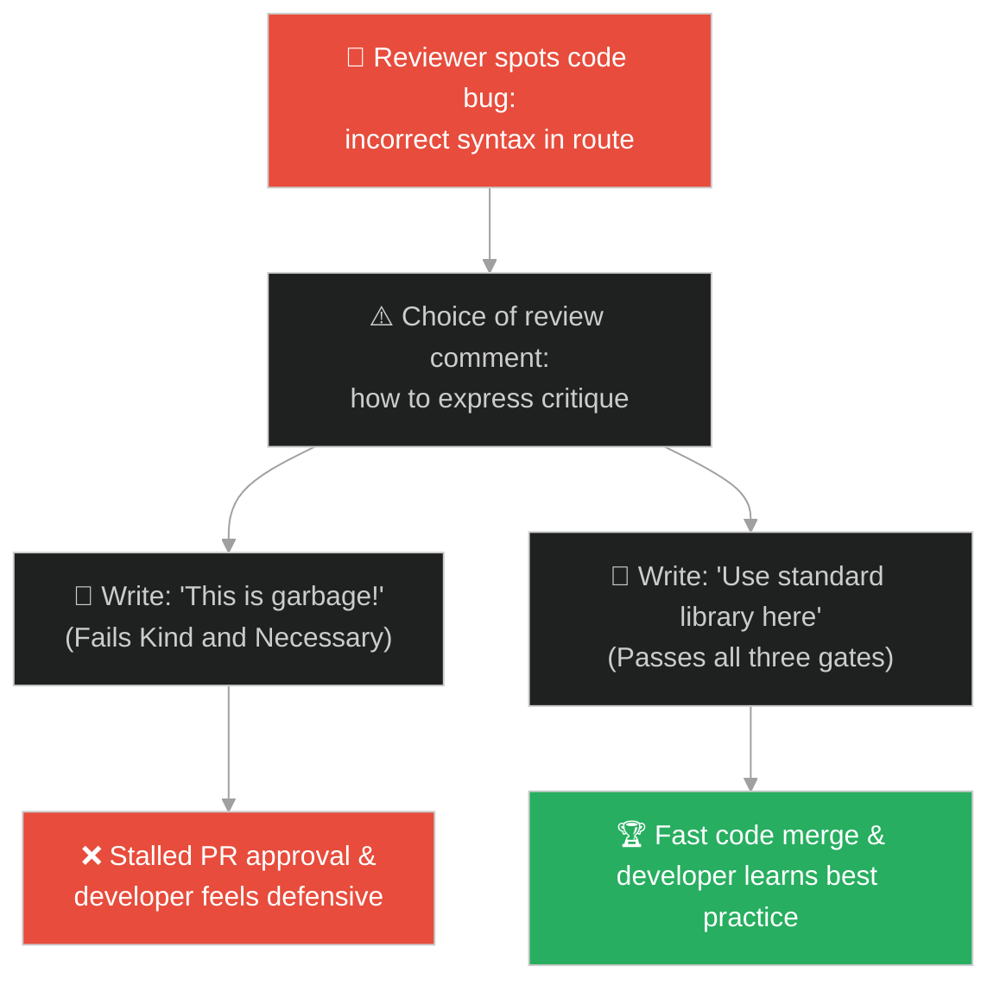
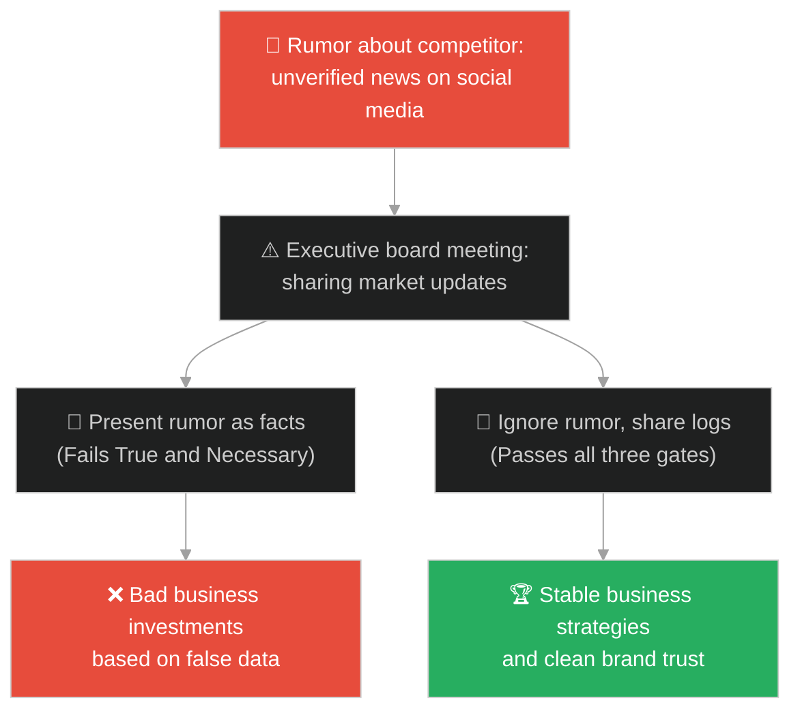
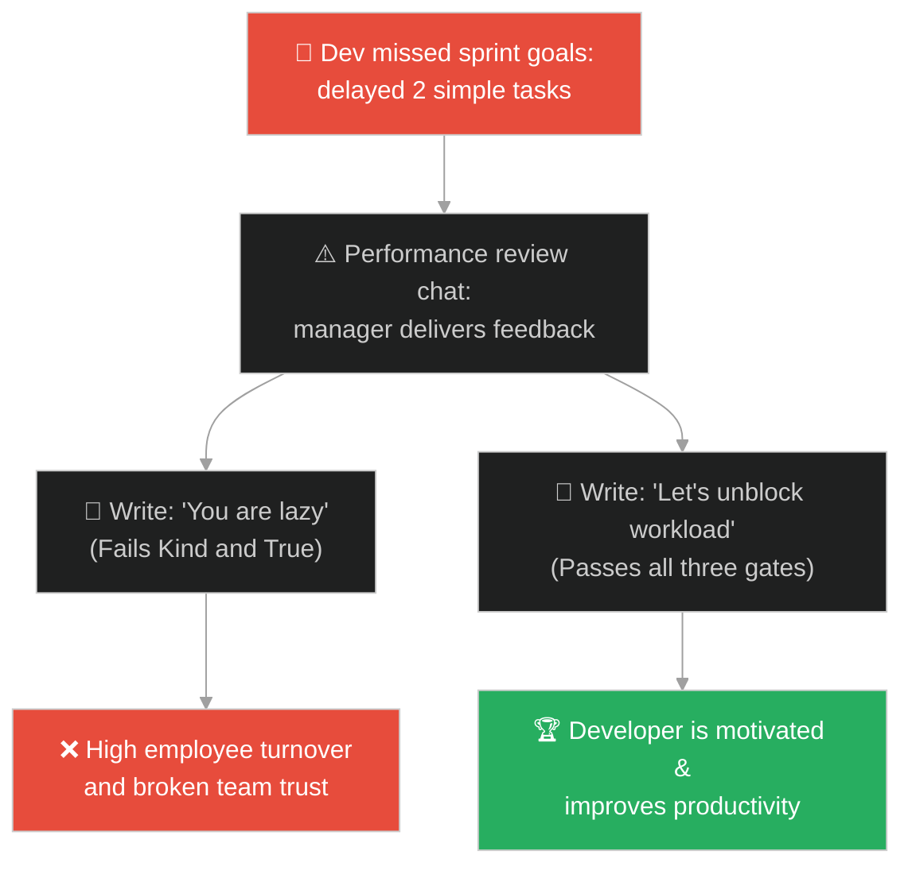
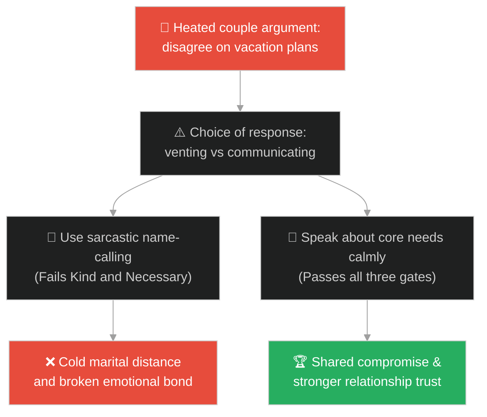
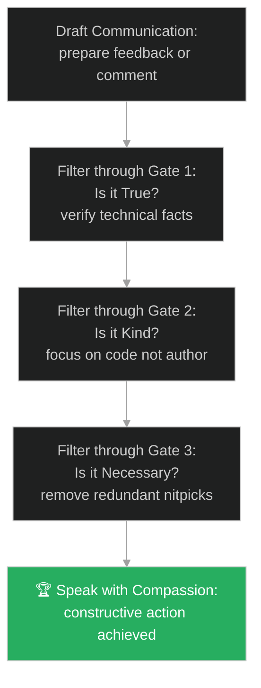

# Semantic Precision & Constructive Feedback (ភាពជាក់លាក់នៃអត្ថន័យ និងមតិស្ថាបនា)៖ ទ្វារទាំងបីនៃពាក្យសម្តី (Semantic Precision & Constructive Feedback & The Three Gates of Speech)

**Author:** ichamrong  
**Date:** 2026-05-28  
**Tags:** #buddhism #communication #mindfulness #emotional-intelligence #relationships  
**Category:** Concepts / Parables  
**Read Time:** ~15 min  

---

## 📌 មាតិកា (Table of Contents)
- [អន្ទាក់ផ្លូវចិត្ត (The Trap)](#0)
- [១. រឿងព្រេងប្រវត្តិសាស្ត្រ៖ ទ្វារទាំងបីនៃពាក្យសម្តី (The Legend of the Three Gates of Speech)](#1)
  - [សំណួរចម្រោះទាំងបីចំពោះមុខពាក្យសម្តី (The Three Filtering Questions)](#1-1)
- [២. បញ្ហា៖ មតិរិះគន់ដែលមានជាតិពុល និងការបំផ្លាញផលិតភាពក្នុង Code Reviews (The Issue: Toxic Code Reviews and Sarcastic Communication Loops)](#2)
- [៣. ឧទាហមណ៍ជាក់ស្តែងក្នុងពិភពពិត (Real World Examples)](#3)
  - [ឧទាហរណ៍ទី ១ — កម្រិតស្រាល (គ្រួសារ)៖ ការស្តីបន្ទោសកូនតូចពេលធ្វើកំពប់ទឹក (Parent Yelling at Child for Spilling Water)](#3-1)
  - [ឧទាហរណ៍ទី ២ — កម្រិតមធ្យម (បច្ចេកទេស)៖ ការសរសេរមតិរិះគន់កូដបែបឌឺដង (Sarcastic Comments on Pull Request Reviews)](#3-2)
  - [ឧទាហរណ៍ទី ៣ — កម្រិតមធ្យម (ធុរកិច្ច)៖ ការផ្សព្វផ្សាយព័ត៌មានចចាមអារ៉ាមពីគូប្រជែង (Board Members Spreading Unverified Competitor Rumors)](#3-3)
  - [ឧទាហរណ៍ទី ៤ — កម្រិតមធ្យម (សង្គម/គ្រប់គ្រង)៖ ការវាយតម្លៃបុគ្គលិកដោយអារម្មណ៍ផ្ទាល់ខ្លួន (Managers Delivering Emotional Performance Feedback)](#3-4)
  - [ឧទាហរណ៍ទី ៥ — កម្រិតធ្ងន់ (ទំនាក់ទំនង)៖ ការប្រើសម្តីឌឺដងក្នុងជម្លោះប្តីប្រពន្ធ (Sarcastic Retorts During Vacation Planning Arguments)](#3-5)
- [៤. ដំណោះស្រាយទូទៅ៖ ច្បាប់ក្រមសីលធម៌នៃការវាយតម្លៃកូដ និងការបញ្ចេញមតិស្ថាបនា (The General Solution: Pull Request Etiquettes and Compassionate Feedback Loops)](#4)
- [សេចក្តីសន្និដ្ឋាន (Conclusion)](#5)
- [ឯកសារយោង (References)](#6)
- [Related Posts](#7)

---

<a id="0"></a>
## អន្ទាក់ផ្លូវចិត្ត (The Trap)

តើអ្នកធ្លាប់ជួបស្ថានភាពដែលអ្នកត្រួតពិនិត្យកូដ (Reviewer) សរសេរមតិរិះគន់នៅលើ Pull Request របស់មិត្តរួមការងារថា *"កូដនេះដូចសំរាម"* ឬ *"តើនរណាជាអ្នកសរសេរកូដល្ងង់ៗបែបនេះ?"* ដែរឬទេ?

នៅក្នុងបរិយាកាសការងារ និងការប្រាស្រ័យទាក់ទង៖
* **យើងងាយនឹងធ្លាក់ក្នុងអន្ទាក់** នៃការបញ្ចេញមតិបែបបំផ្លិចបំផ្លាញ និងប្រើប្រាស់អារម្មណ៍ផ្ទាល់ខ្លួន (Destructive Feedback / Toxic Reviews) ដែលប្រៀបដូចជាការជះទឹកកខ្វក់ ធ្វើឱ្យប៉ះពាល់ដល់អារម្មណ៍ និងការលូតលាស់របស់អ្នកដទៃ។
* **យើងមើលរំលង** គោលការណ៍ចម្រោះពាក្យសម្តីដើម្បីភាពស្ថាបនា (Is it True? Is it Kind? Is it Necessary?) ដោយនិយាយ ឬសរសេរអ្វីៗតាមតែចិត្តចង់ ដើម្បីបង្ហាញអំណាច ឬអំនួតផ្ទាល់ខ្លួន។

ការប្រើសម្តីគ្មានការពិចារណាដែលបំផ្លាញកិច្ចសហការ ហៅថា **អន្ទាក់សម្តីគ្មានទ្វារចម្រោះ (The Unfiltered Speech Trap)**។

ដើម្បីយល់ដឹងពីរបៀបនិយាយ និងសរសេរមតិប្រកបដោយការស្ថាបនា នេះជាផែនទីបង្ហាញផ្លូវ៖
1. **រឿងព្រេងនិទាន (The Legend)** — រឿងរ៉ាវរបស់បុរសចង់និយាយដើមមិត្តភក្តិ តែព្រះពុទ្ធឱ្យឆ្លងកាត់ទ្វារចម្រោះទាំងបីជាមុនសិន។
2. **បញ្ហា (The Issue)** — ការវិភាគចិត្តវិទ្យានៃសុវត្ថិភាពផ្លូវចិត្ត (Psychological Safety) និងការត្រួតពិនិត្យកូដបែបពុល (Toxic Reviews)។
3. **ឧទាហមណ៍ជាក់ស្តែងក្នុងពិភពពិត (Real World Examples)** — ពិនិត្យមើលបញ្ហានេះក្នុងកម្រិតគ្រួសារ បច្ចេកវិទ្យា ធុរកិច្ច ការគ្រប់គ្រង និងទំនាក់ទំនង។
4. **ដំណោះស្រាយទូទៅ (The General Solution)** — ការអនុវត្តក្រមសីលធម៌នៃការត្រួតពិនិត្យកូដ (PR Etiquettes) និងការផ្តល់មតិស្ថាបនា។



---

<a id="1"></a>
## ១. រឿងព្រេងប្រវត្តិសាស្ត្រ៖ ទ្វារទាំងបីនៃពាក្យសម្តី (The Legend of the Three Gates of Speech)

ថ្ងៃមួយ មានបុរសម្នាក់បានរត់យ៉ាងប្រញាប់ប្រញាល់ចូលមកជួបព្រះពុទ្ធដោយទឹកមុខអន្ទះសា។ គាត់បាននិយាយទាំងដង្ហក់ថា៖
* *«ព្រះអង្គ! ទូលបង្គំមានរឿងបន្ទាន់មួយចង់ប្រាប់ព្រះអង្គអំពីមិត្តភក្តិរបស់ព្រះអង្គម្នាក់។ ព្រះអង្គមិនដឹងទេថា គេបាននិយាយអ្វីខ្លះអាក្រក់ពី...»*

ព្រះពុទ្ធទ្រង់បានលើកព្រះហស្ថឡើងបញ្ឈប់បុរសនោះ រួចមានសង្ឃដីកាដោយស្នាមញញឹមស្ងប់ថា៖
> «ឈប់សិន អ្នកកំលោះ! មុននឹងអ្នកប្រាប់តថាគតអំពីរឿងនោះ តើពាក្យសម្តីដែលអ្នកហៀបនឹងនិយាយនេះ បានឆ្លងកាត់ទ្វារទាំងបី (The Three Gates) ហើយឬនៅ?»

បុរសនោះមានការងឿងឆ្ងល់យ៉ាងខ្លាំង ហើយទូលសួរត្រឡប់ទៅវិញថា៖
* *«ទ្វារទាំងបី? តើវាជាអ្វីទៅព្រះអង្គ?»*

---

<a id="1-1"></a>
### សំណួរចម្រោះទាំងបីចំពោះមុខពាក្យសម្តី (The Three Filtering Questions)

ព្រះពុទ្ធទ្រង់បានពន្យល់ដាស់តឿនថា៖
> «មុននឹងយើងនិយាយរឿងអ្វីមួយអំពីអ្នកដទៃ យើងត្រូវចម្រោះវាឆ្លងកាត់ទ្វារទាំងបី៖»

១. **ទ្វារទី១ (Is it True? - តើវាជាការពិតទេ?)**៖ តើអ្នកច្បាស់ ១០០% ទេថា រឿងដែលអ្នកហៀបនឹងនិយាយនេះ គឺជា **ការពិតជាក់ស្តែង** ដោយផ្ទាល់ភ្នែក?
* បុរសនោះឱនមុខចុះ រួចឆ្លើយថា៖ *"អត់ទេ ព្រះអង្គ ទូលបង្គំគ្រាន់តែឮគេនិយាយតៗគ្នាប៉ុណ្ណោះ..."*

២. **ទ្វារទី២ (Is it Kind? - តើវាជាពាក្យល្អទេ?)**៖ បើទោះជាវាមិនប្រាកដថាជាការពិត តើពាក្យដែលអ្នកហៀបនឹងនិយាយនោះ គឺជា **ពាក្យល្អ មានចេតនាល្អ និងចង់ជួយគេ** ដែរឬទេ?
* បុរសនោះកាន់តែអៀនខ្មាស ហើយឆ្លើយថា៖ *"អត់ទេ វាជារឿងមិនល្អដែលគេនិយាយដើមប្រឡាក់ប្រឡូស..."*

៣. **ទ្វារទី៣ (Is it Necessary? - តើវាចាំបាច់ទេ?)**៖ បើវាមិនមែនជាការពិត ហើយវាក៏មិនមែនជារឿងល្អ តើវាជារឿងដែល **ចាំបាច់បំផុត និងមានប្រយោជន៍** ដែលតថាគតត្រូវតែដឹងដែរឬទេ?
* បុរសនោះគ្រវីក្បាល៖ *"មិនចាំបាច់ទេ ព្រះអង្គ..."*

ព្រះសម្មាសម្ពុទ្ធទ្រង់សម្តែងព្រះពុទ្ធដីកាបិទបញ្ចប់ថា៖
> «បើពាក្យដែលអ្នកហៀបនឹងនិយាយ មិនមែនជាការពិត មិនមែនជារឿងល្អ ហើយក៏មិនចាំបាច់ តើអ្នកនិយាយវាចេញមកដើម្បីអ្វី? ទុកឱ្យវាហើរទៅតាមខ្យល់ចុះ។»

---

<a id="2"></a>
## ២. បញ្ហា៖ មតិរិះគន់ដែលមានជាតិពុល និងការបំផ្លាញផលិតភាពក្នុង Code Reviews (The Issue: Toxic Code Reviews and Sarcastic Communication Loops)

នៅក្នុងការវាយតម្លៃកូដ (Code Review) បញ្ហាដ៏ធំបំផុតគឺការប្រើប្រាស់ពាក្យសម្តីឌឺដង និងគ្មានការស្ថាបនា។ អ្នកត្រួតពិនិត្យ (Reviewer) ខ្លះប្រើប្រាស់ពាក្យសម្តីដើម្បីបង្ហាញអំណាច ឬធ្វើឱ្យអ្នកសរសេរកូដ (ជាពិសេស Junior) មានអារម្មណ៍ខ្មាសអៀន។ នេះមិនមែនជាការជួយឱ្យកូដល្អឡើងទេ តែវាជាការបំផ្លាញទំនុកចិត្ត និងបង្កើតឱ្យមានការលាក់បាំងកំហុស៖

```java
// ការត្រួតពិនិត្យមតិយោបល់ដើម្បីឱ្យឆ្លងកាត់ទ្វារទាំងបីមុននឹងបង្ហោះ
public class PullRequestCommentValidator {
    public boolean validateComment(String comment, boolean isTrue, boolean isKind, boolean isNecessary) {
        // ទ្វារទាំងបី៖ ត្រូវតែជាការពិត មានចិត្តល្អ និងមានភាពចាំបាច់
        if (isTrue && isKind && isNecessary) {
            System.out.println("Comment approved for posting: " + comment);
            return true;
        } else {
            // អន្ទាក់៖ សម្តីមិនល្អ ឬគ្មានប្រយោជន៍ ត្រូវបោះចោល
            System.out.println("Blocked! The comment fails to pass the three gates.");
            return false;
        }
    }
}
```

* **ការបាត់បង់សុវត្ថិភាពផ្លូវចិត្ត (Psychological Safety Loss)៖** នៅពេលមតិរិះគន់គ្មានភាពមេត្តា វិស្វករនឹងឈប់សួរនាំ ឬលែងហ៊ានសាកល្បងដំណោះស្រាយថ្មីៗ ព្រោះខ្លាចត្រូវបានគេរិះគន់ប្រមាថ។
* **ការខូចខាតទំនាក់ទំនងក្នុងក្រុម (Team Attrition)៖** ការប្រើសម្តីឌឺដងក្នុង Slack ឬ Telegram បង្កើតជម្លោះផ្ទៃក្នុង និងអត្រាលាលែងពីការងារខ្ពស់។

---

<a id="3"></a>
## ៣. ឧទាហមណ៍ជាក់ស្តែងក្នុងពិភពពិត

---

<a id="3-1"></a>
### ឧទាហរណ៍ទី ១ — កម្រិតស្រាល (គ្រួសារ)៖ ការស្តីបន្ទោសកូនតូចពេលធ្វើកំពប់ទឹក (Parent Yelling at Child for Spilling Water)

កូនតូចម្នាក់បានធ្វើកំពប់ទឹកលើឥដ្ឋដោយអចេតនា (ដីភក់)។ ឪពុកខឹងនិងស្រែកជេរថា៖ *"ឯងពិតជាឆ្កួត ល្ងង់ខ្លៅ និងមិនចេះប្រុងប្រយ័ត្នសោះ!"* (Fails Kind and Necessary)។ សម្តីនេះធ្វើឱ្យកូនភ័យខ្លាច យំយែក និងបាត់បង់ទំនុកចិត្តលើខ្លួនឯង ជំនួសឱ្យការណែនាំកូនឱ្យយកក្រណាត់មកជូតសម្អាតតាមសម្រួល។



---

<a id="3-2"></a>
### ឧទាហរណ៍ទី ២ — កម្រិតមធ្យម (បច្ចេកទេស)៖ ការសរសេរមតិរិះគន់កូដបែបឌឺដង (Sarcastic Comments on Pull Request Reviews)

អ្នកអភិវឌ្ឍន៍ម្នាក់បានសរសេរ code មួយដែលមានកំហុស logic (ដីភក់)។ អ្នកត្រួតពិនិត្យម្នាក់បានសរសេរមតិថា៖ *"កូដបែបនេះ ក្មេងរៀនសរសេរកូដដំបូងក៏មិនធ្វើដែរ"* (Fails Kind)។ មតិគ្មានប្រយោជន៍នេះធ្វើឱ្យអ្នកសរសេរកូដមានអារម្មណ៍ការពារខ្លួន (Defensive) រួចឈ្លោះប្រកែកគ្នាលើប្រព័ន្ធ Git បង្កើតភាពយឺតយ៉ាវ និងភាពរកាំរកូសក្នុងក្រុម។



---

<a id="3-3"></a>
### ឧទាហរណ៍ទី ៣ — កម្រិតមធ្យម (ធុរកិច្ច)៖ ការផ្សព្វផ្សាយព័ត៌មានចចាមអារ៉ាមពីគូប្រជែង (Board Members Spreading Unverified Competitor Rumors)

នៅក្នុងការប្រជុំក្រុមប្រឹក្សាភិបាល សមាជិកម្នាក់បាននិយាយថា គូប្រជែងធំរបស់ពួកគេកំពុងប្រឈមនឹងការក្ស័យធន (ព័ត៌មានចចាមអារ៉ាមមិនច្បាស់លាស់)។ នាយកប្រតិបត្តិបានជឿភ្លាម និងបញ្ជាឱ្យកាត់បន្ថយថវិកាទីផ្សារ (Fails True)។ ក្រោយមក គូប្រជែងពិតប្រាកដបានបញ្ចេញយុទ្ធនាការធំ និងដណ្តើមយកអតិថិជនទាំងអស់ ព្រោះព័ត៌មាននោះមិនមែនជាការពិត។



---

<a id="3-4"></a>
### ឧទាហរណ៍ទី ៤ — កម្រិតមធ្យម (សង្គម/គ្រប់គ្រង)៖ ការវាយតម្លៃបុគ្គលិកដោយអារម្មណ៍ផ្ទាល់ខ្លួន (Managers Delivering Emotional Performance Feedback)

ប្រធានគ្រប់គ្រងម្នាក់ខឹងនឹងបុគ្គលិកម្នាក់ដែលមកយឺតម្តង ក៏បាននិយាយក្នុងការវាយតម្លៃការងារថា៖ *"អ្នកជាមនុស្សខ្ជិលច្រអូស គ្មានការទទួលខុសត្រូវ និងមិនដែលយកចិត្តទុកដាក់ការងារ"* (Fails True and Kind)។ មតិរិះគន់អត្តនោម័តនេះធ្វើឱ្យបុគ្គលិកបាត់បង់ទឹកចិត្ត និងមានអារម្មណ៍ថាប្រធានមានភាពលម្អៀង។



---

<a id="3-5"></a>
### ឧទាហរណ៍ទី ៥ — កម្រិតធ្ងន់ (ទំនាក់ទំនង)៖ ការប្រើសម្តីឌឺដងក្នុងជម្លោះប្តីប្រពន្ធ (Sarcastic Retorts During Vacation Planning Arguments)

ក្នុងអំឡុងពេលពិភាក្សាពីរឿងរៀបចំគម្រោងធ្វើដំណើរកម្សាន្តចុងសប្តាហ៍ ប្តីចង់ទៅភ្នំ ប្រពន្ធចង់ទៅសមុទ្រ។ ប្រពន្ធបាននិយាយថា៖ *"អ្នកឯងមិនដែលចេះគិតពីអារម្មណ៍អ្នកដទៃទេ គិតតែពីខ្លួនឯងដូចសត្វធាតុ"* (Fails Kind)។ សម្តីអាក្រក់នេះបំផ្លាញទំនាក់ទំនងទាំងស្រុង បង្កើតជាជម្លោះក្តៅគគុក ជំនួសឱ្យការពិភាក្សាស្វែងរកដំណោះស្រាយបត់បែនរួមគ្នា។



---

<a id="4"></a>
## ៤. ដំណោះស្រាយទូទៅ៖ ច្បាប់ក្រមសីលធម៌នៃការវាយតម្លៃកូដ និងការបញ្ចេញមតិស្ថាបនា (The General Solution: Pull Request Etiquettes and Compassionate Feedback Loops)

ដើម្បីបណ្តុះការប្រាស្រ័យទាក់ទងប្រកបដោយសតិ និងភាពស្ថាបនា ចូរអនុវត្តយន្តការចម្រោះសម្តីទាំងបី៖



* **ការបង្កើតក្រមសីលធម៌ត្រួតពិនិត្យកូដ (PR Etiquettes Rules)៖** បង្កើតច្បាប់ចម្រោះសម្តី ៣ យ៉ាងក្នុងការសរសេរ comments៖
  1. **ផ្តោតលើកូដ មិនមែនលើបុគ្គល (Focus on code, not author)៖** ប្រើពាក្យ *"កូដត្រង់បន្ទាត់នេះអាចកែលម្អ..."* ជំនួសឱ្យពាក្យ *"អ្នកសរសេរបែបនេះខុសហើយ..."*។
  2. **ពន្យល់ពីមូលហេតុ (Explain the 'Why')៖** រាល់ការស្នើសុំកែប្រែ ត្រូវភ្ជាប់ជាមួយភស្តុតាង ឬ link ឯកសារយោងបច្ចេកទេស។
  3. **ប្រើសញ្ញាសម្គាល់កម្រិត (Nitpick vs Critical)៖** បែងចែករវាងការណែនាំលំអិត (Nit) និងចំណុចចាំបាច់ត្រូវតែកែ (Blocking change)។
* **ការអនុវត្តគោលការណ៍ "គិត ៣ វិនាទីមុននិយាយ" (The 3-Second Pause Rule)៖** មុននឹងចុចប៊ូតុង Send សារ ឬនិយាយឆ្លើយតបទៅកាន់នរណាម្នាក់ ចូរផ្អាកដកដង្ហើម និងសួរខ្លួនឯងថា៖ *"តើសារនេះពិតជាការពិត មានចិត្តល្អ និងចាំបាច់បំផុតដែរឬទេ?"* បើខ្វះចំណុចណាមួយ ចូរលុបវាចោល ឬសរសេរឡើងវិញ។
* **ការផ្តល់មតិបែបសាំងវិច (Feedback Sandwich Method)៖** ផ្តើមដោយការសរសើរចំណុចល្អ និងការខិតខំប្រឹងប្រែង បន្ទាប់មកផ្តល់មតិស្ថាបនាលើចំណុចខ្វះខាតដោយសីលធម៌ និងបញ្ចប់ដោយការលើកទឹកចិត្ត និងការគាំទ្រ។

---

## 🐇 ធ្លាក់ចូលក្នុងរន្ធទន្សាយ (Enter the Rabbit Hole)

ដើម្បីស្វែងយល់កាន់តែស៊ីជម្រៅអំពីរបៀបឆ្លងកាត់ការភាន់ច្រឡំ និងការមើលឃើញការពិតច្បាស់លាស់ សូមចាប់ផ្តើមដំណើររុករករបស់អ្នកដោយចុចលើតំណភ្ជាប់ខាងក្រោម៖

* 🚀 **[ចាប់ផ្តើមដំណើររុករក (Start the Journey) ➔ អំណោយទាំងប្រាំពីរ (The Seven Gifts)](./130-buddha-and-the-seven-gifts.md)**

---

<a id="5"></a>
## សេចក្តីសន្និដ្ឋាន (Conclusion)

> **«ពាក្យសម្តីដែលនិយាយចេញទៅហើយ មិនអាចប្រមូលមកវិញបានឡើយ ដូចទឹកដែលជះចោលលើដី។»**

អំណាចនៃពាក្យសម្តីអាចកសាង ឬបំផ្លាញទំនាក់ទំនង និងផលិតភាពការងារបានយ៉ាងងាយ។ ការអនុវត្ត "ទ្វារទាំងបីនៃពាក្យសម្តី" ជួយឱ្យយើងរក្សាបាននូវភាពជាក់លាក់នៃអត្ថន័យ ការពារទំនុកចិត្ត និងបង្កើតបរិយាកាសការងារប្រកបដោយសន្តិភាព សុវត្ថិភាពផ្លូវចិត្ត និងផលិតភាពខ្ពស់បំផុត។

---

<a id="6"></a>
## ឯកសារយោង (References)

* **Socrates' Triple Filter Test** — Classical Greek philosophy on testing truth, goodness, and usefulness of incoming information.
* **Right Speech (Samma Vaca)** — Part of the Buddhist Noble Eightfold Path, emphasizing abstaining from lying, gossip, and harsh speech.
* **Robert C. Martin** — *The Clean Coder: A Code of Conduct for Professional Programmers* (2011). Guidelines on professional communication and code review ethics.

---

<a id="7"></a>
## Related Posts

* [The Angel and Demon Dilemma](./03-angel-and-demon-dilemma.md) — Overcoming communication flaws and building emotional intelligence (EQ).
* [Socrates and the Triple Filter Test](./221-socrates-and-the-triple-filter-test.md) — Analyzing semantic accuracy and filtering rumor networks.
