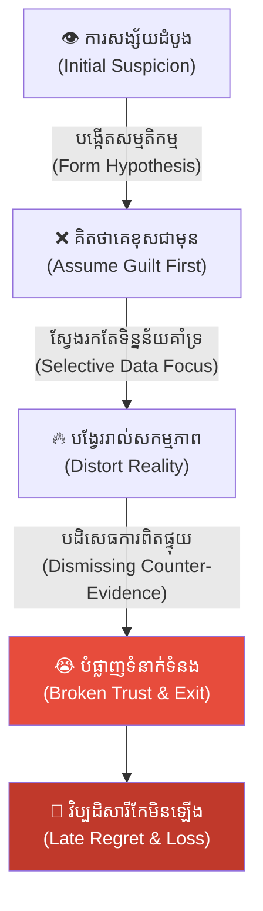
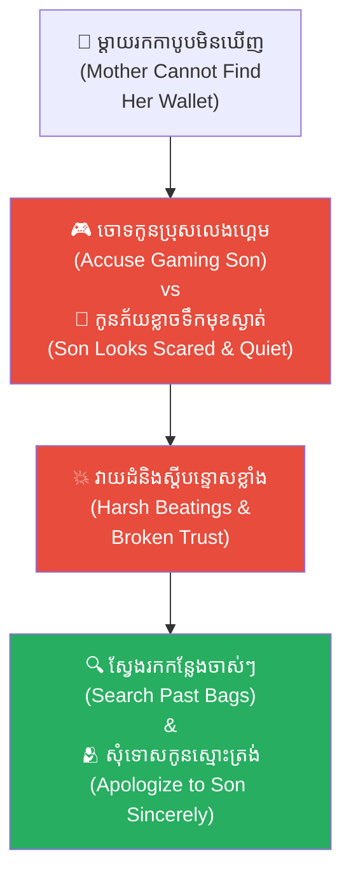
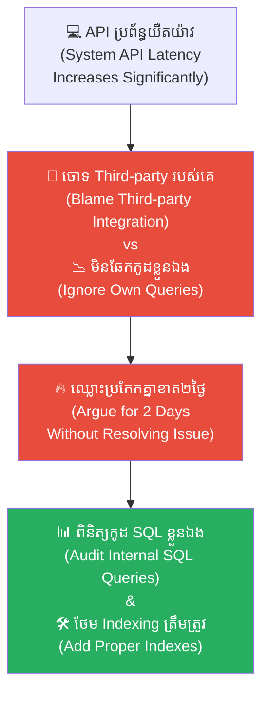
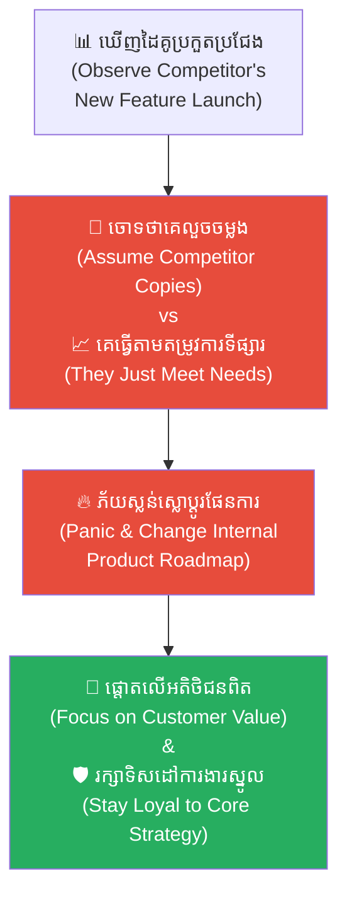
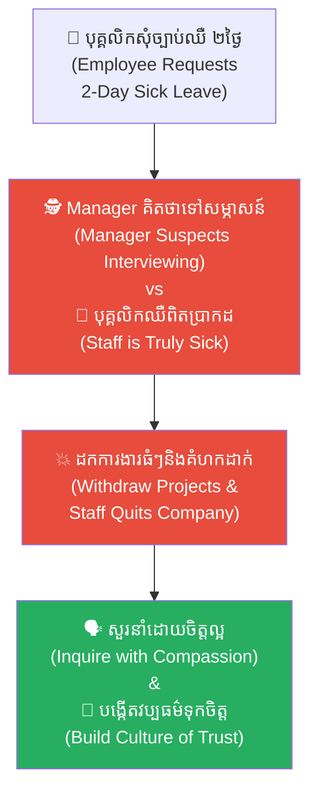
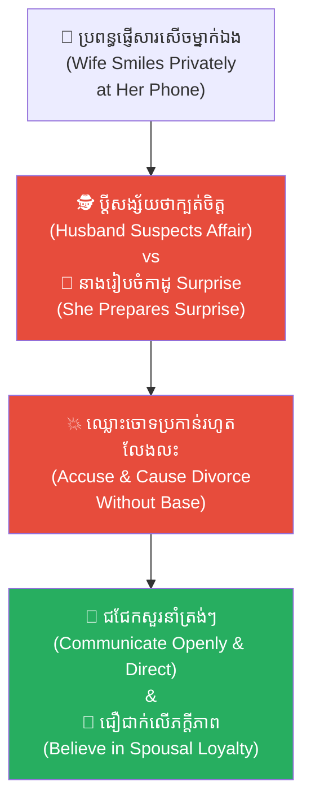
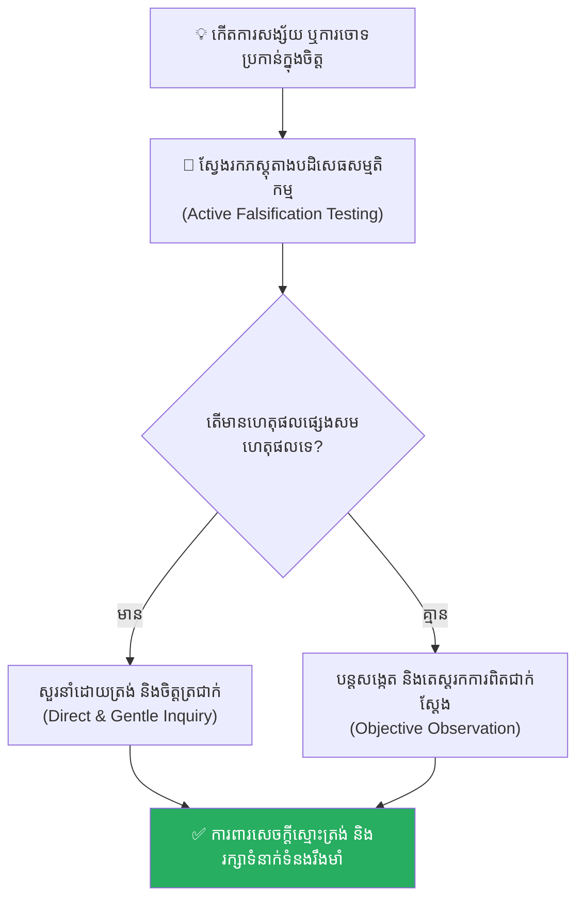

# The Lost Axe and the Filter of Mind (ពូថៅដែលបាត់ និងអ័ព្ទនៃការសង្ស័យ)៖ គ្រោះថ្នាក់នៃលំអៀង Confirmation Bias និងការដុតបំផ្លាញទំនុកចិត្ត

**Author:** ichamrong  
**Date:** 2026-05-17  
**Tags:** #confirmation-bias #cognitive-bias #psychology #trust #parables #chinese-folklore #critical-thinking  
**Category:** Concepts  
**Read Time:** ~15 min  

---

## 📌 មាតិកា (Table of Contents)
- [អន្ទាក់ផ្លូវចិត្ត (The Trap)](#អន្ទាក់ផ្លូវចិត្ត-the-trap)
- [១. រឿងនិទាន៖ ពូថៅដែលបាត់ និងកែវភ្នែកនៃការសង្ស័យ (The Parable of the Lost Axe)](#1)
  - [អ័ព្ទនៃការសង្ស័យចាប់ផ្តើមបក់បោក (The Fog of Suspicion)](#1-1)
  - [សោកនាដកម្មក្នុងរាត្រីទឹកភ្លៀង និងទឹកភ្នែកកណ្តាលភ្លៀង (The Tragedy in the Rain)](#1-2)
- [២. បញ្ហា៖ តើ Confirmation Bias បំផ្លាញយើងយ៉ាងដូចម្តេច? (The Issue: Confirmation Bias Breakdown)](#2)
- [៣. ឧទាហរណ៍ជាក់ស្តែងក្នុងពិភពពិត (Real World Examples)](#3)
  - [ឧទាហរណ៍ទី ១ — កម្រិតស្រាល (គ្រួសារ)៖ ការសង្ស័យកូនចៅលួចលុយក្នុងផ្ទះ (The Missing Wallet Suspicion)](#3-1)
  - [ឧទាហរណ៍ទី ២ — កម្រិតមធ្យម (បច្ចេកទេស)៖ ការទម្លាក់កំហុសលើកូដរបស់អ្នកដទៃ (It's Always the Sibling Service)](#3-2)
  - [ឧទាហរណ៍ទី ៣ — កម្រិតមធ្យម (ធុរកិច្ច)៖ ការវិនិច្ឆ័យចេតនារបស់ដៃគូប្រកួតប្រជែង (The Competitor's Hostile Intent)](#3-3)
  - [ឧទាហរណ៍ទី ៤ — កម្រិតមធ្យម (សង្គម/គ្រប់គ្រង)៖ ការចោទប្រកាន់បុគ្គលិកដោយគ្មានភស្តុតាង (The Accused Employee)](#3-4)
  - [ឧទាហរណ៍ទី ៥ — កម្រិតធ្ងន់ (ទំនាក់ទំនង)៖ ការសង្ស័យដៃគូជីវិតក្បត់ចិត្ត (The Jealousy Confirmation Trap)](#3-5)
- [៤. ដំណោះស្រាយទូទៅ៖ ការគិតវិភាគ និងយន្តការទម្លាក់ Ego (The General Solution: Active Falsification)](#4)
- [សេចក្តីសន្និដ្ឋាន (Conclusion)](#conclusion)
- [ឯកសារយោង (References)](#references)
- [Related Posts](#related-posts)

---

## អន្ទាក់ផ្លូវចិត្ត (The Trap)

តើអ្នកធ្លាប់ជួបស្ថានភាពដែលអ្នកមានការសង្ស័យ ឬការយល់ឃើញអវិជ្ជមានទៅលើនរណាម្នាក់រួចជាស្រេច ហើយបន្ទាប់មក រាល់កាយវិការ ពាក្យសម្តី និងសកម្មភាពរបស់ពួកគេ ស្រាប់តែប្រែជាភស្តុតាងច្បាស់ក្រឡែតមកគាំទ្រការសង្ស័យរបស់អ្នកទាំងអស់ដែរឬទេ?

នេះគឺជា **Confirmation Bias (លំអៀងនៃការចង់បញ្ជាក់ការពិតតែម្ខាង)**។ 

ខួរក្បាលរបស់មនុស្សមិនមែនជាឧបករណ៍កត់ត្រាការពិតដោយស្មោះត្រង់ឡើយ។ ផ្ទុយទៅវិញ វាប្រៀបដូចជាកញ្ចក់លំអៀងដែលចម្រោះយកតែព័ត៌មានណាដែល «ត្រូវនឹងការជឿជាក់ស្រាប់» របស់ខ្លួន និងច្រានចោលការពិតផ្ទុយទាំងស្រុង។ នៅពេលដែលយើងអនុញ្ញាតឱ្យ «គ្រាប់ពូជនៃការសង្ស័យ» ដុះឡើងក្នុងចិត្ត យើងនឹងចាប់ផ្តើមបំផ្លាញក្តីស្រឡាញ់ ទំនាក់ទំនង និងសន្តិភាពផ្លូវចិត្តរបស់ខ្លួនឯង ដោយសារតែការចោទប្រកាន់ខុសទៅលើមនុស្សដែលស្មោះត្រង់នឹងយើងបំផុត។

ដើម្បីយល់ដឹងឱ្យបានគ្រប់ជ្រុងជ្រោយ នេះជាផែនទីបង្ហាញផ្លូវសម្រាប់អត្ថបទនេះ៖
1. **រឿងព្រេងប្រវត្តិសាស្ត្រចិន (The Chinese Folklore)** — រឿងរ៉ាវរបស់លោក Liezi អំពីតា Lie អាឡាំង និងពូថៅដែកដែលបាត់នៅជើងភ្នំ។
2. **បញ្ហា (The Issue)** — តើខួរក្បាលរបស់យើងចម្រោះ និងបំភាន់ទិន្នន័យជាក់ស្តែងឱ្យស្របតាមជំនឿលំអៀងយ៉ាងដូចម្តេច?
3. **ឧទាហរណ៍ជាក់ស្តែងក្នុងពិភពពិត (Real World Examples)** — ពិនិត្យមើលឥទ្ធិពលនេះក្នុងកម្រិតគ្រួសារ ការងារបច្ចេកទេស ធុរកិច្ច ការគ្រប់គ្រង និងទំនាក់ទំនងស្នេហា Bias។
4. **ដំណោះស្រាយទូទៅ (The General Solution)** — ការអនុវត្តយន្តការ Active Falsification និងការសួរនាំដោយចិត្តត្រជាក់។

---

## ១. រឿងនិទាន៖ ពូថៅដែលបាត់ និងកែវភ្នែកនៃការសង្ស័យ (The Parable of the Lost Axe)

យោងតាមគម្ពីរទស្សនវិជ្ជាសាសនាតៅដ៏ល្បីល្បាញរបស់ **លោក លីជឺ (Liezi - 列子)** មានរឿងប្រៀបប្រដូចបុរាណមួយដំណាលថា មានបុរសចំណាស់ម្នាក់ឈ្មោះ **តា លី (Old Man Lie)** គាត់រស់នៅយ៉ាងស្ងប់ស្ងាត់ក្នុងខ្ទមតូចមួយក្បែរជើងភ្នំ និងប្រកបរបរជាអ្នកកាប់អុស។ ទ្រព្យសម្បត្តិដ៏មានតម្លៃបំផុតក្នុងជីវិតរបស់គាត់ គឺ **ពូថៅដែកដ៏មុតស្រួចមួយ** ដែលជាកេរមរតកចុងក្រោយបន្សល់ទុកដោយភរិយាជាទីស្រឡាញ់ដែលបានចែកឋានទៅ។ ពូថៅនោះមិនត្រឹមតែជាឧបករណ៍ចិញ្ចឹមជីវិតនោះទេ ប៉ុន្តែវាជាដួងព្រលឹង និងជាការចងចាំដ៏កក់ក្តៅតែមួយគត់ដែលគាត់មាន។

នៅជាប់ខ្ទមរបស់ តា លី មានគ្រួសារអ្នកជិតខាងម្នាក់ ដែលមានកូនប្រុសកំព្រាម្នាក់ឈ្មោះ **អាឡាំង (Ah-Lang)**។ អាឡាំង គឺជាក្មេងប្រុសម្នាក់ដែលស្ងប់ស្ងាត់ មិនសូវនិយាយស្តី និងតែងតែអោនក្បាលចុះដោយភាពអៀនខ្មាស ព្រោះតែធ្លាប់ឆ្លងកាត់ការរស់នៅលំបាកតាំងពីតូច។ ទោះជាយ៉ាងណា អាឡាំង ខិតខំធ្វើការខ្លាំងណាស់ និងគោរពស្រឡាញ់ តា លី ប្រៀបដូចជាឪពុកបង្កើត ដោយតែងតែមកជួយលីសែង និងច្រៀកអុស តា លី ជានិច្ចដោយមិនទាមទារកម្រៃអ្វីឡើយ។

---

### អ័ព្ទនៃការសង្ស័យចាប់ផ្តើមបក់បោក (The Fog of Suspicion)

រហូតដល់ល្ងាចថ្ងៃមួយ បន្ទាប់ពីត្រឡប់មកពីព្រៃវិញ តា លី ស្រាប់តែរក **ពូថៅដែកជាទីស្រឡាញ់** របស់ខ្លួនមិនឃើញសោះ។ គាត់បានកាយកកាយរុករកពេញមួយខ្ទម ក្រោមគ្រែ ក្នុងឡដុតអុស និងគ្រប់ទិសទី ប៉ុន្តែពូថៅនោះបានបាត់ដានសូន្យឈឹង។

ខណៈពេលដែលកំពុងតែមានចិត្តខឹងសម្បារ និងភ័យស្លន់ស្លោ ស្រាប់តែ តា លី នឹកឃើញទៅដល់រូបភាពកាលពីយប់មិញ ដែលគាត់បានឃើញ អាឡាំង ដើរឡង់ឡង់ក្បែរជង្រុកស្តុកអុសដាច់ដោយឡែកពីគេ។

ភ្លាមៗនោះ គ្រាប់ពូជនៃការសង្ស័យ (**Seed of Suspicion**) ត្រូវបានដាំចុះក្នុងចិត្តរបស់ តា លី។ ចិត្តរបស់គាត់ចាប់ផ្តើមបង្កើតសម្មតិកម្មមួយច្បាស់លាស់ថា៖ **«គឺអាឡាំងនេះហើយដែលលួចពូថៅអញ!»**

ចាប់ពីវិនាទីនោះមក ផ្នត់គំនិតរបស់ តា លី ត្រូវបានគ្រប់គ្រងទាំងស្រុងដោយ **Confirmation Bias (លំអៀងនៃការចង់បញ្ជាក់ការពិតតែម្ខាង)**។ រាល់សកម្មភាព និងពាក្យសម្តីរបស់ អាឡាំង ទាំងអស់ ត្រូវបាន តា លី សម្លឹងមើលតាមរយៈ «កញ្ចក់លំអៀង» នេះ ហើយគ្រប់យ៉ាងប្រែទៅជាភស្តុតាងដែលបញ្ជាក់ថា អាឡាំង គឺជាចោរលួចយ៉ាងច្បាស់ក្រឡែត៖

* **ពេល អាឡាំង អោនក្បាលចុះមិនហ៊ានមើលចំភ្នែក៖** តា លី គិតក្នុងចិត្តថា *«មើលចុះ! វាមានកំហុសក្នុងចិត្ត ទើបវាមិនហ៊ានសម្លឹងមើលមុខអញចំ។ នេះគឺជាទឹកមុខរបស់ចោរពិតៗ!»* (ប៉ុន្តែការពិត អាឡាំង គ្រាន់តែអៀនខ្មាស និងគោរព តា លី ប៉ុណ្ណោះ)។
* **ពេល អាឡាំង ខំប្រឹងបោសសម្អាតខ្ទម និងធ្វើការងារផ្ទះច្រើនជាងមុន៖** តា លី គិតថា *«វាប្រាកដជាចង់ធ្វើល្អផ្គាប់ចិត្តអញ ដើម្បីបិទបាំងកំហុស និងបង្វែរដាននៃការលួចរបស់វាហើយ។ ពិតជាក្មេងខូចក្បិចក្បូរមែន!»*
* **ពេល អាឡាំង ដើរចេញទៅផ្សារនៅខាងក្រៅភូមិ៖** តា លី គិតទាំងខឹងក្រោធថា *«វាប្រញាប់ទៅផ្សារ ដើម្បីយកពូថៅរបស់អញទៅលក់ឱ្យពួកឈ្មួញហើយ!»*

---

### សោកនាដកម្មក្នុងរាត្រីទឹកភ្លៀង និងទឹកភ្នែកកណ្តាលភ្លៀង (The Tragedy in the Rain)

ដោយលែងអាចទ្រាំទ្រនឹងសម្ពាធផ្លូវចិត្ត និងការឈឺចាប់ដែលគ្មានការបំភ្លឺបាន អាឡាំង សម្រេចចិត្តយ៉ាងលំបាកទាំងទឹកភ្នែក។ នៅក្នុងរាត្រីដែលមានភ្លៀងធ្លាក់ជោកជាំ ពេលដែល តា លី កំពុងសម្រាន្តលង់លក់ អាឡាំង បានរៀបចំសំពាយខោអាវចាស់ៗរបស់ខ្លួន រួចលបចាកចេញពីខ្ទមនោះដោយស្ងៀមស្ងាត់ ដើម្បីកុំឱ្យធ្វើជាបន្ទុកដល់ តា លី ទៀត។

មុនពេលចាកចេញ អាឡាំង បានដាក់កូនរូបចម្លាក់ឈើមួយដែលខ្លួនបានឆ្លាក់យ៉ាងសម្រិតសម្រាំងអស់ជាច្រើនយប់។ វាជារូបចម្លាក់ **«ដៃពីរអោបគ្នា»** ដើម្បីជាកាដូជំនួសពាក្យអរគុណដល់ តា លី។

ព្រឹកឡើង តា លី ភ្ញាក់ពីដំណេក ហើយឃើញ អាឡាំង ចាកចេញបាត់ទៅហើយ។ គាត់មិនត្រឹមតែមិនសោកស្តាយទេ តែថែមទាំងជេរប្រទេចថា៖ *«អាឆ្កែចចកអកតញ្ញូ! វាលួចពូថៅអញហើយ ឥឡូវវារត់គេចខ្លួនបាត់ទៀត!»*

ដោយចិត្តខឹងក្រោធ តា លី បានដើរទៅបោសសម្អាតជង្រុកអុសទាំងកំហឹង ដើម្បីត្រៀមរៀបចំកន្លែងថ្មី។ ខណៈពេលដែលគាត់កំពុងតែរុញគំនរឈើធំៗចេញ ស្រាប់តែជើងរបស់គាត់ទាស់នឹងវត្ថុរឹងមួយនៅកៀនជញ្ជាំង។ គាត់ឱនចុះទៅមើល រួចក៏កាយកម្ទេចឈើចេញ...

**ពូថៅដែករបស់គាត់ កំពុងតែដេកយ៉ាងស្ងៀមស្ងាត់នៅទីនោះ!**

វាជាកន្លែងដែល តា លី ខ្លួនឯងបានយកទៅស៊កទុកកាលពី ៤ ថ្ងៃមុន ព្រោះខ្លាចទទឹកភ្លៀង ហើយដោយសារតែភាពចាស់ជរា គាត់ក៏ភ្លេចវាចោលទាំងស្រុង។

តា លី ឈរទ្រឹង ខ្លួនប្រាណរបស់គាត់ត្រជាក់ងាំង ដៃរបស់គាត់ចាប់ផ្តើមញ័ររន្ធត់។ គាត់សម្លឹងមើលពូថៅដែកនៅក្នុងដៃ រួចក្រឡេកទៅមើលរូបចម្លាក់ឈើដែល អាឡាំង បន្សល់ទុកឱ្យនៅលើតុ។ ចោរពិតប្រាកដដែលបានលួចយកពូថៅ មិនមែនជា អាឡាំង ឡើយ។ **ចោរពិតប្រាកដ គឺចិត្តលំអៀង (Confirmation Bias) របស់ខ្លួនឯង** ដែលបានលួចយកក្តីស្រឡាញ់ ទំនាក់ទំនង និងសេចក្តីសុខរបស់ពួកគេទៅបាត់បង់អស់គ្មានសល់។

---

## ២. បញ្ហា៖ តើ Confirmation Bias បំផ្លាញយើងយ៉ាងដូចម្តេច? (The Issue: Confirmation Bias Breakdown)

នៅក្នុងវិស័យចិត្តវិទ្យាការយល់ដឹង (Cognitive Psychology) បាតុភូតនេះកើតឡើងពី៖
* **Egocentric Filtering (ការចម្រោះយកខ្លួនឯងជាធំ)៖** ខួរក្បាលស្វែងរកតែព័ត៌មានណាដែលគាំទ្រសម្មតិកម្មចោទប្រកាន់ជាមុន (Prior belief)។
* **Selective Attention (ការយកចិត្តទុកដាក់លំអៀង)៖** មើលឃើញតែទិន្នន័យដែលយើងចង់ឃើញ និងច្រានចោលរាល់ទិន្នន័យជាក់ស្តែងផ្សេងទៀត។
* **ការបកស្រាយលំអៀង (Biased Interpretation)៖** បង្វែររាល់កាយវិការវិជ្ជមាន ឬធម្មតារបស់ដៃគូ ឱ្យទៅជាអវិជ្ជមានដើម្បីគាំទ្រការសង្ស័យរបស់ខ្លួន។

---

## ៣. ឧទាហរណ៍ជាក់ស្តែងក្នុងពិភពពិត

ដើម្បីយល់ដឹងឱ្យកាន់តែស៊ីជម្រៅ ផ្លូវការសិក្សានឹងនាំអ្នកទៅពិនិត្យមើល **ឧទាហរណ៍ចំនួន ៥ កម្រិតខុសៗគ្នា** ក្នុងជីវិតរស់នៅប្រចាំថ្ងៃ៖

---

### ឧទាហរណ៍ទី ១ — កម្រិតស្រាល (គ្រួសារ)៖ ការសង្ស័យកូនចៅលួចលុយក្នុងផ្ទះ (The Missing Wallet Suspicion)

**ស្ថានភាព៖** ម្តាយម្នាក់រកកាបូបលុយរបស់ខ្លួនមិនឃើញ ស្រាប់តែសង្ស័យកូនប្រុសវ័យជំទង់ដែលធ្លាប់លេងហ្គេមអនឡាញ។

* **ភាគី A (ម្តាយ)៖** គិតថា «វាប្រាកដជាលួចយកលុយទៅទិញហ្គេមទៀតហើយ!»។ រាល់ទឹកមុខភ័យខ្លាច ឬការមិនសូវនិយាយរបស់កូន ប្រែទៅជាភស្តុតាងចោទប្រកាន់ទាំងអស់។ នាងវាយដំ និងស្តីបន្ទោសកូនយ៉ាងខ្លាំង។
* **ភាគី B (ការពិត)៖** កាបូបលុយត្រូវបាននាងទុកចោលក្នុងកាបូបយួរផ្សេងទៀត។ នាងរកឃើញវានៅថ្ងៃបន្ទាប់ តែស្នាមរបួសផ្លូវចិត្តរបស់កូនប្រុសមិនអាចព្យាបាលបានឡើយ។

**ការពិតដ៏ជូរចត់៖**
ការសង្ស័យគ្មានភស្តុតាងបំផ្លាញទំនុកចិត្តជាមូលដ្ឋានរវាងឪពុកម្តាយ និងកូនចៅ។

---

### ឧទាហរណ៍ទី ២ — កម្រិតមធ្យម (បច្ចេកទេស)៖ ការទម្លាក់កំហុសលើកូដរបស់អ្នកដទៃ (It's Always the Sibling Service)

**ស្ថានភាព៖** ពេលប្រព័ន្ធ API ជួបប្រទះការយឺតយ៉ាវ (Slow Latency) Lead Dev សម្រេចចិត្តចោទភ្លាមថាជាកំហុសរបស់ Third-party Integration របស់ក្រុមផ្សេង។

* **ភាគី A (Lead Dev)៖** ស្វែងរកតែ logs ណាដែលមានកំហុសបន្តិចបន្តួចពី Third-party មកបញ្ជាក់ការចោទរបស់ខ្លួន (Selective attention)។
* **ភាគី B (ការពិត)៖** កំហុសពិតប្រាកដគឺមកពី SQL Query របស់ក្រុមខ្លួនឯងដែលខ្វះ Indexing ស្មុគស្មាញ។ ពួកគេខាតពេល ២ ថ្ងៃឈ្លោះប្រកែកគ្នាដោយគ្មានប្រយោជន៍។

**ការពិតដ៏ជូរចត់៖**
ការលំអៀងទម្លាក់កំហុសលើអ្នកដទៃ បង្អាក់ដំណើរការដោះស្រាយបញ្ហាពិតប្រាកដ និងបង្កើតជម្លោះអន្តរក្រុម។

---

### ឧទាហរណ៍ទី ៣ — កម្រិតមធ្យម (ធុរកិច្ច)៖ ការវិនិច្ឆ័យចេតនារបស់ដៃគូប្រកួតប្រជែង (The Competitor's Hostile Intent)

**ស្ថានភាព៖** ស្ថាបនិកក្រុមហ៊ុន Startup មួយយល់ឃើញថាដៃគូប្រកួតប្រជែងកំពុងតែ «លួចចម្លង» យុទ្ធសាស្ត្រទីផ្សាររបស់ខ្លួនរាល់យប់។

* **ភាគី A (Founder)៖** ឱ្យតែឃើញដៃគូបោះពុម្ពផ្សាយ Feature ឬយុទ្ធនាការស្រដៀងគ្នា គាត់ខឹងក្រោធ និងបញ្ជាឱ្យក្រុមការងារប្តូរផែនការការងារបន្ទាន់។
* **ភាគី B (ការពិតទីផ្សារ)៖** ដៃគូគ្រាន់តែរត់តាមតម្រូវការទូទៅរបស់អតិថិជនប៉ុណ្ណោះ។ ការដេញតាមសង្ស័យ ធ្វើឱ្យក្រុមហ៊ុនចាស់បាត់បង់ទិសដៅការងារស្នូលរបស់ខ្លួន។

**ការពិតដ៏ជូរចត់៖**
ការផ្តោតលើការសង្ស័យដៃគូប្រកួតប្រជែង ធ្វើឱ្យយើងបាត់បង់សមត្ថភាពច្នៃប្រឌិត និងការយកចិត្តទុកដាក់លើអតិថិជនពិតប្រាកដ។

---

### ឧទាហរណ៍ទី ៤ — កម្រិតមធ្យម (សង្គម/គ្រប់គ្រង)៖ ការចោទប្រកាន់បុគ្គលិកដោយគ្មានភស្តុតាង (The Accused Employee)

**ស្ថានភាព៖** Manager យល់ថាបុគ្គលិកម្នាក់កំពុងតែ «លបលួចរកការងារថ្មី» ព្រោះឃើញគាត់សុំច្បាប់សម្រាកព្យាបាលជំងឺ ២ ថ្ងៃជាប់គ្នា។

* **ភាគី A (Manager)៖** ចាត់ទុកថាការសម្រាកព្យាបាលជំងឺជាលេសទៅសម្ភាសន៍ការងារ។ គាត់ចាប់ផ្តើមដកការងារធំៗចេញ និងនិយាយគំហកដាក់បុគ្គលិកនោះ។
* **ភាគី B (បុគ្គលិក)៖** មានអារម្មណ៍រងភាពអយុត្តិធម៌ និងមិនទុកចិត្ត។ គាត់សម្រេចចិត្តដាក់ពាក្យលាឈប់ពីការងារពិតប្រាកដនៅខែបន្ទាប់។

**ការពិតដ៏ជូរចត់៖**
ការសង្ស័យលំអៀងរបស់អ្នកដឹកនាំ បង្កើតឱ្យមានការចាកចេញរបស់បុគ្គលិកឆ្នើមដោយស្វ័យប្រវត្តិ។

---

### ឧទាហរណ៍ទី ៥ — កម្រិតធ្ងន់ (ទំនាក់ទំនង)៖ ការសង្ស័យដៃគូជីវិតក្បត់ចិត្ត (The Jealousy Confirmation Trap)

**ស្ថានភាព៖** ប្តីមានការសង្ស័យថាប្រពន្ធលួចលាក់មានទំនាក់ទំនងក្រៅផ្លូវការ ព្រោះតែនាងផ្ញើសារសើចម្នាក់ឯង។

* **ភាគី A (ប្តី)៖** ស្វែងរកតែ «ភស្តុតាងសង្ស័យ»៖ *«មើលចុះ នាងពាក់អាវស្អាត នាងមកផ្ទះយឺត ១០ នាទី នាងបិទទូរស័ព្ទ... នាងច្បាស់ជាក្បត់អញហើយ!»* (Selective interpretation)។
* **ភាគី B (ប្រពន្ធ)៖** នាងគ្រាន់តែរៀបចំកាដូ Surprise ខួបកំណើតឱ្យគាត់ប៉ុណ្ណោះ។ ជម្លោះខ្លាំង និងការចោទប្រកាន់ បានបំផ្លាញអាពាហ៍ពិពាហ៍ទាំងស្រុង។

**ការពិតដ៏ជូរចត់៖**
ចិត្តលំអៀងគឺជាថ្នាំពុលដ៏សាហាវបំផុតដែលសម្លាប់ទំនាក់ទំនងស្នេហា ទោះបីជាគ្មានអ្នកទីបីពិតប្រាកដឡើយ។

---

## ៤. ដំណោះស្រាយទូទៅ៖ ការគិតវិភាគ និងយន្តការទម្លាក់ Ego (The General Solution: Active Falsification)

ដើម្បីរំដោះខ្លួនចេញពីអ័ព្ទនៃ Confirmation Bias ចូរអនុវត្តជំហានខាងក្រោម៖

### ១. អនុវត្តវិធីសាស្ត្រ Active Falsification (ស្វែងរកភស្តុតាងបដិសេធ)
ជំនួសឱ្យការស្វែងរកភស្តុតាងគាំទ្រសម្មតិកម្មរបស់អ្នក ចូរព្យាយាមស្វែងរក **«ភស្តុតាងដែលបង្ហាញថាការសង្ស័យរបស់អ្នកខុស»**៖
* *តើមានហេតុផលផ្សេងទៀតដែលធ្វើឱ្យអាឡាំងអោនក្បាលទេ? (ដូចជាការគោរព ឬភាពអៀនខ្មាស)*
* *តើមានមូលហេតុអ្វីផ្សេងទៀតដែលធ្វើឱ្យពូថៅបាត់បង់?*

### ២. ជជែកសួរនាំដោយបើកចិត្តទូលាយ (Open Communication)
កុំលាក់ការសង្ស័យទុកក្នុងចិត្ត និងព្យាយាមកាត់ក្តីតែម្នាក់ឯង។ ចូរជជែកដោយសន្តិវិធី និងសួរនាំត្រង់ៗ៖ *«ខ្ញុំរកពូថៅមិនឃើញសោះ តើឯងបានឃើញ ឬច្រឡំដៃយកទៅទុកកន្លែងណាទេ?»*។

### ៣. អនុវត្ត "Doubt Your Doubts" (សង្ស័យលើការសង្ស័យខ្លួនឯង)
យល់ដឹងថាតែខួរក្បាលរបស់យើងងាយនឹងយល់ច្រឡំខ្លាំងណាស់ ពិសេសនៅពេលមានអារម្មណ៍ភ័យខ្លាច ឬខឹងសម្បារ។ ត្រូវសួរខ្លួនឯងថា៖ *«តើនេះជាការពិតជាក់ស្តែង ឬគ្រាន់តែជាការបកស្រាយដោយចិត្តសង្ស័យរបស់ខ្ញុំ?»*

---

## សេចក្តីសន្និដ្ឋាន (Conclusion)

> **«កញ្ចក់លំអៀងនៃចិត្ត អាចកែប្រែទេវតាឱ្យក្លាយជាបិសាច និងបង្វែររាល់ទឹកចិត្តស្មោះត្រង់ឱ្យទៅជាការលាក់ពុតបានទាំងអស់។ ចូរលាងសម្អាតកញ្ចក់ចិត្តរបស់អ្នកជាប្រចាំ មុននឹងសម្រេចចិត្តបណ្តេញមនុស្សល្អចេញពីជីវិតរបស់អ្នកជារៀងរហូត។»**

តា លី បានបាត់បង់អាឡាំង ព្រោះតែការសង្ស័យលើពូថៅដែកមួយ។ ចូរកុំទុកឱ្យចិត្តលំអៀងរបស់អ្នក ដុតបំផ្លាញ និងលួចយកក្តីសុខសាន្តក្នុងគ្រួសារ ឬការងាររបស់អ្នកឡើយ។

ចូរលុបបំបាត់អ័ព្ទនៃការសង្ស័យរបស់អ្នក។

---

## ឯកសារយោង (References)

* **Liezi (列子)** — *Liezi (Book of Liezi)*. គម្ពីរទស្សនវិជ្ជាតៅបុរាណចិន។
* **Nickerson, R. S.** — *Confirmation Bias: A Ubiquitous Phenomenon in Many Guises* (1998). ការសិក្សាលម្អិតអំពីទម្រង់ខុសៗគ្នានៃ Confirmation Bias។
* **Kahneman, D.** — *Thinking, Fast and Slow* (2011). យន្តការនៃការគិតលឿនរបស់ខួរក្បាល និងការសម្រេចចិត្តលំអៀង។

---

## Related Posts

* **[Projection Effect (ការយកគំនិតខ្លួនឯងទៅដាក់លើអ្នកដទៃ)៖ គ្រោះថ្នាក់នៃការគិតស្មានថាពិភពលោកទាំងមូលចង់បានដូចខ្លួនឯង](./01-projection-effect.md)** — Projecting internal standards onto others.
* **[The Silent Rebellion (ការបះបោរដោយស្ងៀមស្ងាត់)៖ គ្រោះថ្នាក់នៃការរំលោភសេចក្តីថ្លៃថ្នូរ និងការបាត់បង់ភក្តីភាពរបស់មនុស្សស្ងប់ស្ងាត់](./09-the-silent-rebellion.md)** — Broken trust and quiet quitting.
* **[The Baker and the Butcher (កំហុសនៃភាពល្អ និងការរំពឹងទុក)៖ គ្រោះថ្នាក់នៃការលះបង់គ្មានដែនកំណត់ និងការកសាងមនុស្សលោភលន់គ្មានព្រំដែន](./11-the-baker-and-the-butcher.md)** — Expectations and scarcity of communication.
