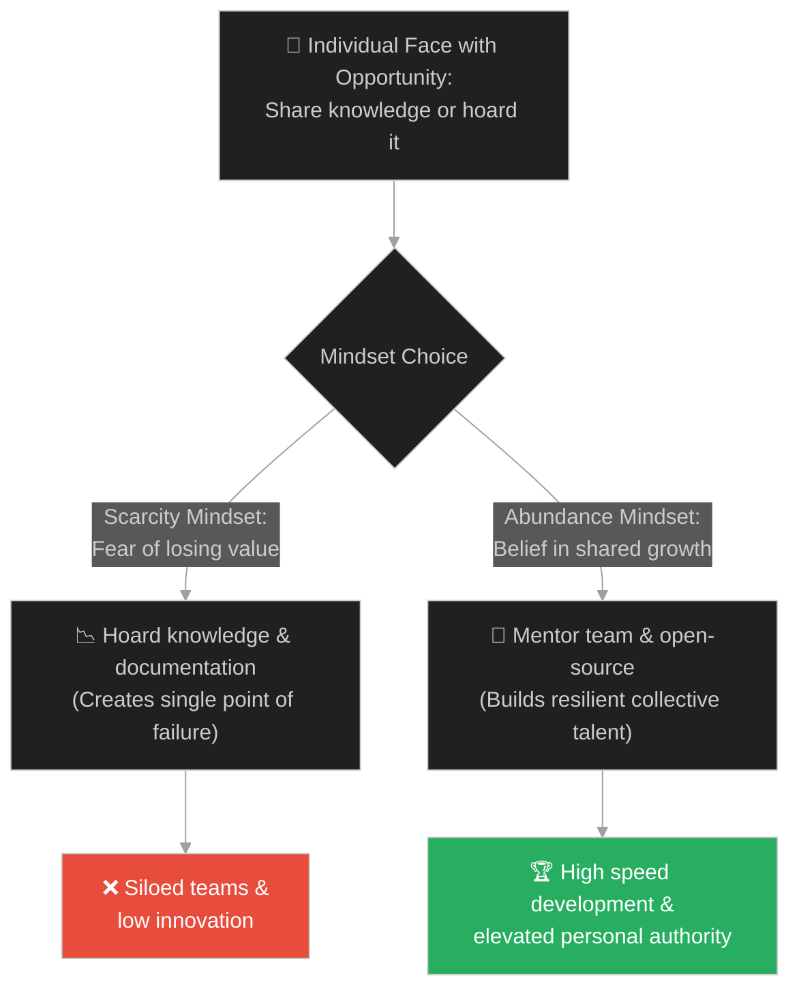
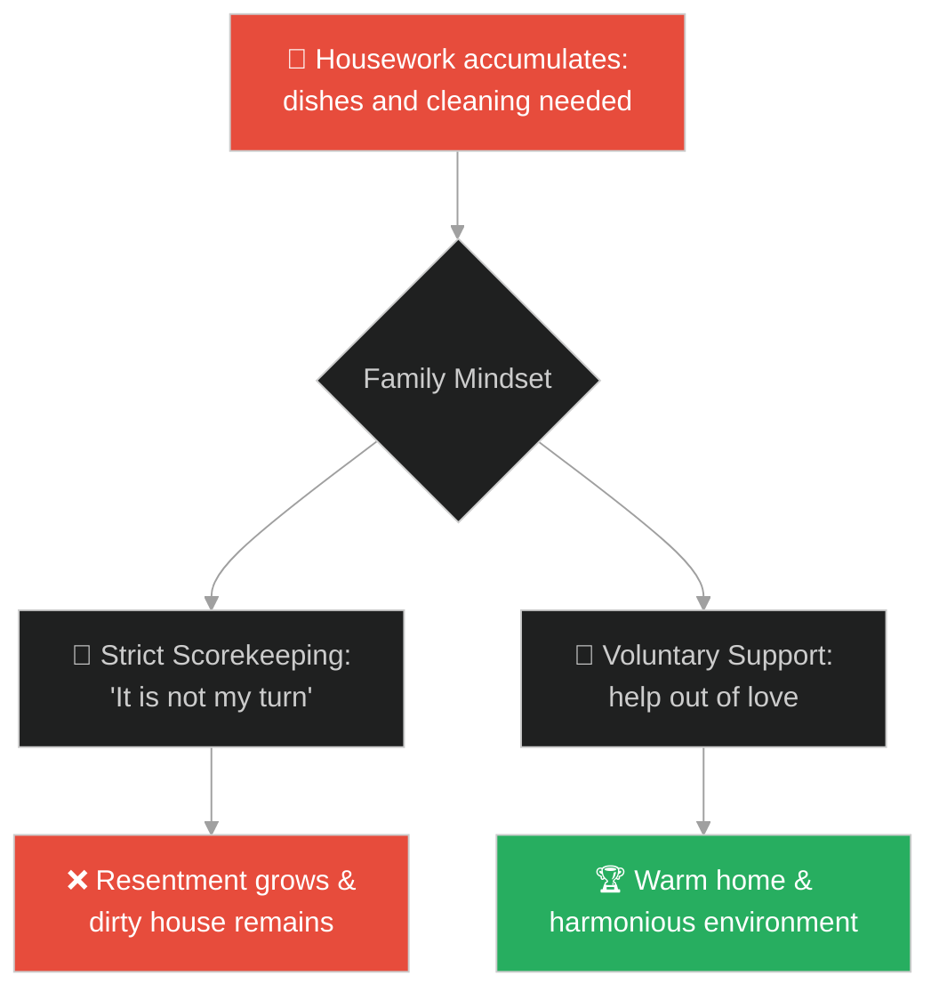
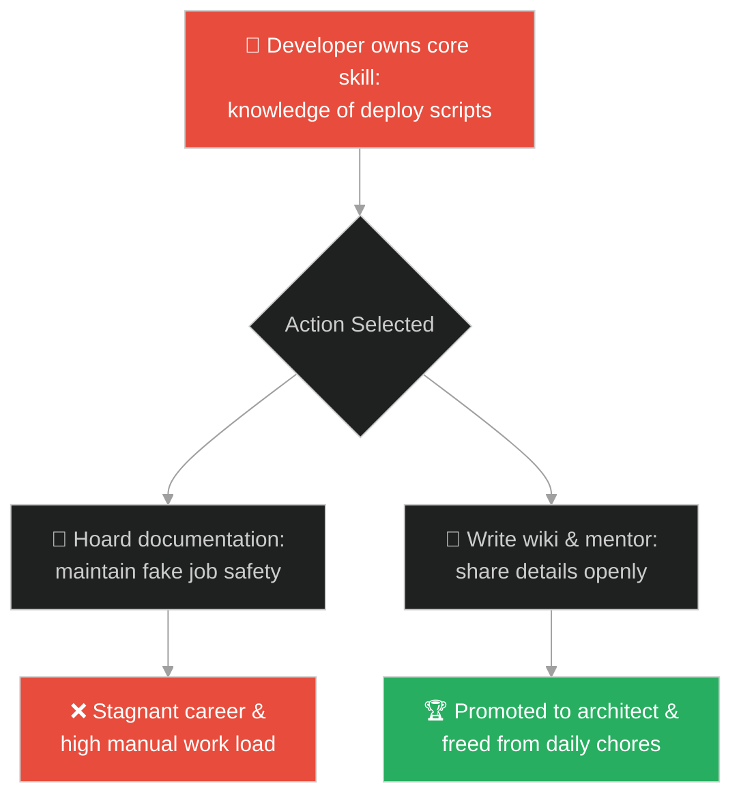
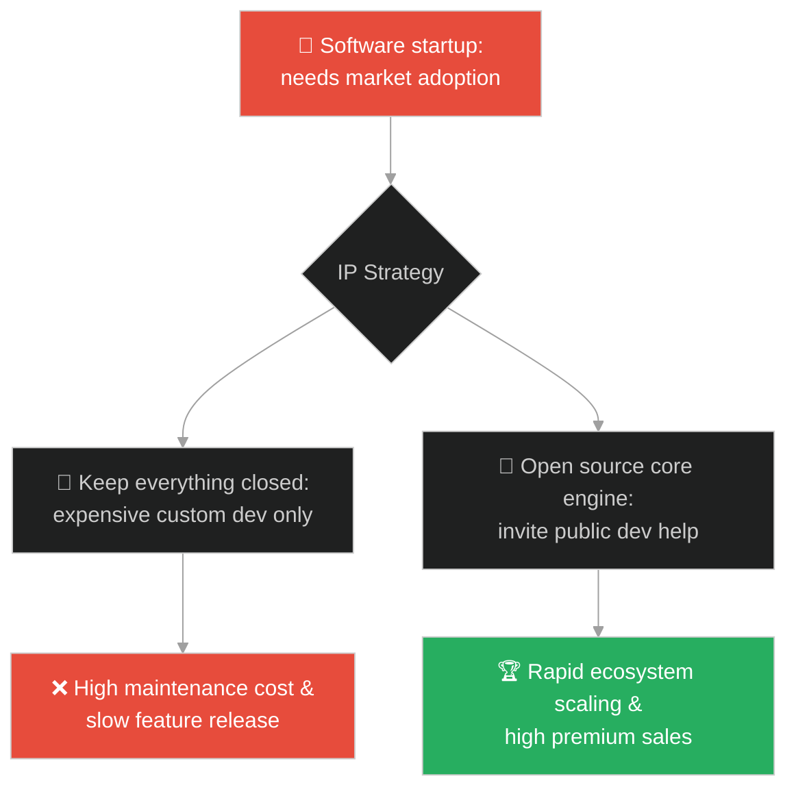
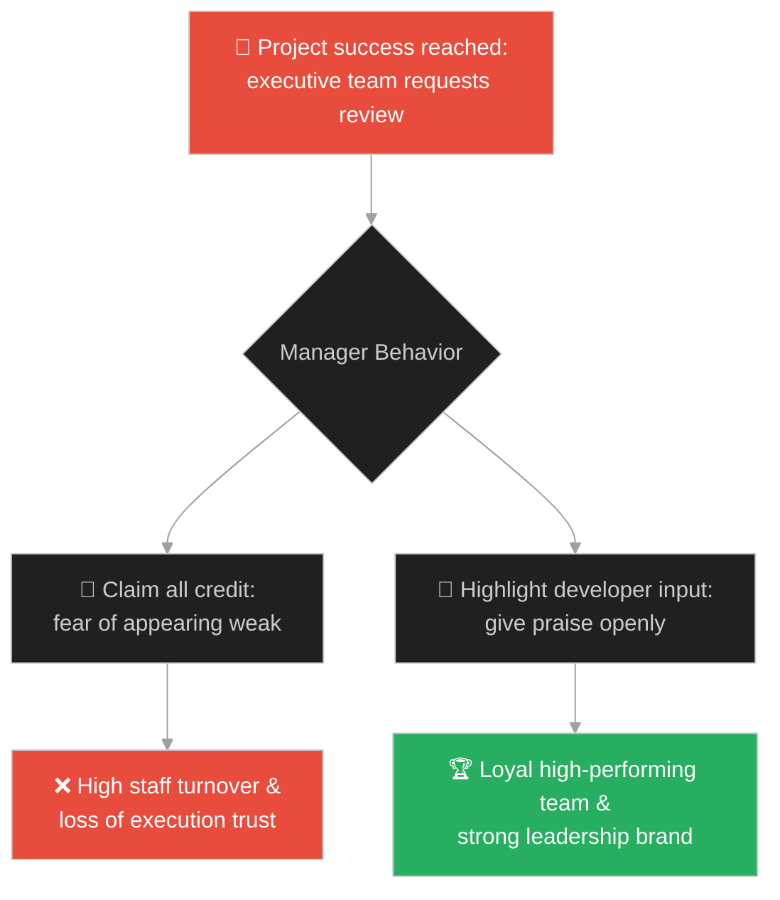
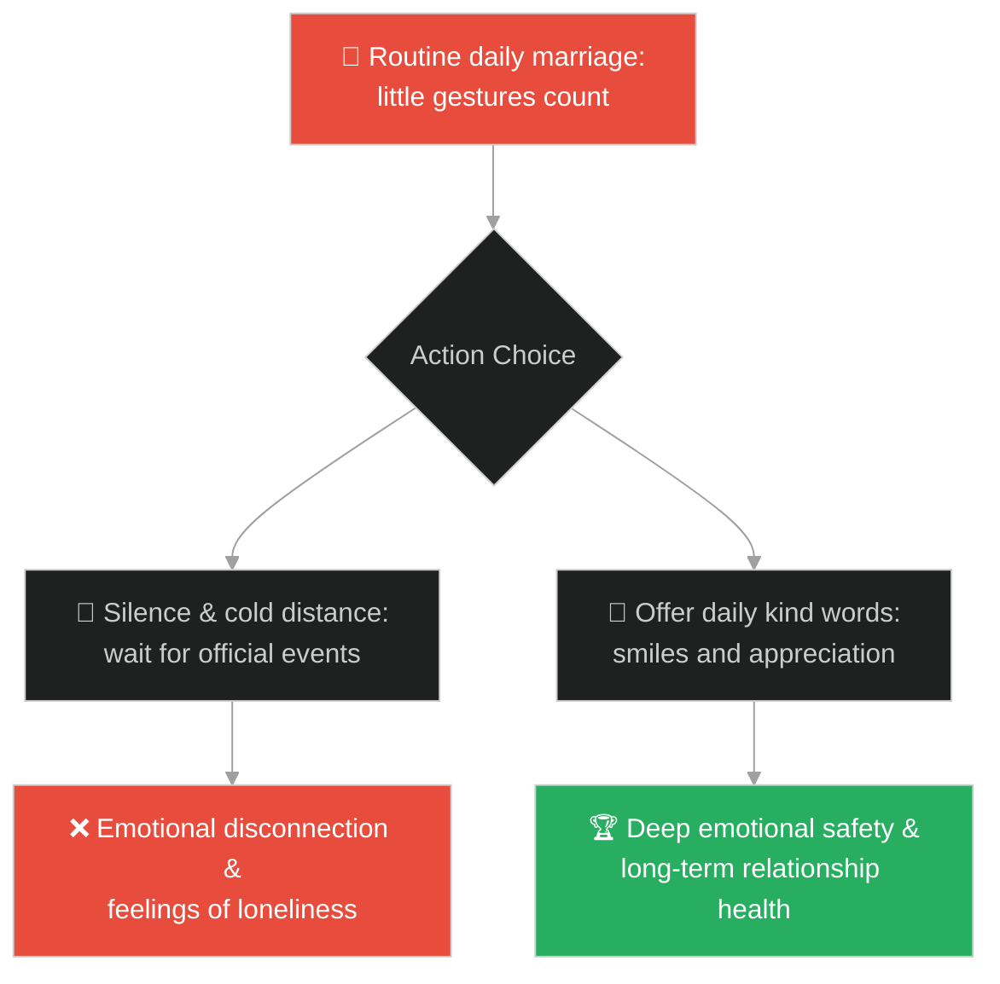
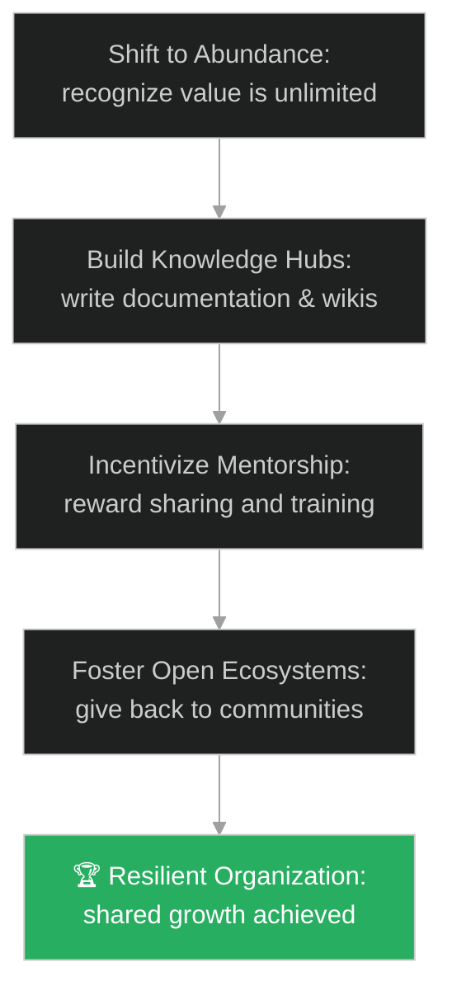

# Abundance Mindset & Knowledge Sharing (ផ្នត់គំនិតបរិបូរណ៍ និងការចែករំលែកចំណេះដឹង)៖ អ្នកសុំទាន និងអំណោយទាំងប្រាំពីរ (Abundance Mindset & Knowledge Sharing & The Beggar and the Seven Gifts)

**Author:** ichamrong  
**Date:** 2026-05-28  
**Tags:** #buddhism #generosity #abundance-mindset #giving #happiness #open-source #mentorship  
**Category:** Concepts / Parables  
**Read Time:** ~15 min  

---

## 📌 មាតិកា (Table of Contents)
- [អន្ទាក់ផ្លូវចិត្ត (The Trap)](#0)
- [១. រឿងព្រេងប្រវត្តិសាស្ត្រ៖ អ្នកសុំទាន និងអំណោយទាំងប្រាំពីរ (The Legend of the Beggar and the Seven Gifts)](#1)
  - [អំណោយទាំងប្រាំពីរដែលមិនបាត់បង់ទ្រព្យ (The Seven Non-Material Gifts)](#1-1)
- [២. បញ្ហា៖ ការលាក់ទុកចំណេះដឹង និងផ្នត់គំនិតខ្វះខាតក្នុងវិស្វកម្ម (The Issue: Knowledge Hoarding and Scarcity Mindset in Engineering)](#2)
- [៣. ឧទាហមណ៍ជាក់ស្តែងក្នុងពិភពពិត (Real World Examples)](#3)
  - [ឧទាហរណ៍ទី ១ — កម្រិតស្រាល (គ្រួសារ)៖ ការបែងចែកការងារផ្ទះដោយមិនប្រជែងគ្នា (Sharing Household Chores Without Scorekeeping)](#3-1)
  - [ឧទាហរណ៍ទី ២ — កម្រិតមធ្យម (បច្ចេកទេស)៖ ការចែករំលែកចំណេះដឹងទល់នឹងការលាក់កូដ (Active Developer Mentorship vs Knowledge Hoarding)](#3-2)
  - [ឧទាហរណ៍ទី ៣ — កម្រិតមធ្យម (ធុរកិច្ច)៖ ការរួមចំណែកក្នុងកម្មវិធីកូដចំហ (Open Source Contributions vs Closed Ecosystems)](#3-3)
  - [ឧទាហរណ៍ទី ៤ — កម្រិតមធ្យម (សង្គម/គ្រប់គ្រង)៖ ការឱ្យតម្លៃក្រុមការងាររបស់ប្រធាន (Managers Giving Credit to Team Members)](#3-4)
  - [ឧទាហរណ៍ទី ៥ — កម្រិតធ្ងន់ (ទំនាក់ទំនង)៖ ការបង្ហាញការដឹងគុណប្រចាំថ្ងៃក្នុងគូស្រករ (Daily Micro-Appreciations vs Waiting for Occasions)](#3-5)
- [៤. ដំណោះស្រាយទូទៅ៖ ការកសាងវប្បធម៌ចែករំលែក និងផ្នត់គំនិតបរិបូរណ៍ (The General Solution: Building a Culture of Abundance and Knowledge Transference)](#4)
- [សេចក្តីសន្និដ្ឋាន (Conclusion)](#5)
- [ឯកសារយោង (References)](#6)
- [Related Posts](#7)

---

<a id="0"></a>
## អន្ទាក់ផ្លូវចិត្ត (The Trap)

តើអ្នកធ្លាប់ជួបសហសេវិកដែលលាក់ឯកសារបច្ចេកទេស ឬមិនព្រមពន្យល់ពីរបៀបដំណើរការប្រព័ន្ធព្រោះបារម្ភថាអ្នកដទៃនឹងដណ្តើមតំណែង ឬខ្លាចខ្លួនឯងលែងមានតម្លៃនៅក្នុងក្រុមដែរឬទេ?

នៅក្នុងជីវិត និងការងារ៖
* **យើងងាយនឹងធ្លាក់ក្នុងអន្ទាក់** នៃផ្នត់គំនិតខ្វះខាត (Scarcity Mindset) ដែលគិតថាធនធាន ឱកាស និងការសរសើរមានកំណត់។ យើងបារម្ភថា «បើខ្ញុំឱ្យទៅគេ ខ្ញុំនឹងបាត់បង់» ឬ «បើខ្ញុំបង្រៀនគេ ខ្ញុំនឹងលែងសំខាន់»។
* **យើងមើលរំលង** ថាមពលនៃការចែករំលែក និងការបង្កើតតម្លៃរួមគ្នា (Abundance Mindset) ដែលជាកាតាលីករជម្រុញឱ្យប្រព័ន្ធទាំងមូលលូតលាស់ ហើយខ្លួនយើងក៏ទទួលបានអត្ថប្រយោជន៍ត្រឡប់មកវិញកាន់តែច្រើន។

ការលាក់ទុកធនធាន និងគិតតែពីការការពារផលប្រយោជន៍ផ្ទាល់ខ្លួនហៅថា **អន្ទាក់ផ្នត់គំនិតខ្វះខាត (The Scarcity Trap)**។

ដើម្បីយល់ដឹងពីរបៀបផ្លាស់ប្តូរមកផ្នត់គំនិតបរិបូរណ៍ នេះជាផែនទីបង្ហាញផ្លូវ៖
1. **រឿងព្រេងនិទាន (The Legend)** — រឿងរ៉ាវរបស់អ្នកសុំទានដែលសួរព្រះពុទ្ធពីភាពក្រីក្រ និងការទទួលបានពន្យល់អំពីអំណោយទាំងប្រាំពីរដែលមិនត្រូវការប្រាក់កាក់។
2. **បញ្ហា (The Issue)** — ការវិភាគការលាក់ទុកចំណេះដឹង (Knowledge Hoarding) និងផលប៉ះពាល់លើវប្បធម៌ការងារ។
3. **ឧទាហរណ៍ជាក់ស្តែងក្នុងពិភពពិត (Real World Examples)** — ពិនិត្យមើលបញ្ហានេះក្នុងកម្រិតគ្រួសារ បច្ចេកវិទ្យា ធុរកិច្ច ការគ្រប់គ្រង និងទំនាក់ទំនង។
4. **ដំណោះស្រាយទូទៅ (The General Solution)** — វិធីសាស្ត្រផ្លាស់ប្តូរផ្នត់គំនិត និងការបង្កើតប្រព័ន្ធគាំទ្រការចែករំលែកចំណេះដឹង។



---

<a id="1"></a>
## ១. រឿងព្រេងប្រវត្តិសាស្ត្រ៖ អ្នកសុំទាន និងអំណោយទាំងប្រាំពីរ (The Legend of the Beggar and the Seven Gifts)

ថ្ងៃមួយ មានអ្នកសុំទានម្នាក់ដែលមានសម្លៀកបំពាក់រហែករហាត់ បានដើរទៅជួបព្រះពុទ្ធ។ គាត់មានអារម្មណ៍អស់សង្ឃឹមយ៉ាងខ្លាំង ហើយបានទូលសួរព្រះអង្គថា៖ 
* *«ព្រះអង្គ! ហេតុអ្វីបានជាទូលបង្គំក្រីក្រម្ល៉េះ? ទូលបង្គំមិនដែលមានសំណាងសោះ ធ្វើអ្វីក៏បរាជ័យ គ្មានអ្នកណាស្រលាញ់រាប់អាន តើមកពីកម្មផលអ្វីទៅ?»*

ព្រះពុទ្ធទតមើលបុរសនោះដោយក្តីមេត្តា ហើយមានសង្ឃដីកាថា៖ 
> «អ្នកក្រីក្រដោយសារតែអ្នកមិនទាន់រៀនពីរបៀប **ផ្តល់ឱ្យ (Give)**។»

អ្នកសុំទាននោះងឿងឆ្ងល់យ៉ាងខ្លាំង៖ 
* *«ផ្តល់ឱ្យ? តើទូលបង្គំមានអ្វីទៅផ្តល់ឱ្យគេ? ទូលបង្គំខ្លួនឯងសឹងតែគ្មានបាយហូបគ្រាន់ពោះផង តើមានអ្វីទៅចែករំលែកឱ្យអ្នកដទៃ?»*

---

<a id="1-1"></a>
### អំណោយទាំងប្រាំពីរដែលមិនបាត់បង់ទ្រព្យ (The Seven Non-Material Gifts)

ព្រះពុទ្ធបានញញឹម ហើយឆ្លើយតបថា៖
> «អ្នកមិនចាំបាច់មានលុយកាក់ទើបអាចផ្តល់ឱ្យអ្នកដទៃបាននោះទេ។ ទោះជាអ្នកក្រីក្រកម្រិតណាក៏ដោយ អ្នកនៅតែមាន **អំណោយទាំងប្រាំពីរយ៉ាង** ដែលអាចផ្តល់ឱ្យអ្នកដទៃបានជានិច្ច៖»

១. **អំណោយនៃស្នាមញញឹម (The Gift of Face)**៖ អ្នកអាចផ្តល់ស្នាមញញឹមដោយក្តីរីករាយ និងភាពកក់ក្តៅទៅកាន់អ្នកដទៃ ជំនួសឱ្យការធ្វើមុខក្រញូវ។  
២. **អំណោយនៃពាក្យសម្តី (The Gift of Speech)**៖ អ្នកអាចនិយាយពាក្យលើកទឹកចិត្ត ពាក្យលួងលោម ពាក្យសរសើរ និងពាក្យពិតប្រកបដោយប្រយោជន៍។  
៣. **អំណោយនៃបេះដូង (The Gift of Heart)**៖ អ្នកអាចបើកបេះដូងរបស់អ្នក ផ្តល់នូវក្តីស្រលាញ់ ការយោគយល់ និងការអាណិតអាសូរដល់អ្នកជុំវិញខ្លួន。  
៤. **អំណោយនៃកែវភ្នែក (The Gift of Eyes)**៖ អ្នកអាចសម្លឹងមើលអ្នកដទៃដោយក្រសែភ្នែកផ្តល់តម្លៃ មិនមែនក្រសែភ្នែករើសអើង ឬមើលងាយ។  
៥. **អំណោយនៃរាងកាយ (The Gift of Body)**៖ អ្នកអាចប្រើកម្លាំងកាយរបស់អ្នក ដើម្បីជួយសម្រួលការងារអ្នកដទៃ ទោះជាការងារតូចតាចក្តី។  
៦. **អំណោយនៃទីកន្លែង (The Gift of Seat)**៖ អ្នកអាចលះបង់កន្លែងអង្គុយ ឬសម្របសម្រួលកន្លែងរស់នៅរបស់អ្នក ឱ្យទៅចាស់ជរា ស្ត្រីមានផ្ទៃពោះ ឬអ្នកដែលត្រូវការវាជាងអ្នក។  
៧. **អំណោយនៃការស្នាក់នៅ (The Gift of Shelter)**៖ អ្នកអាចបើកទ្វារស្វាគមន៍ ឬផ្តល់ទីកន្លែងកក់ក្តៅ និងសុវត្ថិភាពដល់អ្នកដែលកំពុងត្រូវការជំនួយ។  

ព្រះពុទ្ធបានបន្តថា៖
> «នរណាក៏ដោយដែលមានអំណោយទាំង ៧ នេះ មិនមែនជាមនុស្សក្រីក្រនោះទេ! កាលណាអ្នកលះបង់កាន់តែច្រើន ជីវិតរបស់អ្នកនឹងកាន់តែមានសេចក្តីសុខ និងបរិបូរណ៍។»

---

<a id="2"></a>
## ២. បញ្ហា៖ ការលាក់ទុកចំណេះដឹង និងផ្នត់គំនិតខ្វះខាតក្នុងវិស្វកម្ម (The Issue: Knowledge Hoarding and Scarcity Mindset in Engineering)

នៅក្នុងប្រព័ន្ធបច្ចេកវិទ្យា និងវិស្វកម្មកម្មវិធី ផ្នត់គំនិតខ្វះខាតបង្ហាញឡើងតាមរយៈការលាក់បាំងចំណេះដឹង (Knowledge Hoarding)។ វិស្វករខ្លះបដិសេធមិនសរសេរឯកសារណែនាំ (Documentation) ឬមិនព្រមពន្យល់ពីរបៀបជួសជុល bug សំខាន់ៗ ព្រោះពួកគេគិតថា៖ *"បើសិនជាមានតែខ្ញុំម្នាក់គត់ដែលចេះរឿងនេះ ក្រុមហ៊ុននឹងមិនអាចដេញខ្ញុំចេញបានឡើយ"*។

នេះជាកំហុសឆ្គងដ៏ធ្ងន់ធ្ងរ៖

```java
// ការបង្ហាញពីភាពខុសគ្នារវាងប្រព័ន្ធគិតបែប Scarcity និង Abundance
public class KnowledgeDistributionSystem {
    private final Map<String, String> knowledgeBase = new ConcurrentHashMap<>();
    
    // Scarcity Mindset: Hoarding knowledge inside a private vault
    public void hoardKnowledge(String developerId, String coreSecret) {
        System.out.println("Developer " + developerId + " locked secret. Nobody else can learn.");
        // Single point of failure created here
    }
    
    // Abundance Mindset: Open knowledge contribution
    public void contributeToWiki(String topic, String details) {
        knowledgeBase.put(topic, details);
        System.out.println("Shared knowledge on " + topic + " dynamically. Team capacity increases.");
    }
}
```

* **ការបង្កើតចំណុចខូចខាតតែមួយ (Single Point of Failure - SPOF)៖** ប្រសិនបើវិស្វករម្នាក់គត់ដែលចេះដំណើរការប្រព័ន្ធ សុំលាឈប់ ឬឈឺ ប្រព័ន្ធទាំងមូលនឹងត្រូវគាំង。
* **ការថយចុះល្បឿននៃការអភិវឌ្ឍន៍ (Reduced Velocity)៖** សមាជិកថ្មីត្រូវចំណាយពេលរាប់ខែដើម្បីស្វែងយល់ពីកូដ ព្រោះគ្មានឯកសារណែនាំច្បាស់លាស់。

---

<a id="3"></a>
## ៣. ឧទាហមណ៍ជាក់ស្តែងក្នុងពិភពពិត

---

<a id="3-1"></a>
### ឧទាហរណ៍ទី ១ — កម្រិតស្រាល (គ្រួសារ)៖ ការបែងចែកការងារផ្ទះដោយមិនប្រជែងគ្នា (Sharing Household Chores Without Scorekeeping)

នៅក្នុងគ្រួសារខ្លះ សមាជិកម្នាក់ៗកត់ត្រាទុកយ៉ាងលម្អិតថានរណាជាអ្នកលាងចាន ឬបោសផ្ទះ ហើយតែងតែប្រកែកគ្នានៅពេលមានការងារបន្ថែម។ ការគិតបែបកត់ពិន្ទុ (Scorekeeping) នេះបង្កឱ្យមានបរិយាកាសតានតឹង។ ផ្ទុយទៅវិញ ការជួយគ្នាយ៉ាងរីករាយដោយមិនគិតពីការតបស្នង ជួយឱ្យគ្រួសារមានសេចក្តីសុខ។



---

<a id="3-2"></a>
### ឧទាហរណ៍ទី ២ — កម្រិតមធ្យម (បច្ចេកទេស)៖ ការចែករំលែកចំណេះដឹងទល់នឹងការលាក់កូដ (Active Developer Mentorship vs Knowledge Hoarding)

វិស្វករជាន់ខ្ពស់ម្នាក់លាក់របៀបសរសេរ Script បង្កើត Deployment Pipeline ព្រោះបារម្ភថានឹងត្រូវជំនួសដោយ Junior ដទៃទៀត។ គាត់ចំណាយពេលធ្វើការងារដដែលៗរាល់ថ្ងៃ។ ប្រសិនបើគាត់បង្រៀន Junior វិញ គាត់នឹងមានពេលទំនេរទៅសិក្សាបច្ចេកវិទ្យាថ្មីៗ និងទទួលបានការឡើងតំណែងកាន់តែខ្ពស់។



---

<a id="3-3"></a>
### ឧទាហរណ៍ទី ៣ — កម្រិតមធ្យម (ធុរកិច្ច)៖ ការរួមចំណែកក្នុងកម្មវិធីកូដចំហ (Open Source Contributions vs Closed Ecosystems)

ក្រុមហ៊ុនមួយបង្កើតកម្មវិធីគ្រប់គ្រងទិន្នន័យ។ ពួកគេសម្រេចចិត្តបើកកូដជាសាធារណៈ (Open Source) លើផ្នែកខ្លះនៃ Core Library។ ក្រុមហ៊ុនដទៃទៀតបានជួយស្វែងរក bug និងបន្ថែមមុខងារថ្មីៗដោយឥតគិតថ្លៃ។ នេះជួយឱ្យកេរ្តិ៍ឈ្មោះ និងផលិតផលរបស់ពួកគេកាន់តែរឹងមាំ លឿនជាងការអភិវឌ្ឍន៍តែម្នាក់ឯង។



---

<a id="3-4"></a>
### ឧទាហរណ៍ទី ៤ — កម្រិតមធ្យម (សង្គម/គ្រប់គ្រង)៖ ការឱ្យតម្លៃក្រុមការងាររបស់ប្រធាន (Managers Giving Credit to Team Members)

ប្រធានផ្នែកម្នាក់តែងតែយកស្នាដៃរបស់កូនចៅទៅបង្ហាញថាជាស្នាដៃខ្លួនឯងចំពោះមុខនាយកប្រតិបត្តិ ដើម្បីទទួលបានប្រាក់រង្វាន់ និងការសរសើរ។ បុគ្គលិកមានអារម្មណ៍អាក់អន់ចិត្ត និងសុំលាឈប់ជាបន្តបន្ទាប់។ ប្រធានផ្នែកដែលចែករំលែកពាក្យសរសើរ និងលើកស្ទួយកូនចៅ នឹងទទួលបានការគោរព និងវឌ្ឍនភាពក្រុមប្រកបដោយចីរភាព។



---

<a id="3-5"></a>
### ឧទាហរណ៍ទី ៥ — កម្រិតធ្ងន់ (ទំនាក់ទំនង)៖ ការបង្ហាញការដឹងគុណប្រចាំថ្ងៃក្នុងគូស្រករ (Daily Micro-Appreciations vs Waiting for Occasions)

នៅក្នុងទំនាក់ទំនងប្តីប្រពន្ធ ដៃគូម្ខាងតែងតែគិតថាការបង្ហាញក្តីស្រលាញ់ ឬពាក្យអរគុណគួរធ្វើឡើងតែក្នុងថ្ងៃខួបកំណើត ឬថ្ងៃបុណ្យសំខាន់ៗប៉ុណ្ណោះ ព្រោះខ្លាចនិយាយច្រើនពេកលែងមានតម្លៃ។ ភាពត្រជាក់ស្រពន់នេះបង្កឱ្យមានភាពឃ្លាតឆ្ងាយ។ ការផ្តល់ស្នាមញញឹម និងពាក្យអរគុណតូចតាចជារៀងរាល់ថ្ងៃ គឺជាការវិនិយោគសេចក្តីសុខដ៏ធំធេង។



---

<a id="4"></a>
## ៤. ដំណោះស្រាយទូទៅ៖ ការកសាងវប្បធម៌ចែករំលែក និងផ្នត់គំនិតបរិបូរណ៍ (The General Solution: Building a Culture of Abundance and Knowledge Transference)

ដើម្បីជំនះផ្នត់គំនិតខ្វះខាត និងបង្កើតប្រព័ន្ធចែករំលែកដ៏រឹងមាំ ចូរអនុវត្តយន្តការដូចខាងក្រោម៖



* **ការកសាងមជ្ឈមណ្ឌលចំណេះដឹង (Create Knowledge Hubs)៖** បង្កើតវប្បធម៌ដែលរាល់ការដោះស្រាយបញ្ហាធំៗ ឬការសរសេរប្រព័ន្ធថ្មី ត្រូវតែភ្ជាប់មកជាមួយនូវការកត់ត្រាឯកសារបច្ចេកទេស និងការណែនាំយ៉ាងលម្អិត។
* **ការផ្តល់រង្វាន់ដល់ការណែនាំ (Incentivize Mentorship)៖** វាយតម្លៃការងារវិស្វករជាន់ខ្ពស់ មិនត្រឹមតែលើការសរសេរកូដប៉ុណ្ណោះទេ ប៉ុន្តែលើការជួយបណ្តុះបណ្តាល និងជម្រុញសមត្ថភាពវិស្វករជាន់ទាប (Mentoring Metrics)។
* **ការអនុវត្តការចែករំលែកអំណោយទាំងប្រាំពីរ (Apply the Seven Gifts in Workplace)៖**
  1. **អំណោយនៃស្នាមញញឹម**៖ បង្កើតបរិយាកាសការងាររីករាយ។
  2. **អំណោយនៃពាក្យសម្តី**៖ ផ្តល់មតិស្ថាបនា និងពាក្យសរសើរ។
  3. **អំណោយនៃបេះដូង**៖ បង្ហាញការយោគយល់ចំពោះកំហុសឆ្គង។
  4. **អំណោយនៃកែវភ្នែក**៖ ផ្តល់ការគោរព និងមិនរើសអើងសមាជិកថ្មី។
  5. **អំណោយនៃរាងកាយ**៖ ជួយជ្រោមជ្រែងការងារគ្នាទៅវិញទៅមក។
  6. **អំណោយនៃទីកន្លែង**៖ បង្កើតកន្លែងការងារប្រកបដោយសុវត្ថិភាពផ្លូវចិត្ត។
  7. **អំណោយនៃការស្នាក់នៅ**៖ ស្វាគមន៍គំនិត និងដំណោះស្រាយថ្មីៗ។

---

## 🐇 ធ្លាក់ចូលក្នុងរន្ធទន្សាយ (Enter the Rabbit Hole)

ដើម្បីស្វែងយល់កាន់តែស៊ីជម្រៅអំពីរបៀបដែលប្រព័ន្ធ និងមនុស្សត្រូវការភាពជាឯកភាព និងការតម្រែតម្រង់គោលដៅរួមគ្នា សូមចាប់ផ្តើមដំណើររុករករបស់អ្នកដោយចុចលើតំណភ្ជាប់ខាងក្រោម៖

* 🚀 **[ចាប់ផ្តើមដំណើររុករក (Start the Journey) ➔ ការតម្រែតម្រង់ស្តង់ដារ និងពិធីការរួម (Standardization & Common Protocols)](./131-buddha-and-the-ocean.md)**

---

<a id="5"></a>
## សេចក្តីសន្និដ្ឋាន (Conclusion)

> **«ការចែករំលែកមិនមែនធ្វើឱ្យយើងបាត់បង់នោះទេ ផ្ទុយទៅវិញវាគឺជាការជម្រុញឱ្យតម្លៃដែលយើងមានលូតលាស់កាន់តែធំធេងឡើង។»**

វណ្ណៈនៃភាពមានបានពិតប្រាកដចាប់ផ្តើមចេញពីផ្នត់គំនិត។ នៅពេលយើងលះបង់ការលាក់ទុកធនធាន ហើយបើកចិត្តចែករំលែកចំណេះដឹង ជំនាញ និងការគាំទ្រដល់អ្នកដទៃ យើងកំពុងបង្កើតប្រព័ន្ធអេកូឡូស៊ីមួយដែលគ្មានចំណុចខូចខាតតែមួយ (SPOF) និងពោរពេញដោយផលិតភាព និងសុភមង្គលប្រកបដោយចីរភាព។

---

<a id="6"></a>
## ឯកសារយោង (References)

* **Miscellaneous Agama (雜阿含經)** — Buddhist scriptures containing teachings on the Seven Non-Material Gifts (七施) and the source of true wealth.
* **Stephen Covey** — *The 7 Habits of Highly Effective People* (1989). Introduction of the Abundance Mindset vs. Scarcity Mindset concepts.
* **John Ousterhout** — *A Philosophy of Software Design* (2018). Discussion on documentation complexity and reducing developers' cognitive load.

---

<a id="7"></a>
## Related Posts

* [The Baker and the Butcher](./11-the-baker-and-the-butcher.md) — Mutual interdependence and trust building in professional ecosystems.
* [The Finger Pointing at the Moon](./120-buddha-and-the-moon.md) — Understanding the representation vs the truth and avoiding cognitive dogmatism.
