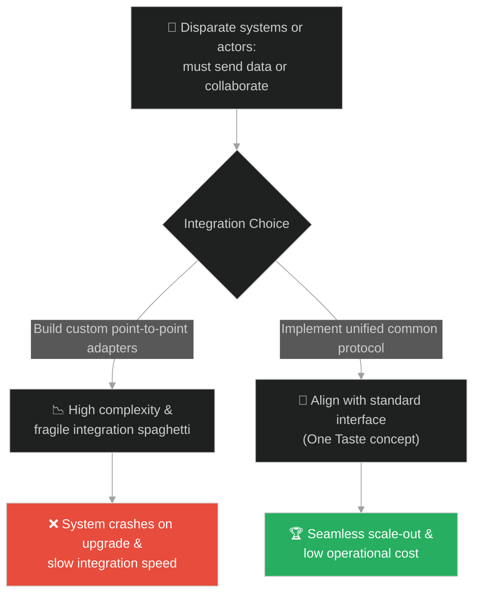
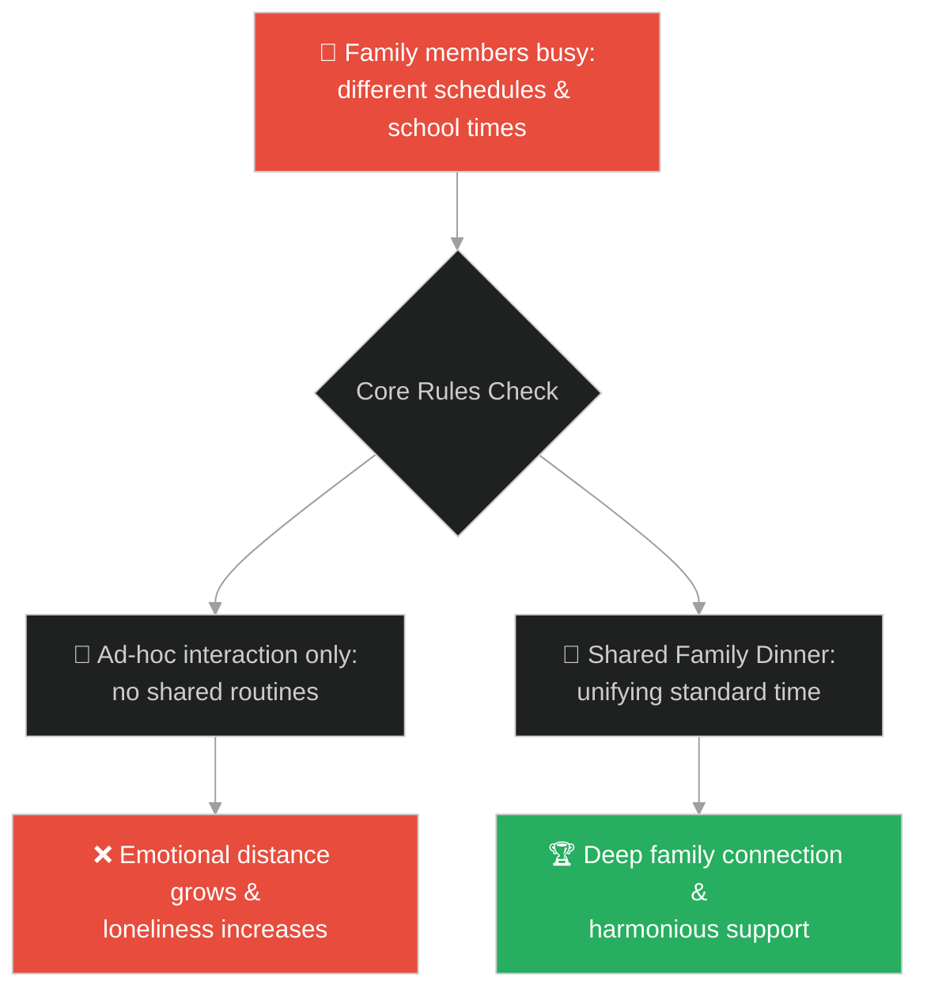
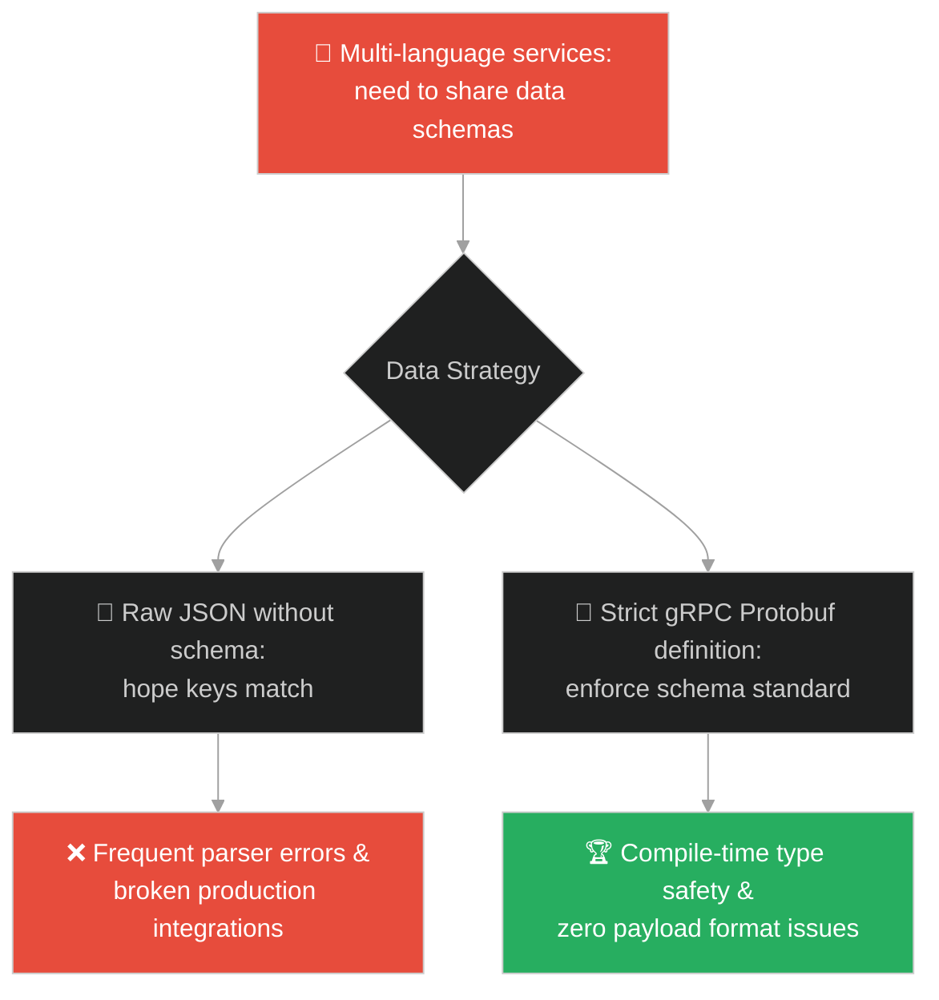
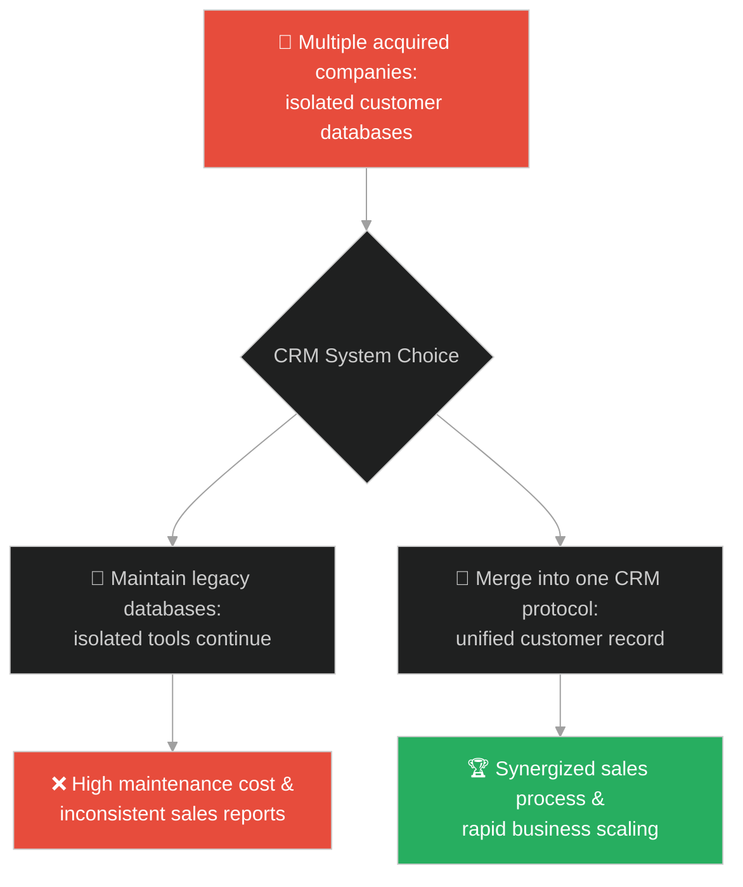
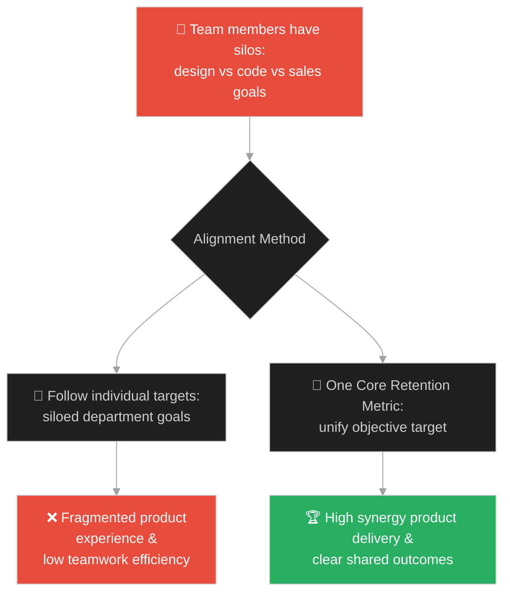
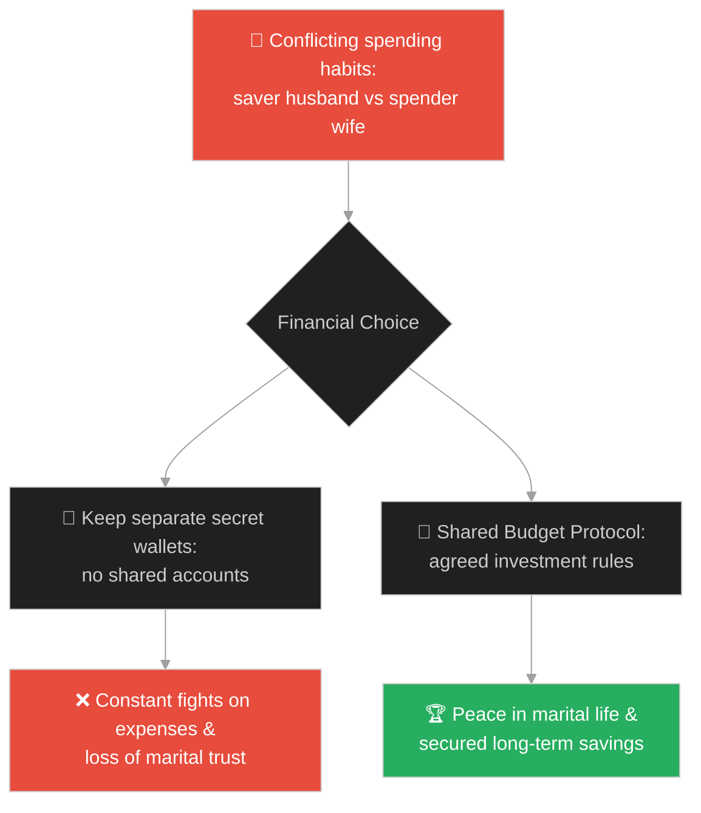
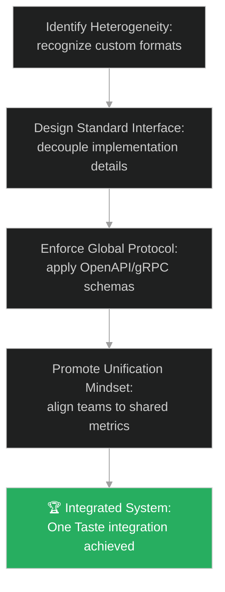

# Standardization & Common Protocols (ការតម្រែតម្រង់ស្តង់ដារ និងពិធីការរួម)៖ សមុទ្រ និងរសជាតិតែមួយ (Standardization & Common Protocols & The Ocean and the One Taste)

**Author:** ichamrong  
**Date:** 2026-05-28  
**Tags:** #buddhism #standardization #system-design #protocols #integration #cooperation  
**Category:** Concepts / Parables  
**Read Time:** ~15 min  

---

## 📌 មាតិកា (Table of Contents)
- [អន្ទាក់ផ្លូវចិត្ត (The Trap)](#0)
- [១. រឿងព្រេងប្រវត្តិសាស្ត្រ៖ សមុទ្រ និងរសជាតិតែមួយ (The Legend of the Ocean and the One Taste)](#1)
  - [ការរលាយសញ្ញាណ និងឈ្មោះទៅជាសមុទ្រធំ (The Dissolution of Names in the Sea)](#1-1)
- [២. បញ្ហា៖ ភាពមិនត្រូវគ្នានៃទម្រង់ទិន្នន័យ និងពិធីការក្នុងប្រព័ន្ធបច្ចេកវិទ្យា (The Issue: Data Format Mismatches and Protocol Chaos)](#2)
- [៣. ឧទាហមណ៍ជាក់ស្តែងក្នុងពិភពពិត (Real World Examples)](#3)
  - [ឧទាហរណ៍ទី ១ — កម្រិតស្រាល (គ្រួសារ)៖ ការតម្រង់ទិសតម្លៃគ្រួសាររួម (Aligning Family Values Amidst Diverse Schedules)](#3-1)
  - [ឧទាហរណ៍ទី ២ — កម្រិតមធ្យម (បច្ចេកទេស)៖ ការបង្កើតពិធីការទិន្នន័យរួម API (Standardizing Multi-Stack APIs with Shared Schema)](#3-2)
  - [ឧទាហរណ៍ទី ៣ — កម្រិតមធ្យម (ធុរកិច្ច)៖ ការបញ្ចូលក្រុមហ៊ុនដែលទើបតែទិញថ្មី (Integrating Acquired Entities Under One Brand Identity)](#3-3)
  - [ឧទាហរណ៍ទី ៤ — កម្រិតមធ្យម (សង្គម/គ្រប់គ្រង)៖ ការតម្រង់ទិសក្រុមចម្រុះជំនាញ (Aligning Multi-Discipline Roles to One Core Metric)](#3-4)
  - [ឧទាហរណ៍ទី ៥ — កម្រិតធ្ងន់ (ទំនាក់ទំនង)៖ ការបន្ស៊ីទស្សនៈវិស័យអនាគតរួមគ្នា (Partners Aligning Diverse Visions for Future)](#3-5)
- [៤. ដំណោះស្រាយទូទៅ៖ ការកសាងស្តង់ដារ និងចំណុចប្រទាក់រួម (The General Solution: Establishing Standard Interfaces and Unifying Architectures)](#4)
- [សេចក្តីសន្និដ្ឋាន (Conclusion)](#5)
- [ឯកសារយោង (References)](#6)
- [Related Posts](#7)

---

<a id="0"></a>
## អន្ទាក់ផ្លូវចិត្ត (The Trap)

តើអ្នកធ្លាប់ជួបបញ្ហាដែលប្រព័ន្ធពីរឬច្រើន ព្យាយាមទំនាក់ទំនងគ្នាតែបែរជាបរាជ័យព្រោះប្រព័ន្ធមួយប្រើ JSON ប្រព័ន្ធមួយប្រើ XML ហើយប្រព័ន្ធមួយទៀតប្រើ Protocol ផ្ទាល់ខ្លួនដែលគ្មាននរណាយល់ដែរឬទេ?

នៅក្នុងស្ថាបត្យកម្មប្រព័ន្ធ និងកិច្ចសហការ៖
* **យើងងាយនឹងធ្លាក់ក្នុងអន្ទាក់** នៃការបង្កើតស្ពានទំនាក់ទំនងផ្ទាល់ខ្លួន (Ad-hoc Adapters) សម្រាប់រាល់ទំនាក់ទំនងថ្មី ដែលធ្វើឱ្យប្រព័ន្ធទាំងមូលមានភាពស្មុគស្មាញ និងផុយស្រួយ។
* **យើងមើលរំលង** សារៈសំខាន់នៃការកំណត់ស្តង់ដាររួម (Common Protocol/Interface) ដែលអនុញ្ញាតឱ្យប្រព័ន្ធផ្សេងៗគ្នាជាច្រើន អាចរលាយបញ្ចូលគ្នា និងប្រាស្រ័យទាក់ទងគ្នាដោយរលូន ដូចជាទន្លេផ្សេងៗដែលហូរចូលមហាសមុទ្រ។

ការបង្កើតប្រព័ន្ធមិនត្រូវគ្នា និងខ្វះស្តង់ដារទំនាក់ទំនងហៅថា **អន្ទាក់ពិធីការបែកខ្ញែក (The Disparate Protocols Trap)**។

ដើម្បីយល់ដឹងពីរបៀបតម្រង់ទិសទៅរកស្តង់ដាររួម នេះជាផែនទីបង្ហាញផ្លូវ៖
1. **រឿងព្រេងនិទាន (The Legend)** — រឿងរ៉ាវរបស់ព្រះពុទ្ធដែលសម្តែងធម៌ធៀបទៅនឹងមហាសមុទ្រ ដែលទន្លេធំៗទាំងប្រាំលះបង់ឈ្មោះរបស់ខ្លួននៅពេលហូរចូលសមុទ្រ ព្រោះវាមានរសជាតិតែមួយ គឺរសជាតិប្រៃ។
2. **បញ្ហា (The Issue)** — ការវិភាគភាពស្មុគស្មាញនៃប្រព័ន្ធដែលមានលក្ខណៈចម្រុះ (Heterogeneous Systems) និងតម្រូវការស្តង់ដារ។
3. **ឧទាហមណ៍ជាក់ស្តែងក្នុងពិភពពិត (Real World Examples)** — ពិនិត្យមើលបញ្ហានេះក្នុងកម្រិតគ្រួសារ បច្ចេកវិទ្យា ធុរកិច្ច ការគ្រប់គ្រង និងទំនាក់ទំនង។
4. **ដំណោះស្រាយទូទៅ (The General Solution)** — ការបង្កើតពិធីការស្តង់ដារ (JSON Schema, OpenAPI, gRPC) និងស្ថាបត្យកម្មផ្អែកលើចំណុចប្រទាក់ (Interface-Driven Design)។



---

<a id="1"></a>
## ១. រឿងព្រេងប្រវត្តិសាស្ត្រ៖ សមុទ្រ និងរសជាតិតែមួយ (The Legend of the Ocean and the One Taste)

ក្នុងសម័យពុទ្ធកាល ព្រះសម្មាសម្ពុទ្ធទ្រង់បានគង់នៅក្បែរឆ្នេរមហាសមុទ្រធំ។ ព្រះអង្គបានត្រាស់ហៅភិក្ខុទាំងឡាយ រួចទ្រង់ត្រាស់សួរអំពីលក្ខណៈពិសេសនៃមហាសមុទ្រ។ ភិក្ខុទាំងឡាយបានក្រាបបង្គំទូលពីភាពអស្ចារ្យផ្សេងៗ។ ព្រះពុទ្ធទ្រង់បានបញ្ជាក់បន្ថែមថា៖
> «មហាសមុទ្រធំនេះ មានរសជាតិតែមួយគត់ គឺ **រសជាតិប្រៃ**។ ទោះបីជាមានទឹកជំនន់ពីទន្លេធំៗ និងស្ទឹងតូចៗជាច្រើនហូរចូលមកក៏ដោយ ក៏វាគ្មិនអាចផ្លាស់ប្តូររសជាតិនៃមហាសមុទ្រឱ្យទៅជាផ្អែម ឬល្វីងបានឡើយ។»

---

<a id="1-1"></a>
### ការរលាយសញ្ញាណ និងឈ្មោះទៅជាសមុទ្រធំ (The Dissolution of Names in the Sea)

ព្រះពុទ្ធទ្រង់បានពន្យល់ប្រៀបធៀបធម៌វិន័យទៅនឹងសមុទ្រថា៖
> «ទន្លេធំៗទាំងឡាយ (ដូចជា ទន្លេគង្គា យមុនា អចិរវតី សរភូ និងមហី) នៅពេលដែលហូរចុះមកដល់មហាសមុទ្រហើយ តែងតែលះបង់ចោលនូវឈ្មោះដើម និងវណ្ណៈដើមរបស់ខ្លួនទាំងអស់ រួចក្លាយទៅជាសញ្ញាណតែមួយ គឺ **"មហាសមុទ្រ"**។»

ព្រះអង្គបានបន្តថា ធម៌វិន័យរបស់តថាគតក៏ដូច្នោះដែរ។ មនុស្សមកពីវណ្ណៈផ្សេងៗគ្នា (ក្សត្រ ព្រាហ្មណ៍ វៃស្សៈ ឬសូទ្រៈ) នៅពេលដែលចូលមកបួសក្នុងសាសនានេះហើយ តែងតែលះបង់ចោលនូវឈ្មោះ និងវណ្ណៈចាស់របស់ខ្លួន រួចរលាយចូលគ្នាជាសមាជិកតែមួយ ដែលមានរសជាតិតែមួយ គឺ **"រសជាតិនៃការរំដោះទុក្ខ (វិមុត្តិរស)"**។

---

<a id="2"></a>
## ២. បញ្ហា៖ ភាពមិនត្រូវគ្នានៃទម្រង់ទិន្នន័យ និងពិធីការក្នុងប្រព័ន្ធបច្ចេកវិទ្យា (The Issue: Data Format Mismatches and Protocol Chaos)

នៅក្នុងការសរសេរកម្មវិធី និងស្ថាបត្យកម្មមីក្រូសេវាកម្ម (Microservices) កំហុសឆ្គងដ៏ធំបំផុតគឺការអនុញ្ញាតឱ្យសេវាកម្មនីមួយៗរចនា API ទិន្នន័យតាមចិត្តរបស់ខ្លួនដោយគ្មានច្បាប់រួម។ ប្រព័ន្ធ Frontend ត្រូវដោះស្រាយជាមួយនឹង JSON format ផ្សេងគ្នារាប់សិប ដែលនាំឱ្យកូដឡើងស្មុគស្មាញ និងងាយរងគ្រោះ។

នេះជាឧទាហមណ៍ស្ទីលស្ថាបត្យកម្មដែលមិនមានស្តង់ដារ៖

```java
// ភាពចលាចលនៅពេលគ្មានការប្រើប្រាស់ Interface ឬពិធីការរួម
public class DataIntegrationChaos {
    // Legacy payload with custom structure
    public String handleSystemA(Map<String, Object> payload) {
        return "Processed A: " + payload.get("user_id_string");
    }
    
    // New payload with different keys
    public String handleSystemB(Map<String, Object> payload) {
        return "Processed B: " + payload.get("UID");
    }

    // Solution using a common protocol interface (One Taste)
    public interface UnifiedPayload {
        String getUnifiedUserId();
    }
}
```

* **ការកើនឡើងនៃ Cognitive Load៖** វិស្វករត្រូវសិក្សាពី API format ថ្មីរាល់ពេលដែលចង់ភ្ជាប់សេវាកម្មពីរចូលគ្នា។
* **ភាពលំបាកក្នុងការធានាសុវត្ថិភាព (Security Alignment Failure)៖** ការអនុវត្តគោលការណ៍សុវត្ថិភាព ឬការត្រួតពិនិត្យ (Audit Log) ត្រូវធ្វើឡើងដាច់ដោយឡែកពីគ្នា ដែលបង្កឱ្យមានចន្លោះប្រហោង។

---

<a id="3"></a>
## ៣. ឧទាហមណ៍ជាក់ស្តែងក្នុងពិភពពិត

---

<a id="3-1"></a>
### ឧទាហរណ៍ទី ១ — កម្រិតស្រាល (គ្រួសារ)៖ ការតម្រង់ទិសតម្លៃគ្រួសាររួម (Aligning Family Values Amidst Diverse Schedules)

សមាជិកគ្រួសារម្នាក់ៗមានការងារផ្ទាល់ខ្លួន (ឪពុកធ្វើការជៅជ្រៅ ម្តាយលក់ដូរ កូនរៀនសូត្រ) ដែលធ្វើឱ្យកាលវិភាគខុសគ្នាទាំងស្រុង។ ប្រសិនបើគ្មានច្បាប់រួម ទំនាក់ទំនងនឹងបែកបាក់។ ការបង្កើត «ពេលបាយល្ងាចជួបជុំគ្នា» និង «គោរពពាក្យសច្ចៈ» ធ្វើជាស្តង់ដារស្នូល ជួយរក្សាសាមគ្គីភាពទោះបីជាសកម្មភាពប្រចាំថ្ងៃខុសគ្នាក៏ដោយ។



---

<a id="3-2"></a>
### ឧទាហរណ៍ទី ២ — កម្រិតមធ្យម (បច្ចេកទេស)៖ ការបង្កើតពិធីការទិន្នន័យរួម API (Standardizing Multi-Stack APIs with Shared Schema)

ក្រុមការងារបច្ចេកវិទ្យាប្រើប្រាស់ភាសាចម្រុះ (Node.js, Go, Python)។ ការសរសេរ API client សម្រាប់សេវាកម្មនីមួយៗបង្កជាការងារស្មុគស្មាញ។ ដោយការនាំយក gRPC ឬ OpenAPI (Swagger) មកប្រើប្រាស់ជាពិធីការរួម (Common Protocol) ពួកគេអាចបង្កើតកូដទំនាក់ទំនងដោយស្វ័យប្រវត្តិ ធានាបាននូវសុពលភាពទិន្នន័យ ១០០%។



---

<a id="3-3"></a>
### ឧទាហរណ៍ទី ៣ — កម្រិតមធ្យម (ធុរកិច្ច)៖ ការបញ្ចូលក្រុមហ៊ុនដែលទើបតែទិញថ្មី (Integrating Acquired Entities Under One Brand Identity)

ក្រុមហ៊ុនធំមួយបានទិញយកក្រុមហ៊ុនតូចៗចំនួន ៣។ ក្រុមហ៊ុននីមួយៗមានប្រព័ន្ធគ្រប់គ្រងអតិថិជន (CRM) និងទម្រង់លក់ដាច់ដោយឡែកពីគ្នា។ ការអនុញ្ញាតឱ្យពួកគេដំណើរការដាច់ដោយឡែក បង្កការលំបាកដល់ការលក់ផលិតផលឆ្លងគ្នា (Cross-selling)។ ការផ្លាស់ប្តូរទៅកាន់ប្រព័ន្ធទិន្នន័យ CRM រួមតែមួយ ជួយឱ្យអាជីវកម្មដើរទៅមុខយ៉ាងលឿន។



---

<a id="3-4"></a>
### ឧទាហរណ៍ទី ៤ — កម្រិតមធ្យម (សង្គម/គ្រប់គ្រង)៖ ការតម្រង់ទិសក្រុមចម្រុះជំនាញ (Aligning Multi-Discipline Roles to One Core Metric)

នៅក្នុងក្រុមអភិវឌ្ឍន៍ផលិតផល អ្នករចនា (Designers) ផ្តោតលើភាពស្រស់ស្អាត វិស្វករ (Devs) ផ្តោតលើល្បឿនកូដ ហើយអ្នកលក់ (Sales) ផ្តោតលើលក្ខខណ្ឌពិសេសរបស់អតិថិជន។ ការប្រជែងគ្នានេះធ្វើឱ្យផលិតផលមិនទាន់សម័យ។ ការតម្រង់ទិសពួកគេឱ្យផ្តោតលើគោលដៅតែមួយគឺ «អត្រារក្សាទុកអតិថិជន (Retention Rate)» ជួយឱ្យគ្រប់គ្នាសម្របសម្រួលគ្នា។



---

<a id="3-5"></a>
### ឧទាហរណ៍ទី ៥ — កម្រិតធ្ងន់ (ទំនាក់ទំនង)៖ ការបន្ស៊ីទស្សនៈវិស័យអនាគតរួមគ្នា (Partners Aligning Diverse Visions for Future)

ប្តីប្រពន្ធពីរនាក់មានប្រភពដើម និងទម្លាប់រស់នៅខុសគ្នាស្រឡះ (ប្តីចូលចិត្តសន្សំសំចៃ ប្រពន្ធចូលចិត្តចំណាយលើការទទួលយកបទពិសោធន៍)។ ការប្រកាន់យកតែទម្លាប់រៀងៗខ្លួនបង្កឱ្យមានជម្លោះហិរញ្ញវត្ថុជានិច្ច។ ដោយការព្រមព្រៀងគ្នាលើគម្រោងថវិការួមតែមួយ និងគោលដៅហិរញ្ញវត្ថុគ្រួសារ ពួកគេអាចរស់នៅជាមួយគ្នាយ៉ាងចុះសម្រុង។



---

<a id="4"></a>
## ៤. ដំណោះស្រាយទូទៅ៖ ការកសាងស្តង់ដារ និងចំណុចប្រទាក់រួម (The General Solution: Establishing Standard Interfaces and Unifying Architectures)

ដើម្បីលុបបំបាត់ភាពស្មុគស្មាញ និងតម្រង់ទិសប្រព័ន្ធការងារឱ្យមានប្រសិទ្ធភាព ចូរអនុវត្តយន្តការខាងក្រោម៖



* **ការរចនាផ្អែកលើចំណុចប្រទាក់ (Interface-Driven Design)៖** កំណត់កិច្ចសន្យាទំនាក់ទំនង (Contract) ឱ្យបានច្បាស់លាស់មុននឹងចាប់ផ្តើមសរសេរកូដជាក់ស្តែង។ វិស្វករគ្រប់គ្នាក្នុងក្រុមត្រូវគោរពតាមកិច្ចសន្យានេះ។
* **ការប្រើប្រាស់ពិធីការស្តង់ដារឧស្សាហកម្ម (Industry Standard Protocols)៖** ជៀសវាងការបង្កើតពិធីការផ្ទាល់ខ្លួន (Proprietary Protocols)។ ប្រើប្រាស់ស្តង់ដារដែលត្រូវបានទទួលស្គាល់ និងគាំទ្រយ៉ាងទូលំទូលាយដូចជា REST, gRPC, OAuth2 និង JSON-LD។
* **គោលការណ៍នៃសមុទ្រ និងរសជាតិតែមួយក្នុងក្រុមការងារ (The Ocean Unification Rule)៖**
  1. **លះបង់ចំណងនាយកដ្ឋាន**៖ រលាយរាល់ឈ្មោះ និងចំណងជំនាញ (Design, Dev, QA) នៅពេលផ្តោតលើការដោះស្រាយបញ្ហារបស់អតិថិជន។
  2. **រសជាតិនៃគុណតម្លៃស្នូល**៖ បង្កើតច្បាប់ និងបរិយាកាសការងារដែលធានាថារាល់បុគ្គលិកទាំងអស់ ទទួលបានការគាំទ្រ និងការលូតលាស់ស្មើៗគ្នា។

---

## 🐇 ធ្លាក់ចូលក្នុងរន្ធទន្សាយ (Enter the Rabbit Hole)

ដើម្បីស្វែងយល់កាន់តែស៊ីជម្រៅអំពីរបៀបដែលការសម្របសម្រួលខ្លួន និងការថែរក្សាទំនួលខុសត្រូវរៀងៗខ្លួនជាគ្រឹះនៃសុវត្ថិភាពប្រព័ន្ធរួម សូមចាប់ផ្តើមដំណើររុករករបស់អ្នកដោយចុចលើតំណភ្ជាប់ខាងក្រោម៖

* 🚀 **[ចាប់ផ្តើមដំណើររុករក (Start the Journey) ➔ ការថែរក្សាខ្លួន និងស្វ័យភាពប្រព័ន្ធ (Self-Care & Loose Coupling)](./132-buddha-and-the-acrobats.md)**

---

<a id="5"></a>
## សេចក្តីសន្និដ្ឋាន (Conclusion)

> **«ដូចជាទឹកទន្លេដែលរលាយឈ្មោះនៅមហាសមុទ្រ ប្រព័ន្ធ និងមនុស្សក៏ត្រូវការស្តង់ដាររួមដើម្បីលុបបំបាត់ជម្លោះ និងកសាងកិច្ចសហការប្រកបដោយសាមគ្គីភាព។»**

ការបង្កើតស្ថាបត្យកម្មប្រព័ន្ធ និងរចនាសម្ព័ន្ធការងារដែលមានប្រសិទ្ធភាព មិនមែនជាការកសាងចំណុចតភ្ជាប់គ្នាដោយស្មុគស្មាញនោះទេ ប៉ុន្តែជាការបង្កើតចំណុចប្រទាក់ស្តង់ដារដ៏សាមញ្ញ និងរឹងមាំមួយ ដែលគ្រប់គ្នាអាចយល់ និងគោរពតាម។ រសជាតិនៃភាពសាមញ្ញ និងភាពត្រូវគ្នានេះ គឺជាគន្លឹះនៃការអភិវឌ្ឍប្រព័ន្ធបច្ចេកវិទ្យាប្រកបដោយចីរភាព។

---

<a id="6"></a>
## ឯកសារយោង (References)

* **Oceanic Sutta (Pahārāda Sutta - AN 8.19)** — Teachings of the Buddha detailing the eight wonderful and marvelous qualities of the great ocean, including the single taste of salt.
* **Martin Fowler** — *Patterns of Enterprise Application Architecture* (2002). Deep dive into Service Layer and Data Mapper patterns for unified integration.
* **Eric Evans** — *Domain-Driven Design: Tackling Complexity in the Heart of Software* (2003). Discussion on Bounded Contexts and Published Language protocols.

---

<a id="7"></a>
## Related Posts

* [The Baker and the Butcher](./11-the-baker-and-the-butcher.md) — Unifying trading protocols and value exchange mechanics.
* [The Empty Cup](./122-buddha-and-the-empty-cup.md) — Unlearning custom constraints to adopt standardized shared frameworks.
