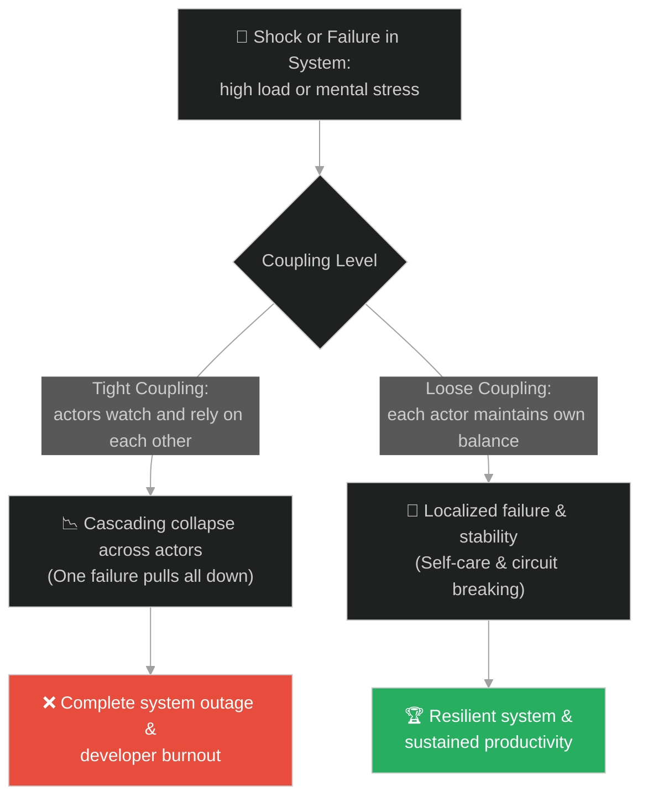
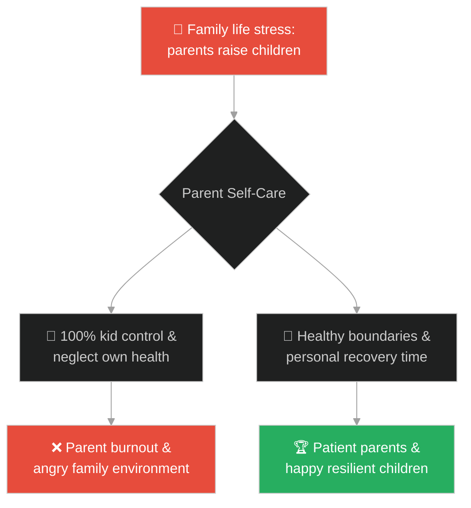
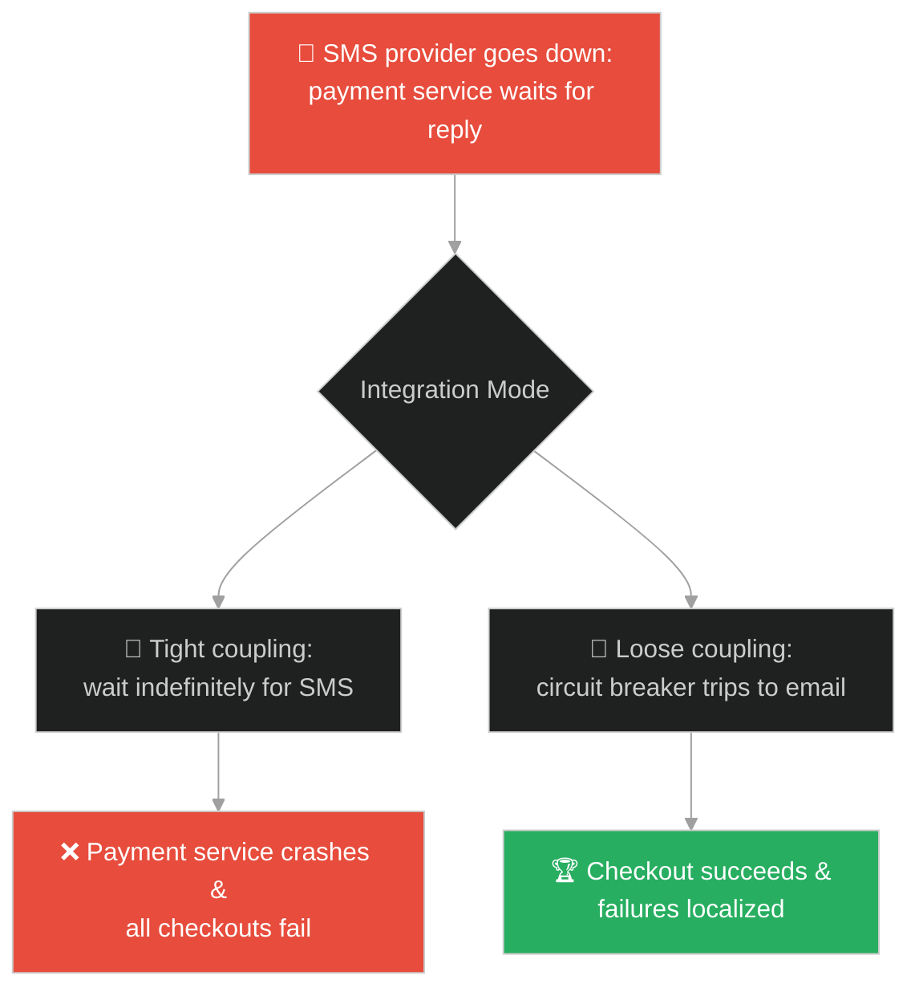
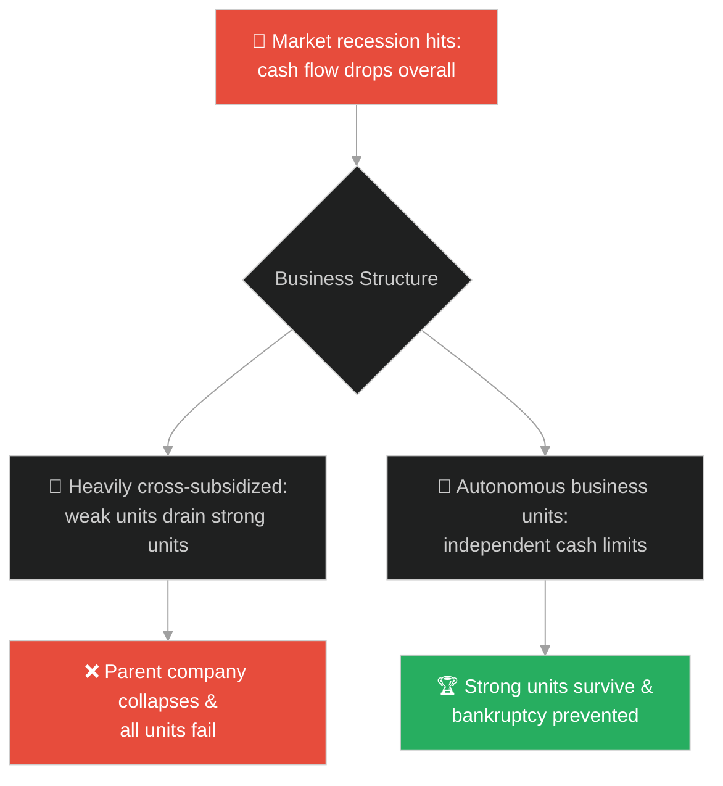
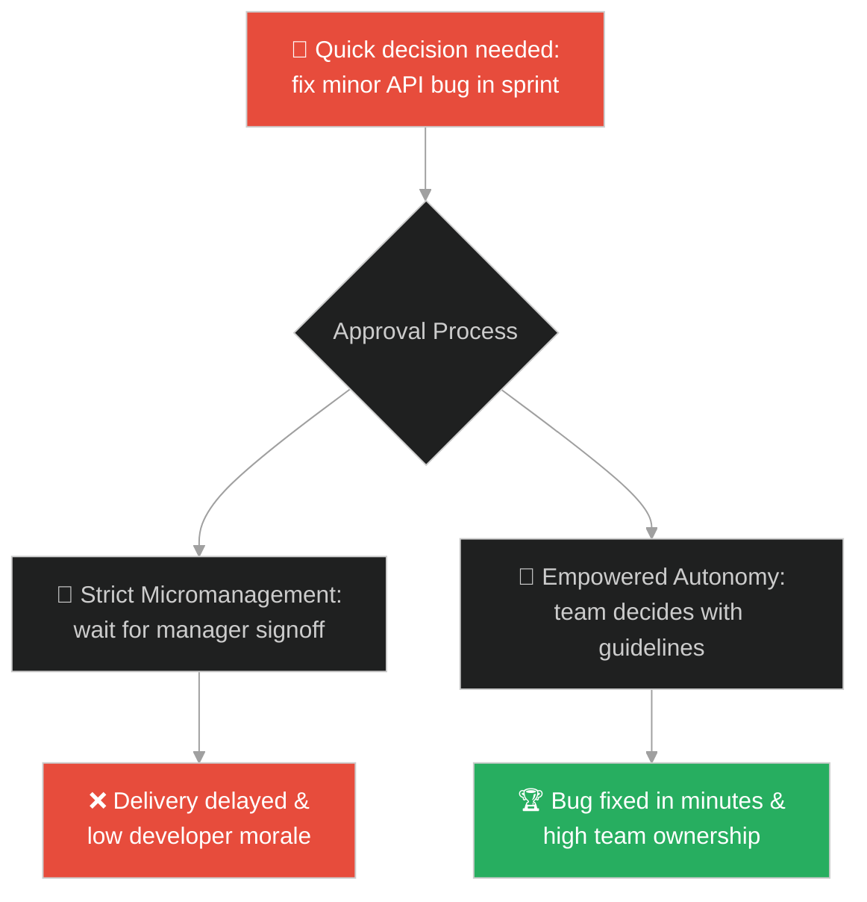
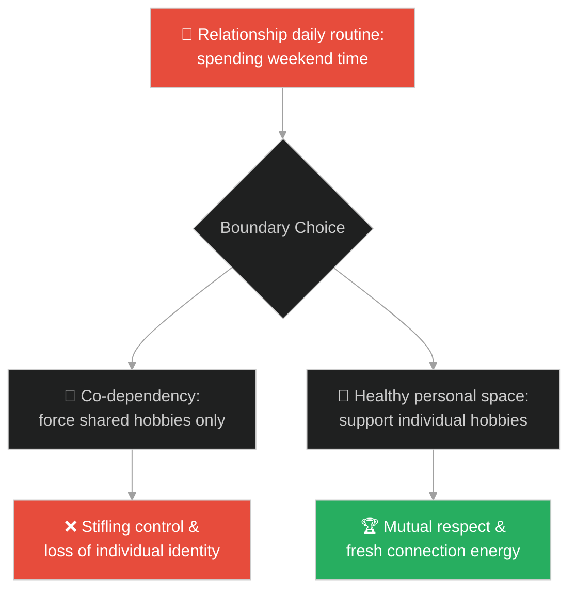
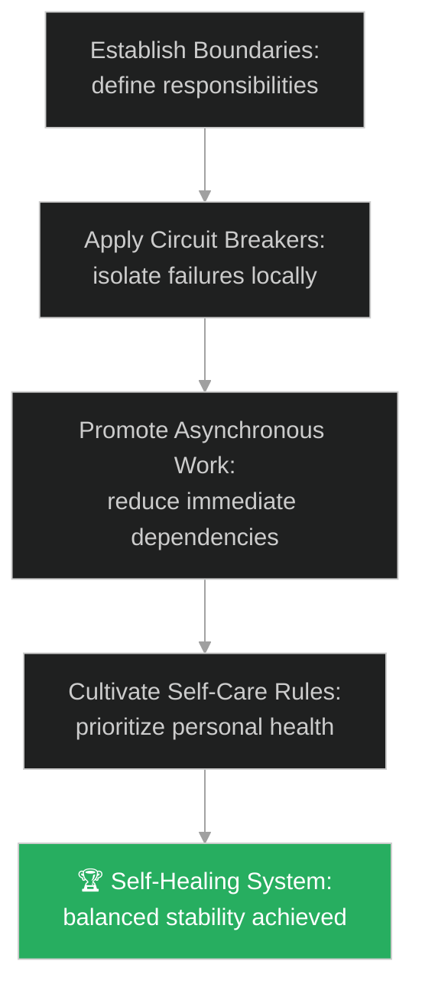

# Self-Care & Autonomy (ការថែរក្សាខ្លួន និងសិទ្ធិស្វ័យភាព)៖ កាយសម្ព័ន្ធ និងបង្គោលឫស្សី (Self-Care & Autonomy & The Acrobats and the Bamboo Pole)

**Author:** ichamrong  
**Date:** 2026-05-28  
**Tags:** #buddhism #autonomy #self-care #system-design #loose-coupling #circuit-breaker #mental-health  
**Category:** Concepts / Parables  
**Read Time:** ~15 min  

---

## 📌 មាតិកា (Table of Contents)
- [អន្ទាក់ផ្លូវចិត្ត (The Trap)](#0)
- [១. រឿងព្រេងប្រវត្តិសាស្ត្រ៖ កាយសម្ព័ន្ធ និងបង្គោលឫស្សី (The Legend of the Acrobats and the Bamboo Pole)](#1)
  - [ការថែរក្សាខ្លួនជាគ្រឹះនៃការថែរក្សាអ្នកដទៃ (Protecting Oneself to Protect the Other)](#1-1)
- [២. បញ្ហា៖ ការពឹងផ្អែកគ្នាខ្លាំងពេក និងការដួលរលំជាខ្សែសង្វាក់ (The Issue: Tight Coupling and Cascading Failures)](#2)
- [៣. ឧទាហមណ៍ជាក់ស្តែងក្នុងពិភពពិត (Real World Examples)](#3)
  - [ឧទាហរណ៍ទី ១ — កម្រិតស្រាល (គ្រួសារ)៖ មាតាបិតាថែរក្សាសុខភាពផ្ទាល់ខ្លួន (Parents Managing Burnout to Support Children)](#3-1)
  - [ឧទាហរណ៍ទី ២ — កម្រិតមធ្យម (បច្ចេកទេស)៖ ការប្រើប្រាស់ Circuit Breakers ក្នុងសេវាកម្ម (Microservices with Autonomous Circuit Breakers)](#3-2)
  - [ឧទាហរណ៍ទី ៣ — កម្រិតមធ្យម (ធុរកិច្ច)៖ ស្វ័យភាពហិរញ្ញវត្ថុនៃអង្គភាពអាជីវកម្ម (Ensuring Independent Unit Profitability)](#3-3)
  - [ឧទាហរណ៍ទី ៤ — កម្រិតមធ្យម (សង្គម/គ្រប់គ្រង)៖ ការប្រគល់សិទ្ធិសម្រេចចិត្ត និងទំនួលខុសត្រូវ (Empowering Teams with Decoupled Ownership)](#3-4)
  - [ឧទាហរណ៍ទី ៥ — កម្រិតធ្ងន់ (ទំនាក់ទំនង)៖ ព្រំដែនផ្ទាល់ខ្លួនរបស់ដៃគូ (Partners Maintaining Personal Boundaries and Hobbies)](#3-5)
- [៤. ដំណោះស្រាយទូទៅ៖ ការរចនាប្រព័ន្ធដែលមានភាពស្វ័យភាព និងឯករាជ្យ (The General Solution: Designing Loose Coupling and Self-Healing Architectures)](#4)
- [សេចក្តីសន្និដ្ឋាន (Conclusion)](#5)
- [ឯកសារយោង (References)](#6)
- [Related Posts](#7)

---

<a id="0"></a>
## អន្ទាក់ផ្លូវចិត្ត (The Trap)

តើអ្នកធ្លាប់ជួបស្ថានភាពដែលប្រព័ន្ធបច្ចេកវិទ្យាមួយដួលរលំ រួចទាញយកសេវាកម្មផ្សេងៗទៀតរាប់សិបឱ្យគាំងតាមគ្នា ឬអ្នកគ្រប់គ្រងម្នាក់ដែលបំពេញការងារជំនួសកូនចៅរហូតដល់ខ្លួនឯង Burnout និងបំផ្លាញការងារទាំងមូលដែរឬទេ?

នៅក្នុងជីវិត និងការរៀបចំប្រព័ន្ធ៖
* **យើងងាយនឹងធ្លាក់ក្នុងអន្ទាក់** នៃការគិតថា «ខ្ញុំត្រូវតែចាំសម្លឹងមើល និងកែតម្រូវអ្នកដទៃគ្រប់ពេលទើបមានសុវត្ថិភាព» (Micromanagement / Tight Coupling)។
* **យើងមើលរំលង** ថាការថែរក្សាលំនឹង និងសុវត្ថិភាពផ្ទាល់ខ្លួនជាមុនសិន (Self-care / Autonomy) គឺជាមូលដ្ឋានគ្រឹះពិតប្រាកដក្នុងការជួយជ្រោមជ្រែងអ្នកដទៃ និងប្រព័ន្ធទាំងមូលឱ្យមានសុវត្ថិភាព។

ការផ្តោតលើការគ្រប់គ្រងអ្នកដទៃរហូតដល់ភ្លេចលំនឹងខ្លួនឯង ហៅថា **អន្ទាក់ការពឹងផ្អែកគ្នាខ្លាំងពេក (The Tight Coupling Trap)**។

ដើម្បីយល់ដឹងពីរបៀបបង្កើតស្វ័យភាព និងលំនឹងប្រព័ន្ធ នេះជាផែនទីបង្ហាញផ្លូវ៖
1. **រឿងព្រេងនិទាន (The Legend)** — រឿងរ៉ាវរបស់អ្នកកាយសម្ព័ន្ធពីរនាក់គ្រូនិងសិស្ស លើបង្គោលឫស្សី ដែលព្រះពុទ្ធឱ្យដំបូន្មានថា «ការថែរក្សាខ្លួនឯងឱ្យបានល្អ គឺជាការថែរក្សាអ្នកដទៃ»។
2. **បញ្ហា (The Issue)** — ការវិភាគការពឹងផ្អែកគ្នាក្នុងប្រព័ន្ធបច្ចេកវិទ្យា និងការដួលរលំជាខ្សែសង្វាក់ (Cascading Failure)។
3. **ឧទាហមណ៍ជាក់ស្តែងក្នុងពិភពពិត (Real World Examples)** — ពិនិត្យមើលបញ្ហានេះក្នុងកម្រិតគ្រួសារ បច្ចេកវិទ្យា ធុរកិច្ច ការគ្រប់គ្រង និងទំនាក់ទំនង។
4. **ដំណោះស្រាយទូទៅ (The General Solution)** — ការអនុវត្តស្ថាបត្យកម្មកូដឯករាជ្យ (Loose Coupling) និងរបាំងការពារការដួលរលំ (Circuit Breaker Pattern)។



---

<a id="1"></a>
## ១. រឿងព្រេងប្រវត្តិសាស្ត្រ៖ កាយសម្ព័ន្ធ និងបង្គោលឫស្សី (The Legend of the Acrobats and the Bamboo Pole)

ថ្ងៃមួយ ព្រះសម្មាសម្ពុទ្ធទ្រង់បានត្រាស់និទានប្រាប់ភិក្ខុទាំងឡាយ អំពីរឿងរបស់អ្នកសម្តែងកាយសម្ព័ន្ធលើបង្គោលឫស្សីពីរនាក់។ ម្នាក់ជាគ្រូឈ្មោះ **សេតកៈ** និងម្នាក់ទៀតជាកូនសិស្សស្រីឈ្មោះ **មេទកថាលិកា**។

គ្រូបានលើកបង្គោលឫស្សីវែងមួយដាក់លើស្មារបស់ខ្លួន ហើយប្រាប់សិស្សស្រីថា៖
* *«មេទកថាលិកា! ចូរនាងឡើងទៅលើចុងបង្គោលឫស្សី។ នាងត្រូវចាំមើលថែរក្សាខ្ញុំ ហើយខ្ញុំនឹងចាំមើលថែរក្សានាង។ ធ្វើបែបនេះ យើងទាំងពីរនឹងអាចសម្តែងបានយ៉ាងសុវត្ថិភាព និងរកប្រាក់បានច្រើន។»*

កូនសិស្សស្រីដែលជាក្មេងឆ្លាត បានតបទៅគ្រូវិញថា៖
* *«លោកគ្រូ! វាមិនមែនបែបនោះទេ។ វិធីត្រឹមត្រូវគឺ៖ **ខ្ញុំត្រូវមើលថែរក្សាខ្លួនខ្ញុំឱ្យមានតុល្យភាព ហើយលោកគ្រូត្រូវមើលថែរក្សាខ្លួនលោកគ្រូឱ្យមានតុល្យភាព**។ កាលណាយើងម្នាក់ៗរក្សាតុល្យភាពខ្លួនឯងបានល្អហើយ នោះយើងទាំងពីរនឹងសម្តែងដោយសុវត្ថិភាព និងមិនធ្លាក់ចុះមកឡើយ។»*

---

<a id="1-1"></a>
### ការថែរក្សាខ្លួនជាគ្រឹះនៃការថែរក្សាអ្នកដទៃ (Protecting Oneself to Protect the Other)

ព្រះពុទ្ធទ្រង់បានសម្តែងគាំទ្រពាក្យសម្តីរបស់សិស្សស្រីនោះយ៉ាងខ្លាំង។ ព្រះអង្គមានសង្ឃដីកាពន្យល់ថា៖
> «ពាក្យរបស់នាងមេទកថាលិកា គឺជាការពិតជាក់ស្តែង។ កាលណាយើងថែរក្សាខ្លួនឯង (តាមរយៈការចម្រើនសតិដ្ឋាន) គឺប្រៀបដូចជាយើងបានថែរក្សាអ្នកដទៃ។ កាលណាយើងថែរក្សាអ្នកដទៃ (តាមរយៈការមិនបៀតបៀន និងក្តីមេត្តា) គឺប្រៀបដូចជាយើងបានថែរក្សាខ្លួនឯងដែរ។»

តុល្យភាពរបស់ប្រព័ន្ធទាំងមូល មិនមែនកើតឡើងពីការតាមឃ្លាំមើល និងគ្រប់គ្រងអ្នកដទៃនោះទេ ប៉ុន្តែវាចាប់ផ្តើមពីស្វ័យភាព និងសមត្ថភាពរក្សាលំនឹងរបស់សមាជិកម្នាក់ៗ។

---

<a id="2"></a>
## ២. បញ្ហា៖ ការពឹងផ្អែកគ្នាខ្លាំងពេក និងការដួលរលំជាខ្សែសង្វាក់ (The Issue: Tight Coupling and Cascading Failures)

នៅក្នុងប្រព័ន្ធបច្ចេកវិទ្យា និងការអភិវឌ្ឍន៍សូហ្វវែរ ការរចនាប្រព័ន្ធដែលមានការពឹងផ្អែកគ្នាខ្លាំងពេក (Tight Coupling) គឺជាប្រភពនៃការដួលរលំជាខ្សែសង្វាក់ (Cascading Failure)។ ប្រសិនបើសេវាកម្ម A ហៅទៅសេវាកម្ម B ដោយផ្ទាល់ ហើយគ្មានប្រព័ន្ធការពារ បើសេវាកម្ម B យឺត សេវាកម្ម A នឹងត្រូវកកស្ទះ thread ហើយដួលរលំតាមគ្នា។

នេះជាកូដដែលខ្វះស្វ័យភាព និងងាយរងគ្រោះ៖

```java
// ឧទាហរណ៍នៃការដួលរលំតាមគ្នាដោយសារការពឹងផ្អែកខ្លាំងពេក
public class FragileIntegration {
    private final DependentService targetService = new DependentService();
    
    public String requestData(String query) {
        // អន្ទាក់៖ បើ targetService ដើរយឺត ឬដួលរលំ នោះ thread នឹងត្រូវជាប់គាំង
        return targetService.fetchSlowResource(query);
    }
}

// ដំណោះស្រាយ៖ ការប្រើប្រាស់ Circuit Breaker ដើម្បីបង្កើតស្វ័យភាព
public class ResilientService {
    private final CircuitBreaker breaker = new CircuitBreaker();
    
    public String requestDataResilient(String query) {
        if (breaker.isClosed()) {
            try {
                return breaker.execute(() -> new DependentService().fetchSlowResource(query));
            } catch (Exception e) {
                breaker.recordFailure();
                return "Fallback data (System Self-Protected)";
            }
        }
        return "Circuit Open: Fallback cache returned immediately";
    }
}
```

* **ការបាត់បង់ភាពធន់របស់ប្រព័ន្ធ (Loss of Resiliency)៖** គ្មានសេវាកម្មណាមួយអាចការពារខ្លួនពីកំហុសរបស់សេវាកម្មដទៃឡើយ។
* **ភាពលំបាកក្នុងការកែប្រែកូដ (Maintenance Nightmare)៖** ការផ្លាស់ប្តូរផ្នែកតូចមួយក្នុងប្រព័ន្ធ នឹងជះឥទ្ធិពលដល់ផ្នែកផ្សេងៗទៀតទាំងអស់។

---

<a id="3"></a>
## ៣. ឧទាហមណ៍ជាក់ស្តែងក្នុងពិភពពិត

---

<a id="3-1"></a>
### ឧទាហរណ៍ទី ១ — កម្រិតស្រាល (គ្រួសារ)៖ មាតាបិតាថែរក្សាសុខភាពផ្ទាល់ខ្លួន (Parents Managing Burnout to Support Children)

ឪពុកម្តាយខ្លះផ្តោតការយកចិត្តទុកដាក់ និងគ្រប់គ្រងកូនៗ ២៤ ម៉ោងក្នុងមួយថ្ងៃ រហូតដល់ខ្លួនឯង Burnout អស់កម្លាំងកាយ និងស្ត្រេសផ្លូវចិត្តខ្លាំង។ ភាពតានតឹងនេះជះឥទ្ធិពលមិនល្អដល់កូនៗ។ នៅពេលឪពុកម្តាយចំណាយពេលខ្លះថែរក្សាសុខភាព និងចិត្តខ្លួនឯង ពួកគេអាចផ្តល់ការគាំទ្រដ៏ល្អដល់កូនៗ។



---

<a id="3-2"></a>
### ឧទាហរណ៍ទី ២ — កម្រិតមធ្យម (បច្ចេកទេស)៖ ការប្រើប្រាស់ Circuit Breakers ក្នុងសេវាកម្ម (Microservices with Autonomous Circuit Breakers)

សេវាកម្មទូទាត់ប្រាក់ (Payment) ពឹងផ្អែកលើ API ផ្ញើសារ SMS ខាងក្រៅ។ នៅពេលសេវាកម្ម SMS ដួលរលំ ការទូទាត់ប្រាក់ត្រូវគាំង ហើយអតិថិជនមិនអាចទិញទំនិញបាន។ ការដាក់របាំង Circuit Breaker ជួយឱ្យសេវាកម្មទូទាត់ប្រាក់ផ្តាច់ទំនាក់ទំនងភ្លាមៗ រួចដំណើរការទូទាត់បន្តដោយផ្ញើបង្កាន់ដៃតាមអ៊ីមែលជំនួសវិញ។



---

<a id="3-3"></a>
### ឧទាហរណ៍ទី ៣ — កម្រិតមធ្យម (ធុរកិច្ច)៖ ស្វ័យភាពហិរញ្ញវត្ថុនៃអង្គភាពអាជីវកម្ម (Ensuring Independent Unit Profitability)

ក្រុមហ៊ុនមេមួយមានបុត្រសម្ព័ន្ធចំនួន ៤។ បុត្រសម្ព័ន្ធទី ១ និងទី ២ ដំណើរការខាតបង់ជានិច្ច តែត្រូវបានគាំទ្រដោយថវិកាពីបុត្រសម្ព័ន្ធទី ៣។ នៅពេលទីផ្សារជួបវិបត្តិ ក្រុមហ៊ុនទាំងមូលស្ទើរតែក្ស័យធន។ ការរៀបចំឱ្យបុត្រសម្ព័ន្ធនីមួយៗទទួលខុសត្រូវលើប្រាក់ចំណេញរៀងខ្លួន ជួយធានាសុវត្ថិភាពក្រុមហ៊ុនទាំងមូល។



---

<a id="3-4"></a>
### ឧទាហរណ៍ទី ៤ — កម្រិតមធ្យម (សង្គម/គ្រប់គ្រង)៖ ការប្រគល់សិទ្ធិសម្រេចចិត្ត និងទំនួលខុសត្រូវ (Empowering Teams with Decoupled Ownership)

ប្រធានគម្រោងម្នាក់តម្រូវឱ្យរាល់ការសម្រេចចិត្តតូចតាចទាំងអស់ ត្រូវតែឆ្លងកាត់ការអនុម័តពីគាត់។ គាត់ក្លាយជាដបកកស្ទះ (Bottleneck) ដែលធ្វើឱ្យការងារយឺតយ៉ាវ និងគ្មានវិស្វករណាម្នាក់ហ៊ានសម្រេចចិត្តដោយខ្លួនឯង។ ការប្រគល់សិទ្ធិស្វ័យភាព ជួយឱ្យក្រុមការងារដើរទៅមុខយ៉ាងលឿន និងមានការទទួលខុសត្រូវខ្ពស់។



---

<a id="3-5"></a>
### ឧទាហរណ៍ទី ៥ — កម្រិតធ្ងន់ (ទំនាក់ទំនង)៖ ព្រំដែនផ្ទាល់ខ្លួនរបស់ដៃគូ (Partners Maintaining Personal Boundaries and Hobbies)

នៅក្នុងទំនាក់ទំនងគូស្រករ ដៃគូម្ខាងតែងតែបោះបង់ចោលរាល់ចំណង់ចំណូលចិត្ត មិត្តភក្តិ និងគោលដៅផ្ទាល់ខ្លួនទាំងអស់ ដើម្បីចំណាយពេល និងកែប្រែខ្លួនទៅតាមចិត្តដៃគូម្ខាងទៀត។ ការលះបង់ហួសហេតុនេះបង្កើតឱ្យមានភាពតានតឹង និងការស្តីបន្ទោសគ្នាទៅវិញទៅមក។ ការរក្សាព្រំដែនផ្ទាល់ខ្លួន និងស្វ័យភាព ជួយឱ្យទំនាក់ទំនងរឹងមាំ និងមានតុល្យភាព។



---

<a id="4"></a>
## ៤. ដំណោះស្រាយទូទៅ៖ ការរចនាប្រព័ន្ធដែលមានភាពស្វ័យភាព និងឯករាជ្យ (The General Solution: Designing Loose Coupling and Self-Healing Architectures)

ដើម្បីបង្កើតប្រព័ន្ធការងារ និងបច្ចេកវិទ្យាដែលមានតុល្យភាព និងធន់នឹងការខូចខាត ចូរអនុវត្តជំហានខាងក្រោម៖



* **ការ isolation និងបំបែកសេវាកម្ម (Failure Isolation)៖** រចនាប្រព័ន្ធឱ្យដាច់ដោយឡែកពីគ្នា (Decoupled Architectures)។ បង្កើត API gateway និង asynchronous messaging ( queues) ដើម្បីជៀសវាងការហៅរកគ្នាដែលជាប់គាំង។
* **ការកំណត់ព្រំដែន និងការគ្រប់គ្រងបន្ទុក (Rate Limiting and Timeouts)៖** កំណត់រយៈពេលរង់ចាំ (Timeout) ខ្លីសម្រាប់រាល់ទំនាក់ទំនងខាងក្រៅ និងមានយន្តការ Fallback ជានិច្ច ដើម្បីការពារកុំឱ្យប្រព័ន្ធគាំងទាំងស្រុង។
* **គោលការណ៍កាយសម្ព័ន្ធលើបង្គោលឫស្សី (The Acrobat Principle)៖**
  1. **រក្សាតុល្យភាពផ្ទាល់ខ្លួនជាមុន**៖ មុននឹងព្យាយាមជួយ ឬកែលម្អអ្នកដទៃ ចូរធានាថាការងារ និងសុខភាពផ្លូវចិត្តរបស់ខ្លួនស្ថិតក្នុងលំនឹងល្អ។
  2. **គាំទ្រដោយស្វ័យភាព**៖ ជួយគ្នាទៅវិញទៅមកដោយការលើកទឹកចិត្ត និងផ្តល់សិទ្ធិសម្រេចចិត្ត មិនមែនដោយការចូលទៅជ្រៀតជ្រែក និងគ្រប់គ្រងរាល់សកម្មភាពតូចតាចឡើយ។

---

## 🐇 ធ្លាក់ចូលក្នុងរន្ធទន្សាយ (Enter the Rabbit Hole)

ដើម្បីស្វែងយល់កាន់តែស៊ីជម្រៅអំពីរបៀបដែលប្រព័ន្ធដែលទទួលបានធាតុចូលអវិជ្ជមាន នឹងឆ្លុះបញ្ចាំងធាតុចេញអវិជ្ជមានត្រឡប់មកវិញដោយស្វ័យប្រវត្តតាមរយៈរង្វិលជុំមតិត្រឡប់ សូមចាប់ផ្តើមដំណើររុករករបស់អ្នកដោយចុចលើតំណភ្ជាប់ខាងក្រោម៖

* 🚀 **[ចាប់ផ្តើមដំណើររុករក (Start the Journey) ➔ រង្វិលជុំមតិត្រឡប់នៃប្រព័ន្ធ (System Feedback Loops)](./133-buddha-and-the-echo.md)**

---

<a id="5"></a>
## សេចក្តីសន្និដ្ឋាន (Conclusion)

> **«ការថែរក្សាខ្លួនឯងឱ្យមានលំនឹងល្អ គឺជាការរួមចំណែកដ៏ធំបំផុតក្នុងការរក្សាសុវត្ថិភាព និងលំនឹងរបស់ប្រព័ន្ធទាំងមូល។»**

សុវត្ថិភាព និងភាពរឹងមាំពិតប្រាកដនៃទំនាក់ទំនង ឬស្ថាបត្យកម្មប្រព័ន្ធ មិនមែនកើតឡើងពីការពឹងផ្អែកគ្នាដោយគ្មានព្រំដែន ឬការគ្រប់គ្រងយ៉ាងតឹងរ៉ឹងនោះទេ ប៉ុន្តែវាសម្រេចទៅបានដោយសារសិទ្ធិស្វ័យភាព និងសមត្ថភាពរបស់សមាជិកម្នាក់ៗក្នុងការដោះស្រាយបញ្ហា និងរក្សាតុល្យភាពផ្ទាល់ខ្លួន។

---

<a id="6"></a>
## ឯកសារយោង (References)

* **Sedaka Sutta (Acrobat Sutta - SN 47.19)** — The Pali Canon scripture containing the Buddha's discourse on the acrobats, explaining the relationship between self-care and caring for others.
* **Michael T. Nygard** — *Release It!: Design and Deploy Production-Ready Software* (2007). The definitive source for Circuit Breaker and bulkhead patterns in engineering.
* **Nedra Glover Tawwab** — *Set Boundaries, Find Peace: A Guide to Reclaiming Yourself* (2021). Psychological framework on establishing healthy personal boundaries.

---

<a id="7"></a>
## Related Posts

* [The Lute Strings](./113-buddha-and-the-lute-strings.md) — Finding the middle path of effort and tension to maintain personal balance.
* [The Muddy Water](./119-buddha-and-the-muddy-water.md) — Allowing systems to settle and heal autonomously without active interference.
