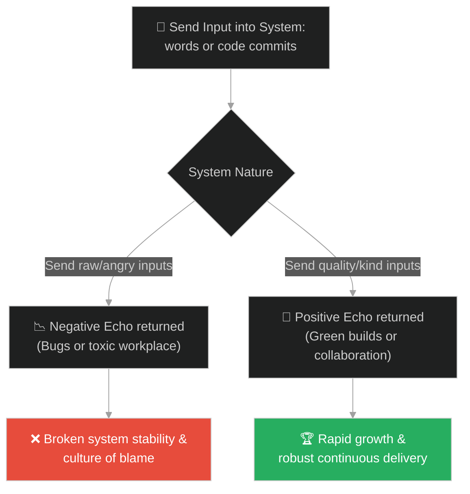
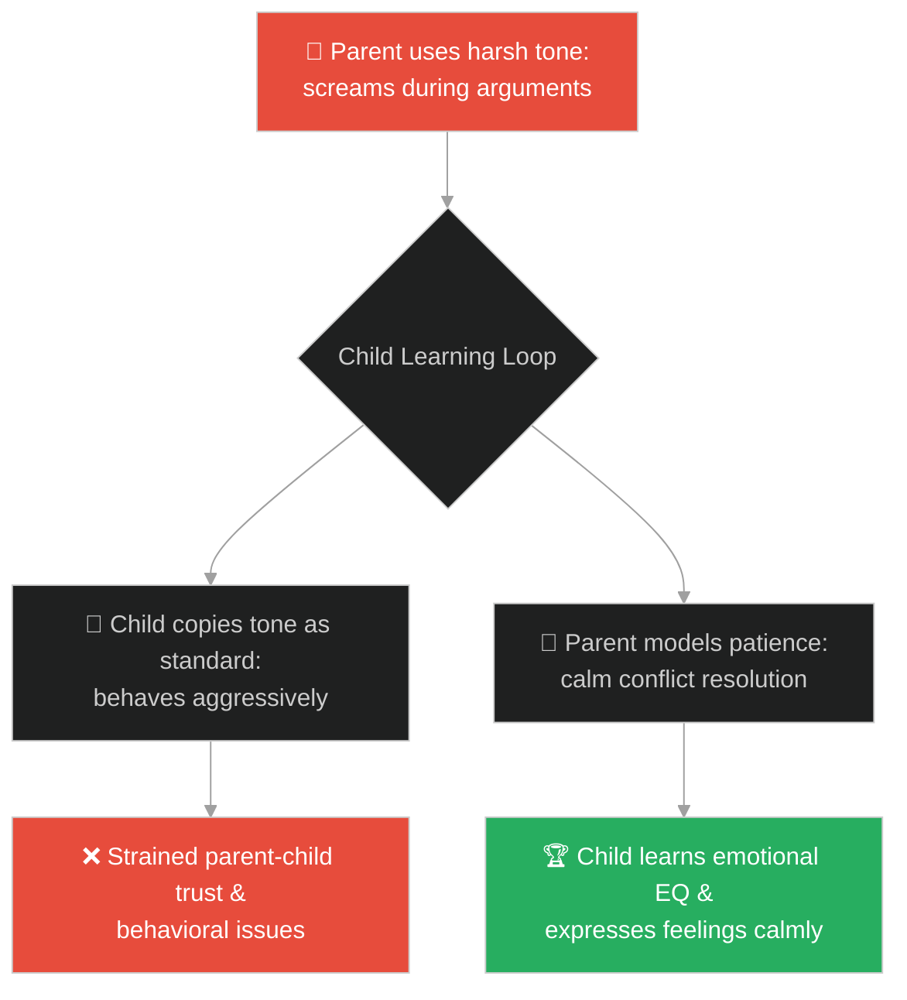
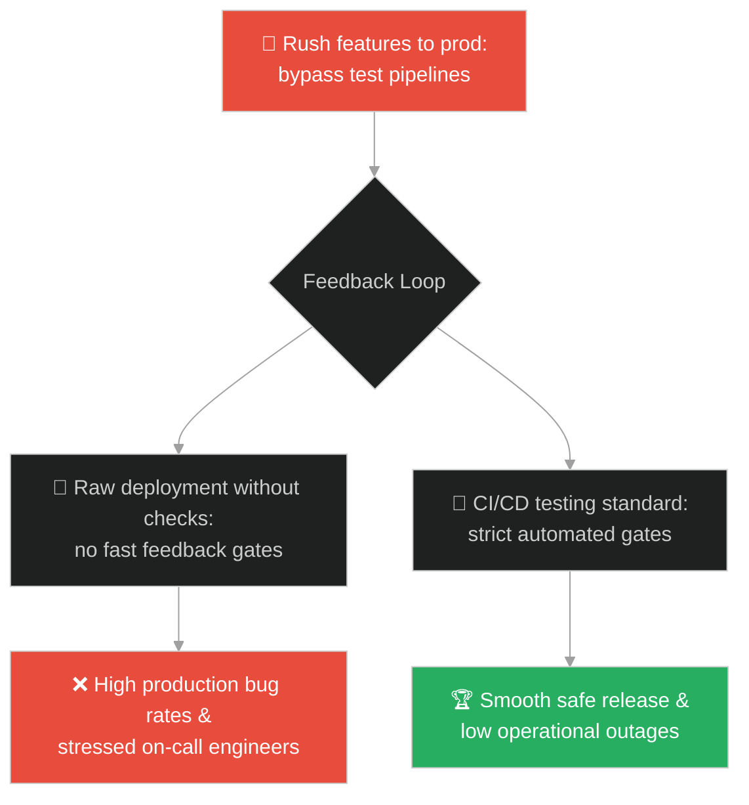
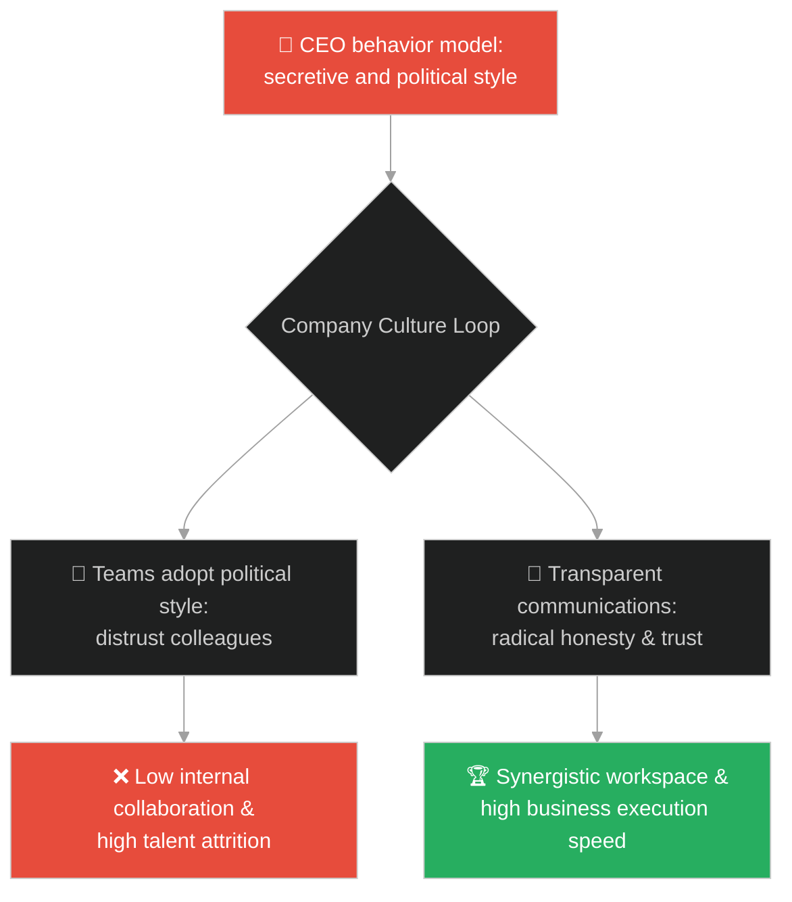
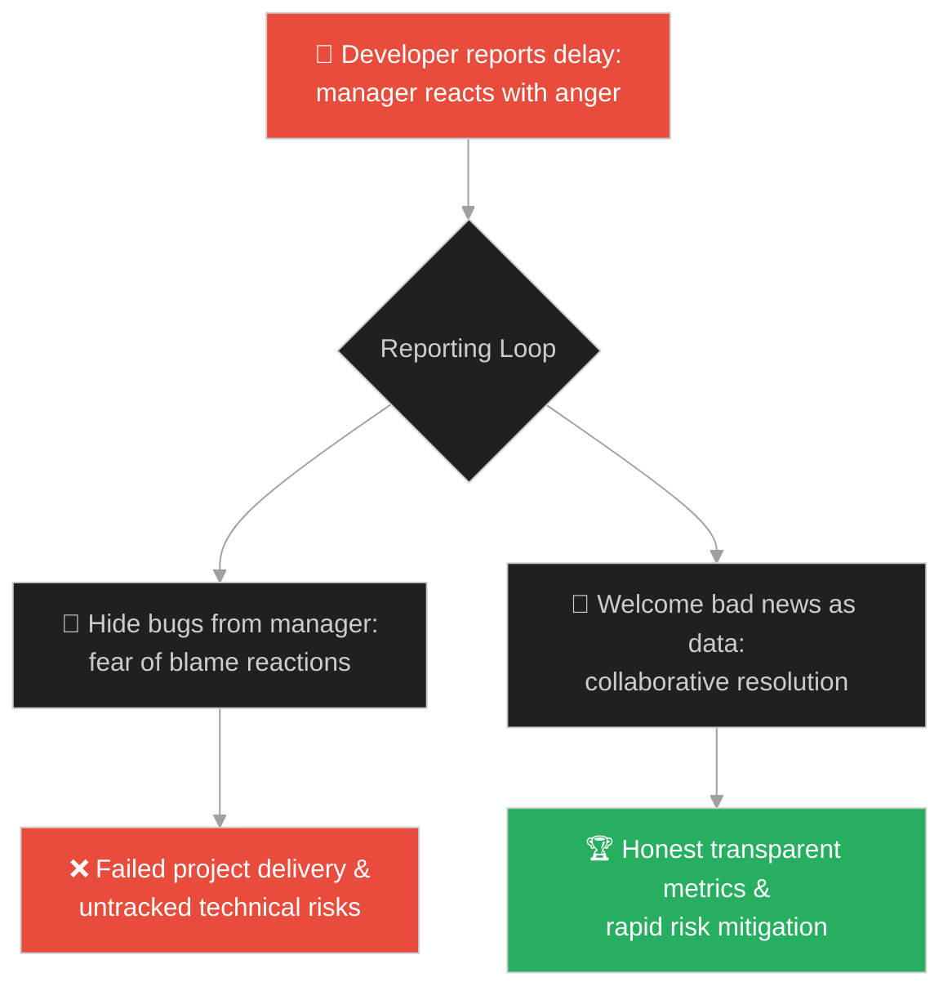
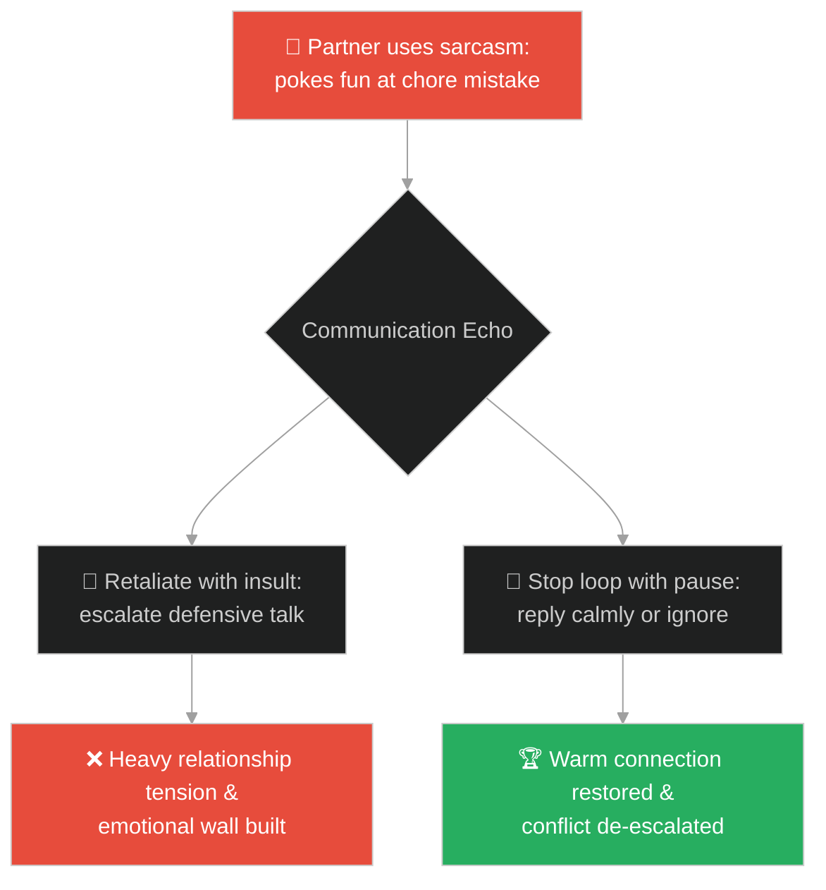
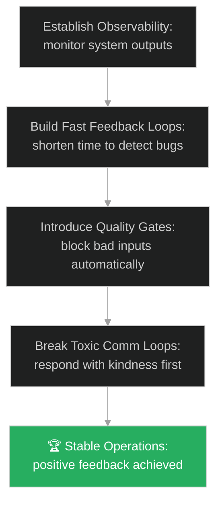

# System Feedback Loops (រង្វិលជុំមតិត្រឡប់នៃប្រព័ន្ធ)៖ ក្មេងប្រុស និងសំឡេងជ្វាក់ក្នុងភ្នំ (System Feedback Loops & The Boy and the Mountain Echo)

**Author:** ichamrong  
**Date:** 2026-05-28  
**Tags:** #buddhism #feedback-loops #cicd #system-design #causality #communication #karma  
**Category:** Concepts / Parables  
**Read Time:** ~15 min  

---

## 📌 មាតិកា (Table of Contents)
- [អន្ទាក់ផ្លូវចិត្ត (The Trap)](#0)
- [១. រឿងព្រេងប្រវត្តិសាស្ត្រ៖ ក្មេងប្រុស និងសំឡេងជ្វាក់ក្នុងភ្នំ (The Legend of the Boy and the Mountain Echo)](#1)
  - [ការយល់ច្រឡំថាភ្នំស្អប់ខ្លួន (The Illusion of the Angry Mountain)](#1-1)
- [២. បញ្ហា៖ កង្វះមតិត្រឡប់ និងរង្វិលជុំពុលក្នុងប្រព័ន្ធបច្ចេកវិទ្យា (The Issue: Lack of Feedback Loops and Toxic System Loops)](#2)
- [៣. ឧទាហមណ៍ជាក់ស្តែងក្នុងពិភពពិត (Real World Examples)](#3)
  - [ឧទាហរណ៍ទី ១ — កម្រិតស្រាល (គ្រួសារ)៖ អាកប្បកិរិយារបស់ឪពុកម្តាយឆ្លុះបញ្ចាំងលើកូន (Parent's Anger Echoing in Child's Behavior)](#3-1)
  - [ឧទាហរណ៍ទី ២ — កម្រិតមធ្យម (បច្ចេកទេស)៖ ផលិតភាពកូដឆ្លុះបញ្ចាំងពីការវិនិយោគ CI/CD (Production Bugs Echoing Poor Automated Tests)](#3-2)
  - [ឧទាហរណ៍ទី ៣ — កម្រិតមធ្យម (ធុរកិច្ច)៖ វប្បធម៌ក្រុមហ៊ុនឆ្លុះបញ្ចាំងពីអាកប្បកិរិយាដឹកនាំ (Company Culture Echoing Executive Behaviors)](#3-3)
  - [ឧទាហរណ៍ទី ៤ — កម្រិតមធ្យម (សង្គម/គ្រប់គ្រង)៖ ភាពស្មោះត្រង់របស់ក្រុមការងារឆ្លុះបញ្ចាំងពីប្រធាន (Team Transparency Echoing Manager's Openness)](#3-4)
  - [ឧទាហរណ៍ទី ៥ — កម្រិតធ្ងន់ (ទំនាក់ទំនង)៖ ការប្រើសម្តីឌឺដងឆ្លុះបញ្ចាំងទៅមក (Sarcastic Comments Escalating Retorts in Couples)](#3-5)
- [៤. ដំណោះស្រាយទូទៅ៖ ការរចនារង្វិលជុំមតិត្រឡប់វិជ្ជមាន (The General Solution: Implementing Positive Feedback Loops and CI/CD Quality Gates)](#4)
- [សេចក្តីសន្និដ្ឋាន (Conclusion)](#5)
- [ឯកសារយោង (References)](#6)
- [Related Posts](#7)

---

<a id="0"></a>
## អន្ទាក់ផ្លូវចិត្ត (The Trap)

តើអ្នកធ្លាប់ឆ្ងល់ទេថា ហេតុអ្វីបានជាក្រុមការងាររបស់អ្នកឧស្សាហ៍ជួបបញ្ហាកូដខូច (Production Bug) ឬហេតុអ្វីបានជាទំនាក់ទំនងក្នុងក្រុមពោរពេញដោយភាពរកាំរកូស ទោះបីជាអ្នកព្យាយាមដោះស្រាយវាយ៉ាងណាក៏ដោយ?

នៅក្នុងប្រព័ន្ធបច្ចេកវិទ្យា និងទំនាក់ទំនង៖
* **យើងងាយនឹងធ្លាក់ក្នុងអន្ទាក់** នៃការបន្ទោសកត្តាខាងក្រៅ (ដូចជា «ប្រព័ន្ធនេះអន់ណាស់» ឬ «មនុស្សជុំវិញខ្លួនខ្ញុំសុទ្ធតែពុល») ដោយមិនបានដឹងថាស្ថានភាពដែលយើងកំពុងជួបប្រទះ គឺជាការឆ្លុះបញ្ចាំងដោយផ្ទាល់ពីអ្វីដែលយើងបានបញ្ចូលទៅក្នុងប្រព័ន្ធជាមុនសិន។
* **យើងមើលរំលង** គោលការណ៍មតិត្រឡប់ (Feedback Loops) ដែលជាច្បាប់ធម្មជាតិមួយ៖ «រាល់ធាតុចូលដែលគ្មានគុណភាព ឬពោរពេញដោយកំហឹង នឹងត្រលប់មករកយើងវិញក្នុងទម្រង់ដូចគ្នាដោយគ្មានការខុសគ្នាឡើយ»។

ការបន្ទោសប្រព័ន្ធដោយមិនកែសម្រួលធាតុចូលរបស់ខ្លួន ហៅថា **អន្ទាក់សំឡេងជ្វាក់ឆ្លុះបញ្ចាំង (The Echo Trap)**។

ដើម្បីយល់ដឹងពីរបៀបកែសម្រួលរង្វិលជុំមតិត្រឡប់ នេះជាផែនទីបង្ហាញផ្លូវ៖
1. **រឿងព្រេងនិទាន (The Legend)** — រឿងរ៉ាវរបស់ក្មេងប្រុសម្នាក់ដែលស្រែកដាក់ភ្នំ ហើយខឹងនឹងភ្នំដែលស្រែកតបមកវិញនូវពាក្យអាក្រក់ រហូតដល់ម្តាយបង្រៀនឱ្យស្រែកពាក្យល្អ។
2. **បញ្ហា (The Issue)** — ការវិភាគរង្វិលជុំមតិត្រឡប់ក្នុងវិស្វកម្មកម្មវិធី (CI/CD, Monitoring) និងការប្រាស្រ័យទាក់ទង។
3. **ឧទាហមណ៍ជាក់ស្តែងក្នុងពិភពពិត (Real World Examples)** — ពិនិត្យមើលបញ្ហានេះក្នុងកម្រិតគ្រួសារ បច្ចេកវិទ្យា ធុរកិច្ច ការគ្រប់គ្រង និងទំនាក់ទំនង។
4. **ដំណោះស្រាយទូទៅ (The General Solution)** — ការបង្កើតប្រព័ន្ធត្រួតពិនិត្យ និងរង្វិលជុំត្រឡប់ប្រកបដោយគុណភាព (Fast Feedback Loops)។



---

<a id="1"></a>
## ១. រឿងព្រេងប្រវត្តិសាស្ត្រ៖ ក្មេងប្រុស និងសំឡេងជ្វាក់ក្នុងភ្នំ (The Legend of the Boy and the Mountain Echo)

ថ្ងៃមួយ មានក្មេងប្រុសម្នាក់បានដើរលេងជាមួយម្តាយរបស់គេនៅក្នុងជ្រលងភ្នំដ៏ធំមួយ។ ពេលកំពុងដើរលេង ក្មេងប្រុសបានជំពប់ជើងដួលលើដុំថ្ម រួចស្រែកឡើងដោយការឈឺចាប់ថា៖
* *«អូយ!»*

ភ្លាមៗនោះ ស្រាប់តែមានសំឡេងមួយបន្លឺឡើងពីក្នុងជ្រលងភ្នំត្រលប់មកវិញយ៉ាងច្បាស់ថា៖
* *«អូយ!»*

ក្មេងប្រុសមានការងឿងឆ្ងល់យ៉ាងខ្លាំង។ គេបានស្រែកសួរទៅកាន់ភ្នំថា៖
* *«តើឯងជានរណា?»*

សំឡេងនោះក៏ឆ្លើយតបមកវិញភ្លាមថា៖
* *«តើឯងជានរណា?»*

---

<a id="1-1"></a>
### ការយល់ច្រឡំថាភ្នំស្អប់ខ្លួន (The Illusion of the Angry Mountain)

ក្មេងប្រុសចាប់ផ្តើមខឹងយ៉ាងខ្លាំង ព្រោះគិតថាមាននរណាម្នាក់កំពុងឌឺដងសើចចំអកឱ្យខ្លួន។ គេបានស្រែកជេរទៅវិញថា៖
* *«អាមនុស្សកំសាក!»*

ភ្នំក៏ស្រែកតបមកវិញដោយពាក្យដដែលនោះថា៖
* *«អាមនុស្សកំសាក!»*

ក្មេងប្រុសយំហើយបែរទៅសួរម្តាយថា៖ *«ម៉ាក់! ហេតុអ្វីបានជាមនុស្សនៅក្នុងភ្នំនោះអាក្រក់ និងស្អប់កូនម្ល៉េះ?»*
ម្តាយញញឹមរួចប្រាប់កូនថា៖ *«កូនអើយ! ចូរស្ដាប់ឱ្យល្អណា»*។ បន្ទាប់មក ម្តាយបានស្រែកទៅកាន់ជ្រលងភ្នំថា៖
* *«ខ្ញុំស្រលាញ់អ្នក!»*

ភ្នំក៏ស្រែកតបមកវិញយ៉ាងស្រទន់ថា៖
* *«ខ្ញុំស្រលាញ់អ្នក!»*

ម្តាយបានពន្យល់កូនថា៖
> «កូនអើយ! មនុស្សជុំវិញខ្លួន និងជីវិតនេះគឺប្រៀបដូចជាសំឡេងជ្វាក់ក្នុងភ្នំអញ្ចឹង។ អ្វីដែលកូនបានផ្តល់ទៅឱ្យពួកគេ គឺជាអ្វីដែលពួកគេនឹងឆ្លុះបញ្ចាំងត្រលប់មករកកូនវិញ។ បើកូនស្រែកដាក់គេដោយកំហឹង គេនឹងតបមកវិញដោយកំហឹង។ តែបើកូនផ្តល់ក្តីស្រលាញ់ ពួកគេនឹងផ្តល់ក្តីស្រលាញ់មកវិញដូចគ្នា។»

---

<a id="2"></a>
## ២. បញ្ហា៖ កង្វះមតិត្រឡប់ និងរង្វិលជុំពុលក្នុងប្រព័ន្ធបច្ចេកវិទ្យា (The Issue: Lack of Feedback Loops and Toxic System Loops)

នៅក្នុងវិស្វកម្មសូហ្វវែរ ប្រព័ន្ធដែលខ្វះរង្វិលជុំមតិត្រឡប់រហ័ស (Fast Feedback Loops) គឺងាយនឹងធ្លាក់ក្នុងភាពចលាចល។ ប្រសិនបើក្រុមការងារគ្មានប្រព័ន្ធ CI/CD ឬ Automated Tests ទេនោះ វិស្វករនឹងដឹងពីកំហុសកូដលុះត្រាតែប្រព័ន្ធដួលរលំនៅក្នុង Production (រង្វិលជុំយឺតយ៉ាវខ្លាំង)។

នេះជាកូដដែលខ្វះប្រព័ន្ធត្រួតពិនិត្យមតិត្រឡប់៖

```java
// ឧទាហរណ៍នៃការបញ្ជូនធាតុចូលទៅក្នុងប្រព័ន្ធដោយគ្មាន Quality Gate
public class DevelopmentPipeline {
    public void deployToProduction(String codeChanges) {
        // អន្ទាក់៖ បញ្ជូនកូដទៅ Production ដោយគ្មានការធ្វើតេស្ត
        System.out.println("Code deployed to prod: " + codeChanges);
        // សំឡេងឆ្លុះត្រឡប់មកវិញគឺ Production Outage ក្រោយពេលអ្នកប្រើជួប bug
    }
}

// ដំណោះស្រាយ៖ ការបង្កើត CI/CD Quality Gate (Fast Feedback Loop)
public class ResilientPipeline {
    public boolean deployWithFeedback(String codeChanges) {
        System.out.println("Running automated tests...");
        boolean testPassed = runUnitTests(codeChanges);
        if (testPassed) {
            System.out.println("Deploying cleanly. Happy feedback received.");
            return true;
        } else {
            System.out.println("Blocked! Failure feedback generated immediately. Developer notified.");
            return false;
        }
    }
    
    private boolean runUnitTests(String code) {
        return !code.contains("bug"); // Simple check
    }
}
```

* **ការកើនឡើងនៃថ្លៃជួសជុល (High Cost of Fixes)៖** Bug ដែលរកឃើញនៅក្នុង Production ត្រូវចំណាយពេល និងថវិកាជួសជុលច្រើនជាងការរកឃើញនៅក្នុងដំណាក់កាលសរសេរកូដដល់ទៅ ១០០ដង។
* **ភាពតានតឹងក្នុងក្រុម (Blame Culture)៖** នៅពេលគ្មានរង្វិលជុំត្រួតពិនិត្យដោយស្វ័យប្រវត្តិ សមាជិកក្នុងក្រុមចាប់ផ្តើមស្តីបន្ទោសគ្នាទៅវិញទៅមកនៅពេលមានបញ្ហា។

---

<a id="3"></a>
## ៣. ឧទាហមណ៍ជាក់ស្តែងក្នុងពិភពពិត

---

<a id="3-1"></a>
### ឧទាហរណ៍ទី ១ — កម្រិតស្រាល (គ្រួសារ)៖ អាកប្បកិរិយារបស់ឪពុកម្តាយឆ្លុះបញ្ចាំងលើកូន (Parent's Anger Echoing in Child's Behavior)

ឪពុកម្នាក់តែងតែនិយាយខ្លាំងៗ និងប្រើពាក្យគំរោះគំរើយនៅពេលខឹង។ ក្រោយមក គាត់សង្កេតឃើញកូនប្រុសតូចរបស់គាត់ស្រែកខ្លាំងៗ និងគប់របស់របរលេងដាក់មិត្តភក្តិ។ គាត់មានការខឹងសម្បារ និងវាយកូន។ តាមពិតទៅ អាកប្បកិរិយារបស់កូនគឺគ្រាន់តែជាសំឡេងជ្វាក់ឆ្លុះបញ្ចាំងពីទម្លាប់របស់គាត់ប៉ុណ្ណោះ។



---

<a id="3-2"></a>
### ឧទាហរណ៍ទី ២ — កម្រិតមធ្យម (បច្ចេកទេស)៖ ផលិតភាពកូដឆ្លុះបញ្ចាំងពីការវិនិយោគ CI/CD (Production Bugs Echoing Poor Automated Tests)

ក្រុមហ៊ុនមួយចង់ជម្រុញការបញ្ចេញមុខងារថ្មីឱ្យបានលឿន ទើបពួកគេសម្រេចចិត្តរំលងការសរសេរ Automated Tests។ ធាតុចូលដែលគ្មានគុណភាពនេះ ឆ្លុះបញ្ចាំងត្រលប់មកវិញនូវរាល់ outages ជារៀងរាល់សប្តាហ៍ ធ្វើឱ្យវិស្វករត្រូវចំណាយពេលយប់ជួសជុលកូដ និងពន្យារពេលបញ្ចេញផលិតផលថ្មីកាន់តែយូរ។



---

<a id="3-3"></a>
### ឧទាហរណ៍ទី ៣ — កម្រិតមធ្យម (ធុរកិច្ច)៖ វប្បធម៌ក្រុមហ៊ុនឆ្លុះបញ្ចាំងពីអាកប្បកិរិយាដឹកនាំ (Company Culture Echoing Executive Behaviors)

នាយកប្រតិបត្តិម្នាក់ចូលចិត្តការសម្ងាត់ និងតែងតែនិយាយដើមពីសហសេវិកដទៃទៀតនៅពីក្រោយខ្នង។ មិនយូរប៉ុន្មាន វប្បធម៌ការងារក្នុងក្រុមហ៊ុនទាំងមូលប្រែជាពោរពេញដោយការចាក់រុក បក្សពួក និងការសង្ស័យគ្នា។ វប្បធម៌ពុលនេះគឺជាការឆ្លុះបញ្ចាំងដោយផ្ទាល់ពីធាតុចូលដែលនាយកប្រតិបត្តិបានបង្កើត។



---

<a id="3-4"></a>
### ឧទាហរណ៍ទី ៤ — កម្រិតមធ្យម (សង្គម/គ្រប់គ្រង)៖ ភាពស្មោះត្រង់របស់ក្រុមការងារឆ្លុះបញ្ចាំងពីប្រធាន (Team Transparency Echoing Manager's Openness)

ប្រធានក្រុមការងារម្នាក់តែងតែខឹង និងស្តីបន្ទោសយ៉ាងធ្ងន់ធ្ងរនៅពេលសមាជិកក្រុមរាយការណ៍ពីបញ្ហា ឬភាពយឺតយ៉ាវ។ ជាលទ្ធផល សមាជិកក្រុមចាប់ផ្តើមលាក់បាំងកំហុស និងកុហកពីស្ថានភាពការងាររហូតដល់ថ្ងៃចុងក្រោយ។ ប្រធានក្រុមទទួលបានមតិឆ្លុះបញ្ចាំងជាការកុហក ព្រោះគាត់មិនព្រមទទួលយកការពិត។



---

<a id="3-5"></a>
### ឧទាហរណ៍ទី ៥ — កម្រិតធ្ងន់ (ទំនាក់ទំនង)៖ ការប្រើសម្តីឌឺដងឆ្លុះបញ្ចាំងទៅមក (Sarcastic Comments Escalating Retorts in Couples)

នៅក្នុងការសន្ទនាប្រចាំថ្ងៃ ប្តីនិយាយឌឺដងមួយឃ្លាដាក់ប្រពន្ធ។ ប្រពន្ធខឹងក៏តបវិញដោយសម្តីអាក្រក់ពីរឃ្លា។ ប្តីខឹងកាន់តែខ្លាំងស្រែកជេរ។ ការឆ្លុះបញ្ចាំងទៅវិញទៅមកនៃថាមពលអវិជ្ជមាននេះបង្កើតជាជម្លោះក្តៅគគុក ទាំងដែលចំណុចចាប់ផ្តើមគ្រាន់តែជាការនិយាយលេងសើចគ្មានការពិចារណាតែប៉ុណ្ណោះ។



---

<a id="4"></a>
## ៤. ដំណោះស្រាយទូទៅ៖ ការរចនារង្វិលជុំមតិត្រឡប់វិជ្ជមាន (The General Solution: Implementing Positive Feedback Loops and CI/CD Quality Gates)

ដើម្បីបង្កើតប្រព័ន្ធដែលមានភាពឆ្លាតវៃ និងបញ្ចៀសរង្វិលជុំអវិជ្ជមាន ចូរអនុវត្តយន្តការដូចខាងក្រោម៖



* **ការបង្កើនលទ្ធភាពសង្កេត (Observability & Monitoring)៖** បង្កើតប្រព័ន្ធ Alerts និង Logging ដើម្បីទទួលបានព័ត៌មានពីស្ថានភាពប្រព័ន្ធភ្លាមៗ (Real-time Feedback) មុនពេលអតិថិជនជួបបញ្ហា។
* **ការបង្កើត Quality Gates ក្នុងទំនាក់ទំនង និងការងារ៖**
  1. **ស្វ័យប្រវត្តិកម្មនៃការត្រួតពិនិត្យ**៖ រាល់ការ commit កូដ ត្រូវតែរត់កាត់ Static Analysis (SonarQube) និង unit tests ជាមុនសិន។
  2. **ផ្អាកមុននឹងឆ្លុះបញ្ចាំង**៖ នៅពេលទទួលបានព័ត៌មានអវិជ្ជមាន ឬពាក្យខឹងសម្បារ ចូរផ្អាករយៈពេល ៣ វិនាទី ដើម្បីបង្អាក់រង្វិលជុំអវិជ្ជមាន និងឆ្លើយតបដោយភាពស្ងប់ស្ងាត់។

---

## 🐇 ធ្លាក់ចូលក្នុងរន្ធទន្សាយ (Enter the Rabbit Hole)

ដើម្បីស្វែងយល់កាន់តែស៊ីជម្រៅអំពីរបៀបដែលបំណុលបច្ចេកវិទ្យា និងកំហុសឆ្គងដែលមិនព្រមដោះលែង នឹងក្លាយជាថ្មដ៏ធ្ងន់ដែលសង្កត់លើស្មាប្រព័ន្ធ និងសមាជិកក្រុមការងារ សូមចាប់ផ្តើមដំណើររុករករបស់អ្នកដោយចុចលើតំណភ្ជាប់ខាងក្រោម៖

* 🚀 **[ចាប់ផ្តើមដំណើររុករក (Start the Journey) ➔ បំណុលបច្ចេកវិទ្យា និងការបោះចោលកូដដែលលែងប្រើ (Technical Debt & Dead Code Elimination)](./134-buddha-and-the-heavy-rock.md)**

---

<a id="5"></a>
## សេចក្តីសន្និដ្ឋាន (Conclusion)

> **«ជីវិត និងប្រព័ន្ធបច្ចេកវិទ្យា មិនមែនបង្កើតបញ្ហាដាក់យើងដោយឯកឯងនោះទេ ពួកវាគ្រាន់តែជាកញ្ចក់ឆ្លុះបញ្ចាំងពីអ្វីដែលយើងបានវិនិយោគទៅលើពួកវាប៉ុណ្ណោះ។»**

រាល់បញ្ហាដែលយើងជួបប្រទះ គឺជាទិន្នន័យដ៏មានតម្លៃ (Data Input) ដែលប្រាប់យើងថា «មានអ្វីមួយខុសឆ្គងនៅក្នុងធាតុចូលរបស់យើង»។ ជំនួសឱ្យការខឹង និងបន្ទោសសំឡេងជ្វាក់ដែលឆ្លុះបញ្ចាំងមកវិញ ចូរចាប់ផ្តើមផ្លាស់ប្តូរធាតុចូលរបស់ខ្លួនដោយការបញ្ជូនកូដដែលមានគុណភាព ការនិយាយពាក្យល្អៗ និងការកសាងទំនាក់ទំនងប្រកបដោយការដឹងគុណ។

---

<a id="6"></a>
## ឯកសារយោង (References)

* **Samyutta Nikaya (SN 12.21)** — Buddhist texts detailing the law of dependent origination (Paticcasamuppada) and causality loops in human behavior.
* **Jez Humble & David Farley** — *Continuous Delivery: Reliable Software Releases through Build, Test, and Deployment Automation* (2010). Focus on fast feedback loops in engineering pipeline configurations.
* **Donella H. Meadows** — *Thinking in Systems: A Primer* (2008). Comprehensive analysis of stabilizing and reinforcing feedback loops.

---

<a id="7"></a>
## Related Posts

* [The Two Monks and the Woman](./126-buddha-and-the-two-monks.md) — Releasing carrying costs and breaking feedback rumination loops.
* [The Three Gates of Speech](./129-buddha-and-the-three-gates-of-speech.md) — Implementing speech filters as quality gates before releasing words into the system.
