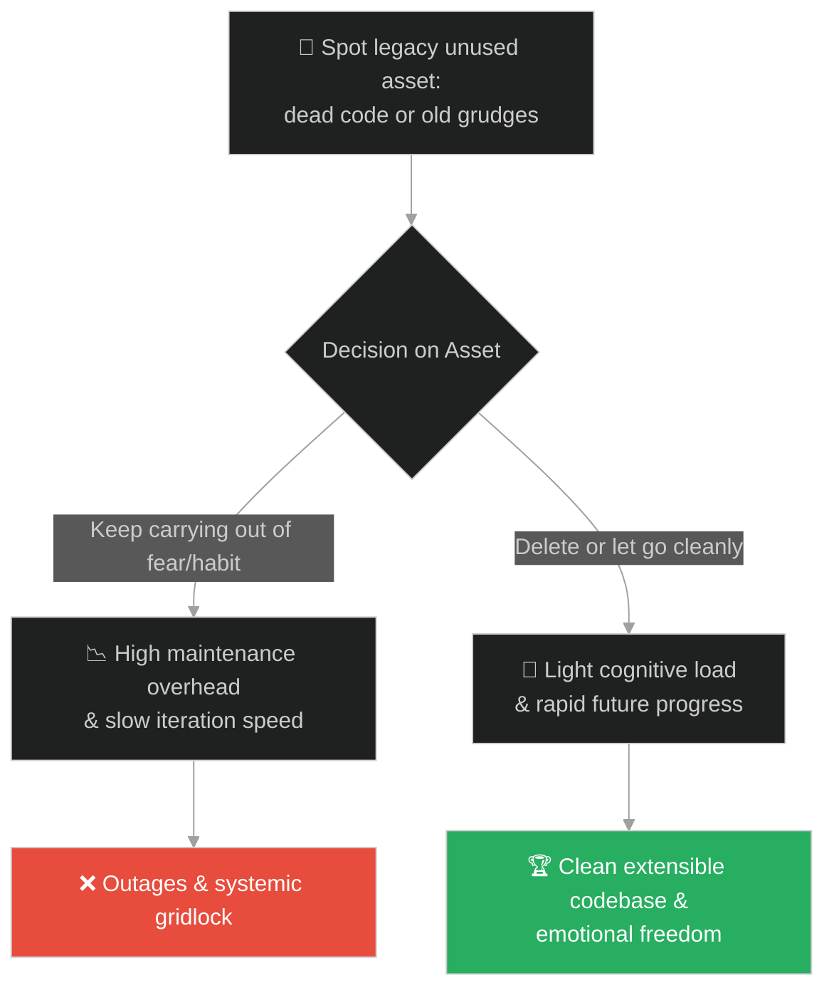
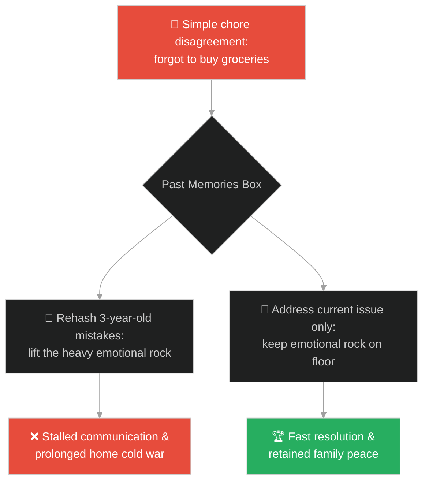
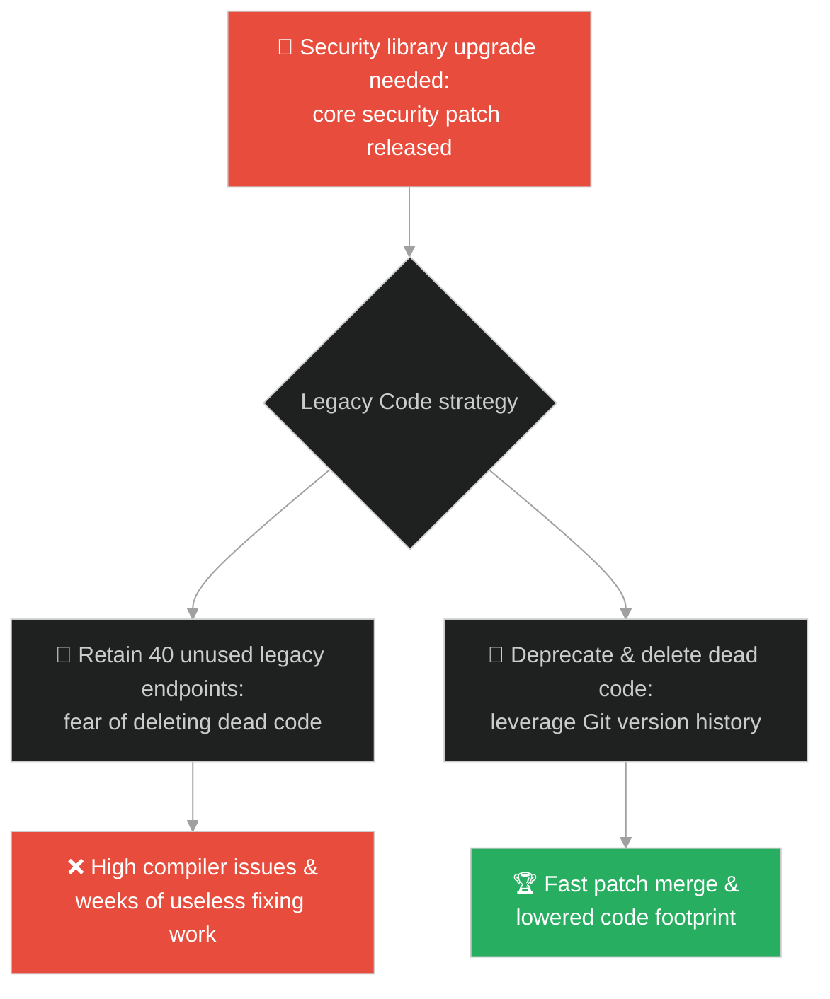
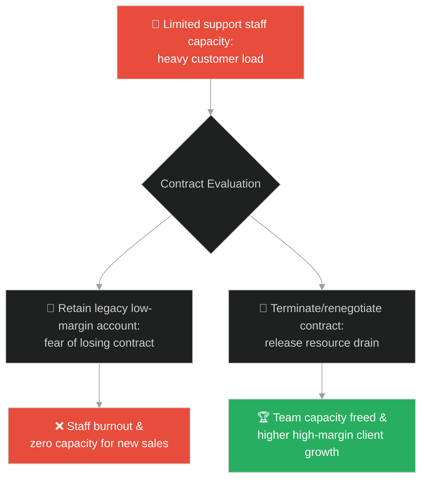
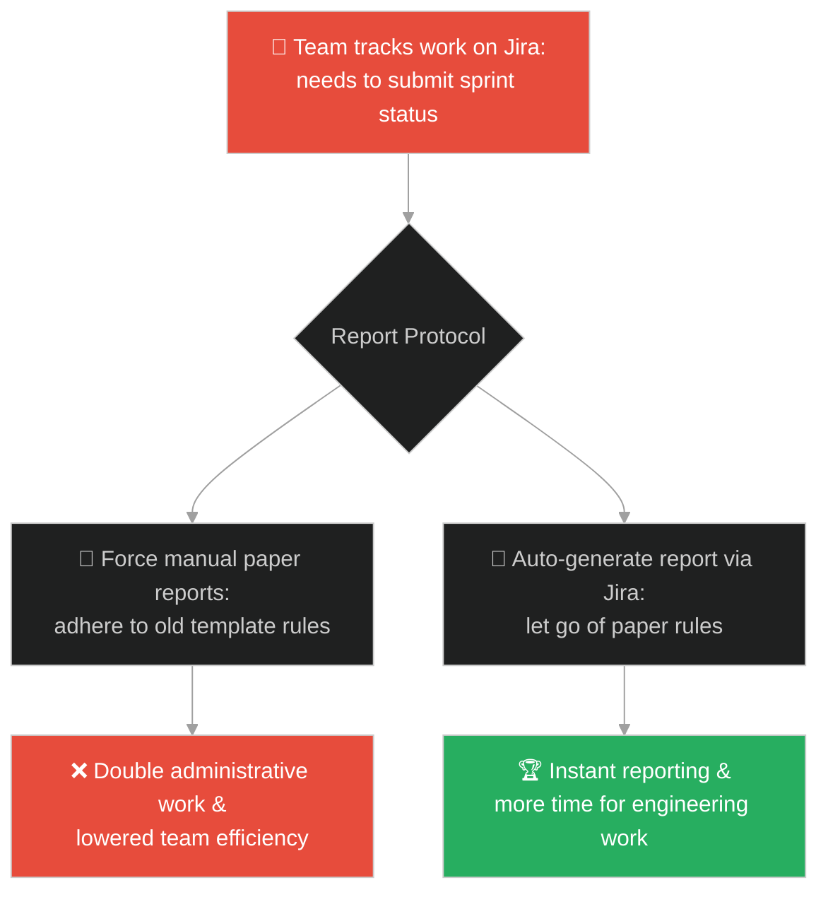
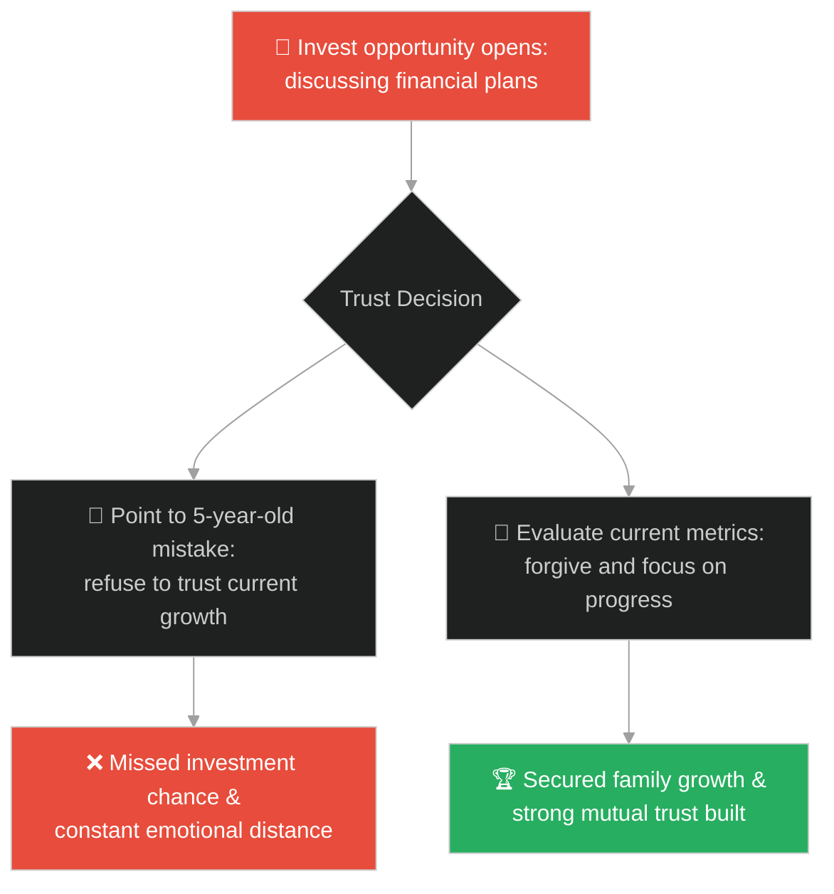
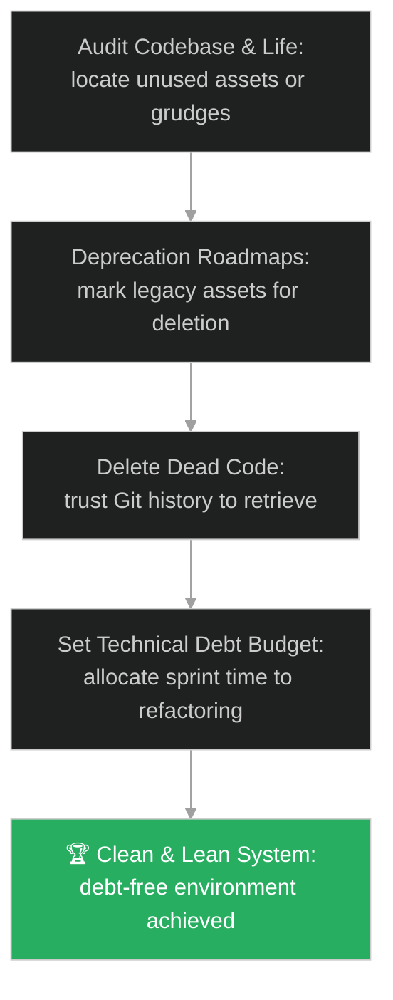

# Technical Debt & Dead Code Elimination (បំណុលបច្ចេកវិទ្យា និងការលុបកូដលែងប្រើ)៖ ថ្មដ៏ធ្ងន់ (Technical Debt & Dead Code Elimination & The Heavy Rock)

**Author:** ichamrong  
**Date:** 2026-05-28  
**Tags:** #buddhism #technical-debt #refactoring #clean-code #cognitive-load #letting-go #dead-code  
**Category:** Concepts / Parables  
**Read Time:** ~15 min  

---

## 📌 មាតិកា (Table of Contents)
- [អន្ទាក់ផ្លូវចិត្ត (The Trap)](#0)
- [១. រឿងព្រេងប្រវត្តិសាស្ត្រ៖ ថ្មដ៏ធ្ងន់ (The Legend of the Heavy Rock)](#1)
  - [ទម្ងន់នៃវត្ថុស្ថិតលើការលើកកាន់ (The Weight of Holding Onto Things)](#1-1)
- [២. បញ្ហា៖ បំណុលបច្ចេកវិទ្យា និងការរក្សាទុកកូដដែលលែងប្រើ (The Issue: Technical Debt and Retaining Dead Code)](#2)
- [៣. ឧទាហមណ៍ជាក់ស្តែងក្នុងពិភពពិត (Real World Examples)](#3)
  - [ឧទាហរណ៍ទី ១ — កម្រិតស្រាល (គ្រួសារ)៖ ការចងចាំរឿងអាក់អន់ចិត្តចាស់ៗ (Carrying Past Family Grievances)](#3-1)
  - [ឧទាហរណ៍ទី ២ — កម្រិតមធ្យម (បច្ចេកទេស)៖ ការរក្សាទុកកូដចាស់ដែលលែងដំណើរការ (Maintaining Thousands of Lines of Unused Legacy Code)](#3-2)
  - [ឧទាហរណ៍ទី ៣ — កម្រិតមធ្យម (ធុរកិច្ច)៖ ការរក្សាកិច្ចសន្យាចាស់ៗដែលខាតបង់ (Carrying Low-Margin Legacy Client Contracts)](#3-3)
  - [ឧទាហរណ៍ទី ៤ — កម្រិតមធ្យម (សង្គម/គ្រប់គ្រង)៖ ការប្រើប្រាស់គំរូផែនការការងារចាស់គំរឹល (Holding Onto Outdated Project Templates)](#3-4)
  - [ឧទាហរណ៍ទី ៥ — កម្រិតធ្ងន់ (ទំនាក់ទំនង)៖ ការលើកឡើងឡើងវិញនូវកំហុសអតីតកាល (Bringing Up Repetitive Past Relationship Mistakes)](#3-5)
- [៤. ដំណោះស្រាយទូទៅ៖ ការលុបបំណុលបច្ចេកវិទ្យា និងការដោះលែងបន្ទុក (The General Solution: Proactive Code Refactoring and Burden Release Loops)](#4)
- [សេចក្តីសន្និដ្ឋាន (Conclusion)](#5)
- [ឯកសារយោង (References)](#6)
- [Related Posts](#7)

---

<a id="0"></a>
## អន្ទាក់ផ្លូវចិត្ត (The Trap)

តើអ្នកធ្លាប់ជួបស្ថានភាពដែលប្រព័ន្ធបច្ចេកវិទ្យាថ្មីយឺតយ៉ាវ ឬពិបាកបន្ថែមមុខងារថ្មីៗ ព្រោះកូដពោរពេញទៅដោយមុខងារចាស់ៗដែលលែងប្រើ តែគ្មានវិស្វករណាម្នាក់ហ៊ានលុបចោល ព្រោះខ្លាចប៉ះពាល់ដល់ផ្នែកផ្សេងទៀតដែរឬទេ?

នៅក្នុងការអភិវឌ្ឍប្រព័ន្ធ និងការរស់នៅ៖
* **យើងងាយនឹងធ្លាក់ក្នុងអន្ទាក់** នៃការប្រមូលផ្តុំ និងរក្សាទុកវត្ថុដែលលែងមានប្រយោជន៍ (ដូចជា កូដចាស់ៗ ឯកសារចាស់ ឬអារម្មណ៍អាក់អន់ចិត្តពីអតីតកាល) ដោយសារតែការភ័យខ្លាច ឬការយល់ច្រឡំថា «ការរក្សាវាទុកមានសុវត្ថិភាពជាងការបោះចោល»។
* **យើងមើលរំលង** ថាបន្ទុកការងារ និងការគិត (Cognitive Overhead) ដែលយើងត្រូវចំណាយដើម្បីថែទាំ ឬរងចាំវត្ថុទាំងនោះ គឺជាច្រវាក់ដែលចងជើងយើងមិនឱ្យដើរទៅមុខបានលឿន។

ការស្ពាយយកបំណុលចាស់ៗដែលលែងប្រើ និងបង្កភាពស្មុគស្មាញដល់ជីវិត និងប្រព័ន្ធ ហៅថា **អន្ទាក់ថ្មធ្ងន់ (The Heavy Rock Trap)**។

ដើម្បីយល់ដឹងពីរបៀបលុបបំបាត់បំណុលទាំងនេះ នេះជាផែនទីបង្ហាញផ្លូវ៖
1. **រឿងព្រេងនិទាន (The Legend)** — រឿងរ៉ាវរបស់ព្រះពុទ្ធដែលដាស់តឿនសិស្សអំពីទម្ងន់របស់ថ្មធំមួយ ដែលវានឹងធ្ងន់តែនៅពេលយើងលើកវាមកដាក់លើស្មាប៉ុណ្ណោះ។
2. **បញ្ហា (The Issue)** — ការវិភាគបំណុលបច្ចេកវិទ្យា (Technical Debt) និង Cognitive Load ក្នុងការអភិវឌ្ឍសូហ្វវែរ។
3. **ឧទាហមណ៍ជាក់ស្តែងក្នុងពិភពពិត (Real World Examples)** — ពិនិត្យមើលបញ្ហានេះក្នុងកម្រិតគ្រួសារ បច្ចេកវិទ្យា ធុរកិច្ច ការគ្រប់គ្រង និងទំនាក់ទំនង។
4. **ដំណោះស្រាយទូទៅ (The General Solution)** — ការអនុវត្ត Refactoring វដ្តជីវិតកូដ និងការបោះចោលកូដដែលលែងប្រើ (Dead Code Elimination)។



---

<a id="1"></a>
## ១. រឿងព្រេងប្រវត្តិសាស្ត្រ៖ ថ្មដ៏ធ្ងន់ (The Legend of the Heavy Rock)

ថ្ងៃមួយ ព្រះសម្មាសម្ពុទ្ធទ្រង់បានយាងកាត់ព្រៃមួយជាមួយភិក្ខុទាំងឡាយ។ ព្រះអង្គទ្រង់បានទតឃើញដុំថ្មដ៏ធំមួយដែលដេកនៅក្បែរផ្លូវ។ ព្រះពុទ្ធទ្រង់បានឈប់ រួចទ្រង់ត្រាស់សួរទៅកាន់ភិក្ខុទាំងឡាយថា៖
> «ភិក្ខុទាំងឡាយ! តើដុំថ្មដ៏ធំនេះធ្ងន់ដែរឬទេ?»

ភិក្ខុទាំងឡាយបានមើលដុំថ្មនោះ រួចឆ្លើយតបព្រមគ្នាថា៖
* *«បពិត្រព្រះអង្គដ៏ចម្រើន! ពិតជាធ្ងន់ណាស់ ថ្មធំបែបនេះ គ្មាននរណាម្នាក់អាចលើកវាដោយងាយបានឡើយ។»*

ព្រះសម្មាសម្ពុទ្ធទ្រង់បានញញឹម រួចមានសង្ឃដីកាដាស់តឿនយ៉ាងជ្រាលជ្រៅថា៖
> «ភិក្ខុទាំងឡាយ! ថ្មនេះវានឹងមិនធ្ងន់សម្រាប់អ្នកឡើយ ប្រសិនបើអ្នក **មិនព្រមលើកវាមកស្ពាយលើស្មា** នោះ។ វានឹងធ្ងន់លុះត្រាតែអ្នកចង់លើកវាឡើងមកប៉ុណ្ណោះ។ បើអ្នកទុកវាចោលនៅលើដីដដែល វានឹងគ្មានទម្ងន់អ្វីសម្រាប់ជីវិតរបស់អ្នកឡើយ។»

---

<a id="1-1"></a>
### ទម្ងន់នៃវត្ថុស្ថិតលើការលើកកាន់ (The Weight of Holding Onto Things)

ព្រះពុទ្ធទ្រង់បានបន្តពន្យល់ថា៖
> «ចិត្តរបស់មនុស្សក៏ដូច្នោះដែរ។ រឿងរ៉ាវទុក្ខសោក ការឈឺចាប់ និងបំណុលផ្លូវចិត្តផ្សេងៗពីអតីតកាល គឺប្រៀបដូចជាដុំថ្មនេះឯង។ ដរាបណាអ្នកនៅតែចងចាំ លើកវាមកគិត ស្ពាយវារាល់ថ្ងៃ វានឹងធ្វើឱ្យអ្នកធ្ងន់ និងហត់នឿយជានិច្ច។ វិធីតែមួយគត់ដើម្បីលុបបំបាត់ទម្ងន់នេះ គឺការដោះលែង និងដាក់វាចុះនៅលើដីវិញ។»

នៅក្នុងការរៀបចំប្រព័ន្ធ កូដចាស់ៗ និងបំណុលបច្ចេកវិទ្យាក៏ជាថ្មធំមួយដែលយើងឧស្សាហ៍លើកមកស្ពាយដោយសារការភ័យខ្លាច។

---

<a id="2"></a>
## ២. បញ្ហា៖ បំណុលបច្ចេកវិទ្យា និងការរក្សាទុកកូដដែលលែងប្រើ (The Issue: Technical Debt and Retaining Dead Code)

នៅក្នុងវិស្វកម្មសូហ្វវែរ បញ្ហាដ៏ធំបំផុតមួយគឺការរក្សាទុកកូដដែលលែងប្រើ (Dead Code)។ វិស្វករខ្លះមិនហ៊ានលុប Function ឬ API Endpoint ចាស់ៗចោលឡើយ ទោះជាដឹងថាគ្មាននរណាប្រើប្រាស់វាក៏ដោយ ព្រោះខ្លាចថា «លុបទៅក្រែងលោវាខូចប្រព័ន្ធផ្សេង»។

នេះជាកូដដែលពោរពេញដោយបំណុលបច្ចេកវិទ្យា៖

```java
// ឧទាហរណ៍នៃការរក្សាទុកកូដលែងប្រើ (Dead Code) ដែលបង្កើនបន្ទុកគិត
public class LegacyBillingSystem {
    
    // Legacy calculation method from 2018 (Unused)
    public double calculateOldTax(double amount) {
        // វិស្វករមិនហ៊ានលុប តែត្រូវចំណាយពេលអានរាល់ពេល Refactor
        System.out.println("Warning: Legacy tax calculator executed.");
        return amount * 0.15;
    }
    
    // Current Active Method
    public double calculateCurrentTax(double amount) {
        return amount * 0.10;
    }
}

// ដំណោះស្រាយ៖ លុបកូដចាស់ចោលភ្លាមៗ (Dead Code Elimination)
public class CleanBillingSystem {
    // រក្សាតែអ្វីដែលប្រើប្រាស់ពិតប្រាកដ កូដចាស់អាចទាញយកពី Git History បើត្រូវការ
    public double calculateCurrentTax(double amount) {
        return amount * 0.10;
    }
}
```

* **ការកើនឡើងនៃ Cognitive Load៖** សមាជិកថ្មីត្រូវចំណាយពេលយល់ពីកូដរាប់ពាន់បន្ទាត់ដែលលែងដំណើរការ ធ្វើឱ្យការយល់ដឹងប្រព័ន្ធយឺតយ៉ាវ។
* **ភាពលំបាកក្នុងការធ្វើតេស្ត (Test Coverage Waste)៖** ក្រុមការងារត្រូវសរសេរ unit tests សម្រាប់កូដដែលគ្មានអ្នកប្រើប្រាស់ នាំឱ្យខាតបង់ពេលវេលា និងធនធានកុំព្យូទ័រ។

---

<a id="3"></a>
## ៣. ឧទាហមណ៍ជាក់ស្តែងក្នុងពិភពពិត

---

<a id="3-1"></a>
### ឧទាហរណ៍ទី ១ — កម្រិតស្រាល (គ្រួសារ)៖ ការចងចាំរឿងអាក់អន់ចិត្តចាស់ៗ (Carrying Past Family Grievances)

ប្តីប្រពន្ធតែងតែឈ្លោះប្រកែកគ្នាជារៀងរាល់សប្តាហ៍ ព្រោះតែរឿងរៀបចំផ្ទះមិនស្អាតកាលពី ៣ឆ្នាំមុន។ រាល់ពេលមានបញ្ហាបន្តិចបន្តួច រឿងចាស់នេះតែងតែត្រូវបានលើកមកនិយាយ (លើកដុំថ្មមកស្ពាយ) បង្កើតជាសម្ពាធផ្លូវចិត្ត និងមិនអាចដោះស្រាយបញ្ហាបច្ចុប្បន្នបានឡើយ។



---

<a id="3-2"></a>
### ឧទាហរណ៍ទី ២ — កម្រិតមធ្យម (បច្ចេកទេស)៖ ការរក្សាទុកកូដចាស់ដែលលែងដំណើរការ (Maintaining Thousands of Lines of Unused Legacy Code)

ក្រុមហ៊ុនបច្ចេកវិទ្យាមួយមាន API endpoint ចាស់ៗចំនួន ៤០ ដែលត្រូវបានជំនួសដោយជំនាន់ថ្មីកាលពី ២ឆ្នាំមុន។ វិស្វករសម្រេចចិត្តរក្សាវាទុក «ដើម្បីកុំឱ្យមានបញ្ហា»។ រាល់ពេលធ្វើការធ្វើបច្ចុប្បន្នភាពបណ្ណាល័យ (Dependency Upgrade) ពួកគេត្រូវចំណាយពេលកែកូដចាស់ៗទាំងនោះ ដែលបង្អាក់ល្បឿនការងារទាំងស្រុង។



---

<a id="3-3"></a>
### ឧទាហរណ៍ទី ៣ — កម្រិតមធ្យម (ធុរកិច្ច)៖ ការរក្សាកិច្ចសន្យាចាស់ៗដែលខាតបង់ (Carrying Low-Margin Legacy Client Contracts)

ក្រុមហ៊ុនមួយរក្សាទុកកិច្ចសន្យាជាមួយអតិថិជនចាស់ម្នាក់ដែលផ្តល់ប្រាក់ចំណេញតិចតួចបំផុត តែទាមទារការគាំទ្របច្ចេកទេស ២៤ម៉ោង។ ក្រុមការងារត្រូវចំណាយធនធានយ៉ាងច្រើនដើម្បីបម្រើអតិថិជននេះ ដែលធ្វើឱ្យពួកគេគ្មានពេលទៅស្វែងរកអតិថិជនថ្មីដែលមានសក្តានុពលខ្ពស់ជាង។



---

<a id="3-4"></a>
### ឧទាហរណ៍ទី ៤ — កម្រិតមធ្យម (សង្គម/គ្រប់គ្រង)៖ ការប្រើប្រាស់គំរូផែនការការងារចាស់គំរឹល (Holding Onto Outdated Project Templates)

នាយកដ្ឋានមួយនៅតែតម្រូវឱ្យវិស្វករបំពេញរបាយការណ៍សរសេរដៃជាច្រើនទំព័រជារៀងរាល់សប្តាហ៍ ដោយសារតែច្បាប់ចាស់កាលពី ១០ឆ្នាំមុន ទាំងដែលក្រុមការងារបានប្រើប្រាស់ប្រព័ន្ធ Jira រួចទៅហើយ។ ការស្ពាយយកច្បាប់ចាស់ដែលលែងត្រូវកាលៈទេសៈ បង្កើនការងារអត់ប្រយោជន៍ និងកាត់បន្ថយផលិតភាព។



---

<a id="3-5"></a>
### ឧទាហរណ៍ទី ៥ — កម្រិតធ្ងន់ (ទំនាក់ទំនង)៖ ការលើកឡើងឡើងវិញនូវកំហុសអតីតកាល (Bringing Up Repetitive Past Relationship Mistakes)

ដៃគូម្នាក់ធ្លាប់ធ្វើឱ្យបាត់បង់ប្រាក់កាក់ខ្លះដោយសារការរកស៊ីខាតកាលពី ៥ឆ្នាំមុន។ ទោះជាបច្ចុប្បន្នគាត់រកប្រាក់បានមកវិញច្រើន និងប្រុងប្រយ័ត្នខ្លាំង ក៏ដៃគូម្ខាងទៀតនៅតែលើកយករឿងនោះមកនិយាយរាល់ពេលពិភាក្សាពីការវិនិយោគថ្មី។ ការសង្កត់បន្ទុកផ្លូវចិត្តចាស់នេះ ធ្វើឱ្យទំនាក់ទំនងពោរពេញដោយភាពមិនទុកចិត្ត។



---

<a id="4"></a>
## ៤. ដំណោះស្រាយទូទៅ៖ ការលុបបំណុលបច្ចេកវិទ្យា និងការដោះលែងបន្ទុក (The General Solution: Proactive Code Refactoring and Burden Release Loops)

ដើម្បីសម្អាតបំណុល និងដោះលែង Cognitive Load ចេញពីប្រព័ន្ធ ចូរអនុវត្តយន្តការដូចខាងក្រោម៖



* **ការលុបកូដដែលលែងប្រើដោយក្លាហាន (Delete Dead Code)៖** កុំរក្សាទុកកូដចាស់ៗដោយការ comment ចោល។ ប្រសិនបើវាលែងដំណើរការ ចូរលុបវាចេញពីឯកសារភ្លាមៗ។ ប្រព័ន្ធគ្រប់គ្រងកូដ (Git Version Control) នឹងរក្សាទុកប្រវត្តិទាំងនោះជានិច្ច បើត្រូវការមកវិញ។
* **ការកំណត់កញ្ចប់ថវិកាRefactoring (Tech Debt Budget)៖** នៅក្នុងរាល់ Sprint ត្រូវបែងចែកពេលវេលាពី ១០% ទៅ ២០% សម្រាប់តែការរៀបចំកូដឡើងវិញ (Refactoring) និងសម្អាតបំណុលបច្ចេកវិទ្យា។
* **ច្បាប់ថ្មធ្ងន់ក្នុងជីវិត និងការងារ (The Heavy Rock Principle)៖**
  1. **កុំស្ពាយរឿងអតីតកាល**៖ រាល់កំហុសឆ្គង ឬ incident ដែលបានដោះស្រាយរួចហើយ ត្រូវតែបិទបញ្ចប់ និងទាញយកមេរៀន មិនមែនស្ពាយទុកដើម្បីស្តីបន្ទោសគ្នានៅថ្ងៃក្រោយឡើយ។
  2. **សម្អាតប្រចាំខែ**៖ បង្កើតទម្លាប់ពិនិត្យ និងបោះចោលរាល់ច្បាប់ ឯកសារ ឬរបស់របរដែលលែងបម្រើគោលដៅបច្ចុប្បន្ន។

---

## 🐇 ធ្លាក់ចូលក្នុងរន្ធទន្សាយ (Enter the Rabbit Hole)

ដើម្បីស្វែងយល់កាន់តែស៊ីជម្រៅអំពីរបៀបដែលការលួចយកដំណោះស្រាយ ឬរបៀបរៀបចំប្រព័ន្ធពីគេមកប្រើប្រាស់ដោយគ្មានការយល់ដឹងពីបរិបទពិតប្រាកដ នឹងត្រលប់មកខាំយើងវិញដូចជាការចាប់ពស់ទឹកខុសរបៀប សូមចាប់ផ្តើមដំណើររុករករបស់អ្នកដោយចុចលើតំណភ្ជាប់ខាងក្រោម៖

* 🚀 **[ចាប់ផ្តើមដំណើររុករក (Start the Journey) ➔ ការយល់ដឹងពីបរិបទ និងការចម្លងលំនាំគ្មានការយល់ដឹង (Misapplying Design Patterns)](./135-buddha-and-the-water-snake.md)**

---

<a id="5"></a>
## សេចក្តីសន្និដ្ឋាន (Conclusion)

> **«កូដដែលស្អាតបំផុត និងមានសុវត្ថិភាពបំផុត មិនមែនជាកូដដែលសរសេរបានច្រើនបន្ទាត់នោះទេ ប៉ុន្តែជាកូដដែលគ្មានបន្ទាត់លើសលុបដែលបង្កជាបន្ទុកដល់អ្នកដទៃ។»**

ការដោះលែង និងដាក់ចុះនូវអ្វីដែលលែងមានប្រយោជន៍ មិនមែនជាការខាតបង់នោះទេ ផ្ទុយទៅវិញវាគឺជាការបង្កើតលំហរថ្មីមួយសម្រាប់ឱកាស សេចក្តីសុខ និងការលូតលាស់កាន់តែរហ័ស។ កុំឱ្យការភ័យខ្លាចចងចិត្តអ្នកឱ្យស្ពាយថ្មដ៏ធ្ងន់ពេញមួយជីវិតការងារ និងជីវិតផ្ទាល់ខ្លួនរបស់អ្នកឡើយ។

---

<a id="6"></a>
## ឯកសារយោង (References)

* **Alagaddupama Sutta (The Water-Snake Simile - MN 22)** — Buddhist scripture that contains discourses on letting go of even the Dhamma (good teachings) when it has served its purpose, comparing it to a raft.
* **Robert C. Martin** — *Clean Code: A Handbook of Agile Software Craftsmanship* (2008). Practical rules on deleting dead code and reducing source code complexity.
* **Martin Fowler** — *Refactoring: Improving the Design of Existing Code* (2018). Structured techniques for identifying and eliminating code smells and legacy debt.

---

<a id="7"></a>
## Related Posts

* [The Raft](./116-buddha-and-the-raft.md) — Understanding when to let go of tools that have served their utility.
* [The Two Monks and the Woman](./126-buddha-and-the-two-monks.md) — Overcoming rumination and carrying cost of psychological baggage.
