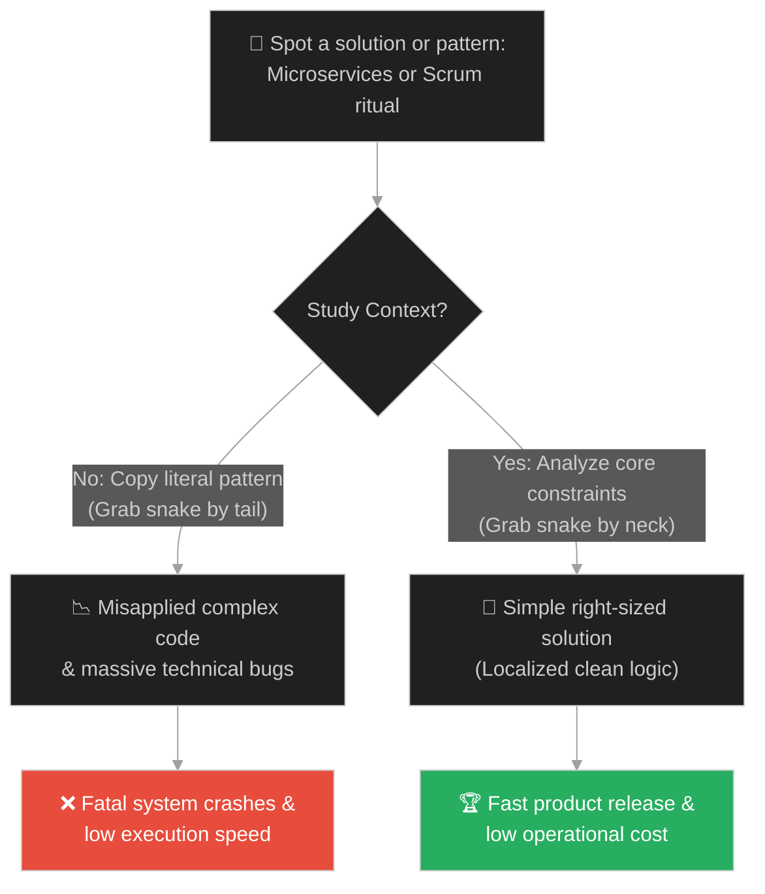
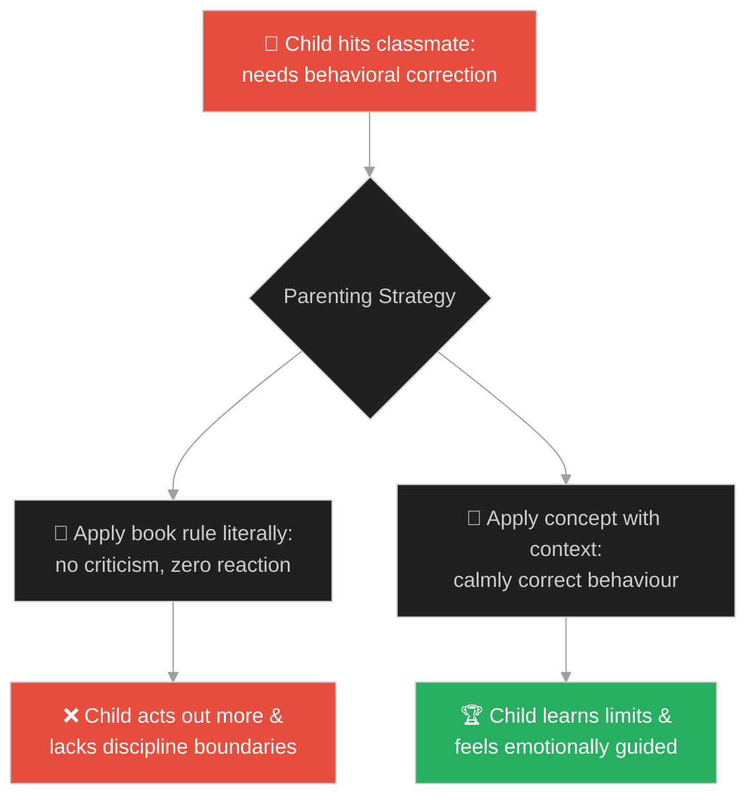
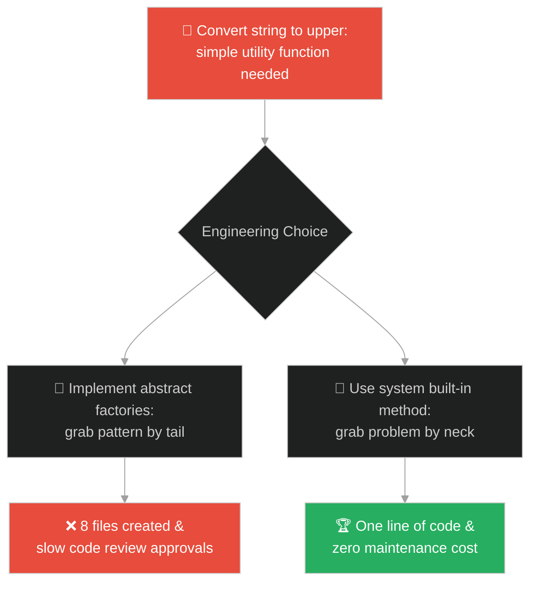
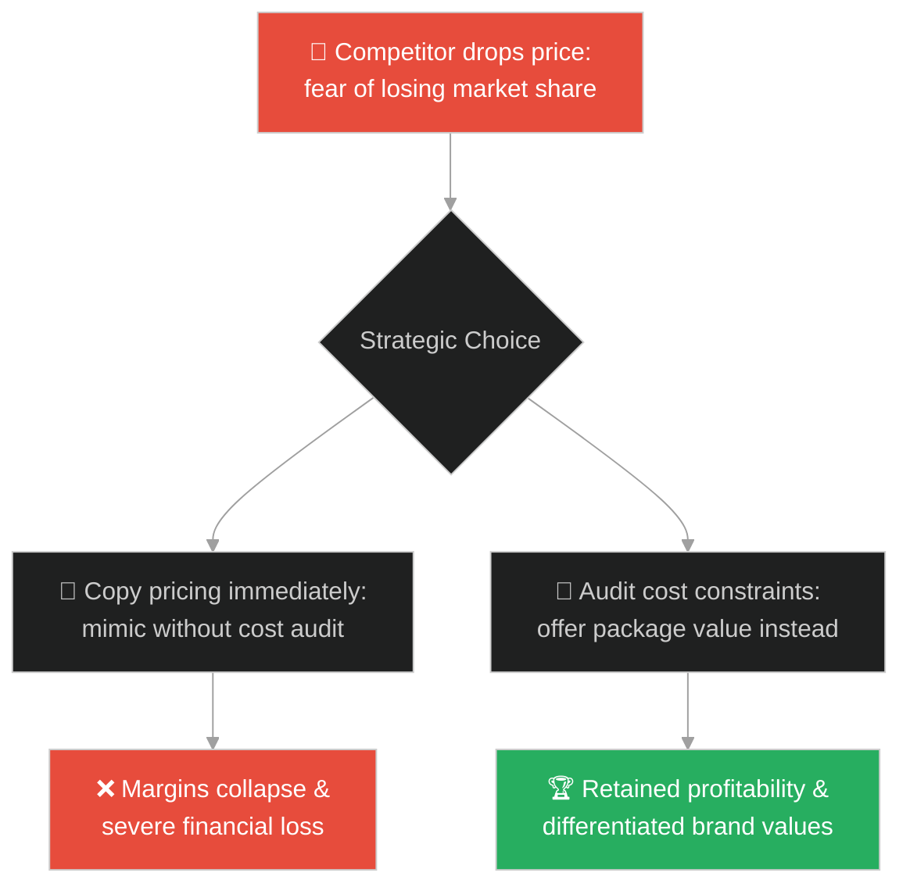
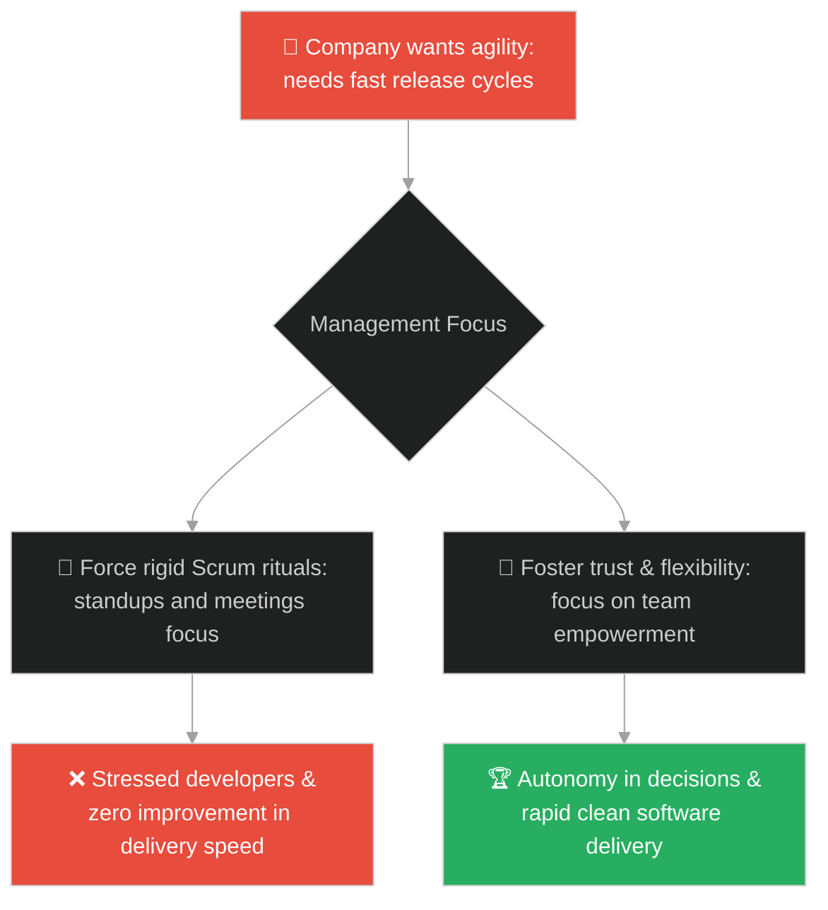
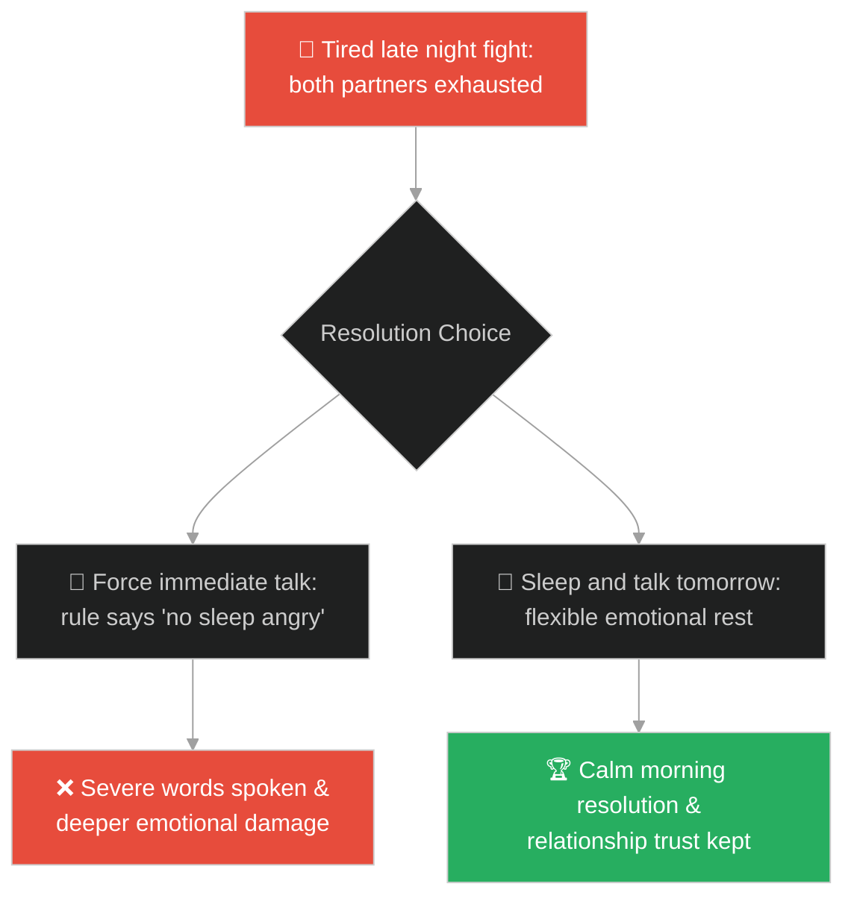
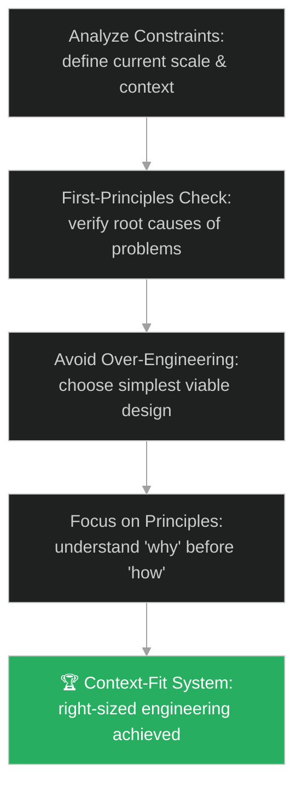

# Cargo Cult Programming & Misapplying Patterns (ការចម្លងលំនាំដោយគ្មានការយល់ដឹង និងការយល់ដឹងខុសបរិបទ)៖ ពស់ទឹក (Cargo Cult Programming & Misapplying Design Patterns & The Water Snake)

**Author:** ichamrong  
**Date:** 2026-05-28  
**Tags:** #buddhism #cargo-cult #design-patterns #over-engineering #context #software-engineering  
**Category:** Concepts / Parables  
**Read Time:** ~15 min  

---

## 📌 មាតិកា (Table of Contents)
- [អន្ទាក់ផ្លូវចិត្ត (The Trap)](#0)
- [១. រឿងព្រេងប្រវត្តិសាស្ត្រ៖ របៀបចាប់ពស់ទឹក (The Legend of Catching the Water Snake)](#1)
  - [គ្រោះថ្នាក់នៃការចាប់ពស់ខុសបច្ចេកទេស (The Danger of Grabbing the Tail)](#1-1)
- [២. បញ្ហា៖ ការចម្លងកូដដោយងងឹតងងល់ និងការបង្កើតភាពស្មុគស្មាញហួសហេតុ (The Issue: Copy-Pasting Code and Cargo Cult Over-Engineering)](#2)
- [៣. ឧទាហមណ៍ជាក់ស្តែងក្នុងពិភពពិត (Real World Examples)](#3)
  - [ឧទាហរណ៍ទី ១ — កម្រិតស្រាល (គ្រួសារ)៖ ការអនុវត្តដំបូន្មានអប់រំកូនដោយគ្មានការយល់ដឹង (Copying Parenting Advice Without Context)](#3-1)
  - [ឧទាហរណ៍ទី ២ — កម្រិតមធ្យម (បច្ចេកទេស)៖ ការប្រើប្រាស់ Design Patterns ស្មុគស្មាញហួសហេតុ (Over-Engineering Simple Utilities with Design Patterns)](#3-2)
  - [ឧទាហរណ៍ទី ៣ — កម្រិតមធ្យម (ធុរកិច្ច)៖ ការចម្លងយុទ្ធសាស្ត្រតម្លៃរបស់គូប្រជែង (Mimicking Competitor Price Cuts Without Cost Analysis)](#3-3)
  - [ឧទាហរណ៍ទី ៤ — កម្រិតមធ្យម (សង្គម/គ្រប់គ្រង)៖ ការអនុវត្តពិធីការ Scrum បែបសក្ការៈ (Adopting Scrum Ceremonies Without Agile Mindset)](#3-4)
  - [ឧទាហរណ៍ទី ៥ — កម្រិតធ្ងន់ (ទំនាក់ទំនង)៖ ការប្រើប្រាស់ច្បាប់ស្នេហាបែបរឹងត្អឹង (Enforcing Literal Relationship Rules)](#3-5)
- [៤. ដំណោះស្រាយទូទៅ៖ ការរៀនសូត្រពីបរិបទ និងការស្វែងយល់ពីឬសគល់ (The General Solution: Context-Driven Engineering and Root Understanding Loops)](#4)
- [សេចក្តីសន្និដ្ឋាន (Conclusion)](#5)
- [ឯកសារយោង (References)](#6)
- [Related Posts](#7)

---

<a id="0"></a>
## អន្ទាក់ផ្លូវចិត្ត (The Trap)

តើអ្នកធ្លាប់ឃើញវិស្វករចម្លងកូដយ៉ាងច្រើនពី StackOverflow ឬប្រើប្រាស់ AI ដើម្បីសរសេរប្រព័ន្ធដោយមិនបានយល់ពីរបៀបដំណើរការរបស់វា ឬការរចនាប្រព័ន្ធ Microservices ដ៏ស្មុគស្មាញសម្រាប់កម្មវិធីតូចតាចដែលត្រូវការតែ Database មួយដែរឬទេ?

នៅក្នុងពិភពវិស្វកម្ម និងការសម្រេចចិត្ត៖
* **យើងងាយនឹងធ្លាក់ក្នុងអន្ទាក់** នៃការចម្លងដំណោះស្រាយ ឬការរចនាម៉ូដល្បីៗ (Design Patterns) មកប្រើប្រាស់ដោយងងឹតងងល់ (Cargo Culting) ដោយសារគិតថា «បើក្រុមហ៊ុនធំៗដូចជា Netflix ឬ Google ប្រើប្រាស់វា នោះវាត្រូវតែល្អសម្រាប់ខ្ញុំ»។
* **យើងមើលរំលង** ថាដំណោះស្រាយនីមួយៗត្រូវបានបង្កើតឡើងក្រោមបរិបទ និងបញ្ហាជាក់លាក់មួយ។ ការយកវាមកប្រើខុសទិសដៅ ឬខ្វះការយល់ដឹងស៊ីជម្រៅ នឹងត្រលប់មកបង្កគ្រោះថ្នាក់ដល់ប្រព័ន្ធ ដូចជាការចាប់ពស់ចំកន្ទុយដែលបណ្តាលឱ្យវាបកមកខាំយើងវិញ។

ការចម្លងលំនាំ និងការដោះស្រាយបញ្ហាដោយគ្មានការយល់ដឹងពីឬសគល់ ហៅថា **អន្ទាក់ចាប់ពស់ខុសបច្ចេកទេស (The Cargo Cult Trap)**។

ដើម្បីយល់ដឹងពីរបៀបអនុវត្តដំណោះស្រាយឱ្យត្រូវនឹងបរិបទ នេះជាផែនទីបង្ហាញផ្លូវ៖
1. **រឿងព្រេងនិទាន (The Legend)** — រឿងរ៉ាវរបស់ព្រះពុទ្ធដែលសម្តែងប្រៀបធៀបធម៌ទៅនឹងការចាប់ពស់ ដែលបុរសម្នាក់ចាប់ចំកន្ទុយពស់ រួចត្រូវវាខាំ ធៀបនឹងបុរសម្នាក់ទៀតដែលប្រើដង្កាប់ចាប់ក្បាលពស់យ៉ាងមានសុវត្ថិភាព។
2. **បញ្ហា (The Issue)** — ការវិភាគបាតុភូត Cargo Cult Programming និងការ Over-engineering កូដ។
3. **ឧទាហមណ៍ជាក់ស្តែងក្នុងពិភពពិត (Real World Examples)** — ពិនិត្យមើលបញ្ហានេះក្នុងកម្រិតគ្រួសារ បច្ចេកវិទ្យា ធុរកិច្ច ការគ្រប់គ្រង និងទំនាក់ទំនង។
4. **ដំណោះស្រាយទូទៅ (The General Solution)** — ការអនុវត្តដំណោះស្រាយផ្អែកលើបរិបទ (Context-Driven Architecture) និងការចោទសួររកមូលហេតុ (First-Principles Thinking)។



---

<a id="1"></a>
## ១. រឿងព្រេងប្រវត្តិសាស្ត្រ៖ របៀបចាប់ពស់ទឹក (The Legend of Catching the Water Snake)

ថ្ងៃមួយ ព្រះសម្មាសម្ពុទ្ធទ្រង់បានត្រាស់ហៅភិក្ខុទាំងឡាយ រួចទ្រង់សម្តែងធម៌ទេសនាប្រៀបធៀបអំពីរបៀបចាប់ពស់។ ព្រះអង្គមានសង្ឃដីកាថា៖
> «ភិក្ខុទាំងឡាយ! ឧបមាថា បុរសម្នាក់ចង់បានពស់ទឹក។ គាត់បានដើរស្វែងរក រួចក៏ប្រទះឃើញពស់ទឹកដ៏ធំមួយ។ ដោយសារភាពល្ងង់ខ្លៅ និងមិនចេះបច្ចេកទេស គាត់បានលូកដៃទៅ **ចាប់ពស់នោះចំកន្ទុយ ឬដងខ្លួន** របស់វា។»

---

<a id="1-1"></a>
### គ្រោះថ្នាក់នៃការចាប់ពស់ខុសបច្ចេកទេស (The Danger of Grabbing the Tail)

ព្រះពុទ្ធទ្រង់បានបន្តសម្តែងធម៌ថា៖
> «នៅពេលដែលបុរសនោះចាប់ចំកន្ទុយ ឬដងខ្លួនពស់ វានឹងងាកក្បាលមកខាំដៃ ឬជើងរបស់គាត់ភ្លាមៗ បណ្តាលឱ្យគាត់រងទុក្ខវេទនា ឬអាចដល់ជីវិត។ ហេតុអ្វីទៅ? ពីព្រោះគាត់ចាប់ពស់នោះមិនបានល្អ និងមិនត្រូវតាមបច្ចេកទេស។»

ព្រះអង្គបានប្រៀបធៀបជាមួយបុរសម្នាក់ទៀត៖
> «ផ្ទុយទៅវិញ បុរសម្នាក់ទៀតដែលចេះបច្ចេកទេសច្បាស់លាស់ គាត់បានប្រើឈើដែលមានជើងជែកចុចលើក្បាលពស់ឱ្យជាប់ រួចលូកដៃទៅ **ចាប់ក្បាល ឬកញ្ចឹងករបស់វា** យ៉ាងណែន។ ទោះជាពស់នោះខំរមួលខ្លួនរុំដៃរបស់គាត់យ៉ាងណាក៏ដោយ ក៏វាមិនអាចបង្វែរក្បាលមកខាំគាត់បានឡើយ។ គាត់នឹងមានសុវត្ថិភាពជានិច្ច ពីព្រោះគាត់យល់ដឹងពីរបៀបចាប់វាត្រូវបច្ចេកទេស។»

ការសិក្សាធម៌វិន័យ ឬការប្រើប្រាស់បច្ចេកវិទ្យាក៏ដូច្នោះដែរ។ បើគ្មានការយល់ដឹងស៊ីជម្រៅពីឬសគល់ នោះដំណោះស្រាយដែលយើងចម្លងមក នឹងត្រលប់មកខាំបំផ្លាញយើងវិញ។

---

<a id="2"></a>
## ២. បញ្ហា៖ ការចម្លងកូដដោយងងឹតងងល់ និងការបង្កើតភាពស្មុគស្មាញហួសហេតុ (The Issue: Copy-Pasting Code and Cargo Cult Over-Engineering)

នៅក្នុងការសរសេរកម្មវិធី បាតុភូត Cargo Cult Programming កើតឡើងនៅពេលដែលវិស្វករនាំយកបច្ចេកវិទ្យា ឬ Design Patterns ដ៏ស្មុគស្មាញ មកប្រើប្រាស់ដោយគ្មានហេតុផលច្បាស់លាស់។ ឧទាហរណ៍ ការបង្កើតគំរូ Abstract Factory classes ច្រើនជាន់ សម្រាប់តែកូដដែលចង់បង្ហាញអក្សរ "Hello World" សាមញ្ញ។

នេះជាឧទាហរណ៍នៃកូដដែល Over-engineered ដោយសារចម្លងលំនាំខុសបរិបទ៖

```java
// ឧទាហរណ៍នៃកូដដែលស្មុគស្មាញហួសហេតុដោយសារការចម្លង Design Patterns ខុសបរិបទ
public class CargoCultOverEngineering {
    // simple configuration lookup
    public String getDatabaseUrl() {
        // អន្ទាក់៖ បង្កើត Builder, Provider និង Factory ច្រើនជាន់ដោយគ្មានតម្រូវការ
        ConfigFactory factory = ConfigFactoryBuilder.createNewInstance()
            .setProviderType(ProviderType.ENVIRONMENT)
            .buildFactory();
        return factory.getConfigProvider().lookupString("DATABASE_URL");
    }
}

// ដំណោះស្រាយ៖ សរសេរកូដសាមញ្ញតាមតម្រូវការជាក់ស្តែង
public class CleanSimpleEngineering {
    public String getDatabaseUrl() {
        return System.getenv("DATABASE_URL"); // Simple, direct, low cognitive overhead
    }
}
```

* **ការកើនឡើងនៃ Cognitive Load៖** វិស្វករដទៃទៀតត្រូវអានកូដរាប់សិបឯកសារដើម្បីយល់ពីមុខងារសាមញ្ញមួយ។
* **ភាពលំបាកក្នុងការកែកូដ (Rigid Architecture)៖** ការចម្លងលំនាំខុសបរិបទធ្វើឱ្យប្រព័ន្ធទាំងមូលរឹងត្អឹង និងពិបាកកែសម្រួលនៅពេលតម្រូវការអាជីវកម្មប្រែប្រួល។

---

<a id="3"></a>
## ៣. ឧទាហមណ៍ជាក់ស្តែងក្នុងពិភពពិត

---

<a id="3-1"></a>
### ឧទាហរណ៍ទី ១ — កម្រិតស្រាល (គ្រួសារ)៖ ការអនុវត្តដំបូន្មានអប់រំកូនដោយគ្មានការយល់ដឹង (Copying Parenting Advice Without Context)

ម្តាយម្នាក់បានអានសៀវភៅចិត្តវិទ្យាកុមារមួយដែលណែនាំកុំឱ្យស្តីបន្ទោសកូនទាល់តែសោះ។ គាត់បានអនុវត្តតាមយ៉ាងតឹងរ៉ឹង ទោះជាកូនតូចគប់របស់របរវាយមិត្តភក្តិក៏ដោយ។ ការអនុវត្តច្បាប់តាមអក្សរដោយមិនបានយល់ពី «ការកំណត់ព្រំដែនសុវត្ថិភាព (Healthy Boundaries)» ធ្វើឱ្យកូនប្រែជាក្មេងទំនើង និងមិនគោរពអ្នកដទៃ។



---

<a id="3-2"></a>
### ឧទាហរណ៍ទី ២ — កម្រិតមធ្យម (បច្ចេកទេស)៖ ការប្រើប្រាស់ Design Patterns ស្មុគស្មាញហួសហេតុ (Over-Engineering Simple Utilities with Design Patterns)

វិស្វករម្នាក់ចង់សរសេរ Function សាមញ្ញមួយដើម្បីបម្លែងអក្សរទៅជាអក្សរធំ (Uppercase)។ គាត់បានសម្រេចចិត្តប្រើប្រាស់ «Command, Factory និង State patterns» ចូលគ្នា បង្កើតជា class ចំនួន ៨។ នេះបង្កើនការងារអត់ប្រយោជន៍ និងធ្វើឱ្យមិត្តរួមក្រុមផ្សេងទៀតមិនចង់អានកូដរបស់គាត់។



---

<a id="3-3"></a>
### ឧទាហរណ៍ទី ៣ — កម្រិតមធ្យម (ធុរកិច្ច)៖ ការចម្លងយុទ្ធសាស្ត្រតម្លៃរបស់គូប្រជែង (Mimicking Competitor Price Cuts Without Cost Analysis)

ក្រុមហ៊ុនលក់ទំនិញមួយបានឃើញគូប្រជែងធំកាត់បន្ថយតម្លៃផលិតផល ៥០%។ ពួកគេក៏ប្រញាប់ប្រញាល់កាត់បន្ថយតម្លៃតាមភ្លាមៗដើម្បីដណ្តើមអតិថិជន (ចម្លងយុទ្ធសាស្ត្រចំកន្ទុយ)។ ប៉ុន្តែ ពួកគេមិនបានដឹងថាគូប្រជែងមានខ្សែសង្វាក់ផ្គត់ផ្គង់ថោកជាងឆ្ងាយឡើយ ដែលបណ្តាលឱ្យក្រុមហ៊ុនខ្លួនត្រូវខាតបង់ប្រាក់យ៉ាងធ្ងន់ធ្ងរ និងប្រឈមនឹងការបិទទ្វារ។



---

<a id="3-4"></a>
### ឧទាហរណ៍ទី ៤ — កម្រិតមធ្យម (សង្គម/គ្រប់គ្រង)៖ ការអនុវត្តពិធីការ Scrum បែបសក្ការៈ (Adopting Scrum Ceremonies Without Agile Mindset)

ប្រធានផ្នែកអភិវឌ្ឍន៍ម្នាក់បានតម្រូវឱ្យក្រុមការងាររត់កាត់ពិធីការ Scrum យ៉ាងតឹងរ៉ឹង (ដូចជា Daily Standups រយៈពេលយូរ និង Sprint Plannings រាប់ម៉ោង)។ ប៉ុន្តែ គាត់នៅតែផ្លាស់ប្តូរតម្រូវការអាជីវកម្មជារៀងរាល់ថ្ងៃ និងមីក្រូគ្រប់គ្រងវិស្វករ។ ការអនុវត្តតែពិធីការខាងក្រៅដោយគ្មានស្មារតីបត់បែន (Agile Spirit) គ្រាន់តែជាការបង្កើតការងារគ្មានប្រយោជន៍។



---

<a id="3-5"></a>
### ឧទាហរណ៍ទី ៥ — កម្រិតធ្ងន់ (ទំនាក់ទំនង)៖ ការប្រើប្រាស់ច្បាប់ស្នេហាបែបរឹងត្អឹង (Enforcing Literal Relationship Rules)

គូស្រករមួយបានព្រមព្រៀងគ្នាលើច្បាប់ «មិនត្រូវខឹងគ្នាហួសពីម៉ោង ១២ យប់ឡើយ»។ យប់មួយ ពួកគេមានជម្លោះធំ ហើយទាំងពីរនាក់ហត់នឿយខ្លាំង។ ជំនួសឱ្យការចូលគេងដើម្បីឱ្យចិត្តស្ងប់ បែរជាបង្ខំគ្នាដោះស្រាយរហូតដល់ម៉ោង ៣ ភ្លឺ បង្កជាពាក្យសម្តីគំរោះគំរើយដាក់គ្នា។ ការអនុវត្តច្បាប់ខ្វះភាពបត់បែន នាំឱ្យទំនាក់ទំនងកាន់តែរងគ្រោះ។



---

<a id="4"></a>
## ៤. ដំណោះស្រាយទូទៅ៖ ការរៀនសូត្រពីបរិបទ និងការស្វែងយល់ពីឬសគល់ (The General Solution: Context-Driven Engineering and Root Understanding Loops)

ដើម្បីបញ្ចៀសការចម្លងលំនាំខុសបរិបទ និងអភិវឌ្ឍប្រព័ន្ធប្រកបដោយភាពឆ្លាតវៃ ចូរអនុវត្តយន្តការដូចខាងក្រោម៖



* **ការប្រើប្រាស់ការគិតពីគោលការណ៍ដំបូង (First-Principles Thinking)៖** រាល់ពេលចង់នាំយកបច្ចេកវិទ្យាថ្មីមកប្រើប្រាស់ ចូរចោទសួរថា៖ «តើបញ្ហាពិតប្រាកដដែលយើងចង់ដោះស្រាយគឺជាអ្វី? តើបច្ចេកវិទ្យានេះដោះស្រាយបញ្ហានោះដោយរបៀបណា? តើវាមានតម្លៃសមរម្យសម្រាប់ទំហំការងារយើងបច្ចុប្បន្នដែរឬទេ?»
* **គោលការណ៍ K.I.S.S. (Keep It Simple, Stupid)៖** ជ្រើសរើសដំណោះស្រាយដែលសាមញ្ញបំផុតដែលដំណើរការ។ កុំបន្ថែមភាពស្មុគស្មាញ (Abstraction layers) រហូតទាល់តែមានភស្តុតាងច្បាស់លាស់ថាវាចាំបាច់។
* **ច្បាប់ចាប់ក្បាលពស់ (The Snake Grasping Rule)៖**
  1. **យល់ពីឬសគល់**៖ កុំប្រើប្រាស់កូដ ឬច្បាប់ណាមួយដែលអ្នកមិនអាចពន្យល់ពីរបៀបដំណើរការ ឬមូលហេតុនៃការបង្កើតរបស់វាបានឡើយ។
  2. **កែសម្រួលតាមបរិបទ**៖ កែប្រែដំណោះស្រាយណាមួយឱ្យត្រូវនឹងវប្បធម៌ ទំហំក្រុមការងារ និងធនធានហិរញ្ញវត្ថុជាក់ស្តែងរបស់អ្នក។

---

## 🐇 ធ្លាក់ចូលក្នុងរន្ធទន្សាយ (Enter the Rabbit Hole)

ដើម្បីស្វែងយល់កាន់តែស៊ីជម្រៅអំពីរបៀបដែលការស្វែងរកគុណភាព និងការអនុវត្តការងារត្រូវតែចាប់ផ្តើមចេញពីចេតនាសុទ្ធសាធ និងការផ្តោតលើខ្លឹមសារពិតប្រាកដ មិនមែនលើការបង្កើតសំបកក្រៅដ៏ច្រើនលើសលុប សូមចាប់ផ្តើមដំណើររុករករបស់អ្នកដោយចុចលើតំណភ្ជាប់ខាងក្រោម៖

* 🚀 **[ចាប់ផ្តើមដំណើររុករក (Start the Journey) ➔ ចេតនាសុទ្ធសាធ និងខ្លឹមសារពិត (Intentionality & Quality over Quantity)](./136-buddha-and-the-beggars-lamp.md)**

---

<a id="5"></a>
## សេចក្តីសន្និដ្ឋាន (Conclusion)

> **«ការចម្លងដំណោះស្រាយរបស់គេមកប្រើប្រាស់ដោយគ្មានការយល់ដឹង គឺប្រៀបដូចជាការទិញអាវធំរបស់អ្នកដទៃមកពាក់ ទាំងដែលវាខុសទំហំខ្លួនរបស់អ្នក។»**

 design pattern ឬបច្ចេកវិទ្យាដ៏អស្ចារ្យ មិនមែនជាដំណោះស្រាយសកលដែលជួយសង្គ្រោះរាល់បញ្ហានោះឡើយ។ ភាពជាវិជ្ជាជីវៈពិតប្រាកដក្នុងការរចនាប្រព័ន្ធ គឺសមត្ថភាពក្នុងការវិភាគបរិបទ ថ្លឹងថ្លែងចំនុចល្អនិងអាក្រក់ (Trade-offs) និងការជ្រើសរើសដំណោះស្រាយដែលសាមញ្ញ និងសមស្របបំផុតសម្រាប់ប្រព័ន្ធការងារបច្ចុប្បន្នរបស់អ្នក។

---

<a id="6"></a>
## ឯកសារយោង (References)

* **Alagaddupama Sutta (The Water-Snake Simile - MN 22)** — Simile of the water snake where the Buddha teaches that grabbing the teaching incorrectly (by the tail) leads to harm, just like catching a snake wrong.
* **Richard P. Feynman** — *Surely You're Joking, Mr. Feynman!* (1985). Chapter on Cargo Cult Science and the psychology of superficial imitation.
* **Fred Brooks** — *The Mythical Man-Month* (1975). Discussions on accidental vs. essential complexity in software engineering.

---

<a id="7"></a>
## Related Posts

* [The Raft](./11-the-baker-and-the-butcher.md) — Overcoming utility attachment and discarding templates that no longer fit.
* [ Cao Cao's Short Song](./20-cao-cao-short-song-and-the-heart-of-talent.md) — Seeking genuine talents based on core capacity, not superficial credentials.
