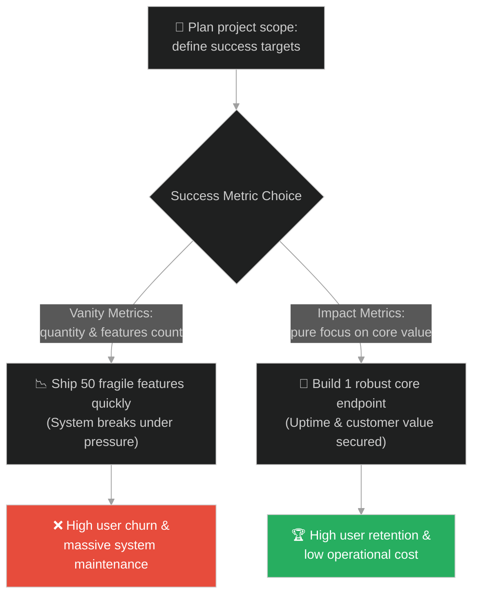
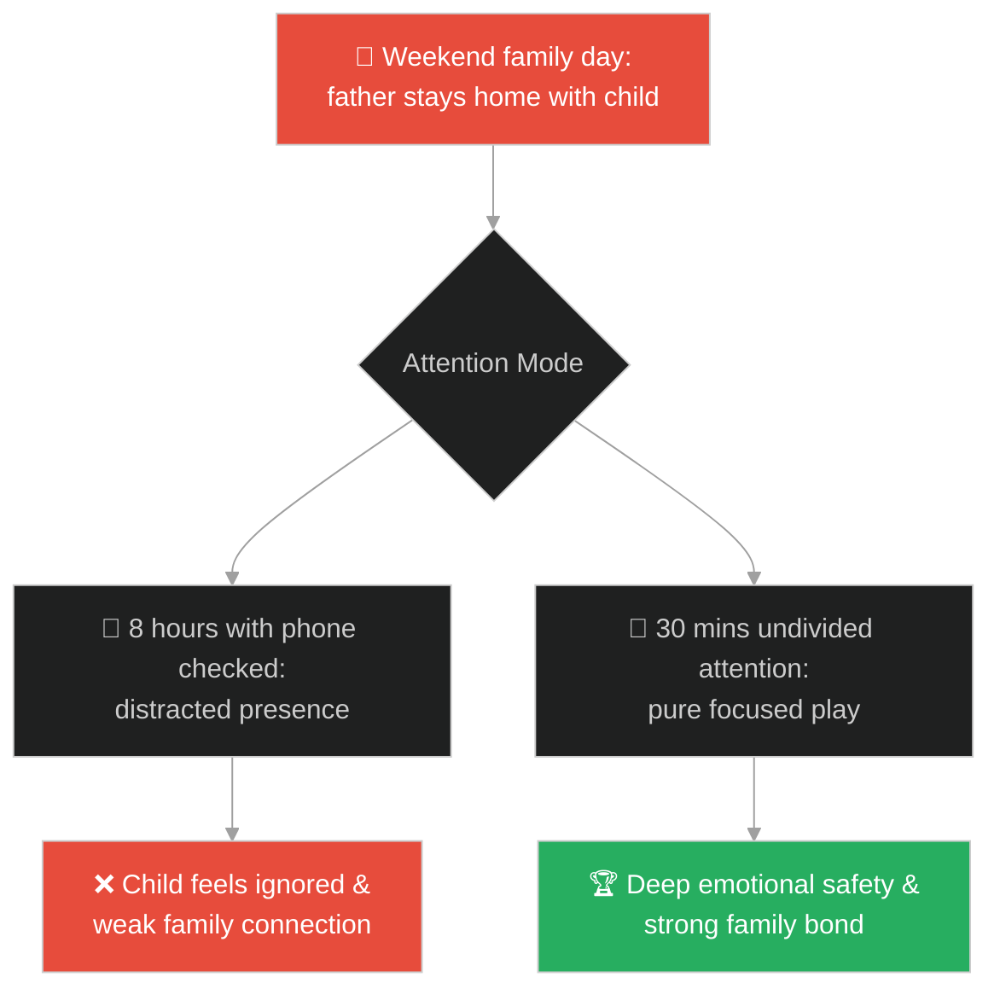
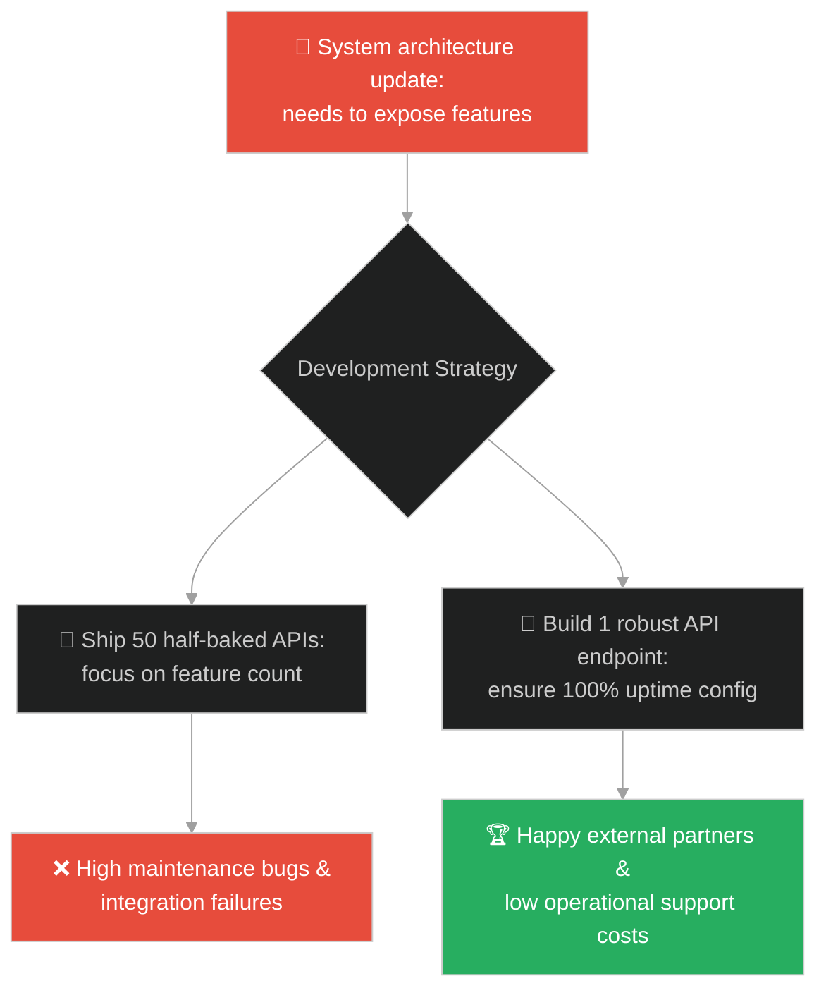
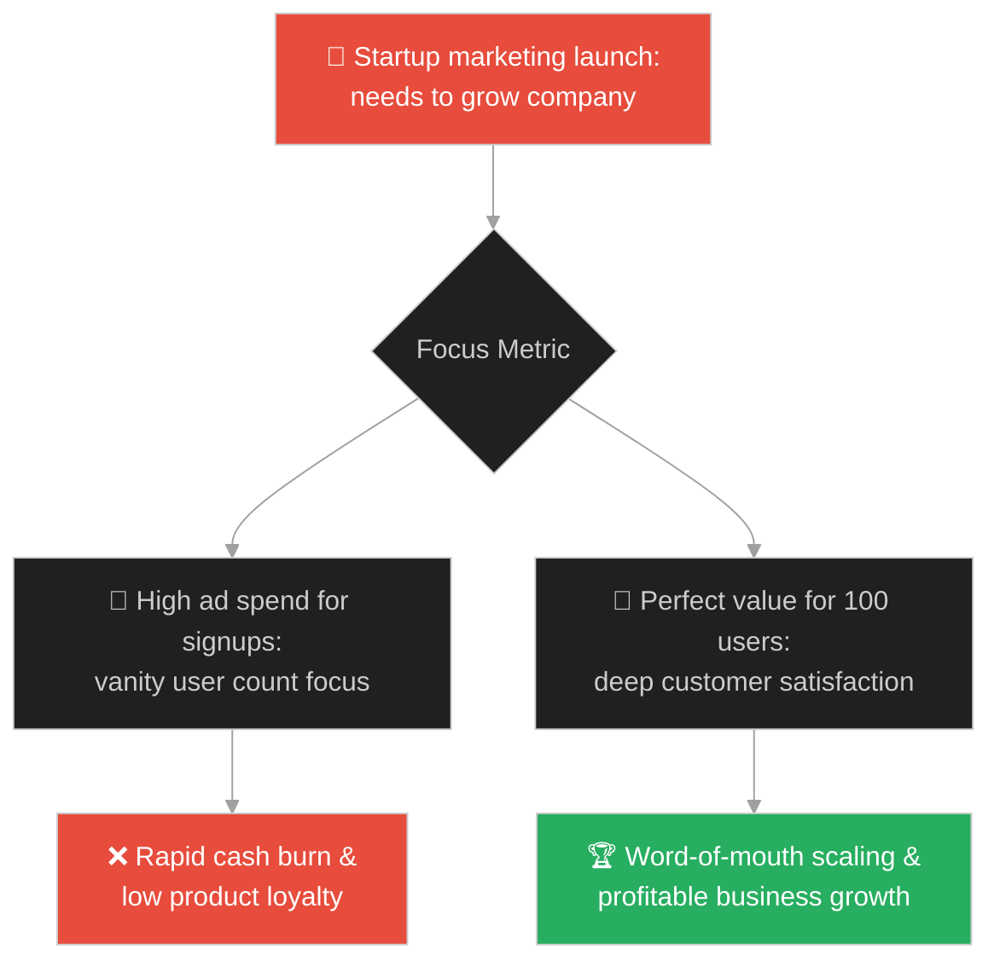
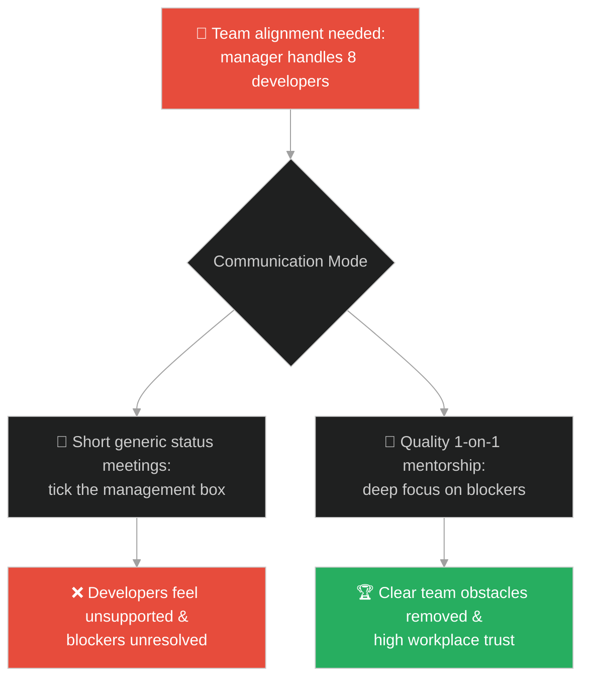
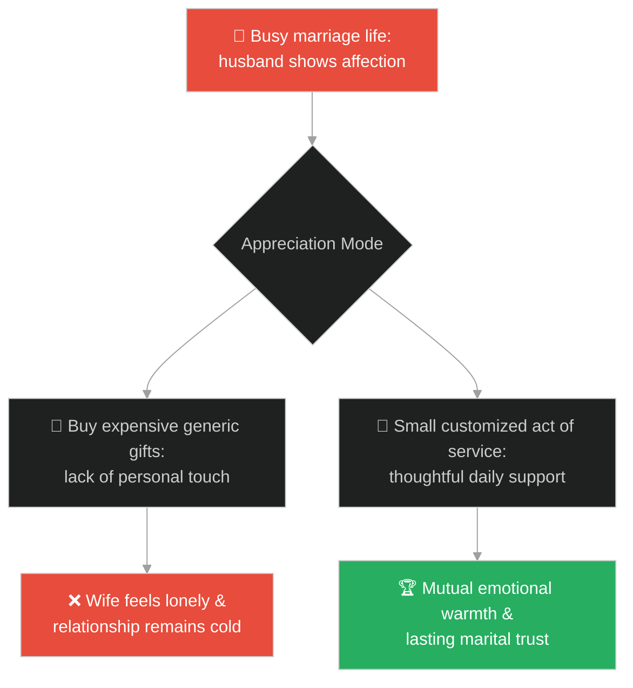
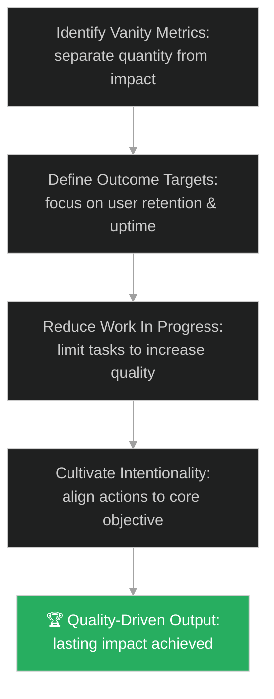

# Intentionality & Core Objectives (ចេតនាសុទ្ធសាធ និងគោលដៅស្នូល)៖ ចង្កៀងស្រីទុគ៌ត (Intentionality & Core Objectives & The Beggar's Lamp)

**Author:** ichamrong  
**Date:** 2026-05-28  
**Tags:** #buddhism #intentionality #quality #vanity-metrics #focus #product-management #software-quality  
**Category:** Concepts / Parables  
**Read Time:** ~15 min  

---

## 📌 មាតិកា (Table of Contents)
- [អន្ទាក់ផ្លូវចិត្ត (The Trap)](#0)
- [១. រឿងព្រេងប្រវត្តិសាស្ត្រ៖ ចង្កៀងស្រីទុគ៌ត (The Legend of the Beggar's Lamp)](#1)
  - [ចង្កៀងដែលមិនអាចពន្លត់បានដោយខ្យល់ព្យុះ (The Unquenchable Lamp of Pure Intention)](#1-1)
- [២. បញ្ហា៖ ការដេញតាម Vanity Metrics និងការផលិតបរិមាណគ្មានគុណភាព (The Issue: Chasing Vanity Metrics and Low-Quality Outputs)](#2)
- [៣. ឧទាហមណ៍ជាក់ស្តែងក្នុងពិភពពិត (Real World Examples)](#3)
  - [ឧទាហរណ៍ទី ១ — កម្រិតស្រាល (គ្រួសារ)៖ ការចំណាយពេលប្រកបដោយគុណភាពជាមួយកូន (Quality Time vs Distributed Distracted Hours)](#3-1)
  - [ឧទាហរណ៍ទី ២ — កម្រិតមធ្យម (បច្ចេកទេស)៖ ការរចនា API ដែលមានគុណភាពខ្ពស់ (Designing One Robust API vs 50 Half-Baked Endpoints)](#3-2)
  - [ឧទាហរណ៍ទី ៣ — កម្រិតមធ្យម (ធុរកិច្ច)៖ ការរក្សាទុកអតិថិជនស្នូល (Focusing on 100 Loyal Users vs 10,000 Temporary Signups)](#3-3)
  - [ឧទាហរណ៍ទី ៤ — កម្រិតមធ្យម (សង្គម/គ្រប់គ្រង)៖ ការដោះស្រាយបញ្ហារបស់សមាជិកក្រុម (Deep 1-on-1 Mentorship vs Generic Meetings)](#3-4)
  - [ឧទាហរណ៍ទី ៥ — កម្រិតធ្ងន់ (ទំនាក់ទំនង)៖ ការធ្វើសកម្មភាពយោគយល់ប្រកបដោយការគិត (One Thoughtful Act vs Expensive Generic Gifts)](#3-5)
- [៤. ដំណោះស្រាយទូទៅ៖ ការផ្តោតលើគុណតម្លៃពិត និងចេតនាស្នូល (The General Solution: Prioritizing Impact over Volume and Aligning Core Metrics)](#4)
- [សេចក្តីសន្និដ្ឋាន (Conclusion)](#5)
- [ឯកសារយោង (References)](#6)
- [Related Posts](#7)

---

<a id="0"></a>
## អន្ទាក់ផ្លូវចិត្ត (The Trap)

តើអ្នកធ្លាប់ឃើញក្រុមការងារបច្ចេកវិទ្យាដែលមានមោទនភាពលើការសរសេរកូដរាប់ម៉ឺនបន្ទាត់ ឬការបញ្ចេញមុខងារថ្មីៗរាប់សិបក្នុងមួយខែ តែផលិតផលនោះបែរជាគ្មានអតិថិជនចង់ប្រើប្រាស់ ឬសម្បូរទៅដោយ bug ប្រើមិនកើតដែរឬទេ?

នៅក្នុងជីវិត និងការគ្រប់គ្រងផលិតផល៖
* **យើងងាយនឹងធ្លាក់ក្នុងអន្ទាក់** នៃការវាស់វែងភាពជោគជ័យដោយផ្អែកលើបរិមាណ ឬតួរលេខសំបកក្រៅ (Vanity Metrics) ដូចជា ចំនួនកូដដែលបានសរសេរ ចំនួនម៉ោងប្រជុំ ឬចំនួនមុខងារដែលបានបង្ហោះ។
* **យើងមើលរំលង** ថាការផ្តោតលើចេតនាយ៉ាងច្បាស់លាស់ និងគុណភាពពិតប្រាកដ (Intentionality & Quality) ទោះជាការងារតូចតាច ឬចំណាយធនធានតិចតួច ក៏អាចបង្កើតផលជះដ៏ធំធេង និងរឹងមាំមិនអាចបំផ្លាញបាន។

ការដេញតាមបរិមាណដើម្បីបង្អួតសំបកក្រៅហៅថា **អន្ទាក់តួរលេខសំបកក្រៅ (The Vanity Metrics Trap)**។

ដើម្បីយល់ដឹងពីរបៀបផ្តោតលើគុណតម្លៃពិត នេះជាផែនទីបង្ហាញផ្លូវ៖
1. **រឿងព្រេងនិទាន (The Legend)** — រឿងរ៉ាវរបស់ស្រីទុគ៌តម្នាក់ដែលសន្សំប្រាក់ទិញប្រេងចង្កៀងតូចមួយមកបូជាព្រះពុទ្ធដោយចេតនាសុទ្ធសាធ ដែលចង្កៀងនោះមិនអាចពន្លត់បានសូម្បីតែដោយខ្យល់ព្យុះ ខណៈចង្កៀងរាប់ពាន់របស់ស្តេចត្រូវរលត់អស់។
2. **បញ្ហា (The Issue)** — ការវិភាគភាពខុសគ្នារវាងគុណភាព និងបរិមាណ (Quality vs Quantity) ក្នុងវិស្វកម្ម និងការគ្រប់គ្រង។
3. **ឧទាហមណ៍ជាក់ស្តែងក្នុងពិភពពិត (Real World Examples)** — ពិនិត្យមើលបញ្ហានេះក្នុងកម្រិតគ្រួសារ បច្ចេកវិទ្យា ធុរកិច្ច ការគ្រប់គ្រង និងទំនាក់ទំនង។
4. **ដំណោះស្រាយទូទៅ (The General Solution)** — ការវាស់វែងផ្អែកលើលទ្ធផលជាក់ស្តែង (Outcome-based Metrics) និងការកាត់បន្ថយភាពខ្ជះខ្ជាយ។



---

<a id="1"></a>
## ១. រឿងព្រេងប្រវត្តិសាស្ត្រ៖ ចង្កៀងស្រីទុគ៌ត (The Legend of the Beggar's Lamp)

ក្នុងសម័យពុទ្ធកាល ព្រះសម្មាសម្ពុទ្ធទ្រង់បានយាងទៅកាន់ក្រុងស្រាវស្តី។ ព្រះរាជា នាហ្មឺនសព្វមុខមន្ត្រី និងសេដ្ឋីជាច្រើន បាននាំគ្នារៀបចំចង្កៀងប្រេងរាប់ម៉ឺនគ្រឿងដើម្បីបូជាថ្វាយព្រះពុទ្ធ និងព្រះសង្ឃ។ ចង្កៀងទាំងនោះភ្លឺចិញ្ចាចចែងចាំងពេញមួយព្រៃជេតពន។

នៅពេលនោះ មានស្រីក្រីក្រទុគ៌តម្នាក់ឈ្មោះ **នន្ទា**។ នាងចង់បូជាចង្កៀងថ្វាយព្រះពុទ្ធយ៉ាងខ្លាំង ប៉ុន្តែនាងគ្មានប្រាក់សោះ។ នាងបានដើរសុំទានពេញមួយថ្ងៃ បានកាក់តូចមួយ រួចយកទៅទិញប្រេងពីហាង។ ម្ចាស់ហាងលក់ប្រេងមានការអាណិតអាសូរ ក៏បានបន្ថែមប្រេងឱ្យនាងបន្តិច។ នាងបានចាក់ប្រេងចូលក្នុងចង្កៀងដីតូចមួយ រួចយកទៅដាក់បូជាក្បែរព្រះពុទ្ធ ដោយតាំងចិត្តផ្សងថា៖
> «បពិត្រព្រះអង្គដ៏ចម្រើន! ទូលបង្គំគ្មានអ្វីក្រៅពីចង្កៀងតូចមួយនេះឡើយ។ សូមឱ្យពន្លឺចង្កៀងនេះ ជួយកម្ចាត់ភាពងងឹតនៃអវិជ្ជា និងនាំពន្លឺប្រាជ្ញាទៅកាន់មនុស្សគ្រប់រូប។»

---

<a id="1-1"></a>
### ចង្កៀងដែលមិនអាចពន្លត់បានដោយខ្យល់ព្យុះ (The Unquenchable Lamp of Pure Intention)

នៅពេលកណ្តាលអធ្រាត្រ ខ្យល់ព្យុះដ៏ខ្លាំងមួយបានបក់បោកកាត់ព្រៃជេតពន។ ចង្កៀងប្រេងរាប់ម៉ឺនគ្រឿងរបស់ស្តេច និងសេដ្ឋី ដែលពោរពេញដោយអំនួត បានរលត់អស់គ្មានសល់។ 

ព្រះភិក្ខុ **សារីបុត្រ** បានដើរពិនិត្យ ដើម្បីពន្លត់ចង្កៀងទាំងឡាយដែលនៅសេសសល់ ស្រាប់តែទ្រង់ទតឃើញចង្កៀងដីតូចមួយរបស់នាងនន្ទា នៅតែឆេះយ៉ាងសន្ធោសន្ធៅ។ ព្រះសារីបុត្របានព្យាយាមប្រើផ្លិតបក់ពន្លត់ តែមិនអាចពន្លត់បាន។ ទ្រង់បានប្រើសង្ឃាដីជួយបក់ ក៏នៅតែមិនអាចពន្លត់បានឡើយ។

ព្រះពុទ្ធទ្រង់ទតឃើញ ត្រាស់មានសង្ឃដីកាថា៖
> «សារីបុត្រ! ចង្កៀងនេះមិនអាចពន្លត់បានឡើយ ទោះជាអ្នកយកទឹកពីមហាសមុទ្រទាំងបួនមកស្រោច ឬប្រើខ្យល់ព្យុះធំកម្រិតណាក៏ដោយ។ ហេតុអ្វីទៅ? ពីព្រោះចង្កៀងនេះត្រូវបានអុជឡើងដោយ **ចេតនាសុទ្ធសាធដ៏ធំធេង (Pure Intention)** និងការលះបង់ដើម្បីផលប្រយោជន៍មនុស្សលោកទាំងពួង។»

---

<a id="2"></a>
## ២. បញ្ហា៖ ការដេញតាម Vanity Metrics និងការផលិតបរិមាណគ្មានគុណភាព (The Issue: Chasing Vanity Metrics and Low-Quality Outputs)

នៅក្នុងការគ្រប់គ្រងផលិតផល និងវិស្វកម្មសូហ្វវែរ ការដេញតាមតួរលេខសំបកក្រៅ (Vanity Metrics) ដូចជា ចំនួនមុខងារដែលបានបង្ហោះ (Feature Velocity) ឬចំនួនបន្ទាត់កូដ តែងតែនាំទៅរកការបង្កើតកូដដែលមានគុណភាពអន់ និងពិបាកប្រើប្រាស់។ វិស្វករដេញតាមល្បឿន ដោយមិនបានផ្ទៀងផ្ទាត់ពីតម្រូវការជាក់ស្តែងរបស់អ្នកប្រើប្រាស់។

នេះជាឧទាហមណ៍ប្រព័ន្ធដែលបង្កើតឡើងដោយផ្តោតលើតួរលេខបរិមាណ៖

```java
// ឧទាហរណ៍នៃការវាស់វែងផ្អែកលើបរិមាណ (Vanity Metrics Focus)
public class VanityMetricsSystem {
    private int featuresShipped = 0;
    
    // shipping multiple half-done features to look busy
    public void shipFeaturesFast() {
        for (int i = 0; i < 50; i++) {
            featuresShipped++;
            // code contains raw logic without security, error boundary or retry logic
            System.out.println("Shipped feature #" + featuresShipped);
        }
    }
}

// ដំណោះស្រាយ៖ ការផ្តោតលើគុណភាព និងចេតនាស្នូល (Intentionality & Quality Focus)
public class IntentionalQualitySystem {
    // Focus on one high-performance interface that guarantees security and reliability
    public String processCoreService(String userId, double transactionAmount) {
        if (userId == null || transactionAmount <= 0) {
            throw new IllegalArgumentException("Invalid input values");
        }
        // Secured, audited and rate-limited processing
        return "Transaction successful: " + transactionAmount;
    }
}
```

* **ការបង្កើតកូដផុយស្រួយ (Fragile Codebase)៖** មុខងារថ្មីៗជាច្រើនត្រូវបានសរសេរឡើងដោយគ្មានការការពារកំហុស (Error Handling) ដែលធ្វើឱ្យប្រព័ន្ធទាំងមូលឧស្សាហ៍ដួលរលំ។
* **ភាពមិនពេញចិត្តរបស់អ្នកប្រើប្រាស់ (User Frustration)៖** អតិថិជនជួបបញ្ហាក្នុងការប្រើប្រាស់មុខងារស្មុគស្មាញ និងសម្រេចចិត្តឈប់ប្រើប្រាស់ផលិតផល។

---

<a id="3"></a>
## ៣. ឧទាហមណ៍ជាក់ស្តែងក្នុងពិភពពិត

---

<a id="3-1"></a>
### ឧទាហរណ៍ទី ១ — កម្រិតស្រាល (គ្រួសារ)៖ ការចំណាយពេលប្រកបដោយគុណភាពជាមួយកូន (Quality Time vs Distributed Distracted Hours)

ឪពុកម្នាក់ចំណាយពេលពេញមួយថ្ងៃចុងសប្តាហ៍នៅក្បែរកូន ប៉ុន្តែដៃកាន់ទូរស័ព្ទឆ្លើយតបសារការងារជានិច្ច (បរិមាណម៉ោងច្រើន តែខ្វះគុណភាព)។ កូនមានអារម្មណ៍ថាមិនទទួលបានការយកចិត្តទុកដាក់។ ផ្ទុយទៅវិញ ការលេងជាមួយកូនតែ ៣០ នាទីដោយមិនប៉ះពាល់ទូរស័ព្ទសោះ ផ្តល់នូវភាពស្និទ្ធស្នាល និងក្តីស្រលាញ់ពិតប្រាកដ។



---

<a id="3-2"></a>
### ឧទាហរណ៍ទី ២ — កម្រិតមធ្យម (បច្ចេកទេស)៖ ការរចនា API ដែលមានគុណភាពខ្ពស់ (Designing One Robust API vs 50 Half-Baked Endpoints)

ក្រុមការងារកម្មវិធីចង់បង្កើតមុខងារថ្មីជាច្រើនដើម្បីឱ្យមើលទៅ «សកម្ម»។ ពួកគេបានបង្កើត API endpoints ចំនួន ៥០ យ៉ាងលឿន ប៉ុន្តែគ្មានឯកសារណែនាំច្បាស់លាស់ និងឧស្សាហ៍ដួលរលំ។ ការកសាងឡើងវិញនូវ API ស្នូលតែមួយដែលមានសុវត្ថិភាព និងភាពធន់ខ្ពស់ ជួយសម្រួលដល់ដៃគូខាងក្រៅក្នុងការតភ្ជាប់បានយ៉ាងងាយស្រួល។



---

<a id="3-3"></a>
### ឧទាហរណ៍ទី ៣ — កម្រិតមធ្យម (ធុរកិច្ច)៖ ការរក្សាទុកអតិថិជនស្នូល (Focusing on 100 Loyal Users vs 10,000 Temporary Signups)

ក្រុមហ៊ុនចាប់ផ្តើមថ្មី (Startup) មួយចំណាយថវិកាយ៉ាងច្រើនលើការផ្សព្វផ្សាយពាណិជ្ជកម្ម ដើម្បីទទួលបានការចុះឈ្មោះប្រើប្រាស់ពីអតិថិជន ១០,០០០ នាក់ក្នុងមួយសប្តាហ៍ (Vanity Metric) ប៉ុន្តែអតិថិជនទាំងនោះចាកចេញវិញភ្លាមៗ ព្រោះផលិតផលគ្មានគុណភាព។ ការផ្តោតការយកចិត្តទុកដាក់លើការបង្កើតតម្លៃឱ្យត្រូវចិត្តអតិថិជនស្នូល ១០០នាក់ ជួយឱ្យក្រុមហ៊ុនលូតលាស់ដោយចីរភាព។



---

<a id="3-4"></a>
### ឧទាហរណ៍ទី ៤ — កម្រិតមធ្យម (សង្គម/គ្រប់គ្រង)៖ ការដោះស្រាយបញ្ហារបស់សមាជិកក្រុម (Deep 1-on-1 Mentorship vs Generic Meetings)

អ្នកគ្រប់គ្រងម្នាក់រៀបចំការប្រជុំរួមគ្នារយៈពេលខ្លីជារៀងរាល់ថ្ងៃ (Daily Standups) ដើម្បីបង្ហាញថាគាត់ «តាមដានការងារជាប់លាប់» ប៉ុន្តែគាត់មិនដែលស្តាប់ ឬជួយដោះស្រាយបញ្ហាបុគ្គលិកឡើយ។ ការផ្លាស់ប្តូរមកជាការជួបពិភាក្សា ១ទល់១ ប្រកបដោយអត្ថន័យ ដើម្បីជួយតម្រង់ទិស និងដោះស្រាយ bottlenecks របស់សមាជិក ជួយជម្រុញផលិតភាពការងារបានពិតប្រាកដ។



---

<a id="3-5"></a>
### ឧទាហរណ៍ទី ៥ — កម្រិតធ្ងន់ (ទំនាក់ទំនង)៖ ការធ្វើសកម្មភាពយោគយល់ប្រកបដោយការគិត (One Thoughtful Act vs Expensive Generic Gifts)

ប្តីម្នាក់តែងតែទិញកាដូថ្លៃៗឱ្យប្រពន្ធរៀងរាល់ខែ ប៉ុន្តែមិនដែលយកចិត្តទុកដាក់ស្តាប់ពេលនាងនិយាយ ឬជួយការងារផ្ទះឡើយ។ ការលះបង់ពេលវេលាក្នុងការរៀបចំអាហារដែលនាងចូលចិត្ត ឬការជួយកាត់បន្ថយបន្ទុកការងាររបស់នាងដោយក្តីបារម្ភពិតប្រាកដ (ចេតនាសុទ្ធសាធ) ផ្តល់នូវក្តីស្រឡាញ់ស៊ីជម្រៅជាង។



---

<a id="4"></a>
## ៤. ដំណោះស្រាយទូទៅ៖ ការផ្តោតលើគុណតម្លៃពិត និងចេតនាស្នូល (The General Solution: Prioritizing Impact over Volume and Aligning Core Metrics)

ដើម្បីជំនះការដេញតាមតួរលេខបរិមាណ និងកសាងលទ្ធផលការងារប្រកបដោយគុណភាពខ្ពស់ ចូរអនុវត្តយន្តការដូចខាងក្រោម៖



* **ការផ្លាស់ប្តូរទៅកាន់លទ្ធផលវាស់វែងពិតប្រាកដ (Outcome over Output)៖** កំណត់គោលដៅការងារផ្អែកលើការដោះស្រាយបញ្ហារបស់អតិថិជន (Customer Satisfaction, Low Error Rate) ជំនួសឱ្យការវាស់វែងលើចំនួនសកម្មភាព ឬចំនួនមុខងារដែលបានបង្ហោះ។
* **ការកំណត់ដែនកំណត់លើកិច្ចការកំពុងធ្វើ (Limit Work-in-Progress - WIP)៖** អនុញ្ញាតឱ្យក្រុមការងារផ្តោតលើការបញ្ចប់កិច្ចការមួយឱ្យបានស្អាត និងល្អបំផុត មុននឹងចាប់ផ្តើមការងារថ្មី ដើម្បីធានាបាននូវគុណភាពកូដខ្ពស់បំផុត។
* **គោលការណ៍ចង្កៀងស្រីទុគ៌ត (The Pure Intention Rule)៖**
  1. **សួររក "ហេតុអ្វី" មុននឹង "ធ្វើ"**៖ រាល់ការប្រជុំ ឬរាល់ការសរសេរកូដថ្មី ត្រូវតែមានគោលបំណងច្បាស់លាស់ថាតើវាបម្រើផលប្រយោជន៍ដល់អ្នកប្រើប្រាស់កម្រិតណា។
  2. **គុណភាពឈ្នះបរិមាណ**៖ បង្កើត និងថែរក្សាចង្កៀងតូចមួយដ៏រឹងមាំ (មុខងារស្នូលដែលមានស្ថេរភាព ១០០%) ល្អជាងការបង្កើតចង្កៀងរាប់ពាន់ដែលងាយនឹងរលត់រាល់ពេលជួបវិបត្តិ។

---

## 🐇 ធ្លាក់ចូលក្នុងរន្ធទន្សាយ (Enter the Rabbit Hole)

ដើម្បីស្វែងយល់កាន់តែស៊ីជម្រៅអំពីរបៀបទទួលយកការពិត និងគ្រប់គ្រងប្រព័ន្ធការងារដោយការយល់ដឹងពីអ្វីដែលយើងអាចគ្រប់គ្រងបាន និងអ្វីដែលជាសំឡេងរំខានដែលយើងត្រូវរៀនទទួលយក សូមចាប់ផ្តើមដំណើររុករករបស់អ្នកដោយចុចលើតំណភ្ជាប់ខាងក្រោម៖

* 🚀 **[ចាប់ផ្តើមដំណើររុករក (Start the Journey) ➔ ការគ្រប់គ្រងសំឡេងរំខាន និងដែនកំណត់នៃការគ្រប់គ្រង (Accepting System Noise & SRE Mindset)](./137-buddha-and-the-84th-problem.md)**

---

<a id="5"></a>
## សេចក្តីសន្និដ្ឋាន (Conclusion)

> **«ចង្កៀងរាប់ពាន់ដែលបំភ្លឺដោយក្តីអំនួត នឹងរលត់ទៅដោយងាយក្រោមខ្យល់ព្យុះ ប៉ុន្តែពន្លឺតូចមួយដែលកើតចេញពីចេតនាសុទ្ធសាធ នឹងភ្លឺចែងចាំងជានិរន្តរ៍។»**

នៅក្នុងការរចនាប្រព័ន្ធការងារ និងការរស់នៅ គុណតម្លៃពិតប្រាកដមិនស្ថិតនៅលើភាពអ៊ូអែរនៃសកម្មភាព ឬការមានមុខងារច្រើនលើសលុបនោះឡើយ ប៉ុន្តែវាស្ថិតនៅលើចេតនាពិតប្រាកដដែលផ្តោតលើការផ្តល់ប្រយោជន៍ និងការដោះស្រាយបញ្ហាជាក់ស្តែងប្រកបដោយគុណភាពខ្ពស់បំផុត។ ធ្វើការងារឱ្យតិច តែធ្វើវាឱ្យល្អបំផុត។

---

<a id="6"></a>
## ឯកសារយោង (References)

* **The Sutra of the Wise and the Foolish (賢愚經)** — Buddhist classic that contains the story of Ajatashatru's lamps and the poor girl Nanda's lamp which could not be blown out.
* **Eric Ries** — *The Lean Startup: How Today's Entrepreneurs Use Continuous Innovation to Create Radically Successful Businesses* (2011). Detailed discussion on vanity metrics vs. actionable metrics.
* **Greg McKeown** — *Essentialism: The Disciplined Pursuit of Less* (2014). The core philosophy of focusing on the essential few and ignoring the trivial many.

---

<a id="7"></a>
## Related Posts

* [The Baker and the Butcher](./11-the-baker-and-the-butcher.md) — Exchanging authentic values in market networks.
* [The Golden Buddha](./128-buddha-and-the-golden-statue.md) — Discovering inner value underneath external clay layers.
