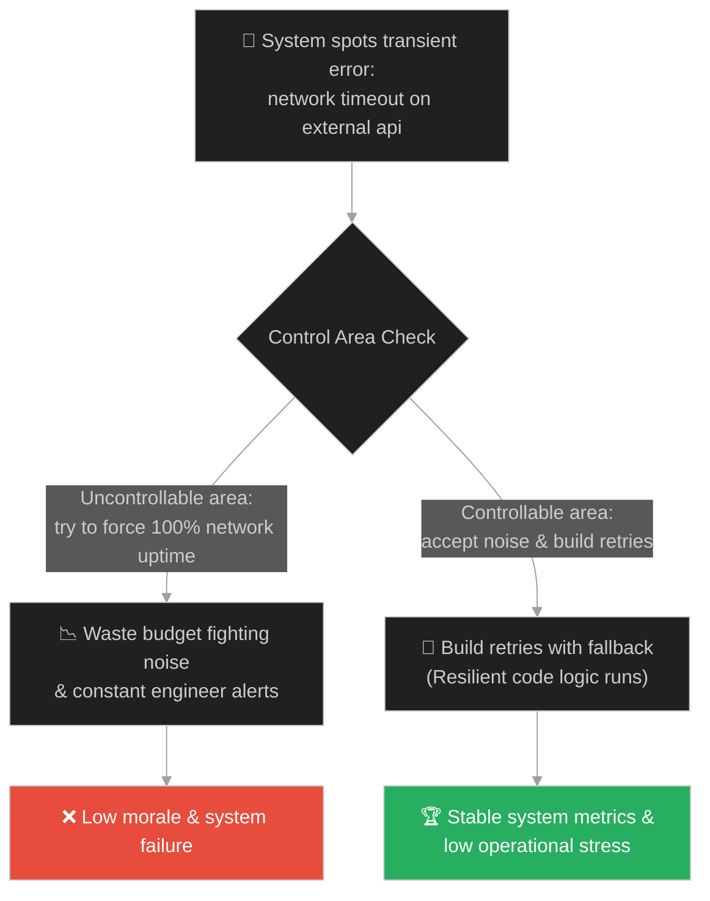
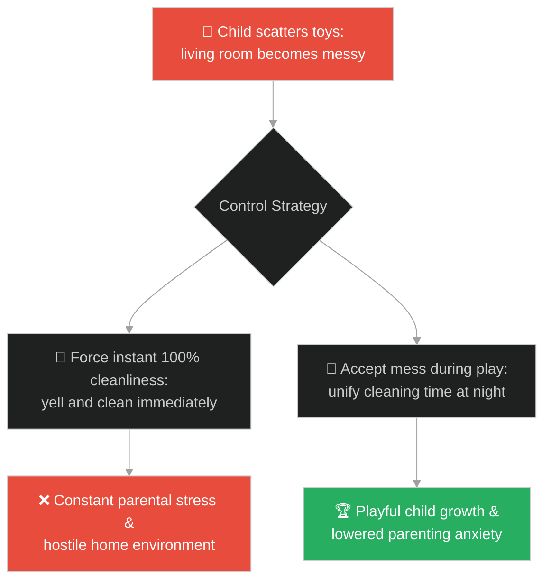
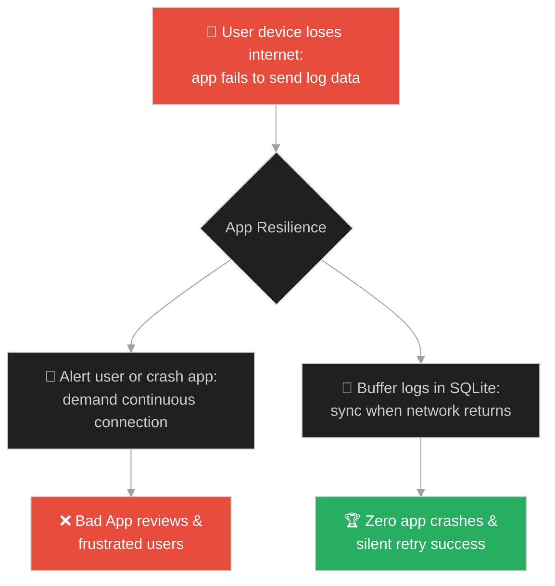
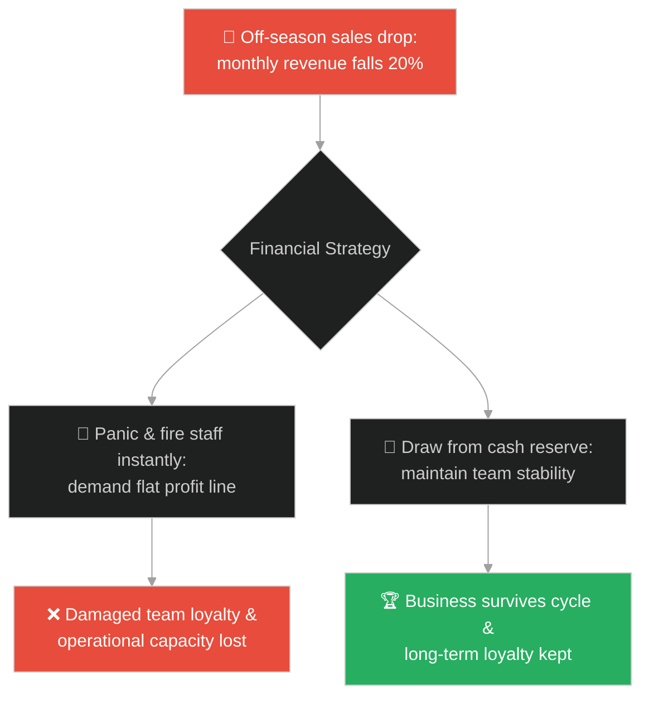
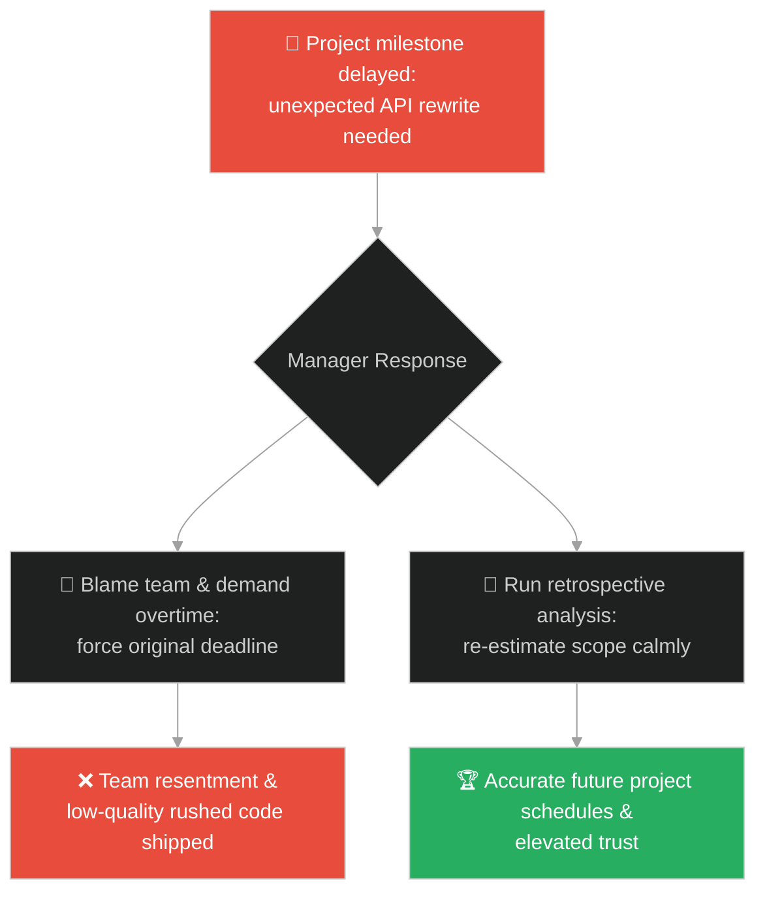
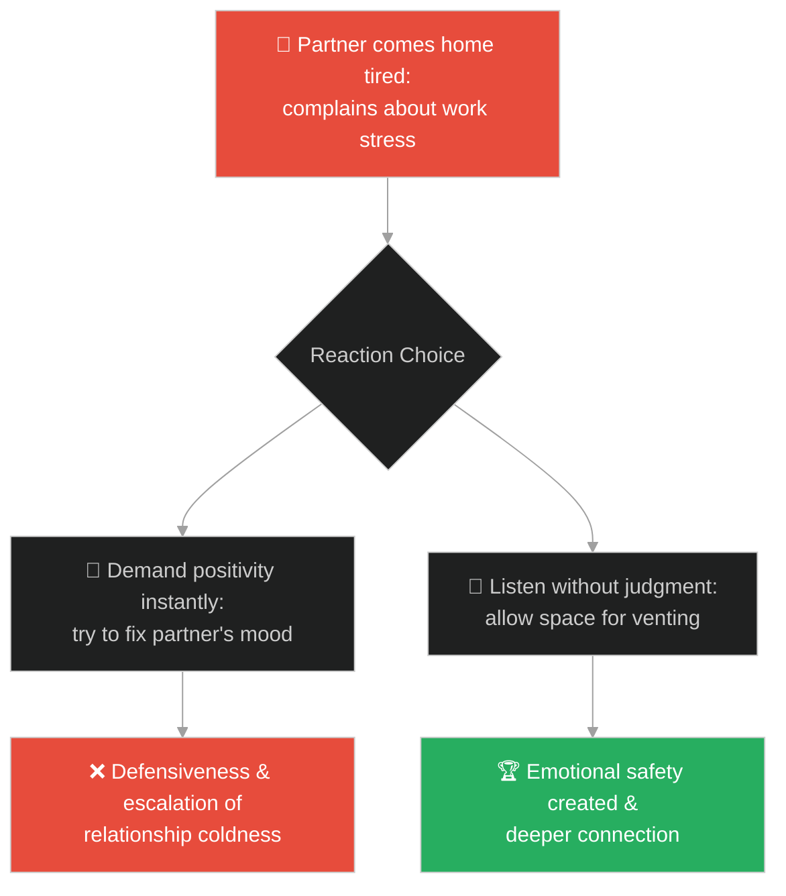
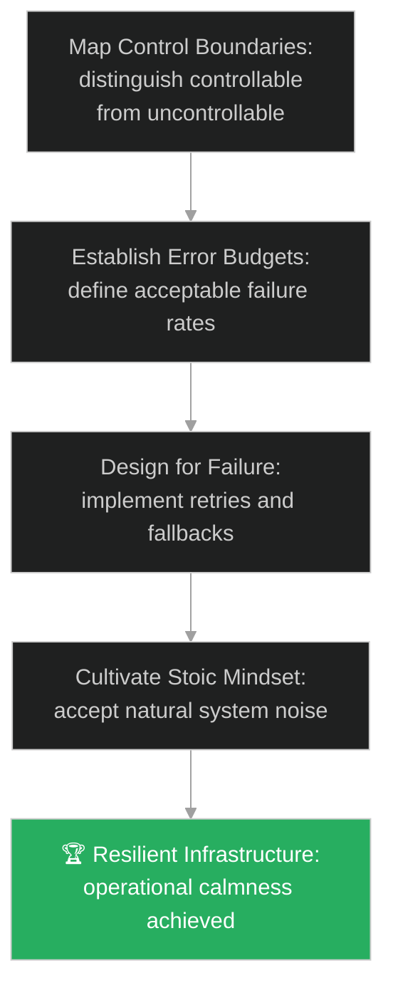

# Dichotomy of Control & SRE Mindset (ដែនកំណត់នៃការគ្រប់គ្រង និងផ្នត់គំនិតវិស្វករទំនុកចិត្ត)៖ បញ្ហាទី ៨៤ (Dichotomy of Control & SRE Mindset & The 84th Problem)

**Author:** ichamrong  
**Date:** 2026-05-28  
**Tags:** #buddhism #dichotomy-of-control #sre-mindset #resilience #reliability #accepting-noise #stoicism  
**Category:** Concepts / Parables  
**Read Time:** ~15 min  

---

## 📌 មាតិកា (Table of Contents)
- [អន្ទាក់ផ្លូវចិត្ត (The Trap)](#0)
- [១. រឿងព្រេងប្រវត្តិសាស្ត្រ៖ បញ្ហាទី ៨៤ (The Legend of the 84th Problem)](#1)
  - [បញ្ហាដែលមិនអាចដោះស្រាយបាន (The Unsolvable 84th Problem)](#1-1)
- [២. បញ្ហា៖ ការដេញតាមឧត្តមគតិឥតខ្ចោះ និងការបដិសេធកំហុសធម្មជាតិ (The Issue: Chasing Perfect Uptime and Denying System Noise)](#2)
- [៣. ឧទាហមណ៍ជាក់ស្តែងក្នុងពិភពពិត (Real World Examples)](#3)
  - [ឧទាហរណ៍ទី ១ — កម្រិតស្រាល (គ្រួសារ)៖ ការទទួលយកភាពរញ៉េរញ៉ៃរបស់កូនៗ (Accepting Child Messes and Relinquishing Control)](#3-1)
  - [ឧទាហរណ៍ទី ២ — កម្រិតមធ្យម (បច្ចេកទេស)៖ ការទទួលយកភាពមិនស្ថិតស្ថេរនៃបណ្តាញ (Accepting Network Failures and Implementing Retries)](#3-2)
  - [ឧទាហរណ៍ទី ៣ — កម្រិតមធ្យម (ធុរកិច្ច)៖ ការប្រឈមនឹងការប្រែប្រួលសេដ្ឋកិច្ច (Handling Market Volatility with Financial Buffers)](#3-3)
  - [ឧទាហរណ៍ទី ៤ — កម្រិតមធ្យម (សង្គម/គ្រប់គ្រង)៖ ការទទួលយកការយឺតយ៉ាវនៃគម្រោង (Accepting Code Delays and Improving Retrospectives)](#3-4)
  - [ឧទាហរណ៍ទី ៥ — កម្រិតធ្ងន់ (ទំនាក់ទំនង)៖ ការទទួលយកចំណុចខ្វះខាតរបស់ដៃគូ (Accepting Partner's Bad Days Without Trying to Change Them)](#3-5)
- [៤. ដំណោះស្រាយទូទៅ៖ ការកសាងភាពធន់ និងការកំណត់ Error Budgets (The General Solution: Embracing Dichotomy of Control and Defining Error Budgets)](#4)
- [សេចក្តីសន្និដ្ឋាន (Conclusion)](#5)
- [ឯកសារយោង (References)](#6)
- [Related Posts](#7)

---

<a id="0"></a>
## អន្ទាក់ផ្លូវចិត្ត (The Trap)

តើអ្នកធ្លាប់ជួបអ្នកដឹកនាំបច្ចេកវិទ្យាដែលទាមទារឱ្យប្រព័ន្ធដំណើរការ ១០០% ដោយគ្មានពេលគាំងទាល់តែសោះ (Zero Downtime) ហើយខឹងសម្បារយ៉ាងខ្លាំងរាល់ពេលដែលប្រព័ន្ធជួបប្រទះការរំខានបន្តិចបន្តួចពីប្រព័ន្ធខាងក្រៅដែរឬទេ?

នៅក្នុងជីវិត និងវិស្វកម្មទំនុកចិត្ត៖
* **យើងងាយនឹងធ្លាក់ក្នុងអន្ទាក់** នៃការចង់គ្រប់គ្រងរាល់កត្តាទាំងអស់នៅជុំវិញខ្លួន (សូម្បីតែកត្តាខាងក្រៅដែលមិនស្ថិតនៅក្រោមការគ្រប់គ្រងរបស់យើង ដូចជា បណ្តាញអ៊ីនធឺណិតដាច់ ការប្រែប្រួលសេដ្ឋកិច្ច ឬអាកប្បកិរិយារបស់អ្នកដទៃ)។
* **យើងមើលរំលង** ថាការខិតខំដោះស្រាយរាល់បញ្ហាតូចតាចទាំងអស់ដោយមិនទទួលយកភាពមិនឥតខ្ចោះ គ្រាន់តែជាការបង្កើតសម្ពាធ និងការចំណាយធនធានឥតប្រយោជន៍។ បញ្ហាពិតប្រាកដរបស់យើង គឺការចង់រស់នៅក្នុងពិភពលោកដែលគ្មានបញ្ហា។

ការចង់គ្រប់គ្រងអ្វីៗគ្រប់យ៉ាងរហូតដល់មិនអាចទទួលយកការរំខានធម្មជាតិ ហៅថា **អន្ទាក់ចង់បានភាពឥតខ្ចោះ (The Perfect Control Trap)**។

ដើម្បីយល់ដឹងពីរបៀបគ្រប់គ្រងការរំខាន នេះជាផែនទីបង្ហាញផ្លូវ៖
1. **រឿងព្រេងនិទាន (The Legend)** — រឿងរ៉ាវរបស់កសិករម្នាក់ដែលមករៀបរាប់ពីបញ្ហា ៨៣ យ៉ាងរបស់គាត់ឱ្យព្រះពុទ្ធជួយដោះស្រាយ ហើយទទួលបានការឆ្លើយតបថា ព្រះអង្គអាចជួយដោះស្រាយបានតែបញ្ហាទី ៨៤ ប៉ុណ្ណោះ គឺបំណងប្រាថ្នាចង់ឱ្យជីវិតគ្មានបញ្ហា។
2. **បញ្ហា (The Issue)** — ការវិភាគទ្រឹស្តី Dichotomy of Control និងផ្នត់គំនិត SRE (Site Reliability Engineering) ដែលប្រើប្រាស់ Error Budgets។
3. **ឧទាហមណ៍ជាក់ស្តែងក្នុងពិភពពិត (Real World Examples)** — ពិនិត្យមើលបញ្ហានេះក្នុងកម្រិតគ្រួសារ បច្ចេកវិទ្យា ធុរកិច្ច ការគ្រប់គ្រង និងទំនាក់ទំនង។
4. **ដំណោះស្រាយទូទៅ (The General Solution)** — ការគ្រប់គ្រងហានិភ័យ និងការរចនាប្រព័ន្ធបែបធន់នឹងការខូចខាត (Design for Failure)។



---

<a id="1"></a>
## ១. រឿងព្រេងប្រវត្តិសាស្ត្រ៖ បញ្ហាទី ៨៤ (The Legend of the 84th Problem)

ថ្ងៃមួយ មានកសិករម្នាក់បានធ្វើដំណើរទៅជួបព្រះពុទ្ធដោយទឹកមុខស្មុគស្មាញយ៉ាងខ្លាំង។ គាត់បានទូលរៀបរាប់ពីទុក្ខលំបាករបស់គាត់ថា៖
* *«ព្រះអង្គ! ទូលបង្គំជាកសិករ។ ជួនកាលអាកាសធាតុមិនល្អ ធ្វើឱ្យដំណាំស្រូវរបស់ទូលបង្គំត្រូវស្ងួតងាប់។ ជួនកាលទូលបង្គំខ្វះខាតទឹក ប្រពន្ធរបស់ទូលបង្គំចូលចិត្តរអ៊ូរទាំ ហើយកូនៗរបស់ទូលបង្គំមិនសូវស្តាប់បង្គាប់ឡើយ។»*

គាត់បានបន្តរៀបរាប់ពីបញ្ហារបស់គាត់ម្តងមួយៗរហូតដល់អស់ រួចសួរព្រះពុទ្ធថា៖
* *«ព្រះអង្គ! ទូលបង្គំដឹងថាព្រះអង្គមានប្រាជ្ញាខ្លាំងណាស់ តើព្រះអង្គអាចជួយដោះស្រាយបញ្ហាទាំងអស់នេះរបស់ទូលបង្គំបានដែរឬទេ?»*

ព្រះពុទ្ធទ្រង់បានស្តាប់ដោយការយកចិត្តទុកដាក់ រួចទ្រង់មានសង្ឃដីកាស្ងប់ស្ងាត់ថា៖
> «កសិករអើយ! តថាគតមិនអាចជួយដោះស្រាយបញ្ហាទាំងនោះរបស់អ្នកបានឡើយ។ មនុស្សគ្រប់រូបនៅក្នុងលោកនេះ តែងតែមាន **បញ្ហា ៨៣ យ៉ាង** ជានិច្ចនៅក្នុងជីវិត។ បញ្ហាខ្លះដោះស្រាយរួច បញ្ហាថ្មីក៏កើតឡើងវិញដដែល គ្មានថ្ងៃចប់ឡើយ។»

---

<a id="1-1"></a>
### បញ្ហាដែលមិនអាចដោះស្រាយបាន (The Unsolvable 84th Problem)

កសិករនោះខឹងយ៉ាងខ្លាំង ហើយសួរថា៖ *«បើព្រះអង្គមិនអាចជួយទូលបង្គំបាន តើមនុស្សគ្រប់គ្នាគោរពព្រះអង្គដើម្បីអ្វី?»*
ព្រះពុទ្ធទ្រង់ឆ្លើយតបវិញថា៖
> «តថាគតមិនអាចជួយអ្នកដោះស្រាយបញ្ហាទាំង ៨៣ យ៉ាងនោះឡើយ ប៉ុន្តែតថាគតអាចជួយដោះស្រាយ **បញ្ហាទី ៨៤ (The 84th Problem)** របស់អ្នកបាន។»

កសិករងឿងឆ្ងល់យ៉ាងខ្លាំង៖ *«បញ្ហាទី ៨៤? តើវាជាអ្វីទៅព្រះអង្គ?»*
ព្រះពុទ្ធទ្រង់សម្តែងពន្យល់ថា៖
> «បញ្ហាទី ៨៤ របស់អ្នក គឺ **បំណងប្រាថ្នាចង់ឱ្យជីវិតរបស់អ្នកគ្មានបញ្ហាទាល់តែសោះ**។ នៅពេលអ្នកបដិសេធ និងខឹងនឹងបញ្ហាធម្មជាតិ គឺអ្នកកំពុងបង្កើតទុក្ខជាន់ទីពីរដាក់ខ្លួនឯង។ កាលណាអ្នកព្រមទទួលយកថា "បញ្ហាគឺជាផ្នែកមួយនៃជីវិត" នោះបញ្ហាទាំង ៨៣ យ៉ាង នឹងលែងមានទម្ងន់បង្កទុក្ខដល់ចិត្តរបស់អ្នកទៀតហើយ។»

---

<a id="2"></a>
## ២. បញ្ហា៖ ការដេញតាមឧត្តមគតិឥតខ្ចោះ និងការបដិសេធកំហុសធម្មជាតិ (The Issue: Chasing Perfect Uptime and Denying System Noise)

នៅក្នុងការគ្រប់គ្រងប្រព័ន្ធបច្ចេកវិទ្យា (System Operations) កំហុសឆ្គងដ៏ធំបំផុតរបស់វិស្វករ ឬប្រធានគ្រប់គ្រងគឺការរំពឹងថា «ប្រព័ន្ធត្រូវតែដំណើរការឥតខ្ចោះ ១០០%»។ ពួកគេខិតខំដេញតាមគោលដៅនេះដោយការសរសេរកូដការពាររាប់រយជាន់ និងបង្កើត Alerts រាល់ពេលដែលប្រព័ន្ធជួបប្រទះការរំខានកម្រិតមីលីវិនាទី។

នេះជាកូដដែលខិតខំគ្រប់គ្រងអ្វីៗដែលគ្រប់គ្រងមិនបាន៖

```java
// ឧទាហរណ៍នៃការបដិសេធកំហុស និងការខិតខំគ្រប់គ្រងកត្តាខាងក្រៅ (Non-SRE Mindset)
public class UnrealisticControlSystem {
    public void callThirdPartyApi() {
        try {
            executeNetworkCall();
        } catch (Exception e) {
            // អន្ទាក់៖ បង្កើត Alert កម្រិតធ្ងន់ភ្លាមៗរាល់ពេល Network យឺតបន្តិចបន្តួច
            triggerSystemEmergencyAlert("NETWORK CRITICAL FAIL: Uptime violated!");
            // វិស្វករត្រូវភ្ញាក់ពីគេងកណ្តាលអធ្រាត្រដើម្បីមើលបញ្ហាបណ្តាញដែលខ្លួនជួសជុលមិនបាន
        }
    }
    
    private void executeNetworkCall() throws Exception {
        // Raw network implementation
    }
}
```

* **ការបាត់បង់ថាមពលការងារ (Alert Fatigue)៖** វិស្វករទទួលបានសារប្រកាសអាសន្នរាប់សិបសារក្នុងមួយថ្ងៃ ដែលភាគច្រើនជាកំហុសបណ្តាញបណ្តោះអាសន្ន (Transient Noise) ធ្វើឱ្យពួកគេលែងយកចិត្តទុកដាក់លើសារ Alerts សំខាន់ៗពិតប្រាកដ។
* **ការចំណាយខ្ពស់ហួសហេតុ (Diminishing Returns)៖** ការបង្កើនទំនុកចិត្តប្រព័ន្ធពី ៩៩.៩% ទៅ ៩៩.៩៩% ត្រូវចំណាយធនធាន និងពេលវេលាច្រើនជាងមុនរាប់ដង ទាំងដែលអ្នកប្រើប្រាស់មិនសង្កេតឃើញភាពខុសគ្នាឡើយ។

---

<a id="3"></a>
## ៣. ឧទាហមណ៍ជាក់ស្តែងក្នុងពិភពពិត

---

<a id="3-1"></a>
### ឧទាហរណ៍ទី ១ — កម្រិតស្រាល (គ្រួសារ)៖ ការទទួលយកភាពរញ៉េរញ៉ៃរបស់កូនៗ (Accepting Child Messes and Relinquishing Control)

ម្តាយម្នាក់ចង់ឱ្យផ្ទះរបស់ខ្លួនស្អាតល្អឥតខ្ចោះជានិច្ច។ នៅពេលកូនតូចៗលេងប្រដាប់ប្រដារាយប៉ាយ ឬធ្វើកំពប់ទឹកដោះគោ គាត់តែងតែស្រែកខឹង និងសម្អាតភ្លាមៗ។ គាត់មានអារម្មណ៍ហត់នឿយខ្លាំង។ ការទទួលយកថា «ក្មេងលេងរញ៉េរញ៉ៃជាធម្មជាតិ» និងការរួមគ្នាប្រមូលទុកដាក់ពេលល្ងាច ជួយកាត់បន្ថយសម្ពាធផ្លូវចិត្តគ្រួសារយ៉ាងច្រើន។



---

<a id="3-2"></a>
### ឧទាហរណ៍ទី ២ — កម្រិតមធ្យម (បច្ចេកទេស)៖ ការទទួលយកភាពមិនស្ថិតស្ថេរនៃបណ្តាញ (Accepting Network Failures and Implementing Retries)

ក្រុមការងារបច្ចេកវិទ្យាបង្កើតកម្មវិធីទូរស័ព្ទ។ ពួកគេព្យាយាមសរសេរកូដដើម្បីធានាថា «រាល់ការផ្ញើទិន្នន័យមិនត្រូវបរាជ័យឡើយ»។ ប៉ុន្តែ បណ្តាញទូរស័ព្ទ (3G/4G) របស់អតិថិជនតែងតែដាច់ជានិច្ច។ ដោយការទទួលយកកំហុសបណ្តាញនេះ និងការដាក់ឱ្យមាន «ប្រព័ន្ធរក្សាទុកទិន្នន័យបណ្តោះអាសន្នពេលគ្មានអ៊ីនធឺណិត (Offline Synchronization)» កម្មវិធីដំណើរការបានយ៉ាងរលូន។



---

<a id="3-3"></a>
### ឧទាហរណ៍ទី ៣ — កម្រិតមធ្យម (ធុរកិច្ច)៖ ការប្រឈមនឹងការប្រែប្រួលសេដ្ឋកិច្ច (Handling Market Volatility with Financial Buffers)

ម្ចាស់អាជីវកម្មម្នាក់ខឹង និងស្ត្រេសយ៉ាងខ្លាំងរាល់ពេលដែលការលក់ធ្លាក់ចុះបន្តិចបន្តួចក្នុងរដូវភ្លៀងធ្លាក់។ គាត់ព្យាយាមកាត់បន្ថយបុគ្គលិកភ្លាមៗដើម្បីរក្សាប្រាក់ចំណេញ។ ការទទួលយកថា «អាជីវកម្មតែងមានរដូវកាលឡើងចុះ» និងការបង្កើតកញ្ចប់ថវិកាបម្រុង (Cash Buffers) ជួយឱ្យក្រុមហ៊ុនរស់នៅប្រកបដោយស្ថិរភាព។



---

<a id="3-4"></a>
### ឧទាហរណ៍ទី ៤ — កម្រិតមធ្យម (សង្គម/គ្រប់គ្រង)៖ ការទទួលយកការយឺតយ៉ាវនៃគម្រោង (Accepting Code Delays and Improving Retrospectives)

ប្រធានគម្រោងម្នាក់ខឹងសម្បារ និងប្រជុំស្តីបន្ទោសវិស្វករជារៀងរាល់ថ្ងៃ នៅពេលថ្ងៃបញ្ចប់គម្រោងត្រូវពន្យារពេលដោយសារជួបបញ្ហាបច្ចេកទេសដែលមិនរំពឹងទុក។ ការផ្លាស់ប្តូរមកជាការទទួលយកថា «គម្រោងអាចនឹងជួបភាពមិនច្បាស់លាស់» និងការរៀបចំប្រជុំដកស្រង់មេរៀន (Retrospectives) ជួយឱ្យការប៉ាន់ស្មានពេលក្រោយកាន់តែច្បាស់លាស់។



---

<a id="3-5"></a>
### ឧទាហរណ៍ទី ៥ — កម្រិតធ្ងន់ (ទំនាក់ទំនង)៖ ការទទួលយកចំណុចខ្វះខាតរបស់ដៃគូ (Accepting Partner's Bad Days Without Trying to Change Them)

ដៃគូម្ខាងតែងតែខឹងរាល់ពេលដែលដៃគូម្ខាងទៀតមានអារម្មណ៍ហត់នឿយ ឬចរិតរអ៊ូរទាំបន្តិចបន្តួចក្រោយពេលត្រលប់ពីធ្វើការងារ។ គាត់ព្យាយាមកែប្រែដៃគូឱ្យ «ក្លាយជាមនុស្សរីករាយគ្រប់ពេល»។ ការទទួលយកថា «មនុស្សគ្រប់រូបតែងតែមានថ្ងៃល្អនិងអាក្រក់» ជួយឱ្យពួកគេយល់ចិត្តគ្នា និងមិនមានជម្លោះ។



---

<a id="4"></a>
## ៤. ដំណោះស្រាយទូទៅ៖ ការកសាងភាពធន់ និងការកំណត់ Error Budgets (The General Solution: Embracing Dichotomy of Control and Defining Error Budgets)

ដើម្បីគ្រប់គ្រងប្រព័ន្ធការងារ និងបច្ចេកវិទ្យាឱ្យមានលំនឹងដោយស្ងប់ចិត្ត ចូរអនុវត្តយន្តការដូចខាងក្រោម៖



* **ការកំណត់ដែនកំណត់នៃកំហុស (Error Budgets)៖** ទទួលយកថាប្រព័ន្ធអាចនឹងមាន downtime កម្រិតតូចមួយ (ឧទាហរណ៍ ០.១% ក្នុងមួយខែ)។ ប្រើប្រាស់កញ្ចប់ថវិកាកំហុសនេះ ដើម្បីបង្ហោះមុខងារថ្មីៗដោយមិនបារម្ភហួសហេតុ និងដឹងច្បាស់ពីពេលដែលត្រូវផ្អាកដើម្បីពង្រឹងលំនឹងប្រព័ន្ធ។
* **ការរចនាប្រព័ន្ធធន់នឹងការខូចខាត (Design for Failure)៖** ប្រើប្រាស់យន្តការ Retries, Timeouts, Rate Limiters និង Circuit Breakers ដើម្បីគ្រប់គ្រងរាល់ការរំខានបណ្តោះអាសន្ន។
* **គោលការណ៍បញ្ហាទី ៨៤ ក្នុងគ្រប់គ្រង (The 84th Problem Rule)៖**
  1. **ញែកកត្តាគ្រប់គ្រង**៖ ផ្តោតការគិត និងធនធានទៅលើតែអ្វីដែលអ្នកអាចគ្រប់គ្រងបាន (កូដរបស់អ្នក ការរចនារបស់អ្នក អាកប្បកិរិយារបស់អ្នក)។
  2. **ទទួលយកភាពមិនឥតខ្ចោះ**៖ ឈប់ខឹងសម្បារ ឬស្ត្រេសនឹងកត្តាខាងក្រៅដែលអ្នកមិនអាចគ្រប់គ្រងបាន។ ផ្ទុយទៅវិញ ចូររៀបចំយន្តការឆ្លើយតប (Incident Response) ឱ្យបានល្អបំផុត។

---

## 🐇 ធ្លាក់ចូលក្នុងរន្ធទន្សាយ (Enter the Rabbit Hole)

ដើម្បីស្វែងយល់កាន់តែស៊ីជម្រៅអំពីរបៀបរក្សាភាពស្ងប់ស្ងាត់ និងសីលធម៌ការងារដ៏រឹងមាំ ទោះបីជាត្រូវប្រឈមមុខនឹងសម្ពាធ ព្រួញ ឬការរិះគន់ពីខាងក្រៅយ៉ាងណាក៏ដោយ សូមចាប់ផ្តើមដំណើររុករករបស់អ្នកដោយចុចលើតំណភ្ជាប់ខាងក្រោម៖

* 🚀 **[ចាប់ផ្តើមដំណើររុករក (Start the Journey) ➔ ការរក្សាលំនឹងក្រោមសម្ពាធ និងការត្រួតពិនិត្យបញ្ហា (Resilience Under Pressure & Incident Triage)](./138-buddha-and-the-battle-elephant.md)**

---

<a id="5"></a>
## សេចក្តីសន្និដ្ឋាន (Conclusion)

> **«ភាពធន់ពិតប្រាកដមិនមែនជាការខិតខំកសាងប្រាសាទដែលគ្មានថ្ងៃរលំឡើយ ប៉ុន្តែជាសមត្ថភាពក្នុងការក្រោកឈរឡើងវិញដោយសន្តិភាពរាល់ពេលដែលវាត្រូវបានរង្គោះរង្គើ។»**

នៅក្នុងការងារ និងជីវិត យើងមិនអាចលុបបំបាត់រាល់បញ្ហាទាំង ៨៣ យ៉ាងឡើយ។ តែយើងអាចលុបបំបាត់បញ្ហាទី ៨៤ គឺការរំពឹងថា «ជីវិត និងប្រព័ន្ធការងារត្រូវតែល្អឥតខ្ចោះ»។ នៅពេលយើងបើកចិត្តទទួលយកការពិត និងរចនាប្រព័ន្ធឱ្យត្រៀមខ្លួនសម្រាប់កំហុសជានិច្ច យើងកំពុងកសាងផ្លូវទៅរកស្ថិរភាព និងភាពស្ងប់ចិត្តពិតប្រាកដ។

---

<a id="6"></a>
## ឯកសារយោង (References)

* **Chinese Agama (雜阿含經 - 83rd and 84th Sutta)** — Ancient texts explaining the Buddha's dialogue with the farmer about the nature of human suffering and the 84th problem.
* **Betsy Beyer, Chris Jones, Jennifer Petoff & Niall Richard Murphy** — *Site Reliability Engineering: How Google Runs Production Systems* (2016). The foundational text on Error Budgets and managing service reliability.
* **Epictetus** — *Enchiridion (The Handbook)* (135 AD). The classic Stoic text explaining the dichotomy of control (what is up to us versus what is not).

---

<a id="7"></a>
## Related Posts

* [The Mustard Seed](./111-buddha-and-the-mustard-seed.md) — Accepting the universality of grief and system failure constraints.
* [The Two Arrows](./112-buddha-and-the-two-arrows.md) — Differentiating between the physical event (first arrow) and emotional reaction (second arrow).
