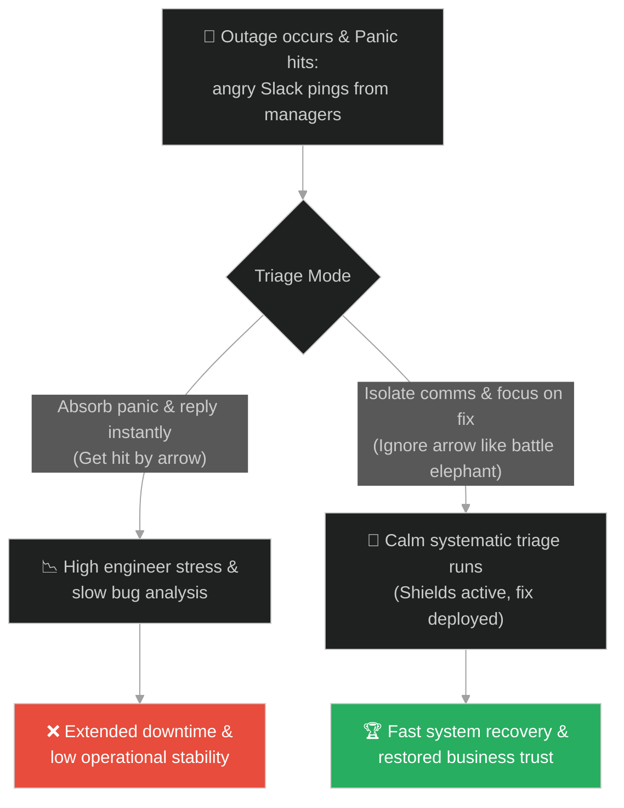
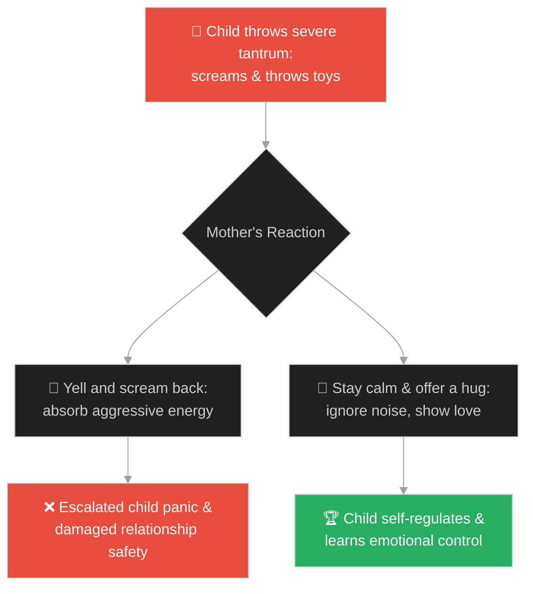
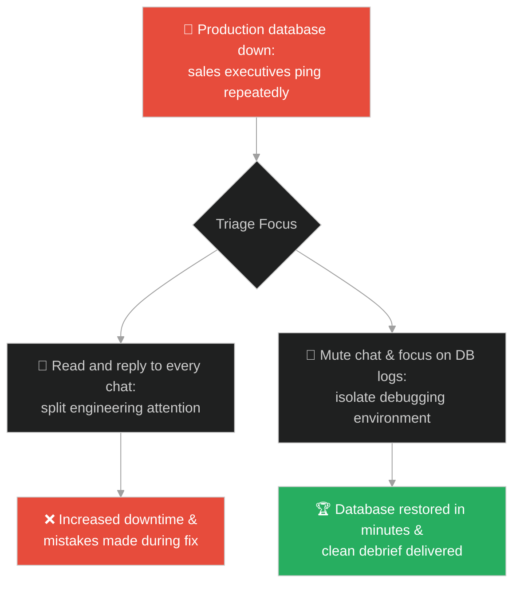
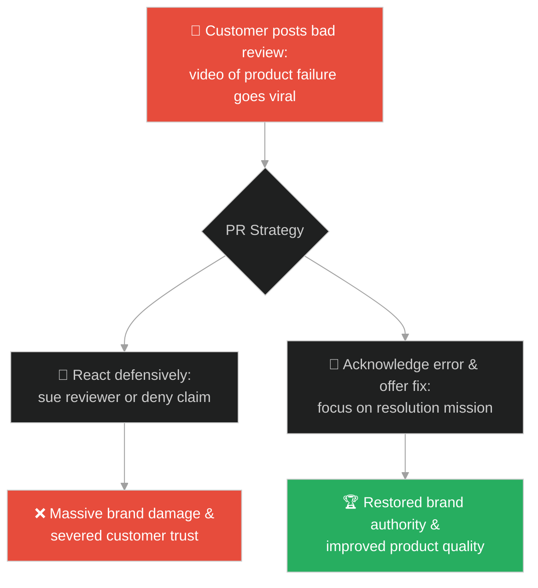
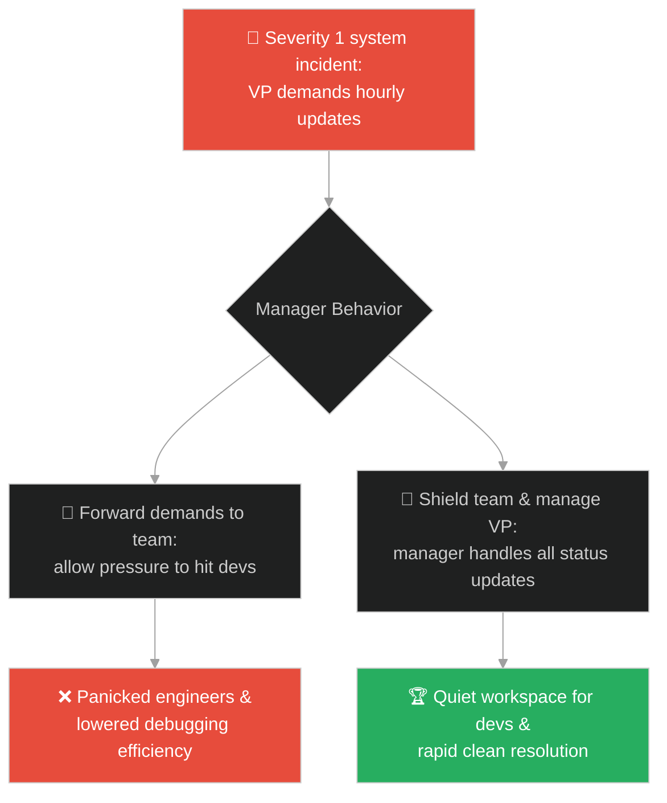
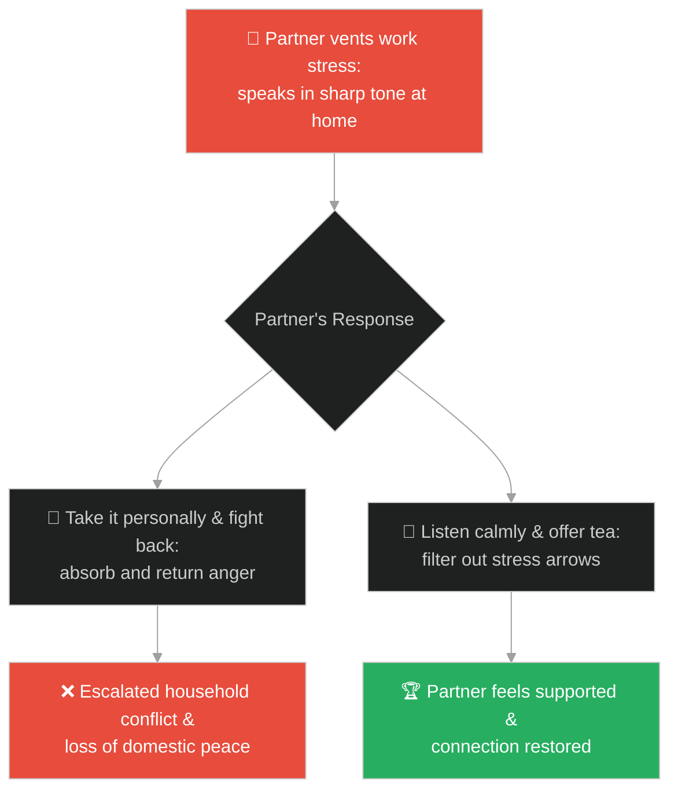
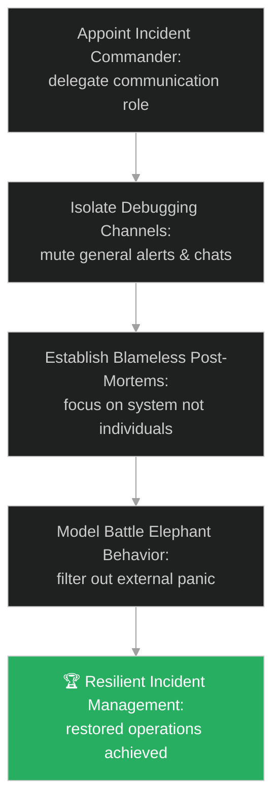

# Resilience Under Pressure & Incident Triage (ការរក្សាលំនឹងក្រោមសម្ពាធ និងការដោះស្រាយបញ្ហាបន្ទាន់)៖ ដំរីសឹក (Resilience Under Pressure & Incident Triage & The Battle Elephant)

**Author:** ichamrong  
**Date:** 2026-05-28  
**Tags:** #buddhism #resilience #incident-triage #outage #pressure #calmness #stoicism  
**Category:** Concepts / Parables  
**Read Time:** ~15 min  

---

## 📌 មាតិកា (Table of Contents)
- [អន្ទាក់ផ្លូវចិត្ត (The Trap)](#0)
- [១. រឿងព្រេងប្រវត្តិសាស្ត្រ៖ ដំរីសឹកក្នុងសមរភូមិ (The Legend of the Battle Elephant)](#1)
  - [ការធន់នឹងព្រួញសត្រូវគ្រប់ទិសទី (Withstanding the Arrows of the Battlefield)](#1-1)
- [២. បញ្ហា៖ ការស្លន់ស្លោក្នុងពេលជួបបញ្ហាប្រព័ន្ធ និងការរំខានការងារវិស្វករ (The Issue: Operational Panic and Interrupted Triage)](#2)
- [៣. ឧទាហមណ៍ជាក់ស្តែងក្នុងពិភពពិត (Real World Examples)](#3)
  - [ឧទាហរណ៍ទី ១ — កម្រិតស្រាល (គ្រួសារ)៖ ការរក្សាភាពស្ងប់ស្ងាត់ពេលកូនខឹងខ្លាំង (Staying Calm During Child's Aggressive Tantrums)](#3-1)
  - [ឧទាហរណ៍ទី ២ — កម្រិតមធ្យម (បច្ចេកទេស)៖ ការដោះស្រាយបញ្ហា Outage ក្រោមការស្លន់ស្លោរបស់អ្នកគ្រប់គ្រង (Incident Triage Under Intense Manager Panic)](#3-2)
  - [ឧទាហរណ៍ទី ៣ — កម្រិតមធ្យម (ធុរកិច្ច)៖ ការឆ្លើយតបនឹងការរិះគន់ម៉ាកសញ្ញាជាសាធារណៈ (Responding to Brand PR Crisis Without Defensiveness)](#3-3)
  - [ឧទាហរណ៍ទី ៤ — កម្រិតមធ្យម (សង្គម/គ្រប់គ្រង)៖ ការការពារវិស្វករពីសម្ពាធថ្នាក់លើ (Managers Shielding Engineers from High Executive Pressure)](#3-4)
  - [ឧទាហរណ៍ទី ៥ — កម្រិតធ្ងន់ (ទំនាក់ទំនង)៖ ការស្តាប់ដោយការអត់ធ្មត់ពេលដៃគូបញ្ចេញស្ត្រេសការងារ (Listening to Partner's Work Venting Without Taking It Personally)](#3-5)
- [៤. ដំណោះស្រាយទូទៅ៖ ការបង្កើតរបាំងការពារការស្លន់ស្លោ និងការគ្រប់គ្រងបញ្ហាដោយសតិ (The General Solution: Implementing Panic Bulkheads and Mindful Incident Command Loops)](#4)
- [សេចក្តីសន្និដ្ឋាន (Conclusion)](#5)
- [ឯកសារយោង (References)](#6)
- [Related Posts](#7)

---

<a id="0"></a>
## អន្ទាក់ផ្លូវចិត្ត (The Trap)

តើអ្នកធ្លាប់ជួបស្ថានភាពដែលប្រព័ន្ធបច្ចេកវិទ្យាធ្លាក់ចុះ (Production Outage) រួចនាយកប្រតិបត្តិ និងអ្នកគ្រប់គ្រងជាច្រើនចូលមកសួរដេញដោល និងស្រែកបន្ទោសវិស្វករក្នុងឆានែល Slack រៀងរាល់ ២នាទីម្តង ធ្វើឱ្យវិស្វករគ្មានពេលរកកូដខូចដើម្បីជួសជុលដែរឬទេ?

នៅក្នុងស្ថានភាពតានតឹង និងការដោះស្រាយបញ្ហា៖
* **យើងងាយនឹងធ្លាក់ក្នុងអន្ទាក់** នៃការស្រូបយកថាមពលស្លន់ស្លោ (Panic) និងការខឹងសម្បារពីមជ្ឈដ្ឋានជុំវិញខ្លួន។ យើងព្យាយាមឆ្លើយតបទៅកាន់រាល់ព្រួញរិះគន់ ឬសំណួររំខាន ដែលធ្វើឱ្យយើងបាត់បង់ការផ្តោតអារម្មណ៍លើបេសកកម្មស្នូល។
* **យើងមើលរំលង** ថាភាពស្ងប់ស្ងាត់ និងលំនឹងចិត្តដូចជាដំរីសឹកដ៏រឹងមាំក្នុងសមរភូមិ គឺជាខែលការពារដ៏ល្អបំផុតដែលជួយឱ្យយើងមានសមត្ថភាពវិនិច្ឆ័យបញ្ហាបានលឿន និងត្រឹមត្រូវបំផុត។

ការបណ្តោយឱ្យសម្ពាធខាងក្រៅមកបំផ្លាញការផ្តោតអារម្មណ៍របស់ខ្លួន ហៅថា **អន្ទាក់ស្លន់ស្លោក្នុងសមរភូមិ (The Battle Panic Trap)**។

ដើម្បីយល់ដឹងពីរបៀបកសាងលំនឹងចិត្តក្រោមសម្ពាធ នេះជាផែនទីបង្ហាញផ្លូវ៖
1. **រឿងព្រេងនិទាន (The Legend)** — រឿងរ៉ាវរបស់ព្រះពុទ្ធដែលសម្តែងប្រៀបធៀបព្រះអង្គទៅនឹងដំរីសឹកដ៏អង់អាចក្នុងសមរភូមិ ដែលអត់ធ្មត់នឹងព្រួញទាំងឡាយដែលបាញ់មកពីគ្រប់ទិសទី ដើម្បីសម្រេចគោលដៅ។
2. **បញ្ហា (The Issue)** — ការវិភាគការស្លន់ស្លោក្នុងពេលដោះស្រាយបញ្ហា និងសារៈសំខាន់នៃ Incident Commander ក្នុង SRE។
3. **ឧទាហមណ៍ជាក់ស្តែងក្នុងពិភពពិត (Real World Examples)** — ពិនិត្យមើលបញ្ហានេះក្នុងកម្រិតគ្រួសារ បច្ចេកវិទ្យា ធុរកិច្ច ការគ្រប់គ្រង និងទំនាក់ទំនង។
4. **ដំណោះស្រាយទូទៅ (The General Solution)** — ការអនុវត្តយន្តការការពារការរំខាន (Incident Communication Isolation) និងការបែងចែកតួនាទីច្បាស់លាស់។



---

<a id="1"></a>
## ១. រឿងព្រេងប្រវត្តិសាស្ត្រ៖ ដំរីសឹកក្នុងសមរភូមិ (The Legend of the Battle Elephant)

ក្នុងសម័យពុទ្ធកាល ព្រះសម្មាសម្ពុទ្ធទ្រង់បានប្រឈមមុខនឹងពាក្យជេរប្រមាថ និងការចោទប្រកាន់ជាច្រើនពីសំណាក់ជនពាល ឬអ្នកដែលមានគំនិតប្រឆាំងនឹងព្រះអង្គ។ ព្រះអានន្ទមានការអាក់អន់ចិត្តយ៉ាងខ្លាំង ហើយបានទូលសុំឱ្យព្រះពុទ្ធយាងចាកចេញទៅកាន់ក្រុងផ្សេងទៀត។

ព្រះពុទ្ធទ្រង់បានសួរថា៖ *«អានន្ទ! ចុះបើក្រុងនោះនៅតែមានគេជេរប្រមាថទៀត តើយើងត្រូវទៅណា?»*
ព្រះអានន្ទទូលថា៖ *«យើងនឹងយាងទៅក្រុងបន្ទាប់ទៀត ព្រះអង្គ»*។ ព្រះពុទ្ធមានសង្ឃដីកាដាស់តឿនថា៖
> «អានន្ទ! ការធ្វើបែបនោះមិនត្រឹមត្រូវឡើយ។ បញ្ហាកើតឡើងនៅកន្លែងណា យើងត្រូវដោះស្រាយវានៅកន្លែងនោះឱ្យចប់សិន មុននឹងចាកចេញទៅ។»

---

<a id="1-1"></a>
### ការធន់នឹងព្រួញសត្រូវគ្រប់ទិសទី (Withstanding the Arrows of the Battlefield)

ព្រះសម្មាសម្ពុទ្ធទ្រង់បានសម្តែងគាថាប្រៀបធៀបដ៏ល្បីល្បាញថា៖
> «តថាគតនឹងអត់ធ្មត់ចំពោះពាក្យជេរប្រមាថ និងការចោទប្រកាន់ទាំងឡាយ ដូចជា **ដំរីសឹកដ៏អង់អាចក្នុងសមរភូមិ** ដែលធន់ទ្រាំនឹងព្រួញបាញ់មកពីធ្នូរបស់សត្រូវគ្រប់ទិសទីដូច្នោះដែរ។ ពីព្រោះមនុស្សភាគច្រើននៅក្នុងលោកនេះ គឺខ្វះសីលធម៌ និងមិនទាន់បានអប់រំចិត្តឡើយ។»

ដំរីសឹកដ៏ល្អ មិនមែនជាដំរីដែលរត់គេចពីសមរភូមិនៅពេលឃើញសត្រូវបាញ់ព្រួញដាក់នោះទេ ប៉ុន្តែជាដំរីដែលឈរយ៉ាងរឹងមាំ អត់ធ្មត់នឹងការឈឺចាប់ និងបោះជំហានទៅមុខដើម្បីសម្រេចបេសកកម្មរបស់ខ្លួន។

---

<a id="2"></a>
## ២. បញ្ហា៖ ការស្លន់ស្លោក្នុងពេលជួបបញ្ហាប្រព័ន្ធ និងការរំខានការងារវិស្វករ (The Issue: Operational Panic and Interrupted Triage)

នៅក្នុងប្រតិបត្តិការបច្ចេកវិទ្យា (DevOps/SRE) នៅពេលប្រព័ន្ធជួបប្រទះការរំខានធ្ងន់ធ្ងរ (Severity 1 Outage) បញ្ហាដ៏ធំបំផុតគឺការស្លន់ស្លោរបស់អ្នកគ្រប់គ្រង និងថ្នាក់ដឹកនាំ។ ពួកគេចូលមកសាកសួរ និងទាមទារការបញ្ជាក់ស្ថានភាពក្នុងឆានែលដោះស្រាយបញ្ហា (Incident Response Channel) ធ្វើឱ្យវិស្វករត្រូវជាប់រវល់សរសេររបាយការណ៍ និងមិនអាចស្វែងរកឬសគល់នៃបញ្ហាបានឡើយ។

នេះជាឧទាហរណ៍នៃការដោះស្រាយបញ្ហាដែលគ្មានការការពារ និងពោរពេញដោយការរំខាន៖

```java
// ឧទាហរណ៍នៃប្រព័ន្ធឆ្លើយតបបញ្ហាដែលខ្វះខែលការពារ (Fragile Incident Command)
public class UnprotectedIncidentHandler {
    private boolean isSystemFixed = false;
    
    public void triageOutage(String managerPanicMessage) {
        // អន្ទាក់៖ វិស្វករត្រូវបង្ខំចិត្តឆ្លើយតបរាល់ pings ស្លន់ស្លោរបស់ប្រធាន
        System.out.println("Answering manager update query: " + managerPanicMessage);
        
        // ការដោះស្រាយបញ្ហាត្រូវពន្យារពេល ព្រោះត្រូវបែកអារម្មណ៍
        spendTimeToWriteStatusReport();
    }
    
    private void spendTimeToWriteStatusReport() {
        System.out.println("Writing long operational report instead of debugging.");
    }
}
```

* **ការកើនឡើងនៃរយៈពេលដោះស្រាយ (Mean Time to Resolution - MTTR)៖** ការរំខានរៀងរាល់ ២នាទីម្តង ជម្រុញឱ្យវិស្វករបាត់បង់ការផ្តោតអារម្មណ៍ និងចំណាយពេលយូរជាងមុនក្នុងការជួសជុលប្រព័ន្ធ។
* **ការសម្រេចចិត្តខុសឆ្គង (Bad Technical Triage)៖** ក្រោមសម្ពាធ និងការស្លន់ស្លោ វិស្វករងាយនឹងសម្រេចចិត្តខុស (ដូចជា ការលុបទិន្នន័យចោលដោយច្រឡំ) ដែលធ្វើឱ្យបញ្ហាកាន់តែធ្ងន់ធ្ងរ។

---

<a id="3"></a>
## ៣. ឧទាហមណ៍ជាក់ស្តែងក្នុងពិភពពិត

---

<a id="3-1"></a>
### ឧទាហរណ៍ទី ១ — កម្រិតស្រាល (គ្រួសារ)៖ ការរក្សាភាពស្ងប់ស្ងាត់ពេលកូនខឹងខ្លាំង (Staying Calm During Child's Aggressive Tantrums)

កូនតូចម្នាក់យំស្រែក និងគប់របស់របរលេងដាក់ម្តាយ ព្រោះចង់បានស្ករគ្រាប់បន្ថែម។ ជំនួសឱ្យការស្រែកគំហកត្រឡប់ទៅវិញដោយកំហឹង (ស្រូបយកព្រួញកំហឹង) ម្តាយបានឱនចុះឱបកូនយ៉ាងស្ងៀមស្ងាត់ និងរង់ចាំរហូតដល់កូនស្ងប់ចិត្ត រួចណែនាំកូនដោយភាពអត់ធ្មត់។



---

<a id="3-2"></a>
### ឧទាហរណ៍ទី ២ — កម្រិតមធ្យម (បច្ចេកទេស)៖ ការដោះស្រាយបញ្ហា Outage ក្រោមការស្លន់ស្លោរបស់អ្នកគ្រប់គ្រង (Incident Triage Under Intense Manager Panic)

ប្រព័ន្ធទូទាត់ប្រាក់ដួលរលំ។ ប្រធានផ្នែកលក់ខឹងសម្បារ និងផ្ញើ pings រំខានក្នុង Slack។ វិស្វករជាន់ខ្ពស់សម្រេចចិត្តបិទការជូនដំណឹង Slack (Mute Notifications) រួចដំណើរការដោះស្រាយបញ្ហាតាមលំដាប់លំដោយរហូតដល់ប្រព័ន្ធដំណើរការធម្មតាឡើងវិញ មុននឹងចេញមកពន្យល់ពីបញ្ហា។



---

<a id="3-3"></a>
### ឧទាហរណ៍ទី ៣ — កម្រិតមធ្យម (ធុរកិច្ច)៖ ការឆ្លើយតបនឹងការរិះគន់ម៉ាកសញ្ញាជាសាធារណៈ (Responding to Brand PR Crisis Without Defensiveness)

ក្រុមហ៊ុនមួយទទួលបានការរិះគន់យ៉ាងខ្លាំងលើបណ្តាញសង្គមអំពីបញ្ហាគុណភាពផលិតផល។ ជំនួសឱ្យការចេញមកប្រកែកការពារខ្លួន ឬប្តឹងគំរាមកំហែងអ្នករិះគន់ (ដែលជាការរត់តាមព្រួញសត្រូវ) ក្រុមហ៊ុនបានចេញរបាយការណ៍ស៊ើបអង្កេត និងផ្តល់សំណងភ្លាមៗ ធ្វើឱ្យកេរ្តិ៍ឈ្មោះម៉ាកកាន់តែរឹងមាំ។



---

<a id="3-4"></a>
### ឧទាហរណ៍ទី ៤ — កម្រិតមធ្យម (សង្គម/គ្រប់គ្រង)៖ ការការពារវិស្វករពីសម្ពាធថ្នាក់លើ (Managers Shielding Engineers from High Executive Pressure)

ក្នុងអំឡុងពេលប្រព័ន្ធដួលរលំ ប្រធានក្រុមការងារម្នាក់ (Engineering Manager) ដើរតួជាខែលការពារ ដោយគាត់ជាអ្នកចេញមុខឆ្លើយសំណួររបស់នាយកប្រតិបត្តិ និងសម្របសម្រួលព័ត៌មានខាងក្រៅ ជួយឱ្យវិស្វករជាន់ក្រោមទាំងអស់ អាចធ្វើការងារជួសជុលកូដដោយស្ងប់ចិត្ត និងគ្មានសម្ពាធ។



---

<a id="3-5"></a>
### ឧទាហរណ៍ទី ៥ — កម្រិតធ្ងន់ (ទំនាក់ទំនង)៖ ការស្តាប់ដោយការអត់ធ្មត់ពេលដៃគូបញ្ចេញស្ត្រេសការងារ (Listening to Partner's Work Venting Without Taking It Personally)

ប្រពន្ធត្រលប់មកផ្ទះវិញទាំងហត់នឿយ និងនិយាយស្តីគំរោះគំរើយខ្លះៗដោយសារខឹងនឹងប្រធានការងារ។ ប្តីដឹងថាភាពតានតឹងនេះមិនមែនសំដៅលើគាត់ឡើយ ( ignores the arrow noise) ក៏បានរៀបចំកែវទឹកក្តៅ និងស្តាប់នាងដោយចិត្តត្រជាក់ ជួយកាត់បន្ថយជម្លោះក្នុងផ្ទះ។



---

<a id="4"></a>
## ៤. ដំណោះស្រាយទូទៅ៖ ការបង្កើតរបាំងការពារការស្លន់ស្លោ និងការគ្រប់គ្រងបញ្ហាដោយសតិ (The General Solution: Implementing Panic Bulkheads and Mindful Incident Command Loops)

ដើម្បីដោះស្រាយបញ្ហាបន្ទាន់ដោយជោគជ័យ និងរក្សាលំនឹងចិត្តក្រោមសម្ពាធ ចូរអនុវត្តយន្តការដូចខាងក្រោម៖



* **ការបែងចែកតួនាទីក្នុងការដោះស្រាយបញ្ហា (Incident Command System)៖** នៅពេលមានបញ្ហាធំ ត្រូវតែងតាំង **Incident Commander (IC)** ម្នាក់ដែលមិនបាច់ជួសជុលកូដ តែមានតួនាទីតែមួយគត់គឺការទាក់ទងសម្របសម្រួល និងឆ្លើយសំណួរថ្នាក់ដឹកនាំ ដើម្បីការពារកុំឱ្យវិស្វករដទៃទៀត (Ops/Devs) ត្រូវរំខាន។
* **ការអនុវត្តការស៊ើបអង្កេតដោយមិនបន្ទោសបុគ្គល (Blameless Post-Mortems)៖** បន្ទាប់ពីដោះស្រាយបញ្ហារួច ត្រូវផ្តោតការវិភាគលើ «ហេតុអ្វីបានជាប្រព័ន្ធខូច?» មិនមែន «នរណាជាអ្នកធ្វើឱ្យខូច?» ដើម្បីជម្រុញការរាយការណ៍បញ្ហាដោយស្មោះត្រង់។
* **ច្បាប់ដំរីសឹកក្នុងពេលការងារ (The Battle Elephant Protocol)៖**
  1. **កុំស្រូបយកកំហឹង**៖ យល់ដឹងថាពាក្យសម្តីអាក្រក់ ឬការស្លន់ស្លោរបស់អតិថិជន និងប្រធាន គឺជាការបង្ហាញពីការភ័យខ្លាចរបស់ពួកគេ មិនមែនជាការវាយប្រហារលើរូបអ្នកឡើយ។
  2. **រក្សាការផ្តោតអារម្មណ៍**៖ នៅក្នុងស្ថានភាពអាសន្ន ចូររក្សាស្មារតីឱ្យនឹងធឹង និងសួរខ្លួនឯងថា «តើបេសកកម្មសំខាន់បំផុតបច្ចុប្បន្នដែលខ្ញុំត្រូវដោះស្រាយគឺជាអ្វី?» រួចធ្វើការងារនោះដោយមិនខ្វល់ពីសំឡេងរំខាន។

---

## 🐇 ធ្លាក់ចូលក្នុងរន្ធទន្សាយ (Enter the Rabbit Hole)

ដើម្បីស្វែងយល់កាន់តែស៊ីជម្រៅអំពីរបៀបកសាងប្រព័ន្ធ និងចិត្តការងារដែលមិនរក្សាទុក ឬស្រូបយកភាពមិនបរិសុទ្ធពីអតីតកាល ប៉ុន្តែឆ្លុះបញ្ចាំងអ្វីៗគ្រប់យ៉ាងដោយសេរីដូចជាកញ្ចក់ថ្លា សូមចាប់ផ្តើមដំណើររុករករបស់អ្នកដោយចុចលើតំណភ្ជាប់ខាងក្រោម៖

* 🚀 **[ចាប់ផ្តើមដំណើររុករក (Start the Journey) ➔ ស្ថាបត្យកម្មកូដគ្មានស្ថានភាព និងការឆ្លុះបញ្ចាំង (Stateless Processing & Idempotent Handlers)](./139-buddha-and-the-mirror.md)**

---

<a id="5"></a>
## សេចក្តីសន្និដ្ឋាន (Conclusion)

> **«ព្រួញរាប់រយដែលបាញ់មកក្នុងសមរភូមិ មិនអាចធ្វើឱ្យដំរីសឹកដ៏អង់អាចរង្គោះរង្គើបានឡើយ។ លំនឹងចិត្តក្រោមសម្ពាធ គឺជាអំណាចពិតប្រាកដដែលនាំទៅរកជ័យជម្នះ។»**

ភាពជាអ្នកដឹកនាំ និងវិជ្ជាជីវៈពិតប្រាកដត្រូវបានបង្ហាញឡើងក្នុងកម្រិតខ្ពស់បំផុតក្នុងកំឡុងពេលជួបវិបត្តិ។ ការរក្សាបាននូវភាពស្ងប់ស្ងាត់ ការបង្កើតរបាំងការពារការស្លន់ស្លោ និងការផ្តោតលើការដោះស្រាយបញ្ហាដោយសតិ ជួយឱ្យយើងអាចឆ្លងកាត់រាល់ព្យុះការងារ និងជីវិតប្រកបដោយភាពជោគជ័យ និងសន្តិភាពជានិរន្តរ៍។

---

<a id="6"></a>
## ឯកសារយោង (References)

* **Dhammapada (Verse 320-322 - Naga Vagga: The Elephant)** — Canonical Buddhist texts containing the Buddha's verses on comparing himself to a battle elephant enduring arrows.
* **Niall Richard Murphy, Betsy Beyer & Jennifer Petoff** — *Site Reliability Engineering: How Google Runs Production Systems* (2016). Chapters on managing incidents and blameless post-mortem patterns.
* **Ryan Holiday** — *The Obstacle Is the Way: The Timeless Art of Turning Trials into Triumph* (2014). Modern Stoic guide on maintaining emotional control under heavy pressure.

---

<a id="7"></a>
## Related Posts

* [The Raft](./11-the-baker-and-the-butcher.md) — Isolating dynamic values and securing transaction balance.
* [The 84th Problem](./137-buddha-and-the-84th-problem.md) — Accepting system noise and relinquishing unachievable control.
